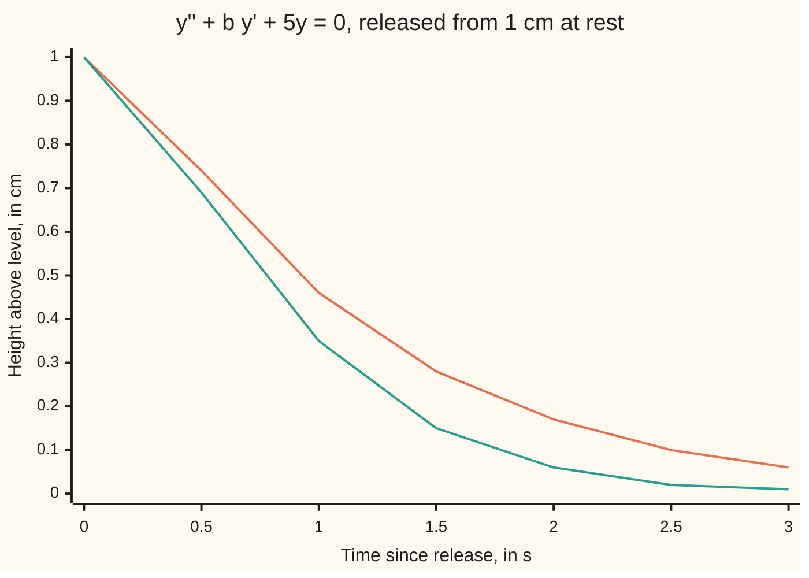

# The characteristic equation: guess an exponential and the differential equation becomes a quadratic

[Syllabus](../../../SYLLABUS.md) → [Differential equations and dynamics](../README.md) → [Oscillators - Second-Order Linear Equations](../README.md#s03) → The characteristic equation

---

## General Overview

A car goes over a bump. The body ends up 1 cm above its resting height, momentarily still. The spring pulls it back toward level, harder the higher it is. The shock absorber, a piston pushing oil through small holes, drags against the motion, harder the faster it moves.

With the spring's pull at 5 cm/s^2 per cm of height and a damper setting of 6 per second, the height t seconds after release is 1.25e^(−t) − 0.25e^(−5t) cm. It sinks without crossing level and is within 0.05 cm of level after 3.22 s. Tune the damper down to 4.472 per second and the height is (1 + 2.236t)e^(−2.236t): the same smooth return, done by 2.12 s.

Neither answer needed an integral. Guessing an exponential turns the differential equation into a quadratic, whose two roots are the rates in the exponents. When the roots coincide, time times the exponential fills the gap.

**An exponential solves a linear equation with constant coefficients exactly when its rate solves a quadratic; two real roots give two exponentials to mix, and a repeated root r gives e^(rt) and t e^(rt).**

**What kind of fact this is:** a method, and the claim that it finds every solution is a theorem, proved on this card in Why it works.

### The picture: two shock absorbers after the same bump



Orange: damper 6 per second, roots −1 and −5. Teal: damper 4.472 per second, the root −2.236 twice. Neither crosses zero; teal settles sooner.

---

## The formula

Reminder: a differential equation links an unknown function to its own rates; y' is the rate of y, y'' the rate of y' ([A differential equation](../01-Rate%20Equations/01-what-a-differential-equation-says.md)). Here the acceleration y'' equals −5y − b y': the spring's pull minus the damper's drag.

$$a\,y'' + b\,y' + c\,y = 0 \qquad\longrightarrow\qquad a\,r^2 + b\,r + c = 0$$

**Read it aloud:** replace the second rate by r squared, the first rate by r and y by 1; the roots r are the rates of the exponential solutions.

The quadratic is the **characteristic equation**. Its discriminant, $\Delta = b^2 - 4ac$, sorts the cases:

$$\Delta > 0:\quad y = C_1 e^{r_1 t} + C_2 e^{r_2 t}, \qquad r_{1,2} = \frac{-b \pm \sqrt{\Delta}}{2a}$$

**Read it aloud:** two real roots give two exponentials, mixed in amounts fixed by the start.

$$\Delta = 0:\quad y = (C_1 + C_2\,t)\,e^{r t}, \qquad r = -\frac{b}{2a}$$

**Read it aloud:** one repeated root gives its exponential times a straight line in t.

For the car, a = 1, c = 5 and b is the damper setting. A negative discriminant gives complex roots, handled on [Complex roots](03-complex-roots-and-damped-oscillation.md).

| Symbol | Plain meaning | In our example | Push it up and the answer… |
| --- | --- | --- | --- |
| $t$ | time since release, in s | 0 to 3 s | the height shrinks |
| $y$, $y'$, $y''$ | height above level, its velocity, its acceleration | y(0) = 1 cm, y'(0) = 0 cm/s | — |
| $a$, $b$, $c$ | constant multipliers of acceleration, velocity, height | a = 1; b = 6 or 4.472 per s; c = 5 per s^2 | b past critical: slower creep; c past b^2/4a: bouncing |
| $\Delta$ | the discriminant, b^2 − 4ac; its sign picks the case | 16 at b = 6; 0 at b = 4.472 | — |
| $r$, $r_1$, $r_2$ | roots: decay rates, in per s | −1 and −5; −2.236 twice | nearer zero: slower settling |
| $C_1$, $C_2$ | amounts of each shape, fixed by the start | 1.25 and −0.25; 1 and 2.236 | — |
| $u$ | the factor in y = e^(rt) u | 1 + 2.236t | — |
| $h$ | Euler's step length, in s | 0.01, 0.005, 0.0025 | bigger error |

### When it holds

- **Linear:** y and its rates are never squared or multiplied together. Otherwise a sum of solutions is not a solution, and mixing fails.
- **Constant coefficients:** for t^2 y'' + t y' − y = 0 the guess e^t leaves 1.00 e^t at t = 1 and 5.00 e^t at t = 2, so no rate r works; see [The Cauchy-Euler equation](09-the-cauchy-euler-equation.md).
- **Right side zero:** a road that keeps shaking the car adds a term, handled on [Undetermined coefficients](05-undetermined-coefficients.md).
- **a not zero:** otherwise the equation is first-order.

---

## Why it works

### Step 0: an exponential keeps its shape when differentiated

The rate of e^(rt) is r e^(rt), by the chain rule, and its second rate is r^2 e^(rt). So a y'' + b y' + c y, applied to an exponential, is that exponential times a number, and the equation asks for the number to be zero. The same move, with r^n, solves recurrences on [The characteristic equation](../../04-Combinatorics%20and%20graphs/05-Recurrences/04-characteristic-equation-and-binet.md).

### Step 1: the substitution leaves a quadratic

Put y = e^(rt) in:

$$a\,r^2 e^{rt} + b\,r\,e^{rt} + c\,e^{rt} = (a r^2 + b r + c)\,e^{rt}.$$

An exponential is never zero, so this vanishes for every t exactly when a r^2 + b r + c = 0. For b = 6: r^2 + 6r + 5 = (r + 1)(r + 5), roots −1 and −5, by the [The quadratic formula](../../03-Algebra/02-Polynomials/03-quadratic-formula.md) or by bisection, which halves a bracket around each root.

### Step 2: two roots, two shapes, fitted to the start

The equation is linear, so any mix C1 e^(r1 t) + C2 e^(r2 t) solves it ([Superposition](01-superposition-and-the-shape-of-linear-solutions.md)). Two amounts can match two facts: starting height and starting velocity.

At t = 0 the height is C1 + C2 and the velocity is r1 C1 + r2 C2. For the car: C1 + C2 = 1 and −C1 − 5C2 = 0. So C2 = −0.25 and C1 = 1.25.

A solution is fixed by its height and velocity at one moment, so this mix is the car's motion and nothing else is. Any start can be matched: the two equations have determinant r2 − r1 (the number that must be nonzero for exactly one answer), and it is not zero.

### Step 3: a repeated root needs t e^(rt)

At b = 4.472 the roots merge into −2.236. The mix C1 e^(rt) + C2 e^(rt) is only (C1 + C2)e^(rt): one amount, one fact. Matching the height 1 cm leaves the velocity at −2.236 cm/s, not 0.

Write y = e^(rt) u with u unknown. The product rule turns the equation into

$$a\,u'' + (2ar + b)\,u' + (a r^2 + b r + c)\,u = 0.$$

The last bracket is zero since r is a root; the middle one is zero since a repeated root sits at r = −b/(2a). So u'' = 0 and u = C1 + C2 t. The start gives C1 = 1, C2 = 2.236. The extra t is forced, not guessed.

<details>
<summary>Detailed proof: the reduction, and why nothing is missed</summary>

Let r be a root of a r^2 + b r + c = 0 and set y = e^(rt) u(t). Then y' = e^(rt)(u' + r u) and y'' = e^(rt)(u'' + 2r u' + r^2 u). Substituting,
a y'' + b y' + c y = e^(rt) [a u'' + (2ar + b) u' + (a r^2 + b r + c) u].
The exponential never vanishes, so y solves the equation exactly when the bracket is zero. The last coefficient is zero because r is a root. A repeated root makes the quadratic a(x − r)^2, whose middle coefficient gives b = −2ar. The bracket is then a u'', so u'' = 0. A zero rate means a constant (mean value theorem), so u' = C2 and u = C1 + C2 t.

Completeness. At t = 0, (C1 + C2 t)e^(rt) has height C1 and velocity r C1 + C2, so any start y0, v0 is met by C1 = y0, C2 = v0 − r y0. In the distinct case, C1 + C2 = y0 and r1 C1 + r2 C2 = v0 have determinant r2 − r1, not zero. Two solutions of a linear equation with the same height and velocity at one moment agree everywhere (existence and uniqueness). So these families hold every solution.

</details>

### Step 4: a negative discriminant

With b = 2 the discriminant is −16 and the roots −1 ± 2i. The algebra still holds; making the complex exponentials into a real bounce is [Complex roots](03-complex-roots-and-damped-oscillation.md).

A second route treats height and velocity as one pair driven by a 2-by-2 matrix, whose eigenvalues are the roots r: [From one equation to a system](../04-Systems%20and%20the%20Matrix%20Exponential/01-from-one-equation-to-a-system.md).

---

## Worked numbers, by hand

| Step | Arithmetic | Value |
| --- | --- | --- |
| discriminant, b = 6 | 36 − 20 | 16 |
| roots | (−6 ± 4)/2 | −1 and −5 |
| fit the start | C1 + C2 = 1, −C1 − 5C2 = 0 | C1 = 1.25, C2 = −0.25 |
| height at 1 s | 1.25e^(−1) − 0.25e^(−5) | **0.458165 cm** |
| critical damper | b = 2√5, discriminant 0 | 4.472136 per s |
| repeated root | −b/2 | −2.236068 |
| fit the start | C1 = 1, C2 = 0 − (−2.236068)(1) | C1 = 1, C2 = 2.236068 |
| height at 1 s | (1 + 2.236068) × e^(−2.236068) | **0.345864 cm** |
| within 0.05 cm of level | solve y(t) = 0.05 by bisection | **3.22 s and 2.12 s** |

The softer damper settles the car in 2.12 s against 3.22 s, and neither overshoots.

### What breaks if you drop a piece

| Mistake | Comes out at | What went wrong |
| --- | --- | --- |
| Repeated root used once | y'(0) = −2.236 cm/s, not 0; y(1) = 0.1069 cm, not 0.3459 | t e^(rt) missing |
| Roots' signs flipped to +1 and +5 | y(1) = −33.71 cm | the minus on b dropped |
| Coefficients not constant: t^2 y'' + t y' − y = 0 | e^t leaves 1.00 e^t at t = 1 and 5.00 e^t at t = 2 | leftover changes with t; the power y = t leaves 0.00 |

The code prints all three.

---

## Code, from first principles, and it actually runs

Two roads to the motion: the closed form from the roots, and Euler's rule, which steps height and velocity forward by step length times rate and never calls exp ([Euler's method](../05-Numerical%20Evolution/01-eulers-method.md)). Its error halves with the step. The roots come from the formula and from bisection; a finite difference, change over a tiny interval divided by its length, confirms each answer obeys the law.

### Python

```python
# The characteristic equation -- the check behind the card.  Standard library
# only.  The shock absorber y'' + b y' + 5y = 0, y(0) = 1 cm, y'(0) = 0, is
# answered by two roads: the closed form built from the quadratic's roots, and
# Euler's small steps along the slope, which never call exp.  The roots are
# found twice: by the quadratic formula, and by bisection, which never calls sqrt.
import math
C = 5.0

def roots(b):                            # quadratic formula for r^2 + b r + C = 0
    d = math.sqrt(b * b - 4 * C)
    return (-b + d) / 2, (-b - d) / 2

def bisect(f, lo, hi):                   # f changes sign between lo and hi
    for _ in range(200):
        mid = (lo + hi) / 2
        lo, hi = (mid, hi) if f(lo) * f(mid) > 0 else (lo, mid)
    return (lo + hi) / 2

R1, R2 = roots(6.0)
C1 = (0 - R2 * 1) / (R1 - R2)            # from C1 + C2 = 1 and r1 C1 + r2 C2 = 0
over = lambda t: C1 * math.exp(R1 * t) + (1 - C1) * math.exp(R2 * t)
R = -math.sqrt(C)                        # b = 2 sqrt 5: the root repeats
crit = lambda t: (1 + (0 - R * 1) * t) * math.exp(R * t)
one = lambda t: math.exp(R * t)          # the repeated root used once, no t e^(rt)
def euler(b, t_end, h):                  # position += h velocity; velocity += h acceleration
    y, v = 1.0, 0.0
    for _ in range(round(t_end / h)):
        y, v = y + h * v, v + h * (-b * v - C * y)
    return y
def leftover(f, t, a, b, c, k=1e-3):     # a y'' + b y' + c y by finite differences
    return a * (f(t + k) - 2 * f(t) + f(t - k)) / k**2 + b * (f(t + k) - f(t - k)) / (2 * k) + c * f(t)

rb = (bisect(lambda r: r * r + 6 * r + C, -3, 0), bisect(lambda r: r * r + 6 * r + C, -6, -3))
bc, hs, ts = 2 * math.sqrt(C), (0.01, 0.005, 0.0025), [0.5 * i for i in range(7)]
e_over = [abs(euler(6, 1, h) - over(1)) for h in hs]
e_crit = abs(euler(bc, 1, 0.0025) - crit(1))
res = [leftover(over, 1, 1, 6, C), leftover(crit, 1, 1, bc, C)]
ce = [leftover(math.exp, t, t * t, t, -1) / math.exp(t) for t in (1, 2)] + [leftover(lambda s: s, 2, 4, 2, -1)]
fmt = lambda xs, d=2: " ".join(f"{x:.{d}f}" for x in xs)
print("y'' + b y' + 5y = 0, y(0) = 1 cm, y'(0) = 0 cm/s")
print(f"b = 6: discriminant {36 - 4 * C:.0f}; roots by formula {fmt((R1, R2), 6)}; by bisection {fmt(rb, 6)}")
print(f"b = 6: C1 = {C1:.4f}, C2 = {1 - C1:.4f}; y(1) = {over(1):.6f} cm")
print(f"b = 6, Euler y(1) at h = 0.01 0.005 0.0025: {fmt([euler(6, 1, h) for h in hs], 6)}")
print(f"errors: {fmt(e_over, 6)}; ratios on halving h: {e_over[0] / e_over[1]:.3f} {e_over[1] / e_over[2]:.3f}")
print(f"b = 2 sqrt 5 = {bc:.6f}: discriminant {bc * bc - 4 * C:.6f}; repeated root {R:.6f}; C1 = 1, C2 = {-R:.6f}")
print(f"critical: y(1) = {crit(1):.6f} cm; Euler h = 0.0025: {euler(bc, 1, 0.0025):.6f}; error {e_crit:.6f}")
print(f"law's leftover at t = 1 by finite differences, in millionths: b = 6 {abs(res[0]) * 1e6:.2f}; critical {abs(res[1]) * 1e6:.2f}")
print(f"figure, t (s):           {fmt(ts)}")
print(f"figure, b = 6 y (cm):    {fmt([over(t) for t in ts])}")
print(f"figure, critical y (cm): {fmt([crit(t) for t in ts])}")
print(f"within 0.05 cm of level: b = 6 after {bisect(lambda t: over(t) - 0.05, 0, 10):.2f} s; critical after {bisect(lambda t: crit(t) - 0.05, 0, 10):.2f} s")
print(f"mistake, one exponential at the repeated root: y'(0) = {R:.3f}, not 0; y(1) = {one(1):.4f}, not {crit(1):.4f}")
print(f"mistake, roots' signs flipped to +1 and +5: y(1) = {C1 * math.exp(-R1) + (1 - C1) * math.exp(-R2):.2f} cm")
print(f"hypothesis dropped, t^2 y'' + t y' - y = 0: e^t leaves {fmt(ce[:2])} times e^t at t = 1, 2; y = t leaves {abs(ce[2]):.2f}")
print(f"house b = 2: discriminant {4 - 4 * C:.0f}, roots -1 +/- 2i, complex")
assert max(abs(rb[0] - R1), abs(rb[1] - R2)) < 1e-12                  # formula against bisection
assert abs(euler(6, 1, 0.0025) - over(1)) < 1e-3 and 1.9 < e_over[0] / e_over[1] < 2.1  # steps meet roots
assert e_crit < 1e-3 and abs(euler(bc, 1, 0.0025) - one(1)) > 0.2      # t e^(rt) is the missing piece
assert max(abs(x) for x in res) < 1e-4                                # the answers obey the law
print("ALL CHECKS PASS")
```

**Ran 2026-09-28 on macOS, Python 3.14.6, standard library only. All checks passed. Output, pasted from the run:**

```
y'' + b y' + 5y = 0, y(0) = 1 cm, y'(0) = 0 cm/s
b = 6: discriminant 16; roots by formula -1.000000 -5.000000; by bisection -1.000000 -5.000000
b = 6: C1 = 1.2500, C2 = -0.2500; y(1) = 0.458165 cm
b = 6, Euler y(1) at h = 0.01 0.005 0.0025: 0.456060 0.457117 0.457642
errors: 0.002105 0.001048 0.000523; ratios on halving h: 2.008 2.004
b = 2 sqrt 5 = 4.472136: discriminant 0.000000; repeated root -2.236068; C1 = 1, C2 = 2.236068
critical: y(1) = 0.345864 cm; Euler h = 0.0025: 0.345036; error 0.000828
law's leftover at t = 1 by finite differences, in millionths: b = 6 0.30; critical 0.38
figure, t (s):           0.00 0.50 1.00 1.50 2.00 2.50 3.00
figure, b = 6 y (cm):    1.00 0.74 0.46 0.28 0.17 0.10 0.06
figure, critical y (cm): 1.00 0.69 0.35 0.15 0.06 0.02 0.01
within 0.05 cm of level: b = 6 after 3.22 s; critical after 2.12 s
mistake, one exponential at the repeated root: y'(0) = -2.236, not 0; y(1) = 0.1069, not 0.3459
mistake, roots' signs flipped to +1 and +5: y(1) = -33.71 cm
hypothesis dropped, t^2 y'' + t y' - y = 0: e^t leaves 1.00 5.00 times e^t at t = 1, 2; y = t leaves 0.00
house b = 2: discriminant -16, roots -1 +/- 2i, complex
ALL CHECKS PASS
```

### Rust

Same numbers, same labels, built with `rustc --edition 2021 -O`.

```rust
// The characteristic equation -- the same check as the Python, in Rust.  No
// crates.  The shock absorber y'' + b y' + 5y = 0, y(0) = 1 cm, y'(0) = 0, is
// answered by two roads: the closed form built from the quadratic's roots, and
// Euler's small steps along the slope, which never call exp.  The roots are
// found twice: by the quadratic formula, and by bisection, which never calls sqrt.
const C: f64 = 5.0;

fn roots(b: f64) -> (f64, f64) {                // quadratic formula for r^2 + b r + C = 0
    let d = (b * b - 4.0 * C).sqrt();
    ((-b + d) / 2.0, (-b - d) / 2.0)
}

fn bisect(f: &dyn Fn(f64) -> f64, mut lo: f64, mut hi: f64) -> f64 {
    for _ in 0..200 {                            // f changes sign between lo and hi
        let mid = (lo + hi) / 2.0;
        if f(lo) * f(mid) > 0.0 { lo = mid } else { hi = mid }
    }
    (lo + hi) / 2.0
}

fn euler(b: f64, t_end: f64, h: f64) -> f64 {   // position += h velocity; velocity += h acceleration
    let (mut y, mut v) = (1.0, 0.0);
    for _ in 0..(t_end / h).round() as usize { (y, v) = (y + h * v, v + h * (-b * v - C * y)) }
    y
}

fn leftover(f: &dyn Fn(f64) -> f64, t: f64, a: f64, b: f64, c: f64) -> f64 {
    let k = 1e-3;                                // a y'' + b y' + c y by finite differences
    a * (f(t + k) - 2.0 * f(t) + f(t - k)) / (k * k) + b * (f(t + k) - f(t - k)) / (2.0 * k) + c * f(t)
}

fn fmt(xs: &[f64], d: usize) -> String {
    xs.iter().map(|x| format!("{:.*}", d, x)).collect::<Vec<_>>().join(" ")
}

fn main() {
    let (r1, r2) = roots(6.0);
    let c1 = (0.0 - r2 * 1.0) / (r1 - r2);      // from C1 + C2 = 1 and r1 C1 + r2 C2 = 0
    let over = |t: f64| c1 * (r1 * t).exp() + (1.0 - c1) * (r2 * t).exp();
    let r = -C.sqrt();                           // b = 2 sqrt 5: the root repeats
    let crit = |t: f64| (1.0 + (0.0 - r * 1.0) * t) * (r * t).exp();
    let one = |t: f64| (r * t).exp();            // the repeated root used once, no t e^(rt)
    let p = |x: f64| x * x + 6.0 * x + C;
    let rb = [bisect(&p, -3.0, 0.0), bisect(&p, -6.0, -3.0)];
    let (bc, hs) = (2.0 * C.sqrt(), [0.01, 0.005, 0.0025]);
    let ts: Vec<f64> = (0..7).map(|i| 0.5 * i as f64).collect();
    let steps: Vec<f64> = hs.iter().map(|&h| euler(6.0, 1.0, h)).collect();
    let e_over: Vec<f64> = steps.iter().map(|y| (y - over(1.0)).abs()).collect();
    let e_crit = (euler(bc, 1.0, 0.0025) - crit(1.0)).abs();
    let res = [leftover(&over, 1.0, 1.0, 6.0, C), leftover(&crit, 1.0, 1.0, bc, C)];
    let ce: Vec<f64> = [1.0f64, 2.0].iter().map(|&t| leftover(&|s: f64| s.exp(), t, t * t, t, -1.0) / t.exp()).collect();
    let lin = leftover(&|s: f64| s, 2.0, 4.0, 2.0, -1.0);
    println!("y'' + b y' + 5y = 0, y(0) = 1 cm, y'(0) = 0 cm/s");
    println!("b = 6: discriminant {:.0}; roots by formula {}; by bisection {}", 36.0 - 4.0 * C, fmt(&[r1, r2], 6), fmt(&rb, 6));
    println!("b = 6: C1 = {:.4}, C2 = {:.4}; y(1) = {:.6} cm", c1, 1.0 - c1, over(1.0));
    println!("b = 6, Euler y(1) at h = 0.01 0.005 0.0025: {}", fmt(&steps, 6));
    println!("errors: {}; ratios on halving h: {:.3} {:.3}", fmt(&e_over, 6), e_over[0] / e_over[1], e_over[1] / e_over[2]);
    println!("b = 2 sqrt 5 = {:.6}: discriminant {:.6}; repeated root {:.6}; C1 = 1, C2 = {:.6}", bc, bc * bc - 4.0 * C, r, -r);
    println!("critical: y(1) = {:.6} cm; Euler h = 0.0025: {:.6}; error {:.6}", crit(1.0), euler(bc, 1.0, 0.0025), e_crit);
    println!("law's leftover at t = 1 by finite differences, in millionths: b = 6 {:.2}; critical {:.2}", res[0].abs() * 1e6, res[1].abs() * 1e6);
    println!("figure, t (s):           {}", fmt(&ts, 2));
    println!("figure, b = 6 y (cm):    {}", fmt(&ts.iter().map(|&t| over(t)).collect::<Vec<_>>(), 2));
    println!("figure, critical y (cm): {}", fmt(&ts.iter().map(|&t| crit(t)).collect::<Vec<_>>(), 2));
    println!("within 0.05 cm of level: b = 6 after {:.2} s; critical after {:.2} s",
             bisect(&|t| over(t) - 0.05, 0.0, 10.0), bisect(&|t| crit(t) - 0.05, 0.0, 10.0));
    println!("mistake, one exponential at the repeated root: y'(0) = {:.3}, not 0; y(1) = {:.4}, not {:.4}", r, one(1.0), crit(1.0));
    println!("mistake, roots' signs flipped to +1 and +5: y(1) = {:.2} cm", c1 * (-r1).exp() + (1.0 - c1) * (-r2).exp());
    println!("hypothesis dropped, t^2 y'' + t y' - y = 0: e^t leaves {} times e^t at t = 1, 2; y = t leaves {:.2}", fmt(&ce, 2), lin.abs());
    println!("house b = 2: discriminant {:.0}, roots -1 +/- 2i, complex", 4.0 - 4.0 * C);
    assert!((rb[0] - r1).abs().max((rb[1] - r2).abs()) < 1e-12);              // formula against bisection
    assert!(e_over[2] < 1e-3 && e_over[0] / e_over[1] > 1.9 && e_over[0] / e_over[1] < 2.1); // steps meet roots
    assert!(e_crit < 1e-3 && (euler(bc, 1.0, 0.0025) - one(1.0)).abs() > 0.2); // t e^(rt) is the missing piece
    assert!(res[0].abs().max(res[1].abs()) < 1e-4);                           // the answers obey the law
    println!("ALL CHECKS PASS");
}
```

**Ran 2026-09-28 on macOS, rustc 1.98.1, no crates. All checks passed. Output, pasted from the run:**

```
y'' + b y' + 5y = 0, y(0) = 1 cm, y'(0) = 0 cm/s
b = 6: discriminant 16; roots by formula -1.000000 -5.000000; by bisection -1.000000 -5.000000
b = 6: C1 = 1.2500, C2 = -0.2500; y(1) = 0.458165 cm
b = 6, Euler y(1) at h = 0.01 0.005 0.0025: 0.456060 0.457117 0.457642
errors: 0.002105 0.001048 0.000523; ratios on halving h: 2.008 2.004
b = 2 sqrt 5 = 4.472136: discriminant 0.000000; repeated root -2.236068; C1 = 1, C2 = 2.236068
critical: y(1) = 0.345864 cm; Euler h = 0.0025: 0.345036; error 0.000828
law's leftover at t = 1 by finite differences, in millionths: b = 6 0.30; critical 0.38
figure, t (s):           0.00 0.50 1.00 1.50 2.00 2.50 3.00
figure, b = 6 y (cm):    1.00 0.74 0.46 0.28 0.17 0.10 0.06
figure, critical y (cm): 1.00 0.69 0.35 0.15 0.06 0.02 0.01
within 0.05 cm of level: b = 6 after 3.22 s; critical after 2.12 s
mistake, one exponential at the repeated root: y'(0) = -2.236, not 0; y(1) = 0.1069, not 0.3459
mistake, roots' signs flipped to +1 and +5: y(1) = -33.71 cm
hypothesis dropped, t^2 y'' + t y' - y = 0: e^t leaves 1.00 5.00 times e^t at t = 1, 2; y = t leaves 0.00
house b = 2: discriminant -16, roots -1 +/- 2i, complex
ALL CHECKS PASS
```

> [!TIP]
> **Try changing**
> - **Stiffen the damper to b = 10.** Guess first: settled before or after 3.22 s? After: the slow root moves toward zero.
> - **Release with a downward push, y'(0) = −1.** Guess first: do the roots change? No; only C1 and C2 do.
> - **Call `roots(2)`.** Python stops with a math domain error, Rust returns NaN: −16 has no real square root. That is the complex case.
> - **Halve h once more.** Guess first: the error halves again.

---

## The usual mistake

> [!warning]
> **Writing C1 e^(rt) + C2 e^(rt) for a repeated root.** That is one shape, (C1 + C2)e^(rt), and it cannot match height and velocity together. For the car it gives 0.1069 cm at 1 s instead of 0.3459 cm, and a velocity of −2.236 cm/s at a moment the car is still. The second shape is t e^(rt).
>
> - **A sign slip in the roots.** Dropping the minus on b gives +1 and +5, and −33.71 cm after 1 s.
> - **Fitting only the height.** C1 + C2 = 1 alone has endless answers; the velocity picks one.
> - **Reading "stiffer damper" as "faster return".** Past the critical setting, more damping settles slower: 3.22 s at b = 6, 2.12 s at b = 4.472.

---

## Where you meet it in real life

- **Car suspension, door closers, gauge needles.** Each is damped near the repeated-root setting to settle fast without bouncing.
- **Circuits.** A resistor, coil and capacitor in a loop obey the same equation, charge in place of height ([The RLC circuit](08-the-rlc-circuit-and-the-spring.md)).
- **Control.** Feedback places the characteristic roots where a designer wants them (Pole placement).
- **Finance.** A put option with no expiry is solved by the same kind of guess, a power of the price ([The perpetual American put](../../12-Financial%20mathematics/15-American%20and%20Bermudan%20exercise/05-perpetual-american-put.md)).

> **Say it back**
> For a y'' + b y' + c y = 0, try y = e^(rt); it works exactly when a r^2 + b r + c = 0. Two real roots give two exponentials, mixed to match starting height and velocity. A repeated root gives e^(rt) and t e^(rt), because y = e^(rt) u forces u'' = 0. A solution is fixed by its start, so these mixes are every solution. The car with damper 6 sinks as 1.25e^(−t) − 0.25e^(−5t); at the critical 4.472 it settles sooner, as (1 + 2.236t)e^(−2.236t).

---

## What this builds on

- [Superposition](01-superposition-and-the-shape-of-linear-solutions.md): mixes of solutions are solutions, and a start fixes the solution.
- [The quadratic formula](../../03-Algebra/02-Polynomials/03-quadratic-formula.md): the roots and the discriminant.
- [The characteristic equation](../../04-Combinatorics%20and%20graphs/05-Recurrences/04-characteristic-equation-and-binet.md): the same guess on recurrences, where powers play the exponential's part.

## Where this goes next

- [Complex roots](03-complex-roots-and-damped-oscillation.md): the bouncing car at b = 2.
- [The Wronskian](04-wronskian-and-reduction-of-order.md): Step 3's y = e^(rt) u as a general method.
- [The Cauchy-Euler equation](09-the-cauchy-euler-equation.md): coefficients growing with t, solved by a power.
- [From one equation to a system](../04-Systems%20and%20the%20Matrix%20Exponential/01-from-one-equation-to-a-system.md): the roots as eigenvalues.
- [Boundary value problems](../07-Series%20Solutions%20and%20Boundary%20Problems/05-two-point-boundary-value-problems.md): the two shapes fitted to two ends.
- [The perpetual American put](../../12-Financial%20mathematics/15-American%20and%20Bermudan%20exercise/05-perpetual-american-put.md): a trial power pricing an option.
- Pole placement: choosing the roots by feedback.

---

## Sources

Verified 2026-09-28: every link below opens a page naming the cited work.

- Lebl, Jiří. *Notes on Diffy Qs: Differential Equations for Engineers*, section 2.2, "Constant-coefficient second-order linear ODEs". [Free text](https://www.jirka.org/diffyqs/html/sec_ccsol.html). The guess, distinct and repeated roots, worked.
- OpenStax. *Calculus Volume 3*, section 7.1, "Second-Order Linear Equations". [Free text](https://openstax.org/books/calculus-volume-3/pages/7-1-second-order-linear-equations). The three cases, with exercises.
- Teschl, Gerald. *Ordinary Differential Equations and Dynamical Systems*. AMS Graduate Studies in Mathematics 140, 2012. [Author's text, posted with AMS permission](https://mat.univie.ac.at/~gerald/ftp/book-ode/). The uniqueness theorem behind completeness.
