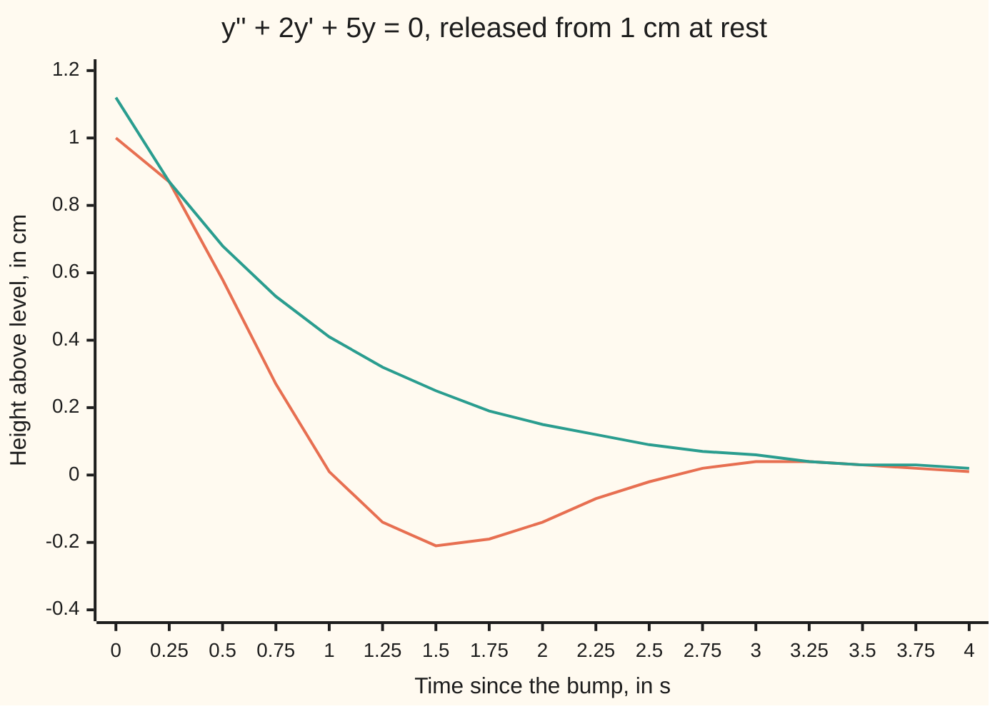
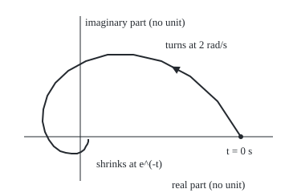

# Complex roots: the exponential of an imaginary number is a rotation, so the solution rings down

[Syllabus](../../../SYLLABUS.md) → [Differential equations and dynamics](../../../SYLLABUS.md#w08) → [Oscillators - Second-Order Linear Equations](../../../SYLLABUS.md#w08-s03) → Complex roots

---

## General Overview

A car goes over a bump and is left 1 cm above its resting height, momentarily still. The spring pulls it back; the shock absorber, a piston in oil, drags against the motion. With a soft damper the body overshoots, dips 0.208 cm below level at 1.571 s, rises again, and fades.

The rate law, per unit of mass: acceleration equals minus 5 times the height, minus 2 times the velocity. Guessing an exponential turns it into a quadratic ([The characteristic equation](02-the-characteristic-equation.md)). Its roots are −1 + 2i and −1 − 2i, where i is the number whose square is −1.

An exponential with an imaginary rate does not grow: it turns, like a point running round a circle. A negative real rate shrinks the circle; seen from the side, the turn is a fading cosine. The real part, −1 per second, sets the fade: the swing halves every 0.693 s. The imaginary part, 2 radians per second, sets the turning: one full swing every 3.142 s.

**A pair of roots a ± ib gives the real motion e^(at)(C cos bt + D sin bt): the real part a is the decay rate, the imaginary part b the angular frequency.**

**What kind of fact this is:** a method; the claim that it yields every solution is a theorem, proved on this card in Why it works.

### The picture: the car body after the bump



Orange: the height, e^(−t)(cos 2t + 0.5 sin 2t). Teal: the envelope 1.118 e^(−t), which the height touches once per swing and never exceeds.

---

## The formula

Reminder: y' is the rate of y, y'' the rate of y'. The damper setting is p here, not b as on the previous card: b names the frequency. The equation, and the quadratic an exponential guess produces:

$$y'' + p\,y' + q\,y = 0 \qquad\longrightarrow\qquad r^2 + p\,r + q = 0$$

When $p^2 < 4q$ the roots are a conjugate pair: one real part, opposite imaginary parts.

$$r = a \pm i\,b, \qquad a = -\frac{p}{2}, \qquad b = \sqrt{q - \frac{p^2}{4}}$$

Every real solution is then

$$y(t) = e^{a t}\,\bigl(C\cos bt + D\sin bt\bigr), \qquad C = y(0), \qquad D = \frac{y'(0) - a\,C}{b}$$

**Read it aloud:** a cosine and a sine turning at b radians per second, mixed to fit the start, all multiplied by an exponential that fades at rate a.

The height stays inside the envelope $R\,e^{at}$, with $R = \sqrt{C^2 + D^2}$. The pattern repeats every $T = 2\pi/b$ seconds, each repeat $e^{aT}$ times the last.

| Symbol | Plain meaning | In our example | Push it up and the answer… |
| --- | --- | --- | --- |
| $t$ | time since the bump, in s | 0 to 4 s | height nears level |
| $y$, $y'$, $y''$ | height above level, its velocity, its acceleration | y(0) = 1 cm, y'(0) = 0 cm/s | — |
| $p$, $q$ | damper setting, per s; spring stiffness, per s^2 | 2 and 5 | p past 4.472: no ringing |
| $i$ | the number whose square is −1 | — | — |
| $r$ | a root of the characteristic equation | −1 ± 2i | — |
| $a$, $b$ | real part: decay rate, per s; imaginary part: angular frequency, rad/s | −1 and 2 | a nearer 0: slower fade; b up: shorter period |
| $C$, $D$, $R$ | cosine and sine amounts, fixed by the start; envelope height at t = 0 | 1 cm, 0.5 cm, 1.118 cm | — |
| $T$, $\theta$ | the period, in s; the phase angle, in radians | 3.142 s; 0.464 rad | — |

### When it holds

- **Constant p and q.** A damper that stiffens as it warms changes a and b mid-swing.
- **Linear forces.** Pull proportional to height, drag to velocity. A spring that stiffens when stretched hard makes the period depend on the swing's size.
- **No outside push.** A road that keeps shaking the car adds a term on the right; see [Undetermined coefficients](05-undetermined-coefficients.md).
- **p positive, for "damped".** With p zero or negative the formula holds but the envelope stays level or grows. A complex root alone does not promise decay.

---

## Why it works

### Step 0: an imaginary rate turns instead of growing

Euler's formula, $e^{i\theta} = \cos\theta + i\sin\theta$ ([Euler's formula](../../07-Complex%20analysis/01-Complex%20Numbers%20and%20the%20Plane/04-eulers-formula.md)), puts $e^{i\theta}$ on the circle of radius 1, at angle θ from the positive real axis. So $e^{ibt}$ runs round that circle at b radians per second. Multiplying by $e^{at}$ shrinks the radius as it turns: the point spirals in. The real part of the spiral, its shadow on the horizontal axis, is $e^{at}\cos bt$. That shadow is the fading swing.

### The picture: the root's exponential, drawn in the plane

<p align="center"></p>

To scale: 200 px per unit on both axes, origin at (100, 170); the start, 1, sits at (300, 170). The triangle shows the direction of travel; each loop is 0.043 times the size of the last.

### Step 1: the complex exponential solves the equation

For complex r, the rate of $e^{rt}$ is still $r\,e^{rt}$: differentiate $e^{at}(\cos bt + i\sin bt)$ by the product rule and compare. So substituting $e^{rt}$ gives $(r^2 + p\,r + q)\,e^{rt}$, which is zero because r is a root. For the car, $(-1 + 2i)^2 = -3 - 4i$, and $-3 - 4i + 2(-1 + 2i) + 5 = 0$.

### Step 2: its real and imaginary parts are real solutions

Write the complex solution as $u + iv$, with $u = e^{at}\cos bt$ and $v = e^{at}\sin bt$. Because p and q are real, the left side of the equation splits the same way: (u'' + p u' + q u) + i(v'' + p v' + q v). A complex number is zero only when both parts are, so u and v each solve the equation. The other root, a − ib, gives the same two curves again.

### Step 3: the start fixes C and D, and nothing is missed

At t = 0, the mix $C u + D v$ has height C and velocity aC + bD. Matching y(0) and y'(0) gives the formula's C and D, for any start, since b is not zero. Two solutions with the same start agree forever ([Superposition](01-superposition-and-the-shape-of-linear-solutions.md)), so this family holds every solution.

<details>
<summary>Detailed proof: a check with no complex numbers</summary>

Put $y = e^{at}u(t)$. Then $y' = e^{at}(u' + a u)$ and $y'' = e^{at}(u'' + 2a u' + a^2 u)$, so
y'' + p y' + q y = e^(at) [u'' + (2a + p) u' + (a^2 + p a + q) u].
With a = −p/2 the middle coefficient is zero, and a^2 + p a + q = q − p^2/4 = b^2. So u'' + b^2 u = 0, the undamped spring, solved by C cos bt + D sin bt. Removing the fade e^(at) leaves pure turning at rate b.

</details>

### Step 4: reading off the envelope, the period and the fade

Treat C and D as the two legs of a right triangle ([Sine, cosine and tangent](../../05-Geometry%20and%20trig/03-Trigonometry/01-right-triangle-trigonometry.md)). Its long side is $R = \sqrt{C^2 + D^2}$, and with θ the angle whose cosine is C/R and sine D/R, the mix becomes $R\cos(bt - \theta)$. A cosine never exceeds 1, so the height stays inside $\pm R\,e^{at}$. For the car, R = 1.118 cm.

The envelope halves when $e^{at} = 1/2$, after ln 2 / |a| = 0.693 s. The pattern repeats after $T = 2\pi/b$ = 3.142 s, each repeat $e^{aT}$ = 0.043 times the last.

### Step 5: the three regimes

As p rises toward $2\sqrt{q}$, b shrinks and the ringing slows. At $p = 2\sqrt{q}$, 4.472 per s for the car, the roots meet on the real line: critical damping. Beyond it, two negative real roots give a creep with no ringing, handled on [The characteristic equation](02-the-characteristic-equation.md). The sign of $p^2 - 4q$ names the regime: negative rings (underdamped), zero sits on the edge (critical), positive creeps (overdamped). Stepped for 10 s, the car crosses level 6 times at p = 2 and never at 4.472 or 6.

---

## Worked numbers, by hand

| Step | Arithmetic | Value |
| --- | --- | --- |
| discriminant | 2^2 − 4 × 5 | −16: complex roots |
| real part | a = −2/2 | −1 per s |
| imaginary part | b = √(5 − 1) | 2 rad/s |
| cosine amount | C = y(0) | 1 cm |
| sine amount | D = (0 − (−1)(1))/2 | 0.5 cm |
| envelope | R = √(1 + 0.25) | 1.118 cm |
| halving time | ln 2 / 1 | 0.693 s |
| period | 2π / 2 | 3.142 s |
| deepest dip | velocity −2.5 e^(−t) sin 2t is next 0 at t = π/2: e^(−π/2)(cos π + 0.5 sin π) | −0.208 cm at 1.571 s |
| height after one period | e^(−π) | **0.043 cm, from 1 cm** |

**y(t) = e^(−t)(cos 2t + 0.5 sin 2t) cm:** level at 1.017 s, 0.208 cm low at the dip, under half a millimetre high after 3.142 s.

### What breaks if you drop a piece

| Mistake | Comes out at | What went wrong |
| --- | --- | --- |
| D set to the starting velocity, 0 | starts moving at −1 cm/s, not at rest | the fade adds aC to the starting velocity |
| Ringing rate taken as √q, the undamped rate | period 2.810 s, not 3.142 s | damping slows the ringing: b^2 = q − p^2/4 |
| b = 2 read as cycles per second | period 0.5 s | b counts radians; one cycle is 2π radians |

The code prints all three.

---

## Code, from first principles, and it actually runs

Two roads to the car's motion. Road one is the formula. Road two never calls sin, cos or exp: Euler's rule steps height and velocity forward along their own rates, a step of length h at a time ([Euler's method](../05-Numerical%20Evolution/01-eulers-method.md)). They must agree on the crossing and the dip, and the gap must halve when h halves. Euler's formula is checked by a limit: 1 + 2i/2^30, squared 30 times, lands on cos 2 + i sin 2. Each regime is stepped for 10 s and its zero crossings counted.

### Python

```python
# Complex roots and damped oscillation -- the check behind the card.  Standard
# library only; math gives sin, cos, exp, log, sqrt, pi and nothing more.  The
# car: y'' + 2y' + 5y = 0, height y in cm, time t in s, y(0) = 1, y'(0) = 0.
# Road one: the formula built from the complex roots.  Road two: Euler's rule,
# small steps along the rates, which never calls sin, cos or exp.
from math import sin, cos, exp, log, sqrt, pi
P, Q, Y0, V0 = 2.0, 5.0, 1.0, 0.0
def cmul(z, w):                               # complex numbers as (real, imaginary) pairs
    return (z[0] * w[0] - z[1] * w[1], z[0] * w[1] + z[1] * w[0])
A, B = -P / 2, sqrt(Q - P * P / 4)            # the roots a +/- ib, by the quadratic formula
C, D = Y0, (V0 - A * Y0) / B                  # fitted to the start
R = sqrt(C * C + D * D)                       # the envelope's starting height
def formula(t):
    return exp(A * t) * (C * cos(B * t) + D * sin(B * t))
def step(p, h, t_end):                        # Euler's rule: y += h y', y' += h y''
    y, v, ys = Y0, V0, [Y0]
    for _ in range(round(t_end / h)):
        y, v = y + h * v, v + h * (-p * v - Q * y)
        ys.append(y)
    return ys
def bisect(f, lo, hi):                        # f changes sign between lo and hi
    for _ in range(100):
        mid = (lo + hi) / 2
        lo, hi = (mid, hi) if f(lo) * f(mid) > 0 else (lo, mid)
    return (lo + hi) / 2
sq = cmul((A, B), (A, B)); left = (sq[0] + P * A + Q, sq[1] + P * B)
z = (1.0, 2.0 / 2 ** 30)                      # 1 + 2i/2^30, squared 30 times
for _ in range(30): z = cmul(z, z)
h = 0.00025; ys = step(P, h, 4.0)
k = next(i for i in range(len(ys) - 1) if ys[i] > 0 >= ys[i + 1])
cross_step = h * (k + ys[k] / (ys[k] - ys[k + 1]))
cross = bisect(formula, 0.5, 1.5); dip = formula(pi / B)
errs = [max(abs(y - formula(i * s)) for i, y in enumerate(step(P, s, 4.0))) for s in (0.001, 0.0005, 0.00025)]
print(f"equation y'' + 2y' + 5y = 0, y(0) = 1 cm, y'(0) = 0 cm/s; discriminant p^2 - 4q = {P * P - 4 * Q:.0f}")
print(f"roots a +/- ib = {A:.0f} +/- {B:.0f}i; r^2 + 2r + 5 at r = -1 + 2i gives {left[0]:.6f} + {left[1]:.6f}i")
print(f"Euler's formula by a limit: (1 + 2i/2^30)^(2^30) = {z[0]:.6f} + {z[1]:.6f}i; cos 2 + i sin 2 = {cos(2):.6f} + {sin(2):.6f}i")
print(f"C = {C:.6f}, D = {D:.6f}; envelope R = {R:.6f} cm")
print(f"envelope halves every {log(2) / -A:.6f} s; period {2 * pi / B:.6f} s; one period multiplies height by {exp(A * 2 * pi / B):.6f}")
print(f"first zero crossing: formula {cross:.6f} s, stepped {cross_step:.3f} s")
print(f"deepest dip: formula {dip:.6f} cm at {pi / B:.6f} s, stepped {min(ys):.3f} cm")
print(f"Euler's rule, worst error 0 to 4 s at steps 0.001, 0.0005, 0.00025 s: {errs[0]:.6f}, {errs[1]:.6f}, {errs[2]:.6f} cm")
print("chart y:", ", ".join(f"{formula(i / 4):.2f}" for i in range(17)))
print("chart envelope:", ", ".join(f"{R * exp(A * i / 4):.2f}" for i in range(17)))
pts = [(100 + 200 * exp(A * t) * cos(B * t), 170 - 200 * exp(A * t) * sin(B * t)) for t in [i / 8 for i in range(25)]]
print("figure, spiral e^((-1+2i)t), t = 0 to 3 s by 0.125, svg px:", " ".join(f"{x:.0f},{y:.0f}" for x, y in pts))
count = {}
for p in (2.0, 2 * sqrt(Q), 6.0):
    disc = p * p - 4 * Q; ys10 = step(p, 0.001, 10.0)
    count[p] = sum(1 for u, w in zip(ys10, ys10[1:]) if u > 0 >= w or u < 0 <= w)
    kind = "underdamped" if disc < -1e-9 else "critical" if disc < 1e-9 else "overdamped"
    print(f"p = {p:.3f} per s: discriminant {disc:.3f}, {kind}, zero crossings in 10 s (stepped): {count[p]}")
print(f"mistake D = y'(0) = 0: formula starts at y'(0) = {A * C:.6f} cm/s, not 0")
print(f"mistake sqrt(q) as ring rate: period {2 * pi / sqrt(Q):.6f} s, not {2 * pi / B:.6f}; b read as cycles per s: period {1 / B:.6f} s")
assert abs(z[0] - cos(2)) < 1e-7 and abs(z[1] - sin(2)) < 1e-7     # rotation, by a limit
assert abs(cross - cross_step) < 1e-3 and abs(dip - min(ys)) < 1e-3  # two roads, one motion
assert errs[2] < 1e-3 and 1.8 < errs[0] / errs[1] < 2.2               # error halves with the step
assert [count[p] > 0 for p in count] == [True, False, False]          # the sign of p^2 - 4q decides
print("ALL CHECKS PASS")
```

**Ran 2026-09-28 on macOS, Python 3.14.6, standard library only. All checks passed. Output, pasted from the run:**

```
equation y'' + 2y' + 5y = 0, y(0) = 1 cm, y'(0) = 0 cm/s; discriminant p^2 - 4q = -16
roots a +/- ib = -1 +/- 2i; r^2 + 2r + 5 at r = -1 + 2i gives 0.000000 + 0.000000i
Euler's formula by a limit: (1 + 2i/2^30)^(2^30) = -0.416147 + 0.909297i; cos 2 + i sin 2 = -0.416147 + 0.909297i
C = 1.000000, D = 0.500000; envelope R = 1.118034 cm
envelope halves every 0.693147 s; period 3.141593 s; one period multiplies height by 0.043214
first zero crossing: formula 1.017222 s, stepped 1.017 s
deepest dip: formula -0.207880 cm at 1.570796 s, stepped -0.208 cm
Euler's rule, worst error 0 to 4 s at steps 0.001, 0.0005, 0.00025 s: 0.000989, 0.000494, 0.000247 cm
chart y: 1.00, 0.87, 0.58, 0.27, 0.01, -0.14, -0.21, -0.19, -0.14, -0.07, -0.02, 0.02, 0.04, 0.04, 0.03, 0.02, 0.01
chart envelope: 1.12, 0.87, 0.68, 0.53, 0.41, 0.32, 0.25, 0.19, 0.15, 0.12, 0.09, 0.07, 0.06, 0.04, 0.03, 0.03, 0.02
figure, spiral e^((-1+2i)t), t = 0 to 3 s by 0.125, svg px: 300,170 271,126 237,95 201,76 166,68 134,68 107,76 85,88 69,103 59,119 54,136 53,151 56,164 61,174 67,182 75,188 82,190 89,191 96,191 101,189 105,186 107,182 109,179 110,176 110,173
p = 2.000 per s: discriminant -16.000, underdamped, zero crossings in 10 s (stepped): 6
p = 4.472 per s: discriminant 0.000, critical, zero crossings in 10 s (stepped): 0
p = 6.000 per s: discriminant 16.000, overdamped, zero crossings in 10 s (stepped): 0
mistake D = y'(0) = 0: formula starts at y'(0) = -1.000000 cm/s, not 0
mistake sqrt(q) as ring rate: period 2.809926 s, not 3.141593; b read as cycles per s: period 0.500000 s
ALL CHECKS PASS
```

### Rust

Same numbers, same labels, built with `rustc --edition 2021 -O`.

```rust
// Complex roots and damped oscillation -- the same check as the Python, in Rust.
// No crates.  The car: y'' + 2y' + 5y = 0, height y in cm, time t in s,
// y(0) = 1, y'(0) = 0.  Road one: the formula built from the complex roots.
// Road two: Euler's rule, small steps along the rates, never calling sin, cos or exp.
use std::f64::consts::PI;
const P: f64 = 2.0;
const Q: f64 = 5.0;
const Y0: f64 = 1.0;
const V0: f64 = 0.0;

fn cmul(z: (f64, f64), w: (f64, f64)) -> (f64, f64) {     // complex numbers as pairs
    (z.0 * w.0 - z.1 * w.1, z.0 * w.1 + z.1 * w.0)
}

fn step(p: f64, h: f64, t_end: f64) -> Vec<f64> {         // Euler's rule: y += h y', y' += h y''
    let (mut y, mut v, mut ys) = (Y0, V0, vec![Y0]);
    for _ in 0..(t_end / h).round() as usize {
        (y, v) = (y + h * v, v + h * (-p * v - Q * y));
        ys.push(y);
    }
    ys
}

fn bisect(f: &dyn Fn(f64) -> f64, mut lo: f64, mut hi: f64) -> f64 {
    for _ in 0..100 {
        let mid = (lo + hi) / 2.0;
        if f(lo) * f(mid) > 0.0 { lo = mid } else { hi = mid }
    }
    (lo + hi) / 2.0
}

fn join(v: &[f64]) -> String { v.iter().map(|x| format!("{:.2}", x)).collect::<Vec<_>>().join(", ") }

fn main() {
    let (a, b) = (-P / 2.0, (Q - P * P / 4.0).sqrt());   // the roots a +/- ib
    let (c, d) = (Y0, (V0 - a * Y0) / b);                 // fitted to the start
    let r = (c * c + d * d).sqrt();                       // the envelope's starting height
    let formula = |t: f64| (a * t).exp() * (c * (b * t).cos() + d * (b * t).sin());
    let sq = cmul((a, b), (a, b));
    let left = (sq.0 + P * a + Q, sq.1 + P * b);
    let mut z = (1.0, 2.0 / 2f64.powi(30));               // 1 + 2i/2^30, squared 30 times
    for _ in 0..30 { z = cmul(z, z) }
    let h = 0.00025;
    let ys = step(P, h, 4.0);
    let k = (0..ys.len() - 1).find(|&i| ys[i] > 0.0 && ys[i + 1] <= 0.0).unwrap();
    let cross_step = h * (k as f64 + ys[k] / (ys[k] - ys[k + 1]));
    let (cross, dip) = (bisect(&formula, 0.5, 1.5), formula(PI / b));
    let ymin = ys.iter().cloned().fold(f64::INFINITY, f64::min);
    let errs: Vec<f64> = [0.001, 0.0005, 0.00025].iter().map(|&s| step(P, s, 4.0).iter().enumerate()
        .map(|(i, y)| (y - formula(i as f64 * s)).abs()).fold(0.0, f64::max)).collect();
    println!("equation y'' + 2y' + 5y = 0, y(0) = 1 cm, y'(0) = 0 cm/s; discriminant p^2 - 4q = {:.0}", P * P - 4.0 * Q);
    println!("roots a +/- ib = {:.0} +/- {:.0}i; r^2 + 2r + 5 at r = -1 + 2i gives {:.6} + {:.6}i", a, b, left.0, left.1);
    println!("Euler's formula by a limit: (1 + 2i/2^30)^(2^30) = {:.6} + {:.6}i; cos 2 + i sin 2 = {:.6} + {:.6}i", z.0, z.1, 2f64.cos(), 2f64.sin());
    println!("C = {:.6}, D = {:.6}; envelope R = {:.6} cm", c, d, r);
    println!("envelope halves every {:.6} s; period {:.6} s; one period multiplies height by {:.6}", 2f64.ln() / -a, 2.0 * PI / b, (a * 2.0 * PI / b).exp());
    println!("first zero crossing: formula {:.6} s, stepped {:.3} s", cross, cross_step);
    println!("deepest dip: formula {:.6} cm at {:.6} s, stepped {:.3} cm", dip, PI / b, ymin);
    println!("Euler's rule, worst error 0 to 4 s at steps 0.001, 0.0005, 0.00025 s: {:.6}, {:.6}, {:.6} cm", errs[0], errs[1], errs[2]);
    println!("chart y: {}", join(&(0..17).map(|i| formula(i as f64 / 4.0)).collect::<Vec<_>>()));
    println!("chart envelope: {}", join(&(0..17).map(|i| r * (a * i as f64 / 4.0).exp()).collect::<Vec<_>>()));
    let pts: Vec<String> = (0..25).map(|i| { let t = i as f64 / 8.0;
        format!("{:.0},{:.0}", 100.0 + 200.0 * (a * t).exp() * (b * t).cos(), 170.0 - 200.0 * (a * t).exp() * (b * t).sin()) }).collect();
    println!("figure, spiral e^((-1+2i)t), t = 0 to 3 s by 0.125, svg px: {}", pts.join(" "));
    let mut crossed = Vec::new();
    for p in [2.0, 2.0 * Q.sqrt(), 6.0] {
        let disc = p * p - 4.0 * Q;
        let ys10 = step(p, 0.001, 10.0);
        let n = ys10.windows(2).filter(|w| (w[0] > 0.0 && w[1] <= 0.0) || (w[0] < 0.0 && w[1] >= 0.0)).count();
        let kind = if disc < -1e-9 { "underdamped" } else if disc < 1e-9 { "critical" } else { "overdamped" };
        println!("p = {:.3} per s: discriminant {:.3}, {}, zero crossings in 10 s (stepped): {}", p, disc, kind, n);
        crossed.push(n > 0);
    }
    println!("mistake D = y'(0) = 0: formula starts at y'(0) = {:.6} cm/s, not 0", a * c);
    println!("mistake sqrt(q) as ring rate: period {:.6} s, not {:.6}; b read as cycles per s: period {:.6} s", 2.0 * PI / Q.sqrt(), 2.0 * PI / b, 1.0 / b);
    assert!((z.0 - 2f64.cos()).abs() < 1e-7 && (z.1 - 2f64.sin()).abs() < 1e-7);   // rotation, by a limit
    assert!((cross - cross_step).abs() < 1e-3 && (dip - ymin).abs() < 1e-3);        // two roads, one motion
    assert!(errs[2] < 1e-3 && errs[0] / errs[1] > 1.8 && errs[0] / errs[1] < 2.2);  // error halves with the step
    assert!(crossed == vec![true, false, false]);                                  // the sign of p^2 - 4q decides
    println!("ALL CHECKS PASS");
}
```

**Ran 2026-09-28 on macOS, rustc 1.98.1, no crates. All checks passed. Output, pasted from the run:**

```
equation y'' + 2y' + 5y = 0, y(0) = 1 cm, y'(0) = 0 cm/s; discriminant p^2 - 4q = -16
roots a +/- ib = -1 +/- 2i; r^2 + 2r + 5 at r = -1 + 2i gives 0.000000 + 0.000000i
Euler's formula by a limit: (1 + 2i/2^30)^(2^30) = -0.416147 + 0.909297i; cos 2 + i sin 2 = -0.416147 + 0.909297i
C = 1.000000, D = 0.500000; envelope R = 1.118034 cm
envelope halves every 0.693147 s; period 3.141593 s; one period multiplies height by 0.043214
first zero crossing: formula 1.017222 s, stepped 1.017 s
deepest dip: formula -0.207880 cm at 1.570796 s, stepped -0.208 cm
Euler's rule, worst error 0 to 4 s at steps 0.001, 0.0005, 0.00025 s: 0.000989, 0.000494, 0.000247 cm
chart y: 1.00, 0.87, 0.58, 0.27, 0.01, -0.14, -0.21, -0.19, -0.14, -0.07, -0.02, 0.02, 0.04, 0.04, 0.03, 0.02, 0.01
chart envelope: 1.12, 0.87, 0.68, 0.53, 0.41, 0.32, 0.25, 0.19, 0.15, 0.12, 0.09, 0.07, 0.06, 0.04, 0.03, 0.03, 0.02
figure, spiral e^((-1+2i)t), t = 0 to 3 s by 0.125, svg px: 300,170 271,126 237,95 201,76 166,68 134,68 107,76 85,88 69,103 59,119 54,136 53,151 56,164 61,174 67,182 75,188 82,190 89,191 96,191 101,189 105,186 107,182 109,179 110,176 110,173
p = 2.000 per s: discriminant -16.000, underdamped, zero crossings in 10 s (stepped): 6
p = 4.472 per s: discriminant 0.000, critical, zero crossings in 10 s (stepped): 0
p = 6.000 per s: discriminant 16.000, overdamped, zero crossings in 10 s (stepped): 0
mistake D = y'(0) = 0: formula starts at y'(0) = -1.000000 cm/s, not 0
mistake sqrt(q) as ring rate: period 2.809926 s, not 3.141593; b read as cycles per s: period 0.500000 s
ALL CHECKS PASS
```

The two outputs match line for line.

> [!TIP]
> **Try changing**
> Guess first, then run it.
> - **Stiffer damper.** Set `P = 4.0`: roots −2 ± 1i, period 6.283 s, halving time 0.347 s. The crossing moves to 2.678 s, outside the bisection bracket, and the second assert stops the run.
> - **Push down at the start.** Set `V0 = -1.0`: D = 0, the motion is e^(−t) cos 2t, crossing at π/4 = 0.785 s. The dip moves off π/2 s, stepping finds −0.235 cm, and the second assert stops it.
> - **Coarser steps.** Set `h = 0.01`: the stepped dip reads −0.216 cm, first-order error shows, and the second assert stops it.

---

## The usual mistake

> [!warning]
> **Treating complex roots as a sign that something went wrong.** The i never appears in the motion. It is bookkeeping for turning: the real and imaginary parts of one complex solution are two real solutions. Throwing out the complex roots throws out the ringing. The three slips in What breaks are the other common errors.
>
> - **"Critical or heavier damping never overshoots."** True from rest. Pushed down hard enough at the start, the car crosses level once.

---

## Where you meet it in real life

- **Car suspension.** The damper sets a: too weak and the car bounces, too strong and every bump is felt.
- **Buildings and bridges.** A measured period T and the ratio ρ between one peak and the next give b = 2π/T and a = ln ρ / T, Step 4 run backwards.
- **Electric circuits.** A resistor, coil and capacitor in a loop obey the same equation, with charge in place of height: [The RLC circuit](08-the-rlc-circuit-and-the-spring.md).

> **Say it back**
> With no real roots, the characteristic equation has a pair a ± ib. Euler's formula makes e^((a+ib)t) a spiral, turning at b radians per second, fading at rate a. Its real and imaginary parts are two real solutions, mixed to fit the start. The sign of p^2 − 4q says whether the system rings, sits on the edge, or creeps.

---

## What this builds on

- [The characteristic equation](02-the-characteristic-equation.md): the exponential guess, and the real-root and critical cases.
- [Euler's formula](../../07-Complex%20analysis/01-Complex%20Numbers%20and%20the%20Plane/04-eulers-formula.md): e^(iθ) = cos θ + i sin θ, the turning in Step 0.
- [Sine, cosine and tangent](../../05-Geometry%20and%20trig/03-Trigonometry/01-right-triangle-trigonometry.md): the triangle with legs C and D that gives the envelope.

## Where this goes next

- [Undetermined coefficients](05-undetermined-coefficients.md): a road that keeps shaking the car.
- [The RLC circuit](08-the-rlc-circuit-and-the-spring.md): the same equation from springs, coils and capacitors.
- [Complex eigenvalues](../04-Systems%20and%20the%20Matrix%20Exponential/03-complex-eigenvalues-and-spirals.md): a ± ib as eigenvalues, spiralling in the plane of height and velocity.
- [Poles and zeros](../../13-Engineering%20mathematics/02-Linear%20Systems%20and%20Transforms/03-poles-zeros-and-stability.md): the sign of a as the test of settling.
- [Damping ratio and natural frequency](../../13-Engineering%20mathematics/02-Linear%20Systems%20and%20Transforms/06-second-order-systems-damping-and-natural-frequency.md): a and b recast as damping ratio and natural frequency.

Here the car is left alone after one bump; what happens when the road keeps pushing, and the push feeds the ringing, is the question [Undetermined coefficients](05-undetermined-coefficients.md) and [Resonance](06-resonance-and-beats.md) answer.

---

## Sources

Verified 2026-09-28: every link below resolves to the publisher's page.

- Lebl, Jiří. *Notes on Diffy Qs: Differential Equations for Engineers*, section 2.2, "Constant-coefficient second-order linear ODEs". [Free text](https://www.jirka.org/diffyqs/html/sec_ccsol.html). Complex roots turned into real solutions.
- Lebl, Jiří. *Notes on Diffy Qs*, section 2.4, "Mechanical vibrations". [Free text](https://www.jirka.org/diffyqs/html/sec_mv.html). The three damping regimes of a spring with a damper.
- OpenStax. *Calculus Volume 3*, section 7.3, "Applications". [Free text](https://openstax.org/books/calculus-volume-3/pages/7-3-applications). Damped spring-mass problems, worked with units.
