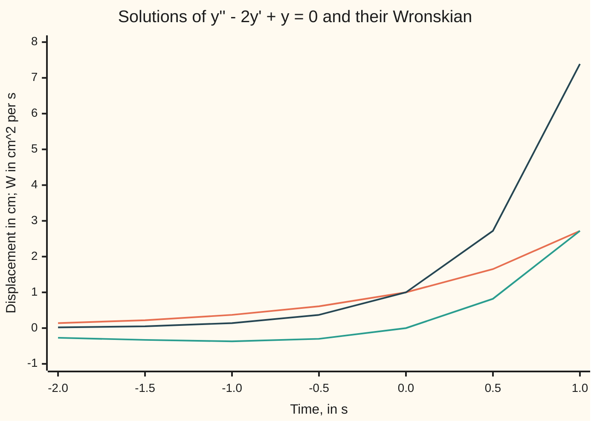
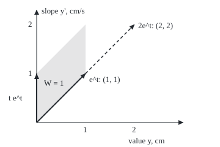

# The Wronskian: a determinant that says two solutions are genuinely different, and how to find the second from the first

[Syllabus](../../../SYLLABUS.md) → [Differential equations and dynamics](../../../SYLLABUS.md#w08) → [Oscillators - Second-Order Linear Equations](../../../SYLLABUS.md#w08-s03) → The Wronskian

---

## General Overview

A 1 kg weight sits on a spring of stiffness 1 newton per metre. Its damper is wired backwards: instead of resisting motion it pushes along it, at 2 newtons per metre per second. With y the displacement from rest in cm and t the time in seconds, the rule is y'' = 2y' − y: acceleration is twice the velocity, minus the displacement. Rearranged, y'' − 2y' + y = 0.

A second-order equation takes two starting facts, a position and a velocity, so it needs two genuinely different solutions to fit every start. The [The characteristic equation](02-the-characteristic-equation.md) method offers only one here. Trying y = e^(rt) gives r^2 − 2r + 1 = 0, which is (r − 1)^2 = 0: a double root, and the single solution e^t.

Two questions follow. How can one tell that two solutions are really different, not one in disguise like e^t and 2e^t? And where is the missing second one? A determinant, the **Wronskian**, answers the first. Writing the unknown as a changing multiple of the known solution, **reduction of order**, answers the second: t e^t.

**Two solutions of one linear equation are genuinely different exactly when the determinant of their values and slopes is non-zero; it is never zero or always zero, and it lets one solution produce the other.**

**What kind of fact this is:** a theorem, proved on this card in Why it works, with reduction of order as the method it yields.

### The picture: two solutions and their Wronskian



Orange: e^t. Teal: t e^t, crossing zero at 0 s. Dark blue: their Wronskian e^(2t), never zero.

---

## The formula

Reminder: y' is the rate of y, and y'' the rate of that rate. A second-order linear equation in **standard form** has the acceleration term with coefficient 1:

$$y'' + p(t)\,y' + q(t)\,y = 0$$

For the spring, p = −2 per second and q = 1 per second squared. The **Wronskian** of two solutions y1 and y2 is the determinant of their values stacked over their slopes:

$$W(t) = \det\begin{pmatrix} y_1 & y_2 \\ y_1' & y_2' \end{pmatrix} = y_1\,y_2' - y_1'\,y_2$$

**Read it aloud:** the first solution times the second's slope, minus the first's slope times the second.

**Abel's identity** says how W moves, without knowing either solution:

$$W(t) = W(t_0)\,e^{-\int_{t_0}^{t} p(u)\,du}$$

**Read it aloud:** the Wronskian now is its starting value times e to the minus the accumulated coefficient p.

**Reduction of order** turns one known solution into a second:

$$y_2 = v\,y_1, \qquad v' = \frac{W}{y_1^{\,2}} = \frac{e^{-\int p\,dt}}{y_1^{\,2}}$$

**Read it aloud:** the ratio v of the new solution to the old one has slope equal to the Wronskian divided by the old solution squared.

| Symbol | Plain meaning | In our example | Push it up and the answer… |
| --- | --- | --- | --- |
| $t$, $u$ | time in s; u is time inside the integral | −2 to 1 s | — |
| $t_0$ | the anchor time | 0 s | — |
| $y$, $y'$, $y''$ | displacement in cm, velocity in cm/s, acceleration in cm/s^2 | start 2 cm at −1 cm/s | — |
| $p$, $q$ | coefficients in standard form, per s and per s^2 | −2 and 1 | larger p: W shrinks faster |
| $y_1$, $y_2$ | two solutions of the same equation | e^t and t e^t | — |
| $W$ | the Wronskian | e^(2t) | — |
| $v$ | the ratio y2 / y1 that reduction of order finds | t | — |
| $c_1$, $c_2$ | the constants in y = c1 y1 + c2 y2 | 2 and −3 | — |

### When it holds

- **Both functions solve the same linear equation.** Drop this and "W is zero" proves nothing: t^2 and t|t| have W = 0 everywhere, yet neither is a constant multiple of the other.
- **p and q continuous on an interval.** Then Abel's exponential is never zero there. Where the coefficient of y'' is zero, standard form fails, and so can the rule: t and t^2 solve t^2 y'' − 2t y' + 2y = 0, and their W = t^2 is zero at 0 s only.
- **Standard form first.** Divide by the coefficient of y'' before reading off p, or Abel's W comes out wrong.
- **Reduction of order needs y1 non-zero** on the interval, since it divides by y1^2. With y1 = sin t on y'' + y = 0 the formula stops at 0 and π s, although its answer, −cos t, does not.

---

## Why it works

### Step 0: independence is a question about the starting state

A solution is fixed by its value and slope at one moment (the uniqueness behind [Superposition](01-superposition-and-the-shape-of-linear-solutions.md)). So two solutions are genuinely different exactly when their starting states, each a pair (value, slope), point in different directions. Two arrows point in different directions exactly when the determinant of the two-by-two table they form is non-zero ([Determinants](../../03-Algebra/05-Solving%20Systems/04-determinants.md)). That determinant is W.

### The picture: starting states as arrows

<p align="center"></p>

To scale, 80 units per cm and per cm/s, origin at (60, 200). t e^t's arrow runs up the slope axis to (0, 1). The shaded area is W(0) = 1; the dashed 2e^t lies along e^t, area zero.

### Step 1: W obeys a first-order equation

Differentiate W = y1 y2' − y1' y2 by the product rule. The two y1' y2' terms cancel:

$$W' = y_1\,y_2'' - y_1''\,y_2$$

Substitute y'' = −p y' − q y for both. The q terms cancel, because both solve the same equation, leaving W' = −p W. That is a first-order linear rule, solved by [The integrating factor](../01-Rate%20Equations/05-integrating-factor.md): Abel's identity. For the spring, W' = 2W and W(0) = 1, so W = e^(2t).

### Step 2: always zero or never zero

An exponential is never zero. So if W(t0) = 0, then W is zero at every time, and if W(t0) is not zero, W is never zero and never changes sign. On the chart, t e^t crosses zero; W does not.

### Step 3: W = 0 at one moment means one solution in disguise

If W(t0) = 0, the starting arrows are parallel, so constants c1 and c2, not both zero, make c1 y1 + c2 y2 start at value 0 with slope 0. That combination is a solution, and a solution starting at rest at the rest position stays there. So c1 y1 + c2 y2 = 0 everywhere: the pair is dependent, in the sense of [Linear independence](../../03-Algebra/03-Vectors/04-linear-independence.md). If W(t0) is not zero, the arrows reach any starting state, so c1 y1 + c2 y2 covers every solution.

<details>
<summary>Detailed proof: a non-zero Wronskian gives every solution</summary>

Let p and q be continuous on an interval I, and y1, y2 solve the equation there with W(t0) ≠ 0. Take any solution z. The system c1 y1(t0) + c2 y2(t0) = z(t0), c1 y1'(t0) + c2 y2'(t0) = z'(t0) has determinant W(t0) ≠ 0, so Cramer's rule gives exactly one pair c1, c2.

Put d = z − c1 y1 − c2 y2. By superposition it solves the equation, with d(t0) = d'(t0) = 0. So does the zero function, and existence and uniqueness for linear equations with continuous coefficients allow only one such solution. So z = c1 y1 + c2 y2 on I.

</details>

### Step 4: reduction of order is Abel's identity read backwards

Write the unknown second solution as y2 = v y1, with v to be found. Then y2' = v' y1 + v y1', and

$$W = y_1\,(v' y_1 + v\,y_1') - y_1'\,v\,y_1 = y_1^{\,2}\,v'$$

The v terms cancel. Abel gives W = e^(−∫p) up to a constant, so v' = W / y1^2; integrate once for v. Only y1 and p were needed. Substituted into the equation, y = v y1 leaves only v' and v'': a first-order equation for v', hence the name.

For the spring: v' = e^(2t) / e^(2t) = 1, so v = t and y2 = t e^t. Direct substitution agrees: y2' = (1 + t)e^t, y2'' = (2 + t)e^t, and (2 + t) − 2(1 + t) + t = 0.

---

## Worked numbers, by hand

| Step | Arithmetic | Value |
| --- | --- | --- |
| characteristic equation | r^2 − 2r + 1 = (r − 1)^2 | one root, r = 1: y1 = e^t |
| Abel | W(0) e^(−∫(−2)) with W(0) = 1 | W = e^(2t) |
| reduction | v' = e^(2t) / (e^t)^2 | v' = 1, v = t |
| second solution | v y1 | **y2 = t e^t** |
| check W directly | e^t (1 + t)e^t − e^t · t e^t | e^(2t), never zero |
| W at 1 s | e^2 | **7.389056** |
| fit 2 cm at −1 cm/s | c1 = 2; c1 + c2 = −1 | c1 = 2, c2 = −3 |
| position at 0.5 s | (2 − 1.5)e^0.5 | **0.824361 cm** |
| back to the rest position | 2 − 3t = 0 | **t = 0.666667 s** |

The weight passes the rest position at two-thirds of a second, then runs away on the other side as the backwards damper feeds energy in. The pair e^t and 2e^t cannot fit this start: every mix of them starts with slope equal to value.

### What breaks if you drop a piece

| Mistake | Comes out at | What went wrong |
| --- | --- | --- |
| + sign in Abel's exponent | W(1) = 0.135335, not 7.389056 | Step 1 gives W' = −p W |
| p read off 2y'' − 4y' + 2y = 0 before dividing | W(1) = 54.598150 | Standard form needs coefficient 1 on y'' |
| Using e^t and 2e^t as the pair | W = 0 at −1, 0 and 1 s | Same arrow, twice |
| "W = 0, so dependent" for t^2 and t\|t\| | W = 0 at −1, 0 and 1, yet independent | Not solutions of one linear equation |

Last row: a t^2 + b t|t| = 0 at t = 1 and −1 is a system with determinant −2, so a = b = 0.

---

## Code, from first principles, and it actually runs

Two roads. One: the closed forms t e^t and e^(2t), with W recomputed from slopes measured by finite differences (rise over a tiny step either side). Two: Euler steps on y'' = 2y' − y from t e^t's start, value 0 and slope 1 (new value = old value + step × rate, [Euler's method](../05-Numerical%20Evolution/01-eulers-method.md)); the error halves with the step, and the stepped W closes on e^2. A second case, y'' + y = 0 from sin t, integrates by the midpoint rule (a sum of rectangle areas).

### Python

```python
# The Wronskian and reduction of order -- the check behind the card.  Standard
# library only.  y'' - 2y' + y = 0, t in s, y in cm: a spring whose damper is
# wired backwards.  Known solution y1 = e^t.  Road one: reduction of order and
# Abel's identity in closed form.  Road two: Euler steps on the equation itself
# and slopes by finite differences.  Second case: y'' + y = 0 from y1 = sin t.
import math

def y1(t): return math.exp(t)
def y2(t): return t * math.exp(t)                    # reduction of order: v = t
def slope(f, t, h=1e-5): return (f(t + h) - f(t - h)) / (2 * h)
def wr(f, g, t): return f(t) * slope(g, t) - slope(f, t) * g(t) + 0.0   # value-slope determinant
def abel(t, p=-2.0): return 1.0 * math.exp(-p * t)   # W(0) = 1, times exp(-integral of p)

def euler(y, v, t_end, h):                           # y'' = 2y' - y, small steps along the slope
    for _ in range(round(t_end / h)):
        y, v = y + h * v, v + h * (2 * v - y)
    return y, v

print("y'' - 2y' + y = 0, y1 = e^t; y = v e^t gives v'' = 0, so v = t and y2 = t e^t")
errs = []
for h in (0.01, 0.005, 0.0025):
    a, da = euler(1.0, 1.0, 1.0, h); b, db = euler(0.0, 1.0, 1.0, h)
    errs.append(abs(b - y2(1))); w_euler = a * db - da * b
    print(f"Euler h = {h:.4f}: y2(1) = {b:.6f}, error {errs[-1]:.6f}; W(1) = {w_euler:.6f}")
print(f"closed form: y2(1) = {y2(1):.6f}; W(1) from slopes = {wr(y1, y2, 1):.6f}; Abel e^2 = {abel(1):.6f}")
ts = [-2 + 0.5 * k for k in range(7)]
print("chart, t:", " ".join(f"{t:.1f}" for t in ts))
for name, f in (("e^t", y1), ("t e^t", y2), ("W", lambda t: wr(y1, y2, t))):
    print(f"chart, {name}:", " ".join(f"{f(t):.2f}" for t in ts))
d0 = wr(y1, y2, 0)                                   # Cramer's rule for y(0) = 2, y'(0) = -1
c1 = (2 * slope(y2, 0) + 1 * y2(0)) / d0; c2 = (-1 * y1(0) - 2 * slope(y1, 0)) / d0
def y(t): return c1 * y1(t) + c2 * y2(t)
lo, hi = 0.0, 1.0
for _ in range(60):                                  # bisection for the moment y = 0
    lo, hi = (lo, (lo + hi) / 2) if y((lo + hi) / 2) < 0 else ((lo + hi) / 2, hi)
print(f"start 2 cm at -1 cm/s: c1 = {c1:.6f}, c2 = {c2:.6f}; y(0.5) = {y(0.5):.6f} cm; rest at t = {lo:.6f} s")
def mid(f, a, b, n=400): return (b - a) / n * sum(f(a + (j + 0.5) * (b - a) / n) for j in range(n))
sine = [(t, math.sin(t) * mid(lambda s: 1 / math.sin(s) ** 2, math.pi / 2, t)) for t in (math.pi / 3, 2 * math.pi / 3)]
print("second case y'' + y = 0, y1 = sin t: " + "; ".join(f"y2 = {v:.6f} vs -cos t = {-math.cos(t):.6f}" for t, v in sine))
r = math.sqrt(5)
wh = wr(lambda t: math.exp(-r * t), lambda t: t * math.exp(-r * t), 1)
print(f"house absorber, b = {2 * r:.6f}: y = (1 + {r:.6f} t) e^(-{r:.6f} t); W(1) = {wh:.6f}, Abel {abel(1, 2 * r):.6f}")
print(f"mistake, + sign in Abel: W(1) = {abel(1, 2.0):.6f}, not {abel(1):.6f}")
print(f"mistake, p = -4 read off 2y'' - 4y' + 2y = 0 undivided: W(1) = {abel(1, -4.0):.6f}")
print("mistake, e^t and 2e^t: W at -1, 0, 1 =", " ".join(f"{wr(y1, lambda t: 2 * y1(t), t):.6f}" for t in (-1, 0, 1)))
def f(t): return t * t
def g(t): return t * abs(t)
wq = [wr(f, g, t) for t in (-1.0, 0.0, 1.0)]
det = f(1) * g(-1) - g(1) * f(-1)                    # a f + b g = 0 at t = 1 and t = -1
print("breaks, t^2 and t|t|: W at -1, 0, 1 =", " ".join(f"{w:.6f}" for w in wq) + f"; values at 1 and -1 give determinant {det:.0f}")
pts = [(y1(0), slope(y1, 0)), (y2(0), slope(y2, 0)), (2 * y1(0), 2 * slope(y1, 0))]
print("figure, origin (60, 200), 80 per unit:", "; ".join(f"({a:.0f}, {b:.0f}) -> ({60 + 80 * a:.0f}, {200 - 80 * b:.0f})" for a, b in pts) + f"; area {d0:.6f}")
assert errs[1] < 0.6 * errs[0] and errs[2] < 0.6 * errs[1] and abs(w_euler - abel(1)) < 0.05   # Euler meets Abel
assert abs(wr(y1, y2, 1) - abel(1)) < 1e-6 and abs(wr(y1, y2, -1.5) - abel(-1.5)) < 1e-6    # slopes meet Abel
assert all(abs(v + math.cos(t)) < 1e-5 for t, v in sine) and abs(wh - abel(1, 2 * r)) < 1e-6
assert abs(lo - 2 / 3) < 1e-9 and all(w == 0 for w in wq) and det != 0
print("ALL CHECKS PASS")
```

**Ran 2026-09-28 on macOS, Python 3.14.6, standard library only. All checks passed. Output, pasted from the run:**

```
y'' - 2y' + y = 0, y1 = e^t; y = v e^t gives v'' = 0, so v = t and y2 = t e^t
Euler h = 0.0100: y2(1) = 2.678033, error 0.040248; W(1) = 7.316018
Euler h = 0.0050: y2(1) = 2.698027, error 0.020255; W(1) = 7.352325
Euler h = 0.0025: y2(1) = 2.708121, error 0.010160; W(1) = 7.370637
closed form: y2(1) = 2.718282; W(1) from slopes = 7.389056; Abel e^2 = 7.389056
chart, t: -2.0 -1.5 -1.0 -0.5 0.0 0.5 1.0
chart, e^t: 0.14 0.22 0.37 0.61 1.00 1.65 2.72
chart, t e^t: -0.27 -0.33 -0.37 -0.30 0.00 0.82 2.72
chart, W: 0.02 0.05 0.14 0.37 1.00 2.72 7.39
start 2 cm at -1 cm/s: c1 = 2.000000, c2 = -3.000000; y(0.5) = 0.824361 cm; rest at t = 0.666667 s
second case y'' + y = 0, y1 = sin t: y2 = -0.500000 vs -cos t = -0.500000; y2 = 0.500000 vs -cos t = 0.500000
house absorber, b = 4.472136: y = (1 + 2.236068 t) e^(-2.236068 t); W(1) = 0.011423, Abel 0.011423
mistake, + sign in Abel: W(1) = 0.135335, not 7.389056
mistake, p = -4 read off 2y'' - 4y' + 2y = 0 undivided: W(1) = 54.598150
mistake, e^t and 2e^t: W at -1, 0, 1 = 0.000000 0.000000 0.000000
breaks, t^2 and t|t|: W at -1, 0, 1 = 0.000000 0.000000 0.000000; values at 1 and -1 give determinant -2
figure, origin (60, 200), 80 per unit: (1, 1) -> (140, 120); (0, 1) -> (60, 120); (2, 2) -> (220, 40); area 1.000000
ALL CHECKS PASS
```

### Rust

```rust
// The Wronskian and reduction of order -- the same check as the Python, in
// Rust.  No crates.  y'' - 2y' + y = 0, t in s, y in cm: a spring whose damper
// is wired backwards.  Known solution y1 = e^t.  Road one: reduction of order
// and Abel's identity in closed form.  Road two: Euler steps on the equation
// itself and slopes by finite differences.  Second case: y'' + y = 0 from sin t.
use std::f64::consts::PI;
type F<'a> = &'a dyn Fn(f64) -> f64;

fn y1(t: f64) -> f64 { t.exp() }
fn y2(t: f64) -> f64 { t * t.exp() }                   // reduction of order: v = t
fn slope(f: F, t: f64) -> f64 { let h = 1e-5; (f(t + h) - f(t - h)) / (2.0 * h) }
fn wr(f: F, g: F, t: f64) -> f64 { f(t) * slope(g, t) - slope(f, t) * g(t) + 0.0 }
fn abel(t: f64, p: f64) -> f64 { 1.0 * (-p * t).exp() } // W(0) = 1, times exp(-integral of p)

fn euler(mut y: f64, mut v: f64, t_end: f64, h: f64) -> (f64, f64) {
    for _ in 0..(t_end / h).round() as usize { (y, v) = (y + h * v, v + h * (2.0 * v - y)) }
    (y, v)
}

fn mid(f: F, a: f64, b: f64) -> f64 {
    let n = 400;
    (b - a) / n as f64 * (0..n).map(|j| f(a + (j as f64 + 0.5) * (b - a) / n as f64)).sum::<f64>()
}

fn main() {
    println!("y'' - 2y' + y = 0, y1 = e^t; y = v e^t gives v'' = 0, so v = t and y2 = t e^t");
    let (mut errs, mut w_euler) = (vec![], 0.0);
    for h in [0.01, 0.005, 0.0025] {
        let ((a, da), (b, db)) = (euler(1.0, 1.0, 1.0, h), euler(0.0, 1.0, 1.0, h));
        errs.push((b - y2(1.0)).abs()); w_euler = a * db - da * b;
        println!("Euler h = {:.4}: y2(1) = {:.6}, error {:.6}; W(1) = {:.6}", h, b, errs[errs.len() - 1], w_euler);
    }
    println!("closed form: y2(1) = {:.6}; W(1) from slopes = {:.6}; Abel e^2 = {:.6}", y2(1.0), wr(&y1, &y2, 1.0), abel(1.0, -2.0));
    let ts: Vec<f64> = (0..7).map(|k| -2.0 + 0.5 * k as f64).collect();
    let row = |f: F| ts.iter().map(|&t| format!("{:.2}", f(t))).collect::<Vec<_>>().join(" ");
    println!("chart, t: {}", ts.iter().map(|t| format!("{:.1}", t)).collect::<Vec<_>>().join(" "));
    println!("chart, e^t: {}", row(&y1));
    println!("chart, t e^t: {}", row(&y2));
    println!("chart, W: {}", row(&|t| wr(&y1, &y2, t)));
    let d0 = wr(&y1, &y2, 0.0);                          // Cramer's rule for y(0) = 2, y'(0) = -1
    let c1 = (2.0 * slope(&y2, 0.0) + 1.0 * y2(0.0)) / d0;
    let c2 = (-1.0 * y1(0.0) - 2.0 * slope(&y1, 0.0)) / d0;
    let y = |t: f64| c1 * y1(t) + c2 * y2(t);
    let (mut lo, mut hi) = (0.0_f64, 1.0_f64);
    for _ in 0..60 {                                     // bisection for the moment y = 0
        let m = (lo + hi) / 2.0;
        if y(m) < 0.0 { hi = m } else { lo = m }
    }
    println!("start 2 cm at -1 cm/s: c1 = {:.6}, c2 = {:.6}; y(0.5) = {:.6} cm; rest at t = {:.6} s", c1, c2, y(0.5), lo);
    let sine: Vec<(f64, f64)> = [PI / 3.0, 2.0 * PI / 3.0].iter()
        .map(|&t| (t, t.sin() * mid(&|s: f64| 1.0 / s.sin().powi(2), PI / 2.0, t))).collect();
    println!("second case y'' + y = 0, y1 = sin t: {}", sine.iter()
        .map(|(t, v)| format!("y2 = {:.6} vs -cos t = {:.6}", v, -t.cos())).collect::<Vec<_>>().join("; "));
    let r = 5.0_f64.sqrt();
    let wh = wr(&|t: f64| (-r * t).exp(), &|t: f64| t * (-r * t).exp(), 1.0);
    println!("house absorber, b = {:.6}: y = (1 + {:.6} t) e^(-{:.6} t); W(1) = {:.6}, Abel {:.6}", 2.0 * r, r, r, wh, abel(1.0, 2.0 * r));
    println!("mistake, + sign in Abel: W(1) = {:.6}, not {:.6}", abel(1.0, 2.0), abel(1.0, -2.0));
    println!("mistake, p = -4 read off 2y'' - 4y' + 2y = 0 undivided: W(1) = {:.6}", abel(1.0, -4.0));
    let dep: Vec<String> = [-1.0, 0.0, 1.0].iter().map(|&t| format!("{:.6}", wr(&y1, &|s| 2.0 * y1(s), t))).collect();
    println!("mistake, e^t and 2e^t: W at -1, 0, 1 = {}", dep.join(" "));
    let (f, g) = (|t: f64| t * t, |t: f64| t * t.abs());
    let wq: Vec<f64> = [-1.0, 0.0, 1.0].iter().map(|&t| wr(&f, &g, t)).collect();
    let det = f(1.0) * g(-1.0) - g(1.0) * f(-1.0);      // a f + b g = 0 at t = 1 and t = -1
    println!("breaks, t^2 and t|t|: W at -1, 0, 1 = {}; values at 1 and -1 give determinant {:.0}",
        wq.iter().map(|w| format!("{:.6}", w)).collect::<Vec<_>>().join(" "), det);
    let pts = [(y1(0.0), slope(&y1, 0.0)), (y2(0.0), slope(&y2, 0.0)), (2.0 * y1(0.0), 2.0 * slope(&y1, 0.0))];
    println!("figure, origin (60, 200), 80 per unit: {}; area {:.6}", pts.iter()
        .map(|(a, b)| format!("({:.0}, {:.0}) -> ({:.0}, {:.0})", a, b, 60.0 + 80.0 * a, 200.0 - 80.0 * b)).collect::<Vec<_>>().join("; "), d0);
    assert!(errs[1] < 0.6 * errs[0] && errs[2] < 0.6 * errs[1] && (w_euler - abel(1.0, -2.0)).abs() < 0.05);
    assert!((wr(&y1, &y2, 1.0) - abel(1.0, -2.0)).abs() < 1e-6 && (wr(&y1, &y2, -1.5) - abel(-1.5, -2.0)).abs() < 1e-6);
    assert!(sine.iter().all(|(t, v)| (v + t.cos()).abs() < 1e-5) && (wh - abel(1.0, 2.0 * r)).abs() < 1e-6);
    assert!((lo - 2.0 / 3.0).abs() < 1e-9 && wq.iter().all(|&w| w == 0.0) && det != 0.0);
    println!("ALL CHECKS PASS");
}
```

**Ran 2026-09-28 on macOS, rustc 1.98.1, no crates. All checks passed. Output, pasted from the run:**

```
y'' - 2y' + y = 0, y1 = e^t; y = v e^t gives v'' = 0, so v = t and y2 = t e^t
Euler h = 0.0100: y2(1) = 2.678033, error 0.040248; W(1) = 7.316018
Euler h = 0.0050: y2(1) = 2.698027, error 0.020255; W(1) = 7.352325
Euler h = 0.0025: y2(1) = 2.708121, error 0.010160; W(1) = 7.370637
closed form: y2(1) = 2.718282; W(1) from slopes = 7.389056; Abel e^2 = 7.389056
chart, t: -2.0 -1.5 -1.0 -0.5 0.0 0.5 1.0
chart, e^t: 0.14 0.22 0.37 0.61 1.00 1.65 2.72
chart, t e^t: -0.27 -0.33 -0.37 -0.30 0.00 0.82 2.72
chart, W: 0.02 0.05 0.14 0.37 1.00 2.72 7.39
start 2 cm at -1 cm/s: c1 = 2.000000, c2 = -3.000000; y(0.5) = 0.824361 cm; rest at t = 0.666667 s
second case y'' + y = 0, y1 = sin t: y2 = -0.500000 vs -cos t = -0.500000; y2 = 0.500000 vs -cos t = 0.500000
house absorber, b = 4.472136: y = (1 + 2.236068 t) e^(-2.236068 t); W(1) = 0.011423, Abel 0.011423
mistake, + sign in Abel: W(1) = 0.135335, not 7.389056
mistake, p = -4 read off 2y'' - 4y' + 2y = 0 undivided: W(1) = 54.598150
mistake, e^t and 2e^t: W at -1, 0, 1 = 0.000000 0.000000 0.000000
breaks, t^2 and t|t|: W at -1, 0, 1 = 0.000000 0.000000 0.000000; values at 1 and -1 give determinant -2
figure, origin (60, 200), 80 per unit: (1, 1) -> (140, 120); (0, 1) -> (60, 120); (2, 2) -> (220, 40); area 1.000000
ALL CHECKS PASS
```

The two outputs match line for line.

> [!TIP]
> **Try changing**
> Guess first, then run it.
> - **Break the second solution.** Set `y2` to `t * t * math.exp(t)`: W is no longer e^(2t), and the second assert fails.
> - **Strengthen the backwards damper.** Change `2 * v` in `euler` to `2.2 * v`: the stepped W(1) overshoots e^2, and the first assert fails.
> - **Drop the square.** Change `1 / math.sin(s) ** 2` to `1 / math.sin(s)`: the third assert fails.

---

## The usual mistake

> [!warning]
> **Reading "W = 0" as proof of dependence for any two functions.** The test runs both ways only for solutions of one linear equation. For other functions a non-zero W still proves independence, but a zero W proves nothing: t^2 and t|t| have W = 0 everywhere and are independent.
>
> - **The sign in Abel.** W' = −p W; dropping the minus gives W(1) = 0.135335.
> - **Skipping standard form.** From 2y'' − 4y' + 2y = 0, p is −2, not −4.
> - **Reducing across a zero of y1.** The formula divides by y1^2.

---

## Where you meet it in real life

- **Critically damped machinery.** The shelf's shock absorber at b = 4.472136 per s has a double root; reduction gives t e^(−2.236068 t), the start 1 cm at rest gives (1 + 2.236068 t) e^(−2.236068 t), and W(1) = 0.011423. See [The RLC circuit](08-the-rlc-circuit-and-the-spring.md).
- **Equations whose coefficients change with time.** On [The Cauchy-Euler equation](09-the-cauchy-euler-equation.md) one solution is often easy to guess; reduction of order finds the other.

> **Say it back**
> A second-order linear equation needs two genuinely different solutions to fit every start. The determinant of their values over their slopes, the Wronskian, is non-zero exactly when the starting arrows point different ways. Abel's identity, W' = −p W, makes it always zero or never zero. Writing the second solution as v times the first gives W = y1^2 v', so e^t yields t e^t.

---

## What this builds on

- [The characteristic equation](02-the-characteristic-equation.md): the exponential guess and the double root that leaves one solution short.
- [Determinants](../../03-Algebra/05-Solving%20Systems/04-determinants.md): the two-by-two determinant as signed area, zero for parallel columns.
- [Linear independence](../../03-Algebra/03-Vectors/04-linear-independence.md): what "genuinely different" means for functions as well as arrows.

## Where this goes next

- [Variation of parameters](07-variation-of-parameters.md): lets c1 and c2 vary with time, dividing by W, to solve the equation with a push on the right-hand side.

Two solutions finish the unforced equation; what the weight does when an outside force keeps pushing is what variation of parameters answers.

---

## Sources

Verified 2026-09-28: every link below resolves to the publisher's or author's page.

- Boyce, William E., Richard C. DiPrima and Douglas B. Meade. *Elementary Differential Equations and Boundary Value Problems*, 12th ed. Wiley. [Publisher page](https://www.wiley.com/en-us/Elementary+Differential+Equations+and+Boundary+Value+Problems%2C+12th+Edition-p-9781119777694). The Wronskian, Abel's theorem and reduction of order.
- Teschl, Gerald. *Ordinary Differential Equations and Dynamical Systems*. AMS; free edition. [Author's page](https://www.mat.univie.ac.at/~gerald/ftp/book-ode/). Chapter 3, linear equations: the Wronskian test and Abel's formula at any order.
- Tenenbaum, Morris, and Harry Pollard. *Ordinary Differential Equations*. Dover. [Publisher page](https://store.doverpublications.com/products/9780486649405). Worked cases of reduction of order.
- O'Connor, J. J., and E. F. Robertson. "Jozéf-Maria Hoëné de Wronski." MacTutor Archive, University of St Andrews. [Biography](https://mathshistory.st-andrews.ac.uk/Biographies/Wronski/). Whom the determinant is named after.
