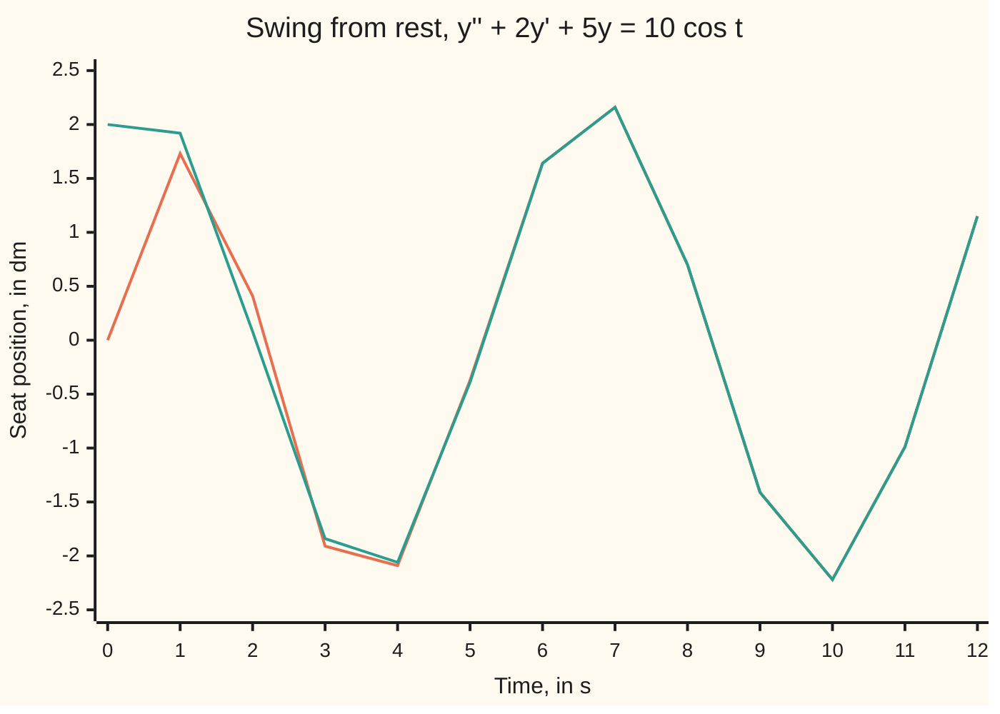

# Undetermined coefficients: for simple forcing, guess a solution of the same shape and solve for the constants

[Syllabus](../../../SYLLABUS.md) → [Differential equations and dynamics](../README.md) → [Oscillators - Second-Order Linear Equations](../README.md#s03) → Undetermined coefficients

---

## General Overview

A child sits still on a swing; a parent starts pushing, one push cycle every 6.28 seconds. The seat's sideways position is y, in decimetres (dm, tenths of a metre); t is time in seconds.

Gravity pulls the seat back, 5 dm/s^2 per decimetre out. Air and the chains slow it, 2 dm/s^2 per dm/s of speed. The push adds 10 cos t dm/s^2, strongest forward at t = 0. With y' the velocity and y'' the acceleration, the rate law is y'' + 2y' + 5y = 10 cos t.

Unpushed, this is the shelf's shock absorber at damping 2, ringing and dying away ([Complex roots](03-complex-roots-and-damped-oscillation.md)). Pushed, something survives. Guess it has the push's shape, a cosine and a sine at the push's rhythm, with unknown sizes A and B. Substituting gives two plain equations in A and B, and A = 2, B = 1: a steady swing reaching 2.24 dm either side of the middle, 0.46 s behind the push. The unknown sizes are the **undetermined coefficients**; the guess is the **trial solution**.

**A push built from polynomials, exponentials, sines and cosines has a response of the same shape: substitute that shape with unknown coefficients, match terms, and multiply by t if the guess already solves the unpushed equation.**

**What kind of fact this is:** a method, proved on this card in Why it works.

### The picture: from rest onto the steady swing



Orange: the swing, starting at rest. Teal: the steady part alone, 2 cos t + sin t. The two differ by under 0.1 dm after 3.22 s and agree to two decimals from 6 s on.

---

## The formula

A **second-order linear equation with constant coefficients** has the shape

$$y'' + c\,y' + k\,y = g(t)$$

with c and k fixed numbers and g(t), the **forcing**, what is pushed in. Every solution is one particular solution plus the unpushed family ([Superposition](01-superposition-and-the-shape-of-linear-solutions.md)):

$$y = y_h + y_p$$

The **characteristic roots** r solve r^2 + cr + k = 0 ([The characteristic equation](02-the-characteristic-equation.md)). The trial for y_p follows the forcing; M is the push's size, a its growth rate per s, ω its rate in radians per s:

| Forcing g(t) | Trial y_p | On the swing |
| --- | --- | --- |
| polynomial of degree n | every power up to n | 5t: At + B gives A = 1, B = −0.4 |
| M e^(at) | A e^(at) | 8e^t: 8A = 8 gives A = 1 |
| M cos ωt or M sin ωt | A cos ωt + B sin ωt | 10 cos t: A = 2, B = 1 |
| e^(at) cos ωt or e^(at) sin ωt | e^(at)(A cos ωt + B sin ωt) | e^(−t) cos 2t collides: Step 4 |

A sum of pushes takes the sum of trials. The collision rule: if the trial's rate (0 for a polynomial, a, or a ± iω) is a characteristic root, multiply the trial by t^s, where s is how many times it is a root.

For a cosine push of size F at rate ω, the trial A cos ωt + B sin ωt gives two equations:

$$(k-\omega^2)A + c\omega B = F, \qquad -c\omega A + (k-\omega^2)B = 0$$

**Read it aloud:** the cosine terms must add up to the push, and the sine terms must cancel.

| Symbol | Plain meaning | In our example | Push it up and the answer… |
| --- | --- | --- | --- |
| $y$, $t$ | seat position, dm; time, s | starts at 0 | — |
| $c$, $k$ | damping, per s; stiffness, per s^2 | 2 and 5 | smaller steady swing |
| $g$, $F$, $\omega$ | the forcing; its size, dm/s^2; its rate, radians per s | 10 cos t; 10; 1 | F: swing grows in step |
| $A$, $B$ | the undetermined coefficients | 2 and 1 | — |
| $y_p$ | the particular solution: the steady swing | 2 cos t + sin t | — |
| $y_h$, $C_1$, $C_2$ | the unpushed family; its constants, set by the start | −2 and −1.5 | a bigger transient |
| $r$ | a characteristic root | −1 ± 2i | — |
| $s$ | how many times the trial's rate is a root: the power of t | 0 for the swing | — |

### When it holds

- **Constant coefficients.** If c or k varies in time, new shapes appear; [The Cauchy-Euler equation](09-the-cauchy-euler-equation.md) handles one such family.
- **Forcing from the short list.** For a push like 1/t no finite trial closes; [Variation of parameters](07-variation-of-parameters.md) takes any continuous push.
- **A linear law.** A y^2 term mixes shapes: cos^2 t is no cosine at rate 1.
- **The collision rule applied.** Otherwise the trial gives 0 on the left.

---

## Why it works

### Step 0: differentiation keeps each shape in its family

Cos t differentiates to −sin t, sin t to cos t, e^(at) to a e^(at), and a polynomial to one of lower degree. So the left side keeps a trial's shape, and matching the push takes a few ordinary linear equations.

### Step 1: substitute the swing's trial

Take y = A cos t + B sin t. Then y' = −A sin t + B cos t and y'' = −A cos t − B sin t. The left side collects into (−A + 2B + 5A) cos t and (−B − 2A + 5B) sin t.

The push has no sine, so 4A + 2B = 10 and −2A + 4B = 0. The second gives A = 2B, then 10B = 10: B = 1, A = 2 ([Two equations, two unknowns](../../03-Algebra/01-Letters%20and%20Equations/04-two-equations-two-unknowns.md)). The sine is needed because the damping term 2y' turns cosines into sines.

### Step 2: the two equations always have one answer, with damping

The equations' determinant (nonzero exactly when there is one solution) is (k − ω^2)^2 + c^2ω^2, here 16 + 4 = 20, and positive whenever c > 0. It is zero only when c = 0 and ω^2 = k: an undamped swing pushed at its own rate, where the answer grows without bound ([Resonance](06-resonance-and-beats.md)).

A cos t + B sin t is one cosine of height √(A^2 + B^2), shifted in time: √5 = 2.24 dm, peaking 0.46 s after the push, the angle whose tangent is B/A.

### Step 3: add the unpushed family, then fit the start

The roots −1 ± 2i give y_h = e^(−t)(C1 cos 2t + C2 sin 2t), and y = 2 cos t + sin t + y_h. From rest, y(0) = 0 gives 2 + C1 = 0 and y'(0) = 0 gives 1 − C1 + 2C2 = 0: C1 = −2, C2 = −1.5.

The transient is at most 2.50e^(−t) dm, under 0.1 dm after ln 25 = 3.22 s. Then the swing keeps the push's rhythm, every 6.28 s, not its own 3.14 s.

### Step 4: when the trial collides, multiply by t

Push with the swing's own fading ring, g = e^(−t) cos 2t. The trial e^(−t)(A cos 2t + B sin 2t) solves the unpushed law: the left side is 0 for every A and B.

Write y = e^(−t)R. The product rule turns the left side into e^(−t)(R'' + 4R), so R'' + 4R = cos 2t. Try R = t(A cos 2t + B sin 2t): the terms carrying t cancel, leaving 4B cos 2t − 4A sin 2t. So B = 1/4, A = 0, and y_p = (t/4)e^(−t) sin 2t.

A double root needs t^2: for y'' + 2y' + y = e^(−t) the shift gives R'' = 1, which t alone cannot meet.

<details>
<summary>Detailed proof: the trial always contains a solution</summary>

Write D for "take the derivative" and p(z) = z^2 + cz + k, so the left side is p(D)y. Let the forcing be e^(λt)P(t), λ real or complex, P of degree n.

The product rule gives D(e^(λt)R) = e^(λt)(D + λ)R, so p(D)(e^(λt)R) = e^(λt)p(D + λ)R and the law becomes p(D + λ)R = P. Write p(λ + z) = z^s q(z), with s the number of times λ is a root, so q(0) is not 0.

Solve q(D)S = P for S of degree n: q(D) sends t^j to q(0)t^j plus lower powers, so match powers from the top down, dividing by q(0). Integrate S from 0, s times: R = t^s Q, Q of degree n, solves the law.

For e^(at) cos ωt, take λ = a + iω and keep the real part, which real c and k preserve.

</details>

---

## Worked numbers, by hand

| Step | Arithmetic | Value |
| --- | --- | --- |
| trial | same shape as 10 cos t | A cos t + B sin t |
| cosine terms | −A + 2B + 5A | 4A + 2B = 10 |
| sine terms | −B − 2A + 5B | −2A + 4B = 0 |
| solve | A = 2B, so 10B = 10 | **A = 2, B = 1** |
| height | √(2^2 + 1^2) | **2.24 dm** |
| delay | angle whose tangent is 1/2 | 0.46 s |
| fit the rest start | 2 + C1 = 0; 1 − C1 + 2C2 = 0 | C1 = −2, C2 = −1.5 |
| at 10 s | 2 cos 10 + sin 10 + e^(−10)(…) | **−2.22 dm** |

At 10 seconds the seat is 2.22 dm back from the middle. The shelf's shock absorber at b = 2 shares this left side and its roots, −1 ± 2i.

### What breaks if you drop a piece

| Mistake | Comes out at | What went wrong |
| --- | --- | --- |
| Cosine-only trial, A = 2.5 | leftover −5.00 at t = π/2 | Damping makes a sine term |
| Plain trial for e^(−t) cos 2t | 0.0000, not −0.1531, at t = 1 | It solves the unpushed law |
| Start fitted before adding y_p | y(0) = 2.00, y'(0) = 1.00 | The start fits the whole answer |
| Height read as A + B | 3.00 dm | The two peak at different times |

---

## Code, from first principles, and it actually runs

Three roads to A and B. One: Cramer's rule (each unknown a ratio of determinants) on the coefficient equations. Two: the left side applied to cos t and sin t by finite differences (slopes from nearby values), no hand algebra. Three: Euler's rule ([Euler's method](../05-Numerical%20Evolution/01-eulers-method.md)), new value = old value + step × rate, from rest, guessing nothing; it matches the fitted start at 1 s, its error halves with the step, and a late cycle gives the height.

### Python

```python
# Undetermined coefficients -- the check behind the card.  Standard library only.
# A swing pushed every 6.28 s: y'' + 2y' + 5y = 10 cos t, y in dm, t in s, from
# rest.  Road one: trial A cos t + B sin t, its equations solved by Cramer's rule.
# Road two: A and B from the left side applied numerically to cos t and sin t.
# Road three: plain Euler steps on the raw law, which never guesses a shape.
import math

C, K, F, W = 2.0, 5.0, 10.0, 1.0          # damping, stiffness, push size, push rate
def law(t, y, v): return F * math.cos(W * t) - C * v - K * y   # acceleration
def L(f, t, d=1e-4):                      # y'' + 2y' + 5y by finite differences
    a, b, m = f(t), f(t + d), f(t - d)
    return (b - 2 * a + m) / d**2 + C * (b - m) / (2 * d) + K * a

p, q = K - W * W, C * W                   # coefficient equations: pA + qB = F, -qA + pB = 0
A, B = F * p / (p * p + q * q), F * q / (p * p + q * q)          # Cramer's rule
m11, m12, m21, m22 = L(math.cos, 0), L(math.sin, 0), L(math.cos, 1), L(math.sin, 1)
det = m11 * m22 - m12 * m21               # road two: L[A cos + B sin] = 10 cos at t = 0, 1
A2, B2 = (F * m22 - m12 * F * math.cos(1)) / det, (m11 * F * math.cos(1) - m21 * F) / det
C1, C2 = -A, (-A - B) / 2                 # y(0) = 0 and y'(0) = 0 fix the transient
steady = lambda t: A * math.cos(t) + B * math.sin(t)
def closed(t): return steady(t) + math.exp(-t) * (C1 * math.cos(2 * t) + C2 * math.sin(2 * t))

def euler(n, h, y=0.0, v=0.0, t=0.0, track=False):   # plain small steps along the slope
    best = (-1e9, 0.0)
    for _ in range(n):
        y, v, t = y + h * v, v + h * law(t, y, v), t + h
        best = max(best, (y, t)) if track else best
    return y, v, best

errs = [abs(euler(round(10 / h), h)[0] - closed(10)) for h in (0.01, 0.005, 0.0025)]
h, n0 = 0.001, round(6 * math.pi / 0.001)
y6, v6, _ = euler(n0, h)                  # by t = 6 pi the transient is e^(-18.8) small
_, _, (top, t_top) = euler(round(2 * math.pi / h), h, y6, v6, n0 * h, True)
ramp = L(lambda t: t - 0.4, 1.5)          # forcing 5t, trial At + B gives A = 1, B = -0.4
expo = L(lambda t: math.exp(t), 1.0)      # forcing 8e^t, trial Ae^t gives 8A = 8
plain = L(lambda t: math.exp(-t) * math.cos(2 * t), 1.0)
times_t = L(lambda t: t / 4 * math.exp(-t) * math.sin(2 * t), 1.0)
print("t (s)      ", list(range(13)))
print("swing (dm) ", ", ".join(f"{closed(t):.2f}" for t in range(13)))
print("steady (dm)", ", ".join(f"{steady(t):.2f}" for t in range(13)))
print(f"characteristic roots: {-C / 2:.4f} +/- {math.sqrt(4 * K - C * C) / 2:.4f}i; own ring every {2 * math.pi / (math.sqrt(4 * K - C * C) / 2):.2f} s, push every {2 * math.pi / W:.2f} s")
print(f"coefficient equations {p:.0f}A + {q:.0f}B = {F:.0f}, {-q:.0f}A + {p:.0f}B = 0: det {p * p + q * q:.0f}, Cramer A = {A:.4f}, B = {B:.4f}")
print(f"operator applied numerically to cos t, sin t: A = {A2:.4f}, B = {B2:.4f}")
print(f"steady height sqrt(A^2 + B^2) = {math.hypot(A, B):.4f} dm; lag atan(B/A) = {math.atan2(B, A):.4f} s")
print(f"transient from rest: C1 = {C1:.4f}, C2 = {C2:.4f}, at most {math.hypot(C1, C2):.2f}e^(-t); under 0.1 dm after ln 25 = {math.log(25):.2f} s")
print(f"y(1): closed {closed(1):.4f}, Euler h = 0.001 {euler(1000, 0.001)[0]:.4f}; y(10): closed {closed(10):.4f}, Euler h = 0.0025 {euler(4000, 0.0025)[0]:.4f}")
print("Euler error at t = 10, h = 0.01, 0.005, 0.0025:", " ".join(f"{e:.5f}" for e in errs))
print(f"error ratios on halving h: {errs[0] / errs[1]:.3f} {errs[1] / errs[2]:.3f}")
print(f"Euler, one late cycle: height {top:.4f} dm, peak {t_top - 6 * math.pi:.3f} s after the push peak")
print(f"ramp 5t, trial t - 0.4: left side at t = 1.5 is {ramp:.4f}; 5t = {7.5:.4f}")
print(f"exponential 8e^t, trial e^t: left side at t = 1 is {expo:.4f}; 8e = {8 * math.e:.4f}")
print(f"collision e^(-t) cos 2t at t = 1: plain trial gives {abs(plain):.4f}; (t/4)e^(-t) sin 2t gives {times_t:.4f}; target {math.exp(-1) * math.cos(2):.4f}")
print(f"mistake, cosine-only trial 2.5 cos t: left side minus push at t = pi/2 is {L(lambda t: 2.5 * math.cos(t), math.pi / 2) - F * math.cos(math.pi / 2):.4f}")
print(f"mistake, start fitted before adding the steady part: y(0) = {steady(0):.2f}, y'(0) = {B:.2f}, not 0")
print(f"mistake, height read as A + B = {A + B:.2f}; truth {math.hypot(A, B):.2f}")
assert abs(A2 - A) < 1e-5 and abs(B2 - B) < 1e-5                                   # roads one, two
assert 1.8 < errs[0] / errs[1] < 2.2 and 1.8 < errs[1] / errs[2] < 2.2 and errs[2] < 0.01 and abs(euler(1000, 0.001)[0] - closed(1)) < 0.005
assert abs(top - math.hypot(A, B)) < 0.01 and abs(t_top - 6 * math.pi - math.atan2(B, A)) < 0.01
assert abs(ramp - 7.5) < 1e-5 and abs(times_t - math.exp(-1) * math.cos(2)) < 1e-5 and abs(plain) < 1e-5 and abs(expo - 8 * math.e) < 1e-5
print("ALL CHECKS PASS")
```

**Ran 2026-09-28 on macOS, Python 3.14.6, standard library only. All checks passed. Output, pasted from the run:**

```
t (s)       [0, 1, 2, 3, 4, 5, 6, 7, 8, 9, 10, 11, 12]
swing (dm)  0.00, 1.73, 0.41, -1.91, -2.09, -0.37, 1.64, 2.16, 0.70, -1.41, -2.22, -0.99, 1.15
steady (dm) 2.00, 1.92, 0.08, -1.84, -2.06, -0.39, 1.64, 2.16, 0.70, -1.41, -2.22, -0.99, 1.15
characteristic roots: -1.0000 +/- 2.0000i; own ring every 3.14 s, push every 6.28 s
coefficient equations 4A + 2B = 10, -2A + 4B = 0: det 20, Cramer A = 2.0000, B = 1.0000
operator applied numerically to cos t, sin t: A = 2.0000, B = 1.0000
steady height sqrt(A^2 + B^2) = 2.2361 dm; lag atan(B/A) = 0.4636 s
transient from rest: C1 = -2.0000, C2 = -1.5000, at most 2.50e^(-t); under 0.1 dm after ln 25 = 3.22 s
y(1): closed 1.7265, Euler h = 0.001 1.7286; y(10): closed -2.2223, Euler h = 0.0025 -2.2239
Euler error at t = 10, h = 0.01, 0.005, 0.0025: 0.00641 0.00321 0.00160
error ratios on halving h: 1.999 1.999
Euler, one late cycle: height 2.2367 dm, peak 0.463 s after the push peak
ramp 5t, trial t - 0.4: left side at t = 1.5 is 7.5000; 5t = 7.5000
exponential 8e^t, trial e^t: left side at t = 1 is 21.7463; 8e = 21.7463
collision e^(-t) cos 2t at t = 1: plain trial gives 0.0000; (t/4)e^(-t) sin 2t gives -0.1531; target -0.1531
mistake, cosine-only trial 2.5 cos t: left side minus push at t = pi/2 is -5.0000
mistake, start fitted before adding the steady part: y(0) = 2.00, y'(0) = 1.00, not 0
mistake, height read as A + B = 3.00; truth 2.24
ALL CHECKS PASS
```

### Rust

Same numbers, same labels, built with `rustc --edition 2021 -O`.

```rust
// Undetermined coefficients -- the same check as the Python, in Rust.  No crates.
// A swing pushed every 6.28 s: y'' + 2y' + 5y = 10 cos t, y in dm, t in s, from
// rest.  Road one: trial A cos t + B sin t, its equations solved by Cramer's rule.
// Road two: A and B from the left side applied numerically to cos t and sin t.
// Road three: plain Euler steps on the raw law, which never guesses a shape.
use std::f64::consts::{E, PI};
const C: f64 = 2.0; // damping
const K: f64 = 5.0; // stiffness
const F: f64 = 10.0; // push size
const W: f64 = 1.0; // push rate

fn law(t: f64, y: f64, v: f64) -> f64 { F * (W * t).cos() - C * v - K * y } // acceleration
fn l(f: &dyn Fn(f64) -> f64, t: f64) -> f64 { // y'' + 2y' + 5y by finite differences
    let d = 1e-4;
    let (a, b, m) = (f(t), f(t + d), f(t - d));
    (b - 2.0 * a + m) / (d * d) + C * (b - m) / (2.0 * d) + K * a
}

// plain small steps along the slope; returns y, v and the highest (y, t) seen
fn euler(n: usize, h: f64, mut y: f64, mut v: f64, mut t: f64) -> (f64, f64, f64, f64) {
    let (mut top, mut t_top) = (-1e9, 0.0);
    for _ in 0..n {
        let a = law(t, y, v);
        y += h * v; v += h * a; t += h;
        if y > top || (y == top && t > t_top) { top = y; t_top = t }
    }
    (y, v, top, t_top)
}

fn main() {
    let (p, q) = (K - W * W, C * W); // coefficient equations: pA + qB = F, -qA + pB = 0
    let (a, b) = (F * p / (p * p + q * q), F * q / (p * p + q * q)); // Cramer's rule
    let (cos, sin) = (|t: f64| t.cos(), |t: f64| t.sin());
    let (m11, m12, m21, m22) = (l(&cos, 0.0), l(&sin, 0.0), l(&cos, 1.0), l(&sin, 1.0));
    let det = m11 * m22 - m12 * m21; // road two: L[A cos + B sin] = 10 cos at t = 0, 1
    let a2 = (F * m22 - m12 * F * 1f64.cos()) / det;
    let b2 = (m11 * F * 1f64.cos() - m21 * F) / det;
    let (c1, c2) = (-a, (-a - b) / 2.0); // y(0) = 0 and y'(0) = 0 fix the transient
    let steady = |t: f64| a * t.cos() + b * t.sin();
    let closed = |t: f64| steady(t) + (-t).exp() * (c1 * (2.0 * t).cos() + c2 * (2.0 * t).sin());
    let errs: Vec<f64> = [0.01, 0.005, 0.0025].iter()
        .map(|&h: &f64| (euler((10.0 / h).round() as usize, h, 0.0, 0.0, 0.0).0 - closed(10.0)).abs()).collect();
    let (h, n0) = (0.001, (6.0 * PI / 0.001).round() as usize);
    let (y6, v6, _, _) = euler(n0, h, 0.0, 0.0, 0.0); // by t = 6 pi the transient is tiny
    let (_, _, top, t_top) = euler((2.0 * PI / h).round() as usize, h, y6, v6, n0 as f64 * h);
    let ramp = l(&|t: f64| t - 0.4, 1.5); // forcing 5t, trial At + B gives A = 1, B = -0.4
    let expo = l(&|t: f64| t.exp(), 1.0); // forcing 8e^t, trial Ae^t gives 8A = 8
    let plain = l(&|t: f64| (-t).exp() * (2.0 * t).cos(), 1.0);
    let times_t = l(&|t: f64| t / 4.0 * (-t).exp() * (2.0 * t).sin(), 1.0);
    let row = |f: &dyn Fn(f64) -> f64| (0..13).map(|t| format!("{:.2}", f(t as f64))).collect::<Vec<_>>().join(", ");
    let e: Vec<String> = errs.iter().map(|x| format!("{:.5}", x)).collect();
    let target = (-1f64).exp() * 2f64.cos();
    println!("t (s)       {:?}", (0..13).collect::<Vec<i32>>());
    println!("swing (dm)  {}", row(&closed));
    println!("steady (dm) {}", row(&steady));
    let ring = (4.0 * K - C * C).sqrt() / 2.0;
    println!("characteristic roots: {:.4} +/- {:.4}i; own ring every {:.2} s, push every {:.2} s", -C / 2.0, ring, 2.0 * PI / ring, 2.0 * PI / W);
    println!("coefficient equations {:.0}A + {:.0}B = {:.0}, {:.0}A + {:.0}B = 0: det {:.0}, Cramer A = {:.4}, B = {:.4}", p, q, F, -q, p, p * p + q * q, a, b);
    println!("operator applied numerically to cos t, sin t: A = {:.4}, B = {:.4}", a2, b2);
    println!("steady height sqrt(A^2 + B^2) = {:.4} dm; lag atan(B/A) = {:.4} s", a.hypot(b), b.atan2(a));
    println!("transient from rest: C1 = {:.4}, C2 = {:.4}, at most {:.2}e^(-t); under 0.1 dm after ln 25 = {:.2} s", c1, c2, c1.hypot(c2), 25f64.ln());
    println!("y(1): closed {:.4}, Euler h = 0.001 {:.4}; y(10): closed {:.4}, Euler h = 0.0025 {:.4}", closed(1.0), euler(1000, 0.001, 0.0, 0.0, 0.0).0, closed(10.0), euler(4000, 0.0025, 0.0, 0.0, 0.0).0);
    println!("Euler error at t = 10, h = 0.01, 0.005, 0.0025: {}", e.join(" "));
    println!("error ratios on halving h: {:.3} {:.3}", errs[0] / errs[1], errs[1] / errs[2]);
    println!("Euler, one late cycle: height {:.4} dm, peak {:.3} s after the push peak", top, t_top - 6.0 * PI);
    println!("ramp 5t, trial t - 0.4: left side at t = 1.5 is {:.4}; 5t = {:.4}", ramp, 7.5);
    println!("exponential 8e^t, trial e^t: left side at t = 1 is {:.4}; 8e = {:.4}", expo, 8.0 * E);
    println!("collision e^(-t) cos 2t at t = 1: plain trial gives {:.4}; (t/4)e^(-t) sin 2t gives {:.4}; target {:.4}", plain.abs(), times_t, target);
    println!("mistake, cosine-only trial 2.5 cos t: left side minus push at t = pi/2 is {:.4}", l(&|t: f64| 2.5 * t.cos(), PI / 2.0) - F * (PI / 2.0).cos());
    println!("mistake, start fitted before adding the steady part: y(0) = {:.2}, y'(0) = {:.2}, not 0", steady(0.0), b);
    println!("mistake, height read as A + B = {:.2}; truth {:.2}", a + b, a.hypot(b));
    assert!((a2 - a).abs() < 1e-5 && (b2 - b).abs() < 1e-5); // roads one, two
    assert!(errs[0] / errs[1] > 1.8 && errs[0] / errs[1] < 2.2 && errs[1] / errs[2] > 1.8 && errs[1] / errs[2] < 2.2 && errs[2] < 0.01
        && (euler(1000, 0.001, 0.0, 0.0, 0.0).0 - closed(1.0)).abs() < 0.005);
    assert!((top - a.hypot(b)).abs() < 0.01 && (t_top - 6.0 * PI - b.atan2(a)).abs() < 0.01);
    assert!((ramp - 7.5).abs() < 1e-5 && (times_t - target).abs() < 1e-5 && plain.abs() < 1e-5 && (expo - 8.0 * E).abs() < 1e-5);
    println!("ALL CHECKS PASS");
}
```

**Ran 2026-09-28 on macOS, rustc 1.98.1, no crates. All checks passed. Output, pasted from the run:**

```
t (s)       [0, 1, 2, 3, 4, 5, 6, 7, 8, 9, 10, 11, 12]
swing (dm)  0.00, 1.73, 0.41, -1.91, -2.09, -0.37, 1.64, 2.16, 0.70, -1.41, -2.22, -0.99, 1.15
steady (dm) 2.00, 1.92, 0.08, -1.84, -2.06, -0.39, 1.64, 2.16, 0.70, -1.41, -2.22, -0.99, 1.15
characteristic roots: -1.0000 +/- 2.0000i; own ring every 3.14 s, push every 6.28 s
coefficient equations 4A + 2B = 10, -2A + 4B = 0: det 20, Cramer A = 2.0000, B = 1.0000
operator applied numerically to cos t, sin t: A = 2.0000, B = 1.0000
steady height sqrt(A^2 + B^2) = 2.2361 dm; lag atan(B/A) = 0.4636 s
transient from rest: C1 = -2.0000, C2 = -1.5000, at most 2.50e^(-t); under 0.1 dm after ln 25 = 3.22 s
y(1): closed 1.7265, Euler h = 0.001 1.7286; y(10): closed -2.2223, Euler h = 0.0025 -2.2239
Euler error at t = 10, h = 0.01, 0.005, 0.0025: 0.00641 0.00321 0.00160
error ratios on halving h: 1.999 1.999
Euler, one late cycle: height 2.2367 dm, peak 0.463 s after the push peak
ramp 5t, trial t - 0.4: left side at t = 1.5 is 7.5000; 5t = 7.5000
exponential 8e^t, trial e^t: left side at t = 1 is 21.7463; 8e = 21.7463
collision e^(-t) cos 2t at t = 1: plain trial gives 0.0000; (t/4)e^(-t) sin 2t gives -0.1531; target -0.1531
mistake, cosine-only trial 2.5 cos t: left side minus push at t = pi/2 is -5.0000
mistake, start fitted before adding the steady part: y(0) = 2.00, y'(0) = 1.00, not 0
mistake, height read as A + B = 3.00; truth 2.24
ALL CHECKS PASS
```

The two outputs match line for line.

> [!TIP]
> **Try changing**
> Guess first, then run it.
> - **A harder push.** Set `F` to `20.0`. A = 4, B = 2, height 4.4721 dm, same delay; all checks pass.
> - **More damping.** Set `C` to `4.0`. A = B = 1.25, height 1.7678 dm, delay 0.7854 s; the second assert fails, as the transient's roots −1 ± 2i are written into `closed`.
> - **Smaller steps.** Replace `(0.01, 0.005, 0.0025)` with `(0.005, 0.0025, 0.00125)`. The errors become 0.00321, 0.00160, 0.00080: still halving.

---

## The usual mistake

> [!warning]
> **Leaving out the partner term.** A cosine push needs a cosine and a sine in the trial. With A cos t alone, the cosine terms give A = 2.5 and the sine terms demand A = 0; 2.5 cos t misses the law by −5.00 at t = π/2. The sine carries the damping's delay.
>
> - **Missing a collision.** Check the roots before choosing the trial.
> - **Fitting the start too early.** Fit C1 and C2 to y_h + y_p, not to y_h.
> - **Adding coefficients for the height.** The height is √(A^2 + B^2), not A + B.

---

## Where you meet it in real life

- **Car suspension on a washboard road.** Evenly spaced ridges push the wheel at a steady rate; the bounce is F/√((k − ω^2)^2 + c^2ω^2) high.
- **Alternating-current circuits.** A resistor, coil and capacitor on a sine voltage take the same trial ([The RLC circuit](08-the-rlc-circuit-and-the-spring.md)).
- **Footbridges.** Footsteps push near-sinusoidally; designers compute the sway and avoid the collision ([Resonance](06-resonance-and-beats.md)).

> **Say it back**
> Differentiation keeps polynomials, exponentials, sines and cosines in their families, so such a push has a response of its own shape. Ordinary equations fix the coefficients. A cosine push needs a cosine and a sine in the trial. A trial that solves the unpushed law is multiplied by t. The swing settles to 2 cos t + sin t, 2.24 dm high, 0.46 s behind the push.

---

## What this builds on

- [Complex roots](03-complex-roots-and-damped-oscillation.md): the unpushed family e^(−t)(C1 cos 2t + C2 sin 2t) that the transient comes from.
- [Two equations, two unknowns](../../03-Algebra/01-Letters%20and%20Equations/04-two-equations-two-unknowns.md): solving 4A + 2B = 10 and −2A + 4B = 0.

## Where this goes next

- [Resonance](06-resonance-and-beats.md): the undamped collision, where the swing grows without bound.
- [Variation of parameters](07-variation-of-parameters.md): any continuous push, no guess.
- [The RLC circuit](08-the-rlc-circuit-and-the-spring.md): the same equations for a driven spring and circuit.
- [The round trip](../08-Laplace%20Transforms%20for%20Initial-Value%20Problems/04-solving-an-initial-value-problem-by-transform.md): particular solution and start in one pass.

---

## Sources

Verified 2026-09-28: every link below resolves to the publisher's page.

- Lebl, Jiří. *Notes on Diffy Qs*, section 2.5, "Nonhomogeneous equations". [Free text](https://www.jirka.org/diffyqs/html/sec_nonhom.html). The trial table and the multiply-by-t rule.
- Lebl, Jiří. *Notes on Diffy Qs*, section 2.6, "Forced oscillations and resonance". [Free text](https://www.jirka.org/diffyqs/html/forcedo_section.html). The damped steady response and its height.
- Boyce, William E., Richard C. DiPrima and Douglas B. Meade. *Elementary Differential Equations*, 12th ed. Wiley, 2021. [Publisher page](https://www.wiley.com/en-us/Elementary+Differential+Equations%2C+12th+Edition-p-9781119777755). Section 3.5: the method and the t^s rule.
