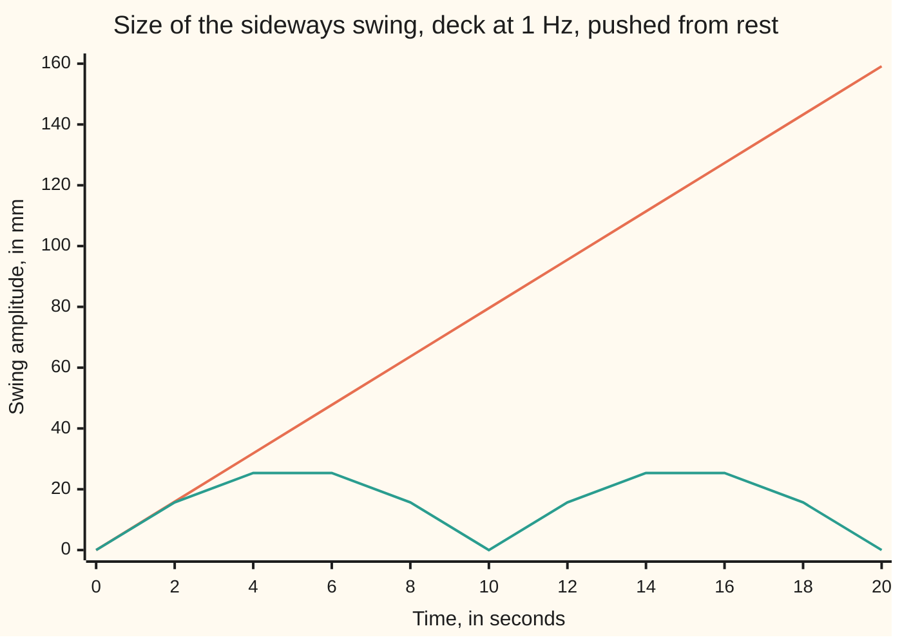
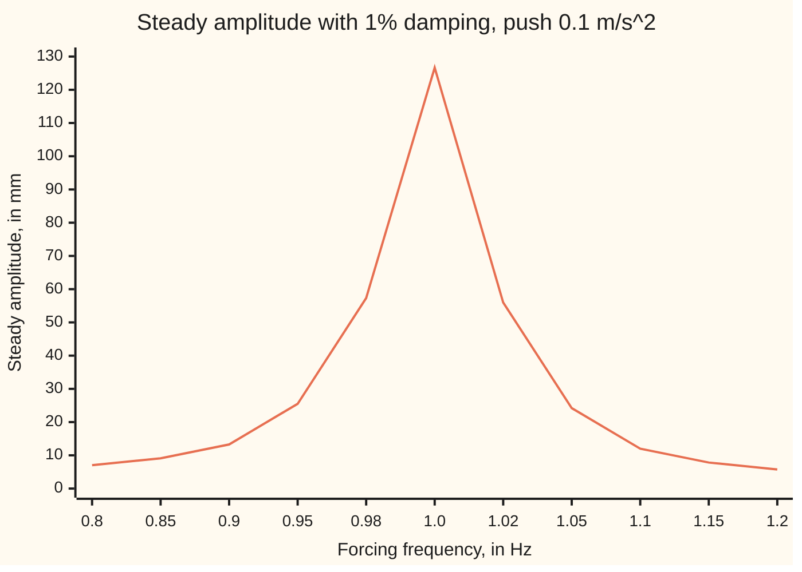

# Resonance: push at the natural frequency and the swing grows, push nearby and it beats

[Syllabus](../../../SYLLABUS.md) → [Differential equations and dynamics](../../../SYLLABUS.md#w08) → [Oscillators - Second-Order Linear Equations](../../../SYLLABUS.md#w08-s03) → Resonance

---

## General Overview

A footbridge deck, nudged sideways and let go, sways once a second: its natural frequency is 1 Hz (one cycle per second). A crowd's footfalls shove it sideways: model them as a smooth push that repeats once per stride (a left step and a right step), at most 0.1 newtons per kilogram of deck.

Walk at 1 Hz and every shove lands in step with the sway. From rest, the swing grows by 7.96 mm every second while nothing drains energy: 79.58 mm after 10 s, 159.15 mm after 20 s. That is **resonance**.

Walk at 0.9 Hz and the shoves drift in and out of step. They help, then fight the sway and undo it; big swings come every 10 s, never passing 26.66 mm. That rise and fall is **beats**, the throb of two guitar strings slightly out of tune.

**Pushed at its own frequency, an undamped spring's swing grows in proportion to time; pushed nearby, it rises and falls at the difference of the two frequencies.**

**What kind of fact this is:** a theorem about the equation, proved on this card in Why it works; the footbridge equation itself is a model, which real crowds only approximate.

### The picture: how big the swing gets, second by second



Orange: pushed at 1 Hz, the envelope (the curve traced by the swing's peaks) climbs in a straight line. Teal: pushed at 0.9 Hz, it rises and falls, peaking at 26.66 mm at 5 s and 15 s. The deck oscillates inside each envelope.

---

## The formula

Let y be the deck's sideways displacement in metres. Reminder: y' is its rate, the velocity, and y'' the rate of that rate, the acceleration ([The characteristic equation](02-the-characteristic-equation.md)). A frequency f in hertz becomes an **angular frequency** ω = 2πf in radians per second, since one cycle is 2π radians of angle. The deck's own 1 Hz is ω0 = 6.2832 rad/s; the push at 0.9 Hz is ω = 5.6549 rad/s. The deck starts at rest:

$$y'' + \omega_0^2\,y = F\cos(\omega t),\qquad y(0) = 0,\quad y'(0) = 0$$

**Read it aloud:** acceleration plus the spring's pull, ω0 squared times displacement, equals a push of strength F at angular frequency ω.

Away from the natural frequency:

$$y(t) = \frac{F}{\omega_0^2-\omega^2}\bigl(\cos\omega t-\cos\omega_0 t\bigr) = \frac{2F}{\omega_0^2-\omega^2}\,\sin\frac{(\omega_0-\omega)t}{2}\,\sin\frac{(\omega_0+\omega)t}{2}$$

**Read it aloud:** a fast oscillation at the average frequency, inside a slow envelope at half the difference.

At the natural frequency:

$$y(t) = \frac{F}{2\omega_0}\,t\,\sin\omega_0 t$$

**Read it aloud:** the deck swings at its own frequency, its amplitude growing by F over 2ω0 each second.

Add damping, a drag proportional to velocity, and the swing settles to a steady amplitude:

$$y'' + b\,y' + \omega_0^2\,y = F\cos(\omega t),\qquad A(\omega) = \frac{F}{\sqrt{(\omega_0^2-\omega^2)^2 + b^2\omega^2}}$$

**Read it aloud:** the push divided by a quantity that is smallest close to where the two frequencies meet.

| Symbol | Plain meaning | In our example | Push it up and the answer… |
| --- | --- | --- | --- |
| $y$ | sideways displacement in metres; y' velocity, y'' acceleration | 0 at the start; −26.66 mm at 5 s | — |
| $t$ | time since the crowd stepped on, in seconds | 0 to 20 s | resonant swing grows |
| $\omega_0$ | natural angular frequency, 2π times f0 = 1 Hz | 6.2832 rad/s | faster free sway |
| $\omega$ | forcing angular frequency, 2π times the pace f | 5.6549 rad/s at 0.9 Hz | nearer ω0: bigger, slower beats |
| $F$ | strongest push per kilogram of deck, in N/kg, the same as m/s^2 | 0.1 m/s^2 | every swing scales with it |
| $b$ | damping: drag per unit velocity, per second | 0.1257 per s | lower, broader peak |
| $\zeta$ | damping ratio b / (2ω0), a pure number | 0.01, that is 1% | lower peak, 1 / (2ζ) times the static sag |
| $A$ | steady amplitude after the start dies out | 126.65 mm at 1 Hz | — |

### When it holds

- **No damping, for unlimited growth.** With 1% damping the resonant swing settles at 126.65 mm.
- **A linear spring.** Large swings stiffen or loosen a real deck and shift its natural frequency.
- **A push fixed in advance.** Real walkers adjust their steps to the sway, a feedback this equation leaves out.
- **ω different from ω0 for the beat formula.** At ω = ω0 its denominator is zero and t sin t takes over.

---

## Why it works

### Step 0: the answer is one response to the push plus free ringing

Every solution of this linear equation is one response to the push plus a mix of the free swings cos ω0 t and sin ω0 t ([Superposition](01-superposition-and-the-shape-of-linear-solutions.md)). The push decides the particular part; the start at rest decides the mix.

### Step 1: off resonance, a cosine answers a cosine

Guess y = C cos ωt, as in [Undetermined coefficients](05-undetermined-coefficients.md). Then y'' = −ω^2 C cos ωt, and the equation reads (ω0^2 − ω^2)C = F. At 0.9 Hz, ω0^2 − ω^2 = 7.5009 per s^2, so C = 13.33 mm.

That guess starts at 13.33 mm, not 0. Subtracting the free swing 13.33 mm × cos ω0 t fixes the start, adds no velocity at t = 0, and leaves the push matched. That is the formula's first form.

### Step 2: two cosines make a slow wave times a fast one

The sum-to-product identity ([Trig identities](../../05-Geometry%20and%20trig/03-Trigonometry/03-trig-identities.md)) rewrites cos ωt − cos ω0 t as 2 sin((ω0 − ω)t/2) sin((ω0 + ω)t/2). The second factor runs at the average frequency; the first is slow, one cycle every 20 s.

Its size peaks twice per cycle, once positive and once negative, so big swings come every 10 s: the **beat frequency** is f0 − f. At 5 s the swing reaches 2 × 13.33 = 26.66 mm; at 10 s it is zero.

### Step 3: at resonance the guess fails, and time becomes a factor

At ω = ω0 the guess gives 0 × C = F: no C works, because cos ω0 t already solves the push-free equation. Take the limit of Step 1's answer instead. As ω nears ω0, the top is close to −t sin(ω0 t)(ω − ω0), since the rate of cos ωt with respect to ω is −t sin ωt. The bottom, (ω0 − ω)(ω0 + ω), is close to 2ω0(ω0 − ω). The factor ω0 − ω cancels, leaving F t sin(ω0 t) / (2ω0).

The envelope grows by F / (2ω0) = 7.96 mm per second; at 10.25 s the swing is 81.57 mm.

<details>
<summary>Detailed proof: t sin t solves the equation, starts at rest, and is the only answer</summary>

Let y = k t sin ω0 t with k = F / (2ω0). The product rule gives y' = k(sin ω0 t + ω0 t cos ω0 t), and y'' = k(2ω0 cos ω0 t − ω0^2 t sin ω0 t).

So y'' + ω0^2 y = 2kω0 cos ω0 t = F cos ω0 t, the push exactly, and y(0) = y'(0) = 0.

Two solutions with the same start differ by a push-free solution starting at 0 with velocity 0, which is zero ([The Wronskian](04-wronskian-and-reduction-of-order.md)). So this is the only answer.

</details>

<details>
<summary>Why a straight line and not an exponential</summary>

In step, the push adds energy each cycle as force times distance, in proportion to the amplitude. The energy held goes as the amplitude squared. Amplitude squared growing at a rate proportional to amplitude means amplitude growing at a constant rate.

</details>

### Step 4: damping caps the growth

With drag b y', guess y = P cos ωt + Q sin ωt; matching cosines and sines fixes P and Q, and the answer's size is A(ω). The **damping ratio** ζ = b / (2ω0) compares drag to spring; at ζ = 1%, b = 0.1257 per s.

At ω = ω0 the first bracket vanishes and A = F / (bω0) = 126.65 mm. A constant push of that size sags the deck F / ω0^2 = 2.53 mm, so resonance multiplies it by 50.0, which is 1 / (2ζ). At 0.9 Hz, A = 13.27 mm against the undamped 13.33 mm: damping matters only near the peak. The exact peak sits a hair lower, at ω^2 = ω0^2 − b^2/2; at 1% damping that is 0.01% below 1 Hz.

<details>
<summary>The algebra behind A(ω)</summary>

Write D = ω0^2 − ω^2. The cosines give DP + bωQ = F; the sines give −bωP + DQ = 0. So P = FD / (D^2 + b^2ω^2), Q = Fbω / (D^2 + b^2ω^2), and the square root of P^2 + Q^2 is F / √(D^2 + b^2ω^2).

</details>

### The picture: the steady swing against walking pace



Orange: A(ω) from the formula. At 0.98 Hz or 1.02 Hz the swing is 57.33 mm or 55.97 mm: the peak is a narrow spike.

A second route to Step 3 needs no guess: [Variation of parameters](07-variation-of-parameters.md) builds the response from integrals, and the factor t falls out.

---

## Worked numbers, by hand

| Step | Arithmetic | Value |
| --- | --- | --- |
| natural angular frequency | 2π × 1 | 6.2832 rad/s |
| forcing at 0.9 Hz | 2π × 0.9 | 5.6549 rad/s |
| the gap in squares | 6.2832^2 − 5.6549^2 | 7.5009 per s^2 |
| steady part | 0.1 / 7.5009 | 13.33 mm |
| beat peak, at 5 s | 2 × 13.33 | **26.66 mm** |
| beat period | 1 / (1 − 0.9) | **10 s** |
| resonant growth rate | 0.1 / (2 × 6.2832) | **7.96 mm/s** |
| swing at 10.25 s, 1 Hz | 7.96 × 10.25 | 81.57 mm |
| damped peak, ζ = 1% | 0.1 / (0.1257 × 6.2832) | **126.65 mm** |

Out of step, the deck never passes 26.66 mm; in step, it passes that at 3.35 s.

### What breaks if you drop a piece

| Mistake | Comes out at | What went wrong |
| --- | --- | --- |
| Plain guess C cos ω0 t at 1 Hz | 0 × C = F, no C | The push solves the free equation; the answer needs t |
| Beat period read as 2 / (f0 − f) | 20 s, not 10 s | The slow sine's size peaks twice per cycle |
| Steady part kept, start dropped | 13.33 mm, not 26.66 mm | Starting from rest adds a free swing as big |
| Damping ignored at 0.99 Hz | 127.29 mm, not 90.23 mm | Near the peak the drag term matches the gap |

The code prints every row.

---

## Code, from first principles, and it actually runs

Road one is the closed forms. Road two steps displacement and velocity by Euler's rule, new value = old value + step h × rate ([Euler's method](../05-Numerical%20Evolution/01-eulers-method.md)). It never uses the sine formulas; its error halves when h halves. A third check puts the forcing frequency within a millionth of ω0 in the beat formula and lands on t sin t.

### Python

```python
# Resonance and beats -- the check behind the card.  Standard library only.
# A footbridge deck, natural frequency 1 Hz, pushed from rest by F cos(wt)
# per kg, F = 0.1 m/s^2:  y'' + b y' + w0^2 y = F cos(wt).  Road one is the
# closed form; road two steps the equation with Euler's rule, which never
# uses a sine formula, and the error halves as the step halves.
import math
F, w0, w = 0.1, 2 * math.pi, 2 * math.pi * 0.9
b = 2 * 0.01 * w0                          # damping ratio 1%

def euler(w, b, t_end, h, tail=0.0):       # new = old + step x rate; tail: max |y| at the end
    y = v = t = top = 0.0
    for _ in range(round(t_end / h)):
        y, v, t = y + h * v, v + h * (F * math.cos(w * t) - b * v - w0 * w0 * y), t + h
        top = max(top, abs(y)) if t > t_end - tail else top
    return top if tail else y

def beat(w, t): return F * (math.cos(w * t) - math.cos(w0 * t)) / (w0 * w0 - w * w)
def res(t): return F * t * math.sin(w0 * t) / (2 * w0)
def amp(f, b): return F / math.sqrt((w0 * w0 - (2 * math.pi * f) ** 2) ** 2 + (b * 2 * math.pi * f) ** 2)

mm = lambda x: f"{1000 * x:.2f}"
row = lambda xs: " ".join(xs)
hs, D = (1e-4, 5e-5), w0 * w0 - w * w
eb = [abs(euler(w, 0, 5, h) - beat(w, 5)) for h in hs]
er = [abs(euler(w0, 0, 10.25, h) - res(10.25)) for h in hs]
pk = [euler(w0, b, 150, h, 2) for h in hs]
ed = [abs(p - amp(1, b)) for p in pk]
near = beat(w0 * (1 - 1e-6), 10.25)
prod = 2 * F / D * math.sin((w0 - w) * 5 / 2) * math.sin((w0 + w) * 5 / 2)
fs = [0.8, 0.85, 0.9, 0.95, 0.98, 1.0, 1.02, 1.05, 1.1, 1.15, 1.2]
print(f"w0 = {w0:.4f} rad/s; w at 0.9 Hz = {w:.4f} rad/s; w0^2 - w^2 = {D:.4f} per s^2")
print(f"0.9 Hz from rest: y(5) = {mm(beat(w, 5))} mm; product form {mm(prod)} mm; y(10) = {mm(beat(w, 10))} mm")
print(f"steady part alone peaks at {mm(F / D)} mm; beats peak at 2F/(w0^2 - w^2) = {mm(2 * F / D)} mm")
print(f"1 Hz from rest: envelope grows {mm(F / (2 * w0))} mm/s; y(10.25) = {mm(res(10.25))} mm")
print(f"beat formula at w = w0(1 - 1e-6), t = 10.25: {mm(near)} mm")
print(f"Euler errors, h = 1e-4, 5e-5: beats {eb[0] * 1000:.4f} {eb[1] * 1000:.4f} mm; resonance {mm(er[0])} {mm(er[1])} mm")
print(f"envelopes cross at 4 w0/(w0^2 - w^2) = {4 * w0 / D:.2f} s")
print("t (s):                 " + row(f"{t}" for t in range(0, 21, 2)))
print("resonance envelope mm: " + row(mm(F * t / (2 * w0)) for t in range(0, 21, 2)))
print("beat envelope mm:      " + row(mm(2 * F / D * abs(math.sin((w0 - w) * t / 2))) for t in range(0, 21, 2)))
print(f"damped: zeta = {b / (2 * w0):.2f}, b = {b:.4f} per s; static F/w0^2 = {mm(F / w0 ** 2)} mm; peak F/(b w0) = {mm(F / (b * w0))} mm; ratio {F / (b * w0) / (F / w0 ** 2):.1f}")
print(f"damped peak by Euler to t = 150 s, h = 1e-4, 5e-5: {mm(pk[0])} {mm(pk[1])} mm; errors {mm(ed[0])} {mm(ed[1])} mm")
print("forcing f (Hz):   " + row(f"{f}" for f in fs))
print("steady amp (mm):  " + row(mm(amp(f, b)) for f in fs))
print(f"mistake, plain guess C cos(w0 t) at 1 Hz: coefficient w0^2 - w0^2 = {w0 * w0 - w0 * w0:.1f}, so 0 x C = F")
print(f"mistake, beat period read as 2/(f0 - f) = {2 / (1 - 0.9):.0f} s; loud peaks come every 1/(f0 - f) = {1 / (1 - 0.9):.0f} s")
print(f"mistake, damping ignored at 0.99 Hz: {mm(amp(0.99, 0))} mm, true {mm(amp(0.99, b))} mm")
assert eb[1] < 1e-4 and 1.8 < eb[0] / eb[1] < 2.2           # Euler meets the beat formula, order one
assert er[1] < 1e-3 and 1.8 < er[0] / er[1] < 2.2           # Euler meets t sin t, order one
assert abs(near - res(10.25)) < 1e-6                        # beats tend to resonance as w -> w0
assert ed[1] < 3e-3 and 1.8 < ed[0] / ed[1] < 2.2           # long run settles to F/(b w0)
print("ALL CHECKS PASS")
```

**Ran 2026-09-28 on macOS, Python 3.14.6, standard library only. All checks passed. Output, pasted from the run:**

```
w0 = 6.2832 rad/s; w at 0.9 Hz = 5.6549 rad/s; w0^2 - w^2 = 7.5009 per s^2
0.9 Hz from rest: y(5) = -26.66 mm; product form -26.66 mm; y(10) = 0.00 mm
steady part alone peaks at 13.33 mm; beats peak at 2F/(w0^2 - w^2) = 26.66 mm
1 Hz from rest: envelope grows 7.96 mm/s; y(10.25) = 81.57 mm
beat formula at w = w0(1 - 1e-6), t = 10.25: 81.57 mm
Euler errors, h = 1e-4, 5e-5: beats 0.1321 0.0659 mm; resonance 0.83 0.41 mm
envelopes cross at 4 w0/(w0^2 - w^2) = 3.35 s
t (s):                 0 2 4 6 8 10 12 14 16 18 20
resonance envelope mm: 0.00 15.92 31.83 47.75 63.66 79.58 95.49 111.41 127.32 143.24 159.15
beat envelope mm:      0.00 15.67 25.36 25.36 15.67 0.00 15.67 25.36 25.36 15.67 0.00
damped: zeta = 0.01, b = 0.1257 per s; static F/w0^2 = 2.53 mm; peak F/(b w0) = 126.65 mm; ratio 50.0
damped peak by Euler to t = 150 s, h = 1e-4, 5e-5: 130.75 128.66 mm; errors 4.09 2.01 mm
forcing f (Hz):   0.8 0.85 0.9 0.95 0.98 1.0 1.02 1.05 1.1 1.15 1.2
steady amp (mm):  7.03 9.11 13.27 25.50 57.33 126.65 55.97 24.21 12.00 7.83 5.75
mistake, plain guess C cos(w0 t) at 1 Hz: coefficient w0^2 - w0^2 = 0.0, so 0 x C = F
mistake, beat period read as 2/(f0 - f) = 20 s; loud peaks come every 1/(f0 - f) = 10 s
mistake, damping ignored at 0.99 Hz: 127.29 mm, true 90.23 mm
ALL CHECKS PASS
```

### Rust

Same numbers, same labels, built with `rustc --edition 2021 -O`.

```rust
// Resonance and beats -- the same check as the Python, in Rust.  No crates.
// A footbridge deck, natural frequency 1 Hz, pushed from rest by F cos(wt)
// per kg, F = 0.1 m/s^2:  y'' + b y' + w0^2 y = F cos(wt).  Road one is the
// closed form; road two steps the equation with Euler's rule, which never
// uses a sine formula, and the error halves as the step halves.
use std::f64::consts::PI;
const F: f64 = 0.1;
const W0: f64 = 2.0 * PI;

fn euler(w: f64, b: f64, t_end: f64, h: f64, tail: f64) -> f64 { // new = old + step x rate
    let (mut y, mut v, mut t, mut top) = (0.0f64, 0.0f64, 0.0f64, 0.0f64);
    for _ in 0..(t_end / h).round() as usize {
        let a = F * (w * t).cos() - b * v - W0 * W0 * y;
        y += h * v;
        v += h * a;
        t += h;
        if t > t_end - tail { top = top.max(y.abs()) }
    }
    if tail > 0.0 { top } else { y }
}

fn beat(w: f64, t: f64) -> f64 { F * ((w * t).cos() - (W0 * t).cos()) / (W0 * W0 - w * w) }
fn res(t: f64) -> f64 { F * t * (W0 * t).sin() / (2.0 * W0) }
fn amp(f: f64, b: f64) -> f64 {
    let w = 2.0 * PI * f;
    F / ((W0 * W0 - w * w).powi(2) + (b * w).powi(2)).sqrt()
}
fn mm(x: f64) -> String { format!("{:.2}", 1000.0 * x) }
fn row(xs: Vec<String>) -> String { xs.join(" ") }

fn main() {
    let (w, b) = (2.0 * PI * 0.9, 2.0 * 0.01 * W0);          // damping ratio 1%
    let hs = [1e-4, 5e-5];
    let d = W0 * W0 - w * w;
    let eb: Vec<f64> = hs.iter().map(|&h| (euler(w, 0.0, 5.0, h, 0.0) - beat(w, 5.0)).abs()).collect();
    let er: Vec<f64> = hs.iter().map(|&h| (euler(W0, 0.0, 10.25, h, 0.0) - res(10.25)).abs()).collect();
    let pk: Vec<f64> = hs.iter().map(|&h| euler(W0, b, 150.0, h, 2.0)).collect();
    let ed: Vec<f64> = pk.iter().map(|p| (p - amp(1.0, b)).abs()).collect();
    let near = beat(W0 * (1.0 - 1e-6), 10.25);
    let prod = 2.0 * F / d * ((W0 - w) * 5.0 / 2.0).sin() * ((W0 + w) * 5.0 / 2.0).sin();
    let fs = ["0.8", "0.85", "0.9", "0.95", "0.98", "1.0", "1.02", "1.05", "1.1", "1.15", "1.2"];
    let ts: Vec<f64> = (0..11).map(|i| 2.0 * i as f64).collect();
    println!("w0 = {:.4} rad/s; w at 0.9 Hz = {:.4} rad/s; w0^2 - w^2 = {:.4} per s^2", W0, w, d);
    println!("0.9 Hz from rest: y(5) = {} mm; product form {} mm; y(10) = {} mm", mm(beat(w, 5.0)), mm(prod), mm(beat(w, 10.0)));
    println!("steady part alone peaks at {} mm; beats peak at 2F/(w0^2 - w^2) = {} mm", mm(F / d), mm(2.0 * F / d));
    println!("1 Hz from rest: envelope grows {} mm/s; y(10.25) = {} mm", mm(F / (2.0 * W0)), mm(res(10.25)));
    println!("beat formula at w = w0(1 - 1e-6), t = 10.25: {} mm", mm(near));
    println!("Euler errors, h = 1e-4, 5e-5: beats {:.4} {:.4} mm; resonance {} {} mm", eb[0] * 1000.0, eb[1] * 1000.0, mm(er[0]), mm(er[1]));
    println!("envelopes cross at 4 w0/(w0^2 - w^2) = {:.2} s", 4.0 * W0 / d);
    println!("t (s):                 {}", row(ts.iter().map(|t| format!("{}", t)).collect()));
    println!("resonance envelope mm: {}", row(ts.iter().map(|t| mm(F * t / (2.0 * W0))).collect()));
    println!("beat envelope mm:      {}", row(ts.iter().map(|t| mm(2.0 * F / d * ((W0 - w) * t / 2.0).sin().abs())).collect()));
    println!("damped: zeta = {:.2}, b = {:.4} per s; static F/w0^2 = {} mm; peak F/(b w0) = {} mm; ratio {:.1}", b / (2.0 * W0), b, mm(F / (W0 * W0)), mm(F / (b * W0)), (F / (b * W0)) / (F / (W0 * W0)));
    println!("damped peak by Euler to t = 150 s, h = 1e-4, 5e-5: {} {} mm; errors {} {} mm", mm(pk[0]), mm(pk[1]), mm(ed[0]), mm(ed[1]));
    println!("forcing f (Hz):   {}", fs.join(" "));
    println!("steady amp (mm):  {}", row(fs.iter().map(|f| mm(amp(f.parse().unwrap(), b))).collect()));
    println!("mistake, plain guess C cos(w0 t) at 1 Hz: coefficient w0^2 - w0^2 = {:.1}, so 0 x C = F", W0 * W0 - W0 * W0);
    println!("mistake, beat period read as 2/(f0 - f) = {:.0} s; loud peaks come every 1/(f0 - f) = {:.0} s", 2.0 / (1.0 - 0.9), 1.0 / (1.0 - 0.9));
    println!("mistake, damping ignored at 0.99 Hz: {} mm, true {} mm", mm(amp(0.99, 0.0)), mm(amp(0.99, b)));
    assert!(eb[1] < 1e-4 && eb[0] / eb[1] > 1.8 && eb[0] / eb[1] < 2.2);    // Euler meets the beat formula
    assert!(er[1] < 1e-3 && er[0] / er[1] > 1.8 && er[0] / er[1] < 2.2);    // Euler meets t sin t
    assert!((near - res(10.25)).abs() < 1e-6);                              // beats tend to resonance
    assert!(ed[1] < 3e-3 && ed[0] / ed[1] > 1.8 && ed[0] / ed[1] < 2.2);    // long run settles to F/(b w0)
    println!("ALL CHECKS PASS");
}
```

**Ran 2026-09-28 on macOS, rustc 1.98.1, no crates. All checks passed. Output, pasted from the run:**

```
w0 = 6.2832 rad/s; w at 0.9 Hz = 5.6549 rad/s; w0^2 - w^2 = 7.5009 per s^2
0.9 Hz from rest: y(5) = -26.66 mm; product form -26.66 mm; y(10) = 0.00 mm
steady part alone peaks at 13.33 mm; beats peak at 2F/(w0^2 - w^2) = 26.66 mm
1 Hz from rest: envelope grows 7.96 mm/s; y(10.25) = 81.57 mm
beat formula at w = w0(1 - 1e-6), t = 10.25: 81.57 mm
Euler errors, h = 1e-4, 5e-5: beats 0.1321 0.0659 mm; resonance 0.83 0.41 mm
envelopes cross at 4 w0/(w0^2 - w^2) = 3.35 s
t (s):                 0 2 4 6 8 10 12 14 16 18 20
resonance envelope mm: 0.00 15.92 31.83 47.75 63.66 79.58 95.49 111.41 127.32 143.24 159.15
beat envelope mm:      0.00 15.67 25.36 25.36 15.67 0.00 15.67 25.36 25.36 15.67 0.00
damped: zeta = 0.01, b = 0.1257 per s; static F/w0^2 = 2.53 mm; peak F/(b w0) = 126.65 mm; ratio 50.0
damped peak by Euler to t = 150 s, h = 1e-4, 5e-5: 130.75 128.66 mm; errors 4.09 2.01 mm
forcing f (Hz):   0.8 0.85 0.9 0.95 0.98 1.0 1.02 1.05 1.1 1.15 1.2
steady amp (mm):  7.03 9.11 13.27 25.50 57.33 126.65 55.97 24.21 12.00 7.83 5.75
mistake, plain guess C cos(w0 t) at 1 Hz: coefficient w0^2 - w0^2 = 0.0, so 0 x C = F
mistake, beat period read as 2/(f0 - f) = 20 s; loud peaks come every 1/(f0 - f) = 10 s
mistake, damping ignored at 0.99 Hz: 127.29 mm, true 90.23 mm
ALL CHECKS PASS
```

The two outputs match line for line.

> [!TIP]
> **Try changing**
> Guess first, then run it.
> - **Five times the damping.** Change `0.01` to `0.05` in the `b` line. The peak drops to 25.33 mm, 10.0 times the static sag. Every assert passes.
> - **Coarser steps.** Change `(1e-4, 5e-5)` to `(2e-4, 1e-4)`. The beat errors double to 0.2651 mm and 0.1321 mm; the first assert stops the run.
> - **Not close enough.** Change `1 - 1e-6` to `1 - 1e-2` in the `near` line. The beat formula gives 76.43 mm, not 81.57 mm; the third assert stops the run.

---

## The usual mistake

> [!warning]
> **Believing resonance means infinite swing.** The t sin t growth belongs to the undamped equation. Real damping stops the growth once drag removes as much energy per cycle as the push adds: 126.65 mm at 1%. Resonance promises a large multiplier, here 50.0 times the static sag, not infinity.

---

## Where you meet it in real life

- **London's Millennium Bridge, June 2000.** On opening day walkers fell into step with the swaying deck and amplified it. Dampers were fitted before it reopened.
- **Tuning.** Two strings slightly apart throb at their difference frequency.
- **Radios.** A tuned circuit is the damped equation with charge in place of displacement; its sharp peak picks one station ([The RLC circuit](08-the-rlc-circuit-and-the-spring.md)).

> **Say it back**
> Pushed near its own frequency, a spring mixes the push's frequency with its own. The sum-to-product identity turns the mix into a fast swing inside a slow envelope returning at the difference frequency: beats. Pushed at its own frequency, the answer carries a factor t, so without damping the swing grows in a straight line. Damping caps it at F / (bω0), here 126.65 mm.

---

## What this builds on

- [Undetermined coefficients](05-undetermined-coefficients.md): the guess C cos ωt, and multiplying a failing guess by t.
- [Trig identities](../../05-Geometry%20and%20trig/03-Trigonometry/03-trig-identities.md): the sum-to-product identity behind beats.

## Where this goes next

- RLC resonance: the same amplitude curve in a circuit.

How damping sets the peak's width, and so how sharply a circuit picks one frequency, is left to that card.

---

## Sources

Verified 2026-09-28: every link below resolves to the publisher's page.

- OpenStax. *Calculus Volume 3*, section 7.3, "Applications". [Free text](https://openstax.org/books/calculus-volume-3/pages/7-3-applications). Forced springs and resonance, worked.
- MIT OpenCourseWare. *18.03SC Differential Equations*, Fall 2011. [Course page](https://ocw.mit.edu/courses/18-03sc-differential-equations-fall-2011/). Sinusoidal forcing, resonance and the amplitude curve.
- Strogatz, Steven H., Daniel M. Abrams, Allan McRobie, Bruno Eckhardt and Edward Ott. "Crowd synchrony on the Millennium Bridge." *Nature* 438, 43–44 (2005). [doi:10.1038/438043a](https://doi.org/10.1038/438043a). Why walkers fell into step with the deck.
