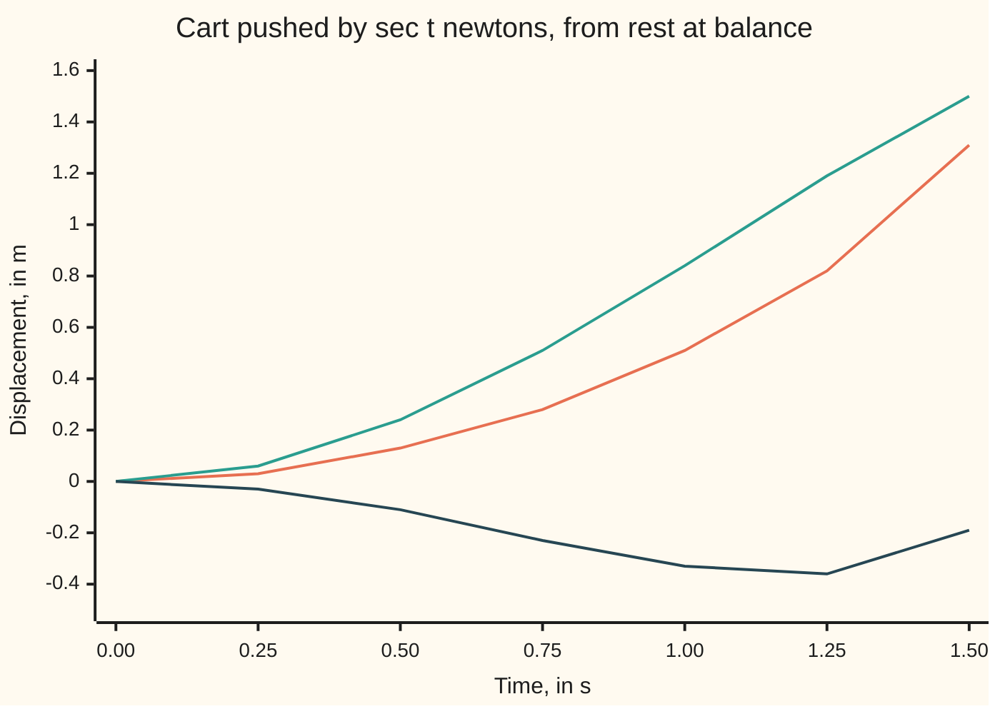

# Variation of parameters: let the constants vary and any forcing term can be handled

[Syllabus](../../../SYLLABUS.md) → [Differential equations and dynamics](../README.md) → [Oscillators - Second-Order Linear Equations](../README.md#s03) → Variation of parameters

---

## General Overview

A 1 kg cart rolls on a frictionless track, tied to a wall by a spring of stiffness 1 N/m. A motor pushes it with a force of sec t newtons, where t is the time in seconds and sec t, the secant, is 1 divided by cos t. The push is 1 N at the start, 2 N at t = 1.0472 s, and grows without limit as t nears π/2 = 1.5708 s.

With y the cart's distance from balance in metres and y'' its acceleration, Newton's law reads y'' + y = sec t: the acceleration is the push minus the displacement. The cart starts at rest at balance.

Guessing an answer shaped like the push, as [Undetermined coefficients](05-undetermined-coefficients.md) does, fails here: each derivative of sec t brings a higher power of sec t, so no finite list of trial shapes closes up. Instead take the free swing c1 cos t + c2 sin t and let the constants change with time: **variation of parameters**. It gives y = cos t ln cos t + t sin t, with ln the natural logarithm.

**Let the constant weights on the free motions become functions of time, make one choice that keeps the velocity simple, and the forcing then fixes the weights' rates through a two-by-two system whose determinant is the Wronskian.**

**What kind of fact this is:** a method, proved on this card in Why it works.

### The picture: the cart's motion and its two parts



Orange: the cart. Teal: the part t sin t. Dark blue: the part cos t ln cos t. Orange is the sum of the other two.

---

## The formula

A second-order linear equation in standard form is y'' + p(t) y' + q(t) y = g(t), with 1 in front of y''; p and q are given functions of time, and g is the **forcing**, the push. With g set to zero it is the **free** equation, and two free solutions y1 and y2, neither a multiple of the other, build every free motion as c1 y1 + c2 y2 ([Superposition](01-superposition-and-the-shape-of-linear-solutions.md)). Their **Wronskian** W = y1 y2' − y2 y1' is never zero for such a pair ([The Wronskian](04-wronskian-and-reduction-of-order.md)).

Try y = u1 y1 + u2 y2 with weights u1 and u2 that vary in time. Their rates must be

$$u_1' = -\frac{y_2\,g}{W}, \qquad u_2' = \frac{y_1\,g}{W}$$

Integrating from time 0, with s running over the earlier times, gives a **particular solution**: one solution of the forced equation.

$$y_p(t) = -y_1(t)\int_0^t \frac{y_2(s)\,g(s)}{W(s)}\,ds \;+\; y_2(t)\int_0^t \frac{y_1(s)\,g(s)}{W(s)}\,ds$$

**Read it aloud:** weigh the forcing against the other free motion, divide by the Wronskian, add up from the start, and use the running total as the weight on each free motion, with a minus sign on the first.

It starts at 0 with velocity 0. Every solution is y = c1 y1 + c2 y2 + y_p, the constants fixing the start.

For the cart, y1 = cos t, y2 = sin t, W = cos^2 t + sin^2 t = 1 and g = sec t:

$$u_1 = \ln\cos t, \qquad u_2 = t, \qquad y_p = \cos t\,\ln\cos t + t\sin t$$

| Symbol | Plain meaning | In our example | Push it up and the answer… |
| --- | --- | --- | --- |
| $t$, $s$ | time in s; s is an earlier moment inside an integral | 0 to 1.5 s | — |
| $y$, $y'$, $y''$ | displacement in m, velocity in m/s, acceleration in m/s^2 | y'' + y = sec t | — |
| $p$, $q$, $g$ | damping, stiffness, forcing | 0, 1, sec t | doubling g doubles y_p |
| $y_1$, $y_2$ | two free motions, neither a multiple of the other | cos t, sin t | — |
| $W$ | the Wronskian, y1 y2' − y2 y1' | 1 | rescaling y1 or y2 rescales W; y_p is unchanged |
| $u_1$, $u_2$ | the time-varying weights on y1 and y2 | ln cos t and t | — |
| $y_p$ | a particular solution, starting at 0 with velocity 0 | cos t ln cos t + t sin t | — |
| $c_1$, $c_2$ | constant weights that fix the start | 2 and −1 in the second case | move only the free part |

### When it holds

- **Linear, in standard form.** Divide a(t) y'' + b(t) y' + c(t) y = f(t) by a(t) first, so g = f/a; skip it and the answer is off by the factor a.
- **Two independent free solutions in hand.** [The characteristic equation](02-the-characteristic-equation.md) finds them for constant coefficients. A dependent pair such as cos t and 2 cos t has W = 0, and the division is impossible.
- **p, q and g continuous on an interval.** The answer lives there and no further. The push exists only for |t| < 1.5708 s; at t = 1.57 s the cart is at 1.5643 m, moving at 7.14 m/s and speeding up without limit.

---

## Why it works

### Step 0: two unknowns and one equation leave a free choice

With constant weights, y is a free motion and ignores the motor. Two unknown functions, u1 and u2, face one equation, so one extra condition is free to choose.

### Step 1: keep the velocity as if the weights were frozen

The product rule differentiates y = u1 y1 + u2 y2:

$$y' = u_1 y_1' + u_2 y_2' + \left(u_1' y_1 + u_2' y_2\right)$$

Require the bracket to be zero: u1' y1 + u2' y2 = 0. The velocity keeps its fixed-weight form, and no second derivative of u1 or u2 will appear.

### Step 2: the free parts cancel and the forcing is left

Differentiate again and substitute into y'' + p y' + q y. The terms carrying u1 collect as u1 times (y1'' + p y1' + q y1), which is zero because y1 is a free solution; likewise for u2. What remains must equal the forcing: u1' y1' + u2' y2' = g.

### Step 3: solve the two-by-two system with the Wronskian

Steps 1 and 2 give two linear equations in the two rates:

$$\begin{aligned} y_1 u_1' + y_2 u_2' &= 0 \\ y_1' u_1' + y_2' u_2' &= g \end{aligned}$$

Their determinant is W. Cramer's rule, which solves a two-by-two system by ratios of determinants, gives u1' = −y2 g / W and u2' = y1 g / W. W never vanishes for an independent pair, so the division is always safe.

### Step 4: the cart's weights

With W = 1: u1' = −sin t sec t = −tan t, and u2' = cos t sec t = 1, so u2 = t. For u1, substitute w = cos t, dw = −sin t dt ([Substitution](../../06-Calculus%20and%20analysis/04-Integrals/03-substitution.md)): the integral of −tan t is ln cos t, which is 0 at the start and real while cos t is positive.

Check: y_p'' = −cos t ln cos t + sin^2 t / cos t + cos t − t sin t, and adding y_p leaves (sin^2 t + cos^2 t) / cos t = sec t.

### Step 5: every other solution differs by a free motion

Two forced solutions differ by a free one, since the forcing cancels. So every solution is y_p + c1 cos t + c2 sin t; a release at 2 m and −1 m/s takes c1 = 2, c2 = −1.

<details>
<summary>Detailed proof: the method loses no solution</summary>

Let p, q and g be continuous on an interval I, and y1, y2 free solutions with W ≠ 0 on I.

Existence. The rates u1' = −y2 g/W and u2' = y1 g/W are continuous, so their integrals from t0 are differentiable. Steps 1 to 3 read backwards show that u1 y1 + u2 y2 solves the forced equation.

Nothing lost. Take any solution y. At each t, solve y = A y1 + B y2 and y' = A y1' + B y2' for A and B; the determinant is W ≠ 0, so A and B exist and are differentiable. Differentiating the first and comparing with the second gives A' y1 + B' y2 = 0; differentiating the second and using the equation gives A' y1' + B' y2' = g. So every solution has the assumed form.

One kernel. For the cart, the sine subtraction rule joins the two integrals: y_p(t) = ∫ from 0 to t of sin(t − s) sec s ds. The **kernel** sin(t − s) is the free swing, at time t, started by a unit push at time s.

</details>

So each past push g(s) starts a free swing sin(t − s), and the response adds them up. [Forced systems](../04-Systems%20and%20the%20Matrix%20Exponential/06-forced-systems-and-variation-of-constants.md) does it for systems with the matrix exponential.

---

## Worked numbers, by hand

At t = π/3 = 1.0472 s, where the push is 2 N:

| Step | Arithmetic | Value |
| --- | --- | --- |
| free motions | cos(π/3), sin(π/3) | 0.5000, 0.8660 |
| first weight | u1 = ln cos t = ln 0.5 | −0.6931 |
| second weight | u2 = t | 1.0472 |
| first part | u1 y1 = −0.6931 × 0.5000 | −0.3466 |
| second part | u2 y2 = 1.0472 × 0.8660 | 0.9069 |
| cart's displacement | −0.3466 + 0.9069 | **0.5603 m** |
| released at 2 m, −1 m/s | 2 × 0.5000 − 0.8660 + 0.5603 | **0.6943 m** |

From rest, the motor has pushed the cart 0.5603 m out after 1.0472 s; at t = π/6 it is 0.1372 m out.

### What breaks if you drop a piece

| Mistake | Comes out at | What went wrong |
| --- | --- | --- |
| Trial A sec t, as undetermined coefficients would | needs A = 0.5000 at t = 0 but A = 0.1250 at π/3 | y'' + y = 2A sec^3 t: no constant A fits |
| Sign of u1' flipped | y(π/3) = 1.2535 m; its push is 4 cos t − sec t, which is 0.0000 N there, not 2 | Cramer's rule puts the minus on u1' |
| W dropped, pair 2 cos t and 3 sin t | 3.3620 m, not 0.5603 | That pair has W = 6, so the answer is 6 times too big |
| Start (2, −1) ignored | 0.5603 m, not 0.6943 | y_p starts at rest; c1 and c2 carry the start |

---

## Code, from first principles, and it actually runs

Three roads to y_p(π/3). One: the closed answer. Two: the rates u1' and u2' summed by Simpson's rule (a weighted sum of samples approximating an integral), with the pair cos t, sin t and again with 2 cos t, 3 sin t; no logarithm is used. Three: Euler's rule, small steps along the slope of position and velocity ([Euler's method](../05-Numerical%20Evolution/01-eulers-method.md)), whose error halves with the step. A finite-difference second derivative rebuilds the push.

### Python

```python
# Variation of parameters -- the check behind the card.  Standard library only.
# A 1 kg cart on a 1 N/m spring, no friction, pushed by sec t = 1/cos t newtons:
# y'' + y = sec t, starting at rest at balance; t in s, y in m.  Road one: the
# closed answer y_p = cos t ln cos t + t sin t.  Road two: the rates u1' and u2'
# added up by Simpson's rule, then assembled.  Road three: Euler steps on the law.
import math

def g(t): return 1 / math.cos(t)                         # the push, in newtons
def yp(t): return math.cos(t) * math.log(math.cos(t)) + t * math.sin(t)
def dyp(t): return -math.sin(t) * math.log(math.cos(t)) + t * math.cos(t)

def simpson(f, a, b, n=2000):                             # area under f from a to b, n even
    s = f(a) + f(b) + sum((4 if i % 2 else 2) * f(a + i * (b - a) / n) for i in range(1, n))
    return s * (b - a) / (3 * n)

def varied(t, y1, y2, d1, d2, use_w=True):               # u1 y1 + u2 y2 from the two rates
    W = (lambda s: y1(s) * d2(s) - y2(s) * d1(s)) if use_w else (lambda s: 1.0)
    u1 = simpson(lambda s: -y2(s) * g(s) / W(s), 0, t)
    u2 = simpson(lambda s: y1(s) * g(s) / W(s), 0, t)
    return u1, u2, u1 * y1(t) + u2 * y2(t)

def euler(t_end, n, y=0.0, v=0.0):                        # n plain steps along the slope
    h, t = t_end / n, 0.0
    for _ in range(n):
        y, v, t = y + h * v, v + h * (g(t) - y), t + h
    return y

T = math.pi / 3
u1, u2, road2 = varied(T, math.cos, math.sin, lambda s: -math.sin(s), math.cos)
B2 = (lambda s: 2 * math.cos(s), lambda s: 3 * math.sin(s), lambda s: -2 * math.sin(s), lambda s: 3 * math.cos(s))
scaled, no_w = varied(T, *B2)[2], varied(T, *B2, use_w=False)[2]      # a rescaled pair, W = 6
errs = [abs(euler(T, n) - yp(T)) for n in (100, 200, 400)]
fd = lambda f, t, e=1e-4: (f(t + e) - 2 * f(t) + f(t - e)) / e ** 2 + f(t)   # y'' + y
flip = lambda t: -math.cos(t) * math.log(math.cos(t)) + t * math.sin(t)
full = 2 * math.cos(T) - math.sin(T) + yp(T)
ts = [0.25 * k for k in range(7)]
print("t (s)            ", ", ".join(f"{t:.2f}" for t in ts))
print("y_p (m)          ", ", ".join(f"{yp(t):.2f}" for t in ts))
print("t sin t (m)      ", ", ".join(f"{t * math.sin(t):.2f}" for t in ts))
print("cos t ln cos t   ", ", ".join(f"{math.cos(t) * math.log(math.cos(t)):.2f}" for t in ts))
print(f"by hand at pi/3 = {T:.4f}: cos {math.cos(T):.4f}, sin {math.sin(T):.4f}, ln cos {math.log(math.cos(T)):.4f}")
print(f"u1: Simpson {u1:.6f}, ln cos t {math.log(math.cos(T)):.6f}; u2: Simpson {u2:.6f}, t {T:.6f}")
print(f"u1 y1 = {u1 * math.cos(T):.4f}; u2 y2 = {u2 * math.sin(T):.4f}")
print(f"y_p(pi/3): closed {yp(T):.6f}; Simpson on u1', u2' {road2:.6f}; basis 2 cos t, 3 sin t (W = 6) {scaled:.6f}")
print("Euler error at pi/3, n = 100, 200, 400:", " ".join(f"{e:.6f}" for e in errs))
print(f"error ratios on halving h: {errs[0] / errs[1]:.3f} {errs[1] / errs[2]:.3f}")
print(f"push rebuilt at pi/3 from y'' + y: {fd(yp, T):.4f} N; sec(pi/3) = {g(T):.4f} N")
print(f"y_p(pi/6) = {yp(math.pi / 6):.6f}; start (2, -1): y(pi/3) = {full:.6f}")
print(f"edge: y_p(1.5) = {yp(1.5):.4f}, y_p(1.57) = {yp(1.57):.4f}, pi/2 = {math.pi / 2:.4f}; speed {dyp(1.5):.2f} and {dyp(1.57):.2f} m/s")
print(f"dependent pair cos t, 2 cos t: W = {math.cos(1) * -2 * math.sin(1) - 2 * math.cos(1) * -math.sin(1):.4f}")
print(f"mistake, trial A sec t: needs A = {1 / (2 * g(0) ** 2):.4f} at t = 0, A = {1 / (2 * g(T) ** 2):.4f} at pi/3")
print(f"mistake, sign of u1 flipped: y(pi/3) = {flip(T):.4f}, its push {abs(fd(flip, T)):.4f} N, not 2")
print(f"mistake, W dropped with basis 2 cos t, 3 sin t: y(pi/3) = {no_w:.4f}, not {yp(T):.4f}")
print(f"mistake, start (2, -1) ignored: y(pi/3) = {yp(T):.4f}, not {full:.4f}")
assert abs(road2 - yp(T)) < 1e-9 and abs(scaled - yp(T)) < 1e-9          # road two, two bases
assert all(1.8 < errs[i] / errs[i + 1] < 2.2 for i in range(2))           # road three, order one
assert errs[2] < 0.01                                                      # Euler lands near y_p
assert abs(fd(yp, T) - g(T)) < 1e-5                                        # the law itself
print("ALL CHECKS PASS")
```

**Ran 2026-09-28 on macOS, Python 3.14.6, standard library only. All checks passed. Output, pasted from the run:**

```
t (s)             0.00, 0.25, 0.50, 0.75, 1.00, 1.25, 1.50
y_p (m)           0.00, 0.03, 0.13, 0.28, 0.51, 0.82, 1.31
t sin t (m)       0.00, 0.06, 0.24, 0.51, 0.84, 1.19, 1.50
cos t ln cos t    0.00, -0.03, -0.11, -0.23, -0.33, -0.36, -0.19
by hand at pi/3 = 1.0472: cos 0.5000, sin 0.8660, ln cos -0.6931
u1: Simpson -0.693147, ln cos t -0.693147; u2: Simpson 1.047198, t 1.047198
u1 y1 = -0.3466; u2 y2 = 0.9069
y_p(pi/3): closed 0.560326; Simpson on u1', u2' 0.560326; basis 2 cos t, 3 sin t (W = 6) 0.560326
Euler error at pi/3, n = 100, 200, 400: 0.005327 0.002662 0.001330
error ratios on halving h: 2.001 2.001
push rebuilt at pi/3 from y'' + y: 2.0000 N; sec(pi/3) = 2.0000 N
y_p(pi/6) = 0.137229; start (2, -1): y(pi/3) = 0.694301
edge: y_p(1.5) = 1.3089, y_p(1.57) = 1.5643, pi/2 = 1.5708; speed 2.75 and 7.14 m/s
dependent pair cos t, 2 cos t: W = 0.0000
mistake, trial A sec t: needs A = 0.5000 at t = 0, A = 0.1250 at pi/3
mistake, sign of u1 flipped: y(pi/3) = 1.2535, its push 0.0000 N, not 2
mistake, W dropped with basis 2 cos t, 3 sin t: y(pi/3) = 3.3620, not 0.5603
mistake, start (2, -1) ignored: y(pi/3) = 0.5603, not 0.6943
ALL CHECKS PASS
```

### Rust

Same numbers, same labels, built with `rustc --edition 2021 -O`.

```rust
// Variation of parameters -- the same check as the Python, in Rust.  No crates.
// A 1 kg cart on a 1 N/m spring, no friction, pushed by sec t = 1/cos t newtons:
// y'' + y = sec t, starting at rest at balance; t in s, y in m.  Road one: the
// closed answer y_p = cos t ln cos t + t sin t.  Road two: the rates u1' and u2'
// added up by Simpson's rule, then assembled.  Road three: Euler steps on the law.
type F = fn(f64) -> f64;

fn g(t: f64) -> f64 { 1.0 / t.cos() }                     // the push, in newtons
fn yp(t: f64) -> f64 { t.cos() * t.cos().ln() + t * t.sin() }
fn dyp(t: f64) -> f64 { -t.sin() * t.cos().ln() + t * t.cos() }
fn flip(t: f64) -> f64 { -t.cos() * t.cos().ln() + t * t.sin() }

fn simpson(f: &dyn Fn(f64) -> f64, a: f64, b: f64, n: usize) -> f64 { // area under f, n even
    let mut s = f(a) + f(b);
    for i in 1..n { s += (if i % 2 == 1 { 4.0 } else { 2.0 }) * f(a + i as f64 * (b - a) / n as f64) }
    s * (b - a) / (3.0 * n as f64)
}

fn varied(t: f64, y1: F, y2: F, d1: F, d2: F, use_w: bool) -> (f64, f64, f64) { // u1 y1 + u2 y2
    let w = |s: f64| if use_w { y1(s) * d2(s) - y2(s) * d1(s) } else { 1.0 };
    let u1 = simpson(&|s: f64| -y2(s) * g(s) / w(s), 0.0, t, 2000);
    let u2 = simpson(&|s: f64| y1(s) * g(s) / w(s), 0.0, t, 2000);
    (u1, u2, u1 * y1(t) + u2 * y2(t))
}

fn euler(t_end: f64, n: usize) -> f64 {                  // n plain steps along the slope
    let (h, mut t, mut y, mut v) = (t_end / n as f64, 0.0, 0.0, 0.0);
    for _ in 0..n { let (ny, nv) = (y + h * v, v + h * (g(t) - y)); y = ny; v = nv; t += h }
    y
}

fn fd(f: F, t: f64) -> f64 { let e = 1e-4; (f(t + e) - 2.0 * f(t) + f(t - e)) / (e * e) + f(t) } // y'' + y

fn main() {
    let t = std::f64::consts::PI / 3.0;
    let (u1, u2, road2) = varied(t, f64::cos, f64::sin, |s| -s.sin(), f64::cos, true);
    let b2: [F; 4] = [|s| 2.0 * s.cos(), |s| 3.0 * s.sin(), |s| -2.0 * s.sin(), |s| 3.0 * s.cos()];
    let scaled = varied(t, b2[0], b2[1], b2[2], b2[3], true).2;     // a rescaled pair, W = 6
    let no_w = varied(t, b2[0], b2[1], b2[2], b2[3], false).2;
    let errs: Vec<f64> = [100, 200, 400].iter().map(|&n| (euler(t, n) - yp(t)).abs()).collect();
    let full = 2.0 * t.cos() - t.sin() + yp(t);
    let ts: Vec<f64> = (0..7).map(|k| 0.25 * k as f64).collect();
    let row = |f: &dyn Fn(f64) -> f64, d: usize| ts.iter().map(|&x| format!("{:.*}", d, f(x))).collect::<Vec<_>>().join(", ");
    println!("t (s)             {}", row(&|x| x, 2));
    println!("y_p (m)           {}", row(&yp, 2));
    println!("t sin t (m)       {}", row(&|x: f64| x * x.sin(), 2));
    println!("cos t ln cos t    {}", row(&|x: f64| x.cos() * x.cos().ln(), 2));
    println!("by hand at pi/3 = {:.4}: cos {:.4}, sin {:.4}, ln cos {:.4}", t, t.cos(), t.sin(), t.cos().ln());
    println!("u1: Simpson {:.6}, ln cos t {:.6}; u2: Simpson {:.6}, t {:.6}", u1, t.cos().ln(), u2, t);
    println!("u1 y1 = {:.4}; u2 y2 = {:.4}", u1 * t.cos(), u2 * t.sin());
    println!("y_p(pi/3): closed {:.6}; Simpson on u1', u2' {:.6}; basis 2 cos t, 3 sin t (W = 6) {:.6}", yp(t), road2, scaled);
    println!("Euler error at pi/3, n = 100, 200, 400: {:.6} {:.6} {:.6}", errs[0], errs[1], errs[2]);
    println!("error ratios on halving h: {:.3} {:.3}", errs[0] / errs[1], errs[1] / errs[2]);
    println!("push rebuilt at pi/3 from y'' + y: {:.4} N; sec(pi/3) = {:.4} N", fd(yp, t), g(t));
    println!("y_p(pi/6) = {:.6}; start (2, -1): y(pi/3) = {:.6}", yp(std::f64::consts::PI / 6.0), full);
    println!("edge: y_p(1.5) = {:.4}, y_p(1.57) = {:.4}, pi/2 = {:.4}; speed {:.2} and {:.2} m/s", yp(1.5), yp(1.57), std::f64::consts::PI / 2.0, dyp(1.5), dyp(1.57));
    println!("dependent pair cos t, 2 cos t: W = {:.4}", 1f64.cos() * -2.0 * 1f64.sin() - 2.0 * 1f64.cos() * -1f64.sin());
    println!("mistake, trial A sec t: needs A = {:.4} at t = 0, A = {:.4} at pi/3", 1.0 / (2.0 * g(0.0).powi(2)), 1.0 / (2.0 * g(t).powi(2)));
    println!("mistake, sign of u1 flipped: y(pi/3) = {:.4}, its push {:.4} N, not 2", flip(t), fd(flip, t).abs());
    println!("mistake, W dropped with basis 2 cos t, 3 sin t: y(pi/3) = {:.4}, not {:.4}", no_w, yp(t));
    println!("mistake, start (2, -1) ignored: y(pi/3) = {:.4}, not {:.4}", yp(t), full);
    assert!((road2 - yp(t)).abs() < 1e-9 && (scaled - yp(t)).abs() < 1e-9);   // road two, two bases
    assert!((0..2).all(|i| errs[i] / errs[i + 1] > 1.8 && errs[i] / errs[i + 1] < 2.2)); // order one
    assert!(errs[2] < 0.01);                                                   // Euler lands near y_p
    assert!((fd(yp, t) - g(t)).abs() < 1e-5);                                  // the law itself
    println!("ALL CHECKS PASS");
}
```

**Ran 2026-09-28 on macOS, rustc 1.98.1, no crates. All checks passed. Output, pasted from the run:**

```
t (s)             0.00, 0.25, 0.50, 0.75, 1.00, 1.25, 1.50
y_p (m)           0.00, 0.03, 0.13, 0.28, 0.51, 0.82, 1.31
t sin t (m)       0.00, 0.06, 0.24, 0.51, 0.84, 1.19, 1.50
cos t ln cos t    0.00, -0.03, -0.11, -0.23, -0.33, -0.36, -0.19
by hand at pi/3 = 1.0472: cos 0.5000, sin 0.8660, ln cos -0.6931
u1: Simpson -0.693147, ln cos t -0.693147; u2: Simpson 1.047198, t 1.047198
u1 y1 = -0.3466; u2 y2 = 0.9069
y_p(pi/3): closed 0.560326; Simpson on u1', u2' 0.560326; basis 2 cos t, 3 sin t (W = 6) 0.560326
Euler error at pi/3, n = 100, 200, 400: 0.005327 0.002662 0.001330
error ratios on halving h: 2.001 2.001
push rebuilt at pi/3 from y'' + y: 2.0000 N; sec(pi/3) = 2.0000 N
y_p(pi/6) = 0.137229; start (2, -1): y(pi/3) = 0.694301
edge: y_p(1.5) = 1.3089, y_p(1.57) = 1.5643, pi/2 = 1.5708; speed 2.75 and 7.14 m/s
dependent pair cos t, 2 cos t: W = 0.0000
mistake, trial A sec t: needs A = 0.5000 at t = 0, A = 0.1250 at pi/3
mistake, sign of u1 flipped: y(pi/3) = 1.2535, its push 0.0000 N, not 2
mistake, W dropped with basis 2 cos t, 3 sin t: y(pi/3) = 3.3620, not 0.5603
mistake, start (2, -1) ignored: y(pi/3) = 0.5603, not 0.6943
ALL CHECKS PASS
```

> [!TIP]
> **Try changing**
> Guess first, then run it.
> - **Another pair of free motions.** Replace `2` and `3` in `B2` with `5` and `7`. y_p(π/3) stays 0.560326: W scales with the pair and cancels.
> - **Break the law.** Change `g(t) - y` to `g(t) + y` in `euler`. The Euler road now solves a different equation, and an assert stops the run.

---

## The usual mistake

> [!warning]
> **Reading the forcing before putting the equation in standard form.** For 2y'' + 2y = 2 sec t, a 2 kg cart on a 2 N/m spring, the forcing g is sec t, not 2 sec t; using 2 sec t doubles the answer.
>
> - **A missing Wronskian.** Invisible with cos t and sin t, where W = 1; with 2 cos t and 3 sin t the answer is 3.3620 m, six times too big.
> - **Stopping at y_p.** It starts at rest; a start at 2 m and −1 m/s needs 2 cos t − sin t added, giving 0.6943 m.

---

## Where you meet it in real life

- **Measured forcing.** A suspension driven by a recorded road profile gets its push as data; the integrals are summed numerically, as in road two.
- **Circuits.** A series RLC circuit driven by a source voltage of any shape obeys the same equation for charge ([The RLC circuit](08-the-rlc-circuit-and-the-spring.md)).
- **Resonance.** For y'' + y = cos t the integrals produce the growing term (t/2) sin t of [Resonance](06-resonance-and-beats.md).
- **Varying coefficients.** Only a free pair is needed, so the method also solves a forced [The Cauchy-Euler equation](09-the-cauchy-euler-equation.md).

> **Say it back**
> Let the weights on two free motions change. Require their rates to leave the velocity looking frozen; the forcing then fixes the rates through a two-by-two system whose determinant is the Wronskian. Integrate, then add a free motion to match the start. Pushed by sec t newtons, the cart gets weights ln cos t and t and is 0.5603 m out at 1.0472 s.

---

## What this builds on

- [The Wronskian](04-wronskian-and-reduction-of-order.md): the determinant that never vanishes for an independent pair, which makes Step 3 possible.
- [Undetermined coefficients](05-undetermined-coefficients.md): the guessing method, whose reach ends where the forcing's derivatives stop closing up.
- [Substitution](../../06-Calculus%20and%20analysis/04-Integrals/03-substitution.md): the change of variable that integrates −tan t to ln cos t.

## Where this goes next

- Duhamel: proves that every forced linear evolution is the free evolution of each past push, added up; here the kernel sin(t − s) came from a trigonometric identity.

---

## Sources

Verified 2026-09-28: every link below opens a page naming the cited work.

- Lebl, Jiří. *Notes on Diffy Qs*, "Nonhomogeneous equations". [Free text](https://www.jirka.org/diffyqs/html/sec_nonhom.html). The same derivation, and why guessing fails for a tangent forcing.
- OpenStax. *Calculus Volume 3*, section 7.2, "Nonhomogeneous Linear Equations". [Free text](https://openstax.org/books/calculus-volume-3/pages/7-2-nonhomogeneous-linear-equations). Both methods side by side.
- Boyce, William E., Richard C. DiPrima and Douglas B. Meade. *Elementary Differential Equations*, 12th ed. Wiley, 2021. [Publisher page](https://www.wiley.com/en-us/Elementary+Differential+Equations%2C+12th+Edition-p-9781119777755). Section 3.6, "Variation of Parameters".
- Teschl, Gerald. *Ordinary Differential Equations and Dynamical Systems*. AMS Graduate Studies in Mathematics 140, 2012. [Author's text, posted with AMS permission](https://mat.univie.ac.at/~gerald/ftp/book-ode/). Variation of constants for linear systems, with proof.
