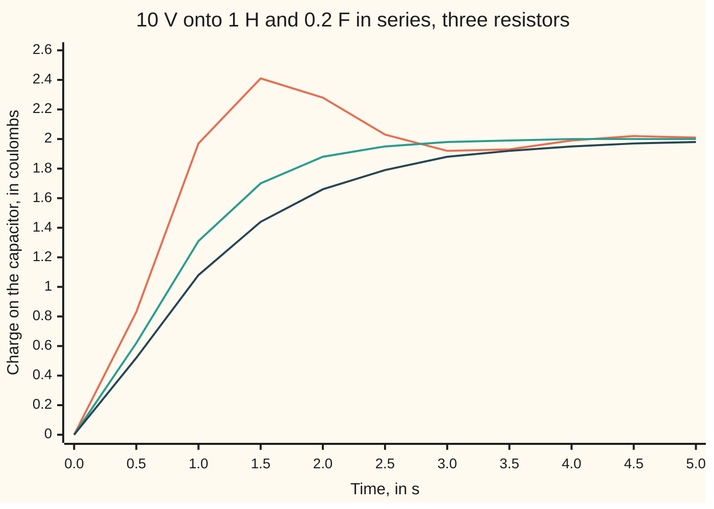

# The RLC circuit: the same equation as a spring, with charge in the place of position

[Syllabus](../../../SYLLABUS.md) → [Differential equations and dynamics](../README.md) → [Oscillators - Second-Order Linear Equations](../README.md#s03) → The RLC circuit

---

## General Overview

A 10-volt battery sits behind an open switch. In one loop with it are a coil of wire (an inductor) of 1 henry, a resistor of 2 ohms, and a capacitor (two plates that store charge) of 0.2 farad. The capacitor starts empty. At t = 0 the switch closes.

Charge flows onto the capacitor, measured in coulombs (on the printouts, a C after a number). Its final load is capacitance times voltage, 2 coulombs. It does not arrive and stop: it overshoots to 2.42 coulombs at 1.57 s, then rings down, briefly holding more voltage than the battery.

The circuit obeys a damped spring's law, with the coil as mass, the resistor as damper and the capacitor as spring: the shelf's shock absorber y'' + 2y' + 5y = 0, pushed by a steady force.

**Kirchhoff's loop rule turns a series coil, resistor and capacitor into L q'' + R q' + q/C = V(t): charge plays position, inductance plays mass, resistance plays damping, and one over capacitance plays stiffness.**

**What kind of fact this is:** a model, built from three part laws and Kirchhoff's loop rule; its solution is derived in Why it works.

### The picture: the capacitor's charge after switch-on



Orange: 2 ohms, overshooting. Teal: 4.47 ohms, critical, the fastest approach with no overshoot. Dark: 6 ohms, creeping up.

---

## The formula

Reminder: q' is the rate of q, and q'' the rate of that rate. Here q' is the current, charge passing per second, in amperes (amps).

$$L\,q'' + R\,q' + \frac{q}{C} = V(t)$$

**Read it aloud:** the coil's voltage plus the resistor's voltage plus the capacitor's voltage equals the battery's voltage, at every instant.

A damped spring pushed by a force obeys m x'' + c x' + k x = F(t). Term by term:

| Circuit | Unit | Spring | Unit | Job in the law |
| --- | --- | --- | --- | --- |
| charge q | coulomb | position x | metre | what moves |
| current i = q' | ampere | velocity x' | metre per s | its rate |
| inductance L | henry | mass m | kg | resists a change of rate |
| resistance R | ohm | damping c | newton-second per metre | turns motion into heat |
| 1/C | volt per coulomb | stiffness k | newton per metre | pulls back toward zero |
| battery V | volt | force F | newton | the push |

Divided by L:

$$q'' + \frac{R}{L}\,q' + \frac{1}{LC}\,q = \frac{V}{L},\qquad \omega_0 = \frac{1}{\sqrt{LC}},\qquad \zeta = \frac{R}{2}\sqrt{\frac{C}{L}}$$

**Read it aloud:** damping R over L, stiffness one over L C; the natural rate is one over root L C, and the damping ratio is R over 2 times root C over L.

For the example, 1/(LC) = 5 and R/L = 2: the law is q'' + 2q' + 5q = 10.

| Symbol | Plain meaning | In our example | Push it up and the answer… |
| --- | --- | --- | --- |
| $q$, $i$, $t$ | charge, coulombs; current, amps; time, s | q(0) = 0, i(0) = 0 | — |
| $L$ | inductance, henries: volts per amp-per-second of change | 1 H | slower ringing |
| $R$ | resistance, ohms | 2 ohms | less overshoot; none from 4.47 ohms |
| $C$ | capacitance: coulombs held per volt, farads | 0.2 F | more final charge, a softer spring |
| $V$ | battery voltage, from t = 0 | 10 V | charges scale with it |
| $m$, $c$, $k$, $F$ | the spring's mass, damping, stiffness, push | 1 kg, 2 N·s/m, 5 N/m, 10 N | — |
| $\omega_0$, $\zeta$ | natural rate, rad/s; damping ratio, 1 at critical | 2.2361, 0.4472 | ζ at 1 or more: no overshoot |
| $r$, $a$, $b$, $A$, $B$ | characteristic roots r = a ± ib; constants fitted to the start | −1 ± 2i; −2, −1 | — |

### When it holds

- **Parts that stay linear.** A heating resistor changes its R; an iron-cored coil loses inductance at large currents. Then no single pair of roots describes the ringing.
- **A small, slow circuit.** The law assumes one current all round the loop at each instant; at radio frequencies a long wire breaks that.
- **Ideal parts.** A battery's internal resistance adds to R; a leaky capacitor drains q.
- **Ringing needs R below 2√(L/C).** The cos-and-sin solution below needs R < 4.47 ohms here; at or above it the roots are real and the charge creeps up. With R = 0 nothing becomes heat and the ringing never dies.

---

## Why it works

### Step 0: voltages round a loop add to zero

Voltage is energy per coulomb. A coulomb carried once round a closed loop returns with the energy it started with, so the battery's rise equals the sum of the drops across the parts. That is Kirchhoff's loop rule.

### Step 1: each part has its own voltage law

- **Resistor.** Ohm's law: the drop is R i. Twice the current, twice the drop.
- **Capacitor.** The drop is q/C: at 0.2 coulombs per volt, 2 coulombs means 10 volts.
- **Inductor.** A coil's magnetic field resists change of current. The drop is L i', set by how fast the current changes.

The current is the rate charge arrives, so i = q' and i' = q''.

### Step 2: add the drops

Kirchhoff's rule gives L i' + R i + q/C = V. Replace i by q' and i' by q'':

L q'' + R q' + q/C = V.

This is m x'' + c x' + k x = F, letter for letter, so the solutions are shared: a 1 kg mass on a 5 newton-per-metre spring with damping 2, pushed by 10 newtons from rest, swings to 2.42 metres and settles at 2.

### Step 3: the unforced part rings like the shock absorber

With L = 1, R = 2, C = 0.2 the law is q'' + 2q' + 5q = 10. The characteristic equation r^2 + 2r + 5 = 0 has roots −1 ± 2i, where i is the square root of −1, not the current ([Complex roots](03-complex-roots-and-damped-oscillation.md)). The unforced solutions are e^(−t)(A cos 2t + B sin 2t).

### Step 4: the battery adds a constant, and the start fixes the rest

A constant push takes a constant trial, q = K ([Undetermined coefficients](05-undetermined-coefficients.md)): 5K = 10, so K = 2 = CV, and

q(t) = 2 + e^(−t)(A cos 2t + B sin 2t).

The capacitor starts empty: q(0) = 0 gives A = −2. The inductor forbids a jump in current, so i(0) = 0: differentiating, −A + 2B = 0 gives B = −1. The charge is

q(t) = 2 − e^(−t)(2 cos 2t + sin 2t) coulombs.

The charge still to arrive, u = 2 − q, obeys u'' + 2u' + 5u = 0 with u(0) = 2, u'(0) = 0: twice the shelf's shock absorber released from 1 at rest. So q = 2(1 − y), with y = e^(−t)(cos 2t + 0.5 sin 2t) the absorber's height.

### Step 5: the overshoot and its size

Differentiating q gives the current, i = 5e^(−t) sin 2t amps. It first returns to zero when 2t = π, at t = 1.5708 s. There the charge stops rising:

q(π/2) = 2 + 2e^(−π/2) = 2.4158 coulombs, and q/C = 12.0788 volts.

The overshoot is the fraction e^(−π/2) = 0.2079 of the final charge; in general e^(πa/b). The current peaks where tan 2t = 2, at 0.5536 s: 2.5710 amps.

At the critical resistance R = 2√(L/C) = 4.4721 ohms the roots meet, ζ = 1, and the ringing stops.

<details>
<summary>Detailed proof: the current formula, and why half the energy is heat</summary>

From rest with a constant battery, q = CV[1 − e^(at)(cos bt − (a/b) sin bt)], with a = −R/(2L) and b^2 = 1/(LC) − a^2. Differentiating, the cosines cancel: i = CV (a^2 + b^2)/b · e^(at) sin bt, here 5e^(−t) sin 2t. It is first zero at t = π/b, where cos bt = −1, so the peak is CV(1 + e^(aπ/b)).

Multiply the loop law by i. Since L i i' is the rate of L i^2/2, and (q/C) q' is the rate of q^2/(2C):

V i = (L i^2/2 + q^2/(2C))' + R i^2.

Integrate until the ringing dies. The battery's work is V · CV = 20 joules; the coil's energy starts and ends at 0; the capacitor keeps (CV)^2/(2C) = 10 joules. So the heat is 10 joules, and R has cancelled.

</details>

The Laplace transform solves it in one pass ([The round trip](../08-Laplace%20Transforms%20for%20Initial-Value%20Problems/04-solving-an-initial-value-problem-by-transform.md)). As two first-order laws, q' = i and L i' = V − R i − q/C, it is a system ([From one equation to a system](../04-Systems%20and%20the%20Matrix%20Exponential/01-from-one-equation-to-a-system.md)), the form the code steps.

---

## Worked numbers, by hand

| Step | Arithmetic | Value |
| --- | --- | --- |
| divide by L | R/L = 2, 1/(LC) = 1/0.2 | q'' + 2q' + 5q = 10 |
| roots | r^2 + 2r + 5 = 0 | −1 ± 2i |
| final charge | 5K = 10, or C × V | **2 coulombs** |
| fit the start | q(0) = 0: A = −2; i(0) = 0: −A + 2B = 0 | A = −2, B = −1 |
| peak time | current zero at 2t = π | 1.5708 s |
| peak charge | 2 + 2e^(−π/2) = 2 + 2 × 0.2079 | **2.4158 coulombs** |
| energy | battery 10 × 2; capacitor 2^2/0.4 | 20 J in, 10 J stored, **10 J heat** |

The capacitor reaches 12.0788 volts before settling at 10: a part rated for exactly 10 volts is overstressed on the first swing.

### What breaks if you drop a piece

| Mistake | Comes out at | What went wrong |
| --- | --- | --- |
| q times C for q/C | 50.00 coulombs, not 2.00 | The stiffness is 1/C |
| Inductor left out | 1.96 coulombs at 1.57 s, never above 2.00 | A first-order law cannot overshoot |
| All energy counted as stored | 20.00 J claimed, 10.00 J stored | Half is heat, whatever R is |

The code prints all three.

---

## Code, from first principles, and it actually runs

Three roads. One: the closed form, checked against the shock absorber scaled by CV. Two: Euler's rule, new value = old value + step × rate ([Euler's method](../05-Numerical%20Evolution/01-eulers-method.md)), on Kirchhoff's two first-order laws; its error halves with the step. Three: the heat R i^2 summed step by step, against the energy count.

### Python

```python
# The RLC circuit and the spring -- the check behind the card.  Standard library
# only.  A 10 V battery is switched onto L = 1 H, R = 2 ohm, C = 0.2 F in series,
# capacitor empty, no current.  Road one: the closed form from the roots of
# L r^2 + R r + 1/C = 0.  Road two: Euler steps on Kirchhoff's loop rule itself,
# q' = i and L i' = V - R i - q/C, which never solves anything.  Road three: the
# heat R i^2 summed step by step, against the energy the battery leaves unstored.
import math

L, R, C, V = 1.0, 2.0, 0.2, 10.0
a, b = -R / (2 * L), math.sqrt(1 / (L * C) - (R / (2 * L)) ** 2)   # roots a +/- bi
A, B = -C * V, -C * V * (-a) / b          # q(0) = 0 and i(0) = 0 fix the constants
def q(t): return C * V + math.exp(a * t) * (A * math.cos(b * t) + B * math.sin(b * t))
def house(t): return math.exp(-t) * (math.cos(2 * t) + 0.5 * math.sin(2 * t))

def euler(res, h, T, qq=0.0, i=0.0):       # plain small steps along the slope
    top, t_top, imax, t_imax, heat, marks = -1.0, 0.0, -1.0, 0.0, 0.0, []
    for n in range(round(T / h) + 1):
        t = n * h
        if n % round(0.5 / h) == 0: marks.append(qq)
        if qq > top: top, t_top = qq, t
        if i > imax: imax, t_imax = i, t
        heat += res * i * i * h
        qq, i = qq + h * i, i + h * (V - res * i - qq / C) / L
    return qq, top, t_top, imax, t_imax, heat, marks

rc = 2 * math.sqrt(L / C)                  # critical resistance
errs = [abs(euler(R, h, 5)[0] - q(5)) for h in (0.001, 0.0005, 0.00025)]
_, top, t_top, imax, t_imax, heat, marks = euler(R, 1e-4, 20)
crit, over = euler(rc, 1e-4, 20), euler(6.0, 1e-4, 20)
tp, ti = math.pi / b, math.atan2(b, -a) / b          # where i = 0, where i' = 0
i_at = lambda t: (a * a + b * b) * C * V / b * math.exp(a * t) * math.sin(b * t)
gap = max(abs(q(t / 10) - C * V * (1 - house(t / 10))) for t in range(51))
row = lambda xs: ", ".join(f"{x:.2f}" for x in xs[:11])
print(f"roots: {a:.4f} +/- {b:.4f}i; natural rate 1/sqrt(LC) = {1 / math.sqrt(L * C):.4f} rad/s; damping ratio {R / 2 * math.sqrt(C / L):.4f}")
print(f"constants from q(0) = 0, i(0) = 0: A = {A:.4f}, B = {B:.4f}; final charge CV = {C * V:.4f} C")
print("t (s)          " + ", ".join(f"{t / 2:.1f}" for t in range(11)))
print("R = 2 ohm      " + row([q(t / 2) for t in range(11)]))
print(f"R = {rc:.2f} ohm   " + row(crit[6]))
print("R = 6 ohm      " + row(over[6]))
print(f"closed form equals CV(1 - house y) every 0.1 s to 5 s, within 1e-12: {'yes' if gap < 1e-12 else 'no'}")
print(f"peak, closed form: {q(tp):.4f} C at {tp:.4f} s; capacitor voltage {q(tp) / C:.4f} V")
print(f"peak, Euler h = 0.0001: {top:.4f} C at {t_top:.4f} s")
print(f"largest current: closed {i_at(ti):.4f} A at {ti:.4f} s; Euler {imax:.4f} A at {t_imax:.4f} s")
print("Euler error in q at t = 5, h = 0.001, 0.0005, 0.00025: " + " ".join(f"{e:.6f}" for e in errs))
print(f"error ratios on halving h: {errs[0] / errs[1]:.3f} {errs[1] / errs[2]:.3f}")
print(f"energy: battery V CV = {V * C * V:.4f} J; stored (CV)^2/2C = {(C * V) ** 2 / (2 * C):.4f} J; heat summed by Euler {heat:.4f} J")
print(f"overshoot fraction e^(pi a/b) = {math.exp(math.pi * a / b):.4f}; critical R = 2 sqrt(L/C) = {rc:.4f} ohm")
print(f"highest charge at R = {rc:.4f} and 6 ohm: {crit[1]:.4f}, {over[1]:.4f} C")
print(f"mistake, q times C for q/C: steady charge V/C = {V / C:.2f} C, not {C * V:.2f}")
print(f"mistake, inductor dropped: q = CV(1 - e^(-t/RC)) at {tp:.2f} s is {C * V * (1 - math.exp(-tp / (R * C))):.2f} C, never above {C * V:.2f}")
print(f"mistake, all battery energy stored: {V * C * V:.2f} J claimed, {(C * V) ** 2 / (2 * C):.2f} J in the capacitor")
assert 1.9 < errs[0] / errs[1] < 2.1 and 1.9 < errs[1] / errs[2] < 2.1 and errs[2] < 0.01   # Euler meets the closed form
assert abs(top - q(tp)) < 1e-3 and abs(t_top - tp) < 1e-3 and abs(imax - i_at(ti)) < 1e-3 # peaks agree
assert gap < 1e-12                                          # the circuit is the shock absorber, scaled
assert abs(heat / (V * C * V - (C * V) ** 2 / (2 * C)) - 1) < 1e-3 and crit[1] < C * V + 1e-9
print("ALL CHECKS PASS")
```

**Ran 2026-09-28 on macOS, Python 3.14.6, standard library only. All checks passed. Output, pasted from the run:**

```
roots: -1.0000 +/- 2.0000i; natural rate 1/sqrt(LC) = 2.2361 rad/s; damping ratio 0.4472
constants from q(0) = 0, i(0) = 0: A = -2.0000, B = -1.0000; final charge CV = 2.0000 C
t (s)          0.0, 0.5, 1.0, 1.5, 2.0, 2.5, 3.0, 3.5, 4.0, 4.5, 5.0
R = 2 ohm      0.00, 0.83, 1.97, 2.41, 2.28, 2.03, 1.92, 1.93, 1.99, 2.02, 2.01
R = 4.47 ohm   0.00, 0.62, 1.31, 1.70, 1.88, 1.95, 1.98, 1.99, 2.00, 2.00, 2.00
R = 6 ohm      0.00, 0.52, 1.08, 1.44, 1.66, 1.79, 1.88, 1.92, 1.95, 1.97, 1.98
closed form equals CV(1 - house y) every 0.1 s to 5 s, within 1e-12: yes
peak, closed form: 2.4158 C at 1.5708 s; capacitor voltage 12.0788 V
peak, Euler h = 0.0001: 2.4159 C at 1.5707 s
largest current: closed 2.5710 A at 0.5536 s; Euler 2.5713 A at 0.5536 s
Euler error in q at t = 5, h = 0.001, 0.0005, 0.00025: 0.000077 0.000038 0.000019
error ratios on halving h: 1.992 1.996
energy: battery V CV = 20.0000 J; stored (CV)^2/2C = 10.0000 J; heat summed by Euler 10.0025 J
overshoot fraction e^(pi a/b) = 0.2079; critical R = 2 sqrt(L/C) = 4.4721 ohm
highest charge at R = 4.4721 and 6 ohm: 2.0000, 2.0000 C
mistake, q times C for q/C: steady charge V/C = 50.00 C, not 2.00
mistake, inductor dropped: q = CV(1 - e^(-t/RC)) at 1.57 s is 1.96 C, never above 2.00
mistake, all battery energy stored: 20.00 J claimed, 10.00 J in the capacitor
ALL CHECKS PASS
```

### Rust

Same numbers, same labels, built with `rustc --edition 2021 -O`.

```rust
// The RLC circuit and the spring -- the same check as the Python, in Rust.  No
// crates.  A 10 V battery is switched onto L = 1 H, R = 2 ohm, C = 0.2 F in series,
// capacitor empty, no current.  Road one: the closed form from the roots of
// L r^2 + R r + 1/C = 0.  Road two: Euler steps on Kirchhoff's loop rule itself,
// q' = i and L i' = V - R i - q/C, which never solves anything.  Road three: the
// heat R i^2 summed step by step, against the energy the battery leaves unstored.
use std::f64::consts::PI;
const L: f64 = 1.0; // inductance, H
const R: f64 = 2.0; // resistance, ohm
const C: f64 = 0.2; // capacitance, F
const V: f64 = 10.0; // battery, volts

struct Run { q: f64, top: f64, t_top: f64, imax: f64, t_imax: f64, heat: f64, marks: Vec<f64> }

fn euler(res: f64, h: f64, t_end: f64) -> Run { // plain small steps along the slope
    let (mut q, mut i) = (0.0, 0.0);
    let (mut top, mut t_top, mut imax, mut t_imax, mut heat) = (-1.0, 0.0, -1.0, 0.0, 0.0);
    let mut marks = Vec::new();
    let every = (0.5 / h).round() as usize;
    for n in 0..=((t_end / h).round() as usize) {
        let t = n as f64 * h;
        if n % every == 0 { marks.push(q) }
        if q > top { top = q; t_top = t }
        if i > imax { imax = i; t_imax = t }
        heat += res * i * i * h;
        let (q2, i2) = (q + h * i, i + h * (V - res * i - q / C) / L);
        q = q2; i = i2;
    }
    Run { q, top, t_top, imax, t_imax, heat, marks }
}

fn main() {
    let a = -R / (2.0 * L);
    let b = (1.0 / (L * C) - (R / (2.0 * L)).powi(2)).sqrt(); // roots a +/- bi
    let (ca, cb) = (-C * V, -C * V * (-a) / b); // q(0) = 0 and i(0) = 0 fix the constants
    let q = |t: f64| C * V + (a * t).exp() * (ca * (b * t).cos() + cb * (b * t).sin());
    let house = |t: f64| (-t).exp() * ((2.0 * t).cos() + 0.5 * (2.0 * t).sin());
    let rc = 2.0 * (L / C).sqrt(); // critical resistance
    let errs: Vec<f64> = [0.001, 0.0005, 0.00025].iter().map(|&h| (euler(R, h, 5.0).q - q(5.0)).abs()).collect();
    let main_run = euler(R, 1e-4, 20.0);
    let (crit, over) = (euler(rc, 1e-4, 20.0), euler(6.0, 1e-4, 20.0));
    let (tp, ti) = (PI / b, b.atan2(-a) / b); // where i = 0, where i' = 0
    let i_at = |t: f64| (a * a + b * b) * C * V / b * (a * t).exp() * (b * t).sin();
    let gap = (0..51).map(|t| (q(t as f64 / 10.0) - C * V * (1.0 - house(t as f64 / 10.0))).abs()).fold(0.0, f64::max);
    let row = |xs: &[f64]| xs[..11].iter().map(|x| format!("{:.2}", x)).collect::<Vec<_>>().join(", ");
    let qs: Vec<f64> = (0..11).map(|t| q(t as f64 / 2.0)).collect();
    let (stored, battery) = ((C * V).powi(2) / (2.0 * C), V * C * V);
    println!("roots: {:.4} +/- {:.4}i; natural rate 1/sqrt(LC) = {:.4} rad/s; damping ratio {:.4}", a, b, 1.0 / (L * C).sqrt(), R / 2.0 * (C / L).sqrt());
    println!("constants from q(0) = 0, i(0) = 0: A = {:.4}, B = {:.4}; final charge CV = {:.4} C", ca, cb, C * V);
    println!("t (s)          {}", (0..11).map(|t| format!("{:.1}", t as f64 / 2.0)).collect::<Vec<_>>().join(", "));
    println!("R = 2 ohm      {}", row(&qs));
    println!("R = {:.2} ohm   {}", rc, row(&crit.marks));
    println!("R = 6 ohm      {}", row(&over.marks));
    println!("closed form equals CV(1 - house y) every 0.1 s to 5 s, within 1e-12: {}", if gap < 1e-12 { "yes" } else { "no" });
    println!("peak, closed form: {:.4} C at {:.4} s; capacitor voltage {:.4} V", q(tp), tp, q(tp) / C);
    println!("peak, Euler h = 0.0001: {:.4} C at {:.4} s", main_run.top, main_run.t_top);
    println!("largest current: closed {:.4} A at {:.4} s; Euler {:.4} A at {:.4} s", i_at(ti), ti, main_run.imax, main_run.t_imax);
    println!("Euler error in q at t = 5, h = 0.001, 0.0005, 0.00025: {}", errs.iter().map(|e| format!("{:.6}", e)).collect::<Vec<_>>().join(" "));
    println!("error ratios on halving h: {:.3} {:.3}", errs[0] / errs[1], errs[1] / errs[2]);
    println!("energy: battery V CV = {:.4} J; stored (CV)^2/2C = {:.4} J; heat summed by Euler {:.4} J", battery, stored, main_run.heat);
    println!("overshoot fraction e^(pi a/b) = {:.4}; critical R = 2 sqrt(L/C) = {:.4} ohm", (PI * a / b).exp(), rc);
    println!("highest charge at R = {:.4} and 6 ohm: {:.4}, {:.4} C", rc, crit.top, over.top);
    println!("mistake, q times C for q/C: steady charge V/C = {:.2} C, not {:.2}", V / C, C * V);
    println!("mistake, inductor dropped: q = CV(1 - e^(-t/RC)) at {:.2} s is {:.2} C, never above {:.2}", tp, C * V * (1.0 - (-tp / (R * C)).exp()), C * V);
    println!("mistake, all battery energy stored: {:.2} J claimed, {:.2} J in the capacitor", battery, stored);
    assert!(errs[0] / errs[1] > 1.9 && errs[0] / errs[1] < 2.1 && errs[1] / errs[2] > 1.9 && errs[1] / errs[2] < 2.1 && errs[2] < 0.01);
    assert!((main_run.top - q(tp)).abs() < 1e-3 && (main_run.t_top - tp).abs() < 1e-3 && (main_run.imax - i_at(ti)).abs() < 1e-3);
    assert!(gap < 1e-12); // the circuit is the shock absorber, scaled
    assert!((main_run.heat / (battery - stored) - 1.0).abs() < 1e-3 && crit.top < C * V + 1e-9);
    println!("ALL CHECKS PASS");
}
```

**Ran 2026-09-28 on macOS, rustc 1.98.1, no crates. All checks passed. Output, pasted from the run:**

```
roots: -1.0000 +/- 2.0000i; natural rate 1/sqrt(LC) = 2.2361 rad/s; damping ratio 0.4472
constants from q(0) = 0, i(0) = 0: A = -2.0000, B = -1.0000; final charge CV = 2.0000 C
t (s)          0.0, 0.5, 1.0, 1.5, 2.0, 2.5, 3.0, 3.5, 4.0, 4.5, 5.0
R = 2 ohm      0.00, 0.83, 1.97, 2.41, 2.28, 2.03, 1.92, 1.93, 1.99, 2.02, 2.01
R = 4.47 ohm   0.00, 0.62, 1.31, 1.70, 1.88, 1.95, 1.98, 1.99, 2.00, 2.00, 2.00
R = 6 ohm      0.00, 0.52, 1.08, 1.44, 1.66, 1.79, 1.88, 1.92, 1.95, 1.97, 1.98
closed form equals CV(1 - house y) every 0.1 s to 5 s, within 1e-12: yes
peak, closed form: 2.4158 C at 1.5708 s; capacitor voltage 12.0788 V
peak, Euler h = 0.0001: 2.4159 C at 1.5707 s
largest current: closed 2.5710 A at 0.5536 s; Euler 2.5713 A at 0.5536 s
Euler error in q at t = 5, h = 0.001, 0.0005, 0.00025: 0.000077 0.000038 0.000019
error ratios on halving h: 1.992 1.996
energy: battery V CV = 20.0000 J; stored (CV)^2/2C = 10.0000 J; heat summed by Euler 10.0025 J
overshoot fraction e^(pi a/b) = 0.2079; critical R = 2 sqrt(L/C) = 4.4721 ohm
highest charge at R = 4.4721 and 6 ohm: 2.0000, 2.0000 C
mistake, q times C for q/C: steady charge V/C = 50.00 C, not 2.00
mistake, inductor dropped: q = CV(1 - e^(-t/RC)) at 1.57 s is 1.96 C, never above 2.00
mistake, all battery energy stored: 20.00 J claimed, 10.00 J in the capacitor
ALL CHECKS PASS
```

The two outputs match line for line.

> [!TIP]
> **Try changing**
> Guess first, then run it.
> - **A 20-volt battery.** Set `V` to `20.0`. Charges double: peak 4.8315 coulombs; heat 40.0100 J. All checks pass.
> - **Half the resistance.** Set `R` to `1.0`. Peak 2.9728 coulombs at 1.4415 s, heat still 10.0050 J. The third assert stops it: the shock absorber has damping 2.
> - **A smaller capacitor.** Set `C` to `0.05`. Peak 0.7432 coulombs at 0.7207 s; critical resistance 8.9443 ohms, so the 6-ohm run overshoots to 0.5292. The third assert stops it.

---

## The usual mistake

> [!warning]
> **Matching capacitance to stiffness.** A stiffer spring pulls back harder; a bigger capacitor pulls back less, since it holds more charge per volt. The stiffness is 1/C. Writing q·C gives a final charge of 50.00 coulombs, not 2.00.
>
> - **Leaving out the coil.** The overshoot needs the inductor's inertia; without it the charge reaches only 1.96 at 1.57 s.
> - **Letting the current jump at switch-on.** The inductor forbids it: i(0) = 0 fixes B = −1.

---

## Where you meet it in real life

- **Switching on a power supply.** A filter capacitor behind a coil rings this way; at ζ = 0.4472 it swings 0.2079 of its final charge beyond it, so designers rate parts above the supply and add damping.
- **Radio tuning.** A coil and capacitor ring near 1/√(LC); a tuner varies C to pick one station (RLC resonance).
- **Analogue computers.** Engineers once read a suspension's motion off a circuit with matched L, R and C.

> **Say it back**
> Kirchhoff's loop rule sets the drops L q'', R q' and q/C equal to the battery. That is a mass, damper and spring, with charge as position and 1/C as stiffness. With 1 henry, 2 ohms and 0.2 farad the charge overshoots to 2.4158 coulombs and rings down to 2. From 4.4721 ohms up it does not overshoot. Half the battery's energy ends as heat.

---

## What this builds on

- [Complex roots](03-complex-roots-and-damped-oscillation.md): the roots −1 ± 2i and the ringing solution e^(−t)(A cos 2t + B sin 2t).
- [Undetermined coefficients](05-undetermined-coefficients.md): the constant trial that gives the final charge CV.

## Where this goes next

- [Damping ratio and natural frequency](../../13-Engineering%20mathematics/02-Linear%20Systems%20and%20Transforms/06-second-order-systems-damping-and-natural-frequency.md): ω0 and ζ as the two numbers that describe any such system, circuit or spring.
- RLC resonance: the same circuit driven by an alternating voltage.

---

## Sources

Verified 2026-09-28: every link below resolves to the publisher's page.

- Lebl, Jiří. *Notes on Diffy Qs*, "Mechanical vibrations". [Free text](https://www.jirka.org/diffyqs/html/sec_mv.html). The spring law and the RLC circuit as its twin.
- Lebl, Jiří. *Notes on Diffy Qs*, "Forced oscillations and resonance". [Free text](https://www.jirka.org/diffyqs/html/forcedo_section.html). The forced response the battery term produces.
- Boyce, William E., Richard C. DiPrima and Douglas B. Meade. *Elementary Differential Equations*, 12th ed. Wiley, 2021. [Publisher page](https://www.wiley.com/en-us/Elementary+Differential+Equations%2C+12th+Edition-p-9781119777755). Mechanical and electrical vibrations, side by side.
