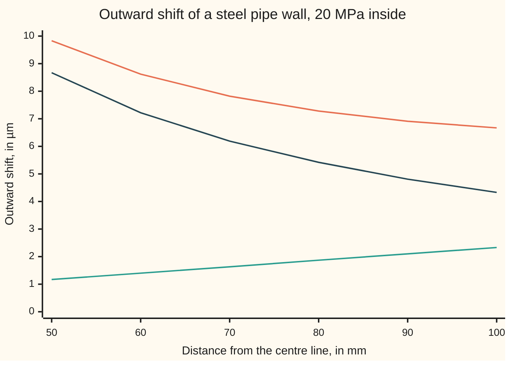

# The Cauchy-Euler equation: coefficients that scale with x are solved by powers of x

Differential equations and dynamics → Oscillators - Second-Order Linear Equations → Equations that ignore scale → The Cauchy-Euler equation

---

## General Overview

A steel hydraulic pipe has a bore of 50 mm radius and an outside of 100 mm radius. Oil at 20 MPa (megapascals, newtons per square millimetre) pushes on the bore, and the steel moves outward a few micrometres (µm, thousandths of a millimetre), by an amount that depends on the distance from the centre line.

Balancing forces on a thin ring of steel gives a law for that shift whose coefficients grow with the distance, so the exponential that solves a car's shock absorber fails. Guessing a power of the distance works: the shift mixes the distance and one over the distance. Fitted to the two pressures, the bore moves out 9.83 µm, the outside 6.67 µm, and the bore's steel carries 33.33 MPa around the circle.

The reason is scale: the law is unchanged when lengths are measured in centimetres, and a power survives that change.

**When each derivative is multiplied by x raised to that derivative's order, the trial y = x^r turns it into a quadratic for r; two roots give two powers to mix, a repeated root r gives x^r and x^r ln x.**

**What kind of fact this is:** a method; the claim that it finds every solution for x > 0 is a theorem, proved on this card in Why it works.

### The picture: how far the pipe wall moves



Orange: the total shift, A x + B/x. Teal: its A x part, growing outward. Dark blue: its B/x part, dying away from the bore.

---

## The formula

Reminder: a differential equation links a function to its own rates ([what-a-differential-equation-says](../01-Rate%20Equations/01-what-a-differential-equation-says.md)). Here the rates run along the distance x: y' is the shift's change per millimetre outward, y'' the change of that.

$$x^2\,y'' + a\,x\,y' + b\,y = 0 \qquad\xrightarrow{\;y\,=\,x^r\;}\qquad p(r) = r(r-1) + a\,r + b = 0$$

**Read it aloud:** replace the second rate by r(r − 1), the first by r, and y by 1; the roots are the powers of x that solve the equation.

The quadratic p(r) is the **indicial equation**, named for its roots, which are indices, that is, powers:

$$r_1 \ne r_2 \text{ real}:\quad y = A\,x^{r_1} + B\,x^{r_2} \qquad\qquad r_1 = r_2 = r:\quad y = (A + B\ln x)\,x^{r}$$

**Read it aloud:** two powers are mixed in amounts fixed by two conditions; a repeated power is multiplied by a straight line in ln x.

For the pipe, a = 1 and b = −1, so p(r) = r^2 − 1 and the powers are 1 and −1: y = A x + B/x.

| Symbol | Plain meaning | In our example | Push it up and the answer… |
| --- | --- | --- | --- |
| $x$ | distance from the centre line, in mm | 50 (bore) to 100 (outside) | the B/x part fades |
| $y$, $y'$, $y''$ | outward shift, in µm; its rate per mm; that rate's rate | 9.83 µm at the bore | — |
| $a$, $b$, $p(r)$ | the equation's constants; the indicial polynomial | a = 1, b = −1; r^2 − 1 | b up: roots merge, then turn complex |
| $r$, $r_1$, $r_2$ | the trial power; the roots of p(r) | 1 and −1 | — |
| $A$, $B$ | amounts of each power | 0.02333 µm per mm; 433.33 µm·mm | — |
| $t$ | ln x, the logarithm of the distance | used in Step 3 | — |
| $\sigma_r$, $\sigma_\theta$ | radial stress (across the wall), hoop stress (around it), in MPa | −20.00 and 33.33 at the bore | — |
| $E$, $\nu$, $P$ | steel's stiffness; Poisson ratio, sideways shrink per unit stretch; oil pressure | 200000 MPa; 0.3; 20 MPa | P up: all up in proportion |

### When it holds

- **Matching powers:** x^2 with y'', x with y', a constant with y. In x^2 y'' + x y' + (x^2 − 1) y = 0 one power leaves an x^2 term over; the answer needs a series ([frobenius-and-regular-singular-points](../07-Series%20Solutions%20and%20Boundary%20Problems/02-frobenius-and-regular-singular-points.md)).
- **One side of x = 0:** there 1/x blows up and ln x is undefined. For x < 0, replace x by −x.
- **Right side zero:** a load such as spin needs [variation-of-parameters](07-variation-of-parameters.md).
- **Real roots:** if (a − 1)^2 < 4b the roots are α ± iβ and the solutions are x^α cos(β ln x) and x^α sin(β ln x), as on [complex-roots-and-damped-oscillation](03-complex-roots-and-damped-oscillation.md).

---

## Why it works

### Step 0: a power keeps its shape under "x times the rate"

The rate of x^r is r x^(r−1); multiply by x and the power returns: x (x^r)' = r x^r. Likewise x^2 (x^r)'' = r(r − 1) x^r. The equation is built only from these, so a power goes in and the same power times a number comes out. In centimetres x shrinks tenfold while y' grows tenfold and y'' a hundredfold, so x y' and x^2 y'' do not change: that is the scale argument in algebra.

<details>
<summary>Where x^2 y'' + x y' − y = 0 comes from, for the pipe</summary>

A thin ring at distance x grows from circumference 2πx to 2π(x + y), so its stretch around (hoop strain) is y/x; its stretch across the wall (radial strain) is y'. Hooke's law (stress proportional to stretch), open-ended pipe: σ_r = K(y' + ν y/x) and σ_θ = K(y/x + ν y'), with K = E/(1 − ν^2) = 219780 MPa.

The ring's forces balance when (x σ_r)' = σ_θ. Substituting, K(x y'' + y' + ν y') = K(y/x + ν y'). The ν terms cancel: x y'' + y' − y/x = 0. Multiply by x.

</details>

### Step 1: the substitution leaves a quadratic

Put y = x^r in:

$$x^2 y'' + a\,x\,y' + b\,y = \bigl(r(r-1) + a\,r + b\bigr)\,x^r.$$

For x > 0, x^r is never zero, so this vanishes for every x exactly when p(r) = 0. For the pipe, r(r − 1) + r − 1 = r^2 − 1: roots 1 and −1, shifts x and 1/x.

### Step 2: two powers, fitted to two walls

The equation is linear, so any mix A x + B/x solves it ([superposition-and-the-shape-of-linear-solutions](01-superposition-and-the-shape-of-linear-solutions.md)). Two facts fix the amounts: σ_r = −20 MPa at the bore (negative means squeezed) and σ_r = 0 outside. With y = A x + B/x, σ_r = K((1 + ν)A − (1 − ν)B/x^2): two equations, two unknowns, solved in Worked numbers. The conditions sit at two places: a boundary-value problem.

### Step 3: logarithmic distance turns it into the car's equation

Set t = ln x ([logarithms](../../01-Foundations/03-Powers%2C%20Roots%20and%20Logarithms/05-logarithms.md)) and write the shift as Y, a function of t. The chain rule gives x y' = Y' and x^2 y'' = Y'' − Y', primes on Y being rates in t. The equation becomes

$$Y'' + (a - 1)\,Y' + b\,Y = 0,$$

a constant-coefficient equation whose characteristic equation, r^2 + (a − 1)r + b = 0, is p(r) again ([the-characteristic-equation](02-the-characteristic-equation.md)). There e^(rt) is x^r, and at a repeated root t e^(rt) is x^r ln x.

A repeated case: x^2 y'' − x y' + y = 0 has p(r) = (r − 1)^2, so r = 1 twice: solutions x and x ln x. From y(1) = 0 with rate 1 the answer is x ln x, 1.386294 at x = 2.

<details>
<summary>Detailed proof: the logarithm is forced, and nothing is missed</summary>

Put y = x^r ln x. Then y' = x^(r−1)(r ln x + 1) and y'' = x^(r−2)(r(r − 1) ln x + 2r − 1), so
x^2 y'' + a x y' + b y = x^r [p(r) ln x + (2r − 1 + a)] = x^r [p(r) ln x + p'(r)],
with p'(r) the slope of p. At a repeated root p(r) = p'(r) = 0, so x^r ln x solves the equation; at a simple root it does not.

Completeness. t = ln x matches solutions on x > 0 one to one with solutions in t, where [the-characteristic-equation](02-the-characteristic-equation.md) proves the exponential mixes are all of them. Translated back, every solution is A x^(r1) + B x^(r2), or (A + B ln x) x^r.

</details>

### Step 4: the point x = 0 is special, in a controlled way

Divide by x^2: y'' + (a/x) y' + (b/x^2) y = 0. The coefficients blow up at x = 0, but no faster than 1/x and 1/x^2: a **regular singular point**, of which this equation is the simplest case. A solid shaft's shift must stay finite at the centre, which forces B = 0 and leaves y = A x.

Reduction of order also finds x ln x, starting from x alone ([wronskian-and-reduction-of-order](04-wronskian-and-reduction-of-order.md)).

---

## Worked numbers, by hand

| Step | Arithmetic | Value |
| --- | --- | --- |
| indicial equation, a = 1, b = −1 | r(r − 1) + r − 1 | r^2 − 1 = 0, roots 1 and −1 |
| steel's constant K | 200,000 / (1 − 0.3^2) | 219780 MPa |
| bore minus outside condition | 0.7 B (1/2500 − 1/10000) = 20 / 219780, in mm | B = 433.33 µm·mm |
| outside condition | 1.3 A = 0.7 B / 100^2 | A = 0.02333 µm per mm |
| shift at the bore | 0.02333 × 50 + 433.33 / 50 | **9.83 µm** |
| shift at the outside | 0.02333 × 100 + 433.33 / 100 | **6.67 µm** |
| hoop stress at the bore | K (y/x + ν y'), with y' = A − B/2500 | **33.33 MPa** |
| Lamé's textbook formula, a second road | 20 × (100^2 + 50^2) / (100^2 − 50^2) | **33.33 MPa** |

The bore grows under a hundredth of a millimetre; its 33.33 MPa of hoop stress sets the wall thickness.

### What breaks if you drop a piece

| Mistake | Comes out at | What went wrong |
| --- | --- | --- |
| Indicial equation written r^2 + a r + b = 0 | r = 0.618; x^r leaves −0.618 x^r, not 0 | x^2 y'' gives r(r − 1) |
| Thin-wall rule, pressure × mean radius / thickness | 30.00 MPa, not 33.33 | thick wall: stress is uneven |
| Repeated root used once: C x only, with y(1) = 0 | C = 0, so y(2) = 0, not 1.386294 | x ln x missing |

The code prints all three.

---

## Code, from first principles, and it actually runs

Two roads to the bore's shift. Road one fits x and 1/x to the pressures. Road two uses no power: Euler's rule steps shift and rate outward, adding step length times rate ([eulers-method](../05-Numerical%20Evolution/01-eulers-method.md)). The bore's shift is unknown, so it shoots with guesses 0 and 10 µm and, the equation being linear, blends them to leave the outside stress-free. Its error halves with the step length h. Lamé's textbook formula checks the hoop stress; stepping to x ln x checks the repeated root; putting x^r into the equation by finite differences checks the indicial roots.

### Python

```python
# The Cauchy-Euler equation -- the check behind the card.  Standard library
# only.  A thick steel pipe: bore 50 mm, outside 100 mm, oil at 20 MPa inside.
# The wall's outward shift y (um) at distance x (mm) from the axis obeys
# x^2 y'' + x y' - y = 0.  Road one: the powers x and 1/x, fitted to the two
# pressures.  Road two: Euler's small steps shot across the wall, no powers.
import math
E, NU, P, XI, XO = 200000.0, 0.3, 20.0, 50.0, 100.0   # MPa, ratio, MPa, mm, mm
K = E / (1 - NU * NU) / 1000                           # MPa per um/mm of rate

def roots(a, b):                         # roots of r(r - 1) + a r + b = 0
    d = math.sqrt((a - 1) ** 2 - 4 * b)
    return (1 - a + d) / 2, (1 - a - d) / 2
def radial(y, v, x): return K * (v + NU * y / x)      # stress across the wall
def hoop(y, v, x): return K * (y / x + NU * v)        # stress around the wall
def resid(a, b, r, x=2.0, h=1e-3):       # x^r put into the equation, rates by differences, over x^r
    return (x * x * ((x + h) ** r - 2 * x ** r + (x - h) ** r) / h ** 2 + a * x * ((x + h) ** r - (x - h) ** r) / (2 * h) + b * x ** r) / x ** r

def euler(a, b, x, y, v, x1, n):         # step x^2 y'' + a x y' + b y = 0 to x1
    h = (x1 - x) / n
    for _ in range(n):
        y, v, x = y + h * v, v - h * (a * x * v + b * y) / (x * x), x + h
    return y, v

# road one: y = A x + B / x, radial stress -P at the bore and 0 outside
m = [[K * (1 + NU), -K * (1 - NU) / XI ** 2], [K * (1 + NU), -K * (1 - NU) / XO ** 2]]
det = m[0][0] * m[1][1] - m[0][1] * m[1][0]
A, B = -P * m[1][1] / det, P * m[1][0] / det
y = lambda x: A * x + B / x
dy = lambda x: A - B / x ** 2
print("indicial roots, a = 1, b = -1: %.0f and %.0f" % roots(1, -1))
print(f"steel K = {K * 1000:.0f} MPa; fitted amounts: A = {A:.5f} um per mm, B = {B:.2f} um mm")
print(f"shift, powers: bore {y(XI):.4f} um, outside {y(XO):.4f} um")
errs = []
for n in (100, 200, 400):                # road two: shoot from the bore
    f = lambda s: radial(*euler(1, -1, XI, s, -P / K - NU * s / XI, XO, n), XO)
    s = -f(0) * 10 / (f(10) - f(0))
    errs.append(s - y(XI))
    print(f"shift at bore, Euler shot, h = {(XO - XI) / n:.3f} mm: {s:.4f} um; error {errs[-1]:+.4f}")
print(f"error ratio when h halves: {errs[0] / errs[1]:.2f}, {errs[1] / errs[2]:.2f}")
lame = P * (XO ** 2 + XI ** 2) / (XO ** 2 - XI ** 2)
print(f"hoop stress at bore: from the shift {hoop(y(XI), dy(XI), XI):.2f} MPa; Lame's formula {lame:.2f} MPa")
print(f"radial stress: bore {radial(y(XI), dy(XI), XI):.2f} MPa, outside {round(radial(y(XO), dy(XO), XO), 9) + 0.0:.2f} MPa; hoop outside {hoop(y(XO), dy(XO), XO):.2f} MPa")
xs = [50, 60, 70, 80, 90, 100]
print("figure, x (mm):   ", " ".join(f"{x:5.0f}" for x in xs))
print("figure, y (um):   ", " ".join(f"{y(x):5.2f}" for x in xs))
print("figure, A x (um): ", " ".join(f"{A * x:5.2f}" for x in xs))
print("figure, B/x (um): ", " ".join(f"{B / x:5.2f}" for x in xs))
r1, r2 = roots(-1, 1)                    # second case: x^2 y'' - x y' + y = 0
yr = [euler(-1, 1, 1.0, 0.0, 1.0, 2.0, n)[0] for n in (100, 200, 400)]
print(f"repeated case a = -1, b = 1: roots {r1:.0f}, {r2:.0f}; x ln x at 2 = {2 * math.log(2):.6f}")
print("  Euler from y(1) = 0, y'(1) = 1, 100/200/400 steps:", " ".join(f"{v:.6f}" for v in yr))
rw = (-1 + math.sqrt(1 + 4)) / 2         # mistake: r^2 + a r + b = 0, a = 1, b = -1
print(f"mistake, r^2 + r - 1 = 0 gives r = {rw:.3f}: x^r leaves {resid(1, -1, rw):.3f} x^r")
print(f"mistake, thin-wall rule P x mean radius / thickness: {P * 75 / 50:.2f} MPa, not {lame:.2f}")
print(f"mistake, one power C x fitted to y(1) = 0: C = 0, so y(2) = {0.0 * 2:.6f}, not {2 * math.log(2):.6f}")
assert abs(errs[2]) < 0.1 and 1.8 < errs[0] / errs[1] < 2.2 and 1.8 < errs[1] / errs[2] < 2.2
assert abs(hoop(y(XI), dy(XI), XI) - lame) < 1e-9 and abs(radial(y(XO), dy(XO), XO)) < 1e-9
assert abs(yr[2] - 2 * math.log(2)) < 0.005 and abs(yr[1] - 2 * math.log(2)) > abs(yr[2] - 2 * math.log(2))
assert max(abs(resid(1, -1, r)) + abs(resid(-1, 1, q)) for r, q in zip(roots(1, -1), roots(-1, 1))) < 1e-5 and resid(1, -1, rw) < -0.5
print("ALL CHECKS PASS")
```

**Ran 2026-09-28 on macOS, Python 3.14.6, standard library only. All checks passed. Output, pasted from the run:**

```
indicial roots, a = 1, b = -1: 1 and -1
steel K = 219780 MPa; fitted amounts: A = 0.02333 um per mm, B = 433.33 um mm
shift, powers: bore 9.8333 um, outside 6.6667 um
shift at bore, Euler shot, h = 0.500 mm: 9.6934 um; error -0.1399
shift at bore, Euler shot, h = 0.250 mm: 9.7632 um; error -0.0702
shift at bore, Euler shot, h = 0.125 mm: 9.7982 um; error -0.0351
error ratio when h halves: 1.99, 2.00
hoop stress at bore: from the shift 33.33 MPa; Lame's formula 33.33 MPa
radial stress: bore -20.00 MPa, outside 0.00 MPa; hoop outside 13.33 MPa
figure, x (mm):       50    60    70    80    90   100
figure, y (um):     9.83  8.62  7.82  7.28  6.91  6.67
figure, A x (um):   1.17  1.40  1.63  1.87  2.10  2.33
figure, B/x (um):   8.67  7.22  6.19  5.42  4.81  4.33
repeated case a = -1, b = 1: roots 1, 1; x ln x at 2 = 1.386294
  Euler from y(1) = 0, y'(1) = 1, 100/200/400 steps: 1.385127 1.385718 1.386008
mistake, r^2 + r - 1 = 0 gives r = 0.618: x^r leaves -0.618 x^r
mistake, thin-wall rule P x mean radius / thickness: 30.00 MPa, not 33.33
mistake, one power C x fitted to y(1) = 0: C = 0, so y(2) = 0.000000, not 1.386294
ALL CHECKS PASS
```

### Rust

Same numbers, same labels, built with `rustc --edition 2021 -O`.

```rust
// The Cauchy-Euler equation -- the same check as the Python, in Rust.  No
// crates.  A thick steel pipe: bore 50 mm, outside 100 mm, oil at 20 MPa inside.
// The wall's outward shift y (um) at distance x (mm) from the axis obeys
// x^2 y'' + x y' - y = 0.  Road one: the powers x and 1/x, fitted to the two
// pressures.  Road two: Euler's small steps shot across the wall, no powers.
const E: f64 = 200000.0; const NU: f64 = 0.3; const P: f64 = 20.0;
const XI: f64 = 50.0; const XO: f64 = 100.0;
const K: f64 = E / (1.0 - NU * NU) / 1000.0;           // MPa per um/mm of rate

fn roots(a: f64, b: f64) -> (f64, f64) {                // roots of r(r - 1) + a r + b = 0
    let d = ((a - 1.0).powi(2) - 4.0 * b).sqrt();
    ((1.0 - a + d) / 2.0, (1.0 - a - d) / 2.0)
}
fn radial(y: f64, v: f64, x: f64) -> f64 { K * (v + NU * y / x) }   // across the wall
fn hoop(y: f64, v: f64, x: f64) -> f64 { K * (y / x + NU * v) }     // around the wall
fn resid(a: f64, b: f64, r: f64) -> f64 {               // x^r put into the equation at x = 2, rates by differences, over x^r
    let (x, h) = (2.0f64, 1e-3);
    (x * x * ((x + h).powf(r) - 2.0 * x.powf(r) + (x - h).powf(r)) / (h * h) + a * x * ((x + h).powf(r) - (x - h).powf(r)) / (2.0 * h) + b * x.powf(r)) / x.powf(r)
}

fn euler(a: f64, b: f64, mut x: f64, mut y: f64, mut v: f64, x1: f64, n: usize) -> (f64, f64) {
    let h = (x1 - x) / n as f64;
    for _ in 0..n {
        let (y2, v2) = (y + h * v, v - h * (a * x * v + b * y) / (x * x));
        y = y2; v = v2; x += h;
    }
    (y, v)
}

fn main() {
    // road one: y = A x + B / x, radial stress -P at the bore and 0 outside
    let m = [[K * (1.0 + NU), -K * (1.0 - NU) / (XI * XI)], [K * (1.0 + NU), -K * (1.0 - NU) / (XO * XO)]];
    let det = m[0][0] * m[1][1] - m[0][1] * m[1][0];
    let (a_amt, b_amt) = (-P * m[1][1] / det, P * m[1][0] / det);
    let y = |x: f64| a_amt * x + b_amt / x;
    let dy = |x: f64| a_amt - b_amt / (x * x);
    let (ra, rb) = roots(1.0, -1.0);
    println!("indicial roots, a = 1, b = -1: {:.0} and {:.0}", ra, rb);
    println!("steel K = {:.0} MPa; fitted amounts: A = {:.5} um per mm, B = {:.2} um mm", K * 1000.0, a_amt, b_amt);
    println!("shift, powers: bore {:.4} um, outside {:.4} um", y(XI), y(XO));
    let mut errs = Vec::new();
    for n in [100usize, 200, 400] {                     // road two: shoot from the bore
        let f = |s: f64| { let (yy, vv) = euler(1.0, -1.0, XI, s, -P / K - NU * s / XI, XO, n); radial(yy, vv, XO) };
        let s = -f(0.0) * 10.0 / (f(10.0) - f(0.0));
        errs.push(s - y(XI));
        println!("shift at bore, Euler shot, h = {:.3} mm: {:.4} um; error {:+.4}", (XO - XI) / n as f64, s, errs[errs.len() - 1]);
    }
    println!("error ratio when h halves: {:.2}, {:.2}", errs[0] / errs[1], errs[1] / errs[2]);
    let lame = P * (XO * XO + XI * XI) / (XO * XO - XI * XI);
    println!("hoop stress at bore: from the shift {:.2} MPa; Lame's formula {:.2} MPa", hoop(y(XI), dy(XI), XI), lame);
    let rad_out = (radial(y(XO), dy(XO), XO) * 1e9).round() / 1e9 + 0.0;
    println!("radial stress: bore {:.2} MPa, outside {:.2} MPa; hoop outside {:.2} MPa", radial(y(XI), dy(XI), XI), rad_out, hoop(y(XO), dy(XO), XO));
    let xs = [50.0, 60.0, 70.0, 80.0, 90.0, 100.0];
    let row = |g: &dyn Fn(f64) -> f64, w: usize, p: usize| xs.iter().map(|&x| format!("{:w$.p$}", g(x), w = w, p = p)).collect::<Vec<_>>().join(" ");
    println!("figure, x (mm):    {}", row(&|x| x, 5, 0));
    println!("figure, y (um):    {}", row(&|x| y(x), 5, 2));
    println!("figure, A x (um):  {}", row(&|x| a_amt * x, 5, 2));
    println!("figure, B/x (um):  {}", row(&|x| b_amt / x, 5, 2));
    let (r1, r2) = roots(-1.0, 1.0);                    // second case: x^2 y'' - x y' + y = 0
    let yr: Vec<f64> = [100usize, 200, 400].iter().map(|&n| euler(-1.0, 1.0, 1.0, 0.0, 1.0, 2.0, n).0).collect();
    let exact = 2.0 * 2f64.ln();
    println!("repeated case a = -1, b = 1: roots {:.0}, {:.0}; x ln x at 2 = {:.6}", r1, r2, exact);
    println!("  Euler from y(1) = 0, y'(1) = 1, 100/200/400 steps: {:.6} {:.6} {:.6}", yr[0], yr[1], yr[2]);
    let rw = (-1.0 + (1.0f64 + 4.0).sqrt()) / 2.0;      // mistake: r^2 + a r + b = 0, a = 1, b = -1
    println!("mistake, r^2 + r - 1 = 0 gives r = {:.3}: x^r leaves {:.3} x^r", rw, resid(1.0, -1.0, rw));
    println!("mistake, thin-wall rule P x mean radius / thickness: {:.2} MPa, not {:.2}", P * 75.0 / 50.0, lame);
    println!("mistake, one power C x fitted to y(1) = 0: C = 0, so y(2) = {:.6}, not {:.6}", 0.0 * 2.0, exact);
    assert!(errs[2].abs() < 0.1 && 1.8 < errs[0] / errs[1] && errs[0] / errs[1] < 2.2 && 1.8 < errs[1] / errs[2] && errs[1] / errs[2] < 2.2);
    assert!((hoop(y(XI), dy(XI), XI) - lame).abs() < 1e-9 && radial(y(XO), dy(XO), XO).abs() < 1e-9);
    assert!((yr[2] - exact).abs() < 0.005 && (yr[1] - exact).abs() > (yr[2] - exact).abs());
    let fd = [resid(1.0, -1.0, ra), resid(1.0, -1.0, rb), resid(-1.0, 1.0, r1), resid(-1.0, 1.0, r2)];
    assert!(fd.iter().all(|e| e.abs() < 1e-5) && resid(1.0, -1.0, rw) < -0.5);
    println!("ALL CHECKS PASS");
}
```

**Ran 2026-09-28 on macOS, rustc 1.98.1, no crates. All checks passed. Output, pasted from the run:**

```
indicial roots, a = 1, b = -1: 1 and -1
steel K = 219780 MPa; fitted amounts: A = 0.02333 um per mm, B = 433.33 um mm
shift, powers: bore 9.8333 um, outside 6.6667 um
shift at bore, Euler shot, h = 0.500 mm: 9.6934 um; error -0.1399
shift at bore, Euler shot, h = 0.250 mm: 9.7632 um; error -0.0702
shift at bore, Euler shot, h = 0.125 mm: 9.7982 um; error -0.0351
error ratio when h halves: 1.99, 2.00
hoop stress at bore: from the shift 33.33 MPa; Lame's formula 33.33 MPa
radial stress: bore -20.00 MPa, outside 0.00 MPa; hoop outside 13.33 MPa
figure, x (mm):       50    60    70    80    90   100
figure, y (um):     9.83  8.62  7.82  7.28  6.91  6.67
figure, A x (um):   1.17  1.40  1.63  1.87  2.10  2.33
figure, B/x (um):   8.67  7.22  6.19  5.42  4.81  4.33
repeated case a = -1, b = 1: roots 1, 1; x ln x at 2 = 1.386294
  Euler from y(1) = 0, y'(1) = 1, 100/200/400 steps: 1.385127 1.385718 1.386008
mistake, r^2 + r - 1 = 0 gives r = 0.618: x^r leaves -0.618 x^r
mistake, thin-wall rule P x mean radius / thickness: 30.00 MPa, not 33.33
mistake, one power C x fitted to y(1) = 0: C = 0, so y(2) = 0.000000, not 1.386294
ALL CHECKS PASS
```

The two outputs match line for line.

> [!TIP]
> **Try changing**
> Guess first, then run it.
> - **Double the outside radius.** Set `XO` to `200.0`. Does the bore's hoop stress fall to 20 MPa? It falls to 22.67 MPa: a thicker wall helps less and less.
> - **Change the Poisson ratio.** Set `NU` to `0.5`. Shift or stress: which moves? The bore shift rises to 10.83 µm; the hoop stress stays 33.33 MPa.
> - **Call `roots(1, 1)`.** Python stops with a math domain error, Rust returns NaN: (a − 1)^2 − 4b is −4. The roots are ±i; the solutions cos(ln x) and sin(ln x).

---

## The usual mistake

> [!warning]
> **Carrying the characteristic equation over unchanged.** For the car y'' becomes r^2; here x^2 y'' becomes r(r − 1), since each rate lowers the power by one. Writing r^2 + r − 1 = 0 gives r = 0.618, and x^0.618 leaves −0.618 x^0.618: not a solution.
>
> - **A repeated root used once.** C x cannot start at 0 with rate 1.
> - **Keeping B/x in a solid shaft.** The shift turns infinite at the centre.

---

## Where you meet it in real life

- **Pressure vessels, gun barrels, shrink fits.** Lamé's thick-cylinder stresses are A x + B/x turned into stress.
- **Heat in a disc.** Steady temperature in polar coordinates leaves x^2 R'' + x R' − n^2 R = 0, solved by x^n and x^(−n).
- **Finance.** A put option with no expiry obeys a Cauchy-Euler equation in the share price ([perpetual-american-put](../../12-Financial%20mathematics/15-American%20and%20Bermudan%20exercise/05-perpetual-american-put.md)).

> **Say it back**
> When x^2 sits with y'', x with y' and a constant with y, the equation looks the same at every scale. Trying y = x^r turns it into r(r − 1) + a r + b = 0. Two roots give two powers to mix; a repeated root gives x^r and x^r ln x, since ln x plays the part time plays for the car.

---

## What this builds on

- [the-characteristic-equation](02-the-characteristic-equation.md): the trial-and-quadratic method and its repeated root.
- [logarithms](../../01-Foundations/03-Powers%2C%20Roots%20and%20Logarithms/05-logarithms.md): ln x, which turns powers into exponentials.

## Where this goes next

- [frobenius-and-regular-singular-points](../07-Series%20Solutions%20and%20Boundary%20Problems/02-frobenius-and-regular-singular-points.md): x^r times a power series.

The trial x^r needs coefficients exactly x^2, x and a constant; when they only behave that way near x = 0, as in Bessel's equation for a vibrating drum, the Frobenius method takes over.

---

## Sources

Verified 2026-09-28: every link below opens a page naming the cited work.

- Teschl, Gerald. *Ordinary Differential Equations and Dynamical Systems*. American Mathematical Society. [Author's book page, free full text](https://www.mat.univie.ac.at/~gerald/ftp/book-ode/). The Euler equation and regular singular points.
- Bender, Carl M., and Steven A. Orszag. *Advanced Mathematical Methods for Scientists and Engineers I*. Springer, 1999. [DOI 10.1007/978-1-4757-3069-2](https://doi.org/10.1007/978-1-4757-3069-2). The logarithm at a repeated indicial root.
- Barber, J. R. *Elasticity*, 4th ed. Springer, 2022. [DOI 10.1007/978-3-031-15214-6](https://doi.org/10.1007/978-3-031-15214-6). The thick-walled cylinder under pressure.
