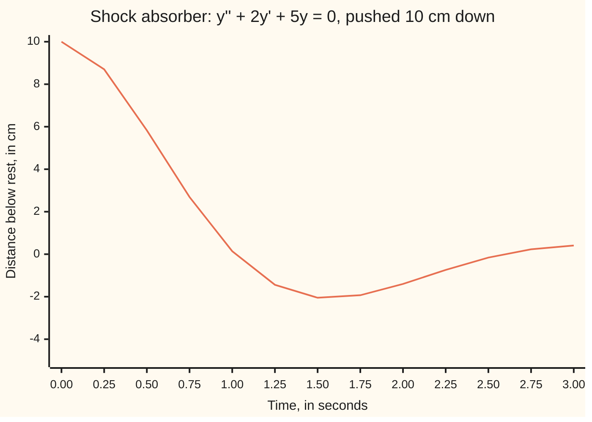
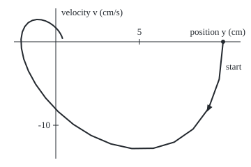

# From one equation to a system: any higher-order equation is several first-order ones in a vector

[Syllabus](../../../SYLLABUS.md) → [Differential equations and dynamics](../../../SYLLABUS.md#w08) → [Systems and the Matrix Exponential](../../../SYLLABUS.md#w08-s04) → From one equation to a system

---

## General Overview

A car corner on a test rig: 400 kg on a spring of 2000 N/m, with a shock absorber (a damper) pushing back 800 N per metre per second of speed. The rig pushes the corner 10 cm below rest and lets go. Force equals mass times acceleration; divided by 400 kg, that gives y'' + 2y' + 5y = 0. Here y is the distance below rest in cm, y' its velocity, y'' its acceleration, time in seconds.

The equation involves a second rate, the acceleration. Every solver and slope field in this wing steps a first rate: "the rate of y at time t is f(t, y)" ([A differential equation](../01-Rate%20Equations/01-what-a-differential-equation-says.md)). The fix is bookkeeping: carry position and velocity together. Position changes at the velocity. Velocity changes at the acceleration, which the equation supplies.

The pair is the **state**, written x: everything about the corner now that fixes its future. Its rate is a matrix times the state, x' = `[[0, 1], [-5, -2]]` x.

**Any equation in the nth rate of one unknown is n first-order equations in a state vector (the unknown and its first n − 1 rates), and a linear one is the single line x' = Ax.**

**What kind of fact this is:** a method: a rewriting that loses no solutions and gains none, proved on this card in Why it works.

### The picture: the car corner settling



Orange: distance below rest, from the solved equation. The corner overshoots: at 1.5 s it is 2.05 cm above rest. Then it settles.

---

## The formula

Notation first. A bold letter is a list of numbers handled as one object, a **vector**; a prime on it means every entry's rate. Name the velocity v:

$$y'' = f(t, y, y') \quad\Longleftrightarrow\quad \begin{cases} y' = v \\ v' = f(t, y, v) \end{cases}$$

**Read it aloud:** position changes at the velocity; velocity changes at the acceleration the equation gives.

When f is linear (a sum of the unknowns, each times a fixed number), the right-hand sides are a matrix times the state ([Matrix times vector](../../03-Algebra/04-Matrices/02-matrix-times-vector.md)):

$$\mathbf{x}' = A\,\mathbf{x}, \qquad \mathbf{x} = \begin{pmatrix} y \\ v \end{pmatrix}, \qquad A = \begin{pmatrix} 0 & 1 \\ -5 & -2 \end{pmatrix}$$

**Read it aloud:** the state's rate is the matrix A times the state.

Row one reads y' = 0 × y + 1 × v: the definition of velocity. Row two reads v' = −5y − 2v: the shock absorber equation. Every card on this shelf starts from x' = Ax.

| Symbol | Plain meaning | In our example | Push it up and the answer… |
| --- | --- | --- | --- |
| $t$ | time since release, in s | 0 to 3 s | nearer rest |
| $y$ | distance below rest, in cm | 10, then 0.1416 at 1 s | bigger swing, same timing |
| $v$ | velocity y', in cm/s | 0, then −8.3628 at 1 s | later first crossing |
| $f$ | the acceleration, from t, y and v | −5y − 2v | — |
| $\mathbf{x}$ | the state: the vector (y, v) | (10, 0) at release | — |
| $A$ | the matrix giving the rates | `[[0, 1], [-5, -2]]` | −5 lower: faster swings |
| $\lambda$ | a characteristic root, and an eigenvalue of A | −1 ± 2i | — |
| $h$ | Euler's step length, in s | 0.01 to 0.0001 | proportionally bigger error |

### When it holds

- **Solvable for the top rate.** t y'' + y = 0 cannot be solved for y'' at t = 0; the system's rate blows up there.
- **Two starting numbers.** Without y'(0) the state is incomplete: Step 0 shows two futures from one position.
- **Linearity, for x' = Ax.** A pendulum, v' = −sin y, is still a first-order system but not a matrix times the state: [Phase portraits and nullclines](../06-Nonlinear%20Dynamics%20in%20the%20Plane/01-phase-portraits-and-nullclines.md).
- **Fixed numbers in A.** Time-varying coefficients give x' = A(t)x, where the shelf's exponential solution fails as it stands.

---

## Why it works

### Step 0: the present needs two numbers

The corner is at rest height, y = 0, at 1.0172 s, rising at 8.0856 cm/s. It is there again at 2.5880 s, sinking at 1.6808 cm/s. Same position, different futures: position alone is not a state. With velocity added, the equation gives the acceleration, and the acceleration the next velocity.

### Step 1: name the velocity, and its definition is the first equation

Writing v for y' is itself an equation, y' = v: row one. No physics went into it.

### Step 2: the original equation is the second row

Solve for the top rate, y'' = −5y − 2y', and rename: v' = −5y − 2v. The right-hand sides are row-times-column products, (0, 1) times (y, v) and (−5, −2) times (y, v), so the pair is x' = Ax. At release, A times (10, 0) is (0, −50): not moving yet, accelerating upward at 50 cm/s^2.

### Step 3: nothing is lost and nothing is gained

If y solves the equation, (y, y') solves the system, by Steps 1 and 2. Back: if (y, v) solves the system, row one says v is y', so row two says y'' = −5y − 2y'. Same solutions, matched one to one, with the same starting numbers.

The characteristic equation survives too ([The characteristic equation](../03-Oscillators%20-%20Second-Order%20Linear%20Equations/02-the-characteristic-equation.md)). An eigenvalue of A (a number λ with A times some nonzero vector equal to λ times it) is exactly a root of r^2 + 2r + 5 = 0, with eigenvector (1, λ). For λ = −1 + 2i, A (1, λ) is (−1 + 2i, −3 − 4i), which is λ (1, λ). Those eigenvalues solve the system in [The eigenvalue method](02-the-eigenvalue-method.md); complex ones make the state turn as it shrinks, in [Complex eigenvalues](03-complex-eigenvalues-and-spirals.md).

### Step 4: any order, the same way

An equation in the nth rate needs n starting numbers: the unknown and its first n − 1 rates. They are the state. Each rate's rate is the next entry, a row with a single 1; the last row is the equation solved for the top rate. For y''' + 3y'' + 3y' + y = 0 the state is (y, y', y'') and

$$A = \begin{pmatrix} 0 & 1 & 0 \\ 0 & 0 & 1 \\ -1 & -3 & -3 \end{pmatrix}$$

1s above the diagonal and the coefficients, sign-flipped, along the bottom: the **companion matrix**. From (1, 0, 0) the characteristic-equation answer is y = e^−t (1 + t + t^2/2), so y(1) = 0.9197; stepping the three-entry state gives 0.9197 too.

<details>
<summary>Detailed proof: the equivalence and the eigenvalues, at any order</summary>

Write $y^{(k)}$ for the kth rate of y, and take $y^{(n)} = f(t, y, \dots, y^{(n-1)})$. The state's entries are $x_k = y^{(k-1)}$ for k from 1 to n; the rows are $x_k' = x_{k+1}$ below the last, and the last is the equation.

Equation to system: the definitions give the upper rows, the equation the last. System to equation: the upper rows force $x_k = y^{(k-1)}$ with y the first entry, so the last row is the equation. Starting values match entry by entry.

Eigenvalues, linear case $y^{(n)} + a_{n-1} y^{(n-1)} + \dots + a_0 y = 0$. If $A\mathbf{x} = \lambda \mathbf{x}$ with the vector not zero, the upper rows give $x_{k+1} = \lambda x_k$, so the vector is its first entry, not zero, times $(1, \lambda, \dots, \lambda^{n-1})$. The last row, divided by that entry, reads $\lambda^n + a_{n-1}\lambda^{n-1} + \dots + a_0 = 0$: the characteristic equation. Read backwards, each root gives an eigenvector.

</details>

### Step 5: why every solver and every phase picture wants this form

**Solvers.** Euler's rule, new state = old state + step length × rate ([Euler's method](../05-Numerical%20Evolution/01-eulers-method.md)), is one line for a state of any length. One loop steps both the shock absorber and the third-order equation.

**Pictures.** The rate law never mentions t, so each point of the plane of states (position across, velocity up) carries one fixed arrow, Ax. Solutions follow the arrows, and exactly one solution passes through each state, so paths never cross. The time chart passes y = 0 repeatedly; the state never revisits a point.

### The picture: the release in the plane of states

<p align="center"></p>

To scale: 1 cm of position is 24 units across, 1 cm/s of velocity 12 units up; the axes cross at rest, (0, 0). The dot is the release (10, 0); points are 0.1 s apart, 0 to 3 s. The curve crosses the velocity axis at Step 0's two passes.

Another road writes x(t) = e^(At) x(0), a matrix in the exponent: [The matrix exponential](04-the-matrix-exponential.md).

---

## Worked numbers, by hand

| Step | Arithmetic | Value |
| --- | --- | --- |
| damping per kg | 800 ÷ 400 | 2 per s |
| stiffness per kg | 2000 ÷ 400 | 5 per s^2 |
| the matrix | rows (0, 1) and (−5, −2) | `[[0, 1], [-5, -2]]` |
| rate at release | (0 × 10 + 1 × 0, −5 × 10 − 2 × 0) | (0, −50) |
| the solution | fitted to y(0) = 10, y'(0) = 0 | y = e^−t (10 cos 2t + 5 sin 2t) |
| position at 1 s | formula; Euler with h = 0.0001 | **0.1416 cm**; 0.1408 cm |

After one second the corner is 0.1416 cm below rest, rising at 8.3628 cm/s: the state, not the position, says it will overshoot.

### What breaks if you drop a piece

| Mistake | Comes out at | What went wrong |
| --- | --- | --- |
| State = position alone | y = 0 at 1.0172 s and 2.5880 s, v −8.0856 and 1.6808 | One number cannot tell two futures apart |
| Bottom row `[5, 2]`, signs not flipped | y(1) = 94.75 cm, growing | Moving terms across flips their signs |
| Bottom row `[-2, -5]`, coefficients swapped | y(1) = 7.13 cm | A heavier damper, softer spring |

The code prints all three.

---

## Code, from first principles, and it actually runs

Road one is the characteristic-equation solution and its rate, v = −25 e^−t sin 2t. Road two builds A and steps the state with Euler's rule; its error at 1 s halves as the step halves, the mark of a first-order method. The same stepper solves the third-order case. The last three lines are the figure's points.

### Python

```python
# From one equation to a system -- the check behind the card.  Standard library
# only.  A 400 kg car corner on a test rig: spring 2000 N/m, damper 800 N s/m,
# so y'' + 2y' + 5y = 0 with y in cm, pushed down 10 cm and let go at rest.
# Road one: the characteristic-equation answer.  Road two: Euler steps on the
# state (y, v), x' = A x.  Second case: a third-order equation, same stepper.
import math

A = [[0.0, 1.0], [-5.0, -2.0]]                      # rows: y' = v, v' = -5y - 2v
def exact(t):                                       # y = e^-t (10 cos 2t + 5 sin 2t)
    return (math.exp(-t) * (10 * math.cos(2 * t) + 5 * math.sin(2 * t)),
            -25 * math.exp(-t) * math.sin(2 * t))   # v = y' = -25 e^-t sin 2t
def times(M, x):                                    # matrix times vector
    return [sum(M[i][j] * x[j] for j in range(len(x))) for i in range(len(M))]
def euler(M, x, t_end, h):                          # new state = state + h A state
    for _ in range(round(t_end / h)):
        x = [a + h * b for a, b in zip(x, times(M, x))]
    return x

def c(z):                                           # a complex number as a + bi
    return f"{z.real:g} {'-' if z.imag < 0 else '+'} {abs(z.imag):g}i"

x0 = [10.0, 0.0]
lam = complex(-1, 2)                                # root of r^2 + 2r + 5 = 0
Av = [A[0][0] + A[0][1] * lam, A[1][0] + A[1][1] * lam]   # A times (1, lam)
e1, e2 = euler(A, x0, 1, 1e-4), euler(A, x0, 2, 1e-4)
errs = [abs(euler(A, x0, 1, h)[0] - exact(1)[0]) for h in (0.01, 0.005, 0.0025)]
t1 = (math.pi - math.atan(2)) / 2                   # y = 0 when tan 2t = -2
C3 = [[0.0, 1.0, 0.0], [0.0, 0.0, 1.0], [-1.0, -3.0, -3.0]]  # y''' + 3y'' + 3y' + y = 0
y3 = math.exp(-1) * (1 + 1 + 0.5)                   # y = e^-t (1 + t + t^2/2) at t = 1
bad = euler([[0.0, 1.0], [5.0, 2.0]], x0, 1, 1e-4)[0]      # signs not flipped
swap = euler([[0.0, 1.0], [-2.0, -5.0]], x0, 1, 1e-4)[0]   # 2 and 5 swapped
pts = [(80 + 24 * exact(k / 10)[0], 60 - 12 * exact(k / 10)[1]) for k in range(31)]
print("rig: m 400 kg, c 800 N s/m, k 2000 N/m -> y'' + 2y' + 5y = 0 (c/m = 2, k/m = 5)")
print(f"A = {A}; state x = (y, v) = {x0}; A x = {times(A, x0)}")
print(f"roots of r^2 + 2r + 5: {c(lam)}, {c(lam.conjugate())}; A (1, lam) = ({c(Av[0])}, {c(Av[1])}), "
      f"lam (1, lam) = ({c(lam)}, {c(lam * lam)})")
print("y = e^-t (10 cos 2t + 5 sin 2t) cm, v = y' = -25 e^-t sin 2t cm/s; y = 0 where tan 2t = -2")
for t, e in ((1, e1), (2, e2)):
    print(f"t = {t} s: formula y {exact(t)[0]:.4f} cm, v {exact(t)[1]:.4f} cm/s; Euler h = 0.0001 y {e[0]:.4f}, v {e[1]:.4f}")
print("Euler error in y at t = 1, h = 0.01, 0.005, 0.0025:", " ".join(f"{e:.5f}" for e in errs))
print(f"error ratios on halving h: {errs[0] / errs[1]:.3f} {errs[1] / errs[2]:.3f}")
print("t (s) ", " ".join(f"{k / 4:.2f}" for k in range(13)))
print("y (cm)", " ".join(f"{exact(k / 4)[0]:.2f}" for k in range(13)))
print(f"y = 0 at t = {t1:.4f} s with v {exact(t1)[1]:.4f}, and at t = {t1 + math.pi / 2:.4f} s with v {exact(t1 + math.pi / 2)[1]:.4f}")
print(f"third order y''' + 3y'' + 3y' + y = 0 from (1, 0, 0): y(1) = e^-1 (1 + 1 + 1/2) = {y3:.4f}; Euler {euler(C3, [1.0, 0.0, 0.0], 1, 1e-4)[0]:.4f}")
print(f"mistake, bottom row [5, 2]: y(1) = {bad:.2f} cm; mistake, bottom row [-2, -5]: y(1) = {swap:.2f} cm")
for r in range(3):
    print("figure,", " ".join(f"{X:.1f},{Y:.1f}" for X, Y in pts[11 * r:11 * r + 11]))
assert abs(Av[0] - lam) < 1e-12 and abs(Av[1] - lam * lam) < 1e-12   # roots are A's eigenvalues
assert abs(e1[0] - exact(1)[0]) < 1e-3 and abs(e2[1] - exact(2)[1]) < 5e-3  # road two meets road one
assert all(1.8 < errs[i] / errs[i + 1] < 2.2 for i in range(2))        # error halves: order one
assert abs(euler(C3, [1.0, 0.0, 0.0], 1, 1e-4)[0] - y3) < 1e-3        # third order, both roads
print("ALL CHECKS PASS")
```

**Ran 2026-09-28 on macOS, Python 3.14.6, standard library only. All checks passed. Output, pasted from the run:**

```
rig: m 400 kg, c 800 N s/m, k 2000 N/m -> y'' + 2y' + 5y = 0 (c/m = 2, k/m = 5)
A = [[0.0, 1.0], [-5.0, -2.0]]; state x = (y, v) = [10.0, 0.0]; A x = [0.0, -50.0]
roots of r^2 + 2r + 5: -1 + 2i, -1 - 2i; A (1, lam) = (-1 + 2i, -3 - 4i), lam (1, lam) = (-1 + 2i, -3 - 4i)
y = e^-t (10 cos 2t + 5 sin 2t) cm, v = y' = -25 e^-t sin 2t cm/s; y = 0 where tan 2t = -2
t = 1 s: formula y 0.1416 cm, v -8.3628 cm/s; Euler h = 0.0001 y 0.1408, v -8.3633
t = 2 s: formula y -1.3967 cm, v 2.5606 cm/s; Euler h = 0.0001 y -1.3969, v 2.5622
Euler error in y at t = 1, h = 0.01, 0.005, 0.0025: 0.08101 0.04027 0.02008
error ratios on halving h: 2.011 2.006
t (s)  0.00 0.25 0.50 0.75 1.00 1.25 1.50 1.75 2.00 2.25 2.50 2.75 3.00
y (cm) 10.00 8.70 5.83 2.69 0.14 -1.44 -2.05 -1.93 -1.40 -0.74 -0.16 0.23 0.41
y = 0 at t = 1.0172 s with v -8.0856, and at t = 2.5880 s with v 1.6808
third order y''' + 3y'' + 3y' + y = 0 from (1, 0, 0): y(1) = e^-1 (1 + 1 + 1/2) = 0.9197; Euler 0.9197
mistake, bottom row [5, 2]: y(1) = 94.75 cm; mistake, bottom row [-2, -5]: y(1) = 7.13 cm
figure, 320.0,60.0 314.4,113.9 299.2,155.6 276.9,185.5 249.8,204.3 219.9,213.1 189.1,213.5 159.0,206.8 130.7,194.7 105.3,178.8 83.4,160.4
figure, 65.3,140.7 51.1,121.0 40.8,102.1 34.1,84.8 30.8,69.4 30.2,56.5 32.0,46.0 35.6,38.1 40.6,32.5 46.5,29.3 52.8,28.0
figure, 59.2,28.4 65.3,30.1 71.1,32.9 76.1,36.4 80.5,40.3 84.0,44.4 86.7,48.5 88.6,52.3 89.8,55.8
ALL CHECKS PASS
```

### Rust

Same numbers, same labels, built with `rustc --edition 2021 -O`; complex numbers are (real, imaginary) pairs.

```rust
// From one equation to a system -- the same check as the Python, in Rust.  No
// crates.  A 400 kg car corner on a test rig: spring 2000 N/m, damper 800 N s/m,
// so y'' + 2y' + 5y = 0 with y in cm, pushed down 10 cm and let go at rest.
// Road one: the characteristic-equation answer.  Road two: Euler steps on the
// state (y, v), x' = A x.  Second case: a third-order equation, same stepper.
type Mat = Vec<Vec<f64>>;

fn exact(t: f64) -> (f64, f64) { // y = e^-t (10 cos 2t + 5 sin 2t), v = -25 e^-t sin 2t
    ((-t).exp() * (10.0 * (2.0 * t).cos() + 5.0 * (2.0 * t).sin()), -25.0 * (-t).exp() * (2.0 * t).sin())
}

fn times(m: &Mat, x: &[f64]) -> Vec<f64> { // matrix times vector
    m.iter().map(|row| row.iter().zip(x).map(|(a, b)| a * b).sum()).collect()
}

fn euler(m: &Mat, x0: &[f64], t_end: f64, h: f64) -> Vec<f64> { // new state = state + h A state
    let mut x = x0.to_vec();
    for _ in 0..(t_end / h).round() as usize {
        let r = times(m, &x);
        x = x.iter().zip(&r).map(|(a, b)| a + h * b).collect();
    }
    x
}

fn mul(a: (f64, f64), b: (f64, f64)) -> (f64, f64) { (a.0 * b.0 - a.1 * b.1, a.0 * b.1 + a.1 * b.0) }

fn c(z: (f64, f64)) -> String { // a complex number as a + bi
    format!("{} {} {}i", z.0, if z.1 < 0.0 { "-" } else { "+" }, z.1.abs())
}

fn main() {
    let a: Mat = vec![vec![0.0, 1.0], vec![-5.0, -2.0]]; // rows: y' = v, v' = -5y - 2v
    let x0 = [10.0, 0.0];
    let lam = (-1.0, 2.0); // root of r^2 + 2r + 5 = 0, as (real, imaginary)
    let av = ((a[0][0] + a[0][1] * lam.0, a[0][1] * lam.1), (a[1][0] + a[1][1] * lam.0, a[1][1] * lam.1));
    let lam2 = mul(lam, lam);
    let (e1, e2) = (euler(&a, &x0, 1.0, 1e-4), euler(&a, &x0, 2.0, 1e-4));
    let errs: Vec<f64> = [0.01, 0.005, 0.0025].iter().map(|&h| (euler(&a, &x0, 1.0, h)[0] - exact(1.0).0).abs()).collect();
    let t1 = (std::f64::consts::PI - 2f64.atan()) / 2.0; // y = 0 when tan 2t = -2
    let c3: Mat = vec![vec![0.0, 1.0, 0.0], vec![0.0, 0.0, 1.0], vec![-1.0, -3.0, -3.0]]; // y''' + 3y'' + 3y' + y = 0
    let y3 = (-1f64).exp() * (1.0 + 1.0 + 0.5); // y = e^-t (1 + t + t^2/2) at t = 1
    let e3 = euler(&c3, &[1.0, 0.0, 0.0], 1.0, 1e-4)[0];
    let bad = euler(&vec![vec![0.0, 1.0], vec![5.0, 2.0]], &x0, 1.0, 1e-4)[0]; // signs not flipped
    let swap = euler(&vec![vec![0.0, 1.0], vec![-2.0, -5.0]], &x0, 1.0, 1e-4)[0]; // 2 and 5 swapped
    let pts: Vec<String> = (0..31).map(|k| { let (y, v) = exact(k as f64 / 10.0); format!("{:.1},{:.1}", 80.0 + 24.0 * y, 60.0 - 12.0 * v) }).collect();
    println!("rig: m 400 kg, c 800 N s/m, k 2000 N/m -> y'' + 2y' + 5y = 0 (c/m = 2, k/m = 5)");
    println!("A = {:?}; state x = (y, v) = {:?}; A x = {:?}", a, x0, times(&a, &x0));
    println!("roots of r^2 + 2r + 5: {}, {}; A (1, lam) = ({}, {}), lam (1, lam) = ({}, {})", c(lam), c((lam.0, -lam.1)), c(av.0), c(av.1), c(lam), c(lam2));
    println!("y = e^-t (10 cos 2t + 5 sin 2t) cm, v = y' = -25 e^-t sin 2t cm/s; y = 0 where tan 2t = -2");
    for (t, e) in [(1, &e1), (2, &e2)] {
        let (y, v) = exact(t as f64);
        println!("t = {} s: formula y {:.4} cm, v {:.4} cm/s; Euler h = 0.0001 y {:.4}, v {:.4}", t, y, v, e[0], e[1]);
    }
    println!("Euler error in y at t = 1, h = 0.01, 0.005, 0.0025: {:.5} {:.5} {:.5}", errs[0], errs[1], errs[2]);
    println!("error ratios on halving h: {:.3} {:.3}", errs[0] / errs[1], errs[1] / errs[2]);
    println!("t (s)  {}", (0..13).map(|k| format!("{:.2}", k as f64 / 4.0)).collect::<Vec<_>>().join(" "));
    println!("y (cm) {}", (0..13).map(|k| format!("{:.2}", exact(k as f64 / 4.0).0)).collect::<Vec<_>>().join(" "));
    let t2 = t1 + std::f64::consts::PI / 2.0;
    println!("y = 0 at t = {:.4} s with v {:.4}, and at t = {:.4} s with v {:.4}", t1, exact(t1).1, t2, exact(t2).1);
    println!("third order y''' + 3y'' + 3y' + y = 0 from (1, 0, 0): y(1) = e^-1 (1 + 1 + 1/2) = {:.4}; Euler {:.4}", y3, e3);
    println!("mistake, bottom row [5, 2]: y(1) = {:.2} cm; mistake, bottom row [-2, -5]: y(1) = {:.2} cm", bad, swap);
    for r in 0..3 { println!("figure, {}", pts[11 * r..(11 * r + 11).min(31)].join(" ")) }
    let close = |p: (f64, f64), q: (f64, f64)| (p.0 - q.0).abs() + (p.1 - q.1).abs() < 1e-12;
    assert!(close(av.0, lam) && close(av.1, lam2)); // roots are A's eigenvalues
    assert!((e1[0] - exact(1.0).0).abs() < 1e-3 && (e2[1] - exact(2.0).1).abs() < 5e-3); // road two meets road one
    assert!((0..2).all(|i| errs[i] / errs[i + 1] > 1.8 && errs[i] / errs[i + 1] < 2.2)); // error halves: order one
    assert!((e3 - y3).abs() < 1e-3); // third order, both roads
    println!("ALL CHECKS PASS");
}
```

**Ran 2026-09-28 on macOS, rustc 1.98.1, no crates. All checks passed. Output, pasted from the run:**

```
rig: m 400 kg, c 800 N s/m, k 2000 N/m -> y'' + 2y' + 5y = 0 (c/m = 2, k/m = 5)
A = [[0.0, 1.0], [-5.0, -2.0]]; state x = (y, v) = [10.0, 0.0]; A x = [0.0, -50.0]
roots of r^2 + 2r + 5: -1 + 2i, -1 - 2i; A (1, lam) = (-1 + 2i, -3 - 4i), lam (1, lam) = (-1 + 2i, -3 - 4i)
y = e^-t (10 cos 2t + 5 sin 2t) cm, v = y' = -25 e^-t sin 2t cm/s; y = 0 where tan 2t = -2
t = 1 s: formula y 0.1416 cm, v -8.3628 cm/s; Euler h = 0.0001 y 0.1408, v -8.3633
t = 2 s: formula y -1.3967 cm, v 2.5606 cm/s; Euler h = 0.0001 y -1.3969, v 2.5622
Euler error in y at t = 1, h = 0.01, 0.005, 0.0025: 0.08101 0.04027 0.02008
error ratios on halving h: 2.011 2.006
t (s)  0.00 0.25 0.50 0.75 1.00 1.25 1.50 1.75 2.00 2.25 2.50 2.75 3.00
y (cm) 10.00 8.70 5.83 2.69 0.14 -1.44 -2.05 -1.93 -1.40 -0.74 -0.16 0.23 0.41
y = 0 at t = 1.0172 s with v -8.0856, and at t = 2.5880 s with v 1.6808
third order y''' + 3y'' + 3y' + y = 0 from (1, 0, 0): y(1) = e^-1 (1 + 1 + 1/2) = 0.9197; Euler 0.9197
mistake, bottom row [5, 2]: y(1) = 94.75 cm; mistake, bottom row [-2, -5]: y(1) = 7.13 cm
figure, 320.0,60.0 314.4,113.9 299.2,155.6 276.9,185.5 249.8,204.3 219.9,213.1 189.1,213.5 159.0,206.8 130.7,194.7 105.3,178.8 83.4,160.4
figure, 65.3,140.7 51.1,121.0 40.8,102.1 34.1,84.8 30.8,69.4 30.2,56.5 32.0,46.0 35.6,38.1 40.6,32.5 46.5,29.3 52.8,28.0
figure, 59.2,28.4 65.3,30.1 71.1,32.9 76.1,36.4 80.5,40.3 84.0,44.4 86.7,48.5 88.6,52.3 89.8,55.8
ALL CHECKS PASS
```

The two outputs match line for line.

> [!TIP]
> **Try changing**
> Guess first, then run it.
> - **A stiffer spring.** Change `-5.0` to `-10.0` in `A`. The first assert stops the run: the roots of r^2 + 2r + 10 = 0 are −1 ± 3i.
> - **Coarser steps.** Use `(0.04, 0.02, 0.01)`. Ratios stay near 2; the last error is the old first, 0.08101.
> - **A moving release.** Set `x0` to `[10.0, 5.0]`. Euler follows the new future, the formula assumes rest, and the second assert stops the run.

---

## The usual mistake

> [!warning]
> **Treating the position as the whole state.** The corner passes rest height at 1.0172 s rising and at 2.5880 s sinking; only position with velocity tells them apart.
>
> - **Signs not flipped.** Moved across the equals sign, 2y' + 5y becomes −2y' − 5y. Row `[5, 2]` gives 94.75 cm after 1 s.
> - **Coefficients swapped.** Under y sits the spring's 5, under v the damper's 2. Swapped: y(1) = 7.13 cm.
> - **A coefficient left on the top rate.** 400y'' + 800y' + 2000y = 0 must be divided by 400 first.

---

## Where you meet it in real life

- **Numerical solvers.** Library routines accept only first-order systems. Flight, orbit and circuit simulators rewrite their second-order laws this way first.
- **Control engineering.** Suspension controllers and autopilots are designed on x' = Ax + Bu, with u the controller's input; forcing is [Forced systems](06-forced-systems-and-variation-of-constants.md).
- **Coupled masses.** Two masses on springs give a four-entry state: [Normal modes](07-coupled-oscillators-and-normal-modes.md).
- **Stability at a glance.** Whether rest attracts, repels or spirals is read from two numbers of A: [Trace and determinant](05-classifying-equilibria-by-trace-and-determinant.md).

> **Say it back**
> A second-order equation needs position and velocity now to fix its future. Make them one vector, the state. Row one is the definition of velocity; row two is the equation solved for the acceleration. A linear equation becomes x' = Ax, whose eigenvalues are the characteristic roots. The same move works at any order, and every solver and phase picture uses it.

---

## What this builds on

- [The characteristic equation](../03-Oscillators%20-%20Second-Order%20Linear%20Equations/02-the-characteristic-equation.md): the roots −1 ± 2i and the closed-form solution, road one here.
- [Matrix times vector](../../03-Algebra/04-Matrices/02-matrix-times-vector.md): the row-times-column rule that turns the two rate laws into Ax.

## Where this goes next

- [The eigenvalue method](02-the-eigenvalue-method.md): solving x' = Ax along eigenvectors.
- [Phase portraits and nullclines](../06-Nonlinear%20Dynamics%20in%20the%20Plane/01-phase-portraits-and-nullclines.md): the plane of states for nonlinear laws.
- [Continuous-time chains](../../11-Stochastic%20processes%20and%20calculus/04-Poisson%20and%20Jump%20Processes/05-continuous-time-markov-chains-and-queues.md): a vector of chances with a rate matrix, the same shape.
- Fundamental theorem of curves: a curve's moving frame obeys a linear system.
- Lie bracket: a first-order system as a vector field.

---

## Sources

Verified 2026-09-28: every link below resolves to the publisher's page.

- Dawkins, Paul. "Systems of Differential Equations." Paul's Online Notes, Lamar University. [Notes](https://tutorial.math.lamar.edu/Classes/DE/SystemsDE.aspx). An nth-order equation as a system, and a system in matrix form.
- Boyce, William E., Richard C. DiPrima and Douglas B. Meade. *Elementary Differential Equations*, 12th ed. Wiley, 2021. [Publisher page](https://www.wiley.com/en-us/Elementary+Differential+Equations%2C+12th+Edition-p-9781119777755). Its chapter on first-order linear systems opens with this reduction.
- Strogatz, Steven H. *Nonlinear Dynamics and Chaos*, 2nd ed. CRC Press. [Publisher page](https://www.routledge.com/Nonlinear-Dynamics-and-Chaos-With-Applications-to-Physics-Biology-Chemistry-and-Engineering/Strogatz/p/book/9780367026509). The plane of states, built on first-order form.
- MIT OpenCourseWare. *18.03SC Differential Equations*, Fall 2011. [Course page](https://ocw.mit.edu/courses/18-03sc-differential-equations-fall-2011/). First-order systems and companion matrices, with lectures.
