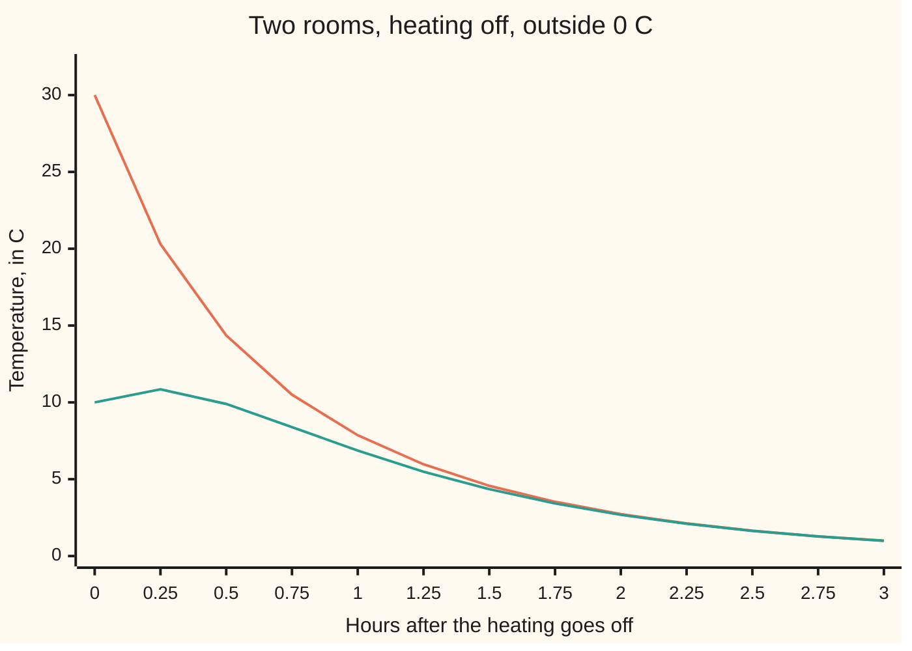
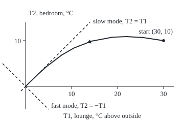

# The eigenvalue method: along an eigenvector the system only stretches, so each mode is a plain exponential

Differential equations and dynamics → Systems and the Matrix Exponential → Modes that fade on their own → The eigenvalue method

---

## General Overview

Two rooms share a wall. The heating goes off at 10 pm. The lounge reads 30 °C, the bedroom 10 °C, and outside it is 0 °C. Each room leaks heat outdoors, and heat crosses the wall from warm to cool. Each room's rate depends on the other room.

Two numbers untangle it. The average of the rooms only leaks outdoors: the wall moves heat between rooms without losing any. The difference shrinks by that leak too, and by the wall twice over: the flow cools the warm room and warms the cool one. So the difference fades three times faster than the average. By 11 pm the rooms are within 1 °C of each other; the average takes three hours to fall to 1 °C.

The average and the difference are the system's **modes**: fixed patterns that each fade by their own plain exponential. The eigenvalue method finds them for any such system.

**Write the start as a mix of eigenvectors; each piece then decays at its own eigenvalue, and the solution is the sum of the pieces.**

**What kind of fact this is:** a method. Why it works proves it gives the only solution whenever the matrix has two independent real eigenvectors.

### The picture: both rooms through the night



Orange: the lounge. Teal: the bedroom, which warms for the first 0.2027 h, fed through the wall.

---

## The formula

Reminder: $x' = Ax$ says "the rate of the state x is the matrix A times x" ([from-one-equation-to-a-system](01-from-one-equation-to-a-system.md)). Each room loses, per hour, its excess over outside plus its gap to the other room. For the lounge that is $-T_1 - (T_1 - T_2) = -2T_1 + T_2$:

$$\begin{pmatrix} T_1 \\ T_2 \end{pmatrix}' = \begin{pmatrix} -2 & 1 \\ 1 & -2 \end{pmatrix} \begin{pmatrix} T_1 \\ T_2 \end{pmatrix}, \qquad \begin{pmatrix} T_1 \\ T_2 \end{pmatrix}(0) = \begin{pmatrix} 30 \\ 10 \end{pmatrix}$$

An **eigenvector** of A is a direction A only stretches: $Av = \lambda v$, with the stretch $\lambda$ its **eigenvalue** ([eigenvalues-and-eigenvectors](../../03-Algebra/07-Eigenvalues%20and%20Symmetric%20Matrices/02-eigenvalues-and-eigenvectors.md)). With two of them:

$$x(t) = c_1\, e^{\lambda_1 t}\, v_1 + c_2\, e^{\lambda_2 t}\, v_2, \qquad c_1 v_1 + c_2 v_2 = x(0)$$

**Read it aloud:** the state is each eigenvector, times its weight, fading at its own eigenvalue, added up; the weights are what it takes to build the start.

For the rooms, eigenvalue −1 goes with (1, 1) and −3 with (1, −1); the weights are 20 and 10:

$$T_1 = 20e^{-t} + 10e^{-3t}, \qquad T_2 = 20e^{-t} - 10e^{-3t}$$

| Symbol | Plain meaning | In our example | Push it up and the answer… |
| --- | --- | --- | --- |
| $T_1$, $T_2$ | lounge and bedroom, °C above outside | 30 and 10 at the start | — |
| $x$ | the state: both temperatures as one vector | (30, 10) at the start | — |
| $A$ | the rate matrix; row i gives room i's rate | `[[-2, 1], [1, -2]]` per hour | faster change |
| $t$ | time since the heating went off, in hours | 0 to 3 h | every mode smaller |
| $\lambda$, $\lambda_1$, $\lambda_2$ | eigenvalues: each mode's rate, per hour | −1 and −3 | that mode fades more slowly |
| $v$, $v_1$, $v_2$ | eigenvectors: the pattern each mode keeps | (1, 1) average, (1, −1) difference | — |
| $c_1$, $c_2$ | weights: how much of each mode the start holds | 20 and 10 | more of that mode |
| $I$, $P$, $D$ | identity; eigenvectors as columns; eigenvalues on a diagonal | `[[1, 1], [1, -1]]` for P | — |

The eigenvalues solve $\det(A - \lambda I) = 0$, the **characteristic equation**: A minus that stretch squashes some direction flat.

### When it holds

- **Constant rates.** If the wall's insulation changed hour by hour, the eigenvectors would drift and the modes would feed each other.
- **Two independent eigenvectors.** Distinct eigenvalues guarantee them. A repeated eigenvalue may leave one direction, and a t e^(−t) term no mode supplies (What breaks, last row).
- **Real eigenvalues.** Complex ones give spirals: [complex-eigenvalues-and-spirals](03-complex-eigenvalues-and-spirals.md).
- **No input.** A heater adds a term that is not A times x: [forced-systems-and-variation-of-constants](06-forced-systems-and-variation-of-constants.md).

---

## Why it works

### Step 0: along an eigenvector the matrix only stretches

One equation y' = λy is solved by e^(λt) times its start. A system is harder only because A mixes the rooms. Along an eigenvector it does not mix. So try a state that keeps the shape v and only changes size, x = e^(λt) v. Its rate is λe^(λt) v; A times it is e^(λt) Av = λe^(λt) v. They agree: the vector equation has collapsed to one number fading at rate λ.

### Step 1: find the stretching directions

For a 2 × 2 matrix the characteristic equation is λ^2 − (diagonal sum) λ + determinant = 0. Here the diagonal sums to −4 and the determinant is 4 − 1 = 3:

$$\lambda^2 + 4\lambda + 3 = (\lambda + 1)(\lambda + 3) = 0$$

For a direction (a, b), the first row of (A − λI)(a, b) = 0 reads −a + b = 0 at λ = −1, giving (1, 1), and a + b = 0 at −3, giving (1, −1). Check: A times them gives (−1, −1) and (−3, 3).

### Step 2: add the modes and fit the start

The equation is **linear**: the rate of a sum is the sum of the rates, so any mix of modes solves it. The start fixes the mix: c_1 (1, 1) + c_2 (1, −1) = (30, 10). Adding the two rows gives 2c_1 = 40; subtracting gives 2c_2 = 20. So c_1 = 20 and c_2 = 10.

In matrix terms, P c = x(0), so the weights are P's inverse times the start, not P times it.

### Step 3: nothing else solves it

In eigenvector coordinates, the weights, the system is two separate one-variable equations, each solved only by its exponential. Switching back gives the formula and nothing else.

<details>
<summary>Detailed proof: every solution is a sum of modes</summary>

If $v_2 = k v_1$, then $A v_2 = \lambda_1 v_2$, so $\lambda_2 = \lambda_1$: distinct eigenvalues give independent eigenvectors. So $P$ has an inverse, and $AP = PD$.

Let x be any solution and put z = P^(−1) x. P is constant, so z' = P^(−1) x' = P^(−1) A P z = D z. Row by row: z_1' = λ_1 z_1 and z_2' = λ_2 z_2, with no coupling.

Then (e^(−λ_1 t) z_1)' = e^(−λ_1 t)(z_1' − λ_1 z_1) = 0, so z_1 = z_1(0) e^(λ_1 t); likewise z_2. So x = P z = z_1(0) e^(λ_1 t) v_1 + z_2(0) e^(λ_2 t) v_2, with z(0) = P^(−1) x(0) the weights of Step 2.

</details>

### Step 4: read which mode dies fastest

Adding the rate laws gives (T_1 + T_2)' = −(T_1 + T_2); subtracting gives (T_1 − T_2)' = −3(T_1 − T_2): the two modes, seen directly. The average is 20e^(−t), half-life ln 2 = 0.693 h. The difference is 20e^(−3t), half-life ln 2 / 3 = 0.231 h. The rooms are within 1 °C of each other at ln 20 / 3 = 0.999 h; the average reaches 1 °C only at ln 20 = 2.996 h, three times as long. The eigenvalue nearest zero sets how long the house takes to settle; the fast one, how soon the rooms look alike.

Early on, the 20 °C gap pushes heat through the wall faster than the bedroom loses it outdoors, so the bedroom rises to 10.887 °C at t = ln 1.5 / 2 = 0.2027 h.

### The picture: the path in the plane of both temperatures

<p align="center"></p>

Drawn to scale, 9 px per °C on both axes, origin at both rooms equal to outside; path points at t = 0, 0.1, 0.2, 0.3, 0.5, 0.75, 1, 1.5, 2 and 3 h. Dashed: the two eigenvector directions. The path bends onto the slow line as the fast mode dies.

### Step 5: the eigenvectors need not be at right angles

Take a second pair of rooms, the bedroom half the lounge's size with half its outside wall: T_1' = −3T_1 + T_2 and T_2' = 2T_1 − 4T_2. Then λ^2 + 7λ + 10 = 0: eigenvalues −2 and −5, eigenvectors (1, 1) and (1, −2), not at right angles. The weights still come from solving c_1 (1, 1) + c_2 (1, −2) = (30, 10): c_2 = 6.667 and c_1 = 23.333. At 1 h the rooms read 3.2027 °C and 3.0680 °C. Shortcuts that assume right angles fail (What breaks, third row).

The same method, packed into one matrix, is the matrix exponential: e^(At) = P e^(Dt) P^(−1). Defined another way, e^(At) also covers the case with one eigenvector missing ([the-matrix-exponential](04-the-matrix-exponential.md)).

---

## Worked numbers, by hand

| Step | Arithmetic | Value |
| --- | --- | --- |
| characteristic equation | λ^2 − (−4)λ + (4 − 1) | λ^2 + 4λ + 3 = 0 |
| eigenvalues | roots of (λ + 1)(λ + 3) | −1 and −3 per hour |
| eigenvectors | first row of (A − λI)v = 0 | (1, 1) and (1, −1) |
| weights | c_1 + c_2 = 30, c_1 − c_2 = 10 | c_1 = 20, c_2 = 10 |
| slow piece at 1 h | 20 × e^(−1) | 7.3576 in each room |
| fast piece at 1 h | 10 × e^(−3) | ±0.4979 |
| lounge at 1 h | 7.3576 + 0.4979 | **7.8555 °C** |
| bedroom at 1 h | 7.3576 − 0.4979 | **6.8597 °C** |

After an hour the 20 °C gap is below 1 °C, while the average has only fallen from 20 °C to 7.3576 °C.

### What breaks if you drop a piece

| Mistake | Comes out at | What went wrong |
| --- | --- | --- |
| Weights from P times the start | weights (40, 20) rebuild the start as (60, 20) | Weights need P's inverse |
| Rates swapped between modes | lounge 4.6745 °C at 1 h, not 7.8555 | Each weight fades at its own eigenvector's rate |
| Weights by dot products, half-size room | weights (20, 2) rebuild (22, 16), not (30, 10) | Projection works only for perpendicular eigenvectors |
| Repeated eigenvalue, `[[-1, 1], [0, -1]]` | one direction (1, 0); true x_1(1) = 14.7152 | (30 + 10t)e^(−t) needs a t e^(−t) term no mode has |

The code prints all four.

---

## Code, from first principles, and it actually runs

Two roads. Road one: eigenvalues from the characteristic equation, eigenvectors from the first row, weights by Cramer's rule, modes added. Road two never mentions an eigenvalue: it steps the coupled rates with Euler's rule, new state = old state + step length h × rate ([eulers-method](../05-Numerical%20Evolution/01-eulers-method.md)). Halving h halves the error: Euler's error is proportional to h.

### Python

```python
# The eigenvalue method -- the check behind the card.  Standard library only.
# Two rooms, heating off, outside 0 C, time in hours: T1' = -2 T1 + T2,
# T2' = T1 - 2 T2, start (30, 10).  Road one: eigenvalues, eigenvectors, modes
# fitted to the start.  Road two: Euler steps on the coupled rates.
import math
def eigen(a):              # roots of L^2 - trace L + det = 0, and a direction for each
    tr, det = a[0][0] + a[1][1], a[0][0] * a[1][1] - a[0][1] * a[1][0]
    lams = [(tr + math.sqrt(tr * tr - 4 * det)) / 2, (tr - math.sqrt(tr * tr - 4 * det)) / 2]
    return lams, [(a[0][1], lam - a[0][0]) for lam in lams]   # from row 1 of (A - L I) v = 0
def fit(vs, x0):           # c1 v1 + c2 v2 = x0, solved by Cramer's rule
    (p, q), (r, s) = vs
    return [(x0[0] * s - r * x0[1]) / (p * s - r * q), (p * x0[1] - q * x0[0]) / (p * s - r * q)]
def modes(lams, vs, cs, t):
    return [sum(c * math.exp(l * t) * v[i] for l, v, c in zip(lams, vs, cs)) for i in range(2)]
def rate(a, x):
    return [a[0][0] * x[0] + a[0][1] * x[1], a[1][0] * x[0] + a[1][1] * x[1]]
def euler(a, x, t_end, h):  # new state = old state + h x rate, repeated
    for _ in range(round(t_end / h)):
        x = [x[i] + h * rate(a, x)[i] for i in range(2)]
    return x
def peak(a, x, h):          # step until room 2 stops warming
    t = 0.0
    while rate(a, x)[1] > 0:
        x, t = euler(a, x, h, h), t + h
    return t, x[1]

A, B, J, X0 = [[-2, 1], [1, -2]], [[-3, 1], [2, -4]], [[-1, 1], [0, -1]], [30.0, 10.0]
vec = lambda v, d=0: f"({v[0]:.{d}f}, {v[1]:.{d}f})"
lams, vs = eigen(A); cs = fit(vs, X0)
T = lambda t: modes(lams, vs, cs, t)
ts, fig = [k / 4 for k in range(13)], [0, 0.1, 0.2, 0.3, 0.5, 0.75, 1, 1.5, 2, 3]
errs = [abs(euler(A, X0, 1, h)[0] - T(1)[0]) for h in (0.01, 0.005, 0.0025)]
eu1, pk = euler(A, X0, 1, 1e-4), peak(A, X0, 1e-5)
print(f"eigenvalues {lams[0]:.0f}, {lams[1]:.0f} per hour; eigenvectors {vec(vs[0])}, {vec(vs[1])}")
print(f"A times them: {vec(rate(A, vs[0]))}, {vec(rate(A, vs[1]))}; weights c1 = {cs[0]:.0f}, c2 = {cs[1]:.0f}")
print("t (h)  ", " ".join(f"{t:.2f}" for t in ts))
print("T1 (C) ", " ".join(f"{T(t)[0]:.2f}" for t in ts))
print("T2 (C) ", " ".join(f"{T(t)[1]:.2f}" for t in ts))
print(f"at 1 h: slow piece {cs[0] * math.exp(lams[0]):.4f}, fast piece {cs[1] * math.exp(lams[1]):.4f}; modes {vec(T(1), 4)}; Euler h = 0.0001 {vec(eu1, 4)}")
print("Euler error in T1 at 1 h, h = 0.01, 0.005, 0.0025:", " ".join(f"{e:.5f}" for e in errs), f"; ratios {errs[0] / errs[1]:.3f} {errs[1] / errs[2]:.3f}")
print(f"average {cs[0]:.0f} e^-t, half-life {math.log(2):.3f} h; difference {2 * cs[1]:.0f} e^-3t, half-life {math.log(2) / 3:.3f} h")
print(f"rooms within 1 C of each other at ln 20 / 3 = {math.log(20) / 3:.3f} h; average within 1 C of outside at ln 20 = {math.log(20):.3f} h")
print(f"room 2 peak: formula t = ln 1.5 / 2 = {math.log(1.5) / 2:.4f} h, {T(math.log(1.5) / 2)[1]:.3f} C; Euler {pk[0]:.4f} h, {pk[1]:.3f} C")
print("figure, path at 9 px per C, origin (50, 170):", " ".join(f"{50 + 9 * T(t)[0]:.1f},{170 - 9 * T(t)[1]:.1f}" for t in fig))
lb, vb = eigen(B); cb = fit(vb, X0)       # second case: room 2 half the size
print(f"half-size room: eigenvalues {lb[0]:.0f}, {lb[1]:.0f}; eigenvectors {vec(vb[0])}, {vec(vb[1])}; weights {cb[0]:.3f}, {cb[1]:.3f}")
print(f"half-size room at 1 h: modes {vec(modes(lb, vb, cb, 1), 4)}; Euler {vec(euler(B, X0, 1, 1e-4), 4)}")
wrong = [X0[0] + X0[1], X0[0] - X0[1]]                          # P times the start, not P inverse
print(f"mistake, P for its inverse: weights {vec(wrong)} rebuild the start as {vec([wrong[0] + wrong[1], wrong[0] - wrong[1]])}")
print(f"mistake, rates swapped: T1(1) = {cs[0] * math.exp(-3) + cs[1] * math.exp(-1):.4f}, not {T(1)[0]:.4f}")
dots = [(X0[0] * v[0] + X0[1] * v[1]) / (v[0] ** 2 + v[1] ** 2) for v in vb]
print(f"mistake, dot products on the half-size room: weights {vec(dots)} rebuild {vec([dots[0] + dots[1], dots[0] * vb[0][1] + dots[1] * vb[1][1]])}")
lj, vj = eigen(J)
print(f"mistake, J: eigenvalues {lj[0]:.0f}, {lj[1]:.0f}, one direction {vec(vj[0])}; Euler T1(1) = {euler(J, X0, 1, 1e-5)[0]:.4f}, (30 + 10t) e^-t = {40 / math.e:.4f}")
for lam, v in zip(lams, vs):
    assert max(abs(rate(A, v)[i] - lam * v[i]) for i in range(2)) < 1e-12   # row 2 agrees too
assert max(abs(eu1[i] - T(1)[i]) for i in range(2)) < 1e-3 and abs(pk[0] - math.log(1.5) / 2) < 1e-4
assert all(1.8 < r < 2.2 for r in (errs[0] / errs[1], errs[1] / errs[2]))  # Euler is order one
assert max(abs(euler(B, X0, 1, 1e-4)[i] - modes(lb, vb, cb, 1)[i]) for i in range(2)) < 1e-3
print("ALL CHECKS PASS")
```

**Ran 2026-09-28 on macOS, Python 3.14.6, standard library only. All checks passed. Output, pasted from the run:**

```
eigenvalues -1, -3 per hour; eigenvectors (1, 1), (1, -1)
A times them: (-1, -1), (-3, 3); weights c1 = 20, c2 = 10
t (h)   0.00 0.25 0.50 0.75 1.00 1.25 1.50 1.75 2.00 2.25 2.50 2.75 3.00
T1 (C)  30.00 20.30 14.36 10.50 7.86 5.97 4.57 3.53 2.73 2.12 1.65 1.28 1.00
T2 (C)  10.00 10.85 9.90 8.39 6.86 5.49 4.35 3.42 2.68 2.10 1.64 1.28 0.99
at 1 h: slow piece 7.3576, fast piece 0.4979; modes (7.8555, 6.8597); Euler h = 0.0001 (7.8549, 6.8596)
Euler error in T1 at 1 h, h = 0.01, 0.005, 0.0025: 0.05929 0.02962 0.01480 ; ratios 2.002 2.001
average 20 e^-t, half-life 0.693 h; difference 20 e^-3t, half-life 0.231 h
rooms within 1 C of each other at ln 20 / 3 = 0.999 h; average within 1 C of outside at ln 20 = 2.996 h
room 2 peak: formula t = ln 1.5 / 2 = 0.2027 h, 10.887 C; Euler 0.2027 h, 10.887 C
figure, path at 9 px per C, origin (50, 170): 320.0,80.0 279.5,73.8 246.8,72.0 219.9,73.2 179.3,80.9 144.5,94.5 120.7,108.3 91.2,130.8 74.6,145.9 59.0,161.0
half-size room: eigenvalues -2, -5; eigenvectors (1, 1), (1, -2); weights 23.333, 6.667
half-size room at 1 h: modes (3.2027, 3.0680); Euler (3.2021, 3.0675)
mistake, P for its inverse: weights (40, 20) rebuild the start as (60, 20)
mistake, rates swapped: T1(1) = 4.6745, not 7.8555
mistake, dot products on the half-size room: weights (20, 2) rebuild (22, 16)
mistake, J: eigenvalues -1, -1, one direction (1, 0); Euler T1(1) = 14.7151, (30 + 10t) e^-t = 14.7152
ALL CHECKS PASS
```

### Rust

Same numbers, same labels, built with `rustc --edition 2021 -O`.

```rust
// The eigenvalue method -- the same check as the Python, in Rust.  No crates.
// Two rooms, heating off, outside 0 C, time in hours: T1' = -2 T1 + T2,
// T2' = T1 - 2 T2, start (30, 10).  Road one: eigenvalues, eigenvectors, modes
// fitted to the start.  Road two: Euler steps on the coupled rates.
type M = [[f64; 2]; 2];
type V = [f64; 2];

fn eigen(a: M) -> (V, [V; 2]) { // roots of L^2 - trace L + det = 0, and a direction for each
    let (tr, det) = (a[0][0] + a[1][1], a[0][0] * a[1][1] - a[0][1] * a[1][0]);
    let l = [(tr + (tr * tr - 4.0 * det).sqrt()) / 2.0, (tr - (tr * tr - 4.0 * det).sqrt()) / 2.0];
    (l, [[a[0][1], l[0] - a[0][0]], [a[0][1], l[1] - a[0][0]]]) // from row 1 of (A - L I) v = 0
}
fn fit(vs: [V; 2], x0: V) -> V { // c1 v1 + c2 v2 = x0, solved by Cramer's rule
    let ([p, q], [r, s]) = (vs[0], vs[1]);
    [(x0[0] * s - r * x0[1]) / (p * s - r * q), (p * x0[1] - q * x0[0]) / (p * s - r * q)]
}
fn modes(l: V, vs: [V; 2], c: V, t: f64) -> V {
    let f = |i: usize| (0..2).map(|k| c[k] * (l[k] * t).exp() * vs[k][i]).sum::<f64>();
    [f(0), f(1)]
}
fn rate(a: M, x: V) -> V { [a[0][0] * x[0] + a[0][1] * x[1], a[1][0] * x[0] + a[1][1] * x[1]] }
fn euler(a: M, mut x: V, t_end: f64, h: f64) -> V { // new state = old state + h x rate, repeated
    for _ in 0..(t_end / h).round() as usize { let r = rate(a, x); x = [x[0] + h * r[0], x[1] + h * r[1]]; }
    x
}
fn peak(a: M, mut x: V, h: f64) -> (f64, f64) { // step until room 2 stops warming
    let mut t = 0.0;
    while rate(a, x)[1] > 0.0 { x = euler(a, x, h, h); t += h; }
    (t, x[1])
}
fn vec(v: V, d: usize) -> String { format!("({:.*}, {:.*})", d, v[0], d, v[1]) }
fn diff(x: V, y: V) -> f64 { (x[0] - y[0]).abs().max((x[1] - y[1]).abs()) }

fn main() {
    let (a, b, j, x0): (M, M, M, V) = ([[-2.0, 1.0], [1.0, -2.0]], [[-3.0, 1.0], [2.0, -4.0]], [[-1.0, 1.0], [0.0, -1.0]], [30.0, 10.0]);
    let (lams, vs) = eigen(a);
    let cs = fit(vs, x0);
    let tt = |t: f64| modes(lams, vs, cs, t);
    let ts: Vec<f64> = (0..13).map(|k| k as f64 / 4.0).collect();
    let fig = [0.0, 0.1, 0.2, 0.3, 0.5, 0.75, 1.0, 1.5, 2.0, 3.0];
    let errs: Vec<f64> = [0.01, 0.005, 0.0025].iter().map(|&h| (euler(a, x0, 1.0, h)[0] - tt(1.0)[0]).abs()).collect();
    let (eu1, pk) = (euler(a, x0, 1.0, 1e-4), peak(a, x0, 1e-5));
    let row = |f: &dyn Fn(f64) -> f64| ts.iter().map(|&t| format!("{:.2}", f(t))).collect::<Vec<_>>().join(" ");
    let tp = 1.5f64.ln() / 2.0;
    println!("eigenvalues {:.0}, {:.0} per hour; eigenvectors {}, {}", lams[0], lams[1], vec(vs[0], 0), vec(vs[1], 0));
    println!("A times them: {}, {}; weights c1 = {:.0}, c2 = {:.0}", vec(rate(a, vs[0]), 0), vec(rate(a, vs[1]), 0), cs[0], cs[1]);
    println!("t (h)   {}", row(&|t| t));
    println!("T1 (C)  {}", row(&|t| tt(t)[0]));
    println!("T2 (C)  {}", row(&|t| tt(t)[1]));
    println!("at 1 h: slow piece {:.4}, fast piece {:.4}; modes {}; Euler h = 0.0001 {}", cs[0] * lams[0].exp(), cs[1] * lams[1].exp(), vec(tt(1.0), 4), vec(eu1, 4));
    println!("Euler error in T1 at 1 h, h = 0.01, 0.005, 0.0025: {:.5} {:.5} {:.5} ; ratios {:.3} {:.3}", errs[0], errs[1], errs[2], errs[0] / errs[1], errs[1] / errs[2]);
    println!("average {:.0} e^-t, half-life {:.3} h; difference {:.0} e^-3t, half-life {:.3} h", cs[0], 2f64.ln(), 2.0 * cs[1], 2f64.ln() / 3.0);
    println!("rooms within 1 C of each other at ln 20 / 3 = {:.3} h; average within 1 C of outside at ln 20 = {:.3} h", 20f64.ln() / 3.0, 20f64.ln());
    println!("room 2 peak: formula t = ln 1.5 / 2 = {:.4} h, {:.3} C; Euler {:.4} h, {:.3} C", tp, tt(tp)[1], pk.0, pk.1);
    let path: Vec<String> = fig.iter().map(|&t| format!("{:.1},{:.1}", 50.0 + 9.0 * tt(t)[0], 170.0 - 9.0 * tt(t)[1])).collect();
    println!("figure, path at 9 px per C, origin (50, 170): {}", path.join(" "));
    let (lb, vb) = eigen(b); // second case: room 2 half the size
    let cb = fit(vb, x0);
    println!("half-size room: eigenvalues {:.0}, {:.0}; eigenvectors {}, {}; weights {:.3}, {:.3}", lb[0], lb[1], vec(vb[0], 0), vec(vb[1], 0), cb[0], cb[1]);
    println!("half-size room at 1 h: modes {}; Euler {}", vec(modes(lb, vb, cb, 1.0), 4), vec(euler(b, x0, 1.0, 1e-4), 4));
    let w = [x0[0] + x0[1], x0[0] - x0[1]]; // P times the start, not P inverse
    println!("mistake, P for its inverse: weights {} rebuild the start as {}", vec(w, 0), vec([w[0] + w[1], w[0] - w[1]], 0));
    println!("mistake, rates swapped: T1(1) = {:.4}, not {:.4}", cs[0] * (-3f64).exp() + cs[1] * (-1f64).exp(), tt(1.0)[0]);
    let d: V = [0, 1].map(|k| (x0[0] * vb[k][0] + x0[1] * vb[k][1]) / (vb[k][0].powi(2) + vb[k][1].powi(2)));
    println!("mistake, dot products on the half-size room: weights {} rebuild {}", vec(d, 0), vec([d[0] + d[1], d[0] * vb[0][1] + d[1] * vb[1][1]], 0));
    let (lj, vj) = eigen(j);
    println!("mistake, J: eigenvalues {:.0}, {:.0}, one direction {}; Euler T1(1) = {:.4}, (30 + 10t) e^-t = {:.4}", lj[0], lj[1], vec(vj[0], 0), euler(j, x0, 1.0, 1e-5)[0], 40.0 / std::f64::consts::E);
    for k in 0..2 { assert!(diff(rate(a, vs[k]), [lams[k] * vs[k][0], lams[k] * vs[k][1]]) < 1e-12); } // row 2 agrees too
    assert!(diff(eu1, tt(1.0)) < 1e-3 && (pk.0 - tp).abs() < 1e-4);
    assert!([errs[0] / errs[1], errs[1] / errs[2]].iter().all(|&r| r > 1.8 && r < 2.2)); // Euler is order one
    assert!(diff(euler(b, x0, 1.0, 1e-4), modes(lb, vb, cb, 1.0)) < 1e-3);
    println!("ALL CHECKS PASS");
}
```

**Ran 2026-09-28 on macOS, rustc 1.98.1, no crates. All checks passed. Output, pasted from the run:**

```
eigenvalues -1, -3 per hour; eigenvectors (1, 1), (1, -1)
A times them: (-1, -1), (-3, 3); weights c1 = 20, c2 = 10
t (h)   0.00 0.25 0.50 0.75 1.00 1.25 1.50 1.75 2.00 2.25 2.50 2.75 3.00
T1 (C)  30.00 20.30 14.36 10.50 7.86 5.97 4.57 3.53 2.73 2.12 1.65 1.28 1.00
T2 (C)  10.00 10.85 9.90 8.39 6.86 5.49 4.35 3.42 2.68 2.10 1.64 1.28 0.99
at 1 h: slow piece 7.3576, fast piece 0.4979; modes (7.8555, 6.8597); Euler h = 0.0001 (7.8549, 6.8596)
Euler error in T1 at 1 h, h = 0.01, 0.005, 0.0025: 0.05929 0.02962 0.01480 ; ratios 2.002 2.001
average 20 e^-t, half-life 0.693 h; difference 20 e^-3t, half-life 0.231 h
rooms within 1 C of each other at ln 20 / 3 = 0.999 h; average within 1 C of outside at ln 20 = 2.996 h
room 2 peak: formula t = ln 1.5 / 2 = 0.2027 h, 10.887 C; Euler 0.2027 h, 10.887 C
figure, path at 9 px per C, origin (50, 170): 320.0,80.0 279.5,73.8 246.8,72.0 219.9,73.2 179.3,80.9 144.5,94.5 120.7,108.3 91.2,130.8 74.6,145.9 59.0,161.0
half-size room: eigenvalues -2, -5; eigenvectors (1, 1), (1, -2); weights 23.333, 6.667
half-size room at 1 h: modes (3.2027, 3.0680); Euler (3.2021, 3.0675)
mistake, P for its inverse: weights (40, 20) rebuild the start as (60, 20)
mistake, rates swapped: T1(1) = 4.6745, not 7.8555
mistake, dot products on the half-size room: weights (20, 2) rebuild (22, 16)
mistake, J: eigenvalues -1, -1, one direction (1, 0); Euler T1(1) = 14.7151, (30 + 10t) e^-t = 14.7152
ALL CHECKS PASS
```

The two outputs match line for line.

> [!TIP]
> **Try changing**
> Guess first, then run it.
> - **Start both rooms at 20 °C.** Set `X0` to `[20.0, 20.0]`. c2 prints −0: no difference mode, and the two chart rows match. The second assert stops the run: its peak formula belongs to the original start.
> - **A thinner wall, twice the flow.** Set `A` to `[[-3, 2], [2, -3]]`. The eigenvalues read −1 and −5: the difference now fades five times faster than the average. The peak assert stops the run again.
> - **Longer Euler steps.** Use `(0.1, 0.05, 0.025)` in `errs`; the printed labels keep the old values. The errors grow tenfold, to 0.59942 at the longest; the ratios stay near 2.

---

## The usual mistake

> [!warning]
> **Reading each room's fate off the eigenvalues.** Negative eigenvalues promise that every mode decays, not that each room cools. The bedroom warms for its first 0.2027 h: two decaying modes add to a rising sum. Only the modes have clean rates.
>
> - **Weights from P, not its inverse:** they rebuild a start of (60, 20).
> - **Dot products on eigenvectors that are not perpendicular:** the half-size room rebuilt as (22, 16).

---

## Where you meet it in real life

- **Buildings and battery packs.** Thermal models split into an overall mode and balancing modes; the slow one sets warm-up time.
- **Drugs in the body.** Blood and tissue are two linked compartments; a dose falls on two exponentials, fast spreading then slow clearing.
- **Vibrations.** Two masses on springs split into modes that move together and apart: [coupled-oscillators-and-normal-modes](07-coupled-oscillators-and-normal-modes.md).

> **Say it back**
> A matrix mixes the variables, but along an eigenvector it only stretches. A state shaped like an eigenvector keeps its shape and fades at that eigenvalue. Any start is a mix of eigenvectors; solve for the weights. Each weight decays at its own rate, and the solution is the sum. In the two rooms the difference dies three times faster than the average, so the rooms agree long before the house is cold.

---

## What this builds on

- [from-one-equation-to-a-system](01-from-one-equation-to-a-system.md): the notation x' = Ax.
- [eigenvalues-and-eigenvectors](../../03-Algebra/07-Eigenvalues%20and%20Symmetric%20Matrices/02-eigenvalues-and-eigenvectors.md): the characteristic equation and its directions.
- [diagonalisation-and-matrix-powers](../../03-Algebra/07-Eigenvalues%20and%20Symmetric%20Matrices/03-diagonalisation-and-matrix-powers.md): AP = PD, the coordinates behind the proof.

## Where this goes next

- [complex-eigenvalues-and-spirals](03-complex-eigenvalues-and-spirals.md): modes that turn as they fade.
- [the-matrix-exponential](04-the-matrix-exponential.md): the method as one matrix e^(At), missing eigenvectors included.
- [coupled-oscillators-and-normal-modes](07-coupled-oscillators-and-normal-modes.md): the same splitting where modes oscillate.
- stiffness-a-stability-and-the-dahlquist-barriers: a mode far faster than the rest forces tiny steps or blows up.

---

## Sources

Verified 2026-09-28: every link below resolves to the publisher's page.

- Dawkins, Paul. "Real Eigenvalues." Paul's Online Notes, Lamar University. [Notes](https://tutorial.math.lamar.edu/Classes/DE/RealEigenvalues.aspx). Worked systems with distinct real eigenvalues.
- Strang, Gilbert. *Differential Equations and Linear Algebra*. Wellesley-Cambridge Press, 2014. [Book site](https://math.mit.edu/~gs/dela/). Eigenvectors as the directions where a system decouples.
- Teschl, Gerald. *Ordinary Differential Equations and Dynamical Systems*. American Mathematical Society, Graduate Studies in Mathematics 140, 2012. [Author's page with the free text](https://www.mat.univie.ac.at/~gerald/ftp/book-ode/). Chapter 3, linear equations: systems with constant coefficients.
