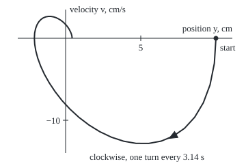

# Complex eigenvalues: rotation plus growth or decay, so the state spirals

Differential equations and dynamics → Systems and the Matrix Exponential → Turning states → Complex eigenvalues

---

## General Overview

A car wheel rides on a spring and a shock absorber. Push it 10 cm from rest and let go. The spring pulls it back at 5 cm/s^2 per cm of displacement; the absorber brakes it at 2 cm/s^2 per cm/s of speed.

The wheel's state is two numbers, position in cm and velocity in cm/s, plotted as a point: position across, velocity up. It starts at (10, 0) and does not slide straight home. It swings clockwise round the origin, one turn every 3.14 s, and each turn shrinks the state to 0.0432 of its size. The path is a spiral.

The eigenvalue method ([the-eigenvalue-method](02-the-eigenvalue-method.md)) looks for directions the matrix only stretches. This matrix has none: its eigenvalues are complex, −1 ± 2i. The real part sets the shrinking, the imaginary part the turning.

**When a real 2-by-2 system has eigenvalues α ± iβ, the real and imaginary parts of one complex solution are two real solutions; every solution turns once each 2π/β seconds while scaling by e^(αt), spiralling in when α is negative, out when α is positive, and closing into a loop when α is 0.**

**What kind of fact this is:** a theorem, proved on this card in Why it works; the damped spring is a model, a linear law that fits a shock absorber over small movements.

### The picture: one turn of the wheel's state

<p align="center"></p>

To scale: 22 px per cm across, 12 px per cm/s up, axes crossing at rest. One turn, t = 0 to 3.1416 s, through 49 equally timed points, ending at (0.43 cm, 0). The triangle marks the direction of travel.

---

## The formula

Reminder: x' = Ax reads "the rate of the state is the matrix A times the state" ([from-one-equation-to-a-system](01-from-one-equation-to-a-system.md)). Here y' = v and v' = −5y − 2v, so $A$ is `[[0, 1], [-5, -2]]`.

Let $A$ be a real 2-by-2 matrix with eigenvalue $\lambda = \alpha + i\beta$, $\beta \neq 0$, and eigenvector $\mathbf{w} = \mathbf{p} + i\mathbf{q}$, where p and q are real vectors. Then

$$\mathbf{x}(t) = c_1\,e^{\alpha t}\big(\mathbf{p}\cos\beta t - \mathbf{q}\sin\beta t\big) + c_2\,e^{\alpha t}\big(\mathbf{p}\sin\beta t + \mathbf{q}\cos\beta t\big)$$

is every solution, with $c_1$, $c_2$ fixed by the start: $\mathbf{x}(0) = c_1\mathbf{p} + c_2\mathbf{q}$.

**Read it aloud:** two fixed arrows, p and q, rotate into each other at β radians per second while everything scales by e to the α t.

$$T = \frac{2\pi}{\beta},\qquad \mathbf{x}(t+T) = e^{\alpha T}\,\mathbf{x}(t).$$

**Read it aloud:** a turn takes 2π over the turning rate, and multiplies the state by e to the α T.

| Symbol | Plain meaning | In our example | Push it up and the answer… |
| --- | --- | --- | --- |
| $t$, $\mathbf{x}$, $y$, $v$ | time in s; state (y, v): position in cm, velocity in cm/s | start (10, 0) | the spiral scales up |
| $A$ | the matrix of the rate law | `[[0, 1], [-5, -2]]` | −5 pushed further below 0 (stiffer spring): faster turning |
| $\lambda$, $i$ | eigenvalue α + iβ, partner α − iβ; i is the square root of −1 | −1 ± 2i | — |
| $\alpha$ | real part: growth rate, one over time | −1 per s | slower shrinking; above 0 the spiral opens out |
| $\beta$ | imaginary part: turning rate, radians per s | 2 per s | faster turning, shorter turn |
| $\mathbf{w}$, $\mathbf{p}$, $\mathbf{q}$ | eigenvector w = p + iq: real part p, imaginary part q | p = (1, −1), q = (0, 2) | — |
| $c_1$, $c_2$ | constants fixed by the start | 10 and 5 | — |
| $T$ | time for one turn, 2π/β | 3.1416 s | — |

### When it holds

- **A has real entries.** Otherwise the real part is no solution: for x' = ix, the real part of e^(it) is cos t, whose rate at t = 1 is −0.8415, while the law asks for 0.5403i.
- **The eigenvalues are not real:** trace^2 < 4 × determinant, the trace being the sum of the diagonal entries. A strong enough absorber breaks this; the eigenvalues turn real and nothing turns.
- **A is constant.** A spring that stiffens with time or stretch loses the fixed turn time; near a resting point a nonlinear system is judged by its linear part, as in [classifying-equilibria-by-trace-and-determinant](05-classifying-equilibria-by-trace-and-determinant.md).

---

## Why it works

### Step 0: a real rule cannot tell a number from its mirror image

The conjugate of a + ib is a − ib, its mirror image across the real axis ([complex-numbers](../../07-Complex%20analysis/01-Complex%20Numbers%20and%20the%20Plane/01-complex-numbers.md)). Conjugating both sides of z' = Az leaves a real A unchanged, so the conjugate of a solution z is a solution too. Half their sum is the real part of z; half their difference, divided by i, is the imaginary part. Both are real solutions. The complex solution is a device for finding them.

### Step 1: one complex solution

The eigenvalues solve λ^2 − (trace)λ + det = 0, det being the determinant. Here λ^2 + 2λ + 5 = 0, with discriminant −16, so λ = −1 ± 2i. It is the characteristic equation of y'' + 2y' + 5y = 0, the same wheel as one second-order equation ([complex-roots-and-damped-oscillation](../03-Oscillators%20-%20Second-Order%20Linear%20Equations/03-complex-roots-and-damped-oscillation.md)).

The first row of A w = λ w reads w₂ = λ w₁; take w₁ = 1, so w = (1, −1 + 2i). Then w e^(λt) solves the system, since its rate is λ w e^(λt) = A w e^(λt).

### Step 2: split it with Euler's formula

Euler's formula gives e^(λt) = e^(αt)(cos βt + i sin βt). Multiply by w = p + iq and sort the terms by whether they carry i:

$$\mathbf{w}e^{\lambda t} = e^{\alpha t}\big(\mathbf{p}\cos\beta t - \mathbf{q}\sin\beta t\big) + i\,e^{\alpha t}\big(\mathbf{p}\sin\beta t + \mathbf{q}\cos\beta t\big).$$

The first bracket is the real part; the second, without its i, the imaginary part.

### Step 3: each part solves the equation

Call the complex solution z. Rates act on real and imaginary parts separately, and because A is real, the real part of Az is A times the real part of z. So taking real parts of z' = Az gives (Re z)' = A (Re z); likewise for the imaginary part.

### Step 4: they fit any start

At t = 0 the brackets are p and q, which point in different directions, so any start is c₁p + c₂q for one pair c₁, c₂. For the wheel, matching (10, 0) gives c₁ = 10, then −10 + 2c₂ = 0, so c₂ = 5. A linear system has one solution per start, so this is the wheel's motion.

<details>
<summary>Detailed proof: p and q are independent, and nothing else solves the system</summary>

Suppose q = kp for a real k. Then w = (1 + ik)p, and dividing A w = λ w by 1 + ik gives A p = λ p with p real and nonzero, so λ is real, contradicting β ≠ 0. The cases p = kq and p = 0 go the same way. So p and q span the plane.

Uniqueness: if x and z solve x' = Ax from one start, d = x − z has d' = Ad, d(0) = 0. With m = |d|^2 and K the largest entry size of A, m' = 2 d · Ad ≤ 4K m, so e^(−4Kt) m never rises; it starts at 0 and is never negative, so d = 0 for t ≥ 0.

</details>

### Step 5: read the spiral off the formula

Every term is e^(αt) times a cosine or sine of βt. After T = 2π/β the cosines and sines repeat, so the state is exactly e^(αT) times what it was: for the wheel, T = 3.1416 s and e^(−π) = 0.0432.

At (10, 0) the rate is A times the state, (0, −50): a point on the right heading straight down, so the turn is clockwise. With complex eigenvalues the off-diagonal entries of A have opposite signs, so a negative lower-left entry always means clockwise.

The same answer comes from the matrix exponential, e^(At) times the start ([the-matrix-exponential](04-the-matrix-exponential.md)), which needs no eigenvector at all.

---

## Worked numbers, by hand

| Step | Arithmetic | Value |
| --- | --- | --- |
| trace, determinant | 0 + (−2); 0 × (−2) − 1 × (−5) | −2, 5 |
| discriminant | (−2)^2 − 4 × 5 | −16 |
| eigenvalues | (−2 ± √−16)/2 | −1 ± 2i |
| eigenvector | w₂ = λ w₁, w₁ = 1 | w = (1, −1 + 2i) |
| fit the start | (10, 0) = c₁(1, −1) + c₂(0, 2) | c₁ = 10, c₂ = 5 |
| position | e^(−t)(10 cos 2t + 5 sin 2t) | cm |
| velocity | e^(−t)(0 cos 2t − 25 sin 2t) | cm/s |
| rate at the start | A × (10, 0) | (0, −50): clockwise |
| one turn | 2π/2 | 3.1416 s |
| shrink per turn | e^(−1 × 3.1416) | 0.0432 |
| position after one turn | 10 × e^(−π) | **0.4321 cm** |

The wheel first passes its rest height at (π − arctan 2)/2 = 1.0172 s; one turn in, 0.43 cm of its 10 cm is left.

### What breaks if you drop a piece

| Mistake | Comes out at | What went wrong |
| --- | --- | --- |
| Turn time from the size of λ, 2π/√5 | 2.81 s, not 3.14 s | Only the imaginary part turns |
| A turn taken as 2π seconds | shrink 0.0019 per turn, not 0.0432 | The angle is βt, not t |
| Real part alone, c₂ dropped | starts at (10, −10), not (10, 0) | One solution cannot fit two starting numbers |
| A complex, x' = ix | cos t has rate −0.8415 at t = 1; the law asks 0.5403i | The real-part step needs a real matrix |

The code prints all four.

---

## Code, from first principles, and it actually runs

Two roads. Road one builds the real solution from the eigenpair. Road two steps along the slope with Euler's rule, new state = old state + step length × rate ([eulers-method](../05-Numerical%20Evolution/01-eulers-method.md)), never calling exp, cos or sin. It lands within 0.001 cm of 0.4321 cm after one turn, its error halves with the step, and its crossings of rest time the turn. A finite difference, change over a tiny interval divided by its length, confirms the closed form obeys the law. The figure's pixels are printed too.

### Python

```python
# Complex eigenvalues and spirals -- the check behind the card.  Standard
# library only.  The shock absorber y' = v, v' = -5y - 2v (y in cm, v in cm/s,
# start y = 10, v = 0) is solved by two roads: the real solutions built from
# w e^(lambda t), and Euler's small steps along the slope, which never call
# exp, cos or sin.  The stepped run's crossings of y = 0 time one turn.
import math

def pair(M):                              # eigenvalues alpha +/- i beta of a 2x2
    tr, det = M[0][0] + M[1][1], M[0][0] * M[1][1] - M[0][1] * M[1][0]
    return tr / 2, math.sqrt(4 * det - tr * tr) / 2, tr, det

A = ((0.0, 1.0), (-5.0, -2.0))
al, be, tr, det = pair(A)
p, q = (1.0, (al - A[0][0]) / A[0][1]), (0.0, be / A[0][1])  # w = p + i q, from row 1
c1, c2 = 10.0, -10.0 * p[1] / q[1]       # start (10, 0) = c1 p + c2 q, as p = (1, .), q = (0, .)

def closed(t):                            # c1 Re(w e^(lambda t)) + c2 Im(w e^(lambda t))
    e, c, s = math.exp(al * t), math.cos(be * t), math.sin(be * t)
    return [e * (c1 * (p[i] * c - q[i] * s) + c2 * (p[i] * s + q[i] * c)) for i in (0, 1)]

def euler(t_end, n):                      # n steps: new state = old + h x (A times state)
    y, v, t, down, h = 10.0, 0.0, 0.0, [], t_end / n
    for _ in range(n):
        ny, nv = y + h * (A[0][0] * y + A[0][1] * v), v + h * (A[1][0] * y + A[1][1] * v)
        if y > 0 >= ny: down.append(t + h * y / (y - ny))   # passing rest, moving down
        y, v, t = ny, nv, t + h
    return (y, v), down
T = 2 * math.pi / be
errs = [math.dist(euler(T, n)[0], closed(T)) for n in (300, 600, 1200)]
fine, down = euler(T, 30000)[0], euler(5.0, 50000)[1]
fd = [(a - b) / 2e-6 for a, b in zip(closed(1.0 + 1e-6), closed(1.0 - 1e-6))]
law = [A[i][0] * closed(1.0)[0] + A[i][1] * closed(1.0)[1] for i in (0, 1)]
px = lambda s: (96 + 22 * s[0], 56 - 12 * s[1])        # 22 px per cm, 12 px per cm/s
pts = [px(closed(k * T / 48)) for k in range(49)]
d = [pts[7][i] - pts[5][i] for i in (0, 1)]
d = [x / math.hypot(*d) for x in d]           # direction of travel at pts[6], unit length
arrow = [(pts[6][0] + 7 * d[0], pts[6][1] + 7 * d[1])] + [(pts[6][0] - 5 * d[0] + 5 * k * d[1], pts[6][1] - 5 * d[1] - 5 * k * d[0]) for k in (1, -1)]
print(f"A: trace {tr:.0f}, det {det:.0f}, discriminant {tr * tr - 4 * det:.0f}; eigenvalues {al:.0f} +/- {be:.0f}i")
print(f"eigenvector w = p + i q: p = ({p[0]:.0f}, {p[1]:.0f}), q = ({q[0]:.0f}, {q[1]:.0f}); start (10, 0) = {c1:.0f} p + {c2:.0f} q")
print(f"coefficients of cos 2t, sin 2t times e^(-t): y {c1 * p[0] + c2 * q[0]:.0f}, {c2 * p[0] - c1 * q[0]:.0f} cm; v {c1 * p[1] + c2 * q[1]:.0f}, {c2 * p[1] - c1 * q[1]:.0f} cm/s")
print(f"rate at start: y' = {A[0][0] * 10:.0f} cm/s, v' = {A[1][0] * 10:.0f} cm/s^2, so the state turns clockwise")
print(f"one turn T = 2 pi / {be:.0f} = {T:.4f} s; shrink per turn e^(alpha T) = {math.exp(al * T):.4f}")
print(f"y(T): closed form {closed(T)[0]:.4f} cm; Euler, 30000 steps: {fine[0]:.4f} cm, ratio to start {fine[0] / 10:.4f}")
print(f"Euler error at T, 300, 600, 1200 steps: {errs[0]:.4f} {errs[1]:.4f} {errs[2]:.4f}; ratios {errs[0] / errs[1]:.3f} {errs[1] / errs[2]:.3f}")
print(f"first pass through rest: closed form (pi - atan 2) / 2 = {(math.pi - math.atan(2)) / 2:.4f} s; Euler {down[0]:.4f} s")
print(f"one turn timed from the Euler run: {down[1]:.4f} - {down[0]:.4f} = {down[1] - down[0]:.4f} s")
print(f"law at t = 1: finite difference ({fd[0]:.6f}, {fd[1]:.6f}); A x = ({law[0]:.6f}, {law[1]:.6f})")
a2, b2, _, _ = pair(((0.0, 1.0), (-5.0, 2.0)))
print(f"second case, damping -2: eigenvalues {a2:.0f} +/- {b2:.0f}i; grows by e^(alpha T) = {math.exp(a2 * 2 * math.pi / b2):.2f} per turn")
print(f"mistake, T = 2 pi / |lambda| = 2 pi / sqrt 5 = {2 * math.pi / math.sqrt(al * al + be * be):.2f} s, not {T:.2f} s")
print(f"mistake, a turn taken as 2 pi s: shrink e^(-2 pi) = {math.exp(-2 * math.pi):.4f}, not {math.exp(al * T):.4f}")
print(f"mistake, real part alone: starts at ({c1 * p[0]:.0f}, {c1 * p[1]:.0f}), not (10, 0)")
print(f"hypothesis dropped, complex x' = i x: Re e^(it) = cos t has rate {-math.sin(1):.4f} at t = 1; the law asks {math.cos(1):.4f}i")
print("figure, spiral px:", " ".join(f"{a:.1f},{b:.1f}" for a, b in pts))
print("figure, arrow px:", " ".join(f"{a:.1f},{b:.1f}" for a, b in arrow))
assert abs(fine[0] - closed(T)[0]) < 1e-3 and abs(fine[1] - closed(T)[1]) < 1e-3   # road two meets road one
assert all(1.9 < r < 2.1 for r in (errs[0] / errs[1], errs[1] / errs[2]))         # Euler is order one
assert abs((down[1] - down[0]) - T) < 1e-3                                        # turn timed = 2 pi / beta
assert max(abs(a - b) for a, b in zip(fd, law)) < 1e-6                             # the answer obeys the law
print("ALL CHECKS PASS")
```

**Ran 2026-09-28 on macOS, Python 3.14.6, standard library only. All checks passed. Output, pasted from the run:**

```
A: trace -2, det 5, discriminant -16; eigenvalues -1 +/- 2i
eigenvector w = p + i q: p = (1, -1), q = (0, 2); start (10, 0) = 10 p + 5 q
coefficients of cos 2t, sin 2t times e^(-t): y 10, 5 cm; v 0, -25 cm/s
rate at start: y' = 0 cm/s, v' = -50 cm/s^2, so the state turns clockwise
one turn T = 2 pi / 2 = 3.1416 s; shrink per turn e^(alpha T) = 0.0432
y(T): closed form 0.4321 cm; Euler, 30000 steps: 0.4325 cm, ratio to start 0.0432
Euler error at T, 300, 600, 1200 steps: 0.0828 0.0406 0.0201; ratios 2.042 2.021
first pass through rest: closed form (pi - atan 2) / 2 = 1.0172 s; Euler 1.0171 s
one turn timed from the Euler run: 4.1584 - 1.0171 = 3.1413 s
law at t = 1: finite difference (-8.362796, 16.017389); A x = (-8.362796, 16.017389)
second case, damping -2: eigenvalues 1 +/- 2i; grows by e^(alpha T) = 23.14 per turn
mistake, T = 2 pi / |lambda| = 2 pi / sqrt 5 = 2.81 s, not 3.14 s
mistake, a turn taken as 2 pi s: shrink e^(-2 pi) = 0.0019, not 0.0432
mistake, real part alone: starts at (10, -10), not (10, 0)
hypothesis dropped, complex x' = i x: Re e^(it) = cos t has rate -0.8415 at t = 1; the law asks 0.5403i
figure, spiral px: 316.0,56.0 313.7,92.7 307.4,124.1 297.6,150.3 285.0,171.4 270.1,187.7 253.6,199.2 235.9,206.5 217.6,209.9 199.1,209.8 180.8,206.6 163.1,200.8 146.2,192.8 130.3,183.0 115.7,171.9 102.5,159.8 90.8,147.2 80.7,134.2 72.1,121.3 65.0,108.7 59.4,96.5 55.2,85.0 52.4,74.4 50.8,64.7 50.3,56.0 50.7,48.4 52.1,41.8 54.1,36.4 56.7,32.0 59.8,28.6 63.2,26.2 66.9,24.7 70.7,24.0 74.6,24.0 78.4,24.7 82.1,25.9 85.6,27.6 88.9,29.6 91.9,31.9 94.6,34.4 97.1,37.0 99.2,39.7 101.0,42.4 102.4,45.1 103.6,47.6 104.5,50.0 105.1,52.2 105.4,54.2 105.5,56.0
figure, arrow px: 247.4,202.6 260.4,201.2 255.5,192.4
ALL CHECKS PASS
```

### Rust

Same numbers, same labels, built with `rustc --edition 2021 -O`.

```rust
// Complex eigenvalues and spirals -- the same check as the Python, in Rust.
// No crates.  The shock absorber y' = v, v' = -5y - 2v (y in cm, v in cm/s,
// start y = 10, v = 0) is solved by two roads: the real solutions built from
// w e^(lambda t), and Euler's small steps along the slope, which never call
// exp, cos or sin.  The stepped run's crossings of y = 0 time one turn.
use std::f64::consts::PI;
type M2 = [[f64; 2]; 2];

fn pair(m: &M2) -> (f64, f64, f64, f64) {   // eigenvalues alpha +/- i beta of a 2x2
    let (tr, det) = (m[0][0] + m[1][1], m[0][0] * m[1][1] - m[0][1] * m[1][0]);
    (tr / 2.0, (4.0 * det - tr * tr).sqrt() / 2.0, tr, det)
}

struct Sys { a: M2, al: f64, be: f64, p: [f64; 2], q: [f64; 2], c1: f64, c2: f64 }

impl Sys {
    fn closed(&self, t: f64) -> [f64; 2] {  // c1 Re(w e^(lambda t)) + c2 Im(w e^(lambda t))
        let (e, c, s) = ((self.al * t).exp(), (self.be * t).cos(), (self.be * t).sin());
        let f = |i: usize| e * (self.c1 * (self.p[i] * c - self.q[i] * s) + self.c2 * (self.p[i] * s + self.q[i] * c));
        [f(0), f(1)]
    }
    fn euler(&self, t_end: f64, n: usize) -> ([f64; 2], Vec<f64>) {  // new = old + h x (A state)
        let (mut y, mut v, mut t, mut down, h, a) = (10.0, 0.0, 0.0, Vec::new(), t_end / n as f64, self.a);
        for _ in 0..n {
            let (ny, nv) = (y + h * (a[0][0] * y + a[0][1] * v), v + h * (a[1][0] * y + a[1][1] * v));
            if y > 0.0 && 0.0 >= ny { down.push(t + h * y / (y - ny)) }  // passing rest, moving down
            y = ny; v = nv; t += h;
        }
        ([y, v], down)
    }
}

fn pts(v: &[(f64, f64)]) -> String {
    v.iter().map(|(a, b)| format!("{:.1},{:.1}", a, b)).collect::<Vec<_>>().join(" ")
}

fn main() {
    let a: M2 = [[0.0, 1.0], [-5.0, -2.0]];
    let (al, be, tr, det) = pair(&a);
    let (p, q) = ([1.0, (al - a[0][0]) / a[0][1]], [0.0, be / a[0][1]]);  // w = p + i q, from row 1
    let s = Sys { a, al, be, p, q, c1: 10.0, c2: -10.0 * p[1] / q[1] };   // start (10, 0) = c1 p + c2 q
    let tt = 2.0 * PI / be;
    let xt = s.closed(tt);
    let errs: Vec<f64> = [300, 600, 1200].iter().map(|&n| { let e = s.euler(tt, n).0; (e[0] - xt[0]).hypot(e[1] - xt[1]) }).collect();
    let (fine, down) = (s.euler(tt, 30000).0, s.euler(5.0, 50000).1);
    let (up, dn, x1) = (s.closed(1.0 + 1e-6), s.closed(1.0 - 1e-6), s.closed(1.0));
    let fd = [(up[0] - dn[0]) / 2e-6, (up[1] - dn[1]) / 2e-6];
    let law = [a[0][0] * x1[0] + a[0][1] * x1[1], a[1][0] * x1[0] + a[1][1] * x1[1]];
    let px = |x: [f64; 2]| (96.0 + 22.0 * x[0], 56.0 - 12.0 * x[1]);   // 22 px per cm, 12 px per cm/s
    let sp: Vec<(f64, f64)> = (0..49).map(|k| px(s.closed(k as f64 * tt / 48.0))).collect();
    let (dx, dy) = (sp[7].0 - sp[5].0, sp[7].1 - sp[5].1);
    let (dx, dy, (cx, cy)) = (dx / dx.hypot(dy), dy / dx.hypot(dy), sp[6]);  // unit direction of travel
    let arrow = vec![(cx + 7.0 * dx, cy + 7.0 * dy), (cx - 5.0 * dx + 5.0 * dy, cy - 5.0 * dy - 5.0 * dx), (cx - 5.0 * dx - 5.0 * dy, cy - 5.0 * dy + 5.0 * dx)];
    println!("A: trace {:.0}, det {:.0}, discriminant {:.0}; eigenvalues {:.0} +/- {:.0}i", tr, det, tr * tr - 4.0 * det, al, be);
    println!("eigenvector w = p + i q: p = ({:.0}, {:.0}), q = ({:.0}, {:.0}); start (10, 0) = {:.0} p + {:.0} q", p[0], p[1], q[0], q[1], s.c1, s.c2);
    println!("coefficients of cos 2t, sin 2t times e^(-t): y {:.0}, {:.0} cm; v {:.0}, {:.0} cm/s", s.c1 * p[0] + s.c2 * q[0], s.c2 * p[0] - s.c1 * q[0], s.c1 * p[1] + s.c2 * q[1], s.c2 * p[1] - s.c1 * q[1]);
    println!("rate at start: y' = {:.0} cm/s, v' = {:.0} cm/s^2, so the state turns clockwise", a[0][0] * 10.0, a[1][0] * 10.0);
    println!("one turn T = 2 pi / {:.0} = {:.4} s; shrink per turn e^(alpha T) = {:.4}", be, tt, (al * tt).exp());
    println!("y(T): closed form {:.4} cm; Euler, 30000 steps: {:.4} cm, ratio to start {:.4}", xt[0], fine[0], fine[0] / 10.0);
    println!("Euler error at T, 300, 600, 1200 steps: {:.4} {:.4} {:.4}; ratios {:.3} {:.3}", errs[0], errs[1], errs[2], errs[0] / errs[1], errs[1] / errs[2]);
    println!("first pass through rest: closed form (pi - atan 2) / 2 = {:.4} s; Euler {:.4} s", (PI - 2f64.atan()) / 2.0, down[0]);
    println!("one turn timed from the Euler run: {:.4} - {:.4} = {:.4} s", down[1], down[0], down[1] - down[0]);
    println!("law at t = 1: finite difference ({:.6}, {:.6}); A x = ({:.6}, {:.6})", fd[0], fd[1], law[0], law[1]);
    let (a2, b2, _, _) = pair(&[[0.0, 1.0], [-5.0, 2.0]]);
    println!("second case, damping -2: eigenvalues {:.0} +/- {:.0}i; grows by e^(alpha T) = {:.2} per turn", a2, b2, (a2 * 2.0 * PI / b2).exp());
    println!("mistake, T = 2 pi / |lambda| = 2 pi / sqrt 5 = {:.2} s, not {:.2} s", 2.0 * PI / (al * al + be * be).sqrt(), tt);
    println!("mistake, a turn taken as 2 pi s: shrink e^(-2 pi) = {:.4}, not {:.4}", (-2.0 * PI).exp(), (al * tt).exp());
    println!("mistake, real part alone: starts at ({:.0}, {:.0}), not (10, 0)", s.c1 * p[0], s.c1 * p[1]);
    println!("hypothesis dropped, complex x' = i x: Re e^(it) = cos t has rate {:.4} at t = 1; the law asks {:.4}i", -1f64.sin(), 1f64.cos());
    println!("figure, spiral px: {}", pts(&sp));
    println!("figure, arrow px: {}", pts(&arrow));
    assert!((fine[0] - xt[0]).abs() < 1e-3 && (fine[1] - xt[1]).abs() < 1e-3);   // road two meets road one
    assert!([errs[0] / errs[1], errs[1] / errs[2]].iter().all(|&r| r > 1.9 && r < 2.1));  // order one
    assert!(((down[1] - down[0]) - tt).abs() < 1e-3);                            // turn timed = 2 pi / beta
    assert!((fd[0] - law[0]).abs().max((fd[1] - law[1]).abs()) < 1e-6);          // the answer obeys the law
    println!("ALL CHECKS PASS");
}
```

**Ran 2026-09-28 on macOS, rustc 1.98.1, no crates. All checks passed. Output, pasted from the run:**

```
A: trace -2, det 5, discriminant -16; eigenvalues -1 +/- 2i
eigenvector w = p + i q: p = (1, -1), q = (0, 2); start (10, 0) = 10 p + 5 q
coefficients of cos 2t, sin 2t times e^(-t): y 10, 5 cm; v 0, -25 cm/s
rate at start: y' = 0 cm/s, v' = -50 cm/s^2, so the state turns clockwise
one turn T = 2 pi / 2 = 3.1416 s; shrink per turn e^(alpha T) = 0.0432
y(T): closed form 0.4321 cm; Euler, 30000 steps: 0.4325 cm, ratio to start 0.0432
Euler error at T, 300, 600, 1200 steps: 0.0828 0.0406 0.0201; ratios 2.042 2.021
first pass through rest: closed form (pi - atan 2) / 2 = 1.0172 s; Euler 1.0171 s
one turn timed from the Euler run: 4.1584 - 1.0171 = 3.1413 s
law at t = 1: finite difference (-8.362796, 16.017389); A x = (-8.362796, 16.017389)
second case, damping -2: eigenvalues 1 +/- 2i; grows by e^(alpha T) = 23.14 per turn
mistake, T = 2 pi / |lambda| = 2 pi / sqrt 5 = 2.81 s, not 3.14 s
mistake, a turn taken as 2 pi s: shrink e^(-2 pi) = 0.0019, not 0.0432
mistake, real part alone: starts at (10, -10), not (10, 0)
hypothesis dropped, complex x' = i x: Re e^(it) = cos t has rate -0.8415 at t = 1; the law asks 0.5403i
figure, spiral px: 316.0,56.0 313.7,92.7 307.4,124.1 297.6,150.3 285.0,171.4 270.1,187.7 253.6,199.2 235.9,206.5 217.6,209.9 199.1,209.8 180.8,206.6 163.1,200.8 146.2,192.8 130.3,183.0 115.7,171.9 102.5,159.8 90.8,147.2 80.7,134.2 72.1,121.3 65.0,108.7 59.4,96.5 55.2,85.0 52.4,74.4 50.8,64.7 50.3,56.0 50.7,48.4 52.1,41.8 54.1,36.4 56.7,32.0 59.8,28.6 63.2,26.2 66.9,24.7 70.7,24.0 74.6,24.0 78.4,24.7 82.1,25.9 85.6,27.6 88.9,29.6 91.9,31.9 94.6,34.4 97.1,37.0 99.2,39.7 101.0,42.4 102.4,45.1 103.6,47.6 104.5,50.0 105.1,52.2 105.4,54.2 105.5,56.0
figure, arrow px: 247.4,202.6 260.4,201.2 255.5,192.4
ALL CHECKS PASS
```

The two outputs match line for line.

> [!TIP]
> **Try changing**
> Guess first, then run it.
> - **Negative damping.** In the line that sets `A`, change `-2.0` to `2.0`. Eigenvalues 1 ± 2i: after one turn the wheel is at 231.4069 cm. The first assert stops the run; 30,000 Euler steps now miss by more than 0.001 cm.
> - **Twice as many steps.** Change `(300, 600, 1200)` to `(600, 1200, 2400)`. The errors become 0.0406, 0.0201 and 0.0100: still halving, as a first-order method should.
> - **A stiffer spring.** In the same line, change `-5.0` to `-17.0`. Eigenvalues −1 ± 4i, so a turn takes 1.5708 s; Euler times it at 1.5706 s. The first assert stops the run: faster turning needs finer steps.

---

## The usual mistake

> [!warning]
> **Reading the turn time from the whole eigenvalue.** The size of −1 + 2i is √5, and 2π/√5 = 2.81 s is the spring's swing without the absorber. Only the imaginary part, 2, turns: one turn every 3.14 s.
>
> - **Assuming a circle.** p and q are neither at right angles nor of equal length, so each lap is a tilted, squashed loop. Only the factor per full turn is exact.

---

## Where you meet it in real life

- **Car suspension.** The absorber is tuned so the ride settles within about one turn.
- **Electrical circuits.** A coil, a capacitor and a resistor in a loop spiral the same way; a radio tunes to the turning rate.
- **Populations near balance.** Predators and prey near a steady mix often circle it; the linear part's eigenvalues say whether the swings die out, as sorted in [classifying-equilibria-by-trace-and-determinant](05-classifying-equilibria-by-trace-and-determinant.md).
- **Buildings in wind.** Each complex pair of a swaying tower is one decaying sway, a mode of [coupled-oscillators-and-normal-modes](07-coupled-oscillators-and-normal-modes.md).

> **Say it back**
> A real 2-by-2 system with a negative discriminant has eigenvalues α ± iβ. Euler's formula splits the complex solution w e^(λt) into real and imaginary parts, each a real solution because the matrix is real, and their mix fits any start. Each turn takes 2π/β and multiplies the state by e^(αT). The shock absorber turns clockwise every 3.14 s and keeps 0.0432 of its state per turn.

---

## What this builds on

- [the-eigenvalue-method](02-the-eigenvalue-method.md): why w e^(λt) solves x' = Ax, used here with a complex λ.
- [complex-roots-and-damped-oscillation](../03-Oscillators%20-%20Second-Order%20Linear%20Equations/03-complex-roots-and-damped-oscillation.md): the same wheel as one second-order equation, with the same quadratic.
- [complex-numbers](../../07-Complex%20analysis/01-Complex%20Numbers%20and%20the%20Plane/01-complex-numbers.md): real and imaginary parts, the conjugate, and Euler's formula.

## Where this goes next

- [classifying-equilibria-by-trace-and-determinant](05-classifying-equilibria-by-trace-and-determinant.md): spirals, centres, nodes and saddles sorted from the trace and determinant alone.

---

## Sources

Verified 2026-09-28: every link below resolves to the publisher's page.

- Dawkins, Paul. "Complex Eigenvalues." *Paul's Online Notes: Differential Equations*, Lamar University. [Page](https://tutorial.math.lamar.edu/Classes/DE/ComplexEigenvalues.aspx). Worked systems and the turning direction.
- Boyce, William E., Richard C. DiPrima and Douglas B. Meade. *Elementary Differential Equations*, 12th ed. Wiley, 2021. [Publisher page](https://www.wiley.com/en-us/Elementary+Differential+Equations%2C+12th+Edition-p-9781119777755). Chapter 7: complex eigenvalues and spiral points.
- Strogatz, Steven H. *Nonlinear Dynamics and Chaos*, 3rd ed. CRC Press, 2024. [Publisher page](https://www.routledge.com/Nonlinear-Dynamics-and-Chaos-With-Applications-to-Physics-Biology-Chemistry-and-Engineering/Strogatz/p/book/9780367026509). Chapter 5: linear systems in the plane.
- Teschl, Gerald. *Ordinary Differential Equations and Dynamical Systems*. AMS Graduate Studies in Mathematics 140, 2012. [Author's page, with a free PDF for personal use](https://mat.univie.ac.at/~gerald/ftp/book-ode/). Chapter 3: real forms of complex eigenvalues, proved.
