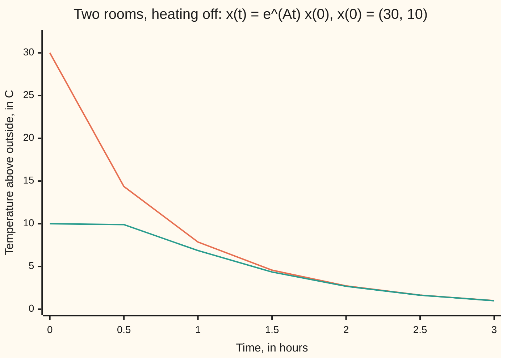
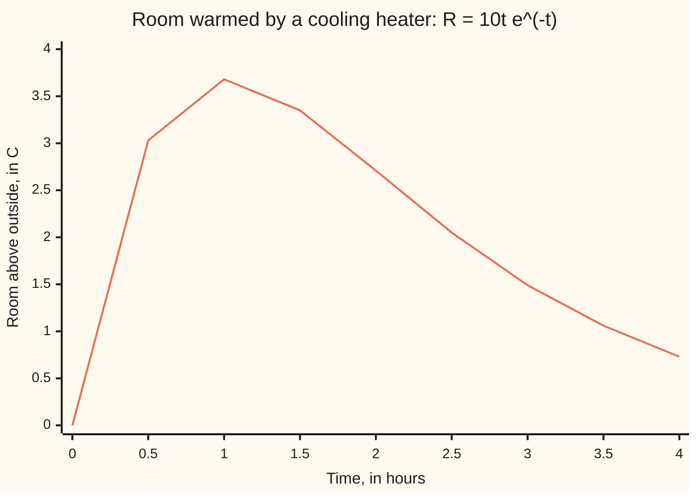

# The matrix exponential: e^(At) moves any starting state forward, even when eigenvectors run out

[Syllabus](../../../SYLLABUS.md) → [Differential equations and dynamics](../../../SYLLABUS.md#w08) → [Systems and the Matrix Exponential](../../../SYLLABUS.md#w08-s04) → The matrix exponential

---

## General Overview

Two rooms share a wall. The heating is off. Room 1 starts 30 °C above the outdoor temperature, room 2 starts 10 °C above it. Each room leaks heat outdoors, and heat also crosses the wall from the warmer room to the cooler one. How warm is each room an hour later?

One cooling cup obeys y' = cy, with c a rate per hour, solved by y = e^(ct) y(0). Two rooms feeding each other need a matrix in place of the number c: a grid that turns one list into another by multiplying and adding. The recipe is the exponential's power series, fed a matrix. For the rooms it gives 7.86 °C and 6.86 °C above outside after one hour.

**The matrix exponential e^(At) is the power series of e^x with the matrix At put in place of x; multiplying the starting state by it gives the state at time t, for every square matrix A.**

**What kind of fact this is:** a definition; the theorems that it converges, solves the system, and obeys e^(A(s+t)) = e^(As) e^(At) are proved on this card in Why it works.

### The picture: the two rooms cooling



Orange: room 1. Teal: room 2. Room 2 first warms: at the start its rate is 30 − 2 × 10 = +10 °C per hour, because room 1 feeds it through the wall faster than it leaks.

---

## The formula

Reminder: x' = Ax reads "the rate of the state x is the matrix A times the state" ([From one equation to a system](01-from-one-equation-to-a-system.md)). For the rooms, with rates per hour:

$$T_1' = -2T_1 + T_2, \qquad T_2' = T_1 - 2T_2, \qquad A = \begin{pmatrix} -2 & 1 \\ 1 & -2 \end{pmatrix}$$

The −2 is two leaks at 1 per hour, outdoors and through the wall; the 1 is heat arriving from the other room.

New notation, in words first: e^(At), written $e^{At}$ and read "e to the A t", is the matrix the series below builds, not e of each entry.

$$e^{At} = I + At + \frac{(At)^2}{2!} + \frac{(At)^3}{3!} + \cdots, \qquad x(t) = e^{At}\,x_0$$

**Read it aloud:** add the identity, A times t, A squared times t squared over two, and so on; the sum times the start is the state at time t.

For the rooms the sum has a closed form (Why it works, Step 2):

$$e^{At} = \tfrac12\begin{pmatrix} e^{-t} + e^{-3t} & e^{-t} - e^{-3t} \\ e^{-t} - e^{-3t} & e^{-t} + e^{-3t} \end{pmatrix}$$

| Symbol | Plain meaning | In our example | Push it up and the answer… |
| --- | --- | --- | --- |
| $x$, $x_0$ | the state: both temperatures above outside, in °C; $x_0$ at the start | $x_0$ = (30, 10) | the answer scales in proportion |
| $A$ | the rate matrix, entries per hour | diagonal −2, off-diagonal 1 | faster cooling |
| $t$, $s$ | times since the heating went off, in hours | $t$ = 1 h | rooms nearer outside |
| $e^{At}$ | the matrix that carries a start to time $t$ | entries 0.208833 and 0.159046 at 1 h | — |
| $I$ | the identity matrix, which changes nothing | `[[1, 0], [0, 1]]` | — |
| $k$ | the term number in the series, with $k!$ = 1 × 2 × … × $k$ | 0 to 59 in the code | more terms, a closer sum |
| $\lambda$ | an eigenvalue: a pattern's own shrink rate | −1 and −3 per hour | — |
| $J$, $N$ | the heater system's matrix, and its part N = J + I | `[[-1, 1], [0, -1]]`, `[[0, 1], [0, 0]]` | — |

### When it holds

- **Any square matrix.** The series converges for every A and t (proof below); no eigenvectors needed.
- **A fixed in time.** With rates that drift, exponentiating the accumulated rate matrix fails in general, since A at one time need not commute with A at another.
- **e^(A+B) = e^A e^B only when AB = BA.** A = −2I + P + Q splits the wall into one-way flows P = `[[0, 1], [0, 0]]` and Q = `[[0, 0], [1, 0]]`; since PQ ≠ QP, e^(−2) e^P e^Q puts room 1 at 9.47 °C after an hour, not 7.86.
- **The eigenvector shortcut needs a full set.** Without one, the series still works and a factor t appears (Step 3).

---

## Why it works

### Step 0: the series needs only multiplying and adding

For one room, e^(ct) has rate c times itself, and its power series, 1 + ct + (ct)^2/2! + …, uses only multiplying and adding ([Taylor series](../../06-Calculus%20and%20analysis/06-Series/05-taylor-series.md)). Matrices can be multiplied and added ([Matrix multiplication](../../03-Algebra/04-Matrices/03-matrix-multiplication.md)), so the same series makes sense with At in place of ct.

### Step 1: the series solves x' = Ax

Term by term, A^k t^k/k! has rate A^k t^(k−1)/(k−1)!: A times the previous term. So the rate of e^(At) is A e^(At), and x(t) = e^(At) x0 has rate A x(t). At t = 0 only I survives, so x(0) = x0.

### Step 2: when A has enough eigenvectors, the series sums to exponentials

An eigenvector is a direction the matrix only stretches, by its eigenvalue λ ([The eigenvalue method](02-the-eigenvalue-method.md)). For the rooms, (1, 1), rooms equal, shrinks at λ = −1 per hour; (1, −1), rooms opposite, at λ = −3. Along an eigenvector v, A^k v = λ^k v, so the series acts as a number and sums to e^(λt) v.

Split the start: (30, 10) = 20(1, 1) + 10(1, −1), so x(t) = 20e^(−t)(1, 1) + 10e^(−3t)(1, −1). The starts (1, 0) and (0, 1) give the closed form's two columns. A matrix whose columns are solutions from independent starts is a fundamental matrix; e^(At), the one equal to I at t = 0, is also called the state-transition matrix. In matrix language, A = V D V^(−1), eigenvectors as the columns of V, eigenvalues on the diagonal of D, and e^(At) = V e^(Dt) V^(−1).

### Step 3: when eigenvectors run out, the series still sums

A storage heater 10 °C above outside warms a room starting at outdoor temperature. The heater loses its excess at 1 per hour, all into the room; the room leaks at 1 per hour and passes nothing back. With x = (room, heater):

$$R' = -R + H, \qquad H' = -H, \qquad J = \begin{pmatrix} -1 & 1 \\ 0 & -1 \end{pmatrix}$$

The eigenvalue −1 is repeated with one eigenvector, (1, 0), so Step 2 cannot split the start (0, 10).

The series still sums. Write J = −I + N with N = `[[0, 1], [0, 0]]`. N times N is zero and −I commutes with everything, so the binomial expansion keeps two terms: J^k = (−1)^k I + k(−1)^(k−1) N. The diagonal sums to e^(−t); the top-right corner gives

$$\sum_{k\ge1} \frac{k(-1)^{k-1}t^k}{k!} = t\sum_{k\ge1}\frac{(-t)^{k-1}}{(k-1)!} = t\,e^{-t}, \qquad e^{Jt} = e^{-t}\begin{pmatrix} 1 & t \\ 0 & 1 \end{pmatrix}$$

The factor t marks the missing eigenvector. Its stand-in, (0, 1), is a generalised eigenvector: N sends it to the true eigenvector (1, 0). The room follows R = 10te^(−t): up to 3.68 °C above outside at 1 h, then down.



Orange: the room. Any 2 by 2 matrix with one eigenvector for a repeated eigenvalue λ becomes λI + N in suitable coordinates: the 2 by 2 Jordan form.

### Step 4: running forward s hours, then t more, is running s + t

Half an hour of cooling, then an hour, must match an hour and a half: e^(A(s+t)) = e^(As) e^(At). The check's product has entries 0.117120 and 0.106011, the closed form's at 1.5 h. With s = −t, e^(−At) undoes e^(At).

<details>
<summary>Detailed proof: convergence, the rate, uniqueness, and the product rule</summary>

**Convergence.** Let ‖M‖ be the largest row total of the entries' sizes. No entry exceeds ‖M‖, and ‖MN‖ ≤ ‖M‖ ‖N‖, so ‖(At)^k/k!‖ ≤ (‖A‖t)^k/k!. These bounds sum to the finite e^(‖A‖t), so every entry converges absolutely for every t.

**The rate.** Each entry is a power series in t with infinite radius, so it may be differentiated term by term ([Taylor series](../../06-Calculus%20and%20analysis/06-Series/05-taylor-series.md)): the rate is Σ A^k t^(k−1)/(k−1)! = A e^(At) = e^(At) A.

**The product rule.** For commuting B and C, (B + C)^m expands by the binomial theorem. Absolutely convergent series may be multiplied and regrouped, so e^B e^C = Σ (B + C)^m/m! = e^(B+C). Take B = As, C = At; then s = −t gives e^(−At) e^(At) = I.

**Uniqueness.** If y' = Ay and y(0) = x0, set z = e^(−At) y. Then z' = −A e^(−At) y + e^(−At) A y = 0, so z stays at x0 and y = e^(At) x0.

</details>

A third road needs no series: step forward with new state = old state + step length × rate (Euler's rule, [Euler's method](../05-Numerical%20Evolution/01-eulers-method.md)). Its error halves as the step halves.

---

## Worked numbers, by hand

| Step | Arithmetic | Value |
| --- | --- | --- |
| eigenvalues of A | (−2 − λ)^2 − 1 = 0 | −1 and −3 per hour |
| split the start | (30, 10) = 20(1, 1) + 10(1, −1) | weights 20 and 10 |
| diagonal entry at 1 h | (e^(−1) + e^(−3))/2 | 0.208833 |
| off-diagonal entry at 1 h | (e^(−1) − e^(−3))/2 | 0.159046 |
| room 1 at 1 h | 30 × 0.208833 + 10 × 0.159046 | **7.8555 °C** |
| room 2 at 1 h | 30 × 0.159046 + 10 × 0.208833 | **6.8597 °C** |

After an hour the rooms are 7.86 °C and 6.86 °C above outside; their 20 °C gap is under 1 °C, because the "rooms opposite" pattern dies three times as fast.

### What breaks if you drop a piece

| Mistake | Comes out at | What went wrong |
| --- | --- | --- |
| e to each entry of At | room 1 at 31.24 °C after 1 h | the series uses matrix products, not entrywise e |
| e^(−2) e^P e^Q in place of e^(A·1) | 9.47 °C, not 7.86 | P and Q do not commute, so e^(P+Q) ≠ e^P e^Q |
| heater start times e^(−t) | room stays at 0.00 °C, not 3.68 | J is not −I; the missing eigenvector brings t |
| series cut after three terms at 3 h | 375.00 °C, not 0.9970 | at large t the dropped terms are huge |

The code prints all four.

---

## Code, from first principles, and it actually runs

Three roads to e^(At): the series to sixty terms, the eigenvector closed form, and Euler steps of h hours. The heater's series is checked against e^(−t) `[[1, t], [0, 1]]` at nine times; e^(0.5A) e^(1A) against the closed form at 1.5 h.

### Python

```python
# The matrix exponential -- the check behind the card.  Standard library only.
# Two rooms share a wall, heating off: T' = A T, T(0) = (30, 10) C above outside.
# Roads: the power series summed term by term, the eigenvector formula, Euler steps.
# Second case: a heater warming a room, J = [[-1, 1], [0, -1]], one eigenvector.
import math

A, J, T0, R0 = [[-2.0, 1.0], [1.0, -2.0]], [[-1.0, 1.0], [0.0, -1.0]], [30.0, 10.0], [0.0, 10.0]
P, Q = [[0.0, 1.0], [0.0, 0.0]], [[0.0, 0.0], [1.0, 0.0]]   # the wall's two one-way flows

def mul(X, Y):
    return [[X[i][0] * Y[0][j] + X[i][1] * Y[1][j] for j in range(2)] for i in range(2)]

def expm(M, t, terms=60):                     # I + Mt + (Mt)^2/2! + ... term by term
    S, term = [[1.0, 0.0], [0.0, 1.0]], [[1.0, 0.0], [0.0, 1.0]]
    for k in range(1, terms):
        term = [[v * t / k for v in row] for row in mul(term, M)]   # (Mt)^k / k!
        S = [[S[i][j] + term[i][j] for j in range(2)] for i in range(2)]
    return S

def eig_form(t):                              # 0.5 [[e^-t + e^-3t, e^-t - e^-3t], ...]
    p, m = (math.exp(-t) + math.exp(-3 * t)) / 2, (math.exp(-t) - math.exp(-3 * t)) / 2
    return [[p, m], [m, p]]

def euler(M, v, t_end, h):                    # new state = old state + h x rate
    for _ in range(round(t_end / h)):
        d = app(M, v)
        v = [v[0] + h * d[0], v[1] + h * d[1]]
    return v

app = lambda M, v: [M[0][0] * v[0] + M[0][1] * v[1], M[1][0] * v[0] + M[1][1] * v[1]]
gap = lambda X, Y: max(abs(X[i][j] - Y[i][j]) for i in range(2) for j in range(2))
yn = lambda c: "yes" if c else "no"
fm = lambda X: "[[" + "], [".join(", ".join(f"{v:.6f}" for v in r) for r in X) + "]]"
E1, times = expm(A, 1.0), [0.5 * k for k in range(7)]
semi, err = mul(expm(A, 0.5), expm(A, 1.0)), [abs(euler(A, T0, 1, h)[0] - app(eig_form(1), T0)[0]) for h in (0.01, 0.005, 0.0025)]
EJ, heat = expm(J, 1.0), [app(expm(J, 0.5 * k), R0)[0] for k in range(9)]
split = [math.exp(-2) * v for v in app(mul(expm(P, 1), expm(Q, 1)), T0)]
print(f"series e^(A*1):      {fm(E1)}")
print(f"eigenvectors e^(A*1): {fm(eig_form(1.0))}; agree to 1e-12: {yn(gap(E1, eig_form(1.0)) < 1e-12)}")
print(f"rooms at t = 1 h: T1 = {app(E1, T0)[0]:.4f} C, T2 = {app(E1, T0)[1]:.4f} C; 20e^-1 + 10e^-3 = {20 * math.exp(-1) + 10 * math.exp(-3):.4f}")
print("t (h)  ", " ".join(f"{t:5.1f}" for t in times))
print("T1 (C) ", " ".join(f"{app(expm(A, t), T0)[0]:5.2f}" for t in times))
print("T2 (C) ", " ".join(f"{app(expm(A, t), T0)[1]:5.2f}" for t in times))
print(f"e^(A*0.5) e^(A*1) = {fm(semi)}")
print(f"e^(A*1.5), eigen  = {fm(eig_form(1.5))}; agree: {yn(gap(semi, eig_form(1.5)) < 1e-12)}")
print("Euler T1(1) error, h = 0.01, 0.005, 0.0025:", " ".join(f"{e:.5f}" for e in err), f"ratios {err[0] / err[1]:.2f} {err[1] / err[2]:.2f}")
print(f"series e^(J*1) = {fm(EJ)}; equals e^-1 [[1, 1], [0, 1]]: {yn(gap(EJ, [[math.exp(-1)] * 2, [0.0, math.exp(-1)]]) < 1e-12)}")
print("heater case t (h)  ", " ".join(f"{0.5 * k:4.1f}" for k in range(9)))
print("room R = 10te^-t (C)", " ".join(f"{r:4.2f}" for r in heat))
print(f"room peak: t = 1 h, R = {heat[2]:.4f} C = 10/e = {10 / math.e:.4f}")
print(f"mistake, e^ entry by entry: T1(1) = {30 * math.exp(-2) + 10 * math.exp(1):.2f} C, not {app(E1, T0)[0]:.2f}")
print(f"mistake, e^-2 e^P e^Q for e^(A*1): T1(1) = {split[0]:.2f} C")
print(f"mistake, J's start times e^-t: R(1) = {0 * math.exp(-1):.2f} C, not {heat[2]:.2f}")
print(f"mistake, three terms at t = 3 h: T1 = {app(expm(A, 3, 3), T0)[0]:.2f} C, not {app(eig_form(3), T0)[0]:.4f}")
assert gap(E1, eig_form(1.0)) < 1e-12                               # series = eigenvectors
assert gap(semi, eig_form(1.5)) < 1e-12                             # e^(As) e^(At) = e^(A(s+t))
assert all(abs(heat[k] - 5 * k * math.exp(-0.5 * k)) < 1e-12 for k in range(9))   # J by hand
assert 1.9 < err[0] / err[1] < 2.1 and 1.9 < err[1] / err[2] < 2.1  # Euler converges, order one
print("ALL CHECKS PASS")
```

**Ran 2026-09-28 on macOS, Python 3.14.6, standard library only. All checks passed. Output, pasted from the run:**

```
series e^(A*1):      [[0.208833, 0.159046], [0.159046, 0.208833]]
eigenvectors e^(A*1): [[0.208833, 0.159046], [0.159046, 0.208833]]; agree to 1e-12: yes
rooms at t = 1 h: T1 = 7.8555 C, T2 = 6.8597 C; 20e^-1 + 10e^-3 = 7.8555
t (h)     0.0   0.5   1.0   1.5   2.0   2.5   3.0
T1 (C)  30.00 14.36  7.86  4.57  2.73  1.65  1.00
T2 (C)  10.00  9.90  6.86  4.35  2.68  1.64  0.99
e^(A*0.5) e^(A*1) = [[0.117120, 0.106011], [0.106011, 0.117120]]
e^(A*1.5), eigen  = [[0.117120, 0.106011], [0.106011, 0.117120]]; agree: yes
Euler T1(1) error, h = 0.01, 0.005, 0.0025: 0.05929 0.02962 0.01480 ratios 2.00 2.00
series e^(J*1) = [[0.367879, 0.367879], [0.000000, 0.367879]]; equals e^-1 [[1, 1], [0, 1]]: yes
heater case t (h)    0.0  0.5  1.0  1.5  2.0  2.5  3.0  3.5  4.0
room R = 10te^-t (C) 0.00 3.03 3.68 3.35 2.71 2.05 1.49 1.06 0.73
room peak: t = 1 h, R = 3.6788 C = 10/e = 3.6788
mistake, e^ entry by entry: T1(1) = 31.24 C, not 7.86
mistake, e^-2 e^P e^Q for e^(A*1): T1(1) = 9.47 C
mistake, J's start times e^-t: R(1) = 0.00 C, not 3.68
mistake, three terms at t = 3 h: T1 = 375.00 C, not 0.9970
ALL CHECKS PASS
```

### Rust

Same numbers, same labels, built with `rustc --edition 2021 -O`.

```rust
// The matrix exponential -- the same check as the Python, in Rust.  No crates.
// Two rooms share a wall, heating off: T' = A T, T(0) = (30, 10) C above outside.
// Roads: the power series summed term by term, the eigenvector formula, Euler steps.
// Second case: a heater warming a room, J = [[-1, 1], [0, -1]], one eigenvector.
type M = [[f64; 2]; 2];
const I2: M = [[1.0, 0.0], [0.0, 1.0]];

fn mul(x: &M, y: &M) -> M {
    let mut z = [[0.0; 2]; 2];
    for i in 0..2 { for j in 0..2 { z[i][j] = x[i][0] * y[0][j] + x[i][1] * y[1][j] } }
    z
}

fn expm(m: &M, t: f64, terms: usize) -> M {     // I + Mt + (Mt)^2/2! + ... term by term
    let (mut s, mut term) = (I2, I2);
    for k in 1..terms {
        term = mul(&term, m);
        for i in 0..2 { for j in 0..2 { term[i][j] *= t / k as f64; s[i][j] += term[i][j] } }
    }
    s
}

fn eig_form(t: f64) -> M {                      // 0.5 [[e^-t + e^-3t, e^-t - e^-3t], ...]
    let p = ((-t).exp() + (-3.0 * t).exp()) / 2.0;
    let m = ((-t).exp() - (-3.0 * t).exp()) / 2.0;
    [[p, m], [m, p]]
}

fn app(m: &M, v: [f64; 2]) -> [f64; 2] { [m[0][0] * v[0] + m[0][1] * v[1], m[1][0] * v[0] + m[1][1] * v[1]] }

fn euler(m: &M, mut v: [f64; 2], t_end: f64, h: f64) -> [f64; 2] {   // new state = old + h x rate
    for _ in 0..(t_end / h).round() as usize {
        let d = app(m, v);
        v = [v[0] + h * d[0], v[1] + h * d[1]];
    }
    v
}

fn gap(x: &M, y: &M) -> f64 { let mut g: f64 = 0.0; for i in 0..2 { for j in 0..2 { g = g.max((x[i][j] - y[i][j]).abs()) } } g }
fn yn(c: bool) -> &'static str { if c { "yes" } else { "no" } }
fn fm(x: &M) -> String { format!("[[{:.6}, {:.6}], [{:.6}, {:.6}]]", x[0][0], x[0][1], x[1][0], x[1][1]) }

fn main() {
    let a: M = [[-2.0, 1.0], [1.0, -2.0]];
    let jm: M = [[-1.0, 1.0], [0.0, -1.0]];
    let (t0, r0) = ([30.0, 10.0], [0.0, 10.0]);
    let (p, q): (M, M) = ([[0.0, 1.0], [0.0, 0.0]], [[0.0, 0.0], [1.0, 0.0]]);   // the wall's two one-way flows
    let e = |t: f64| (-t).exp();
    let e1 = expm(&a, 1.0, 60);
    let times: Vec<f64> = (0..7).map(|k| 0.5 * k as f64).collect();
    let semi = mul(&expm(&a, 0.5, 60), &e1);
    let err: Vec<f64> = [0.01, 0.005, 0.0025].iter().map(|&h| (euler(&a, t0, 1.0, h)[0] - app(&eig_form(1.0), t0)[0]).abs()).collect();
    let ej = expm(&jm, 1.0, 60);
    let heat: Vec<f64> = (0..9).map(|k| app(&expm(&jm, 0.5 * k as f64, 60), r0)[0]).collect();
    let split = app(&mul(&expm(&p, 1.0, 60), &expm(&q, 1.0, 60)), t0)[0] * e(2.0);
    let row = |f: &dyn Fn(f64) -> f64| times.iter().map(|&t| format!("{:5.2}", f(t))).collect::<Vec<_>>().join(" ");
    println!("series e^(A*1):      {}", fm(&e1));
    println!("eigenvectors e^(A*1): {}; agree to 1e-12: {}", fm(&eig_form(1.0)), yn(gap(&e1, &eig_form(1.0)) < 1e-12));
    let r1 = app(&e1, t0);
    println!("rooms at t = 1 h: T1 = {:.4} C, T2 = {:.4} C; 20e^-1 + 10e^-3 = {:.4}", r1[0], r1[1], 20.0 * e(1.0) + 10.0 * e(3.0));
    println!("t (h)   {}", times.iter().map(|t| format!("{:5.1}", t)).collect::<Vec<_>>().join(" "));
    println!("T1 (C)  {}", row(&|t| app(&expm(&a, t, 60), t0)[0]));
    println!("T2 (C)  {}", row(&|t| app(&expm(&a, t, 60), t0)[1]));
    println!("e^(A*0.5) e^(A*1) = {}", fm(&semi));
    println!("e^(A*1.5), eigen  = {}; agree: {}", fm(&eig_form(1.5)), yn(gap(&semi, &eig_form(1.5)) < 1e-12));
    println!("Euler T1(1) error, h = 0.01, 0.005, 0.0025: {:.5} {:.5} {:.5} ratios {:.2} {:.2}", err[0], err[1], err[2], err[0] / err[1], err[1] / err[2]);
    println!("series e^(J*1) = {}; equals e^-1 [[1, 1], [0, 1]]: {}", fm(&ej), yn(gap(&ej, &[[e(1.0), e(1.0)], [0.0, e(1.0)]]) < 1e-12));
    println!("heater case t (h)   {}", (0..9).map(|k| format!("{:4.1}", 0.5 * k as f64)).collect::<Vec<_>>().join(" "));
    println!("room R = 10te^-t (C) {}", heat.iter().map(|r| format!("{:4.2}", r)).collect::<Vec<_>>().join(" "));
    println!("room peak: t = 1 h, R = {:.4} C = 10/e = {:.4}", heat[2], 10.0 / std::f64::consts::E);
    println!("mistake, e^ entry by entry: T1(1) = {:.2} C, not {:.2}", 30.0 * e(2.0) + 10.0 * e(-1.0), r1[0]);
    println!("mistake, e^-2 e^P e^Q for e^(A*1): T1(1) = {:.2} C", split);
    println!("mistake, J's start times e^-t: R(1) = {:.2} C, not {:.2}", 0.0 * e(1.0), heat[2]);
    println!("mistake, three terms at t = 3 h: T1 = {:.2} C, not {:.4}", app(&expm(&a, 3.0, 3), t0)[0], app(&eig_form(3.0), t0)[0]);
    assert!(gap(&e1, &eig_form(1.0)) < 1e-12);                          // series = eigenvectors
    assert!(gap(&semi, &eig_form(1.5)) < 1e-12);                        // e^(As) e^(At) = e^(A(s+t))
    assert!((0..9).all(|k| (heat[k] - 5.0 * k as f64 * e(0.5 * k as f64)).abs() < 1e-12));   // J by hand
    assert!(1.9 < err[0] / err[1] && err[0] / err[1] < 2.1 && 1.9 < err[1] / err[2] && err[1] / err[2] < 2.1);
    println!("ALL CHECKS PASS");
}
```

**Ran 2026-09-28 on macOS, rustc 1.98.1, no crates. All checks passed. Output, pasted from the run:**

```
series e^(A*1):      [[0.208833, 0.159046], [0.159046, 0.208833]]
eigenvectors e^(A*1): [[0.208833, 0.159046], [0.159046, 0.208833]]; agree to 1e-12: yes
rooms at t = 1 h: T1 = 7.8555 C, T2 = 6.8597 C; 20e^-1 + 10e^-3 = 7.8555
t (h)     0.0   0.5   1.0   1.5   2.0   2.5   3.0
T1 (C)  30.00 14.36  7.86  4.57  2.73  1.65  1.00
T2 (C)  10.00  9.90  6.86  4.35  2.68  1.64  0.99
e^(A*0.5) e^(A*1) = [[0.117120, 0.106011], [0.106011, 0.117120]]
e^(A*1.5), eigen  = [[0.117120, 0.106011], [0.106011, 0.117120]]; agree: yes
Euler T1(1) error, h = 0.01, 0.005, 0.0025: 0.05929 0.02962 0.01480 ratios 2.00 2.00
series e^(J*1) = [[0.367879, 0.367879], [0.000000, 0.367879]]; equals e^-1 [[1, 1], [0, 1]]: yes
heater case t (h)    0.0  0.5  1.0  1.5  2.0  2.5  3.0  3.5  4.0
room R = 10te^-t (C) 0.00 3.03 3.68 3.35 2.71 2.05 1.49 1.06 0.73
room peak: t = 1 h, R = 3.6788 C = 10/e = 3.6788
mistake, e^ entry by entry: T1(1) = 31.24 C, not 7.86
mistake, e^-2 e^P e^Q for e^(A*1): T1(1) = 9.47 C
mistake, J's start times e^-t: R(1) = 0.00 C, not 3.68
mistake, three terms at t = 3 h: T1 = 375.00 C, not 0.9970
ALL CHECKS PASS
```

The two outputs match line for line.

> [!TIP]
> **Try changing**
> Guess first, then run it.
> - **Fewer terms.** Change `terms=60` to `terms=10`: the dropped terms exceed the tolerance and the first assert stops the run.
> - **Insulate the wall.** Set both 1s in `A` to 0: the series and the shared-wall eigenvector formula now disagree, and the first assert stops it.
> - **Smaller steps.** Add h = 0.00125 to the Euler list: the error halves again.

---

## The usual mistake

> [!warning]
> **Taking e of each entry.** The grid of e^(−2), e^1, e^1, e^(−2) puts room 1 at 31.24 °C after an hour, warmer than it started with the heating off. The series uses matrix powers, which mix the rooms at every term; the table above lists three further slips.

---

## Where you meet it in real life

- **Digital control.** A controller sampling every h seconds steps the state by e^(Ah): [Discretising a design](../../13-Engineering%20mathematics/02-Linear%20Systems%20and%20Transforms/09-zero-order-hold-and-tustin-discretisation.md).
- **Drugs in linked compartments.** A dose moving from gut to blood at the rate the blood clears it follows the heater's 10te^(−t): rise, peak, fade.
- **Rotations and oscillations.** The exponential of an angle times `[[0, -1], [1, 0]]` is the rotation by that angle; see [Complex eigenvalues](03-complex-eigenvalues-and-spirals.md) and [Normal modes](07-coupled-oscillators-and-normal-modes.md).

> **Say it back**
> x' = Ax is solved by x(t) = e^(At) x0, with e^(At) the exponential's power series fed the matrix At. It converges for every square matrix, and its rate is A times itself. A full set of eigenvectors sums it to one exponential per eigenvector; a missing one brings a factor t. The rooms sit 7.86 °C and 6.86 °C above outside after an hour.

---

## What this builds on

- [The eigenvalue method](02-the-eigenvalue-method.md): eigenvectors split the rooms into two patterns, each shrinking at its own rate.
- [Matrix multiplication](../../03-Algebra/04-Matrices/03-matrix-multiplication.md): the products every term of the series is made of.
- [Taylor series](../../06-Calculus%20and%20analysis/06-Series/05-taylor-series.md): the series for e^x, and the licence to differentiate it term by term.

## Where this goes next

- [Forced systems](06-forced-systems-and-variation-of-constants.md): the heating back on, with e^(A(t−s)) inside an integral.
- [Discretising a design](../../13-Engineering%20mathematics/02-Linear%20Systems%20and%20Transforms/09-zero-order-hold-and-tustin-discretisation.md): e^(Ah) as the exact step of a sampled system.
- State space: the same object with inputs and outputs attached.
- Evolution as an equation: e^(A(s+t)) = e^(As) e^(At) kept when A acts on functions and the series fails.
- Lie algebra: from rates to rotations.

The long-run shape read from A alone is [Trace and determinant](05-classifying-equilibria-by-trace-and-determinant.md).

---

## Sources

Verified 28 Sep 2026: each link opens the named work; the DOI checked against Crossref.

- Lebl, Jiří. *Notes on Diffy Qs: Differential Equations for Engineers*, section 3.8, "Matrix exponentials". [Author's free edition](https://www.jirka.org/diffyqs/html/sec_matexp.html): the series, eigenvectors, repeated eigenvalues.
- Teschl, Gerald. *Ordinary Differential Equations and Dynamical Systems*. AMS Graduate Studies in Mathematics 140, 2012. [Author's free online edition](https://www.mat.univie.ac.at/~gerald/ftp/book-ode/). Chapter 3, "Linear equations": the matrix exponential, its convergence and the product rule.
- Moler, Cleve, and Charles Van Loan. "Nineteen Dubious Ways to Compute the Exponential of a Matrix, Twenty-Five Years Later." *SIAM Review* 45(1), 2003, 3–49. [DOI](https://doi.org/10.1137/S00361445024180): why a plain series fails at long times.
