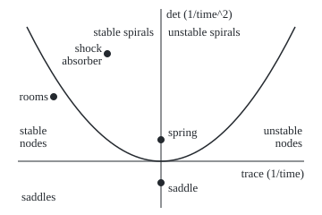
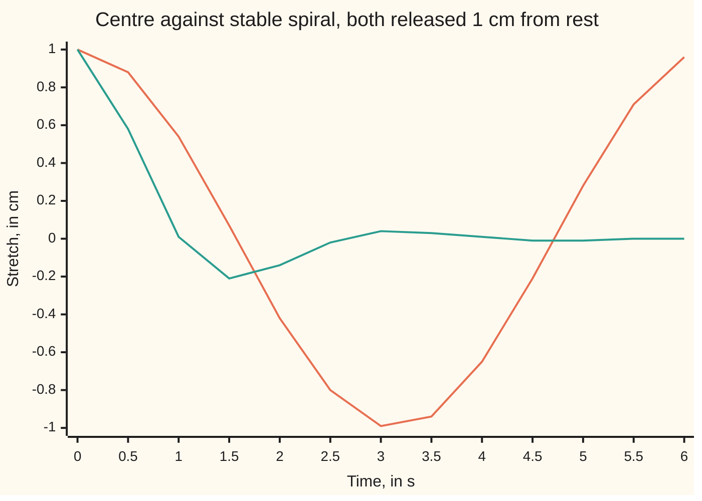

# Trace and determinant: two numbers sort every planar linear system into node, saddle, spiral or centre

[Syllabus](../../../SYLLABUS.md) → [Differential equations and dynamics](../../../SYLLABUS.md#w08) → [Systems and the Matrix Exponential](../../../SYLLABUS.md#w08-s04) → Trace and determinant

---

## General Overview

Two rooms share a wall, heating off. Room 1 starts 30 C above the outside air, room 2 starts 10 C above it. Both drift down to the outside temperature and stay there.

A car's shock absorber, pushed down 1 cm and released, bounces through its rest position with each swing smaller. A spring with no damper swings for ever at full size. A broom balanced upright on a palm falls at the first nudge.

Each is a pair of numbers changing by a fixed linear rule, with a resting state, an **equilibrium**. Two numbers read off the rule name the behaviour: the **trace**, the sum of its diagonal entries, and the **determinant**. Plot the pair on one chart; the region names the behaviour.

**For a two-variable system x' = Ax, the trace and determinant of A fix the eigenvalues' sum and product, and those two facts alone decide whether the equilibrium attracts, repels, spirals, or does some of each.**

**What kind of fact this is:** a theorem, proved on this card in Why it works; the words stable and asymptotically stable are definitions, given there.

### The picture: the trace-determinant chart

<p align="center"></p>

To scale: 30 units across per unit of trace, 24 up per unit of determinant. The curve is det = trace^2/4: spirals above it, nodes between it and the trace axis, saddles below that axis, centres on the upper determinant axis. Both checks print the coordinates.

---

## The formula

Reminder: x' = Ax says "the rate of the state x is the matrix A times the state" ([From one equation to a system](01-from-one-equation-to-a-system.md)). Here A has entries `[[a, b], [c, d]]`, row by row. The Greek letter $\tau$ (tau) names the trace, $\Delta$ (capital delta) the determinant.

$$\tau = a + d, \qquad \Delta = ad - bc, \qquad \lambda^2 - \tau\lambda + \Delta = 0$$

**Read it aloud:** the eigenvalues of A are the roots of a quadratic built from the trace and the determinant; they add to the trace and multiply to the determinant.

The quadratic formula gives them:

$$\lambda_1, \lambda_2 = \frac{\tau \pm \sqrt{\tau^2 - 4\Delta}}{2}$$

The chart reads: Δ < 0, a **saddle**, unstable. Δ > 0 with a discriminant of at least 0, a **node**; below 0, a **spiral**; either one stable when τ < 0 and unstable when τ > 0. Δ > 0 with τ = 0, a **centre**: stable, not asymptotically stable.

| Symbol | Plain meaning | In our example | Push it up and the answer… |
| --- | --- | --- | --- |
| $x$ | the state, two numbers | rooms' temperatures above outside, C | — |
| $t$ | time | hours (rooms), seconds (absorber) | — |
| $A$ | the rate matrix | rooms `[[-2, 1], [1, -2]]`, per hour | — |
| $a$, $b$, $c$, $d$ | the entries of A | −2, 1, 1, −2 | — |
| $\tau$ | trace, a + d: the eigenvalues' sum, per unit time | rooms −4, absorber −2 | past 0, attraction turns to repulsion |
| $\Delta$ | determinant, ad − bc: their product, per unit time^2 | rooms 3, absorber 5 | past 0, a saddle becomes a node or spiral |
| $\tau^2 - 4\Delta$ | the discriminant, under the root | rooms 4, absorber −16 | past 0, a spiral becomes a node |
| $\lambda$, $\lambda_1$, $\lambda_2$, $i$ | eigenvalues, the special motions' rates; i squares to −1 | rooms −1, −3; absorber $-1 \pm 2i$ | real part past 0, that motion grows |

### When it holds

- **Constant entries.** With time-varying ones, frozen-time eigenvalues can all be negative while the motion grows.
- **Two variables.** With three or more, the Routh–Hurwitz test in Stability of a state-space model takes over.
- **Off the boundary lines.** On Δ = 0 a whole line of states sits still; on the parabola the eigenvalues repeat and the portrait changes shape.
- **Nonlinear systems** borrow the verdict from their linear part, except at a centre ([Linearisation](../06-Nonlinear%20Dynamics%20in%20the%20Plane/02-linearisation-and-the-jacobian.md)).

---

## Why it works

### Step 0: eigenvalues decide the motion, and two numbers decide the eigenvalues

Every solution of x' = Ax is built from special motions changing like e^(λt), one per eigenvalue ([The eigenvalue method](02-the-eigenvalue-method.md)). A negative real part dies out, a positive one grows, an imaginary part turns. A pair of numbers is fixed by its sum and product.

### Step 1: the sum is the trace, the product is the determinant

An eigenvalue makes A − λI squash some direction to zero (I is the identity matrix), which happens exactly when its determinant is zero:

$$(a - \lambda)(d - \lambda) - bc = \lambda^2 - (a + d)\lambda + (ad - bc) = 0.$$

It also factors as (λ − λ1)(λ − λ2) = λ^2 − (λ1 + λ2)λ + λ1λ2, so λ1 + λ2 = τ and λ1λ2 = Δ. For the rooms, the pair adding to −4 and multiplying to 3 is −1 and −3.

### Step 2: read the signs

- **Δ < 0.** A negative product needs real roots of opposite sign; complex roots come as a pair p ± iq whose product p^2 + q^2 is never negative. One motion grows, one dies: a saddle.
- **Δ > 0, real roots.** One sign for both, shown by their sum τ: a stable node if negative, unstable if positive.
- **Δ > 0, complex roots.** The roots are p ± iq with p = τ/2 and q = √(4Δ − τ^2)/2. Each motion is e^(pt) times a rotation at q radians per unit time ([Complex eigenvalues](03-complex-eigenvalues-and-spirals.md)). τ < 0: an inward spiral. τ > 0: outward. τ = 0: closed loops, a centre.

Real and complex roots meet where τ^2 − 4Δ = 0: the parabola on the chart.

### Step 3: what "stable" means

- **Stable:** starts close enough stay within any chosen distance for all later time.
- **Asymptotically stable:** stable, and starts close enough also return in the long run.
- **Unstable:** some starts, however close, get carried a fixed distance away.

The centre separates the first two. For the spring the state is the stretch x and the velocity v: x' = v and v' = −x, so x^2 + v^2 has rate 2xv − 2vx = 0. A start stays at exactly its starting distance from rest: stable. It never gets closer: not asymptotically stable. The absorber's paths shrink by e^(−π) = 0.0432 each turn of 3.1416 s.



Orange: the spring, x = cos t, a centre, at full size again after its period of 6.2832 s. Teal: the absorber, x = e^(−t)(cos 2t + 0.5 sin 2t), a stable spiral.

<details>
<summary>Detailed proof: the eigenvalue signs give the stability verdicts</summary>

Distinct eigenvalues λ1, λ2 have independent eigenvectors v1, v2, so x(t) = k1 e^(λ1 t) v1 + k2 e^(λ2 t) v2, with weights linear in the start x0. With p the larger real part, |x(t)| ≤ C e^(pt) |x0| for t ≥ 0, C fixed by A.

If p < 0: for a distance ε, starts within ε/C stay within ε, and e^(pt) → 0 brings them home. Asymptotically stable.

If p = 0 with λ = ±iq: |x(t)| ≤ C|x0| gives stability; in real eigen-coordinates the motion is a pure rotation, so no start returns.

If p > 0: a start of size ε in the growing motion grows by e^(pt) (exactly, in eigen-coordinates), past any fixed distance however small ε is. Unstable, saddles included.

A repeated eigenvalue λ adds the motion t e^(λt), which still tends to 0 when λ < 0, so the verdict stands.

</details>

A second route skips eigenvalues: compute e^(At) and watch its size ([The matrix exponential](04-the-matrix-exponential.md)).

---

## Worked numbers, by hand

The rooms: T1' = −2T1 + T2 and T2' = T1 − 2T2, in C above outside, rates per hour.

| Step | Arithmetic | Value |
| --- | --- | --- |
| trace | −2 + (−2) | −4 per hour |
| determinant | (−2)(−2) − (1)(1) | 3 per hour^2 |
| discriminant | (−4)^2 − 4 × 3 | 4, positive: real eigenvalues |
| eigenvalues | (−4 ± √4)/2 | −1 and −3 per hour |
| chart | Δ > 0, below the parabola, τ < 0 | **stable node** |
| check in the rooms | T1 = 20e^(−1) + 10e^(−3) after 1 h | 7.8555 C above outside |

| System | τ | Δ | τ^2 − 4Δ | Eigenvalues | Chart |
| --- | --- | --- | --- | --- | --- |
| shock absorber `[[0, 1], [-5, -2]]`, per s | −2 | 5 | −16 | −1 ± 2i | **stable spiral** |
| spring `[[0, 1], [-1, 0]]`, per s | 0 | 1 | −4 | ±i | **centre** |
| broom `[[1, 0], [0, -1]]` | 0 | −1 | 4 | 1 and −1 | **saddle** |

The rooms cool without overshoot; the absorber overshoots, then settles; the spring never settles; the broom falls unless exactly balanced.

### Sketching the portrait

The phase portrait, every path in the plane of the two numbers, takes three more readings.

- **Node:** paths arrive along the slower eigenvector: for the rooms, both rooms equally warm, fading like e^(−t), t in hours.
- **Spiral or centre:** with the first number across and the second up, c < 0 turns paths clockwise, as for the absorber and the spring.
- **Saddle:** paths come in along the negative eigenvalue's eigenvector and leave along the positive one's: for the broom, in along the second axis, out along the first.

### What breaks if you drop a piece

| Mistake | Comes out at | What went wrong |
| --- | --- | --- |
| Negative trace read as stable, `[[1, 0], [0, -2]]` | from (1, 1), x reaches 403.43 after 6 time units | Δ = −2: a saddle |
| Euler at h = 0.1 on the spring for 60 s, read as proof | radius 19.79, a false outward spiral | each step inflates the radius by √(1 + h^2) |
| Sign slip, λ^2 + τλ + Δ = 0, on the rooms | eigenvalues 3 and 1, a false unstable node | the eigenvalues' sum is +τ |
| Boundary ignored, `[[-1, 0], [0, 0]]` read as a stable node | from (0, 1) the state stays at (0, 1) for good | Δ = 0: a whole line of resting states; stable, not asymptotically stable |

The code prints all four.

---

## Code, from first principles, and it actually runs

Only `math` is imported. Road one reads the chart. Road two never mentions eigenvalues: it steps each system with Euler's rule (a small step h along the current rate, repeated; its own card is on the Numerical Evolution shelf) from eight starts for 6 time units, counting starts that shrink below half or grow past double, and sign changes of the first number. Asserts check that the roads agree, that each eigenvalue zeroes det(A − λI), that Euler's error on the rooms falls tenfold with h, and Euler's inflation of the spring.

### Python

```python
# Trace and determinant -- the check behind the card.  Only math is imported.  Four
# systems x' = Ax are classified twice: road one reads trace and determinant off the
# chart; road two steps the motion with Euler's rule from eight starts and watches it.
from math import sqrt, exp, cos, sin, pi
CASES = [("rooms", [[-2, 1], [1, -2]]), ("absorber", [[0, 1], [-5, -2]]),
         ("spring", [[0, 1], [-1, 0]]), ("saddle", [[1, 0], [0, -1]])]
STARTS = [(1, 0), (1, 1), (0, 1), (-1, 1), (-1, 0), (-1, -1), (0, -1), (1, -1)]
def eig(t, d):                           # roots of L^2 - tL + d = 0
    q = t * t - 4 * d
    if q >= 0: return (t + sqrt(q)) / 2, (t - sqrt(q)) / 2, 0.0
    return t / 2, t / 2, sqrt(-q) / 2
def chart(t, d):                         # road one: where (trace, det) sits
    if d < 0: return "saddle", "unstable"
    if t == 0: return "centre", "stable, not asymptotically stable"
    shape = "spiral" if t * t - 4 * d < 0 else "node"
    return ("stable " if t < 0 else "unstable ") + shape, ("asymptotically stable" if t < 0 else "unstable")
def euler(a, x, y, h, n):                # n small steps along the slope
    for _ in range(n):
        x, y = x + h * (a[0][0] * x + a[0][1] * y), y + h * (a[1][0] * x + a[1][1] * y)
    return x, y
def motion(a, h=0.001, n=6000):          # road two: eight starts, 6 time units
    ratios = [sqrt(sum(v * v for v in euler(a, x, y, h, n))) / sqrt(x * x + y * y) for x, y in STARTS]
    shrink, grow = sum(r < 0.5 for r in ratios), sum(r > 2 for r in ratios)
    x, y, turns = 1.0, 0.0, 0
    for _ in range(n):                   # count sign changes of x from (1, 0)
        nx, y = euler(a, x, y, h, 1)
        turns, x = turns + ((nx > 0) != (x > 0)), nx
    if shrink and grow: label = "saddle"
    elif shrink == 8 or grow == 8: label = ("stable " if shrink else "unstable ") + ("spiral" if turns >= 2 else "node")
    else: label = "centre"
    return shrink, grow, 8 - shrink - grow, turns, label
def px(t, d): return f"({180 + 30 * t:.0f}, {180 - 24 * d:.0f})"   # figure: 30 px per unit of trace, 24 per unit of det
figure = []
for name, a in CASES:
    t, d = a[0][0] + a[1][1], a[0][0] * a[1][1] - a[0][1] * a[1][0]
    l1, l2, im = eig(t, d)
    for lam in (complex(l1, im), complex(l2, -im)):          # det(A - L I) = 0, from the entries
        assert abs((a[0][0] - lam) * (a[1][1] - lam) - a[0][1] * a[1][0]) < 1e-12
    ev = f"{l1:.4f} +/- {im:.4f}i" if im else f"{l1:.4f} and {l2:.4f}"
    kind, stab = chart(t, d)
    s, g, st, turns, label = motion(a)
    print(f"{name} {a}: trace {t}, det {d}, trace^2 - 4det {t * t - 4 * d}, eigenvalues {ev} -> chart: {kind}, {stab}")
    print(f"  motion, 8 starts over 6 time units: shrink {s}, grow {g}, stay {st}, sign changes {turns} -> {label}")
    assert kind == label                                       # two roads, one verdict
    figure.append(f"{name} {px(t, d)}")
closed = 20 * exp(-1) + 10 * exp(-3)
errs = [abs(euler(CASES[0][1], 30.0, 10.0, h, n)[0] - closed) for h, n in ((0.01, 100), (0.001, 1000))]
print(f"rooms, room 1 after 1 h from (30, 10): closed form {closed:.4f} C; Euler error {errs[0]:.4f} at h = 0.01, {errs[1]:.4f} at h = 0.001")
print(f"periods: absorber 2pi/2 = {pi:.4f} s, shrinking by e^-pi = {exp(-pi):.4f} each turn; spring 2pi/1 = {2 * pi:.4f} s")
print("chart spring x(t):", ", ".join(f"{cos(k / 2):.2f}" for k in range(13)))
print("chart absorber x(t):", ", ".join(f"{exp(-k / 2) * (cos(k) + 0.5 * sin(k)):.2f}" for k in range(13)))
print(f"figure, {', '.join(figure)}, parabola ends {px(-5, 6.25)} and {px(5, 6.25)}, control {px(0, -6.25)}")
r, (b1, b2, _) = sqrt(sum(v * v for v in euler(CASES[2][1], 1.0, 0.0, 0.1, 600))), eig(4, 3)
print(f"mistake 1, trace -1 read as stable: [[1, 0], [0, -2]] has det -2, a saddle; from (1, 1) x reaches e^6 = {exp(6):.2f} after 6 units")
print(f"mistake 2, Euler at h = 0.1 on the spring for 60 s: radius {r:.2f} (1.01^300 = {1.01 ** 300:.2f}); the true radius stays 1")
print(f"hypothesis dropped, det 0: [[-1, 0], [0, 0]] reads {chart(-1, 0)[0]}, yet (0, 1) goes to {euler([[-1, 0], [0, 0]], 0.0, 1.0, 0.001, 6000)}: never returns")
print(f"mistake 3, sign slip L^2 + trace L + det on the rooms: eigenvalues {b1:.4f} and {b2:.4f}, a false unstable node")
assert 8 < errs[0] / errs[1] < 12 and errs[1] < 0.01          # Euler closes on the closed form at first order
assert abs(r - 1.01 ** 300) < 1e-9 * r                         # stepping agrees with (1 + h^2)^(n/2)
print("ALL CHECKS PASS")
```

**Ran 2026-09-28 on macOS, Python 3.14.6, standard library only. All checks passed. Output, pasted from the run:**

```
rooms [[-2, 1], [1, -2]]: trace -4, det 3, trace^2 - 4det 4, eigenvalues -1.0000 and -3.0000 -> chart: stable node, asymptotically stable
  motion, 8 starts over 6 time units: shrink 8, grow 0, stay 0, sign changes 0 -> stable node
absorber [[0, 1], [-5, -2]]: trace -2, det 5, trace^2 - 4det -16, eigenvalues -1.0000 +/- 2.0000i -> chart: stable spiral, asymptotically stable
  motion, 8 starts over 6 time units: shrink 8, grow 0, stay 0, sign changes 4 -> stable spiral
spring [[0, 1], [-1, 0]]: trace 0, det 1, trace^2 - 4det -4, eigenvalues 0.0000 +/- 1.0000i -> chart: centre, stable, not asymptotically stable
  motion, 8 starts over 6 time units: shrink 0, grow 0, stay 8, sign changes 2 -> centre
saddle [[1, 0], [0, -1]]: trace 0, det -1, trace^2 - 4det 4, eigenvalues 1.0000 and -1.0000 -> chart: saddle, unstable
  motion, 8 starts over 6 time units: shrink 2, grow 6, stay 0, sign changes 0 -> saddle
rooms, room 1 after 1 h from (30, 10): closed form 7.8555 C; Euler error 0.0593 at h = 0.01, 0.0059 at h = 0.001
periods: absorber 2pi/2 = 3.1416 s, shrinking by e^-pi = 0.0432 each turn; spring 2pi/1 = 6.2832 s
chart spring x(t): 1.00, 0.88, 0.54, 0.07, -0.42, -0.80, -0.99, -0.94, -0.65, -0.21, 0.28, 0.71, 0.96
chart absorber x(t): 1.00, 0.58, 0.01, -0.21, -0.14, -0.02, 0.04, 0.03, 0.01, -0.01, -0.01, -0.00, 0.00
figure, rooms (60, 108), absorber (120, 60), spring (180, 156), saddle (180, 204), parabola ends (30, 30) and (330, 30), control (180, 330)
mistake 1, trace -1 read as stable: [[1, 0], [0, -2]] has det -2, a saddle; from (1, 1) x reaches e^6 = 403.43 after 6 units
mistake 2, Euler at h = 0.1 on the spring for 60 s: radius 19.79 (1.01^300 = 19.79); the true radius stays 1
hypothesis dropped, det 0: [[-1, 0], [0, 0]] reads stable node, yet (0, 1) goes to (0.0, 1.0): never returns
mistake 3, sign slip L^2 + trace L + det on the rooms: eigenvalues 3.0000 and 1.0000, a false unstable node
ALL CHECKS PASS
```

### Rust

Same numbers, same labels, built with `rustc --edition 2021 -O`.

```rust
// Trace and determinant -- the same check as the Python, in Rust.  No crates.  Four
// systems x' = Ax are classified twice: road one reads trace and determinant off the
// chart; road two steps the motion with Euler's rule from eight starts and watches it.
use std::f64::consts::PI;
type M = [[i64; 2]; 2];
const STARTS: [(f64, f64); 8] = [(1.0, 0.0), (1.0, 1.0), (0.0, 1.0), (-1.0, 1.0), (-1.0, 0.0), (-1.0, -1.0), (0.0, -1.0), (1.0, -1.0)];

fn eig(t: i64, d: i64) -> (f64, f64, f64) {            // roots of L^2 - tL + d = 0
    let (tf, q) = (t as f64, (t * t - 4 * d) as f64);
    if q >= 0.0 { ((tf + q.sqrt()) / 2.0, (tf - q.sqrt()) / 2.0, 0.0) } else { (tf / 2.0, tf / 2.0, (-q).sqrt() / 2.0) }
}
fn chart(t: i64, d: i64) -> (String, &'static str) {  // road one: where (trace, det) sits
    if d < 0 { return ("saddle".into(), "unstable") }
    if t == 0 { return ("centre".into(), "stable, not asymptotically stable") }
    let shape = if t * t - 4 * d < 0 { "spiral" } else { "node" };
    if t < 0 { (format!("stable {}", shape), "asymptotically stable") } else { (format!("unstable {}", shape), "unstable") }
}
fn euler(a: &M, mut x: f64, mut y: f64, h: f64, n: usize) -> (f64, f64) {   // n small steps along the slope
    let [[p, q], [r, s]] = a.map(|row| row.map(|v| v as f64));
    for _ in 0..n { (x, y) = (x + h * (p * x + q * y), y + h * (r * x + s * y)) }
    (x, y)
}
fn motion(a: &M) -> (usize, usize, usize, usize, String) {   // road two: eight starts, 6 time units
    let (h, n) = (0.001, 6000);
    let ratios: Vec<f64> = STARTS.iter().map(|&(x, y)| { let (u, v) = euler(a, x, y, h, n); (u * u + v * v).sqrt() / (x * x + y * y).sqrt() }).collect();
    let shrink = ratios.iter().filter(|&&r| r < 0.5).count();
    let grow = ratios.iter().filter(|&&r| r > 2.0).count();
    let (mut x, mut y, mut turns) = (1.0, 0.0, 0);
    for _ in 0..n {                                     // count sign changes of x from (1, 0)
        let (nx, ny) = euler(a, x, y, h, 1);
        if (nx > 0.0) != (x > 0.0) { turns += 1 }
        (x, y) = (nx, ny);
    }
    let label = if shrink > 0 && grow > 0 { "saddle".to_string() }
        else if shrink == 8 || grow == 8 { format!("{} {}", if shrink > 0 { "stable" } else { "unstable" }, if turns >= 2 { "spiral" } else { "node" }) }
        else { "centre".to_string() };
    (shrink, grow, 8 - shrink - grow, turns, label)
}
fn px(t: f64, d: f64) -> String { format!("({:.0}, {:.0})", 180.0 + 30.0 * t, 180.0 - 24.0 * d) }   // figure: 30 px per unit of trace, 24 per unit of det

fn main() {
    let cases: [(&str, M); 4] = [("rooms", [[-2, 1], [1, -2]]), ("absorber", [[0, 1], [-5, -2]]),
        ("spring", [[0, 1], [-1, 0]]), ("saddle", [[1, 0], [0, -1]])];
    let mut figure: Vec<String> = Vec::new();
    for (name, a) in &cases {
        let (t, d) = (a[0][0] + a[1][1], a[0][0] * a[1][1] - a[0][1] * a[1][0]);
        let (l1, l2, im) = eig(t, d);
        for (re, ii) in [(l1, im), (l2, -im)] {         // det(A - L I) = 0, from the entries
            let (u, w, bc) = (a[0][0] as f64 - re, a[1][1] as f64 - re, (a[0][1] * a[1][0]) as f64);
            let (dr, di) = (u * w - ii * ii - bc, -ii * (u + w));
            assert!((dr * dr + di * di).sqrt() < 1e-12);
        }
        let ev = if im != 0.0 { format!("{:.4} +/- {:.4}i", l1, im) } else { format!("{:.4} and {:.4}", l1, l2) };
        let (kind, stab) = chart(t, d);
        let (s, g, st, turns, label) = motion(a);
        println!("{} {:?}: trace {}, det {}, trace^2 - 4det {}, eigenvalues {} -> chart: {}, {}", name, a, t, d, t * t - 4 * d, ev, kind, stab);
        println!("  motion, 8 starts over 6 time units: shrink {}, grow {}, stay {}, sign changes {} -> {}", s, g, st, turns, label);
        assert_eq!(kind, label);                        // two roads, one verdict
        figure.push(format!("{} {}", name, px(t as f64, d as f64)));
    }
    let closed = 20.0 * (-1.0f64).exp() + 10.0 * (-3.0f64).exp();
    let errs: Vec<f64> = [(0.01, 100), (0.001, 1000)].iter().map(|&(h, n)| (euler(&cases[0].1, 30.0, 10.0, h, n).0 - closed).abs()).collect();
    println!("rooms, room 1 after 1 h from (30, 10): closed form {:.4} C; Euler error {:.4} at h = 0.01, {:.4} at h = 0.001", closed, errs[0], errs[1]);
    println!("periods: absorber 2pi/2 = {:.4} s, shrinking by e^-pi = {:.4} each turn; spring 2pi/1 = {:.4} s", PI, (-PI).exp(), 2.0 * PI);
    let spring: Vec<String> = (0..13).map(|k| format!("{:.2}", (k as f64 / 2.0).cos())).collect();
    let absorber: Vec<String> = (0..13).map(|k| { let t = k as f64; format!("{:.2}", (-t / 2.0).exp() * (t.cos() + 0.5 * t.sin())) }).collect();
    println!("chart spring x(t): {}", spring.join(", "));
    println!("chart absorber x(t): {}", absorber.join(", "));
    println!("figure, {}, parabola ends {} and {}, control {}", figure.join(", "), px(-5.0, 6.25), px(5.0, 6.25), px(0.0, -6.25));
    let (u, v) = euler(&cases[2].1, 1.0, 0.0, 0.1, 600);
    let r = (u * u + v * v).sqrt();
    let (b1, b2, _) = eig(4, 3);
    println!("mistake 1, trace -1 read as stable: [[1, 0], [0, -2]] has det -2, a saddle; from (1, 1) x reaches e^6 = {:.2} after 6 units", 6.0f64.exp());
    println!("mistake 2, Euler at h = 0.1 on the spring for 60 s: radius {:.2} (1.01^300 = {:.2}); the true radius stays 1", r, 1.01f64.powi(300));
    println!("hypothesis dropped, det 0: [[-1, 0], [0, 0]] reads {}, yet (0, 1) goes to {:?}: never returns", chart(-1, 0).0, euler(&[[-1, 0], [0, 0]], 0.0, 1.0, 0.001, 6000));
    println!("mistake 3, sign slip L^2 + trace L + det on the rooms: eigenvalues {:.4} and {:.4}, a false unstable node", b1, b2);
    assert!(errs[0] / errs[1] > 8.0 && errs[0] / errs[1] < 12.0 && errs[1] < 0.01);   // Euler closes on the closed form at first order
    assert!((r - 1.01f64.powi(300)).abs() < 1e-9 * r);                                // stepping agrees with (1 + h^2)^(n/2)
    println!("ALL CHECKS PASS");
}
```

**Ran 2026-09-28 on macOS, rustc 1.98.1, no crates. All checks passed. Output, pasted from the run:**

```
rooms [[-2, 1], [1, -2]]: trace -4, det 3, trace^2 - 4det 4, eigenvalues -1.0000 and -3.0000 -> chart: stable node, asymptotically stable
  motion, 8 starts over 6 time units: shrink 8, grow 0, stay 0, sign changes 0 -> stable node
absorber [[0, 1], [-5, -2]]: trace -2, det 5, trace^2 - 4det -16, eigenvalues -1.0000 +/- 2.0000i -> chart: stable spiral, asymptotically stable
  motion, 8 starts over 6 time units: shrink 8, grow 0, stay 0, sign changes 4 -> stable spiral
spring [[0, 1], [-1, 0]]: trace 0, det 1, trace^2 - 4det -4, eigenvalues 0.0000 +/- 1.0000i -> chart: centre, stable, not asymptotically stable
  motion, 8 starts over 6 time units: shrink 0, grow 0, stay 8, sign changes 2 -> centre
saddle [[1, 0], [0, -1]]: trace 0, det -1, trace^2 - 4det 4, eigenvalues 1.0000 and -1.0000 -> chart: saddle, unstable
  motion, 8 starts over 6 time units: shrink 2, grow 6, stay 0, sign changes 0 -> saddle
rooms, room 1 after 1 h from (30, 10): closed form 7.8555 C; Euler error 0.0593 at h = 0.01, 0.0059 at h = 0.001
periods: absorber 2pi/2 = 3.1416 s, shrinking by e^-pi = 0.0432 each turn; spring 2pi/1 = 6.2832 s
chart spring x(t): 1.00, 0.88, 0.54, 0.07, -0.42, -0.80, -0.99, -0.94, -0.65, -0.21, 0.28, 0.71, 0.96
chart absorber x(t): 1.00, 0.58, 0.01, -0.21, -0.14, -0.02, 0.04, 0.03, 0.01, -0.01, -0.01, -0.00, 0.00
figure, rooms (60, 108), absorber (120, 60), spring (180, 156), saddle (180, 204), parabola ends (30, 30) and (330, 30), control (180, 330)
mistake 1, trace -1 read as stable: [[1, 0], [0, -2]] has det -2, a saddle; from (1, 1) x reaches e^6 = 403.43 after 6 units
mistake 2, Euler at h = 0.1 on the spring for 60 s: radius 19.79 (1.01^300 = 19.79); the true radius stays 1
hypothesis dropped, det 0: [[-1, 0], [0, 0]] reads stable node, yet (0, 1) goes to (0.0, 1.0): never returns
mistake 3, sign slip L^2 + trace L + det on the rooms: eigenvalues 3.0000 and 1.0000, a false unstable node
ALL CHECKS PASS
```

> [!TIP]
> **Try changing**
> - **Stronger damping.** Guess first: change the absorber's −2 to −6. Both roads print stable node: no overshoot.
> - **Flip the spring.** Guess first: change the spring's −1 to 1, the broom in other coordinates. Both roads print saddle.
> - **Push energy in.** Guess first: change the absorber's −2 to 2. Both roads print unstable spiral.

---

## The usual mistake

> [!warning]
> **Reading stability from the trace alone.** A negative trace says the eigenvalues add to a negative number, not that both are negative. `[[1, 0], [0, -2]]` has trace −1 and determinant −2: a saddle, reaching 403.43 after 6 time units. Asymptotic stability needs τ < 0 and Δ > 0 together.
>
> - **Calling a centre asymptotically stable.** The spring stays near rest but never returns; after 6.2832 s it is back at full stretch.
> - **Trusting the plotted path.** Euler at h = 0.1 turns the spring's circle into a spiral of radius 19.79 after 60 s. A picture illustrates; the eigenvalues prove.

---

## Where you meet it in real life

- **Car suspension.** A stiffer damper moves the point down toward the parabola; on it, the body settles fastest without overshoot for a given spring (Equations of motion of a vehicle).
- **Control engineering.** A two-variable feedback loop is tuned to negative trace and positive determinant (Stability of a state-space model).
- **Predators and prey, pendulums.** Near each equilibrium the linear part goes on the chart ([Linearisation](../06-Nonlinear%20Dynamics%20in%20the%20Plane/02-linearisation-and-the-jacobian.md)).

> **Say it back**
> A two-variable linear system's eigenvalues add to the trace and multiply to the determinant. A negative determinant means a saddle. A positive determinant with a negative trace attracts; with a positive trace, repels. Trace squared minus four times the determinant splits nodes from spirals. Zero trace with positive determinant is a centre: stable, never returning.

---

## What this builds on

- [Complex eigenvalues](03-complex-eigenvalues-and-spirals.md): complex eigenvalues p ± iq as rotation times growth or decay.
- [Determinants](../../03-Algebra/05-Solving%20Systems/04-determinants.md): ad − bc, and why a zero determinant means a squashed direction.

## Where this goes next

- [Linearisation](../06-Nonlinear%20Dynamics%20in%20the%20Plane/02-linearisation-and-the-jacobian.md): the chart applied to the linear part of a curved rule, and where a centre fails to survive.
- Stability of a state-space model: the same verdict in any number of variables, without solving for eigenvalues.
- Equations of motion of a vehicle: the absorber's trace and determinant from mass, spring and damper.

The chart judges a system left alone; what the rooms do when a heater switches on, a steady push added to x' = Ax, is [Forced systems](06-forced-systems-and-variation-of-constants.md).

---

## Sources

Verified 2026-09-28: every link below resolves to the publisher's page.

- Strogatz, Steven H. *Nonlinear Dynamics and Chaos*, 3rd ed. Chapman & Hall, 2024. [Publisher page](https://www.routledge.com/Nonlinear-Dynamics-and-Chaos-With-Applications-to-Physics-Biology-Chemistry-and-Engineering/Strogatz/p/book/9780367026509). Section 5.2, "Classification of Linear Systems": the chart and the stability words.
- Boyce, William E., Richard C. DiPrima and Douglas B. Meade. *Elementary Differential Equations*, 12th ed. Wiley, 2021. [Publisher page](https://www.wiley.com/en-us/Elementary+Differential+Equations%2C+12th+Edition-p-9781119777755). Phase portraits of each linear type.
- Teschl, Gerald. *Ordinary Differential Equations and Dynamical Systems*. AMS Graduate Studies in Mathematics 140, 2012. [Author's text, posted with AMS permission](https://mat.univie.ac.at/~gerald/ftp/book-ode/). The linear stability theorem in full.
