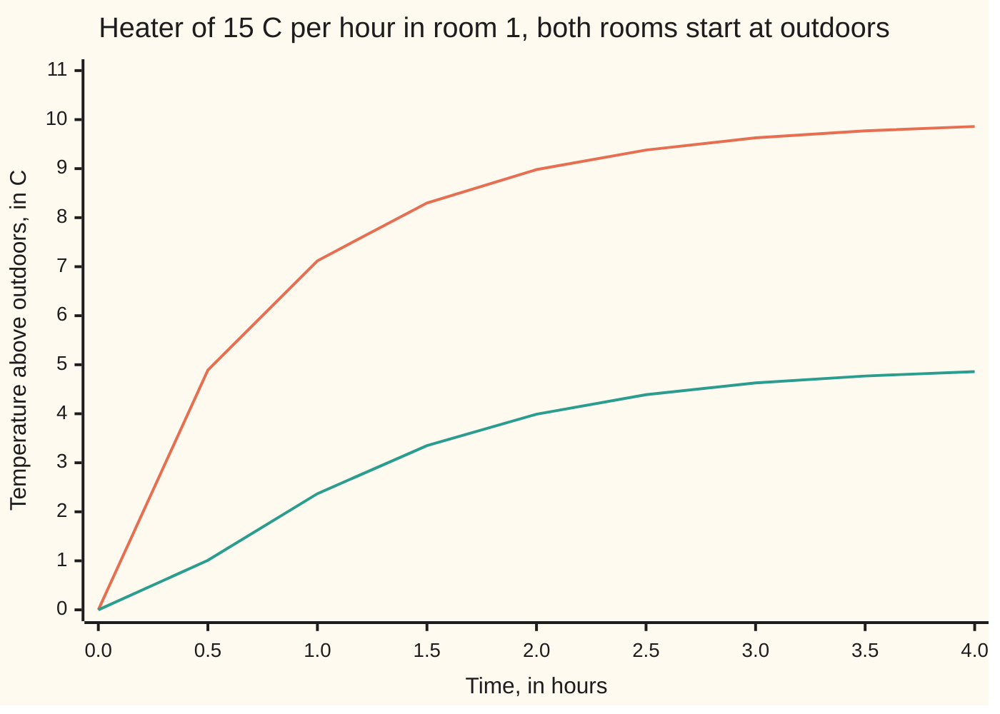
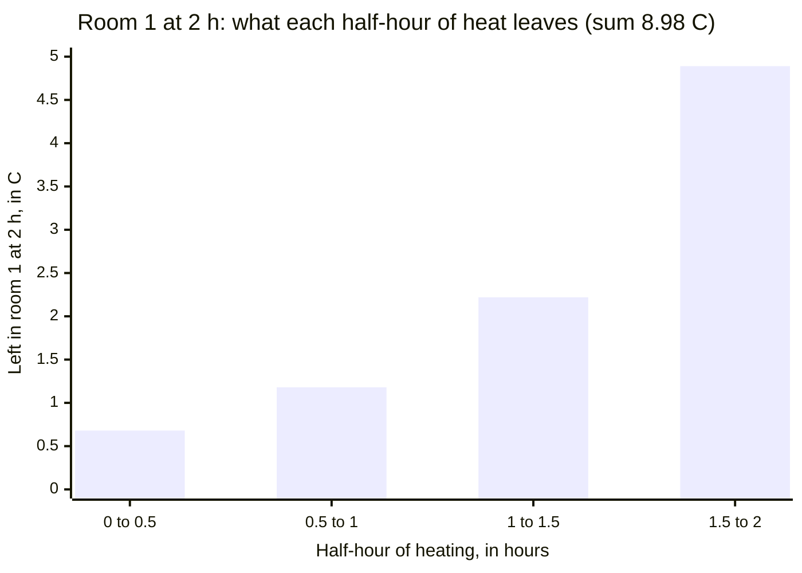

# Forced systems: the response is the start propagated forward plus every past input propagated to now

Differential equations and dynamics → Systems and the Matrix Exponential → Driven linear systems → Forced systems

---

## General Overview

Two rooms share a wall. Temperatures are counted in C above the outdoor air, and time in hours. With the heating off, each room cools at 2 C per hour for every degree it stands above outdoors, and half of that lost heat passes through the wall into its neighbour. From 30 C and 10 C, the rooms relax to outdoors along two patterns: the average falls like e^(−t), the difference like e^(−3t) ([the-eigenvalue-method](02-the-eigenvalue-method.md)).

Now switch on a heater in room 1. It pours in 15 C per hour: how fast it would warm the room if no heat escaped. Both rooms start at outdoor temperature. After 2 hours room 1 reads 8.98 C and room 2 reads 3.99 C. Given long enough, they settle at 10 C and 5 C.

Heat poured in early has had time to spread through the wall and leak outside; heat poured in a moment ago has hardly moved. So each moment's input must be aged by its time in the house, by the same machine that ages the starting temperatures: the matrix exponential. The method's traditional name, **variation of constants**, is explained in Step 3.

**The state of a linear system under forcing is its starting state carried forward to now, plus every past input, each carried forward from the moment it arrived.**

**What kind of fact this is:** a theorem, proved on this card in Why it works.

### The picture: two rooms warming from cold



Orange: room 1, with the heater, heading for 10 C. Teal: room 2, warmed only through the wall, heading for 5 C. Room 2 starts flat: at first nothing has reached it.

---

## The formula

Reminder: a system is written with a vector unknown, x' = Ax, read "the rate of the state is the matrix A applied to the state"; its solution from a start x0 is e^(At) x0, where e^(At) is the matrix exponential ([the-matrix-exponential](04-the-matrix-exponential.md)). A **forced** system adds an input b(t) that does not depend on the state:

$$x' = Ax + b(t), \qquad x(0) = x_0$$

For the rooms, x = (room 1, room 2), A is `[[-2, 1], [1, -2]]` per hour, and b = (15, 0) C per hour. The solution is

$$x(t) = e^{At}x_0 + \int_0^t e^{A(t-s)}\,b(s)\,ds$$

**Read it aloud:** the state now is the start, carried forward t hours, plus the input of every earlier moment s, each carried forward the t − s hours since it arrived.

When b is constant and A has an inverse, the integral can be done once and for all:

$$x(t) = x_{eq} + e^{At}\,(x_0 - x_{eq}), \qquad x_{eq} = -A^{-1}b$$

The **settled state** x_eq is where Ax + b = 0: the rates stop. The start's gap from it decays as a free system would.

| Symbol | Plain meaning | In our example | Push it up and the answer… |
| --- | --- | --- | --- |
| $t$, $s$ | time now; an earlier moment of input, in hours | t = 2 | — |
| $x$ | the state: both temperatures, C above outdoors | (8.98, 3.99) at 2 h | — |
| $x_0$ | the starting state | (0, 0), or the house start (30, 10) | adds its own fading term |
| $A$ | the rate matrix: leak and wall transfer, per hour | `[[-2, 1], [1, -2]]` | a bigger leak settles lower, faster |
| $b$ | the forcing: input rate, C per hour | (15, 0) | the settled state scales with it |
| $e^{At}$ | the propagator: carries a state forward t hours | modes e^(−t) and e^(−3t) | — |
| $x_{eq}$ | the settled state, −A^(−1) b | (10, 5) | — |
| $A^{-1}$, $I$ | A's inverse; the identity matrix | A^(−1) = −(1/3)`[[2, 1], [1, 2]]` | — |

### When it holds

- **Linear in the state, input added.** A thermostat makes b depend on x, and opening a window changes A; either breaks the formula.
- **A constant.** If the rate matrix changes in time, e^(A(t−s)) gives way to a transition matrix that depends on both times, t and s; the exponential of the integral of A is wrong in general.
- **b piecewise continuous.** A heater switched on at noon is fine; an instantaneous kick needs an impulse.
- **The settled-state shortcut needs A invertible; settling there also needs every eigenvalue negative.** Insulate the rooms from outside and A becomes `[[-1, 1], [1, -1]]`, with determinant 0: no x_eq exists, and room 1 reads 18.68 C at 2 hours, the average climbing 7.5 C per hour. The integral formula still holds.

---

## Why it works

### Step 0: the integrating factor, with a matrix

For one equation, y' + py = q, multiplying by e^(pt) made the left side one derivative ([integrating-factor](../01-Rate%20Equations/05-integrating-factor.md)). Write the system as x' − Ax = b and use the matrix e^(−At): like the scalar weight, its rate is −A times itself, and it has an inverse, e^(At).

### Step 1: the left side collapses

By the product rule, which holds for a matrix times a vector,

$$\big(e^{-At}x\big)' = e^{-At}x' - Ae^{-At}x = e^{-At}\,(x' - Ax) = e^{-At}\,b(t)$$

The middle step moves A past e^(−At), allowed because e^(−At) is a power series in A.

### Step 2: integrate, then undo the weight

Integrate from 0 to t. At 0 the weight is I, so the left side gives e^(−At) x(t) − x0:

$$e^{-At}x(t) - x_0 = \int_0^t e^{-As}\,b(s)\,ds$$

Multiply on the left by e^(At). Exponents of the same matrix add, so e^(At) e^(−As) = e^(A(t−s)), and the formula appears. Any solution must satisfy it, so there is only one.

### Step 3: why "variation of constants"

With no input, every solution is e^(At) c for a constant vector c. Let c vary: put x = e^(At) c(t). Substituting gives Ax + e^(At) c' = Ax + b, so c' = e^(−At) b, and integrating is Step 2 again. The constants drift, at a rate set by the input.

### Step 4: read the integral as a sum of past inputs

Cut the 2 hours into thin slices of length ds. In the slice at time s the heater adds the small state b ds, which from then on obeys the free law x' = Ax; every later input has its own slice. By 2 hours it has become e^(A(2−s)) b ds, and the integral adds the slices. Half-hour slices, and what each leaves in room 1 at 2 hours:



Every slice put in the same 7.5 C. The newest keeps 4.89 C; the oldest keeps 0.68 C, the rest leaked away.

### Step 5: constant input, done by hand

For constant b the integral is ∫ from 0 to t of e^(Aw) b dw, with w = t − s the age of the input. The rate of A^(−1) e^(Aw) is e^(Aw), so the integral is A^(−1)(e^(At) − I) b. Adding e^(At) x0 and regrouping gives x_eq + e^(At)(x0 − x_eq), with x_eq = −A^(−1) b ([inverse-matrix](../../03-Algebra/05-Solving%20Systems/03-inverse-matrix.md)). When every eigenvalue of A has a negative real part, e^(At) shrinks to zero and the state settles at x_eq.

<details>
<summary>Detailed proof: the formula solves the problem, and nothing else does</summary>

Let A be a constant n-by-n matrix and b continuous on an interval containing 0. Write x(t) = e^(At)(x0 + ∫ from 0 to t of e^(−As) b(s) ds).

Existence. (e^(At))' = Ae^(At), and the fundamental theorem of calculus, entry by entry, gives the integral the rate e^(−At) b(t). The product rule gives x' = Ax + e^(At) e^(−At) b(t) = Ax + b, and x(0) = x0 since e^(0) = I.

Uniqueness. If y also solves it, d = x − y has d' = Ad and d(0) = 0. By Step 1 with b = 0, e^(−At) d is constant, so it stays 0, and since e^(−At) is invertible, d = 0.

</details>

A second road steps the raw law, new state = old state + step length × rate: Euler's rule ([eulers-method](../05-Numerical%20Evolution/01-eulers-method.md)). The code does it. Laplace transforms reach the same integral as a convolution in [convolution-and-the-impulse-response](../08-Laplace%20Transforms%20for%20Initial-Value%20Problems/07-convolution-and-the-impulse-response.md).

---

## Worked numbers, by hand

| Step | Arithmetic | Value |
| --- | --- | --- |
| determinant of A | (−2)(−2) − (1)(1) | 3 |
| settled state | −A^(−1)(15, 0) = (1/3)(2 × 15, 1 × 15) | (10, 5) |
| start's gap, cold start | (0, 0) − (10, 5) | (−10, −5) |
| split into modes | −10, −5 = −7.5(1, 1) − 2.5(1, −1) | −7.5 and −2.5 |
| room 1 | 10 − 7.5e^(−t) − 2.5e^(−3t) | — |
| room 2 | 5 − 7.5e^(−t) + 2.5e^(−3t) | — |
| at 2 hours | 10 − 7.5 × 0.13534 − 2.5 × 0.00248 | **room 1 8.98 C** |
| same, room 2 | 5 − 1.01501 + 0.00620 | **room 2 3.99 C** |
| house start (30, 10) | free decay (2.7315, 2.6819) + cold response | **(11.71, 6.67)** |

From cold, 2 hours of heating leave room 1 at 8.98 C and room 2 at 3.99 C above outdoors. From the house start the parts add: 2.73 C of old warmth survives in room 1, on top of the heater's 8.98 C. Room 2's starting rate is 7.5 − 7.5 = 0: its curve starts flat.

### What breaks if you drop a piece

| Mistake | Room 1 at 2 h | What went wrong |
| --- | --- | --- |
| Heat added, never propagated | 30.00 C | 15 C per hour × 2 hours, with no leak and no wall |
| All heat aged from t = 0 | 2.0672 C | every slice treated as 2 hours old |
| Settled state alone | 10.00 C, even at 0 h | the start's gap, e^(At)(x0 − x_eq), dropped |
| Walls insulated, det A = 0 | 18.6813 C and rising | no x_eq exists; the shortcut fails, the integral does not |

The truth is 8.98 C; the code prints all four.

---

## Code, from first principles, and it actually runs

Three roads. One: the settled state by Cramer's rule (the 2-by-2 inverse written out), plus the start's gap carried by the two modes. Two: the formula taken literally, with e^(Aw) summed from its power series (no eigenvalues used) and the integral by Simpson's rule, a weighted sum of samples. Three: Euler steps on the raw law, whose error halves with the step. Road two, cut into half-hour slices, gives the bar chart in Step 4.

### Python

```python
# Forced systems -- the check behind the card.  Standard library only.
# Two rooms, C above outdoors, t in hours: x' = Ax + b, heater b = (15, 0).
# Road one: modes, xeq + e^(At)(x0 - xeq).  Road two: e^(At) x0 + integral of
# e^(A(t-s)) b, Simpson's rule, e^(Aw) by power series.  Road three: Euler.
import math
A, INS, B = [[-2.0, 1.0], [1.0, -2.0]], [[-1.0, 1.0], [1.0, -1.0]], [15.0, 0.0]
def mv(M, v): return [M[0][0] * v[0] + M[0][1] * v[1], M[1][0] * v[0] + M[1][1] * v[1]]
def modes(t, v):                          # e^(At) v by the eigenvectors (1, 1) and (1, -1)
    p, m = (v[0] + v[1]) / 2 * math.exp(-t), (v[0] - v[1]) / 2 * math.exp(-3 * t)
    return [p + m, p - m]
def series(M, w, v):                      # e^(Mw) v = v + Mwv + (Mw)^2 v / 2! + ...
    out, term = v[:], v[:]
    for k in range(1, 40):
        term = [c * w / k for c in mv(M, term)]
        out = [o + c for o, c in zip(out, term)]
    return out
def pushed(M, t, s1, s2, n=200):          # input from s1 to s2, each moment carried to t
    h, tot = (s2 - s1) / n, [0.0, 0.0]
    for i in range(n + 1):
        wt = h / 3 * (1 if i in (0, n) else 4 if i % 2 else 2)
        tot = [a + wt * c for a, c in zip(tot, series(M, t - s1 - i * h, B))]
    return tot
det = A[0][0] * A[1][1] - A[0][1] * A[1][0]  # Cramer's rule for A xeq = -b
XEQ = [-(A[1][1] * B[0] - A[0][1] * B[1]) / det, -(A[0][0] * B[1] - A[1][0] * B[0]) / det]
def closed(t, x0):
    d = modes(t, [x0[0] - XEQ[0], x0[1] - XEQ[1]])
    return [XEQ[0] + d[0], XEQ[1] + d[1]]
def road2(t, x0): return [a + c for a, c in zip(series(A, t, x0), pushed(A, t, 0, t))]
def euler(t, h, x):
    for _ in range(round(t / h)):
        x = [a + h * (r + c) for a, r, c in zip(x, mv(A, x), B)]
    return x
def f(v): return "(" + ", ".join(f"{c:.4f}" for c in v) + ")"
cold, house = [0.0, 0.0], [30.0, 10.0]
c2, h2, errs = closed(2, cold), closed(2, house), [abs(euler(2, h, cold)[0] - closed(2, cold)[0]) for h in (0.01, 0.005, 0.0025)]
slices = [pushed(A, 2, s, s + 0.5)[0] for s in (0, 0.5, 1, 1.5)]
fd = [(a - b) / 0.002 for a, b in zip(closed(1.001, cold), closed(0.999, cold))]
print(f"det A = {det:.0f}; settles at xeq = -A^(-1) b = {f(XEQ)}")
print("t (h)     ", ", ".join(f"{k / 2:.1f}" for k in range(9)))
print("room 1 (C)", ", ".join(f"{closed(k / 2, cold)[0]:.2f}" for k in range(9)))
print("room 2 (C)", ", ".join(f"{closed(k / 2, cold)[1]:.2f}" for k in range(9)))
g = [(XEQ[0] + XEQ[1]) / 2, (XEQ[0] - XEQ[1]) / 2]
print(f"cold gap = -{g[0]:.1f}(1, 1) - {g[1]:.1f}(1, -1); e^(-2) = {math.exp(-2):.5f}, e^(-6) = {math.exp(-6):.5f}; {g[0]:.1f}e^(-2) = {g[0] * math.exp(-2):.5f}, {g[1]:.1f}e^(-6) = {g[1] * math.exp(-6):.5f}")
print(f"cold start, t = 2: modes {f(c2)}; integral {f(road2(2, cold))}; Euler {f(euler(2, 0.0025, cold))}")
print(f"house start (30, 10), t = 2: free decay {f(modes(2, house))}; total {f(h2)}; integral {f(road2(2, house))}")
print("half-hour slices of heat, carried to t = 2, room 1:", " ".join(f"{v:.4f}" for v in slices), f"sum {sum(slices):.4f}; each slice puts in {B[0] / 2:.1f}")
print("Euler error, room 1 at t = 2, h = 0.01, 0.005, 0.0025:", " ".join(f"{e:.5f}" for e in errs))
print(f"error ratios on halving h: {errs[0] / errs[1]:.3f} {errs[1] / errs[2]:.3f}")
print(f"rate at t = 1: finite difference {f(fd)}; law Ax + b {f([r + c for r, c in zip(mv(A, closed(1, cold)), B)])}")
print(f"mistake, heat added unpropagated: room 1 = {B[0] * 2:.2f}")
print(f"mistake, all heat aged from t = 0: room 1 = {2 * modes(2, B)[0]:.4f}")
print(f"mistake, settled state only: room 1 = {XEQ[0]:.2f} at every t, even t = 0")
ins = pushed(INS, 2, 0, 2)
r = [a + c for a, c in zip(mv(INS, ins), B)]
print(f"insulated walls, det = {INS[0][0] * INS[1][1] - INS[0][1] * INS[1][0]:.0f}: room 1 at t = 2 = {ins[0]:.4f}; formula 15 + 3.75(1 - e^(-4)) = {15 + 3.75 * (1 - math.exp(-4)):.4f}; average climbs {(r[0] + r[1]) / 2:.1f} per hour")
assert max(abs(a - b) for a, b in zip(road2(2, house), h2)) < 1e-7   # road two meets road one
assert 1.9 < errs[0] / errs[1] < 2.1 and 1.9 < errs[1] / errs[2] < 2.1   # road three, order one
assert max(abs(a - b) for a, b in zip(fd, [r + c for r, c in zip(mv(A, closed(1, cold)), B)])) < 1e-5
assert abs(ins[0] - (15 + 3.75 * (1 - math.exp(-4)))) < 1e-6          # insulated: no settling
print("ALL CHECKS PASS")
```

**Ran 2026-09-28 on macOS, Python 3.14.6, standard library only. All checks passed. Output, pasted from the run:**

```
det A = 3; settles at xeq = -A^(-1) b = (10.0000, 5.0000)
t (h)      0.0, 0.5, 1.0, 1.5, 2.0, 2.5, 3.0, 3.5, 4.0
room 1 (C) 0.00, 4.89, 7.12, 8.30, 8.98, 9.38, 9.63, 9.77, 9.86
room 2 (C) 0.00, 1.01, 2.37, 3.35, 3.99, 4.39, 4.63, 4.77, 4.86
cold gap = -7.5(1, 1) - 2.5(1, -1); e^(-2) = 0.13534, e^(-6) = 0.00248; 7.5e^(-2) = 1.01501, 2.5e^(-6) = 0.00620
cold start, t = 2: modes (8.9788, 3.9912); integral (8.9788, 3.9912); Euler (8.9815, 3.9936)
house start (30, 10), t = 2: free decay (2.7315, 2.6819); total (11.7103, 6.6731); integral (11.7103, 6.6731)
half-hour slices of heat, carried to t = 2, room 1: 0.6800 1.1823 2.2232 4.8932 sum 8.9788; each slice puts in 7.5
Euler error, room 1 at t = 2, h = 0.01, 0.005, 0.0025: 0.01071 0.00535 0.00268
error ratios on halving h: 2.000 2.000
rate at t = 1: finite difference (3.1325, 2.3857); law Ax + b (3.1325, 2.3857)
mistake, heat added unpropagated: room 1 = 30.00
mistake, all heat aged from t = 0: room 1 = 2.0672
mistake, settled state only: room 1 = 10.00 at every t, even t = 0
insulated walls, det = 0: room 1 at t = 2 = 18.6813; formula 15 + 3.75(1 - e^(-4)) = 18.6813; average climbs 7.5 per hour
ALL CHECKS PASS
```

### Rust

Same numbers, same labels, built with `rustc --edition 2021 -O`.

```rust
// Forced systems -- the same check as the Python, in Rust.  No crates.
// Two rooms, C above outdoors, t in hours: x' = Ax + b, heater b = (15, 0).
// Road one: modes, xeq + e^(At)(x0 - xeq).  Road two: e^(At) x0 + integral of
// e^(A(t-s)) b, Simpson's rule, e^(Aw) by power series.  Road three: Euler.
type V = [f64; 2];
type M = [[f64; 2]; 2];
const A: M = [[-2.0, 1.0], [1.0, -2.0]];
const INS: M = [[-1.0, 1.0], [1.0, -1.0]];
const B: V = [15.0, 0.0];

fn mv(m: M, v: V) -> V { [m[0][0] * v[0] + m[0][1] * v[1], m[1][0] * v[0] + m[1][1] * v[1]] }
fn add(a: V, b: V) -> V { [a[0] + b[0], a[1] + b[1]] }
fn modes(t: f64, v: V) -> V {             // e^(At) v by the eigenvectors (1, 1) and (1, -1)
    let (p, m) = ((v[0] + v[1]) / 2.0 * (-t).exp(), (v[0] - v[1]) / 2.0 * (-3.0 * t).exp());
    [p + m, p - m]
}
fn series(m: M, w: f64, v: V) -> V {      // e^(Mw) v = v + Mwv + (Mw)^2 v / 2! + ...
    let (mut out, mut term) = (v, v);
    for k in 1..40 { let n = mv(m, term); term = [n[0] * w / k as f64, n[1] * w / k as f64]; out = add(out, term) }
    out
}
fn pushed(m: M, t: f64, s1: f64, s2: f64) -> V { // input from s1 to s2, each moment carried to t
    let n = 200;
    let (h, mut tot) = ((s2 - s1) / n as f64, [0.0, 0.0]);
    for i in 0..=n {
        let wt = h / 3.0 * if i == 0 || i == n { 1.0 } else if i % 2 == 1 { 4.0 } else { 2.0 };
        let c = series(m, t - s1 - i as f64 * h, B);
        tot = [tot[0] + wt * c[0], tot[1] + wt * c[1]];
    }
    tot
}
fn det(m: M) -> f64 { m[0][0] * m[1][1] - m[0][1] * m[1][0] }
fn xeq() -> V { let d = det(A); [-(A[1][1] * B[0] - A[0][1] * B[1]) / d, -(A[0][0] * B[1] - A[1][0] * B[0]) / d] }
fn closed(t: f64, x0: V) -> V { let e = xeq(); add(e, modes(t, [x0[0] - e[0], x0[1] - e[1]])) }
fn road2(t: f64, x0: V) -> V { add(series(A, t, x0), pushed(A, t, 0.0, t)) }
fn euler(t: f64, h: f64, mut x: V) -> V {
    for _ in 0..(t / h).round() as usize { let r = add(mv(A, x), B); x = [x[0] + h * r[0], x[1] + h * r[1]] }
    x
}
fn f(v: V) -> String { format!("({:.4}, {:.4})", v[0], v[1]) }
fn gap(a: V, b: V) -> f64 { (a[0] - b[0]).abs().max((a[1] - b[1]).abs()) }

fn main() {
    let (cold, house) = ([0.0, 0.0], [30.0, 10.0]);
    let (c2, h2) = (closed(2.0, cold), closed(2.0, house));
    let errs: Vec<f64> = [0.01, 0.005, 0.0025].iter().map(|&h| (euler(2.0, h, cold)[0] - c2[0]).abs()).collect();
    let slices: Vec<f64> = [0.0, 0.5, 1.0, 1.5].iter().map(|&s| pushed(A, 2.0, s, s + 0.5)[0]).collect();
    let (hi, lo) = (closed(1.001, cold), closed(0.999, cold));
    let fd = [(hi[0] - lo[0]) / 0.002, (hi[1] - lo[1]) / 0.002];
    let law = add(mv(A, closed(1.0, cold)), B);
    let row = |i: usize| (0..9).map(|k| format!("{:.2}", closed(k as f64 / 2.0, cold)[i])).collect::<Vec<_>>().join(", ");
    println!("det A = {:.0}; settles at xeq = -A^(-1) b = {}", det(A), f(xeq()));
    println!("t (h)      {}", (0..9).map(|k| format!("{:.1}", k as f64 / 2.0)).collect::<Vec<_>>().join(", "));
    println!("room 1 (C) {}", row(0));
    println!("room 2 (C) {}", row(1));
    let g = [(xeq()[0] + xeq()[1]) / 2.0, (xeq()[0] - xeq()[1]) / 2.0];
    let (e2, e6) = ((-2.0f64).exp(), (-6.0f64).exp());
    println!("cold gap = -{:.1}(1, 1) - {:.1}(1, -1); e^(-2) = {:.5}, e^(-6) = {:.5}; {:.1}e^(-2) = {:.5}, {:.1}e^(-6) = {:.5}", g[0], g[1], e2, e6, g[0], g[0] * e2, g[1], g[1] * e6);
    println!("cold start, t = 2: modes {}; integral {}; Euler {}", f(c2), f(road2(2.0, cold)), f(euler(2.0, 0.0025, cold)));
    println!("house start (30, 10), t = 2: free decay {}; total {}; integral {}", f(modes(2.0, house)), f(h2), f(road2(2.0, house)));
    let sl: Vec<String> = slices.iter().map(|v| format!("{:.4}", v)).collect();
    println!("half-hour slices of heat, carried to t = 2, room 1: {} sum {:.4}; each slice puts in {:.1}", sl.join(" "), slices.iter().sum::<f64>(), B[0] / 2.0);
    let e: Vec<String> = errs.iter().map(|x| format!("{:.5}", x)).collect();
    println!("Euler error, room 1 at t = 2, h = 0.01, 0.005, 0.0025: {}", e.join(" "));
    println!("error ratios on halving h: {:.3} {:.3}", errs[0] / errs[1], errs[1] / errs[2]);
    println!("rate at t = 1: finite difference {}; law Ax + b {}", f(fd), f(law));
    println!("mistake, heat added unpropagated: room 1 = {:.2}", B[0] * 2.0);
    println!("mistake, all heat aged from t = 0: room 1 = {:.4}", 2.0 * modes(2.0, B)[0]);
    println!("mistake, settled state only: room 1 = {:.2} at every t, even t = 0", xeq()[0]);
    let ins = pushed(INS, 2.0, 0.0, 2.0);
    let insf = 15.0 + 3.75 * (1.0 - (-4.0f64).exp());
    let r = add(mv(INS, ins), B);
    println!("insulated walls, det = {:.0}: room 1 at t = 2 = {:.4}; formula 15 + 3.75(1 - e^(-4)) = {:.4}; average climbs {:.1} per hour", det(INS), ins[0], insf, (r[0] + r[1]) / 2.0);
    assert!(gap(road2(2.0, house), h2) < 1e-7);                        // road two meets road one
    assert!(errs.windows(2).all(|w| w[0] / w[1] > 1.9 && w[0] / w[1] < 2.1)); // road three, order one
    assert!(gap(fd, law) < 1e-5);                                      // the answer obeys the law
    assert!((ins[0] - insf).abs() < 1e-6);                             // insulated: no settling
    println!("ALL CHECKS PASS");
}
```

**Ran 2026-09-28 on macOS, rustc 1.98.1, no crates. All checks passed. Output, pasted from the run:**

```
det A = 3; settles at xeq = -A^(-1) b = (10.0000, 5.0000)
t (h)      0.0, 0.5, 1.0, 1.5, 2.0, 2.5, 3.0, 3.5, 4.0
room 1 (C) 0.00, 4.89, 7.12, 8.30, 8.98, 9.38, 9.63, 9.77, 9.86
room 2 (C) 0.00, 1.01, 2.37, 3.35, 3.99, 4.39, 4.63, 4.77, 4.86
cold gap = -7.5(1, 1) - 2.5(1, -1); e^(-2) = 0.13534, e^(-6) = 0.00248; 7.5e^(-2) = 1.01501, 2.5e^(-6) = 0.00620
cold start, t = 2: modes (8.9788, 3.9912); integral (8.9788, 3.9912); Euler (8.9815, 3.9936)
house start (30, 10), t = 2: free decay (2.7315, 2.6819); total (11.7103, 6.6731); integral (11.7103, 6.6731)
half-hour slices of heat, carried to t = 2, room 1: 0.6800 1.1823 2.2232 4.8932 sum 8.9788; each slice puts in 7.5
Euler error, room 1 at t = 2, h = 0.01, 0.005, 0.0025: 0.01071 0.00535 0.00268
error ratios on halving h: 2.000 2.000
rate at t = 1: finite difference (3.1325, 2.3857); law Ax + b (3.1325, 2.3857)
mistake, heat added unpropagated: room 1 = 30.00
mistake, all heat aged from t = 0: room 1 = 2.0672
mistake, settled state only: room 1 = 10.00 at every t, even t = 0
insulated walls, det = 0: room 1 at t = 2 = 18.6813; formula 15 + 3.75(1 - e^(-4)) = 18.6813; average climbs 7.5 per hour
ALL CHECKS PASS
```

The two outputs match line for line.

> [!TIP]
> **Try changing**
> Guess first, then run it.
> - **Heater in room 2.** Set B to `[0.0, 15.0]`. The rooms settle at (5, 10) and read (3.9912, 8.9788) at 2 hours from cold: the old answer mirrored. The last assert stops the run; its formula assumes the heater in room 1.
> - **A thinner wall.** Replace A with `[[-3.0, 2.0], [2.0, -3.0]]`. The settled state becomes (9, 6), and the first assert fails: the modes function assumes eigenvalues −1 and −3, but they are now −1 and −5. The power series never used them and gives (7.9849, 4.9851) at 2 hours from cold.
> - **Coarser steps.** Replace `(0.01, 0.005, 0.0025)` with `(0.1, 0.05, 0.025)`. The Euler errors become 0.10739, 0.05361 and 0.02679: ten times larger, still halving. The label keeps the old step sizes.

---

## The usual mistake

> [!warning]
> **Carrying every input by the same amount.** Early heat and late heat are different ages. Pulling one propagator outside the integral, e^(At) times the total input, gives room 1 at 2.07 C instead of 8.98 C. The propagator e^(A(t−s)) sits inside the integral because it depends on s.
>
> - **Forgetting the propagator entirely.** Adding the raw input gives 30.00 C.
> - **Reporting the settled state as the answer.** 10.00 C holds only once the start's gap has died.
> - **Writing e^(A(s−t)).** The age of an input is t − s, positive; the reversed exponent makes old inputs grow.

---

## Where you meet it in real life

- **Buildings.** Thermal models of rooms and heaters are x' = Ax + b; the heating schedule is b(t).
- **Drug dosing.** A drip feeds the blood, which passes the drug to tissue; each hour's dose is carried forward by a two-compartment exponential.
- **Control engineering.** A controller chooses b(t), and this formula maps the choice to the resulting state (state-space-models-and-the-matrix-exponential).

> **Say it back**
> A forced linear system is x' = Ax + b. Multiplying by e^(−At) makes the left side one derivative; one integration gives the start carried forward plus each past input carried forward from its arrival. For constant input and invertible A, that is the settled state −A^(−1) b plus the start's gap decaying freely. The heated rooms read 8.98 C and 3.99 C after 2 hours, heading for 10 C and 5 C. Recent heat counts most.

---

## What this builds on

- [the-matrix-exponential](04-the-matrix-exponential.md): the propagator e^(At), its rate Ae^(At), and the two-room formula.
- [integrating-factor](../01-Rate%20Equations/05-integrating-factor.md): the one-equation version of Steps 0 to 2.
- [inverse-matrix](../../03-Algebra/05-Solving%20Systems/03-inverse-matrix.md): A^(−1), for the settled state.

## Where this goes next

- [convolution-and-the-impulse-response](../08-Laplace%20Transforms%20for%20Initial-Value%20Problems/07-convolution-and-the-impulse-response.md): the integral here is a convolution, and e^(At) is the response to a single kick.
- [pontryagins-principle-and-bang-bang-control](../12-Calculus%20of%20Variations%20and%20Optimal%20Control/06-pontryagins-principle-and-bang-bang-control.md): choosing b(t) to reach a target state as fast as possible.
- state-space-models-and-the-matrix-exponential: the engineer's state-space model, with measured outputs added.

---

## Sources

Verified 2026-09-28: every link below opens a page naming the cited work.

- Lebl, Jiří. *Notes on Diffy Qs*, section 3.9, "Nonhomogeneous systems". [Free text](https://www.jirka.org/diffyqs/html/nonhomogsys_section.html). The weight e^(−At) and variation of parameters.
- Teschl, Gerald. *Ordinary Differential Equations and Dynamical Systems*. AMS Graduate Studies in Mathematics 140, 2012. [Author's text, posted with AMS permission](https://mat.univie.ac.at/~gerald/ftp/book-ode/). Chapter 3: the formula, proved.
- Strang, Gilbert. *Differential Equations and Linear Algebra*. Wellesley-Cambridge Press, 2014. [Book website](https://math.mit.edu/~gs/dela/). The matrix exponential and forced systems, with the linear algebra.
