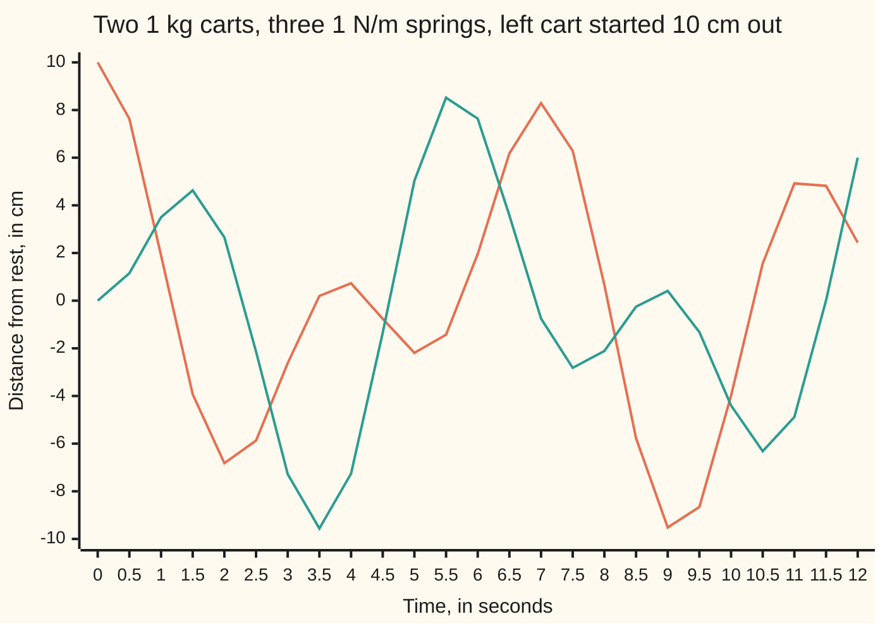

# Normal modes: two connected springs vibrate in a few pure patterns, and every motion mixes them

[Syllabus](../../../SYLLABUS.md) → [Differential equations and dynamics](../../../SYLLABUS.md#w08) → [Systems and the Matrix Exponential](../../../SYLLABUS.md#w08-s04) → Normal modes

---

## General Overview

Two 1 kg carts sit on a smooth track between two walls. Three springs join wall, cart, cart, wall, each of stiffness 1 N/m: stretched a metre, it pulls back one newton. Pull the left cart 10 cm to the right, hold the right cart where it is, and let go.

The motion looks untidy: the two carts trade swings with no obvious rhythm. Yet two starts give perfect order. Pull both carts 10 cm right and they swing together, once every 6.283 s. Pull them 10 cm each in opposite directions and they swing as mirror images, once every 3.628 s.

Those two patterns are the **normal modes**: shapes the system keeps while it oscillates, each with its own frequency. The untidy motion is half of one plus half of the other, both running at once.

**Every motion of a set of masses joined by springs is a sum of normal modes; the modes are the eigenvectors of the stiffness matrix (taken against the mass matrix when masses differ), and each one oscillates at the square root of its eigenvalue.**

**What kind of fact this is:** a theorem, proved below for any number of masses.

### The picture: the left cart pulled alone



Orange: the left cart. Teal: the right cart. Neither curve ever repeats exactly: the two periods are in the ratio √3, not a fraction.

---

## The formula

Notation first, in words. The carts' distances from rest, in cm, form one vector $x$ with entries $x_1$ (left) and $x_2$ (right). A prime is a rate, as for x' = Ax on [From one equation to a system](01-from-one-equation-to-a-system.md), so x'' is the rate of the rate: acceleration. Newton's law, mass times acceleration equals force, for both carts at once:

$$M\,x'' = -K\,x$$

**Read it aloud:** the masses times the accelerations equal minus the stiffness matrix times the displacements; the springs pull every cart back toward rest.

For the carts, $M$ is the identity (both 1 kg) and

$$K = \begin{pmatrix} 2 & -1 \\ -1 & 2 \end{pmatrix}, \qquad x_1'' = -2x_1 + x_2, \qquad x_2'' = x_1 - 2x_2 .$$

A normal mode is a vector $v$ and a number $\lambda$ with

$$K\,v = \lambda\,M\,v, \qquad \omega = \sqrt{\lambda},$$

and every motion from rest at $x(0)$ is a sum of modes:

$$x(t) = \sum_i c_i \cos(\omega_i t)\, v_i, \qquad c_i = \frac{x(0)\cdot v_i}{v_i \cdot v_i} \quad (M = I,\ v_i \text{ perpendicular}).$$

**Read it aloud:** split the start into its mode shapes, let each shape swing at its own frequency, and add them back up.

| Symbol | Plain meaning | In our example | Push it up and the answer… |
| --- | --- | --- | --- |
| $t$ | time since release, in s | 0 to 12 s | — |
| $x$, $x_1$, $x_2$ | each cart's distance from rest, in cm | start (10, 0) | — |
| $M$ | mass matrix: the masses on its diagonal | identity, 1 kg each | lower frequencies |
| $K$, $k$ | stiffness matrix, built from the spring stiffnesses $k$ | `[[2, -1], [-1, 2]]`, k = 1 N/m | higher frequencies |
| $\lambda$ | eigenvalue: the squared frequency of one mode, in 1/s^2 | 1 and 3 | a faster mode |
| $\omega$, $\omega_i$ | a mode's angular frequency, in rad/s; its period is 2π/ω | 1 and 1.732 | shorter period |
| $v$, $v_1$, $v_2$, $v_i$ | a mode shape: the carts' relative movements | (1, 1) and (1, −1) | — |
| $q_1$, $q_2$, $q_i$, $c_i$, $A_i$, $B_i$ | amount of mode i at time t, in cm; $c_i$ at the start | shares 5 and 5 | that mode dominates |

A start with speed adds a sine per mode: $A_i \cos \omega_i t + B_i \sin \omega_i t$, with $A_i = c_i$ and $B_i$ the starting speed's share over $\omega_i$.

### When it holds

- **Springs obey Hooke's law** (force in proportion to stretch). Stretched near its limit a spring stiffens, frequencies drift with the amplitude, and modes trade energy.
- **No friction.** With friction the modes decay, and in general they couple; the analysis moves to complex eigenvalues of the first-order system ([Complex eigenvalues](03-complex-eigenvalues-and-spirals.md)).
- **K symmetric and positive definite.** Symmetric: the middle spring pulls both carts equally. Positive definite: every displacement stores energy. A direction storing negative energy, like a pendulum balanced upside down, has a negative eigenvalue and grows exponentially instead of swinging.

---

## Why it works

### Step 0: in a mode, the spring force points back along the displacement

Push both carts 10 cm right. The middle spring is unstretched, so each cart feels only its wall spring and swings like a lone cart at $\omega = \sqrt{k/m} = 1$ rad/s. Push them 10 cm each in opposite directions. The middle spring, stretched or squeezed 20 cm, adds 0.2 N to the wall's 0.1 N: triple the stiffness, frequency $\sqrt{3} = 1.732$ rad/s.

Either way the force is a multiple of the displacement, so the pattern keeps its shape: $Kv = \lambda v$ read as physics.

### Step 1: find the modes

Eigenvalues of $K$ solve det(K − λI) = 0 ([The eigenvalue method](02-the-eigenvalue-method.md)): λ^2 − 4λ + 3 = 0, so λ = 1 or 3. The first row of (K − λI)v = 0 then gives v = (1, 1) and v = (1, −1), which are perpendicular: 1 × 1 + 1 × (−1) = 0.

### Step 2: in mode coordinates the equations come apart

Write the motion as $x = q_1 v_1 + q_2 v_2$, with $q_1$ and $q_2$ changing in time. Substitute into $x'' = -Kx$:

q₁'' v₁ + q₂'' v₂ = −λ₁ q₁ v₁ − λ₂ q₂ v₂.

Dot both sides with $v_1$. Since $v_1 \cdot v_2 = 0$, the $v_2$ terms drop out: q₁'' = −λ₁ q₁. Likewise q₂'' = −λ₂ q₂. Two coupled equations have become two lone springs, each solved by a cosine and a sine at frequency √λ.

### Step 3: fit the start

From rest, only cosines appear. Dotting x(0) = c₁v₁ + c₂v₂ with each mode gives $c_i = x(0)\cdot v_i / (v_i \cdot v_i)$, here 10/2 = 5 for both. So

x₁(t) = 5 cos t + 5 cos(1.732 t), x₂(t) = 5 cos t − 5 cos(1.732 t) cm.

At t = 0 these give 10 and 0.

### Step 4: each mode keeps its own energy

Energy is half of each mass times its squared speed, summed, plus $\tfrac12 x\cdot Kx$ ([Quadratic forms](../../03-Algebra/07-Eigenvalues%20and%20Symmetric%20Matrices/05-quadratic-forms-and-positive-definite.md)). At release, in metres, that is ½ × 2 × 0.1^2 J = 10 mJ. Perpendicular modes leave no cross terms, so it splits into ½ × λ × 2 × 0.05^2 J per mode: 2.50 mJ slow, 7.50 mJ fast, each fixed forever.

<details>
<summary>Detailed proof: n masses, any positive masses</summary>

Let $M$ be diagonal with positive masses, $K$ symmetric positive definite, both n by n. With y = M^(1/2) x, y'' = −S y where S = M^(−1/2) K M^(−1/2) is symmetric positive definite.

By the spectral theorem ([The spectral theorem](../../03-Algebra/07-Eigenvalues%20and%20Symmetric%20Matrices/04-spectral-theorem.md)) S has n perpendicular unit eigenvectors uᵢ with real eigenvalues λᵢ, each positive since λ = u·Su > 0.

Write y = Σ qᵢ uᵢ. Dotting y'' = −Sy with uᵢ gives qᵢ'' = −λᵢ qᵢ, solved exactly by Aᵢ cos(ωᵢt) + Bᵢ sin(ωᵢt), ωᵢ = √λᵢ, with Aᵢ = y(0)·uᵢ and Bᵢ = y'(0)·uᵢ / ωᵢ. Solutions from a given start are unique, so every motion has this form.

Back in x, vᵢ = M^(−1/2) uᵢ satisfies K vᵢ = λᵢ M vᵢ and vᵢ · M vⱼ = 0 for i ≠ j. With M = I this is the card's formula.

</details>

A second road writes four first-order equations for positions and speeds and uses [The matrix exponential](04-the-matrix-exponential.md); its eigenvalues ±i and ±i√3 carry the same two frequencies.

---

## Worked numbers, by hand

| Step | Arithmetic | Value |
| --- | --- | --- |
| forces on the left cart | −1 × x₁ + 1 × (x₂ − x₁) | −2x₁ + x₂ |
| eigenvalues | λ^2 − 4λ + 3 = (λ − 1)(λ − 3) | 1 and 3 |
| mode shapes | first row of K − λI | (1, 1) and (1, −1) |
| frequencies | √1 and √3 | 1.000 and 1.732 rad/s |
| periods | 2π/1 and 2π/1.732 | 6.283 and 3.628 s |
| shares of (10, 0) | 10/2 and 10/2 | 5 and 5 cm |
| left cart at 10 s | 5 cos 10 + 5 cos 17.32 | **−3.987 cm** |
| right cart at 10 s | 5 cos 10 − 5 cos 17.32 | **−4.404 cm** |
| energy | ½ × 2 × 0.1^2 J, split 1 : 3 | 10.00 = 2.50 + 7.50 mJ |

Ten seconds after release both carts sit about 4 cm left of rest.

**A second case: a weak middle spring**, 0.05 N/m. Eigenvalues 1.00 and 1.10, frequencies 1.000 and 1.0488 rad/s, shares 5 and 5. The cosines drift apart slowly, and 5 cos t + 5 cos 1.0488t = 10 cos(0.0244 t) cos(1.0244 t): a fast swing inside a slow **envelope**. The left cart's swing is at most |10 cos(0.0244 t)| cm, zero at t = π/0.0488 = 64.37 s. Near then the left cart moves at most 0.77 cm and the right swings 10.00 cm: the motion has crossed the weak spring.

### What breaks if you drop a piece

| Mistake | Comes out at | What went wrong |
| --- | --- | --- |
| Eigenvalue used as frequency | fast period 2.094 s, not 3.628 | λ is ω squared |
| Shares taken as x(0)·v, not divided by v·v | 10 and 10: x₁ starts at 20 cm | (1, 1) has length √2, not 1 |
| Wall springs left out of K | frequencies 0.000 and 1.414 rad/s | a mode with no restoring force: the pair drifts |
| Plain Euler steps of 0.1 s for 20 s | energy 2788 mJ, not 10 | Euler's rule adds energy to every oscillation |

The code prints all four.

---

## Code, from first principles, and it actually runs

Road one finds the eigenvalues, checks the mode shapes against $K$, and sums the modes. Road two uses no eigenvalues: Euler's rule (new value = old value + step length × rate, [Euler's method](../05-Numerical%20Evolution/01-eulers-method.md)) steps positions and speeds, its error halving with the step, and the periods are timed from zero crossings of x₁ + x₂ and x₁ − x₂. Euler also runs the weak-spring case against the envelope formula.

### Python

```python
# Normal modes -- the check behind the card.  Standard library only.  Two 1 kg
# carts, three springs of 1 N/m: x'' = -K x, K = [[2, -1], [-1, 2]]; cart 1 starts
# 10 cm out, cart 2 in place, both still.  Road one: eigenvalues and modes of K,
# then the mode sum.  Road two: plain Euler steps, with periods timed from them.
import math
def modes(a, b, d):                    # K = [[a, b], [b, d]]: roots of l^2 - (a + d) l + ad - b^2
    r = math.sqrt((a + d) ** 2 - 4 * (a * d - b * b))
    return [(l, (1.0, (l - a) / b)) for l in ((a + d - r) / 2, (a + d + r) / 2)]
def exact(K, x0, t):                   # the mode sum, started from rest at x0
    x = [0.0, 0.0]
    for l, v in modes(*K):
        c = (x0[0] * v[0] + x0[1] * v[1]) / (v[0] ** 2 + v[1] ** 2)
        x = [x[i] + c * v[i] * math.cos(math.sqrt(l) * t) for i in range(2)]
    return x
def euler(K, x0, t_end, h, watch=None):   # x' = v, v' = -K x, one small step at a time
    (a, b, d), (x1, x2), v1, v2 = K, x0, 0.0, 0.0
    for n in range(round(t_end / h)):
        x1, x2, v1, v2 = x1 + h * v1, x2 + h * v2, v1 - h * (a * x1 + b * x2), v2 - h * (b * x1 + d * x2)
        if watch: watch((n + 1) * h, x1, x2)
    return x1, x2, v1, v2
def energy(K, s):                      # mJ, with x in cm and v in cm/s
    x1, x2, v1, v2 = s
    return 0.05 * (v1 * v1 + v2 * v2 + K[0] * x1 * x1 + 2 * K[1] * x1 * x2 + K[2] * x2 * x2)
K, X0, H = (2.0, -1.0, 2.0), (10.0, 0.0), 1e-4
(l1, u), (l2, w) = modes(*K)
res = max(abs(K[0] * v[0] + K[1] * v[1] - l * v[0]) + abs(K[1] * v[0] + K[2] * v[1] - l * v[1]) for l, v in modes(*K))
cross, last = ([], []), [10.0, 10.0]   # zero crossings of x1 + x2 and of x1 - x2
def watch(t, x1, x2):
    for j, val in enumerate((x1 + x2, x1 - x2)):
        if val * last[j] < 0: cross[j].append(t - H * val / (val - last[j]))
        last[j] = val
euler(K, X0, 20, H, watch)
per = [2 * (c[-1] - c[0]) / (len(c) - 1) for c in cross]
errs = [abs(euler(K, X0, 10, h)[0] - exact(K, X0, 10)[0]) for h in (0.01, 0.005, 0.0025)]
ts, fine = [i / 2 for i in range(25)], euler(K, X0, 10, 1e-5)
W = (1.05, -0.05, 1.05)                # weak middle spring, 0.05 N/m: the carts trade the motion
dw = math.sqrt(modes(*W)[1][0]) - math.sqrt(modes(*W)[0][0]); T = math.pi / dw
peak = [0.0, 0.0]
def watch_w(t, x1, x2):
    if abs(t - T) < math.pi: peak[0], peak[1] = max(peak[0], abs(x1)), max(peak[1], abs(x2))
euler(W, X0, T + math.pi, 1e-5, watch_w)
print(f"trace {K[0] + K[2]:.0f}, determinant {K[0] * K[2] - K[1] ** 2:.0f}: eigenvalues {l1:.0f} and {l2:.0f}, modes {u} and {w}")
print(f"largest |K v - lambda v| {res:.12f}; modes' dot product {u[0] * w[0] + u[1] * w[1]:.0f}; frequencies {math.sqrt(l1):.3f} and {math.sqrt(l2):.3f} rad/s; periods {2 * math.pi / math.sqrt(l1):.3f} and {2 * math.pi / math.sqrt(l2):.3f} s")
print(f"start (10, 0) cm = 5 x (1, 1) + 5 x (1, -1); energy {energy(K, (*X0, 0, 0)):.2f} mJ = {0.5 * l1 * 50 * 0.1:.2f} slow + {0.5 * l2 * 50 * 0.1:.2f} fast")
print("t (s)  ", " ".join(f"{t:g}" for t in ts))
for i in range(2): print(f"x{i + 1} (cm)", " ".join(f"{exact(K, X0, t)[i]:.2f}" for t in ts))
print(f"t = 10 s: mode sum x1 {exact(K, X0, 10)[0]:.3f}, x2 {exact(K, X0, 10)[1]:.3f} cm; Euler h = 0.00001 x1 {fine[0]:.3f}, x2 {fine[1]:.3f} cm")
print("Euler error in x1 at t = 10, h = 0.01, 0.005, 0.0025:", " ".join(f"{e:.4f}" for e in errs), f"ratios {errs[0] / errs[1]:.2f} {errs[1] / errs[2]:.2f}")
print(f"periods timed from Euler's zero crossings: x1 + x2 {per[0]:.3f} s, x1 - x2 {per[1]:.3f} s")
print(f"weak middle spring: eigenvalues {modes(*W)[0][0]:.2f} and {modes(*W)[1][0]:.2f}, frequencies {math.sqrt(modes(*W)[0][0]):.3f} and {math.sqrt(modes(*W)[1][0]):.4f} rad/s; cart 1 hands over at pi/{dw:.4f} = {T:.2f} s")
print(f"within pi s of {T:.2f} s: largest |x1| {peak[0]:.2f} cm (envelope says <= {10 * math.sin(dw * math.pi / 2):.2f}), largest |x2| {peak[1]:.2f} cm")
print(f"mistake, eigenvalue as frequency: fast period 2 pi/3 = {2 * math.pi / 3:.3f} s, not {2 * math.pi / math.sqrt(3):.3f}")
print(f"mistake, share without dividing by |v|^2: {X0[0] * u[0] + X0[1] * u[1]:.0f} x (1, 1) + {X0[0] * w[0] + X0[1] * w[1]:.0f} x (1, -1) starts x1 at {X0[0] * u[0] + X0[1] * u[1] + X0[0] * w[0] + X0[1] * w[1]:.0f} cm")
print(f"mistake, wall springs dropped: frequencies {math.sqrt(modes(1.0, -1.0, 1.0)[0][0]):.3f} and {math.sqrt(modes(1.0, -1.0, 1.0)[1][0]):.3f} rad/s")
print(f"mistake, Euler with h = 0.1 to t = 20: energy {energy(K, euler(K, X0, 20, 0.1)):.0f} mJ, not 10")
assert res < 1e-12 and abs(per[0] - 2 * math.pi) < 1e-3 and abs(per[1] - 2 * math.pi / math.sqrt(3)) < 1e-3
assert abs(fine[0] - exact(K, X0, 10)[0]) < 2e-3 and abs(fine[1] - exact(K, X0, 10)[1]) < 2e-3
assert all(1.8 < errs[i] / errs[i + 1] < 2.3 for i in range(2))      # error halves with h: order one
assert peak[1] > 9.5 and peak[0] <= 10 * math.sin(dw * math.pi / 2) + 0.02
print("ALL CHECKS PASS")
```

**Ran 2026-09-28 on macOS, Python 3.14.6, standard library only. All checks passed. Output, pasted from the run:**

```
trace 4, determinant 3: eigenvalues 1 and 3, modes (1.0, 1.0) and (1.0, -1.0)
largest |K v - lambda v| 0.000000000000; modes' dot product 0; frequencies 1.000 and 1.732 rad/s; periods 6.283 and 3.628 s
start (10, 0) cm = 5 x (1, 1) + 5 x (1, -1); energy 10.00 mJ = 2.50 slow + 7.50 fast
t (s)   0 0.5 1 1.5 2 2.5 3 3.5 4 4.5 5 5.5 6 6.5 7 7.5 8 8.5 9 9.5 10 10.5 11 11.5 12
x1 (cm) 10.00 7.63 1.90 -3.93 -6.82 -5.87 -2.62 0.20 0.73 -0.76 -2.19 -1.43 1.96 6.18 8.29 6.29 0.66 -5.77 -9.52 -8.66 -3.99 1.56 4.92 4.82 2.44
x2 (cm) 0.00 1.15 3.50 4.63 2.66 -2.14 -7.28 -9.56 -7.26 -1.35 5.03 8.52 7.64 3.58 -0.75 -2.82 -2.11 -0.25 0.41 -1.32 -4.40 -6.32 -4.88 0.01 6.00
t = 10 s: mode sum x1 -3.987, x2 -4.404 cm; Euler h = 0.00001 x1 -3.987, x2 -4.404 cm
Euler error in x1 at t = 10, h = 0.01, 0.005, 0.0025: 0.1923 0.0925 0.0454 ratios 2.08 2.04
periods timed from Euler's zero crossings: x1 + x2 6.283 s, x1 - x2 3.628 s
weak middle spring: eigenvalues 1.00 and 1.10, frequencies 1.000 and 1.0488 rad/s; cart 1 hands over at pi/0.0488 = 64.37 s
within pi s of 64.37 s: largest |x1| 0.77 cm (envelope says <= 0.77), largest |x2| 10.00 cm
mistake, eigenvalue as frequency: fast period 2 pi/3 = 2.094 s, not 3.628
mistake, share without dividing by |v|^2: 10 x (1, 1) + 10 x (1, -1) starts x1 at 20 cm
mistake, wall springs dropped: frequencies 0.000 and 1.414 rad/s
mistake, Euler with h = 0.1 to t = 20: energy 2788 mJ, not 10
ALL CHECKS PASS
```

### Rust

Same numbers, same labels, built with `rustc --edition 2021 -O`.

```rust
// Normal modes -- the same check as the Python, in Rust.  No crates.  Two 1 kg
// carts, three springs of 1 N/m: x'' = -K x, K = [[2, -1], [-1, 2]]; cart 1 starts
// 10 cm out, cart 2 in place, both still.  Road one: eigenvalues and modes of K,
// then the mode sum.  Road two: plain Euler steps, with periods timed from them.
use std::f64::consts::PI;
type Mat = (f64, f64, f64); // K = [[a, b], [b, d]]

fn modes(k: Mat) -> [(f64, (f64, f64)); 2] { // roots of l^2 - (a + d) l + ad - b^2
    let (a, b, d) = k;
    let r = ((a + d).powi(2) - 4.0 * (a * d - b * b)).sqrt();
    let (l1, l2) = ((a + d - r) / 2.0, (a + d + r) / 2.0);
    [(l1, (1.0, (l1 - a) / b)), (l2, (1.0, (l2 - a) / b))]
}
fn exact(k: Mat, x0: (f64, f64), t: f64) -> (f64, f64) { // the mode sum, started from rest at x0
    let mut x = (0.0, 0.0);
    for (l, v) in modes(k) {
        let c = (x0.0 * v.0 + x0.1 * v.1) / (v.0 * v.0 + v.1 * v.1);
        x = (x.0 + c * v.0 * (l.sqrt() * t).cos(), x.1 + c * v.1 * (l.sqrt() * t).cos());
    }
    x
}
fn euler(k: Mat, x0: (f64, f64), t_end: f64, h: f64, watch: &mut dyn FnMut(f64, f64, f64)) -> [f64; 4] {
    let ((a, b, d), (mut x1, mut x2), mut v1, mut v2) = (k, x0, 0.0, 0.0); // x' = v, v' = -K x
    for n in 0..(t_end / h).round() as usize {
        (x1, x2, v1, v2) = (x1 + h * v1, x2 + h * v2, v1 - h * (a * x1 + b * x2), v2 - h * (b * x1 + d * x2));
        watch((n + 1) as f64 * h, x1, x2);
    }
    [x1, x2, v1, v2]
}
fn energy(k: Mat, s: [f64; 4]) -> f64 { // mJ, with x in cm and v in cm/s
    let [x1, x2, v1, v2] = s;
    0.05 * (v1 * v1 + v2 * v2 + k.0 * x1 * x1 + 2.0 * k.1 * x1 * x2 + k.2 * x2 * x2)
}
fn main() {
    let (k, x0, hw): (Mat, (f64, f64), f64) = ((2.0, -1.0, 2.0), (10.0, 0.0), 1e-4);
    let [(l1, u), (l2, w)] = modes(k);
    let res = modes(k).iter().map(|&(l, v)| (k.0 * v.0 + k.1 * v.1 - l * v.0).abs() + (k.1 * v.0 + k.2 * v.1 - l * v.1).abs()).fold(0.0, f64::max);
    let (mut cross, mut last): ([Vec<f64>; 2], [f64; 2]) = ([vec![], vec![]], [10.0, 10.0]); // zero crossings of x1 + x2, x1 - x2
    euler(k, x0, 20.0, hw, &mut |t, x1, x2| {
        for (j, val) in [x1 + x2, x1 - x2].into_iter().enumerate() {
            if val * last[j] < 0.0 { cross[j].push(t - hw * val / (val - last[j])) }
            last[j] = val;
        }
    });
    let per: Vec<f64> = cross.iter().map(|c| 2.0 * (c[c.len() - 1] - c[0]) / (c.len() - 1) as f64).collect();
    let errs: Vec<f64> = [0.01, 0.005, 0.0025].iter().map(|&h| (euler(k, x0, 10.0, h, &mut |_, _, _| {})[0] - exact(k, x0, 10.0).0).abs()).collect();
    let fine = euler(k, x0, 10.0, 1e-5, &mut |_, _, _| {});
    let ts: Vec<f64> = (0..25).map(|i| i as f64 / 2.0).collect();
    let wk: Mat = (1.05, -0.05, 1.05); // weak middle spring, 0.05 N/m: the carts trade the motion
    let dw = modes(wk)[1].0.sqrt() - modes(wk)[0].0.sqrt();
    let big_t = PI / dw;
    let mut peak = [0.0f64, 0.0f64];
    euler(wk, x0, big_t + PI, 1e-5, &mut |t, x1, x2| {
        if (t - big_t).abs() < PI { peak = [peak[0].max(x1.abs()), peak[1].max(x2.abs())] }
    });
    let e10 = exact(k, x0, 10.0);
    let (su, sw) = (x0.0 * u.0 + x0.1 * u.1, x0.0 * w.0 + x0.1 * w.1);
    let drop = modes((1.0, -1.0, 1.0));
    println!("trace {:.0}, determinant {:.0}: eigenvalues {:.0} and {:.0}, modes {:?} and {:?}", k.0 + k.2, k.0 * k.2 - k.1 * k.1, l1, l2, u, w);
    println!("largest |K v - lambda v| {:.12}; modes' dot product {:.0}; frequencies {:.3} and {:.3} rad/s; periods {:.3} and {:.3} s",
             res, u.0 * w.0 + u.1 * w.1, l1.sqrt(), l2.sqrt(), 2.0 * PI / l1.sqrt(), 2.0 * PI / l2.sqrt());
    println!("start (10, 0) cm = 5 x (1, 1) + 5 x (1, -1); energy {:.2} mJ = {:.2} slow + {:.2} fast", energy(k, [x0.0, x0.1, 0.0, 0.0]), 0.5 * l1 * 50.0 * 0.1, 0.5 * l2 * 50.0 * 0.1);
    println!("t (s)   {}", ts.iter().map(|t| format!("{}", t)).collect::<Vec<_>>().join(" "));
    println!("x1 (cm) {}", ts.iter().map(|&t| format!("{:.2}", exact(k, x0, t).0)).collect::<Vec<_>>().join(" "));
    println!("x2 (cm) {}", ts.iter().map(|&t| format!("{:.2}", exact(k, x0, t).1)).collect::<Vec<_>>().join(" "));
    println!("t = 10 s: mode sum x1 {:.3}, x2 {:.3} cm; Euler h = 0.00001 x1 {:.3}, x2 {:.3} cm", e10.0, e10.1, fine[0], fine[1]);
    println!("Euler error in x1 at t = 10, h = 0.01, 0.005, 0.0025: {:.4} {:.4} {:.4} ratios {:.2} {:.2}", errs[0], errs[1], errs[2], errs[0] / errs[1], errs[1] / errs[2]);
    println!("periods timed from Euler's zero crossings: x1 + x2 {:.3} s, x1 - x2 {:.3} s", per[0], per[1]);
    println!("weak middle spring: eigenvalues {:.2} and {:.2}, frequencies {:.3} and {:.4} rad/s; cart 1 hands over at pi/{:.4} = {:.2} s", modes(wk)[0].0, modes(wk)[1].0, modes(wk)[0].0.sqrt(), modes(wk)[1].0.sqrt(), dw, big_t);
    println!("within pi s of {:.2} s: largest |x1| {:.2} cm (envelope says <= {:.2}), largest |x2| {:.2} cm", big_t, peak[0], 10.0 * (dw * PI / 2.0).sin(), peak[1]);
    println!("mistake, eigenvalue as frequency: fast period 2 pi/3 = {:.3} s, not {:.3}", 2.0 * PI / 3.0, 2.0 * PI / 3f64.sqrt());
    println!("mistake, share without dividing by |v|^2: {:.0} x (1, 1) + {:.0} x (1, -1) starts x1 at {:.0} cm", su, sw, su + sw);
    println!("mistake, wall springs dropped: frequencies {:.3} and {:.3} rad/s", drop[0].0.sqrt(), drop[1].0.sqrt());
    println!("mistake, Euler with h = 0.1 to t = 20: energy {:.0} mJ, not 10", energy(k, euler(k, x0, 20.0, 0.1, &mut |_, _, _| {})));
    assert!(res < 1e-12 && (per[0] - 2.0 * PI).abs() < 1e-3 && (per[1] - 2.0 * PI / 3f64.sqrt()).abs() < 1e-3);
    assert!((fine[0] - e10.0).abs() < 2e-3 && (fine[1] - e10.1).abs() < 2e-3);
    assert!((0..2).all(|i| errs[i] / errs[i + 1] > 1.8 && errs[i] / errs[i + 1] < 2.3)); // error halves with h: order one
    assert!(peak[1] > 9.5 && peak[0] <= 10.0 * (dw * PI / 2.0).sin() + 0.02);
    println!("ALL CHECKS PASS");
}
```

**Ran 2026-09-28 on macOS, rustc 1.98.1, no crates. All checks passed. Output, pasted from the run:**

```
trace 4, determinant 3: eigenvalues 1 and 3, modes (1.0, 1.0) and (1.0, -1.0)
largest |K v - lambda v| 0.000000000000; modes' dot product 0; frequencies 1.000 and 1.732 rad/s; periods 6.283 and 3.628 s
start (10, 0) cm = 5 x (1, 1) + 5 x (1, -1); energy 10.00 mJ = 2.50 slow + 7.50 fast
t (s)   0 0.5 1 1.5 2 2.5 3 3.5 4 4.5 5 5.5 6 6.5 7 7.5 8 8.5 9 9.5 10 10.5 11 11.5 12
x1 (cm) 10.00 7.63 1.90 -3.93 -6.82 -5.87 -2.62 0.20 0.73 -0.76 -2.19 -1.43 1.96 6.18 8.29 6.29 0.66 -5.77 -9.52 -8.66 -3.99 1.56 4.92 4.82 2.44
x2 (cm) 0.00 1.15 3.50 4.63 2.66 -2.14 -7.28 -9.56 -7.26 -1.35 5.03 8.52 7.64 3.58 -0.75 -2.82 -2.11 -0.25 0.41 -1.32 -4.40 -6.32 -4.88 0.01 6.00
t = 10 s: mode sum x1 -3.987, x2 -4.404 cm; Euler h = 0.00001 x1 -3.987, x2 -4.404 cm
Euler error in x1 at t = 10, h = 0.01, 0.005, 0.0025: 0.1923 0.0925 0.0454 ratios 2.08 2.04
periods timed from Euler's zero crossings: x1 + x2 6.283 s, x1 - x2 3.628 s
weak middle spring: eigenvalues 1.00 and 1.10, frequencies 1.000 and 1.0488 rad/s; cart 1 hands over at pi/0.0488 = 64.37 s
within pi s of 64.37 s: largest |x1| 0.77 cm (envelope says <= 0.77), largest |x2| 10.00 cm
mistake, eigenvalue as frequency: fast period 2 pi/3 = 2.094 s, not 3.628
mistake, share without dividing by |v|^2: 10 x (1, 1) + 10 x (1, -1) starts x1 at 20 cm
mistake, wall springs dropped: frequencies 0.000 and 1.414 rad/s
mistake, Euler with h = 0.1 to t = 20: energy 2788 mJ, not 10
ALL CHECKS PASS
```

The two outputs match line for line.

> [!TIP]
> **Try changing**
> Guess first, then run it.
> - **Pull both carts.** Set `X0` to `(10.0, 10.0)`. Only the slow mode is present; x₁ − x₂ never crosses zero, and the timing road stops the program with an index error.
> - **Stiffer walls.** Set `K` to `(3.0, -1.0, 3.0)`. Eigenvalues 2 and 4, periods 4.443 and 3.142 s; the Euler timing agrees, and the first assert, pinned to 6.283 and 3.628, stops the run.
> - **A finer bad step.** Change the last mistake's `0.1` to `0.01`. The energy falls from 2788 mJ to 17 mJ, still above 10: smaller steps slow the drift, never stop it.

---

## The usual mistake

> [!warning]
> **Reading the eigenvalue as the frequency.** The eigenvalues of $K$ are 1 and 3; the frequencies are their square roots, 1 and 1.732 rad/s. Differentiating cos(ωt) twice brings out ω^2, not ω. Taking 3 as the frequency gives a fast period of 2.094 s, not 3.628 s.
>
> - **One cart pulled, one mode.** A start of (10, 0) is 5 of each; only starts along (1, 1) or (1, −1) give one mode.
> - **Plain Euler on a long run.** Each step multiplies a mode's energy by 1 + (step × ω)^2: 200 steps of 0.1 s turn 10 mJ into 2788 mJ. The fix is on [Symplectic steps](../05-Numerical%20Evolution/07-symplectic-steps-for-oscillators.md).

---

## Where you meet it in real life

- **Buildings and bridges.** Floors are masses, columns springs. Engineers keep the lowest modes' periods away from those of wind and earthquakes; driving a mode at its own frequency is the resonance of [Forced systems](06-forced-systems-and-variation-of-constants.md).
- **Molecules.** Carbon dioxide is three masses joined by two bonds; its vibration patterns are normal modes, and infrared and Raman spectroscopy read their frequencies.

> **Say it back**
> Masses joined by springs obey M x'' = −K x. A normal mode is a shape K pushes straight back along itself, an eigenvector, and it swings at the square root of its eigenvalue. Two carts with three unit springs have modes (1, 1) at 1 rad/s and (1, −1) at 1.732 rad/s. Any start splits into mode shares by dot products; each swings on its own, and the sum is the motion. One cart pulled alone is half of each mode.

---

## What this builds on

- [The eigenvalue method](02-the-eigenvalue-method.md): solving a linear system by its eigenvectors.
- [The spectral theorem](../../03-Algebra/07-Eigenvalues%20and%20Symmetric%20Matrices/04-spectral-theorem.md): real eigenvalues and perpendicular eigenvectors, which let the equations come apart.
- [Quadratic forms](../../03-Algebra/07-Eigenvalues%20and%20Symmetric%20Matrices/05-quadratic-forms-and-positive-definite.md): x·Kx as stored energy, positive for every displacement, so every frequency is real.

## Where this goes next

- [Symplectic steps](../05-Numerical%20Evolution/07-symplectic-steps-for-oscillators.md): a step rule that keeps an oscillator's energy from creeping up, the fix for the 2788 mJ.
- Vibration modes: modes of real structures, with damping and a driving force.

---

## Sources

Verified 2026-09-28: every link below resolves to the publisher's page.

- MIT OpenCourseWare. *Physics III: Vibrations and Waves* (8.03SC), Fall 2016. [Course page](https://ocw.mit.edu/courses/8-03sc-physics-iii-vibrations-and-waves-fall-2016/). Lecture 4, "Coupled Oscillators, Normal Modes".
- Strang, Gilbert. *Differential Equations and Linear Algebra*. Wellesley-Cambridge Press, 2014. [Book website](https://math.mit.edu/~gs/dela/). Eigenvalues for systems, and positive definite matrices.
- Boyce, William E., Richard C. DiPrima and Douglas B. Meade. *Elementary Differential Equations*, 12th ed. Wiley, 2021. [Publisher page](https://www.wiley.com/en-us/Elementary+Differential+Equations%2C+12th+Edition-p-9781119777755). Chapter 7: linear systems solved by eigenvalues, spring-mass examples included.
