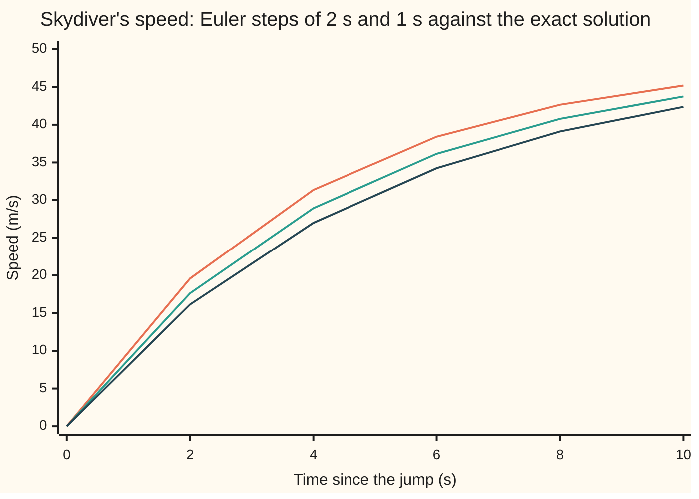
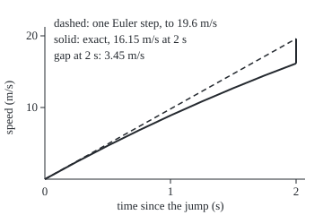

# Euler's method: step forward along the current slope, and the smaller the step the closer you land

Differential equations and dynamics → Numerical Evolution → Stepping along the slope → Euler's method

---

## General Overview

A skydiver leaves the plane at rest. Gravity adds 9.8 m/s of speed every second. Air drag takes away 0.2 m/s every second for each m/s already reached. At 49 m/s drag cancels gravity and the speed stops rising.

The rule gives a rate, never the speed itself. To get the speed at 10 s, read the rate now, assume it holds for the next 2 s, and move the speed that far: from rest, 2 × 9.8 = 19.6 m/s. Read the rate again at 19.6 m/s, which is lower because drag has grown, and step again. Five steps reach 10 s: 0, 19.60, 31.36, 38.42, 42.65, 45.19 m/s.

The exact answer is 42.37 m/s, so the steps overshoot by 2.82 m/s. Steps of 1 s overshoot by 1.37 m/s: half the step, about half the error. This walk along the slope is **Euler's method**, published by Leonhard Euler in 1768.

**Euler's method replaces the unknown curve by short straight pieces, each pointing along the slope the rule gives at its start; the error at a fixed time shrinks in proportion to the step.**

**What kind of fact this is:** a method. That its error is proportional to the step is a theorem, proved exactly for the skydiver in Why it works and in general in the folded proof.

### The picture: three answers for the same fall



From the top: Euler with 2 s steps (orange), with 1 s steps (green), and the exact speed (dark blue). The shorter step stays closer.

---

## The formula

Reminder: $y' = f(t, y)$ says the rate of the unknown $y$ at time $t$ is the rule $f$ applied to $t$ and $y$ ([what-a-differential-equation-says](../01-Rate%20Equations/01-what-a-differential-equation-says.md)). New here: the **step size** $h$, the time one step covers, and a small number written low after a letter to count steps: $y_n$ is the estimate after $n$ steps, at time $t_n$.

$$y_{n+1} = y_n + h\,f(t_n, y_n), \qquad t_{n+1} = t_n + h$$

**Read it aloud:** the next estimate is the present one plus the step length times the rate the rule gives right here.

For the skydiver the rule is $v' = 9.8 - 0.2v$, from $v = 0$ at $t = 0$, so each step reads $v_{n+1} = v_n + h\,(9.8 - 0.2\,v_n)$.

| Symbol | Plain meaning | In our example | Push it up and the answer… |
| --- | --- | --- | --- |
| $t$ | time since the jump, s | 0 to 10 | — |
| $v$, $v'$ | speed, m/s, and its rate, m/s per s | 0 and 9.8 at the jump | drag grows, rate falls |
| $y$, $f$ | any unknown, and the rule giving its rate | $v$ and 9.8 − 0.2$v$ | — |
| $h$ | step size: time covered by one step, s | 2, then 1 | error at 10 s grows in proportion |
| $n$ | number of steps taken | 0 to 5 at $h$ = 2 | — |
| $t_n$, $y_n$, $v_n$ | time and estimate after $n$ steps | 10 s and 45.19 m/s after 5 steps | — |
| $E$, $E_n$ | error: Euler minus exact, at the end or after $n$ steps | 2.82 m/s at $h$ = 2 | — |
| $L$, $M$ | how sharply the rule reacts to $y$; the true curve's largest bend | 0.2 per s; 1.96 m/s per s per s | the proved bound loosens |

### When it holds

- **The true curve bends a bounded amount $M$.** If the rule jumps, say when the parachute opens, the step across the jump loses accuracy.
- **The rule reacts to $y$ at a bounded rate $L$.** Then each step grows earlier error by at most a factor $1 + hL$. A leaking bucket whose rate is minus the square root of its height fails this near empty.
- **The step is short against the equation's own pace.** Each skydiver step multiplies the gap to 49 m/s by $1 - 0.2h$; past $h$ = 10 s that factor is below −1 and the steps swing and grow. See [stiff-equations-and-backward-euler](06-stiff-equations-and-backward-euler.md).
- **The step is not so short that rounding takes over.** Millions of tiny steps add millions of tiny rounding errors, so the error eventually stops falling.

---

## Why it works

### Step 0: over a short time, a curve is close to its tangent line

Near any point a smooth curve sits close to the line through that point with the curve's slope: its tangent line ([linear-approximation-and-related-rates](../../06-Calculus%20and%20analysis/03-What%20Derivatives%20Tell%20You/01-linear-approximation-and-related-rates.md)). The rate rule gives that slope without knowing the curve, so Euler's method is a chain of linear approximations.

### Step 1: one step's miss shrinks with the square of the step

The tangent misses by about half the curve's second derivative (how fast its slope changes) times the step squared. Leaving rest, the true speed bends below its tangent because drag builds. One step of 2 s misses by 3.45 m/s; steps of 1 s and 0.5 s miss by 0.92 and 0.24. Each halving cuts a single step's miss to roughly a quarter.

### The picture: the first 2 s step

<p align="center"></p>

To scale: 140 units per second across, 8 units per m/s up. The upright bar at 2 s is the first step's miss.

### Step 2: the misses add up to an error of order h

Reaching 10 s takes $10/h$ steps, each adding a miss of order $h^2$, so the total is of order $(10/h) \times h^2$: proportional to $h$. Halving the step halves the error at 10 s: 2.82, 1.37, 0.67, 0.33 m/s for steps of 2, 1, 0.5 and 0.25 s. Error proportional to $h$ makes a method **first order**; [local-and-global-error-and-order](02-local-and-global-error-and-order.md) makes the two kinds of error precise.

### Step 3: for the skydiver the steps have a closed form

Track the gap to terminal speed, $49 - v$. The step rule gives $49 - v_{n+1} = (1 - 0.2h)(49 - v_n)$: every step multiplies the gap by the same factor. From a gap of 49 at the jump,

$$v_n = 49\bigl(1 - (1 - 0.2h)^n\bigr), \qquad v(t) = 49\bigl(1 - e^{-0.2t}\bigr).$$

The left is Euler, the right the exact speed. Euler shrinks the gap once per step, as a bank compounds once per period; the exact curve is the limit of compounding ever more often. At $h$ = 2 the closed form gives 45.1898, the loop's value.

### Step 4: the error's size, not just its order

With $n = 10/h$ and $\ln(1 - x) \approx -x - x^2/2$ for small $x$, taking logarithms gives $(1 - 0.2h)^{10/h} \approx e^{-2}(1 - 0.2h)$ for small $h$. So the error at 10 s is close to $9.8\,e^{-2}\,h$, which is 1.3263 m/s per second of step. The measured error per second of step is 1.4106 at $h$ = 2 and 1.3373 at $h$ = 0.25, closing on that constant.

<details>
<summary>Detailed proof: the error bound for any rule</summary>

Let $y$ be the true solution on $0 \le t \le T$, with $|y''| \le M$ there and $|f(t, a) - f(t, b)| \le L\,|a - b|$ for any two values a and b. Write $E_n = y_n - y(t_n)$, Euler minus exact.

By Taylor's theorem with remainder, $y(t_{n+1}) = y(t_n) + h\,f(t_n, y(t_n)) + \tfrac{1}{2}h^2 y''(\xi)$ for some time ξ inside the step. Subtract it from the Euler step $y_{n+1} = y_n + h\,f(t_n, y_n)$:

$E_{n+1} = E_n + h\bigl(f(t_n, y_n) - f(t_n, y(t_n))\bigr) - \tfrac{1}{2}h^2 y''(\xi)$, so $|E_{n+1}| \le (1 + hL)|E_n| + \tfrac{1}{2}Mh^2$.

With $E_0 = 0$, unrolling gives $|E_n| \le \tfrac{1}{2}Mh^2 \bigl((1 + hL)^n - 1\bigr)/(hL)$. Since $1 + hL \le e^{hL}$ and $nh = t_n \le T$, this is at most $\dfrac{M}{2L}\bigl(e^{LT} - 1\bigr)\,h$.

For the skydiver, $L = 0.2$ and $v'' = -0.2\,v'$, largest at the jump: $M = 1.96$. The bound is 31.31 $h$ m/s against a true error near 1.33 $h$: loose, but proportional to $h$, for every rule meeting the two conditions.

</details>

The other road improves the slope instead of shrinking the step: reading the rate mid-step is [midpoint-and-heun-methods](03-midpoint-and-heun-methods.md), and four slopes per step is [runge-kutta-four](04-runge-kutta-four.md).

---

## Worked numbers, by hand

Steps of 2 s, rule $v' = 9.8 - 0.2v$. The bracket is gravity minus drag, 0.2 times the current speed.

| Step | Arithmetic | Value |
| --- | --- | --- |
| $t$ = 2 | 0 + 2 × (9.8 − 0) | 19.60 |
| $t$ = 4 | 19.60 + 2 × (9.8 − 3.92) | 31.36 |
| $t$ = 6 | 31.36 + 2 × (9.8 − 6.272) | 38.42 |
| $t$ = 8 | 38.42 + 2 × (9.8 − 7.683) | 42.65 |
| $t$ = 10 | 42.65 + 2 × (9.8 − 8.530) | **45.19** |
| exact at 10 s | 49 × (1 − e^(−2)) | 42.37 |
| error, $h$ = 2 | 45.19 − 42.37 | **2.82** |
| error, $h$ = 1 | 43.74 − 42.37 | **1.37** |

Ten seconds in, the skydiver is doing 42.37 m/s; 2 s steps say 45.19, and 1 s steps close half the gap.

### What breaks if you drop a piece

| Mistake | Comes out at | What went wrong |
| --- | --- | --- |
| Leave out $h$: five steps of $v + f$ | 32.94 m/s "at 10 s" | Each step moved one second's worth, not two |
| Never update the slope | 9.8 × 10 = 98.00 m/s | Drag is ignored; the speed passes terminal |
| Step of 15 s, past the limit of 10 s | −735.00 m/s at 60 s, exact 49.00 | Each step flips and doubles the gap to 49 |

The code prints all three.

---

## Code, from first principles, and it actually runs

Three roads: Euler's loop from rest; the exact speed $49(1 - e^{-0.2t})$, found by separating variables; and the loop's closed form from Step 3, which must match the loop to rounding. The asserts check that the error halves with the step, that the error per second of step closes on $9.8\,e^{-2}$, and that every error sits inside the proved bound. Chart points, figure coordinates and mistakes are all printed.

### Python

```python
# Euler's method -- the check behind the card.  Standard library only.
# The skydiver obeys v' = 9.8 - 0.2 v, v(0) = 0, time in s, speed in m/s.
# Road one: Euler's loop.  Road two: the exact solution 49 (1 - e^(-0.2 t)).
# Road three: the loop's own closed form, 49 (1 - (1 - 0.2 h)^n).
import math

def f(t, v):                                   # the rate law, m/s per s
    return 9.8 - 0.2 * v

def euler(h, t_end, rule=f):                   # step along the current slope
    t, v, path = 0.0, 0.0, [0.0]
    for _ in range(round(t_end / h)):
        v, t = v + h * rule(t, v), t + h
        path.append(v)
    return path

def exact(t):                                  # found by separating variables
    return 49 * (1 - math.exp(-0.2 * t))

def fmt(xs, d=2):
    return ", ".join(f"{x:.{d}f}" for x in xs)

hs, T = (2, 1, 0.5, 0.25), 10
errs = [euler(h, T)[-1] - exact(T) for h in hs]
print(f"euler, h = 2, t = 0, 2, ..., 10: {fmt(euler(2, T))}")
print(f"euler, h = 2, drag 0.2v at each step: {fmt((0.2 * v for v in euler(2, T)[:-1]), 3)}")
print(f"euler, h = 1, t = 0, 2, ..., 10: {fmt(euler(1, T)[::2])}")
print(f"exact, t = 0, 2, ..., 10: {fmt(exact(t) for t in range(0, 11, 2))}")
for h, e in zip(hs, errs):
    print(f"step {h}: euler v(10) = {euler(h, T)[-1]:.4f}, exact {exact(T):.4f}, "
          f"error {e:.4f}, error/h {e / h:.4f}")
ratios = [errs[i] / errs[i + 1] for i in range(3)]
print(f"error ratio each time the step halves: {fmt(ratios)}")
closed = [49 * (1 - (1 - 0.2 * h) ** round(T / h)) for h in hs]
print(f"closed form 49(1 - (1 - 0.2h)^n) at t = 10: {fmt(closed, 4)}")
local = [euler(h, h)[-1] - exact(h) for h in hs[:3]]
print(f"one step from rest, error at h = 2, 1, 0.5: {fmt(local, 4)}")
pred, fine = 9.8 * math.exp(-2), euler(0.001, T)[-1] - exact(T)
print(f"predicted error per second of step, 9.8 e^(-2): {pred:.4f}; "
      f"step 0.001 gives error {fine:.6f}")
L, M = 0.2, 1.96                               # rule's slope in v; largest |v''|
bound = M / (2 * L) * (math.exp(L * T) - 1)
print(f"guaranteed bound (M / 2L)(e^(LT) - 1) h with L = 0.2, M = 1.96: {bound:.2f} h")
X, Y = (lambda t: 50 + 140 * t), (lambda v: 200 - 8 * v)
curve = " ".join(f"{X(k / 4):.1f},{Y(exact(k / 4)):.1f}" for k in range(9))
print(f"figure, curve (px): {curve}")
print(f"figure, tangent end {X(2):.1f},{Y(19.6):.1f}; curve end {X(2):.1f},{Y(exact(2)):.1f}")
no_h = 0.0
for _ in range(5):                             # five steps, the h left out
    no_h = no_h + f(0, no_h)
print(f"mistake, h left out (five steps of v + f): 'v(10)' = {no_h:.2f}")
print(f"mistake, slope never updated: 9.8 x 10 = {9.8 * T:.2f}")
print(f"mistake, h = 15 past the limit 2 / 0.2 = {2 / 0.2:.0f}: v(60) = {euler(15, 60)[-1]:.2f}, "
      f"exact {exact(60):.2f}")
assert max(abs(euler(h, T)[-1] - c) for h, c in zip(hs, closed)) < 1e-9  # loop = closed form
assert all(1.9 < r < 2.2 for r in ratios)                  # first order: error halves
assert abs(fine / 0.001 - pred) / pred < 0.01              # error/h -> 9.8 e^(-2)
assert all(0 < e <= bound * h for h, e in zip(hs, errs))   # within the proved bound
print("ALL CHECKS PASS")
```

**Ran 2026-09-28 on macOS, Python 3.14.6, standard library only. All checks passed. Output, pasted from the run:**

```
euler, h = 2, t = 0, 2, ..., 10: 0.00, 19.60, 31.36, 38.42, 42.65, 45.19
euler, h = 2, drag 0.2v at each step: 0.000, 3.920, 6.272, 7.683, 8.530
euler, h = 1, t = 0, 2, ..., 10: 0.00, 17.64, 28.93, 36.15, 40.78, 43.74
exact, t = 0, 2, ..., 10: 0.00, 16.15, 26.98, 34.24, 39.11, 42.37
step 2: euler v(10) = 45.1898, exact 42.3686, error 2.8212, error/h 1.4106
step 1: euler v(10) = 43.7387, exact 42.3686, error 1.3701, error/h 1.3701
step 0.5: euler v(10) = 43.0427, exact 42.3686, error 0.6742, error/h 1.3483
step 0.25: euler v(10) = 42.7029, exact 42.3686, error 0.3343, error/h 1.3373
error ratio each time the step halves: 2.06, 2.03, 2.02
closed form 49(1 - (1 - 0.2h)^n) at t = 10: 45.1898, 43.7387, 43.0427, 42.7029
one step from rest, error at h = 2, 1, 0.5: 3.4457, 0.9178, 0.2370
predicted error per second of step, 9.8 e^(-2): 1.3263; step 0.001 gives error 0.001326
guaranteed bound (M / 2L)(e^(LT) - 1) h with L = 0.2, M = 1.96: 31.31 h
figure, curve (px): 50.0,200.0 85.0,180.9 120.0,162.7 155.0,145.4 190.0,128.9 225.0,113.3 260.0,98.4 295.0,84.2 330.0,70.8
figure, tangent end 330.0,43.2; curve end 330.0,70.8
mistake, h left out (five steps of v + f): 'v(10)' = 32.94
mistake, slope never updated: 9.8 x 10 = 98.00
mistake, h = 15 past the limit 2 / 0.2 = 10: v(60) = -735.00, exact 49.00
ALL CHECKS PASS
```

### Rust

Same numbers, same labels, built with `rustc --edition 2021 -O`.

```rust
// Euler's method -- the same check as the Python, in Rust, std only.
// The skydiver obeys v' = 9.8 - 0.2 v, v(0) = 0, time in s, speed in m/s.
// Road one: Euler's loop.  Road two: the exact solution 49 (1 - e^(-0.2 t)).
// Road three: the loop's own closed form, 49 (1 - (1 - 0.2 h)^n).

fn f(_t: f64, v: f64) -> f64 { 9.8 - 0.2 * v } // the rate law, m/s per s

fn euler(h: f64, t_end: f64) -> Vec<f64> {      // step along the current slope
    let (mut t, mut v, mut path) = (0.0, 0.0, vec![0.0]);
    for _ in 0..(t_end / h).round() as i32 {
        v += h * f(t, v);
        t += h;
        path.push(v);
    }
    path
}

fn exact(t: f64) -> f64 { 49.0 * (1.0 - (-0.2 * t).exp()) } // by separating variables

fn fmt(xs: &[f64], d: usize) -> String {
    xs.iter().map(|x| format!("{:.*}", d, x)).collect::<Vec<_>>().join(", ")
}

fn last(h: f64, t_end: f64) -> f64 { *euler(h, t_end).last().unwrap() }

fn main() {
    let (hs, tt) = ([2.0, 1.0, 0.5, 0.25], 10.0);
    let errs: Vec<f64> = hs.iter().map(|&h| last(h, tt) - exact(tt)).collect();
    println!("euler, h = 2, t = 0, 2, ..., 10: {}", fmt(&euler(2.0, tt), 2));
    let drag: Vec<f64> = euler(2.0, tt)[..5].iter().map(|v| 0.2 * v).collect();
    println!("euler, h = 2, drag 0.2v at each step: {}", fmt(&drag, 3));
    let fine1: Vec<f64> = euler(1.0, tt).into_iter().step_by(2).collect();
    println!("euler, h = 1, t = 0, 2, ..., 10: {}", fmt(&fine1, 2));
    let ex: Vec<f64> = (0..6).map(|k| exact(2.0 * k as f64)).collect();
    println!("exact, t = 0, 2, ..., 10: {}", fmt(&ex, 2));
    for (&h, &e) in hs.iter().zip(&errs) {
        println!("step {}: euler v(10) = {:.4}, exact {:.4}, error {:.4}, error/h {:.4}",
                 h, last(h, tt), exact(tt), e, e / h);
    }
    let ratios: Vec<f64> = (0..3).map(|i| errs[i] / errs[i + 1]).collect();
    println!("error ratio each time the step halves: {}", fmt(&ratios, 2));
    let closed: Vec<f64> =
        hs.iter().map(|&h| 49.0 * (1.0 - (1.0 - 0.2 * h).powi((tt / h).round() as i32))).collect();
    println!("closed form 49(1 - (1 - 0.2h)^n) at t = 10: {}", fmt(&closed, 4));
    let local: Vec<f64> = hs[..3].iter().map(|&h| last(h, h) - exact(h)).collect();
    println!("one step from rest, error at h = 2, 1, 0.5: {}", fmt(&local, 4));
    let (pred, fine) = (9.8 * (-2.0f64).exp(), last(0.001, tt) - exact(tt));
    println!("predicted error per second of step, 9.8 e^(-2): {:.4}; step 0.001 gives error {:.6}",
             pred, fine);
    let (l, m) = (0.2, 1.96);                   // rule's slope in v; largest |v''|
    let bound = m / (2.0 * l) * ((l * tt).exp() - 1.0);
    println!("guaranteed bound (M / 2L)(e^(LT) - 1) h with L = 0.2, M = 1.96: {:.2} h", bound);
    let (x, y) = (|t: f64| 50.0 + 140.0 * t, |v: f64| 200.0 - 8.0 * v);
    let curve: Vec<String> = (0..9)
        .map(|k| { let t = k as f64 / 4.0; format!("{:.1},{:.1}", x(t), y(exact(t))) }).collect();
    println!("figure, curve (px): {}", curve.join(" "));
    println!("figure, tangent end {:.1},{:.1}; curve end {:.1},{:.1}",
             x(2.0), y(19.6), x(2.0), y(exact(2.0)));
    let mut no_h = 0.0;
    for _ in 0..5 { no_h += f(0.0, no_h) }      // five steps, the h left out
    println!("mistake, h left out (five steps of v + f): 'v(10)' = {:.2}", no_h);
    println!("mistake, slope never updated: 9.8 x 10 = {:.2}", 9.8 * tt);
    println!("mistake, h = 15 past the limit 2 / 0.2 = {:.0}: v(60) = {:.2}, exact {:.2}",
             2.0 / 0.2, last(15.0, 60.0), exact(60.0));
    assert!(hs.iter().zip(&closed).all(|(&h, &c)| (last(h, tt) - c).abs() < 1e-9));
    assert!(ratios.iter().all(|&r| 1.9 < r && r < 2.2));   // first order: error halves
    assert!(((fine / 0.001 - pred) / pred).abs() < 0.01);  // error/h -> 9.8 e^(-2)
    assert!(hs.iter().zip(&errs).all(|(&h, &e)| 0.0 < e && e <= bound * h));
    println!("ALL CHECKS PASS");
}
```

**Ran 2026-09-28 on macOS, rustc 1.98.1, no crates. All checks passed. Output, pasted from the run:**

```
euler, h = 2, t = 0, 2, ..., 10: 0.00, 19.60, 31.36, 38.42, 42.65, 45.19
euler, h = 2, drag 0.2v at each step: 0.000, 3.920, 6.272, 7.683, 8.530
euler, h = 1, t = 0, 2, ..., 10: 0.00, 17.64, 28.93, 36.15, 40.78, 43.74
exact, t = 0, 2, ..., 10: 0.00, 16.15, 26.98, 34.24, 39.11, 42.37
step 2: euler v(10) = 45.1898, exact 42.3686, error 2.8212, error/h 1.4106
step 1: euler v(10) = 43.7387, exact 42.3686, error 1.3701, error/h 1.3701
step 0.5: euler v(10) = 43.0427, exact 42.3686, error 0.6742, error/h 1.3483
step 0.25: euler v(10) = 42.7029, exact 42.3686, error 0.3343, error/h 1.3373
error ratio each time the step halves: 2.06, 2.03, 2.02
closed form 49(1 - (1 - 0.2h)^n) at t = 10: 45.1898, 43.7387, 43.0427, 42.7029
one step from rest, error at h = 2, 1, 0.5: 3.4457, 0.9178, 0.2370
predicted error per second of step, 9.8 e^(-2): 1.3263; step 0.001 gives error 0.001326
guaranteed bound (M / 2L)(e^(LT) - 1) h with L = 0.2, M = 1.96: 31.31 h
figure, curve (px): 50.0,200.0 85.0,180.9 120.0,162.7 155.0,145.4 190.0,128.9 225.0,113.3 260.0,98.4 295.0,84.2 330.0,70.8
figure, tangent end 330.0,43.2; curve end 330.0,70.8
mistake, h left out (five steps of v + f): 'v(10)' = 32.94
mistake, slope never updated: 9.8 x 10 = 98.00
mistake, h = 15 past the limit 2 / 0.2 = 10: v(60) = -735.00, exact 49.00
ALL CHECKS PASS
```

The two outputs match line for line.

> [!TIP]
> **Try changing**
> - **Add 0.125 to the end of `hs`.** Guess the error at 10 s first. About half of 0.3343 m/s.
> - **Put 5 at the front of `hs`.** Guess first. The factor $1 - 0.2h$ is zero, so the first step lands on 49 m/s and stays. The error is more than twice the 2 s error, and the ratio assert stops the run.
> - **Read the rate at the end of the step instead**: in `euler`, replace `rule(t, v)` with `rule(t, v + h * rule(t, v))`. Guess the sign of the error. Negative: the later slope is too shallow. The first assert stops the run.

---

## The usual mistake

> [!warning]
> **Expecting a quarter of the error when the step halves.** One step's miss does fall to about a quarter, but twice as many steps are needed, so the error at 10 s only halves: 2.82 to 1.37 m/s. Ten times the accuracy costs ten times the steps. The other slips, a missing $h$, a frozen slope and a step past 10 s, are in the table above.

---

## Where you meet it in real life

- **Game engines.** Updating each position by velocity times frame time is Euler's step; orbits that drift outward are why [symplectic-steps-for-oscillators](07-symplectic-steps-for-oscillators.md) exists.
- **Pricing by simulation.** A share price stepped forward with a random kick each step is Euler with noise, [euler-maruyama-scheme](../../11-Stochastic%20processes%20and%20calculus/08-Generators%2C%20Densities%20and%20Simulation/04-euler-maruyama-scheme.md).
- **Solver software.** Adaptive solvers step with two methods of different order and read the error from their difference; the simplest pair is Euler beside Heun ([adaptive-step-size](05-adaptive-step-size.md)).

> **Say it back**
> Euler's method reads the rate now, assumes it holds for one short step, moves, and repeats. Each step misses by about the step squared, because the curve bends away from its tangent. A fixed time needs a number of steps inversely proportional to the step, so the final error is proportional to the step. For the skydiver, 2 s steps miss by 2.82 m/s at 10 s and 1 s steps by 1.37. Steps too long for the equation swing and grow.

---

## What this builds on

- [what-a-differential-equation-says](../01-Rate%20Equations/01-what-a-differential-equation-says.md): the rate rule and starting value that Euler steps.
- [linear-approximation-and-related-rates](../../06-Calculus%20and%20analysis/03-What%20Derivatives%20Tell%20You/01-linear-approximation-and-related-rates.md): the tangent line and its squared-step miss.

## Where this goes next

- [local-and-global-error-and-order](02-local-and-global-error-and-order.md): one step's miss against the accumulated error.
- [stiff-equations-and-backward-euler](06-stiff-equations-and-backward-euler.md): why long steps swing, and the Euler step that reads the end slope.
- [symplectic-steps-for-oscillators](07-symplectic-steps-for-oscillators.md): a reordered step that keeps a spring's energy.
- [euler-maruyama-scheme](../../11-Stochastic%20processes%20and%20calculus/08-Generators%2C%20Densities%20and%20Simulation/04-euler-maruyama-scheme.md): the same step with random noise added.
- runge-kutta-and-butcher-tableaux: Euler as the simplest entry in a table of methods.
- operator-splitting-and-the-trotter-formula: Step 3's compounding limit, for operators.
- geodesics-on-surfaces: shortest paths traced step by step.
- parallel-transport-and-holonomy: carrying a vector along a curve in small steps.

Euler's method gets one digit more accuracy only for ten times the work; how to measure a method's order, and why better slopes buy far more, is [local-and-global-error-and-order](02-local-and-global-error-and-order.md).

---

## Sources

Verified 28 Sep 2026: every link below opens a page naming the cited work.

- Euler, Leonhard. *Institutionum calculi integralis volumen primum*, 1768 (E342). [Euler Archive, University of the Pacific](https://scholarlycommons.pacific.edu/euler-works/342/). The method's first appearance.
- Hairer, Ernst, Syvert P. Nørsett and Gerhard Wanner. *Solving Ordinary Differential Equations I: Nonstiff Problems*, 2nd ed. Springer, 1993. [DOI](https://doi.org/10.1007/978-3-540-78862-1). The error bound built from $L$ and $M$, and the method's history.
- Butcher, John C. *Numerical Methods for Ordinary Differential Equations*, 3rd ed. Wiley, 2016. [Publisher page](https://www.wiley.com/en-us/Numerical+Methods+for+Ordinary+Differential+Equations%2C+3rd+Edition-p-9781119121503). One-step methods, their convergence and stability.
