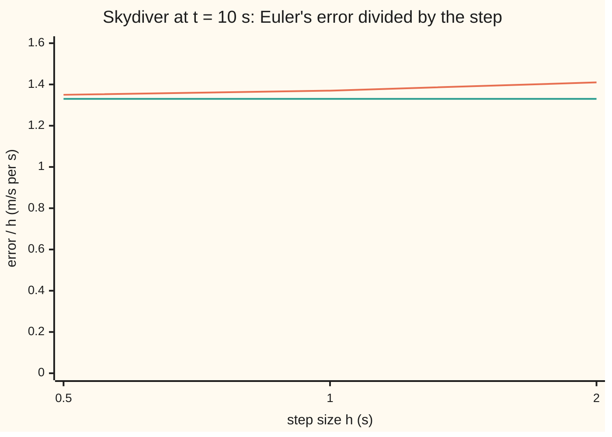

# Order of a method: the error of one step, how the errors pile up, and the number that says how fast they shrink

[Syllabus](../../../SYLLABUS.md) → [Differential equations and dynamics](../README.md) → [Numerical Evolution](../README.md#s05) → Order of a method

---

## General Overview

A skydiver jumps from rest. Gravity adds 9.8 m/s of speed each second; drag removes speed at 0.2 per second times the current speed. The speed climbs towards 49.0 m/s, where drag cancels gravity. At 10 s it is exactly 42.3686 m/s.

Euler's rule ([Euler's method](01-eulers-method.md)) holds the current rate for one step, then repeats. With 2 s steps it lands on 45.1898 m/s, off by 2.8212. With 1 s steps it is off by 1.3701; with 0.5 s steps, by 0.6742. Halve the step, halve the error.

Runge-Kutta four (RK4) reads the rate four times per step. With 2 s steps it is off by 0.0039558 m/s, and each halving divides that by about 17 to 19. The power that says how fast the error shrinks, 1 for Euler and 4 for RK4, is the method's **order**.

**One step misses by an amount that shrinks like a power of the step; a fixed stretch of time needs more steps as the step shrinks, so the total error shrinks one power more slowly, and that power is the order.**

**What kind of fact this is:** a theorem (Euler's total error shrinks in proportion to the step), proved on this card in Why it works; order itself is a definition.

### The picture: Euler's error per unit of step



Orange: Euler's error at 10 s divided by the step. Green: Step 2's prediction, 1.3263. Both stay nearly level as the step doubles, so the error is close to a fixed multiple of the step: the mark of order 1.

---

## The formula

Notation first, in words. The step size is $h$, in seconds. The run ends at $T$ = 10 s after $N = T/h$ steps. The rate law is $v' = f(t, v)$, read "the rate of the speed at time t is f"; here $f(t, v) = 9.8 - 0.2v$. Euler's value after $n$ steps is $v_n$, at time $t_n$, which is n times h. Two primes, $v''$, mean the rate of the rate: how fast the acceleration changes.

The **local error** $\ell$ is what one step misses when it starts from the exact value. Taylor's theorem with its remainder ([Taylor series](../../06-Calculus%20and%20analysis/06-Series/05-taylor-series.md)) sizes it:

$$\ell = \frac{h^2}{2}\,\lvert v''(\xi)\rvert \quad\text{for some time } \xi \text{ inside the step.}$$

**Read it aloud:** one Euler step misses by half the step squared, times how fast the acceleration changes somewhere in that step.

The **global error** $E$ is what the whole run misses at the end, $E(h) = \lvert v_N - v(T)\rvert$. A method has **order** $p$ when, for all small enough steps,

$$E(h) \le C\,h^{p}.$$

**Read it aloud:** the error at the finish is at most a fixed number times the step to the power p.

Two runs, the second with half the step, estimate $p$ without knowing $C$:

$$p \approx \log_2 \frac{E(h)}{E(h/2)}.$$

**Read it aloud:** the order is how many factors of 2 the error fell by.

| Symbol | Plain meaning | In our example | Push it up and the answer… |
| --- | --- | --- | --- |
| $h$ | step size | 2, 1 and 0.5 s | error grows like $h^p$ |
| $t$, $T$, $N$ | time; end time; number of steps | 10 s; $10/h$ steps | more steps carry more misses |
| $f$, $v$ | the rate law; the exact speed | $v(10) = 42.3686$ m/s | — |
| $v_n$, $t_n$, $n$ | Euler's speed after $n$ steps, and its time | 45.1898 m/s after five 2 s steps | — |
| $\ell$, $\xi$ | one step's miss; a time inside the step | 0.9178 m/s for $h = 1$ | grows like $h^2$ |
| $E$ | global error at the end time | 1.3701 m/s for $h = 1$ | — |
| $p$, $C$ | order; the fixed number in front | 1 and about 1.3263 for Euler | $p$ up: error falls faster |
| $M$, $L$ | largest size of $v''$; how strongly $f$ reacts to a change in $v$ | 1.96 m/s per s per s; 0.2 per s | bound loosens |

### When it holds

- **A smooth solution.** $v''$ must stay below some bound $M$. A parachute opening at 4.3 s makes the rate jump, and RK4's order estimates read 4.37, then −0.29.
- **Differences not magnified without limit.** Two nearby speeds must have rates differing by at most $L$ times their gap, or carried errors can grow without bound.
- **Small steps.** Order describes $h$ shrinking towards zero. Steps of 10 s and 5 s give Euler an estimated order of 3.07.
- **Exact arithmetic.** Rounding adds a little error per step, so below some very small step the total error rises again.

---

## Why it works

### Step 0: one small error per step, and many steps

A step misses by about $h^2$. Reaching 10 s takes $10/h$ steps, whose misses add up to about $10/h$ times $h^2$: a multiple of $h$.

### Step 1: one step's error, from Taylor's theorem

For a solution with two derivatives, Taylor's theorem with the remainder says

$$v(t+h) = v(t) + h\,v'(t) + \frac{h^2}{2}\,v''(\xi).$$

Euler keeps the first two terms and drops the last, so $\ell$ is that term's size.

For the skydiver $v(t) = 49(1 - e^{-0.2t})$, so $v'(t) = 9.8\,e^{-0.2t}$ and $v''(t) = -1.96\,e^{-0.2t}$. The acceleration falls as drag builds, so Euler overshoots. The largest size of $v''$ is $M = 1.96$, at the jump.

First step from rest with $h = 1$: Euler says 9.8000 m/s, the exact speed is 8.8822, the local error 0.9178. Taylor puts it between $\tfrac{1}{2}\cdot 1.96\,e^{-0.2}$ and $\tfrac{1}{2}\cdot 1.96 = 0.9800$. At $h = 0.5$ the local error is 0.2370, against 0.2450. The ratio is 3.87, near 4: one step's error has order 2.

### Step 2: carrying each step's error to the finish

The gap between two speeds obeying the drag law has rate $-0.2$ times itself, so it shrinks by the factor $e^{-0.2u}$ over u seconds.

The step at time $t$ misses by about $\tfrac{h^2}{2}\cdot 1.96\,e^{-0.2t}$. By 10 s that miss has shrunk by $e^{-0.2(10 - t)}$. Multiply:

$$\frac{h^2}{2}\cdot 1.96\,e^{-0.2t}\cdot e^{-0.2(10-t)} = \frac{h^2}{2}\cdot 1.96\,e^{-2}.$$

The time $t$ cancels: every step delivers the same share to the finish. With $10/h$ steps,

$$E(h) \approx \frac{10}{h}\cdot\frac{h^2}{2}\cdot 1.96\,e^{-2} = 1.3263\,h.$$

Predicted: 2.6526, 1.3263 and 0.6631 for steps of 2, 1 and 0.5 s. Actual: 2.8212, 1.3701 and 0.6742. The prediction drops the smaller $h^3$ terms, so it improves as $h$ shrinks.

### Step 3: the general bound, when errors are not forgotten

Most rate laws damp nothing. In general a gap grows by at most the factor $1 + Lh$ per step, and each step adds at most $\tfrac{h^2}{2}M$. Summing the resulting geometric series gives

$$E(h) \le \frac{M}{2L}\left(e^{LT} - 1\right) h.$$

A fixed number times $h$: Euler has order 1 whenever the conditions hold. For the skydiver that number is 31.31, against the true 1.3263: the bound assumes errors grow, while drag shrinks them.

<details>
<summary>Detailed proof: Euler's global error is at most a constant times h</summary>

Let $e_n = \lvert v_n - v(t_n)\rvert$, with $e_0 = 0$. The exact step is Euler's step from $v(t_n)$ plus a miss of size at most $\tfrac{h^2}{2}M$ (Step 1). Subtract it from Euler's actual step and bound the rate difference by $L e_n$:

$$e_{n+1} \le (1 + Lh)\,e_n + \tfrac{h^2}{2}M.$$

Unrolling from $e_0 = 0$ gives $e_n \le \tfrac{h^2}{2}M\,\sum_{j=0}^{n-1}(1+Lh)^j = \tfrac{hM}{2L}\big((1+Lh)^n - 1\big)$, a geometric sum. Since $1 + x \le e^x$, $(1+Lh)^n \le e^{LT}$, so every $e_n \le \tfrac{M}{2L}(e^{LT} - 1)\,h$. The general version is on From local error to global error.

</details>

### Step 4: the rule of one power

Steps 2 and 3 give the rule for any one-step method: a local miss of a constant times $h^{p+1}$, with gaps growing by at most $1 + Lh$ per step, makes a global miss of a constant times $h^p$. RK4's four readings cancel the Taylor terms through $h^4$, so it misses by about $h^5$ per step and $h^4$ per run ([Runge-Kutta four](04-runge-kutta-four.md)).

### Step 5: reading the order off two runs

If $E(h) \approx C h^p$, then $E(h/2) \approx C h^p / 2^p$. The ratio is $2^p$, and $C$ cancels; its base-2 logarithm is $p$.

For Euler, steps 2 and 1 give 1.04; steps 1 and 0.5 give 1.02. For RK4 the same pairs give 4.24 and 4.12, error ratios 18.9 and 17.4 against the ideal $2^4 = 16$. With no exact answer, three runs at $h$, $h/2$ and $h/4$ serve instead: the two differences between successive answers also shrink by about $2^p$.

---

## Worked numbers, by hand

| Step | Arithmetic | Value |
| --- | --- | --- |
| one Euler step from rest, $h = 1$ | $0 + 1 \times 9.8$ | 9.8000 m/s |
| its local error | $9.8000 - 8.8822$ | 0.9178 m/s |
| local error at $h = 0.5$, and the ratio | $0.9178 / 0.2370$ | 3.87, near $2^2$ |
| Euler at 10 s, $h = 1$ | ten steps | 43.7387 m/s, error 1.3701 |
| predicted global error | $\tfrac{10}{1}\cdot\tfrac{1}{2}\cdot 1.96\,e^{-2}$ | 1.3263 m/s |
| Euler at 10 s, $h = 0.5$ | twenty steps | error 0.6742 |
| order estimate | $\log_2(1.3701 / 0.6742)$ | **1.02** |

With half-second steps the skydiver's computed speed at 10 s is 0.6742 m/s too fast; halving the step again roughly halves that.

### What breaks if you drop a piece

| Mistake | Comes out at | What went wrong |
| --- | --- | --- |
| Local order 2 taken as global | guesses 0.7053 at $h = 1$; actual 1.3701 | one step's miss times $10/h$ steps |
| Order from steps of 10 s and 5 s | errors 55.6314 and 6.6314; order 3.07 | steps too large for $C h^p$ to apply |
| Parachute at 4.3 s: drag 0.2 jumps to 0.98 per s | RK4 errors 0.1732, 0.0084, 0.0102; estimates 4.37, −0.29 | the rate jumps, so smoothness fails |

---

## Code, from first principles, and it actually runs

Road one steps Euler and RK4 in a loop that calls the rate law. Road two never calls it: here each method multiplies the gap to 49 m/s by a fixed factor per step, $1 - 0.2h$ for Euler and $1 + z + z^2/2 + z^3/6 + z^4/24$ with $z = -0.2h$ for RK4, raised to the power $N$. Asserts check that the roads agree, that one-step errors sit inside Taylor's bracket, that the orders are near 1 and 4, and that Step 2's prediction is within 7%.

### Python

```python
# Order of a method -- the check behind the card.  Standard library only.
# The skydiver: v' = 9.8 - 0.2 v, v(0) = 0, exact v = 49 (1 - e^(-0.2 t)).
# Road one steps the rate law in a loop; road two uses each method's closed form.
from math import exp, log

G, K, T = 9.8, 0.2, 10.0                       # m/s^2, 1/s, s

def exact(t): return G / K * (1 - exp(-K * t))
def rate(t, v): return G - K * v
def euler(f, t, v, h): return v + h * f(t, v)
def rk4(f, t, v, h):
    k1 = f(t, v); k2 = f(t + h / 2, v + h / 2 * k1)
    k3 = f(t + h / 2, v + h / 2 * k2); k4 = f(t + h, v + h * k3)
    return v + h / 6 * (k1 + 2 * k2 + 2 * k3 + k4)
def run(step, f, h):                            # road one: N steps from rest
    v = 0.0
    for n in range(round(T / h)): v = step(f, n * h, v, h)
    return v
def closed(factor, h): return G / K * (1 - factor ** round(T / h))   # road two
def r4(z): return 1 + z + z * z / 2 + z ** 3 / 6 + z ** 4 / 24
def order(e): return [log(e[i] / e[i + 1], 2) for i in range(len(e) - 1)]

HS, vT, M = [2.0, 1.0, 0.5], exact(T), K * G    # M = size of v'' at t = 0
print(f"skydiver v' = 9.8 - 0.2v from rest; terminal {G / K:.1f} m/s; exact v(10) = {vT:.4f} m/s")
loc = []
for h in (1.0, 0.5):
    loc.append(euler(rate, 0, 0.0, h) - exact(h))
    print(f"one step h = {h}: Euler {h * G:.4f}, exact {exact(h):.4f}, local error "
          f"{loc[-1]:.4f}, Taylor h^2/2 x 1.96 = {h * h / 2 * M:.4f}")
print(f"local error ratio h = 1 over h = 0.5: {loc[0] / loc[1]:.2f}")
ee, er, pred = [], [], []
for h in HS:
    ee.append(run(euler, rate, h) - vT); er.append(abs(run(rk4, rate, h) - vT))
    pred.append(T / 2 * M * exp(-K * T) * h)
    print(f"Euler h = {h}: v(10) = {run(euler, rate, h):.4f}, closed form "
          f"{closed(1 - K * h, h):.4f}, error {ee[-1]:.4f}, predicted {pred[-1]:.4f}")
for h, e in zip(HS, er):
    print(f"RK4 h = {h}: v(10) = {run(rk4, rate, h):.7f}, closed form "
          f"{closed(r4(-K * h), h):.7f}, error {e:.7f}")
po, pr = order(ee), order(er)
print(f"order estimates, Euler: {po[0]:.2f}, {po[1]:.2f}; RK4: {pr[0]:.2f}, {pr[1]:.2f}")
print(f"error ratios per halving, RK4: {er[0] / er[1]:.1f}, {er[1] / er[2]:.1f}")
print(f"general bound (M/2L)(e^(LT) - 1) = {M / (2 * K) * (exp(K * T) - 1):.2f} per unit h")
print(f"chart, Euler error / h: {ee[2] / HS[2]:.2f}, {ee[1] / HS[1]:.2f}, "
      f"{ee[0] / HS[0]:.2f}; prediction / h: {pred[0] / HS[0]:.2f}")
print(f"mistake 1, local order 2 read as global: h = 1 guessed {ee[0] / 4:.4f}, actual {ee[1]:.4f}")
big = [abs(run(euler, rate, h) - vT) for h in (10.0, 5.0)]
print(f"mistake 2, h = 10 and 5: errors {big[0]:.4f}, {big[1]:.4f}, order estimate {order(big)[0]:.2f}")
TO, K2 = 4.3, 0.98                              # parachute opens at 4.3 s
def chute(t, v): return G - (K if t < TO else K2) * v
v2 = G / K2 + (exact(TO) - G / K2) * exp(-K2 * (T - TO))
ec = [abs(run(rk4, chute, h) - v2) for h in HS]
print(f"mistake 3, parachute at 4.3 s, exact v(10) = {v2:.4f}: RK4 errors "
      f"{ec[0]:.4f}, {ec[1]:.4f}, {ec[2]:.4f}; estimates {order(ec)[0]:.2f}, {order(ec)[1]:.2f}")
for h in HS: assert abs(run(euler, rate, h) - closed(1 - K * h, h)) + abs(run(rk4, rate, h)
                     - closed(r4(-K * h), h)) < 1e-9 * vT              # two roads agree
assert all(h * h / 2 * M * exp(-K * h) < e < h * h / 2 * M for h, e in zip((1, .5), loc))
assert all(0.9 < p < 1.1 for p in po) and all(3.9 < p < 4.4 for p in pr)  # orders 1, 4
assert all(abs(e / p - 1) < 0.07 for e, p in zip(ee, pred))
print("ALL CHECKS PASS")
```

**Ran 2026-09-28 on macOS, Python 3.14.6, standard library only. All checks passed. Output, pasted from the run:**

```
skydiver v' = 9.8 - 0.2v from rest; terminal 49.0 m/s; exact v(10) = 42.3686 m/s
one step h = 1.0: Euler 9.8000, exact 8.8822, local error 0.9178, Taylor h^2/2 x 1.96 = 0.9800
one step h = 0.5: Euler 4.9000, exact 4.6630, local error 0.2370, Taylor h^2/2 x 1.96 = 0.2450
local error ratio h = 1 over h = 0.5: 3.87
Euler h = 2.0: v(10) = 45.1898, closed form 45.1898, error 2.8212, predicted 2.6526
Euler h = 1.0: v(10) = 43.7387, closed form 43.7387, error 1.3701, predicted 1.3263
Euler h = 0.5: v(10) = 43.0427, closed form 43.0427, error 0.6742, predicted 0.6631
RK4 h = 2.0: v(10) = 42.3646153, closed form 42.3646153, error 0.0039558
RK4 h = 1.0: v(10) = 42.3683621, closed form 42.3683621, error 0.0002090
RK4 h = 0.5: v(10) = 42.3685591, closed form 42.3685591, error 0.0000120
order estimates, Euler: 1.04, 1.02; RK4: 4.24, 4.12
error ratios per halving, RK4: 18.9, 17.4
general bound (M/2L)(e^(LT) - 1) = 31.31 per unit h
chart, Euler error / h: 1.35, 1.37, 1.41; prediction / h: 1.33
mistake 1, local order 2 read as global: h = 1 guessed 0.7053, actual 1.3701
mistake 2, h = 10 and 5: errors 55.6314, 6.6314, order estimate 3.07
mistake 3, parachute at 4.3 s, exact v(10) = 10.0685: RK4 errors 0.1732, 0.0084, 0.0102; estimates 4.37, -0.29
ALL CHECKS PASS
```

### Rust

Same rows and labels; the two outputs agree line for line.

```rust
// Order of a method -- the same check as the Python, in Rust.  No crates.
// The skydiver: v' = 9.8 - 0.2 v, v(0) = 0, exact v = 49 (1 - e^(-0.2 t)).
// Road one steps the rate law in a loop; road two uses each method's closed form.
const G: f64 = 9.8; const K: f64 = 0.2; const T: f64 = 10.0;   // m/s^2, 1/s, s
const TO: f64 = 4.3; const K2: f64 = 0.98;                        // parachute opens at 4.3 s

type Rate = fn(f64, f64) -> f64;
fn exact(t: f64) -> f64 { G / K * (1.0 - (-K * t).exp()) }
fn rate(_t: f64, v: f64) -> f64 { G - K * v }
fn chute(t: f64, v: f64) -> f64 { G - (if t < TO { K } else { K2 }) * v }
fn euler(f: Rate, t: f64, v: f64, h: f64) -> f64 { v + h * f(t, v) }
fn rk4(f: Rate, t: f64, v: f64, h: f64) -> f64 {
    let k1 = f(t, v); let k2 = f(t + h / 2.0, v + h / 2.0 * k1);
    let k3 = f(t + h / 2.0, v + h / 2.0 * k2); let k4 = f(t + h, v + h * k3);
    v + h / 6.0 * (k1 + 2.0 * k2 + 2.0 * k3 + k4)
}
fn run(step: fn(Rate, f64, f64, f64) -> f64, f: Rate, h: f64) -> f64 {   // road one
    let mut v = 0.0;
    for n in 0..(T / h).round() as i32 { v = step(f, n as f64 * h, v, h) }
    v
}
fn closed(factor: f64, h: f64) -> f64 { G / K * (1.0 - factor.powi((T / h).round() as i32)) }  // road two
fn r4(z: f64) -> f64 { 1.0 + z + z * z / 2.0 + z.powi(3) / 6.0 + z.powi(4) / 24.0 }
fn order(e: &[f64]) -> Vec<f64> { (0..e.len() - 1).map(|i| (e[i] / e[i + 1]).log2()).collect() }

fn main() {
    let hs = [2.0, 1.0, 0.5];
    let (vt, m) = (exact(T), K * G);                              // m = size of v'' at t = 0
    println!("skydiver v' = 9.8 - 0.2v from rest; terminal {:.1} m/s; exact v(10) = {:.4} m/s", G / K, vt);
    let mut loc = vec![];
    for h in [1.0, 0.5] {
        loc.push(euler(rate, 0.0, 0.0, h) - exact(h));
        println!("one step h = {:.1}: Euler {:.4}, exact {:.4}, local error {:.4}, Taylor h^2/2 x 1.96 = {:.4}",
                 h, h * G, exact(h), loc[loc.len() - 1], h * h / 2.0 * m);
    }
    println!("local error ratio h = 1 over h = 0.5: {:.2}", loc[0] / loc[1]);
    let (mut ee, mut er, mut pred) = (vec![], vec![], vec![]);
    for h in hs {
        ee.push(run(euler, rate, h) - vt); er.push((run(rk4, rate, h) - vt).abs());
        pred.push(T / 2.0 * m * (-K * T).exp() * h);
        println!("Euler h = {:.1}: v(10) = {:.4}, closed form {:.4}, error {:.4}, predicted {:.4}",
                 h, run(euler, rate, h), closed(1.0 - K * h, h), ee[ee.len() - 1], pred[pred.len() - 1]);
    }
    for (i, h) in hs.iter().enumerate() {
        println!("RK4 h = {:.1}: v(10) = {:.7}, closed form {:.7}, error {:.7}",
                 h, run(rk4, rate, *h), closed(r4(-K * h), *h), er[i]);
    }
    let (po, pr) = (order(&ee), order(&er));
    println!("order estimates, Euler: {:.2}, {:.2}; RK4: {:.2}, {:.2}", po[0], po[1], pr[0], pr[1]);
    println!("error ratios per halving, RK4: {:.1}, {:.1}", er[0] / er[1], er[1] / er[2]);
    println!("general bound (M/2L)(e^(LT) - 1) = {:.2} per unit h", m / (2.0 * K) * ((K * T).exp() - 1.0));
    println!("chart, Euler error / h: {:.2}, {:.2}, {:.2}; prediction / h: {:.2}",
             ee[2] / hs[2], ee[1] / hs[1], ee[0] / hs[0], pred[0] / hs[0]);
    println!("mistake 1, local order 2 read as global: h = 1 guessed {:.4}, actual {:.4}", ee[0] / 4.0, ee[1]);
    let big: Vec<f64> = [10.0, 5.0].iter().map(|&h| (run(euler, rate, h) - vt).abs()).collect();
    println!("mistake 2, h = 10 and 5: errors {:.4}, {:.4}, order estimate {:.2}", big[0], big[1], order(&big)[0]);
    let v2 = G / K2 + (exact(TO) - G / K2) * (-K2 * (T - TO)).exp();
    let ec: Vec<f64> = hs.iter().map(|&h| (run(rk4, chute, h) - v2).abs()).collect();
    let oc = order(&ec);
    println!("mistake 3, parachute at 4.3 s, exact v(10) = {:.4}: RK4 errors {:.4}, {:.4}, {:.4}; estimates {:.2}, {:.2}",
             v2, ec[0], ec[1], ec[2], oc[0], oc[1]);
    for h in hs {                                                                // two roads agree
        assert!((run(euler, rate, h) - closed(1.0 - K * h, h)).abs()
                + (run(rk4, rate, h) - closed(r4(-K * h), h)).abs() < 1e-9 * vt);
    }
    for (h, e) in [1.0, 0.5].iter().zip(&loc) { assert!(h * h / 2.0 * m * (-K * h).exp() < *e && *e < h * h / 2.0 * m) }
    assert!(po.iter().all(|p| 0.9 < *p && *p < 1.1) && pr.iter().all(|p| 3.9 < *p && *p < 4.4));  // orders 1, 4
    assert!(ee.iter().zip(&pred).all(|(e, p)| (e / p - 1.0).abs() < 0.07));
    println!("ALL CHECKS PASS");
}
```

**Ran 2026-09-28 on macOS, rustc 1.98.1, no crates. All checks passed. Output, pasted from the run:**

```
skydiver v' = 9.8 - 0.2v from rest; terminal 49.0 m/s; exact v(10) = 42.3686 m/s
one step h = 1.0: Euler 9.8000, exact 8.8822, local error 0.9178, Taylor h^2/2 x 1.96 = 0.9800
one step h = 0.5: Euler 4.9000, exact 4.6630, local error 0.2370, Taylor h^2/2 x 1.96 = 0.2450
local error ratio h = 1 over h = 0.5: 3.87
Euler h = 2.0: v(10) = 45.1898, closed form 45.1898, error 2.8212, predicted 2.6526
Euler h = 1.0: v(10) = 43.7387, closed form 43.7387, error 1.3701, predicted 1.3263
Euler h = 0.5: v(10) = 43.0427, closed form 43.0427, error 0.6742, predicted 0.6631
RK4 h = 2.0: v(10) = 42.3646153, closed form 42.3646153, error 0.0039558
RK4 h = 1.0: v(10) = 42.3683621, closed form 42.3683621, error 0.0002090
RK4 h = 0.5: v(10) = 42.3685591, closed form 42.3685591, error 0.0000120
order estimates, Euler: 1.04, 1.02; RK4: 4.24, 4.12
error ratios per halving, RK4: 18.9, 17.4
general bound (M/2L)(e^(LT) - 1) = 31.31 per unit h
chart, Euler error / h: 1.35, 1.37, 1.41; prediction / h: 1.33
mistake 1, local order 2 read as global: h = 1 guessed 0.7053, actual 1.3701
mistake 2, h = 10 and 5: errors 55.6314, 6.6314, order estimate 3.07
mistake 3, parachute at 4.3 s, exact v(10) = 10.0685: RK4 errors 0.1732, 0.0084, 0.0102; estimates 4.37, -0.29
ALL CHECKS PASS
```

> [!TIP]
> **Try changing**
> - **Guess first:** use step sizes 1, 0.5 and 0.25. Do Euler's estimates move towards 1? Yes: the second lands closer to 1 than 1.02.
> - **Guess first:** make Euler's step the midpoint step, `v + h * f(t + h / 2, v + h / 2 * f(t, v))`. Euler's estimates read 2.25 and 2.12, and the two-roads assert fails, since road two still multiplies by $1 - 0.2h$ ([Midpoint and Heun](03-midpoint-and-heun-methods.md)).
> - **Guess first:** set `K2 = 0.2`, so the parachute changes nothing. The jump vanishes and RK4's estimates return to 4.24 and 4.12.

---

## The usual mistake

> [!warning]
> **Reading the order off one step.** One Euler step misses by about $h^2$, so Euler looks second order. But a fixed time takes $T/h$ steps, and their misses add. Were it second order, halving the step from 2 s to 1 s would cut the error 2.8212 to 0.7053; the actual error is 1.3701, half, not a quarter.
>
> - **Trusting an estimate from huge steps.** Steps of 10 s and 5 s give Euler an "order" of 3.07. Believe an estimate only when successive ones agree.
> - **Assuming higher order always wins.** Order says how fast the error falls, not how big it is. Across the parachute's jump RK4 at 0.5 s is worse than at 1 s: 0.0102 against 0.0084.

---

## Where you meet it in real life

- **Checking simulation codes.** Running one problem at several step sizes and confirming the estimated order is how solvers are verified; a mismatch points at a bug.
- **Choosing a step.** Halving the step cuts an order-4 error sixteenfold and an order-1 error twofold, which is why [Runge-Kutta four](04-runge-kutta-four.md) is the everyday default.
- **Events and switches.** A switch mid-run breaks smoothness, so solvers stop at the switch and restart.

> **Say it back**
> One Euler step misses by about half the step squared times the rate of the acceleration. A fixed time needs more steps as the step shrinks, so the misses add up to something proportional to the step. That power of the step is the order: 1 for Euler, 4 for RK4. Two runs, one with half the step, estimate it as the base-2 logarithm of their error ratio. The estimate means something only for small steps and a smooth rate law.

---

## What this builds on

- [Euler's method](01-eulers-method.md): the straight-step rule whose error this card measures.
- [Taylor series](../../06-Calculus%20and%20analysis/06-Series/05-taylor-series.md): Taylor's theorem with its remainder, which sizes one step's miss.

## Where this goes next

- [Midpoint and Heun](03-midpoint-and-heun-methods.md): two slope samples per step, cancelling the $h^2$ term to reach order 2.
- From local error to global error: small local error plus controlled growth gives convergence, for every one-step method.

---

## Sources

Verified 2026-09-28: every link below resolves to the publisher's page.

- Lebl, Jiří. *Notes on Diffy Qs*, section 1.7. [Free online text](https://www.jirka.org/diffyqs/html/numer_section.html). Euler's error on a worked equation, halving with the step.
- Hairer, Ernst, Syvert P. Nørsett and Gerhard Wanner. *Solving Ordinary Differential Equations I: Nonstiff Problems*, 2nd revised ed. Springer, 1993. [Publisher page](https://doi.org/10.1007/978-3-540-78862-1). Local error, order conditions, the convergence proof.
- LeVeque, Randall J. *Finite Difference Methods for Ordinary and Partial Differential Equations*. SIAM, 2007. [Publisher page](https://doi.org/10.1137/1.9780898717839). Local truncation error, the global recurrence, order from refinement.
- Butcher, J. C. *Numerical Methods for Ordinary Differential Equations*, 3rd ed. Wiley, 2016. [Publisher page](https://doi.org/10.1002/9781119121534). Runge-Kutta order and the cancelled Taylor terms.
