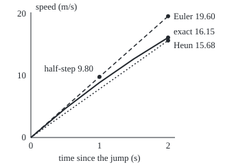
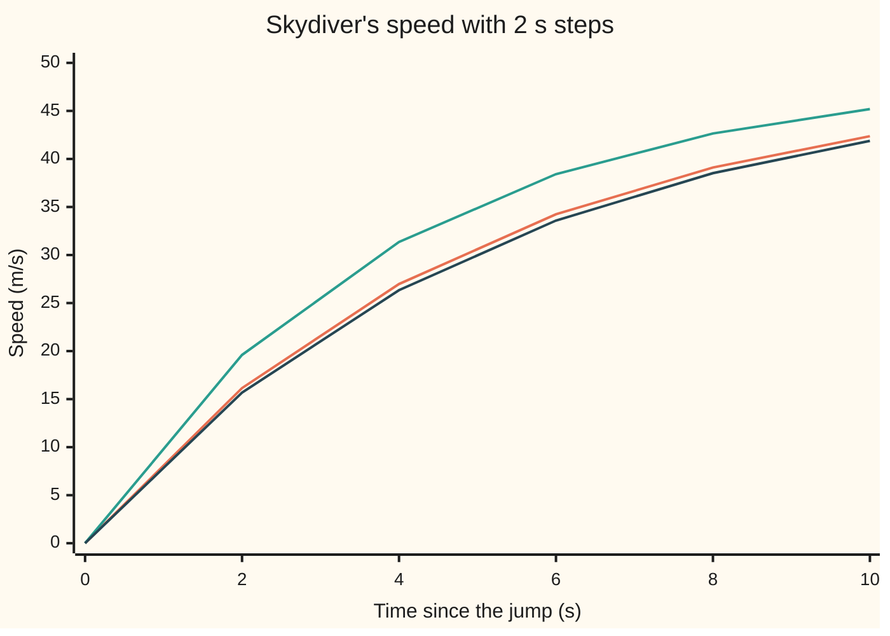

# Midpoint and Heun: sample the slope twice per step and the error shrinks four times faster

[Syllabus](../../../SYLLABUS.md) → [Differential equations and dynamics](../../../SYLLABUS.md#w08) → [Numerical Evolution](../../../SYLLABUS.md#w08-s05) → Midpoint and Heun

---

## General Overview

A skydiver leaves the plane at rest. Gravity adds 9.8 m/s of speed each second; drag removes a fifth of the current speed each second. The speed climbs towards 49 m/s, where the two balance, and at ten seconds is 42.37 m/s.

Euler's rule ([Euler's method](01-eulers-method.md)) steps forward using the slope at the start of each step. With two-second steps it reads 45.19 m/s at ten seconds, 2.82 too fast: drag grows with speed, so the slope falls during every step, and Euler uses its steepest point.

Two repairs read the slope a second time inside the step. The **midpoint method** walks half a step on the first slope and reads the slope there. **Heun's method**, or improved Euler, walks a whole step, reads the slope at the far end and averages the two. With the same steps both read 41.88 m/s. Halve the step and Euler's error halves; Heun's falls to a quarter.

**A second slope sample, placed so the step matches the true curve's bend, cancels Euler's leading error: the error at a fixed time falls with the square of the step.**

**What kind of fact this is:** a method; that both are second order is a theorem, proved in Why it works.

### The picture: one two-second step

<p align="center"></p>

To scale: 100 units across per second, 9 up per m/s. Solid: the true speed. Dashed: Euler's step. Dotted: the Heun step, whose slope 7.84 is also what midpoint reads at the half-step dot.

---

## The formula

Reminder: $v' = f(t, v)$ says the rate of the speed $v$ at time $t$ is given by the rule $f$; here $f(t, v) = 9.8 - 0.2v$. A step of length $h$ turns the method's speed $v_n$ after $n$ steps into $v_{n+1}$.

Both take a first sample $k_1 = f(t_n, v_n)$, Euler's slope, at time $t_n = nh$. They differ in the second.

$$\text{Midpoint:}\quad k_2 = f\!\left(t_n + \tfrac{h}{2},\ v_n + \tfrac{h}{2}k_1\right), \qquad v_{n+1} = v_n + h\,k_2$$

**Read it aloud:** walk half a step on the first slope, read the slope there, and use that slope for the whole step.

$$\text{Heun:}\quad k_2 = f\!\left(t_n + h,\ v_n + h\,k_1\right), \qquad v_{n+1} = v_n + \tfrac{h}{2}\left(k_1 + k_2\right)$$

**Read it aloud:** walk a whole step on the first slope, read the slope at the far end, and step with the average of the two slopes.

Both are members of one family, which the derivation fixes:

$$v_{n+1} = v_n + h\,(b_1 k_1 + b_2 k_2), \qquad k_2 = f(t_n + c\,h,\ v_n + c\,h\,k_1), \qquad b_1 + b_2 = 1,\quad b_2\,c = \tfrac12$$

| Symbol | Plain meaning | In our example | Push it up and the answer… |
| --- | --- | --- | --- |
| $t$, $h$ | time since the jump, and step length, s | 0 to 10; 2 | larger error |
| $v$, $v'$, $f$ | speed (m/s), its rate (m/s per s), the rule | 42.37 at 10 s; 9.8 − 0.2 × speed | — |
| $v_n$, $t_n$, $n$ | the method's speed and time after $n$ steps | 41.88 after 5 steps | — |
| $k_1$, $k_2$ | the two slope samples | Heun: 9.80, 5.88 | — |
| $b_1$, $b_2$, $c$ | sample weights; where in the step the second is read | Heun ½, ½, 1; midpoint 0, 1, ½ | — |
| $f_t$, $f_v$ | the rule's rate of change with time alone, with speed alone | 0; −0.2 per s | more bend |
| $e_n$, $C$, $L$, $N$, $T$ | folded proof: error after $n$ steps, local-error constant, bound on $f_v$ in size, step count, end time | $L$ = 0.2; $T$ = 10 s | old errors grow more |
| $q$, $x$ | one step's shrink factor on the gap to 49 m/s; $x = 0.2h$ | 0.68 at $x$ = 0.4 | past $h$ = 10 s the gap grows |

### When it holds

- **A smooth rule.** The derivation uses the rule's second rates of change. If the rule jumps, say a parachute opening mid-step, that one step errs in proportion to $h$, and the error at 10 s shrinks only as fast as Euler's.
- **A fixed end time, small steps.** "Second order" describes the error at a fixed time as $h$ shrinks; at large steps the pattern has not set in.
- **A step short against the rule's time scale.** One skydiver step multiplies the gap to 49 m/s by $q$; past $h$ = 10 s, $q$ exceeds 1 and the speed runs away. Very fast rules need [Stiff equations](06-stiff-equations-and-backward-euler.md).

---

## Why it works

### Step 0: a second sample estimates the average slope

Over one step the speed changes by $h$ times the step's average slope. Euler uses the starting slope, 9.80, though the slope falls throughout. A second reading tells the method how fast the slope is changing; placed well, it cancels Euler's leading error.

### Step 1: what the true curve does in one step

Expand the true speed around $t_n$ by Taylor's theorem:

$$v(t_n + h) = v + h\,v' + \frac{h^2}{2}v'' + \frac{h^3}{6}v''' + \dots$$

Here $v' = f$, and the chain rule gives the bend: $v'' = f_t + f_v\,f$, since the rule changes as time moves and as the speed moves. For the skydiver, $f_t = 0$ and $f_v = -0.2$, so the bend is $-0.2$ times the slope: while the speed rises, the slope falls.

### Step 2: what a two-sample step does

Expand the second sample to first order in the step, using the two-variable Taylor rule:

$$k_2 = f + c\,h\,(f_t + f_v\,f) + (\text{terms in } h^2)$$

Put it into the family's update:

$$v_{n+1} = v + h\,(b_1 + b_2)\,f + h^2\,b_2\,c\,(f_t + f_v\,f) + (\text{terms in } h^3)$$

### Step 3: match the terms

The true curve has $h\,f$ and $\tfrac12 h^2 (f_t + f_v f)$. The step matches both, for every smooth rule, exactly when

$$b_1 + b_2 = 1, \qquad b_2\,c = \tfrac12.$$

Two conditions on three unknowns leave one free choice. Reading halfway, $c = \tfrac12$, forces $b_2 = 1$, $b_1 = 0$: midpoint. Reading at the far end, $c = 1$, forces $b_1 = b_2 = \tfrac12$: Heun.

Neither can match the $h^3$ term in general: it holds the rule's second rates of change. So each step misses by an amount proportional to $h^3$, the **local error**.

### Step 4: the skydiver makes it exact

The skydiver's rule is a straight line in speed. Each step the true gap to 49 m/s shrinks by the factor $e^{-0.2h}$. Both methods multiply it instead by

$$q = 1 - x + \frac{x^2}{2}, \qquad x = 0.2h,$$

the first three terms of the series for $e^{-x}$. At $h$ = 2 s, $q$ = 0.6800 against the true 0.6703, and five steps give $49\,(1 - q^5)$ = 41.8757, exactly what stepping gives.

### Step 5: local $h^3$ becomes global $h^2$

Reaching ten seconds takes $10/h$ steps. Each adds an error proportional to $h^3$, and earlier errors are carried along, grown by at most a fixed factor. The total is about $10/h$ times $h^3$: proportional to $h^2$. That is what "order 2" means ([Order of a method](02-local-and-global-error-and-order.md)): halving the step quarters the error.

<details>
<summary>Detailed proof: from local error to global error</summary>

Let $e_n$ be the gap between $v_n$ and the true speed at $t_n$, and let $L$ bound $\lvert f_v\rvert$ near the solution.

First, a step from the true value misses the true curve by at most $C h^3$; $C$ comes from the Taylor remainders of Steps 1 and 2.

Second, a step from two speeds $u$ and $z$ lands them at most $(1 + Lh + L^2h^2/2)\,\lvert u - z\rvert$ apart, since each sample differs by at most $L$ times the gap in its input. That factor is at most $e^{Lh}$.

So $e_{n+1} \le e^{Lh}\,e_n + C h^3$ with $e_0 = 0$, and after $N$ steps $e_N \le C h^3 \,(e^{NLh} - 1)/(e^{Lh} - 1)$. Since $e^{Lh} - 1 \ge Lh$ and $N h = T$, $e_N \le C h^2 (e^{LT} - 1)/L$, a constant times $h^2$.

</details>

A second road needs no exact solution: compare answers at $h$, $h/2$ and $h/4$ and read the order from the ratio of successive differences. Built into each step, it becomes [Adaptive steps](05-adaptive-step-size.md).

---

## Worked numbers, by hand

| Step | Arithmetic | Value |
| --- | --- | --- |
| first slope | 9.8 − 0.2 × 0 | $k_1$ = 9.80 |
| Heun: far end, slope there | 2 × 9.80 = 19.60; 9.8 − 0.2 × 19.60 | $k_2$ = 5.88 |
| Heun: step on the average | 2 × (9.80 + 5.88)/2 | 15.68 m/s |
| midpoint: half-step, slope there | 1 × 9.80; 9.8 − 0.2 × 9.80 | 7.84 |
| midpoint: step | 2 × 7.84 | 15.68 m/s |
| true speed at 2 s | 49 × (1 − e^(−0.4)) | 16.1543 m/s |
| five steps to 10 s | 49 × (1 − 0.68^5) | **41.8757 m/s** |

At ten seconds Heun reads 41.88 m/s against the true 42.37: 0.49 slow, where Euler was 2.82 fast. Errors at 10 s, with midpoint's identical to Heun's:

| Step $h$ | Euler error | Heun error |
| --- | --- | --- |
| 2 s | 2.8212 | 0.4928 |
| 1 s | 1.3701 | 0.1035 |
| 0.5 s | 0.6742 | 0.0239 |
| 0.25 s | 0.3343 | 0.0057 |

From 0.5 s to 0.25 s Euler's error falls by 2.02 times, Heun's by 4.16. Heun at 0.5 s costs as many slope readings as Euler at 0.25 s, yet errs by 0.0239 against 0.3343.

They agree only because the rule is a straight line in speed. With drag growing as the speed squared, $v' = 9.8 - 9.8\,(v/49)^2$, the exact speed at 10 s is 47.2374; 2 s steps give 46.6380 by midpoint and 46.3210 by Heun. Both stay second order: from 0.5 s to 0.25 s their errors fall by 4.27 and 4.29.



True speed (orange), Euler (green, above throughout), Heun (dark blue, just below).

### What breaks if you drop a piece

| Mistake | Comes out at | What went wrong |
| --- | --- | --- |
| Use the starting slope only | 45.19 m/s at 10 s, error 2.82 | This is Euler: the bend is ignored |
| Add the two Heun slopes without halving | 48.70 m/s, error 6.34 | The step moves twice as far as the average slope allows |
| Use the far-end slope alone | 36.58 m/s, error 5.79 | The end slope is too shallow, the mirror of Euler's error |

---

## Code, from first principles, and it actually runs

Two independent roads. Road one steps the rule with Euler, midpoint and Heun and compares each with the exact speed $49\,(1 - e^{-0.2t})$ at four step sizes. Road two never steps: the answer after $n$ steps is $49\,(1 - q^n)$, and the code asserts the roads agree at every step. Asserts also pin the local error near $49x^3/6$ and the error ratios near 4 and 2. The quadratic-drag case separates the two methods.

### Python

```python
# Midpoint and Heun -- the check behind the card.  Standard library only.
# The skydiver: v' = 9.8 - 0.2 v, v(0) = 0, exact v = 49 (1 - e^(-0.2 t)).
# Road one: step the rule and compare with the exact curve.  Road two: for this
# straight-line rule a two-stage step multiplies the gap to 49 m/s by
# q = 1 - x + x^2/2 with x = 0.2 h, so v_n = 49 (1 - q^n), no stepping at all.
import math

def f(t, v): return 9.8 - 0.2 * v                  # the rate rule, m/s per s
def drag(t, v): return 9.8 - 9.8 * (v / 49) ** 2   # second case: drag grows as v^2
def euler(f, t, v, h): return v + h * f(t, v)
def midpoint(f, t, v, h): return v + h * f(t + h / 2, v + h / 2 * f(t, v))
def heun(f, t, v, h): return v + h / 2 * (f(t, v) + f(t + h, v + h * f(t, v)))
def heun_no_half(f, t, v, h): return v + h * (f(t, v) + f(t + h, v + h * f(t, v)))
def slope_at_end(f, t, v, h): return v + h * f(t + h, v + h * f(t, v))

def run(step, rule, h, t_end=10.0):
    v, path = 0.0, [0.0]
    for n in range(round(t_end / h)):
        v = step(rule, n * h, v, h)
        path.append(v)
    return path

exact = lambda t: 49 * (1 - math.exp(-0.2 * t))
exact_drag = lambda t: 49 * (1 - math.exp(-0.4 * t)) / (1 + math.exp(-0.4 * t))
k1 = f(0, 0); k2 = f(2, 2 * k1); km = f(1, k1)
print(f"first step, h = 2: k1 = {k1:.2f}; Heun predicts {2 * k1:.2f}, slope there {k2:.2f}, "
      f"average {(k1 + k2) / 2:.2f}; midpoint half-step {k1:.2f}, slope there {km:.2f}")
print(f"first step lands at {heun(f, 0, 0, 2):.2f} (Heun) and {midpoint(f, 0, 0, 2):.2f} "
      f"(midpoint); exact {exact(2):.4f}; Euler {euler(f, 0, 0, 2):.2f}")
for name, path in (("exact", [exact(t) for t in range(0, 11, 2)]),
                   ("euler h = 2", run(euler, f, 2)), ("heun h = 2", run(heun, f, 2))):
    print(f"chart, {name}: " + ", ".join(f"{v:.2f}" for v in path))
x = 0.2 * 2; q = 1 - x + x * x / 2
print(f"shortcut, h = 2: q = {q:.4f} against e^(-0.4) = {math.exp(-x):.4f}; "
      f"49 (1 - q^5) = {49 * (1 - q ** 5):.4f}; q passes 1 at h = {2 / 0.2:.0f}")
hs, err = (2, 1, 0.5, 0.25), {}
for h in hs:
    err[h] = [abs(run(s, f, h)[-1] - exact(10)) for s in (euler, midpoint, heun)]
    print(f"h = {h}: v(10) Euler {run(euler, f, h)[-1]:.4f} error {err[h][0]:.4f}; "
          f"Heun {run(heun, f, h)[-1]:.4f} error {err[h][2]:.4f}; midpoint error {err[h][1]:.4f}")
print(f"error ratio when h halves, 0.5 to 0.25: Euler {err[0.5][0] / err[0.25][0]:.2f}, "
      f"Heun {err[0.5][2] / err[0.25][2]:.2f}")
dm, dh = run(midpoint, drag, 2)[-1], run(heun, drag, 2)[-1]
print(f"drag v^2, h = 2: midpoint {dm:.4f}, Heun {dh:.4f}, exact {exact_drag(10):.4f}")
de = {h: [abs(run(s, drag, h)[-1] - exact_drag(10)) for s in (midpoint, heun)] for h in (0.5, 0.25)}
print(f"drag v^2, error at h = 0.5 and 0.25: midpoint {de[0.5][0]:.5f} {de[0.25][0]:.5f} ratio "
      f"{de[0.5][0] / de[0.25][0]:.2f}; Heun {de[0.5][1]:.5f} {de[0.25][1]:.5f} ratio {de[0.5][1] / de[0.25][1]:.2f}")
for name, s in (("slope at start only (Euler)", euler), ("sum not averaged", heun_no_half),
                ("end slope alone", slope_at_end)):
    print(f"mistake, {name}: v(10) = {run(s, f, 2)[-1]:.2f}, error {abs(run(s, f, 2)[-1] - exact(10)):.2f}")
X = lambda t: 45 + 100 * t; Y = lambda v: 200 - 9 * v
print("figure, exact curve (x, y): " + ", ".join(f"({X(t):.1f}, {Y(exact(t)):.1f})" for t in (0, 0.5, 1, 1.5, 2))
      + f"; end x {X(2):.1f}: Euler y {Y(2 * k1):.1f}, Heun y {Y(heun(f, 0, 0, 2)):.1f}; half-step ({X(1):.1f}, {Y(k1):.1f})")
h = 0.1; x = 0.2 * h
assert all(abs(v - 49 * (1 - q ** n)) < 1e-9 for n, v in enumerate(run(heun, f, 2)))  # two roads agree
assert abs(exact(h) - heun(f, 0, 0, h) - 49 * x ** 3 / 6) < 49 * x ** 4 / 24          # local error ~ h^3
assert 3.8 < err[0.5][2] / err[0.25][2] < 4.2 and 1.8 < err[0.5][0] / err[0.25][0] < 2.2
assert dm != dh and 3.6 < de[0.5][0] / de[0.25][0] < 4.4 and 3.6 < de[0.5][1] / de[0.25][1] < 4.4
print("ALL CHECKS PASS")
```

**Ran 2026-09-28 on macOS, Python 3.14.6, standard library only. All checks passed. Output, pasted from the run:**

```
first step, h = 2: k1 = 9.80; Heun predicts 19.60, slope there 5.88, average 7.84; midpoint half-step 9.80, slope there 7.84
first step lands at 15.68 (Heun) and 15.68 (midpoint); exact 16.1543; Euler 19.60
chart, exact: 0.00, 16.15, 26.98, 34.24, 39.11, 42.37
chart, euler h = 2: 0.00, 19.60, 31.36, 38.42, 42.65, 45.19
chart, heun h = 2: 0.00, 15.68, 26.34, 33.59, 38.52, 41.88
shortcut, h = 2: q = 0.6800 against e^(-0.4) = 0.6703; 49 (1 - q^5) = 41.8757; q passes 1 at h = 10
h = 2: v(10) Euler 45.1898 error 2.8212; Heun 41.8757 error 0.4928; midpoint error 0.4928
h = 1: v(10) Euler 43.7387 error 1.3701; Heun 42.2650 error 0.1035; midpoint error 0.1035
h = 0.5: v(10) Euler 43.0427 error 0.6742; Heun 42.3447 error 0.0239; midpoint error 0.0239
h = 0.25: v(10) Euler 42.7029 error 0.3343; Heun 42.3628 error 0.0057; midpoint error 0.0057
error ratio when h halves, 0.5 to 0.25: Euler 2.02, Heun 4.16
drag v^2, h = 2: midpoint 46.6380, Heun 46.3210, exact 47.2374
drag v^2, error at h = 0.5 and 0.25: midpoint 0.02400 0.00562 ratio 4.27; Heun 0.03379 0.00787 ratio 4.29
mistake, slope at start only (Euler): v(10) = 45.19, error 2.82
mistake, sum not averaged: v(10) = 48.70, error 6.34
mistake, end slope alone: v(10) = 36.58, error 5.79
figure, exact curve (x, y): (45.0, 200.0), (95.0, 158.0), (145.0, 120.1), (195.0, 85.7), (245.0, 54.6); end x 245.0: Euler y 23.6, Heun y 58.9; half-step (145.0, 111.8)
ALL CHECKS PASS
```

### Rust

Same numbers, same labels, built with `rustc --edition 2021 -O`.

```rust
// Midpoint and Heun -- the same check as the Python, in Rust, std only.
// The skydiver: v' = 9.8 - 0.2 v, v(0) = 0, exact v = 49 (1 - e^(-0.2 t)).
// Road one: step the rule and compare with the exact curve.  Road two: for this
// straight-line rule a two-stage step multiplies the gap to 49 m/s by
// q = 1 - x + x^2/2 with x = 0.2 h, so v_n = 49 (1 - q^n), no stepping at all.
type Rule = fn(f64, f64) -> f64;
type Step = fn(Rule, f64, f64, f64) -> f64;

fn f(_t: f64, v: f64) -> f64 { 9.8 - 0.2 * v } // the rate rule, m/s per s
fn drag(_t: f64, v: f64) -> f64 { 9.8 - 9.8 * (v / 49.0).powi(2) } // drag grows as v^2
fn euler(f: Rule, t: f64, v: f64, h: f64) -> f64 { v + h * f(t, v) }
fn midpoint(f: Rule, t: f64, v: f64, h: f64) -> f64 { v + h * f(t + h / 2.0, v + h / 2.0 * f(t, v)) }
fn heun(f: Rule, t: f64, v: f64, h: f64) -> f64 { v + h / 2.0 * (f(t, v) + f(t + h, v + h * f(t, v))) }
fn heun_no_half(f: Rule, t: f64, v: f64, h: f64) -> f64 { v + h * (f(t, v) + f(t + h, v + h * f(t, v))) }
fn slope_at_end(f: Rule, t: f64, v: f64, h: f64) -> f64 { v + h * f(t + h, v + h * f(t, v)) }

fn run(step: Step, rule: Rule, h: f64) -> Vec<f64> {
    let mut path = vec![0.0];
    let mut v = 0.0;
    for n in 0..(10.0 / h).round() as usize { v = step(rule, n as f64 * h, v, h); path.push(v); }
    path
}
fn last(step: Step, rule: Rule, h: f64) -> f64 { *run(step, rule, h).last().unwrap() }
fn exact(t: f64) -> f64 { 49.0 * (1.0 - (-0.2 * t).exp()) }
fn exact_drag(t: f64) -> f64 { 49.0 * (1.0 - (-0.4 * t).exp()) / (1.0 + (-0.4 * t).exp()) }
fn join(p: &[f64]) -> String { p.iter().map(|v| format!("{:.2}", v)).collect::<Vec<_>>().join(", ") }

fn main() {
    let (k1, k2, km) = (f(0.0, 0.0), f(2.0, 2.0 * f(0.0, 0.0)), f(1.0, f(0.0, 0.0)));
    println!("first step, h = 2: k1 = {:.2}; Heun predicts {:.2}, slope there {:.2}, average {:.2}; midpoint half-step {:.2}, slope there {:.2}",
        k1, 2.0 * k1, k2, (k1 + k2) / 2.0, k1, km);
    println!("first step lands at {:.2} (Heun) and {:.2} (midpoint); exact {:.4}; Euler {:.2}",
        heun(f, 0.0, 0.0, 2.0), midpoint(f, 0.0, 0.0, 2.0), exact(2.0), euler(f, 0.0, 0.0, 2.0));
    let ex: Vec<f64> = (0..6).map(|i| exact(2.0 * i as f64)).collect();
    println!("chart, exact: {}", join(&ex));
    println!("chart, euler h = 2: {}", join(&run(euler, f, 2.0)));
    println!("chart, heun h = 2: {}", join(&run(heun, f, 2.0)));
    let x = 0.2 * 2.0;
    let q: f64 = 1.0 - x + x * x / 2.0;
    println!("shortcut, h = 2: q = {:.4} against e^(-0.4) = {:.4}; 49 (1 - q^5) = {:.4}; q passes 1 at h = {:.0}", q, (-x).exp(), 49.0 * (1.0 - q.powi(5)), 2.0 / 0.2);
    let hs = [2.0, 1.0, 0.5, 0.25];
    let steps: [Step; 3] = [euler, midpoint, heun];
    let err: Vec<Vec<f64>> = hs.iter().map(|&h| steps.iter().map(|&s| (last(s, f, h) - exact(10.0)).abs()).collect()).collect();
    for (i, &h) in hs.iter().enumerate() {
        println!("h = {}: v(10) Euler {:.4} error {:.4}; Heun {:.4} error {:.4}; midpoint error {:.4}",
            h, last(euler, f, h), err[i][0], last(heun, f, h), err[i][2], err[i][1]);
    }
    println!("error ratio when h halves, 0.5 to 0.25: Euler {:.2}, Heun {:.2}", err[2][0] / err[3][0], err[2][2] / err[3][2]);
    let (dm, dh) = (last(midpoint, drag, 2.0), last(heun, drag, 2.0));
    println!("drag v^2, h = 2: midpoint {:.4}, Heun {:.4}, exact {:.4}", dm, dh, exact_drag(10.0));
    let de: Vec<Vec<f64>> = [0.5, 0.25].iter().map(|&h| [midpoint as Step, heun].iter().map(|&s| (last(s, drag, h) - exact_drag(10.0)).abs()).collect()).collect();
    println!("drag v^2, error at h = 0.5 and 0.25: midpoint {:.5} {:.5} ratio {:.2}; Heun {:.5} {:.5} ratio {:.2}",
        de[0][0], de[1][0], de[0][0] / de[1][0], de[0][1], de[1][1], de[0][1] / de[1][1]);
    let wrong: [(&str, Step); 3] = [("slope at start only (Euler)", euler), ("sum not averaged", heun_no_half), ("end slope alone", slope_at_end)];
    for (name, s) in wrong {
        println!("mistake, {}: v(10) = {:.2}, error {:.2}", name, last(s, f, 2.0), (last(s, f, 2.0) - exact(10.0)).abs());
    }
    let (px, py) = (|t: f64| 45.0 + 100.0 * t, |v: f64| 200.0 - 9.0 * v);
    let pts: Vec<String> = [0.0, 0.5, 1.0, 1.5, 2.0].iter().map(|&t| format!("({:.1}, {:.1})", px(t), py(exact(t)))).collect();
    println!("figure, exact curve (x, y): {}; end x {:.1}: Euler y {:.1}, Heun y {:.1}; half-step ({:.1}, {:.1})",
        pts.join(", "), px(2.0), py(2.0 * k1), py(heun(f, 0.0, 0.0, 2.0)), px(1.0), py(k1));
    let (h, x) = (0.1, 0.02);
    assert!(run(heun, f, 2.0).iter().enumerate().all(|(n, v)| (v - 49.0 * (1.0 - q.powi(n as i32))).abs() < 1e-9)); // two roads agree
    assert!((exact(h) - heun(f, 0.0, 0.0, h) - 49.0 * x * x * x / 6.0).abs() < 49.0 * x.powi(4) / 24.0); // local error ~ h^3
    assert!(err[2][2] / err[3][2] > 3.8 && err[2][2] / err[3][2] < 4.2 && err[2][0] / err[3][0] > 1.8 && err[2][0] / err[3][0] < 2.2);
    assert!(dm != dh && de[0][0] / de[1][0] > 3.6 && de[0][0] / de[1][0] < 4.4 && de[0][1] / de[1][1] > 3.6 && de[0][1] / de[1][1] < 4.4);
    println!("ALL CHECKS PASS");
}
```

**Ran 2026-09-28 on macOS, rustc 1.98.1, no crates. All checks passed. Output, pasted from the run:**

```
first step, h = 2: k1 = 9.80; Heun predicts 19.60, slope there 5.88, average 7.84; midpoint half-step 9.80, slope there 7.84
first step lands at 15.68 (Heun) and 15.68 (midpoint); exact 16.1543; Euler 19.60
chart, exact: 0.00, 16.15, 26.98, 34.24, 39.11, 42.37
chart, euler h = 2: 0.00, 19.60, 31.36, 38.42, 42.65, 45.19
chart, heun h = 2: 0.00, 15.68, 26.34, 33.59, 38.52, 41.88
shortcut, h = 2: q = 0.6800 against e^(-0.4) = 0.6703; 49 (1 - q^5) = 41.8757; q passes 1 at h = 10
h = 2: v(10) Euler 45.1898 error 2.8212; Heun 41.8757 error 0.4928; midpoint error 0.4928
h = 1: v(10) Euler 43.7387 error 1.3701; Heun 42.2650 error 0.1035; midpoint error 0.1035
h = 0.5: v(10) Euler 43.0427 error 0.6742; Heun 42.3447 error 0.0239; midpoint error 0.0239
h = 0.25: v(10) Euler 42.7029 error 0.3343; Heun 42.3628 error 0.0057; midpoint error 0.0057
error ratio when h halves, 0.5 to 0.25: Euler 2.02, Heun 4.16
drag v^2, h = 2: midpoint 46.6380, Heun 46.3210, exact 47.2374
drag v^2, error at h = 0.5 and 0.25: midpoint 0.02400 0.00562 ratio 4.27; Heun 0.03379 0.00787 ratio 4.29
mistake, slope at start only (Euler): v(10) = 45.19, error 2.82
mistake, sum not averaged: v(10) = 48.70, error 6.34
mistake, end slope alone: v(10) = 36.58, error 5.79
figure, exact curve (x, y): (45.0, 200.0), (95.0, 158.0), (145.0, 120.1), (195.0, 85.7), (245.0, 54.6); end x 245.0: Euler y 23.6, Heun y 58.9; half-step (145.0, 111.8)
ALL CHECKS PASS
```

The two outputs match line for line.

> [!TIP]
> **Try changing**
> Guess first, then run it.
> - **Add 0.125 to `hs`.** Guess Heun's error: about a quarter of 0.0057.
> - **Drop the `/ 2` in midpoint's time argument.** Guess what changes. Nothing: neither rule reads the time, only the speed.
> - **In `heun`, change `h / 2` to `h`.** Guess the reading at 10 s with 2 s steps: 48.70, the second mistake row, and the first assert stops the run.

---

## The usual mistake

> [!warning]
> **Taking "second order" to mean four times better than Euler.** Four is what halving the step does to Heun's own error. Against Euler the gain depends on the step: 0.4928 against 2.8212 at 2 s, 0.0057 against 0.3343 at 0.25 s. It widens as the step shrinks, since one error falls as $h^2$, the other as $h$.
>
> - **Assuming midpoint and Heun are one method.** They coincide only because the skydiver's rule is a straight line in speed; with drag as the speed squared they read 46.6380 and 46.3210.
> - **Reading the order off large steps.** From 2 s to 1 s Heun's error goes from 0.4928 to 0.1035, not yet a clean quarter.

---

## Where you meet it in real life

- **Integrating a plain function.** When the rule ignores the unknown, $f$ depends on $t$ alone and Heun's step is the trapezoidal rule for areas, while the midpoint step is the midpoint rule: both from [Numerical integration](../../06-Calculus%20and%20analysis/04-Integrals/08-numerical-integration.md).
- **Adaptive solvers.** Euler and Heun share their first sample, so running both gives a free estimate of Euler's error: the idea behind [Adaptive steps](05-adaptive-step-size.md).

> **Say it back**
> Euler steps on the starting slope and misses the curve's bend. A second sample, read halfway (midpoint) or at the predicted far end and averaged (Heun), matches the true curve through the step-squared term. The error at a fixed time then goes as the step squared. On the skydiver with 2 s steps Heun reads 41.88 m/s at ten seconds against the true 42.37; halving the step quarters the error.

---

## What this builds on

- [Order of a method](02-local-and-global-error-and-order.md): what local and global error are, and why a step-cubed local error gives a step-squared global one.

## Where this goes next

- [Runge-Kutta four](04-runge-kutta-four.md): four samples per step, matching the true curve through the fourth power of the step.

---

## Sources

Verified 28 Sep 2026: every link below resolves to the author's or the university's own page.

- Lebl, Jiří. *Notes on Diffy Qs: Differential Equations for Engineers*, §1.7 "Numerical methods: Euler's method". [Author's free edition](https://www.jirka.org/diffyqs/html/numer_section.html). Euler's error, and the improved Euler (Heun) method quartering the error when the step halves.
- Dobrushkin, Vladimir. "Runge–Kutta 2", Part 1.3 of his differential-equations tutorial, Brown University. [Course page](https://www.cfm.brown.edu/people/dobrush/am33/python/p3/RK2.html). Matching Taylor terms for two-stage methods; Heun, midpoint and Ralston as one family.
