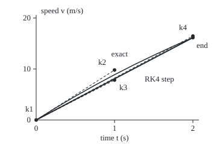
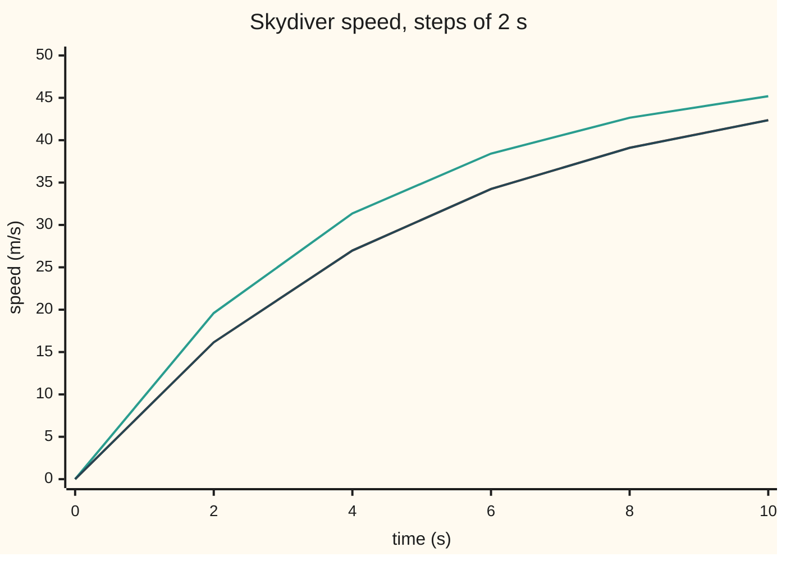

# Runge-Kutta four: four slopes per step, weighted 1-2-2-1, and the error shrinks sixteen-fold per halving

Differential equations and dynamics → Numerical Evolution → Four-slope stepping → Runge-Kutta four


---

## General Overview

A skydiver leaves the plane. Gravity adds 9.8 m/s of speed each second; drag removes 0.2 m/s per second for each 1 m/s of speed. The exact speed after 10 s is known, 42.368571 m/s, so the fall is a test bench for stepping methods. The rate law is v' = 9.8 − 0.2v, with v in m/s, t in s and v(0) = 0.

Euler's method walks one slope per step ([eulers-method](01-eulers-method.md)); with 2-second steps it reports 45.19 m/s at 10 s. Midpoint and Heun read two slopes.

The classical Runge-Kutta method, RK4 for short, reads four, called k1 to k4: one at the start of the step, two at the middle, one at the end. It averages them with weights 1, 2, 2, 1. With the same steps it reports 42.364615 m/s, off by 0.0040. Carl Runge (1895) and Wilhelm Kutta (1901) built it.

**RK4 moves each step along a weighted average of four slopes, placed so the step matches the true solution through the fourth power of the step size; halving the step then cuts the error about sixteen-fold.**

**What kind of fact this is:** a method; its fourth-order accuracy is a theorem, shown exactly for the skydiver in Why it works and in outline in the folded Detailed proof.

### The picture: one step, four slopes

<p align="center"></p>

Scale: 130 px per second across, 8.5 px per m/s up. Curve: the exact speed. Dashed: trial moves ending where k2, k3 and k4 are read. Solid: the RK4 step, landing at 16.1504 m/s against the exact 16.1543.

---

## The formula

Reminder: the law is written $y' = f(t, y)$, read "the rate of y at time t is f", and $h$ is the step size. One RK4 step from time $t_n$ and value $y_n$ is

$$y_{n+1} = y_n + \frac{h}{6}\left(k_1 + 2k_2 + 2k_3 + k_4\right),$$

with the four slopes

$$k_1 = f(t_n, y_n), \qquad k_2 = f\!\left(t_n + \tfrac{h}{2},\ y_n + \tfrac{h}{2}k_1\right),$$

$$k_3 = f\!\left(t_n + \tfrac{h}{2},\ y_n + \tfrac{h}{2}k_2\right), \qquad k_4 = f\!\left(t_n + h,\ y_n + h\,k_3\right).$$

**Read it aloud:** read the slope here, peek at the middle with it, peek at the middle again with the new slope, peek at the end with that one, then move along one-sixth, a third, a third and one-sixth of the four.

| Symbol | Plain meaning | In our example | Push it up and the answer… |
| --- | --- | --- | --- |
| $t_n$ | the time at the start of step n | 0 s for the first step | — |
| $y_n$ | the computed value at that time | the speed v, 0 m/s at the door | — |
| $h$ | the step size: time covered by one step | 2 s | error grows as its fourth power; past 13.93 s the run explodes |
| $f$ | the rate law: the slope at any time and value | 9.8 − 0.2v, in m/s per s | — |
| $k_1$ | slope read at the start of the step | 9.8000 | — |
| $k_2$, $k_3$ | slopes read at the middle, after a trial half-step | 7.8400 and 8.2320 | — |
| $k_4$ | slope read at the end, after a trial full step | 6.5072 | — |
| $R$, $z$ | one step's factor on a decaying gap, with z = h × rate | z = −0.4 | R(z) passes 1 at z = −2.7853 and the run diverges |

The weights over 6 add to 1, so a constant slope moves the value by exactly h times it.

### When it holds

- **The law is smooth.** Fourth order needs four continuous derivatives of the rate law. A parachute snapping open mid-step drops the order.
- **The step is inside the stability edge.** A gap decaying at rate λ (lambda, per second) is multiplied each step by R(hλ), below 1 in size only for hλ between −2.7853 and 0. With λ = −0.2 per s, h must stay under 13.93 s; at 15 s the speed at 60 s is −126.15 m/s.
- **The equation is not stiff.** Stiff: one part of the solution dies far faster than the part tracked, so the edge forces tiny steps. The cure is [stiff-equations-and-backward-euler](06-stiff-equations-and-backward-euler.md), not RK4.
- **No error estimate comes free.** A fixed-step run never reports its own error. Over long runs an oscillator's energy drifts, which [symplectic-steps-for-oscillators](07-symplectic-steps-for-oscillators.md) fixes.

---

## Why it works

### Step 0: every method is a guess at the average slope

The exact move over one step is h times the average slope across it. No single reading is that average. Euler takes the start, midpoint and Heun combine two readings, and RK4 combines four, placed and weighted to be right through the fourth power of h.

### Step 1: on the skydiver, one step multiplies the gap from 49 by a polynomial

The speed settles at 49 m/s, where 9.8 − 0.2v = 0. The gap g = v − 49 obeys g' = −0.2g: it decays at rate λ = −0.2 per s. Write z = hλ, so z = −0.4 for h = 2 s. Each slope is λ times a trial gap, and one RK4 step multiplies the gap by

$$R(z) = 1 + z + \frac{z^2}{2} + \frac{z^3}{6} + \frac{z^4}{24}.$$

<details>
<summary>The algebra behind R(z)</summary>

With g the gap at the start: k1 = λg. k2 = λ(g + (h/2)k1) = λg(1 + z/2). k3 = λ(g + (h/2)k2) = λg(1 + z/2 + z^2/4). k4 = λ(g + h k3) = λg(1 + z + z^2/2 + z^3/4). The step adds (h/6)(k1 + 2k2 + 2k3 + k4) = g(z + z^2/2 + z^3/6 + z^4/24). Add the g already there and the factor is R(z).

</details>

### Step 2: that polynomial is e^z cut after the fourth power

The exact solution multiplies the gap by e^z over one step, and e^z = 1 + z + z^2/2 + z^3/6 + z^4/24 + z^5/120 + …. RK4 matches it term for term and stops. The first missed term is z^5/120, so one step errs in proportion to h^5: the **local error**, from a correct start ([local-and-global-error-and-order](02-local-and-global-error-and-order.md)).

### Step 3: adding up the steps costs one power of h

Reaching 10 s takes 10/h steps, each adding an error of size h^5, and the shrinking flow keeps them from growing. The **global error**, at the final time, is proportional to h^4: halving h divides it by 2^4 = 16. The checks print ratios 18.93, 17.40 and 16.68 for h = 2, 1, 0.5 and 0.25 s: closing in on 16 as the higher powers fade.

### Step 4: for any smooth law, eight conditions on the weights

The school rumour, P' = 0.8P(1 − P/1000) with P the pupils who have heard it, t in days and P(0) = 10, is not linear in P, so no single R describes a step. Matching the true step and the RK4 step in powers of h through h^4 gives eight equations on the weights and reading positions, and RK4 satisfies all eight. On the rumour at day 10, halving the step from 0.5 to 0.25 days divides the error by 15.76.

<details>
<summary>Detailed proof</summary>

Write b = (1/6, 1/3, 1/3, 1/6) for the weights, c = (0, 1/2, 1/2, 1) for where each slope is read, and A for the links (stage 2 uses 1/2 of k1, stage 3 uses 1/2 of k2, stage 4 all of k3). Expand the exact y(t + h) in powers of h using y' = f, y'' = f_t + f f_y and so on; expand the RK4 step by Taylor-expanding f at each trial point. Equating coefficients through h^4, one per nesting of derivatives of f:
the sums of b, bc, bc^2, b(Ac), bc^3, bc(Ac), b(Ac^2) and b(AAc) must be 1, 1/2, 1/3, 1/6, 1/4, 1/8, 1/12 and 1/24.

One over each sum prints as 1 2 3 4 6 8 12 24 in the checks. So the local error is at most C h^5, C bounding f's derivatives to fourth order. If the rate changes by at most L times any change in y (a Lipschitz constant), summing the steps bounds the global error at time T by C h^4 (e^(LT) − 1)/L; given ε > 0 (epsilon, a tolerance), any h making that below ε meets it. The nestings, drawn as trees, are runge-kutta-and-butcher-tableaux.

</details>

A second route: when the rate depends on time alone, k2 and k3 coincide and RK4 is Simpson's rule, weights 1, 4, 1 over 6.

---

## Worked numbers, by hand

One step of 2 s for the skydiver, from 0 m/s at the door, with f = 9.8 − 0.2v.

| Step | Arithmetic | Value |
| --- | --- | --- |
| slope at the start, k1 | 9.8 − 0.2 × 0 | 9.8000 |
| half-step along k1, then k2 | 9.8 − 0.2 × (0 + 1 × 9.8) | 7.8400 |
| half-step along k2, then k3 | 9.8 − 0.2 × (0 + 1 × 7.84) | 8.2320 |
| full step along k3, then k4 | 9.8 − 0.2 × (0 + 2 × 8.232) | 6.5072 |
| weighted slope | (9.8 + 2 × 7.84 + 2 × 8.232 + 6.5072) / 6 | 8.0752 |
| the step | 0 + 2 × 8.0752 | **16.1504** |
| exact | 49 × (1 − e^(−0.4)) | 16.1543 |
| error after one step | 16.1543 − 16.1504 | 0.0039 |

Five such steps give 42.364615 m/s at 10 s against the exact 42.368571: right to 4 mm/s.

For the rumour, the closed form 1000/(1 + 99e^(−0.8t)) gives 967.8567 pupils at day 10 ([logistic-growth](../01-Rate%20Equations/07-logistic-growth.md)); RK4 with half-day steps gives 967.8312, four figures agreeing.

### What breaks if you drop a piece

| Mistake | Comes out at | What went wrong |
| --- | --- | --- |
| Weights 1, 1, 1, 1 instead of 1, 2, 2, 1 | 42.4041 at 10 s | Middle under-weighted; order falls |
| Trial moves of a full h for k2 and k3 | 40.4298 at 10 s | Middle readings taken at the end |
| Euler's single slope, h = 2 s | 45.19 at 10 s | One reading per step: first order |
| Step of 15 s, past the 13.93 s edge | −126.15 at 60 s | Each step multiplies the gap by more than 1 |

---

## Code, from first principles, and it actually runs

The script steps both equations with its own RK4 loop and takes three roads: the closed form; the gap factor R(z) raised to the number of steps, equal to the loop to rounding; and the halving ratio, near 16. It also checks the eight order sums and bisects for the stability edge (halving an interval that brackets it).

### Python

```python
# Runge-Kutta four -- the check behind the card.  Python standard library only;
# math.exp is the one primitive used.  Skydiver: v' = 9.8 - 0.2 v (m/s, s).
# School rumour: P' = 0.8 P (1 - P/1000), P(0) = 10 pupils, time in days.
import math
def rk4(f, y, h, n, t=0.0, weights=(1, 2, 2, 1), half=0.5):
    for _ in range(n):          # four slopes per step, then one weighted move
        k1 = f(t, y); k2 = f(t + half * h, y + half * h * k1)
        k3 = f(t + half * h, y + half * h * k2); k4 = f(t + h, y + h * k3)
        w = weights; y += h * (w[0]*k1 + w[1]*k2 + w[2]*k3 + w[3]*k4) / sum(w); t += h
    return y
sky = lambda t, v: 9.8 - 0.2 * v
exact = lambda t: 49 * (1 - math.exp(-0.2 * t))          # road 1: the closed form
R = lambda z: 1 + z + z*z/2 + z**3/6 + z**4/24            # road 2: e^z cut after z^4
k1 = sky(0, 0); k2 = sky(1, k1); k3 = sky(1, k2); k4 = sky(2, 2 * k3)
v2 = rk4(sky, 0.0, 2, 1)
print(f"one step, h = 2 s, from v = 0: k1 = {k1:.4f}, k2 = {k2:.4f}, k3 = {k3:.4f}, k4 = {k4:.4f}")
print(f"weighted slope {(k1+2*k2+2*k3+k4)/6:.4f}, v(2) = {v2:.4f}, exact {exact(2):.4f}, error {exact(2)-v2:.4f}")
X = lambda t: 60 + 130 * t; Y = lambda v: 200 - 8.5 * v   # figure scale
pts = [(0, 0), (1, k1), (1, k2), (2, 2 * k3), (2, v2)]
print("figure, start k2 k3 k4 end:", " ".join(f"{X(t):.1f},{Y(v):.1f}" for t, v in pts))
print("figure, exact curve:", " ".join(f"{X(t/4):.1f},{Y(exact(t/4)):.1f}" for t in range(9)))
print(f"skydiver v(10), exact {exact(10):.6f}")
errs = []
for h in (2, 1, 0.5, 0.25):
    v = rk4(sky, 0.0, h, round(10 / h)); errs.append(exact(10) - v)
    print(f"h = {h:<5} RK4 {v:.6f}  error {errs[-1]:.7f}  gap-factor road {49*(1-R(-0.2*h)**round(10/h)):.6f}")
    assert abs(v - 49 * (1 - R(-0.2 * h) ** round(10 / h))) < 1e-9   # road 1 meets road 2
print("error ratio per halving:", " ".join(f"{errs[i]/errs[i+1]:.2f}" for i in range(3)))
eul = lambda h, n: 49 * (1 - (1 - 0.2 * h) ** n); heun = lambda h, n: 49 * (1 - (1 - 0.2*h + 0.02*h*h) ** n)
print(f"20 slope evaluations each: Euler h = 0.5 {eul(0.5,20):.4f} error {eul(0.5,20)-exact(10):.4f}; "
      f"Heun h = 1 {heun(1,10):.4f} error {exact(10)-heun(1,10):.4f}; RK4 h = 2 error {errs[0]:.4f}")
ts = range(0, 11, 2)
print("chart, t:", " ".join(f"{t}" for t in ts))
print("chart, exact:", " ".join(f"{exact(t):.2f}" for t in ts))
print("chart, Euler h = 2:", " ".join(f"{eul(2, t//2):.2f}" for t in ts))
print("chart, RK4 h = 2:", " ".join(f"{rk4(sky, 0.0, 2, t//2):.2f}" for t in ts))
rum = lambda t, p: 0.8 * p * (1 - p / 1000); P10 = 1000 / (1 + 99 * math.exp(-8))
a, b = rk4(rum, 10.0, 0.5, 20), rk4(rum, 10.0, 0.25, 40)
print(f"rumour day 10, exact {P10:.4f}: h = 0.5 {a:.4f} error {P10-a:.4f}; h = 0.25 {b:.4f} error {P10-b:.4f}; ratio {(P10-a)/(P10-b):.2f}")
assert all(15 < errs[i] / errs[i + 1] < 20 for i in range(3)) and 14 < (P10 - a) / (P10 - b) < 18
wrong_w, no_half = rk4(sky, 0.0, 2, 5, weights=(1, 1, 1, 1)), rk4(sky, 0.0, 2, 5, half=1.0)
print(f"mistakes at h = 2: equal weights {wrong_w:.4f}, halves dropped {no_half:.4f}")
b, c, A = (1/6, 1/3, 1/3, 1/6), (0, 0.5, 0.5, 1), {(1, 0): 0.5, (2, 1): 0.5, (3, 2): 1}
Am = lambda u: [sum(A.get((i, j), 0) * u[j] for j in range(4)) for i in range(4)]
dot = lambda u, w: sum(p * q for p, q in zip(u, w))
c2, c3, ac = [x*x for x in c], [x**3 for x in c], Am(c)
sums = [sum(b), dot(b, c), dot(b, c2), dot(b, c3), dot(b, ac), dot(b, [x*y for x, y in zip(c, ac)]), dot(b, Am(c2)), dot(b, Am(ac))]
print("order conditions, one over each sum:", " ".join(f"{1/s:.0f}" for s in sums))
assert all(abs(s * t - 1) < 1e-12 for s, t in zip(sums, (1, 2, 3, 4, 6, 8, 12, 24)))
lo, hi = -3.0, -2.5                          # bisection for the stability edge R(z) = 1
for _ in range(60):
    mid = (lo + hi) / 2; lo, hi = (mid, hi) if R(mid) > 1 else (lo, mid)
big = rk4(sky, 0.0, 15, 4)
print(f"stability edge z = {lo:.4f}, so h < {-lo/0.2:.2f} s; h = 15 gives v(60) = {big:.2f}, exact {exact(60):.2f}")
assert abs(big - exact(60)) > 100 and abs(rk4(sky, 0.0, 13, 20) - exact(260)) < 1
print("ALL CHECKS PASS")
```

**Ran 2026-09-28 on macOS, Python 3.14.6, standard library only. All checks passed. Output, pasted from the run:**

```
one step, h = 2 s, from v = 0: k1 = 9.8000, k2 = 7.8400, k3 = 8.2320, k4 = 6.5072
weighted slope 8.0752, v(2) = 16.1504, exact 16.1543, error 0.0039
figure, start k2 k3 k4 end: 60.0,200.0 190.0,116.7 190.0,133.4 320.0,60.1 320.0,62.7
figure, exact curve: 60.0,200.0 92.5,179.7 125.0,160.4 157.5,142.0 190.0,124.5 222.5,107.9 255.0,92.1 287.5,77.0 320.0,62.7
skydiver v(10), exact 42.368571
h = 2     RK4 42.364615  error 0.0039558  gap-factor road 42.364615
h = 1     RK4 42.368362  error 0.0002090  gap-factor road 42.368362
h = 0.5   RK4 42.368559  error 0.0000120  gap-factor road 42.368559
h = 0.25  RK4 42.368570  error 0.0000007  gap-factor road 42.368570
error ratio per halving: 18.93 17.40 16.68
20 slope evaluations each: Euler h = 0.5 43.0427 error 0.6742; Heun h = 1 42.2650 error 0.1035; RK4 h = 2 error 0.0040
chart, t: 0 2 4 6 8 10
chart, exact: 0.00 16.15 26.98 34.24 39.11 42.37
chart, Euler h = 2: 0.00 19.60 31.36 38.42 42.65 45.19
chart, RK4 h = 2: 0.00 16.15 26.98 34.24 39.10 42.36
rumour day 10, exact 967.8567: h = 0.5 967.8312 error 0.0255; h = 0.25 967.8551 error 0.0016; ratio 15.76
mistakes at h = 2: equal weights 42.4041, halves dropped 40.4298
order conditions, one over each sum: 1 2 3 4 6 8 12 24
stability edge z = -2.7853, so h < 13.93 s; h = 15 gives v(60) = -126.15, exact 49.00
ALL CHECKS PASS
```

### Rust

Same numbers, same labels, built with `rustc --edition 2021 -O`.

```rust
// Runge-Kutta four -- the same check as the Python, in Rust.  No crates; exp is
// the one primitive used.  Skydiver: v' = 9.8 - 0.2 v (m/s, s).
// School rumour: P' = 0.8 P (1 - P/1000), P(0) = 10 pupils, time in days.
fn rk4(f: &dyn Fn(f64, f64) -> f64, mut y: f64, h: f64, n: usize, w: [f64; 4], half: f64) -> f64 {
    let mut t = 0.0;
    for _ in 0..n {             // four slopes per step, then one weighted move
        let k1 = f(t, y); let k2 = f(t + half * h, y + half * h * k1);
        let k3 = f(t + half * h, y + half * h * k2); let k4 = f(t + h, y + h * k3);
        y += h * (w[0] * k1 + w[1] * k2 + w[2] * k3 + w[3] * k4) / w.iter().sum::<f64>(); t += h;
    }
    y
}
const W: [f64; 4] = [1.0, 2.0, 2.0, 1.0];
fn sky(_t: f64, v: f64) -> f64 { 9.8 - 0.2 * v }
fn exact(t: f64) -> f64 { 49.0 * (1.0 - (-0.2 * t).exp()) }           // road 1: the closed form
fn r(z: f64) -> f64 { 1.0 + z + z * z / 2.0 + z.powi(3) / 6.0 + z.powi(4) / 24.0 } // road 2
fn join(v: Vec<String>) -> String { v.join(" ") }
fn main() {
    let (k1, v2) = (sky(0.0, 0.0), rk4(&sky, 0.0, 2.0, 1, W, 0.5));
    let k2 = sky(1.0, k1); let k3 = sky(1.0, k2); let k4 = sky(2.0, 2.0 * k3);
    println!("one step, h = 2 s, from v = 0: k1 = {:.4}, k2 = {:.4}, k3 = {:.4}, k4 = {:.4}", k1, k2, k3, k4);
    println!("weighted slope {:.4}, v(2) = {:.4}, exact {:.4}, error {:.4}", (k1 + 2.0 * k2 + 2.0 * k3 + k4) / 6.0, v2, exact(2.0), exact(2.0) - v2);
    let x = |t: f64| 60.0 + 130.0 * t; let yy = |v: f64| 200.0 - 8.5 * v;   // figure scale
    let pts = [(0.0, 0.0), (1.0, k1), (1.0, k2), (2.0, 2.0 * k3), (2.0, v2)];
    println!("figure, start k2 k3 k4 end: {}", join(pts.iter().map(|&(t, v)| format!("{:.1},{:.1}", x(t), yy(v))).collect()));
    println!("figure, exact curve: {}", join((0..9).map(|i| { let t = i as f64 / 4.0; format!("{:.1},{:.1}", x(t), yy(exact(t))) }).collect()));
    println!("skydiver v(10), exact {:.6}", exact(10.0));
    let mut errs = vec![];
    for (h, lab) in [(2.0, "2"), (1.0, "1"), (0.5, "0.5"), (0.25, "0.25")] {
        let n = (10.0 / h) as usize; let v = rk4(&sky, 0.0, h, n, W, 0.5); errs.push(exact(10.0) - v);
        let road2 = 49.0 * (1.0 - r(-0.2 * h).powi(n as i32));
        println!("h = {:<5} RK4 {:.6}  error {:.7}  gap-factor road {:.6}", lab, v, errs[errs.len() - 1], road2);
        assert!((v - road2).abs() < 1e-9);                              // road 1 meets road 2
    }
    println!("error ratio per halving: {}", join((0..3).map(|i| format!("{:.2}", errs[i] / errs[i + 1])).collect()));
    let eul = |h: f64, n: i32| 49.0 * (1.0 - (1.0 - 0.2 * h).powi(n));
    let heun = |h: f64, n: i32| 49.0 * (1.0 - (1.0 - 0.2 * h + 0.02 * h * h).powi(n));
    println!("20 slope evaluations each: Euler h = 0.5 {:.4} error {:.4}; Heun h = 1 {:.4} error {:.4}; RK4 h = 2 error {:.4}",
        eul(0.5, 20), eul(0.5, 20) - exact(10.0), heun(1.0, 10), exact(10.0) - heun(1.0, 10), errs[0]);
    let ts: Vec<usize> = (0..=10).step_by(2).collect();
    println!("chart, t: {}", join(ts.iter().map(|t| t.to_string()).collect()));
    println!("chart, exact: {}", join(ts.iter().map(|&t| format!("{:.2}", exact(t as f64))).collect()));
    println!("chart, Euler h = 2: {}", join(ts.iter().map(|&t| format!("{:.2}", eul(2.0, (t / 2) as i32))).collect()));
    println!("chart, RK4 h = 2: {}", join(ts.iter().map(|&t| format!("{:.2}", rk4(&sky, 0.0, 2.0, t / 2, W, 0.5))).collect()));
    let rum = |_t: f64, p: f64| 0.8 * p * (1.0 - p / 1000.0);
    let p10 = 1000.0 / (1.0 + 99.0 * (-8.0f64).exp());
    let (a, b) = (rk4(&rum, 10.0, 0.5, 20, W, 0.5), rk4(&rum, 10.0, 0.25, 40, W, 0.5));
    println!("rumour day 10, exact {:.4}: h = 0.5 {:.4} error {:.4}; h = 0.25 {:.4} error {:.4}; ratio {:.2}", p10, a, p10 - a, b, p10 - b, (p10 - a) / (p10 - b));
    assert!((0..3).all(|i| 15.0 < errs[i] / errs[i + 1] && errs[i] / errs[i + 1] < 20.0) && 14.0 < (p10 - a) / (p10 - b) && (p10 - a) / (p10 - b) < 18.0);
    let (ww, nh) = (rk4(&sky, 0.0, 2.0, 5, [1.0; 4], 0.5), rk4(&sky, 0.0, 2.0, 5, W, 1.0));
    println!("mistakes at h = 2: equal weights {:.4}, halves dropped {:.4}", ww, nh);
    let (bw, c) = ([1.0 / 6.0, 1.0 / 3.0, 1.0 / 3.0, 1.0 / 6.0], [0.0, 0.5, 0.5, 1.0]);
    let am = |u: [f64; 4]| [0.0, 0.5 * u[0], 0.5 * u[1], u[2]];        // the stage links, times u
    let dot = |u: [f64; 4]| (0..4).map(|i| bw[i] * u[i]).sum::<f64>();
    let (c2, c3, ac) = (c.map(|x| x * x), c.map(|x| x * x * x), am(c));
    let cac = [0, 1, 2, 3].map(|i| c[i] * ac[i]);
    let sums = [dot([1.0; 4]), dot(c), dot(c2), dot(c3), dot(ac), dot(cac), dot(am(c2)), dot(am(ac))];
    println!("order conditions, one over each sum: {}", join(sums.iter().map(|s| format!("{:.0}", 1.0 / s)).collect()));
    assert!(sums.iter().zip([1.0, 2.0, 3.0, 4.0, 6.0, 8.0, 12.0, 24.0]).all(|(s, t)| (s * t - 1.0).abs() < 1e-12));
    let (mut lo, mut hi) = (-3.0f64, -2.5f64);     // bisection for the stability edge R(z) = 1
    for _ in 0..60 { let mid = (lo + hi) / 2.0; if r(mid) > 1.0 { lo = mid } else { hi = mid } }
    let big = rk4(&sky, 0.0, 15.0, 4, W, 0.5);
    println!("stability edge z = {:.4}, so h < {:.2} s; h = 15 gives v(60) = {:.2}, exact {:.2}", lo, -lo / 0.2, big, exact(60.0));
    assert!((big - exact(60.0)).abs() > 100.0 && (rk4(&sky, 0.0, 13.0, 20, W, 0.5) - exact(260.0)).abs() < 1.0);
    println!("ALL CHECKS PASS");
}
```

**Ran 2026-09-28 on macOS, rustc 1.98.1, no crates. All checks passed. Output, pasted from the run:**

```
one step, h = 2 s, from v = 0: k1 = 9.8000, k2 = 7.8400, k3 = 8.2320, k4 = 6.5072
weighted slope 8.0752, v(2) = 16.1504, exact 16.1543, error 0.0039
figure, start k2 k3 k4 end: 60.0,200.0 190.0,116.7 190.0,133.4 320.0,60.1 320.0,62.7
figure, exact curve: 60.0,200.0 92.5,179.7 125.0,160.4 157.5,142.0 190.0,124.5 222.5,107.9 255.0,92.1 287.5,77.0 320.0,62.7
skydiver v(10), exact 42.368571
h = 2     RK4 42.364615  error 0.0039558  gap-factor road 42.364615
h = 1     RK4 42.368362  error 0.0002090  gap-factor road 42.368362
h = 0.5   RK4 42.368559  error 0.0000120  gap-factor road 42.368559
h = 0.25  RK4 42.368570  error 0.0000007  gap-factor road 42.368570
error ratio per halving: 18.93 17.40 16.68
20 slope evaluations each: Euler h = 0.5 43.0427 error 0.6742; Heun h = 1 42.2650 error 0.1035; RK4 h = 2 error 0.0040
chart, t: 0 2 4 6 8 10
chart, exact: 0.00 16.15 26.98 34.24 39.11 42.37
chart, Euler h = 2: 0.00 19.60 31.36 38.42 42.65 45.19
chart, RK4 h = 2: 0.00 16.15 26.98 34.24 39.10 42.36
rumour day 10, exact 967.8567: h = 0.5 967.8312 error 0.0255; h = 0.25 967.8551 error 0.0016; ratio 15.76
mistakes at h = 2: equal weights 42.4041, halves dropped 40.4298
order conditions, one over each sum: 1 2 3 4 6 8 12 24
stability edge z = -2.7853, so h < 13.93 s; h = 15 gives v(60) = -126.15, exact 49.00
ALL CHECKS PASS
```

The two outputs match line for line.

### The picture: the whole fall, Euler against RK4



Orange: exact. Green: Euler, 2-second steps. Dark: RK4, same steps, on the exact curve. At equal work, 20 slope readings each, the errors at 10 s are 0.6742 for Euler (h = 0.5 s), 0.1035 for Heun (h = 1 s) and 0.0040 for RK4 (h = 2 s).

> [!TIP]
> **Try changing**
> Guess first, then run it.
> - **Read k4 along k2.** In `rk4`, change `y + h * k3` to `y + h * k2`. The step no longer matches e^z's first five terms, and the road-two assert stops the run.
> - **A 14-second step.** Replace the 15 in the last lines with 14. Just past the edge the gap grows slowly; the miss stays under 100 and the stability assert stops the run.

---

## The usual mistake

> [!warning]
> **Taking high order for safety at any step.** Order speaks only of small h. With 15-second steps RK4 gives −126.15 m/s at 60 s against an exact 49.00: past z = −2.7853 every step amplifies the error.
>
> - **Counting steps, not slope readings.** An RK4 step costs four. At 20 readings each, Euler errs by 0.6742, RK4 by 0.0040.
> - **Expecting exactly 16.** The halving ratios 18.93, 17.40, 16.68 approach 16 only as h gets small.

---

## Where you meet it in real life

- **Trajectories.** Rocket and satellite tracks are commonly stepped with Runge-Kutta rules, as is the weather model of [the-lorenz-system-and-strange-attractors](../11-Discrete%20Dynamics%20and%20Chaos/06-the-lorenz-system-and-strange-attractors.md).
- **Library solvers.** Solvers default to Runge-Kutta pairs with automatic step control: [adaptive-step-size](05-adaptive-step-size.md).

> **Say it back**
> RK4 reads the slope four times per step: start, middle twice, end. It moves along their average weighted 1, 2, 2, 1 over 6. On a decaying law one step multiplies the gap by e^z cut after the fourth power, so each step errs by h^5 and the run by h^4; halving the step divides the error by about 16. Past the stability edge the run explodes, and stiffness needs a different method.

---

## What this builds on

- [midpoint-and-heun-methods](03-midpoint-and-heun-methods.md): the trial half-step and the averaged slope, with two readings instead of four.

## Where this goes next

- [adaptive-step-size](05-adaptive-step-size.md): a step's error estimated, h chosen from it.
- [limit-cycles-and-van-der-pol](../06-Nonlinear%20Dynamics%20in%20the%20Plane/08-limit-cycles-and-van-der-pol.md): RK4 tracing a closed loop in the plane.
- [the-shooting-method](../07-Series%20Solutions%20and%20Boundary%20Problems/06-the-shooting-method.md): RK4 inside a root finder.
- [the-lorenz-system-and-strange-attractors](../11-Discrete%20Dynamics%20and%20Chaos/06-the-lorenz-system-and-strange-attractors.md): errors that grow.
- runge-kutta-and-butcher-tableaux: the whole family and its order conditions.
- geodesics-and-the-exponential-map: shortest paths on curved surfaces, stepped.

---

## Sources

Verified 2026-09-28: each DOI's title and first author confirmed at Crossref.

- Runge, C. "Ueber die numerische Auflösung von Differentialgleichungen." *Mathematische Annalen* 46 (1895), 167–178. [doi:10.1007/BF01446807](https://doi.org/10.1007/BF01446807). Several slope readings per step.
- Butcher, J. C. "A history of Runge-Kutta methods." *Applied Numerical Mathematics* 20 (1996), 247–260. [doi:10.1016/0168-9274(95)00108-5](https://doi.org/10.1016/0168-9274(95)00108-5). The road to the four-slope rule.
- Hairer, E., S. P. Nørsett and G. Wanner. *Solving Ordinary Differential Equations I: Nonstiff Problems*, 2nd rev. ed. Springer, 1993. [doi:10.1007/978-3-540-78862-1](https://doi.org/10.1007/978-3-540-78862-1). The order conditions and the global error bound.
- Butcher, J. C. *Numerical Methods for Ordinary Differential Equations*, 3rd ed. Wiley, 2016. [doi:10.1002/9781119121534](https://doi.org/10.1002/9781119121534). Stability regions.
