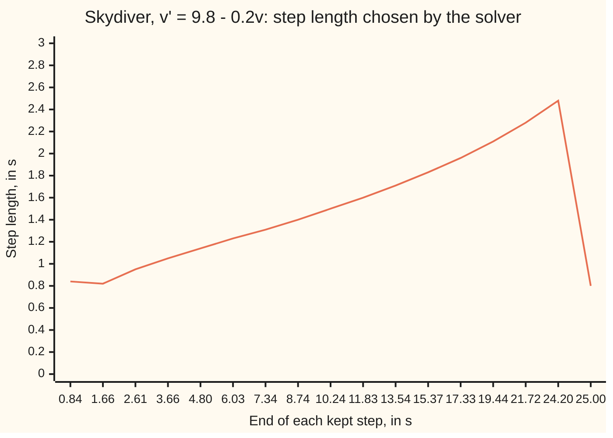

# Adaptive steps: two estimates per step disagree by about the error, so let the solver pick its own step

[Syllabus](../../../SYLLABUS.md) → [Differential equations and dynamics](../README.md) → [Numerical Evolution](../README.md#s05) → Adaptive steps

---

## General Overview

A skydiver leaves the plane at rest. Gravity adds 9.8 m/s of speed every second; air drag takes away 0.2 per second times the current speed. So the speed v, in m/s, obeys v' = 9.8 − 0.2v with v(0) = 0: "the rate of v is 9.8 minus a fifth of v". The exact answer is v = 49(1 − e^(−0.2t)), which climbs fast at first and then flattens towards 49 m/s, the terminal speed.

A fixed step must suit the fast early seconds, then is wasted on the flat ones. An adaptive solver computes each step twice, by two recipes of different accuracy that share almost all their arithmetic, and compares the difference with an allowance. It keeps or retries the step, and lengthens or shortens the next.

With an allowance of one millionth of (1 + speed) per step, the Dormand-Prince pair (the standard pair of recipes, orders 5 and 4) reaches 25 s in 17 kept steps and 1 rejected try: five steps cover the first 4.80 s, twelve the rest. The step grows from 0.84 s to 2.48 s. A fixed step at the smallest length would take 31.

**Two answers of different accuracy for the same step differ by about the error of the worse one; comparing that difference with an allowance tells the solver whether to keep the step and how long to make the next.**

**What kind of fact this is:** a method; its error estimate is an approximation, justified for small steps in Why it works, and it controls each step's error, not the final one.

### The picture: the solver stretches its stride



Orange: each kept step's length, over the time it ends. The labels sit evenly on the axis; the times do not. The last step is cut to 0.80 s to land on 25 s.

---

## The formula

Reminder: a step of length h moves the solution from t to t + h, and a method has order p when its error over a fixed time shrinks like h^p ([Order of a method](02-local-and-global-error-and-order.md)).

An **embedded pair** is two step recipes, of orders p + 1 and p, built from the same stage rates. From speed $v$ they give $v_5$ and $v_4$ (orders 5 and 4 for Dormand-Prince). The error estimate, the allowance and the step rule are

$$E = |v_4 - v_5|,\qquad \tau = 10^{-6}\,\bigl(1 + \max(|v|, |v_5|)\bigr),\qquad h_{new} = h\cdot\min\!\Bigl(5,\ \max\bigl(0.2,\ \sigma\,(\tau/E)^{1/(p+1)}\bigr)\Bigr)$$

**Read it aloud:** the answers' gap is the estimate; keep the step if it is within the allowance; either way, scale the next step by a safety factor times the fifth root of allowance over estimate, by at most 5 and at least a fifth.

The step kept is $v_5$, the better of the two. With step doubling instead of a pair, the same step is taken once at length h and twice at h/2, giving $Y_c$ and $Y_f$, and

$$Y_f - v_{exact} \approx \frac{Y_c - Y_f}{2^p - 1}.$$

**Read it aloud:** the fine answer's error is the coarse-minus-fine gap divided by 2^p − 1; for Runge-Kutta four, by 15.

| Symbol | Plain meaning | In our example | Push it up and the answer… |
| --- | --- | --- | --- |
| $t$, $v$, $v_{exact}$ | time in s; the solver's speed in m/s; the true speed | 0 to 25 s; v(0) = 0 | — |
| $h$, $h_{new}$ | this step's length; the next one's | 1 s tried, 0.843 s kept | error grows like h^5 |
| $v_5$, $v_4$ | the pair's order-5 and order-4 answers | 8.882192107 and 8.882205827 at h = 1 | — |
| $Y_c$, $Y_f$ | step doubling: one step of h, two of h/2 | Runge-Kutta four, h = 1 | — |
| $E$, $\tau$ | error estimate; the allowance per step | 1.3720e-5 against 9.8822e-6 | a bigger τ gives longer steps |
| $p$ | order of the less accurate member | 4 for Dormand-Prince | the exponent 1/(p+1) shrinks |
| $\sigma$ | safety factor, aiming below the line | 0.9 | 1.0 gives 12 rejections, not 1 |
| $z$, $D$ | z = −0.2h; D(z), the pair's gap per unit of 49 − v | D(−0.2) = 2.8000e-7 | — |

### When it holds

- **The solution is smooth across each step.** The error law, constant times h^5, needs several derivatives. When the parachute opens, drag jumps, the law fails, and the solver shrinks its step to squeeze past.
- **Steps short enough for the leading term to dominate.** At h = 1 s the estimate, 1.3720e-5, is close to the order-4 answer's true error, 1.2727e-5; far longer steps can break that.
- **The allowance is per step.** Error carried in is not measured; drag shrinks it here, a growing equation magnifies it.
- **The equation is not stiff** (stiff: a fast-decaying part forces short steps for stability, not accuracy). Otherwise the controller wastes effort; see [Stiff equations](06-stiff-equations-and-backward-euler.md).

---

## Why it works

### Step 0: two answers, one much better, differ by the worse one's error

Write each answer as truth plus error: $v_4$ = truth + e4 and $v_5$ = truth + e5. Then $v_4 - v_5$ = e4 − e5. For a small step e5 is smaller than e4 by roughly a factor h, so the gap is nearly e4.

### Step 1: the pair shares its work

Dormand-Prince evaluates the rate at seven points in the step, the stages ([Runge-Kutta four](04-runge-kutta-four.md) uses four). The last is the rate at the step's end, reused as the next step's first, so a step costs six new evaluations. One set of weights on the seven rates gives order 5, another order 4: the estimate is free.

### Step 2: on the skydiver, every step is a polynomial

The gap to terminal speed, 49 − v, obeys (49 − v)' = −0.2(49 − v). Any Runge-Kutta step multiplies that gap by a fixed polynomial in z = −0.2h, while the exact solution multiplies it by e^z. For the pair, working the stages through gives

$$R_5(z) = 1 + z + \tfrac{z^2}{2} + \tfrac{z^3}{6} + \tfrac{z^4}{24} + \tfrac{z^5}{120} + \tfrac{z^6}{600},$$

and the order-4 polynomial matches it up to z^4 but carries 1097/120000 z^5 instead of 1/120 z^5, plus its own z^6 and z^7 terms. So the two answers differ by 49 − v times

$$D(z) = -\tfrac{97}{120000}z^5 + \tfrac{39}{120000}z^6 - \tfrac{5}{120000}z^7.$$

The order-4 answer's true error starts with the same −97/120000 z^5, since e^z carries 1/120 z^5; the order-5 answer's starts at z^6. Step 0, in numbers.

### Step 3: the fifth power sets the rule, and the flat stretch earns long steps

The estimate grows like h^5: halving h = 1 s shrinks it by 33.28, against 2^5 = 32. To bring an estimate E to the allowance τ, multiply h by the fifth root of τ/E. The safety factor 0.9 aims below the line, because the constant in front of h^5 drifts between steps; the caps stop one odd estimate from throwing the step around. In general the exponent is 1/(p + 1): an order-p method's error over one step scales like h^(p+1). The estimate is (49 − v) times D(z); the gap 49 − v shrinks like e^(−0.2t) while τ grows with the speed, so h lengthens as the fall flattens.

<details>
<summary>Detailed proof: the estimate is the lower-order error to leading order</summary>

Let $u(t+h)$ be the exact solution through $v$ at the step's end. An order-p member has $v_4 - u(t+h) = C h^{p+1} + O(h^{p+2})$, with C smooth in t and v; the order-(p+1) member has $v_5 - u(t+h) = O(h^{p+2})$. Subtracting, $v_4 - v_5 = C h^{p+1} + O(h^{p+2})$: the order-p error, up to one power of h.

If C barely changes between steps, setting $C h_{new}^{p+1} = \tau$ and dividing by $E = C h^{p+1}$ gives $h_{new} = h(\tau/E)^{1/(p+1)}$; the safety factor absorbs the drift in C.

Step doubling: the coarse error is $C h^{p+1}$; two half steps add to $2C(h/2)^{p+1} = C h^{p+1}/2^p$. Their difference is $C h^{p+1}(1 - 2^{-p})$, so the fine error is $(Y_c - Y_f)/(2^p - 1)$, up to $O(h^{p+2})$.

</details>

Step doubling is the second road to an estimate. With Runge-Kutta four and h = 1 s it gives −7.9443e-6 for the fine answer's error; the true error is −7.2681e-6. It costs eleven new rate evaluations per step against the pair's six, so solvers use pairs. How the pair's weights are found is in Embedded pairs.

---

## Worked numbers, by hand

The solver's first try from v = 0, with h = 1 s, so z = −0.2.

| Step | Arithmetic | Value |
| --- | --- | --- |
| order-5 multiplier | R5(−0.2), the seven terms above | 0.818730773 |
| order-5 speed | 49 × (1 − 0.818730773) | 8.882192107 m/s |
| gap per unit | D(−0.2), three terms, the first dominant | 2.8000e-7 |
| estimate | 49 × 2.8000e-7 | 1.3720e-5 m/s |
| allowance | 10^−6 × (1 + 8.882192107) | 9.8822e-6 m/s |
| verdict | 1.3720e-5 is over the allowance | reject |
| new length | 1 × 0.9 × (9.8822e-6 / 1.3720e-5)^(1/5) | 0.843 s |
| retry | estimate 5.7640e-6 against allowance 8.6011e-6 | **kept** |

The one-second try is discarded; a 0.843 s step, estimated safely within its allowance, is kept.

### What breaks if you drop a piece

| Mistake | Comes out at | What went wrong |
| --- | --- | --- |
| No safety factor, σ = 1 | 12 rejected tries instead of 1 | aiming at the line puts many steps just over it |
| One step length for the whole fall | 31 steps instead of 17 | the shortest step is spent where nothing moves |
| Step doubling divided by 31, not 15 | −3.8440e-6 against a true −7.2681e-6 | 31 treats the fine answer as one half step; the two half steps' errors add |
| Reading "tolerance 10^−6" as the final accuracy | v(25) off by −7.452e-6 m/s | the allowance is per step, and it grows with the speed |

The code prints all four.

---

## Code, from first principles, and it actually runs

Road A steps the skydiver with the Dormand-Prince stages and the controller. Road B is closed form: the polynomials R5 and D, Runge-Kutta four as 1 + z + z^2/2 + z^3/6 + z^4/24, and the exact 49(1 − e^(−0.2t)). Asserts test the stages against the polynomials R5 and D, each estimate against the true error, and the final speed against the exact one. Both languages print the same bytes; the stage sums avoid Python's `sum`, whose different rounding flipped one borderline rejection.

### Python

```python
# Adaptive steps on the skydiver v' = 9.8 - 0.2v, v(0) = 0, exact v = 49(1 - e^(-0.2t)).
# Road A: the Dormand-Prince 5(4) pair, stage by stage, with the step controller.
# Road B: closed forms. On this equation every step multiplies the gap 49 - v by a
# polynomial in z = -0.2h, and the exact answer multiplies it by e^z.
from math import exp
A = [[], [1/5], [3/40, 9/40], [44/45, -56/15, 32/9],
     [19372/6561, -25360/2187, 64448/6561, -212/729],
     [9017/3168, -355/33, 46732/5247, 49/176, -5103/18656],
     [35/384, 0, 500/1113, 125/192, -2187/6784, 11/84]]
B4 = [5179/57600, 0, 7571/16695, 393/640, -92097/339200, 187/2100, 1/40]
f = lambda v: 9.8 - 0.2 * v
def comb(v, h, w, k):                            # v + h times the weighted stage rates
    s = 0.0
    for a, q in zip(w, k): s += a * q
    return v + h * s
def pair(v, h):                                  # one Dormand-Prince step: fifth, fourth
    k = []
    for row in A: k.append(f(comb(v, h, row, k)))
    return comb(v, h, A[6], k), comb(v, h, B4, k)
def sci(x, d=4): m, e = f"{x:.{d}e}".split("e"); return f"{m}e{int(e)}"
def allowed(v, w): return 1e-6 * (1 + max(abs(v), abs(w)))
def solve(T, h, safety):
    t, v, ends, lens, rejected = 0.0, 0.0, [], [], 0
    while t < T - 1e-12:
        h = min(h, T - t)
        v5, v4 = pair(v, h)
        est, tol = abs(v5 - v4), allowed(v, v5)
        if est <= tol: t, v = t + h, v5; ends.append(t); lens.append(h)
        else: rejected += 1
        h *= min(5.0, max(0.2, safety * (tol / est) ** 0.2))
    return v, ends, lens, rejected
exact = lambda t: 49 * (1 - exp(-0.2 * t))
poly = lambda z, c: sum(ci * z ** i for i, ci in enumerate(c))
R5 = [1, 1, 1/2, 1/6, 1/24, 1/120, 1/600]
D = [0, 0, 0, 0, 0, -97/120000, 39/120000, -5/120000]   # fifth minus fourth
v5, v4 = pair(0.0, 1.0); est = abs(v5 - v4)
print(f"try h=1.000: fifth {v5:.9f}, fourth {v4:.9f}, estimate {sci(v4 - v5)}, allowed {sci(allowed(0, v5))}")
assert abs(v5 - 49 * (1 - poly(-0.2, R5))) < 1e-12 and abs(v4 - v5 - 49 * poly(-0.2, D)) < 1e-12
print(f"by hand: R5(-0.2) = {poly(-0.2, R5):.9f}, D(-0.2) = {sci(poly(-0.2, D))}")
print(f"road B, estimate 49 D(-0.2) = {sci(49 * poly(-0.2, D))}")
print(f"true error, computed minus exact: fourth {sci(v4 - exact(1))}, fifth {sci(v5 - exact(1))}")
assert abs((v4 - v5) / (v4 - exact(1)) - 1) < 0.1
h1 = 0.9 * (allowed(0, v5) / est) ** 0.2
w5, w4 = pair(0.0, h1); ok = "accepted" if abs(w5 - w4) <= allowed(0, w5) else "rejected"
print(f"retry h={h1:.3f}: estimate {sci(abs(w5 - w4))}, allowed {sci(allowed(0, w5))}, {ok}")
print(f"halve h=1: estimate shrinks by {est / abs(pair(0.0, 0.5)[0] - pair(0.0, 0.5)[1]):.2f} (2^5 = 32)")
rk4 = lambda v, h: 49 - (49 - v) * poly(-0.2 * h, R5[:5])
yc, yf = rk4(0.0, 1.0), rk4(rk4(0.0, 0.5), 0.5)
print(f"step doubling, RK4 h=1: estimate {sci((yc - yf) / 15)}, true fine error {sci(yf - exact(1))}")
assert abs((yc - yf) / 15 / (yf - exact(1)) - 1) < 0.1
v, ends, lens, rej = solve(25.0, 1.0, 0.9)
early = sum(1 for e in ends if e <= 5)
print(f"accepted {len(ends)}, rejected {rej}; first 5 s: {early}, after: {len(ends) - early}")
print("figure, step ends t:", ", ".join(f"{e:.2f}" for e in ends))
print("figure, step lengths h:", ", ".join(f"{x:.2f}" for x in lens))
print(f"v(25): adaptive {v:.9f}, exact {exact(25):.9f}, global error {sci(v - exact(25), 3)}")
assert abs(v - exact(25)) < 1e-5
print(f"breaks: no safety factor rejects {solve(25.0, 1.0, 1.0)[3]}; uniform at smallest h needs {int(25 / min(lens[:-1])) + 1} steps")
print(f"breaks: step doubling divided by 31, not 15: {sci((yc - yf) / 31)}")
print("PASS")
```

**Ran 2026-09-28 on macOS, Python 3.14.6, standard library only. All checks passed. Output, pasted from the run:**

```
try h=1.000: fifth 8.882192107, fourth 8.882205827, estimate 1.3720e-5, allowed 9.8822e-6
by hand: R5(-0.2) = 0.818730773, D(-0.2) = 2.8000e-7
road B, estimate 49 D(-0.2) = 1.3720e-5
true error, computed minus exact: fourth 1.2727e-5, fifth -9.9251e-7
retry h=0.843: estimate 5.7640e-6, allowed 8.6011e-6, accepted
halve h=1: estimate shrinks by 33.28 (2^5 = 32)
step doubling, RK4 h=1: estimate -7.9443e-6, true fine error -7.2681e-6
accepted 17, rejected 1; first 5 s: 5, after: 12
figure, step ends t: 0.84, 1.66, 2.61, 3.66, 4.80, 6.03, 7.34, 8.74, 10.24, 11.83, 13.54, 15.37, 17.33, 19.44, 21.72, 24.20, 25.00
figure, step lengths h: 0.84, 0.82, 0.95, 1.05, 1.14, 1.23, 1.31, 1.40, 1.50, 1.60, 1.71, 1.83, 1.96, 2.11, 2.28, 2.48, 0.80
v(25): adaptive 48.669833145, exact 48.669840597, global error -7.452e-6
breaks: no safety factor rejects 12; uniform at smallest h needs 31 steps
breaks: step doubling divided by 31, not 15: -3.8440e-6
PASS
```

### Rust

```rust
// Adaptive steps on the skydiver v' = 9.8 - 0.2v, v(0) = 0, exact v = 49(1 - e^(-0.2t)).
// Road A: the Dormand-Prince 5(4) pair, stage by stage, with the step controller.
// Road B: closed forms. On this equation every step multiplies the gap 49 - v by a
// polynomial in z = -0.2h, and the exact answer multiplies it by e^z.
const A: [&[f64]; 7] = [&[], &[1.0 / 5.0], &[3.0 / 40.0, 9.0 / 40.0],
    &[44.0 / 45.0, -56.0 / 15.0, 32.0 / 9.0],
    &[19372.0 / 6561.0, -25360.0 / 2187.0, 64448.0 / 6561.0, -212.0 / 729.0],
    &[9017.0 / 3168.0, -355.0 / 33.0, 46732.0 / 5247.0, 49.0 / 176.0, -5103.0 / 18656.0],
    &[35.0 / 384.0, 0.0, 500.0 / 1113.0, 125.0 / 192.0, -2187.0 / 6784.0, 11.0 / 84.0]];
const B4: [f64; 7] = [5179.0 / 57600.0, 0.0, 7571.0 / 16695.0, 393.0 / 640.0,
    -92097.0 / 339200.0, 187.0 / 2100.0, 1.0 / 40.0];
fn f(v: f64) -> f64 { 9.8 - 0.2 * v }
fn comb(v: f64, h: f64, w: &[f64], k: &[f64]) -> f64 {
    v + h * w.iter().zip(k).map(|(a, q)| a * q).sum::<f64>()
}
fn pair(v: f64, h: f64) -> (f64, f64) { // one Dormand-Prince step: fifth, fourth
    let mut k: Vec<f64> = Vec::new();
    for row in A.iter() { let s = comb(v, h, row, &k); k.push(f(s)); }
    (comb(v, h, A[6], &k), comb(v, h, &B4, &k))
}
fn allowed(v: f64, w: f64) -> f64 { 1e-6 * (1.0 + v.abs().max(w.abs())) }
fn solve(tend: f64, mut h: f64, safety: f64) -> (f64, Vec<f64>, Vec<f64>, u32) {
    let (mut t, mut v, mut ends, mut lens, mut rejected) = (0.0, 0.0, vec![], vec![], 0);
    while t < tend - 1e-12 {
        h = h.min(tend - t);
        let (v5, v4) = pair(v, h);
        let (est, tol) = ((v5 - v4).abs(), allowed(v, v5));
        if est <= tol { t += h; v = v5; ends.push(t); lens.push(h); } else { rejected += 1; }
        h *= (safety * (tol / est).powf(0.2)).max(0.2).min(5.0);
    }
    (v, ends, lens, rejected)
}
fn exact(t: f64) -> f64 { 49.0 * (1.0 - (-0.2 * t).exp()) }
fn poly(z: f64, c: &[f64]) -> f64 { c.iter().rev().fold(0.0, |acc, ci| acc * z + ci) }
fn join(x: &[f64]) -> String { x.iter().map(|e| format!("{:.2}", e)).collect::<Vec<_>>().join(", ") }
fn main() {
    let r5 = [1.0, 1.0, 0.5, 1.0 / 6.0, 1.0 / 24.0, 1.0 / 120.0, 1.0 / 600.0];
    let d = [0.0, 0.0, 0.0, 0.0, 0.0, -97.0 / 120000.0, 39.0 / 120000.0, -5.0 / 120000.0];
    let (v5, v4) = pair(0.0, 1.0);
    let est = (v5 - v4).abs();
    println!("try h=1.000: fifth {:.9}, fourth {:.9}, estimate {:.4e}, allowed {:.4e}", v5, v4, v4 - v5, allowed(0.0, v5));
    assert!((v5 - 49.0 * (1.0 - poly(-0.2, &r5))).abs() < 1e-12 && (v4 - v5 - 49.0 * poly(-0.2, &d)).abs() < 1e-12);
    println!("by hand: R5(-0.2) = {:.9}, D(-0.2) = {:.4e}", poly(-0.2, &r5), poly(-0.2, &d));
    println!("road B, estimate 49 D(-0.2) = {:.4e}", 49.0 * poly(-0.2, &d));
    println!("true error, computed minus exact: fourth {:.4e}, fifth {:.4e}", v4 - exact(1.0), v5 - exact(1.0));
    assert!(((v4 - v5) / (v4 - exact(1.0)) - 1.0).abs() < 0.1);
    let h1 = 0.9 * (allowed(0.0, v5) / est).powf(0.2);
    let (w5, w4) = pair(0.0, h1);
    let ok = if (w5 - w4).abs() <= allowed(0.0, w5) { "accepted" } else { "rejected" };
    println!("retry h={:.3}: estimate {:.4e}, allowed {:.4e}, {}", h1, (w5 - w4).abs(), allowed(0.0, w5), ok);
    let (x5, x4) = pair(0.0, 0.5);
    println!("halve h=1: estimate shrinks by {:.2} (2^5 = 32)", est / (x5 - x4).abs());
    let rk4 = |v: f64, h: f64| 49.0 - (49.0 - v) * poly(-0.2 * h, &r5[..5]);
    let (yc, yf) = (rk4(0.0, 1.0), rk4(rk4(0.0, 0.5), 0.5));
    println!("step doubling, RK4 h=1: estimate {:.4e}, true fine error {:.4e}", (yc - yf) / 15.0, yf - exact(1.0));
    assert!(((yc - yf) / 15.0 / (yf - exact(1.0)) - 1.0).abs() < 0.1);
    let (v, ends, lens, rej) = solve(25.0, 1.0, 0.9);
    let early = ends.iter().filter(|&&e| e <= 5.0).count();
    println!("accepted {}, rejected {}; first 5 s: {}, after: {}", ends.len(), rej, early, ends.len() - early);
    println!("figure, step ends t: {}", join(&ends));
    println!("figure, step lengths h: {}", join(&lens));
    println!("v(25): adaptive {:.9}, exact {:.9}, global error {:.3e}", v, exact(25.0), v - exact(25.0));
    assert!((v - exact(25.0)).abs() < 1e-5);
    let hmin = lens[..lens.len() - 1].iter().cloned().fold(f64::MAX, f64::min);
    println!("breaks: no safety factor rejects {}; uniform at smallest h needs {} steps", solve(25.0, 1.0, 1.0).3, (25.0 / hmin) as u32 + 1);
    println!("breaks: step doubling divided by 31, not 15: {:.4e}", (yc - yf) / 31.0);
    println!("PASS");
}
```

**Ran 2026-09-28 on macOS, rustc 1.98.1, no crates. All checks passed. Output, pasted from the run:**

```
try h=1.000: fifth 8.882192107, fourth 8.882205827, estimate 1.3720e-5, allowed 9.8822e-6
by hand: R5(-0.2) = 0.818730773, D(-0.2) = 2.8000e-7
road B, estimate 49 D(-0.2) = 1.3720e-5
true error, computed minus exact: fourth 1.2727e-5, fifth -9.9251e-7
retry h=0.843: estimate 5.7640e-6, allowed 8.6011e-6, accepted
halve h=1: estimate shrinks by 33.28 (2^5 = 32)
step doubling, RK4 h=1: estimate -7.9443e-6, true fine error -7.2681e-6
accepted 17, rejected 1; first 5 s: 5, after: 12
figure, step ends t: 0.84, 1.66, 2.61, 3.66, 4.80, 6.03, 7.34, 8.74, 10.24, 11.83, 13.54, 15.37, 17.33, 19.44, 21.72, 24.20, 25.00
figure, step lengths h: 0.84, 0.82, 0.95, 1.05, 1.14, 1.23, 1.31, 1.40, 1.50, 1.60, 1.71, 1.83, 1.96, 2.11, 2.28, 2.48, 0.80
v(25): adaptive 48.669833145, exact 48.669840597, global error -7.452e-6
breaks: no safety factor rejects 12; uniform at smallest h needs 31 steps
breaks: step doubling divided by 31, not 15: -3.8440e-6
PASS
```

> [!TIP]
> **Try changing**
> - **A tighter allowance.** Guess first how many steps 10^−8 needs. Change `1e-6` to `1e-8` in `allowed`: 39 kept steps and 2 rejected (the retry line now reads rejected), 12 in the first 5 s, final error −8.123e-8 m/s.
> - **Keep the worse answer.** Guess first whether it matters. In `solve`, keep `v4` instead of `v5`: the same 17 steps, but the final error grows to 3.847e-5 m/s.
> - **The wrong exponent.** Change `** 0.2` to `** 0.25` in `solve`: 16 kept steps, still 1 rejection, final error −8.009e-6 m/s. Near τ/E = 1 the exponent barely matters.

---

## The usual mistake

> [!warning]
> **Treating the tolerance as the final answer's accuracy.** The controller bounds an estimate of each step's own error, from where the previous step left off, never the error already carried. Here every step met its allowance, the label said 10^−6, and the final speed is still off by −7.452e-6 m/s; on an equation that amplifies old errors the gap can be orders of magnitude.
>
> - **Keeping the fourth-order answer because "that is what was estimated".** Keeping $v_5$ is standard; keeping $v_4$ here makes the final error 3.847e-5 m/s.
> - **Dividing step doubling's gap by 2^(p+1) − 1.** For Runge-Kutta four that is 31, and the estimate halves to −3.8440e-6.

---

## Where you meet it in real life

- **General-purpose solvers.** MATLAB's `ode45` and SciPy's `RK45` run the Dormand-Prince pair with this controller; the user sets tolerances, not a step length.
- **Orbits.** A comet races near the Sun and crawls far away; the steps shorten at closest approach and stretch in between.
- **Chemical kinetics.** A reaction that flares then settles is stepped this way until it turns stiff; then [Stiff equations](06-stiff-equations-and-backward-euler.md) takes over.
- **Long runs of oscillators.** Adaptive steps let energy drift over thousands of swings; [Symplectic steps](07-symplectic-steps-for-oscillators.md) trades that for fixed steps that conserve it.

> **Say it back**
> Take each step with two recipes of different order sharing the same rate evaluations. Their answers differ by about the worse one's error, since the better one's error is a power of h smaller. Keep or retry the step by comparing that gap with an allowance, and scale the next step by 0.9 times the fifth root of allowance over gap. The skydiver's steps grow from 0.84 s to 2.48 s as the fall flattens. The allowance governs each step, not the final answer.

---

## What this builds on

- [Runge-Kutta four](04-runge-kutta-four.md): stages, weights and the order-4 step that the pair and step doubling both extend.

## Where this goes next

- Embedded pairs: how the order conditions fix the pair's weights, and controllers that remember past steps.

This card took the pair's weights on trust; where they come from is what that card works out.

---

## Sources

Verified 2026-09-28: every link below resolves to the publisher's page.

- Dormand, J. R., and P. J. Prince. "A family of embedded Runge-Kutta formulae." *Journal of Computational and Applied Mathematics* 6(1), 1980, 19–26. [DOI](https://doi.org/10.1016/0771-050X(80)90013-3). The pair's coefficients.
- Hairer, E., S. P. Nørsett and G. Wanner. *Solving Ordinary Differential Equations I: Nonstiff Problems*, 2nd ed. Springer, 1993. [Publisher page](https://doi.org/10.1007/978-3-540-78862-1). Section II.4: the step rule, safety factor and caps.
- Shampine, L. F., and M. W. Reichelt. "The MATLAB ODE Suite." *SIAM Journal on Scientific Computing* 18(1), 1997, 1–22. [DOI](https://doi.org/10.1137/S1064827594276424). How `ode45` is built on the pair.
- Driscoll, T. A., and R. J. Braun. *Fundamentals of Numerical Computation*, section 6.5. [Online edition](https://fncbook.com/adaptive-rk/). Embedded pairs and the controller, with code.
