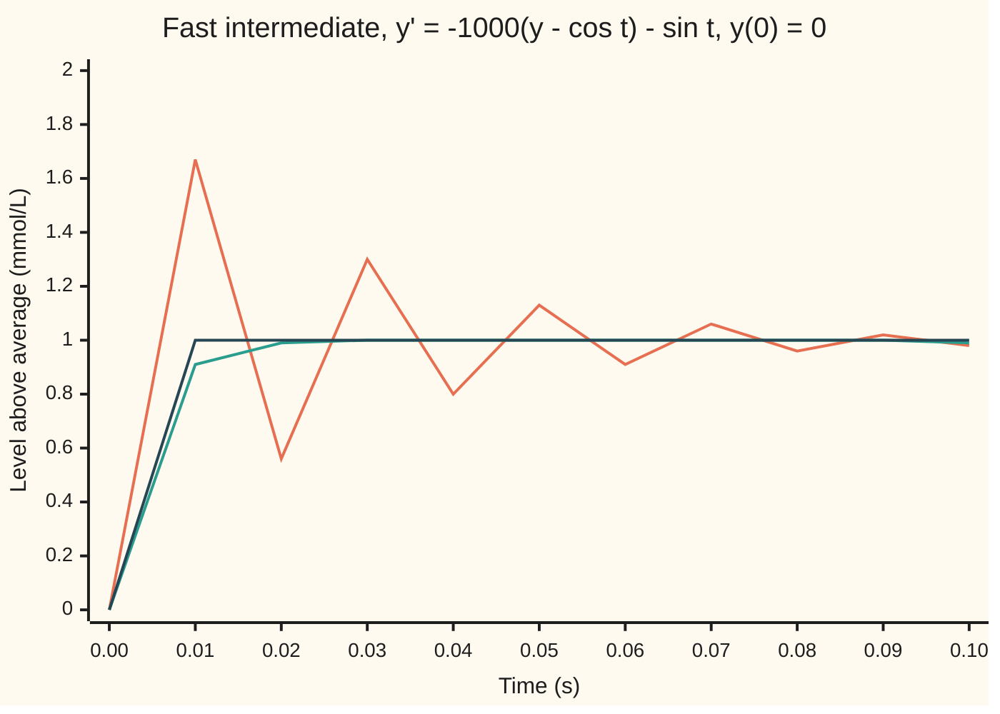

# Stiff equations: when fast and slow parts coexist, step from the destination's slope instead

[Syllabus](../../../SYLLABUS.md) → [Differential equations and dynamics](../../../SYLLABUS.md#w08) → [Numerical Evolution](../../../SYLLABUS.md#w08-s05) → Stiff equations

---

## General Overview

A reactor makes a chemical intermediate that is formed and used up within about a thousandth of a second. Its level snaps onto a balance level set by the slow feed: cos t at time t seconds, in mmol per litre above the reactor's average. The level y obeys y' = −1000(y − cos t) − sin t: the level is pulled towards the balance level at 1000 per second times the distance, and the −sin t term is the balance level's own drift. The run starts at y = 0.

The exact level jumps onto the balance curve within milliseconds, then rides it, so steps of 0.01 s should do. Euler's rule at that step gives 10 after one step and −3.487e9 (about −3.5 billion) after ten: each step multiplies the gap between estimate and balance curve by −9.

Backward Euler steps along the slope at the destination instead. It multiplies the same gap by 1/11, and its factor stays below 1 at every step size. Averaging the two slopes, the trapezoidal rule, is more accurate but multiplies the gap by −2/3, so it rings. An equation whose fast part forces tiny steps on a start-slope method, though the answer changes slowly, is **stiff**.

**In a stiff equation the fast part decides whether a step is stable; a step built on the slope at its destination shrinks the fast part at every step size, so the step can be chosen for the slow part alone.**

**What kind of fact this is:** a method; that backward Euler shrinks every decaying fast part at every step size is a theorem, proved in Why it works.

### The picture: the first tenth of a second, h = 0.01 s



Orange: the trapezoidal rule, ringing. Green: backward Euler. Dark blue: the exact level. Forward Euler, at −3.487e9 by 0.1 s, is left off.

---

## The formula

Reminder: $y' = f(t, y)$ says the rate of $y$ at time $t$ is the rule $f$; a step of size $h$ moves from time $t_n$ to $t_{n+1} = t_n + h$, and $y_n$ is the estimate after $n$ steps ([Euler's method](01-eulers-method.md)). The three steps differ only in where they read the slope:

$$\text{forward: } y_{n+1} = y_n + h\,f(t_n, y_n)$$

$$\text{backward: } y_{n+1} = y_n + h\,f(t_{n+1}, y_{n+1})$$

$$\text{trapezoid: } y_{n+1} = y_n + \tfrac{h}{2}\bigl(f(t_n, y_n) + f(t_{n+1}, y_{n+1})\bigr)$$

**Read it aloud:** forward Euler uses the slope where it stands, backward Euler the slope where it lands, the trapezoid their average.

The unknown on the right makes the last two **implicit**: each step is an equation. Here $f$ is a straight line in $y$, so one division solves it.

The fast part is the gap $d = y - \cos t$. It obeys $d' = \lambda d$ with $\lambda = -1000$ per s. Write $z = h\lambda$. Each method multiplies the gap per step by its **gap factor** $R$:

$$R_{\text{forward}} = 1 + z, \qquad R_{\text{backward}} = \frac{1}{1 - z}, \qquad R_{\text{trapezoid}} = \frac{1 + z/2}{1 - z/2}, \qquad R_{\text{exact}} = e^{z}.$$

**Read it aloud:** at h = 0.01 s, z is −10, and the three methods multiply the gap by −9, 1/11 and −2/3, while the truth multiplies it by e^(−10), about 0.000045.

| Symbol | Plain meaning | In our example | Push it up and the answer… |
| --- | --- | --- | --- |
| $t$, $t_n$, $n$ | time in s; the time after $n$ steps; the step count | 0 to 1 s | — |
| $y$, $y_n$ | intermediate level, mmol/L above average; the estimate after $n$ steps | 0 at the start, near 1 after | — |
| $f$ | the rule giving the rate of $y$ | −1000(y − cos t) − sin t | — |
| $h$ | step size, s | 0.01 | forward Euler blows up past 0.002 |
| $\lambda$ | rate of the fast part, per s | −1000 | more negative: a tighter forward limit |
| $z$ | $h\lambda$: step size measured in fast-part lifetimes | −10 | — |
| $R$ | gap factor: what one step multiplies the gap by | −9, 1/11, −2/3 | above 1 in size: blow-up |
| $d$, $d_n$, $\ell_n$ | gap: level minus balance curve, exact and after $n$ steps; one step's leftover | −1 at the start | — |

### When it holds

- **The fast part decays.** If it grows, backward Euler with a long step still shrinks it, hiding a real runaway.
- **The destination equation can be solved.** Here by division; for a curved rule, by Newton's method each step.
- **Many variables.** A system has one rate per direction, the eigenvalues of its Jacobian (the matrix of the rule's partial derivatives); the picture holds direction by direction.

---

## Why it works

### Step 0: split the level into a slow curve and a fast gap

Put $d = y - \cos t$. Then $d' = y' + \sin t = -1000\,d$, so $d = d(0)\,e^{-1000t}$ ([The integrating factor](../01-Rate%20Equations/05-integrating-factor.md)). The start gives $d(0) = -1$, so the exact level is $y = \cos t - e^{-1000t}$.

Since $f$ is straight in $y$, each step moves the gap by its own factor, plus a small leftover $\ell_n$ from the curve's bend.

### Step 1: forward Euler multiplies the gap by 1 + z

Put $y_n = \cos t_n + d_n$ into the forward step. The cosines nearly cancel: $d_{n+1} = (1 - 1000h)\,d_n + \ell_n$ with $\ell_n$ about $h^2/2$. At h = 0.01 the factor is −9: y at 0.1 s is −3.487e9, at 1 s −2.656e95. Starting on the curve at y = 1 does not help; the leftovers seed the gap and the error at 0.1 s is −1.743e4.

The gap shrinks only while $|1 - 1000h| < 1$: h < 0.002. At h = 0.0019, factor −0.9, 500 steps end 5.529e-7 from the truth; at h = 0.0021, factor −1.1, the error is −4.970e20. A step limit set by a part of the solution that vanished in milliseconds is stiffness.

### Step 2: backward Euler divides by 1 − z

The same split in the backward step gives $(1 + 1000h)\,d_{n+1} = d_n + \ell_n$. The factor $1/(1 + 1000h)$ is below 1 for every positive step: 0.500000 at h = 0.001, 0.090909 at 0.01, 0.000100 at 10. The longer the step, the harder the damping.

The leftovers now pile up as a shrinking geometric series: once the start gap has died, the error is at most $h/2000$ (proof below). The run gives −2.720e-6, −1.356e-6 and −6.773e-7 at 1 s for h = 0.01, 0.005 and 0.0025: ratios 2.01 and 2.00, first order.

### Step 3: the trapezoid is second order, but rings

Averaging the slopes gives $(1 - z/2)\,d_{n+1} = (1 + z/2)\,d_n$ plus a leftover of order $h^3$. Its errors at 1 s are 7.008e-9, 1.752e-9 and 4.380e-10: ratios 4.00, second order ([Order of a method](02-local-and-global-error-and-order.md)).

Its factor tends to −1 as the step grows. At h = 0.1 it is −49/51, about −0.9608: the start gap swings through 0.9608, −0.9231, 0.8869 and is still −0.6703 at 1 s. Backward Euler with the same step is off by −2.843e-5.

<details>
<summary>Detailed proof: the implicit factors, and backward Euler's error bound</summary>

Let $\lambda$ be complex with negative real part, and $z = h\lambda$ have real part $a < 0$.

Backward: $|1 - z|^2 = (1 - a)^2 + (\text{imaginary part})^2 > 1$, since $1 - a > 1$. So $|R_{\text{backward}}| < 1$, and the denominator is never 0.

Trapezoid: $|1 + z/2|^2 - |1 - z/2|^2 = 2a < 0$, the imaginary parts cancelling. So $|R_{\text{trapezoid}}| < 1$. Along the negative real line, $R_{\text{trapezoid}} \to -1$ while $R_{\text{backward}} \to 0$.

Error bound: Taylor's theorem at $t_{n+1}$, with the cosine's second derivative at most 1 in size, gives $|\ell_n| \le h^2/2$. With $R = 1/(1 + 1000h)$, $|d_{n+1}| \le R|d_n| + R\,h^2/2$. Summing the geometric series, $|d_n| \le R^n|d_0| + \frac{R\,h^2/2}{1 - R} = R^n|d_0| + \frac{h}{2000}$. The exact gap is $e^{-1000t_n}$ in size, so the error is at most $R^n + e^{-1000t_n} + h/2000$.

</details>

A method whose factor stays below 1 in size for every decaying rate and every step is **A-stable**. Backward Euler and the trapezoid are; no forward-slope method is; and no A-stable multistep method (one that reuses several past values) beats second order. That is Dahlquist's barrier, proved in Stiffness.

---

## Worked numbers, by hand

One step of h = 0.01 s from y = 0.

| Step | Arithmetic | Value |
| --- | --- | --- |
| z | 0.01 × (−1000) | −10 |
| factors | 1 + z; 1 / (1 − z); (1 + z/2) / (1 − z/2) | −9; 0.090909; −0.666667 |
| forward step | 0 + 0.01 × (1000 cos 0 − sin 0) | 10.000000 |
| backward step | 0.01 × (1000 cos 0.01 − sin 0.01) / 11 | 0.909036 |
| trapezoid step | 0.005 × (1000 cos 0 + 1000 cos 0.01 − sin 0.01) / 6 | 1.666617 |
| exact | cos 0.01 − e^(−10) | **0.999905** |

After 0.01 s the intermediate is at 0.999905 mmol/L above average; forward Euler claims 10, a level the reaction never approaches.

### What breaks if you drop a piece

| Mistake | Comes out at | What went wrong |
| --- | --- | --- |
| Forward Euler at h = 0.01 | −3.487e9 at 0.1 s, −2.656e95 at 1 s | gap factor −9 |
| Forward Euler at h = 0.0021, just past the limit | error −4.970e20 after 500 steps | factor −1.1 |
| Trapezoid at h = 0.1 | error −0.6703 at 1 s | factor −49/51 barely damps |
| Backward step solved by plugging the guess back in | 9.999, −89.995, 909.945 | that map multiplies by −10 |

The code prints all four.

---

## Code, from first principles, and it actually runs

Only cosine, sine and the exponential are imported. Road one steps the three rules against the closed form, at three step sizes to show the order. Road two never uses the closed form: it nudges the start by 0.001, steps once from both starts, and divides the difference by the nudge: that is each gap factor, measured. The asserts compare those factors with the algebra, the error ratios with 2 and 4, the errors with the proved bounds, and the trapezoid's ringing with (−49/51)^10.

### Python

```python
# Stiff equations and backward Euler -- the check behind the card.  No imports
# beyond math.  The fast intermediate: y' = -1000(y - cos t) - sin t, y(0) = 0,
# t in s.  Exact solution y = cos t - e^(-1000t).  Road 1: three stepping rules
# against that closed form.  Road 2: nudge the start and measure the factor each
# rule applies to the gap from the slow curve, against the algebra 1 + z,
# 1/(1 - z) and (1 + z/2)/(1 - z/2) with z = -1000h.
from math import cos, sin, exp
K = 1000.0
def g(t): return K * cos(t) - sin(t)                  # f(t, y) = -K y + g(t)
def forward(t, y, h): return y + h * (-K * y + g(t))
def backward(t, y, h): return (y + h * g(t + h)) / (1 + K * h)     # solved for the destination
def trapezoid(t, y, h): return ((1 - K * h / 2) * y + h / 2 * (g(t) + g(t + h))) / (1 + K * h / 2)
def exact(t): return cos(t) - exp(-K * t)
def run(step, h, n, y=0.0):
    ys = [y]
    for i in range(n): ys.append(step(i * h, ys[-1], h))
    return ys
def sci(x, d=3): m, e = f"{x:.{d}e}".split("e"); return f"{m}e{int(e)}"
def err(step, h, n, y=0.0): return run(step, h, n, y)[-1] - (cos(n * h) - (1 - y) * exp(-K * n * h))
steps, names = [forward, backward, trapezoid], ["forward", "backward", "trapezoid"]
h = 0.01; z = -K * h
print("one step, h=0.01, from y=0: " + ", ".join(f"{n} {s(0, 0.0, h):.6f}" for n, s in zip(names, steps)) + f", exact {exact(h):.6f}")
algebra = [1 + z, 1 / (1 - z), (1 + z / 2) / (1 - z / 2)]
nudged = [(s(0, 1e-3, h) - s(0, 0.0, h)) / 1e-3 for s in steps]
print("gap factor, algebra: " + ", ".join(f"{n} {a:.6f}" for n, a in zip(names, algebra)) + f", exact e^z {exp(z):.6f}")
print("gap factor, measured: " + ", ".join(f"{n} {m:.6f}" for n, m in zip(names, nudged)))
assert all(abs(a - m) < 1e-9 for a, m in zip(algebra, nudged))
print(f"forward shrinks the gap only while |1 - 1000h| < 1, so h < 2/1000 = {2 / K:.3f}")
print("figure, t: " + ", ".join(f"{i * h:.2f}" for i in range(11)))
print("figure, exact: " + ", ".join(f"{exact(i * h):.2f}" for i in range(11)))
for n, s in zip(names[1:], steps[1:]):
    print(f"figure, {n}: " + ", ".join(f"{y:.2f}" for y in run(s, h, 10)))
print(f"forward h=0.01: y at t=0.1 {sci(run(forward, h, 10)[-1])}, at t=1 {sci(run(forward, h, 100)[-1])}")
print(f"forward h=0.01 from y=1, already on the slow curve: error at t=0.1 {sci(err(forward, h, 10, 1.0))}")
for hh in (0.0019, 0.0021):
    print(f"forward h={hh}: factor {1 - K * hh:.1f}, 500 steps reach t={500 * hh:.2f}, error {sci(err(forward, hh, 500))}")
eb = [err(backward, hh, round(1 / hh)) for hh in (0.01, 0.005, 0.0025)]
et = [err(trapezoid, hh, round(1 / hh)) for hh in (0.01, 0.005, 0.0025)]
print("error at t=1, h=0.01, 0.005, 0.0025: backward " + ", ".join(sci(e) for e in eb) + f"; ratios {eb[0] / eb[1]:.2f}, {eb[1] / eb[2]:.2f}")
print("error at t=1, h=0.01, 0.005, 0.0025: trapezoid " + ", ".join(sci(e) for e in et) + f"; ratios {et[0] / et[1]:.2f}, {et[1] / et[2]:.2f}")
assert 1.9 < eb[0] / eb[1] < 2.1 and 3.9 < et[1] / et[2] < 4.1 and all(   # orders 1 and 2; errors within the proved bounds
    abs(e) <= x / (2 * K) + exp(-K) + (1 + K * x) ** -round(1 / x) for e, x in zip(eb, (0.01, 0.005, 0.0025))) and abs(err(forward, 0.0019, 500)) <= 0.9 ** 500 + 0.0019 ** 2 / 2 / 0.1
hs = [0.001, 0.01, 0.1, 1.0, 10.0]
fac = [(backward(0, 1e-3, x) - backward(0, 0.0, x)) / 1e-3 for x in hs]
print("backward gap factor, h=0.001 to 10: " + ", ".join(f"{f:.6f}" for f in fac))
assert all(abs(f - 1 / (1 + K * x)) < 1e-9 and 0 < f < 1 for f, x in zip(fac, hs))
tr = [err(trapezoid, 0.1, n) for n in (1, 2, 3, 10)]
print("h=0.1, trapezoid error at t=0.1, 0.2, 0.3, 1: " + ", ".join(f"{e:.4f}" for e in tr) + f"; backward at t=1 {sci(err(backward, 0.1, 10))}")
assert abs(tr[-1] + (-49 / 51) ** 10) < 0.01             # the start gap -1, times (-49/51) ten times
v, its = 0.0, []
for _ in range(3): v = 0.0 + h * (-K * v + g(h)); its.append(v)     # plug-in iteration, not a solve
print("backward step by plug-in iteration: " + ", ".join(f"{x:.3f}" for x in its) + f"; solved {backward(0, 0.0, h):.6f}")
print("ALL CHECKS PASS")
```

**Ran 2026-09-28 on macOS, Python 3.14.6, standard library only. All checks passed. Output, pasted from the run:**

```
one step, h=0.01, from y=0: forward 10.000000, backward 0.909036, trapezoid 1.666617, exact 0.999905
gap factor, algebra: forward -9.000000, backward 0.090909, trapezoid -0.666667, exact e^z 0.000045
gap factor, measured: forward -9.000000, backward 0.090909, trapezoid -0.666667
forward shrinks the gap only while |1 - 1000h| < 1, so h < 2/1000 = 0.002
figure, t: 0.00, 0.01, 0.02, 0.03, 0.04, 0.05, 0.06, 0.07, 0.08, 0.09, 0.10
figure, exact: 0.00, 1.00, 1.00, 1.00, 1.00, 1.00, 1.00, 1.00, 1.00, 1.00, 1.00
figure, backward: 0.00, 0.91, 0.99, 1.00, 1.00, 1.00, 1.00, 1.00, 1.00, 1.00, 0.99
figure, trapezoid: 0.00, 1.67, 0.56, 1.30, 0.80, 1.13, 0.91, 1.06, 0.96, 1.02, 0.98
forward h=0.01: y at t=0.1 -3.487e9, at t=1 -2.656e95
forward h=0.01 from y=1, already on the slow curve: error at t=0.1 -1.743e4
forward h=0.0019: factor -0.9, 500 steps reach t=0.95, error 5.529e-7
forward h=0.0021: factor -1.1, 500 steps reach t=1.05, error -4.970e20
error at t=1, h=0.01, 0.005, 0.0025: backward -2.720e-6, -1.356e-6, -6.773e-7; ratios 2.01, 2.00
error at t=1, h=0.01, 0.005, 0.0025: trapezoid 7.008e-9, 1.752e-9, 4.380e-10; ratios 4.00, 4.00
backward gap factor, h=0.001 to 10: 0.500000, 0.090909, 0.009901, 0.000999, 0.000100
h=0.1, trapezoid error at t=0.1, 0.2, 0.3, 1: 0.9608, -0.9231, 0.8869, -0.6703; backward at t=1 -2.843e-5
backward step by plug-in iteration: 9.999, -89.995, 909.945; solved 0.909036
ALL CHECKS PASS
```

### Rust

```rust
// Stiff equations and backward Euler -- the same check as the Python, in Rust.
// No crates.  The fast intermediate: y' = -1000(y - cos t) - sin t, y(0) = 0,
// t in s.  Exact solution y = cos t - e^(-1000t).  Road 1: three stepping rules
// against that closed form.  Road 2: nudge the start and measure the factor each
// rule applies to the gap from the slow curve, against the algebra 1 + z,
// 1/(1 - z) and (1 + z/2)/(1 - z/2) with z = -1000h.
const K: f64 = 1000.0;
type Step = fn(f64, f64, f64) -> f64;
fn g(t: f64) -> f64 { K * t.cos() - t.sin() }                 // f(t, y) = -K y + g(t)
fn forward(t: f64, y: f64, h: f64) -> f64 { y + h * (-K * y + g(t)) }
fn backward(t: f64, y: f64, h: f64) -> f64 { (y + h * g(t + h)) / (1.0 + K * h) } // solved for the destination
fn trapezoid(t: f64, y: f64, h: f64) -> f64 {
    ((1.0 - K * h / 2.0) * y + h / 2.0 * (g(t) + g(t + h))) / (1.0 + K * h / 2.0)
}
fn exact(t: f64) -> f64 { t.cos() - (-K * t).exp() }
fn run(step: Step, h: f64, n: usize, y: f64) -> Vec<f64> {
    let mut ys = vec![y];
    for i in 0..n { let last = ys[i]; ys.push(step(i as f64 * h, last, h)); }
    ys
}
fn err(step: Step, h: f64, n: usize, y: f64) -> f64 {
    run(step, h, n, y)[n] - ((n as f64 * h).cos() - (1.0 - y) * (-K * n as f64 * h).exp())
}
fn sci(x: f64) -> String { format!("{:.3e}", x) }
fn join(v: &[f64], d: usize) -> String { v.iter().map(|x| format!("{:.*}", d, x)).collect::<Vec<_>>().join(", ") }
fn main() {
    let steps: [Step; 3] = [forward, backward, trapezoid];
    let names = ["forward", "backward", "trapezoid"];
    let h = 0.01; let z = -K * h;
    let one: Vec<String> = (0..3).map(|i| format!("{} {:.6}", names[i], steps[i](0.0, 0.0, h))).collect();
    println!("one step, h=0.01, from y=0: {}, exact {:.6}", one.join(", "), exact(h));
    let algebra = [1.0 + z, 1.0 / (1.0 - z), (1.0 + z / 2.0) / (1.0 - z / 2.0)];
    let nudged: Vec<f64> = steps.iter().map(|s| (s(0.0, 1e-3, h) - s(0.0, 0.0, h)) / 1e-3).collect();
    let al: Vec<String> = (0..3).map(|i| format!("{} {:.6}", names[i], algebra[i])).collect();
    let me: Vec<String> = (0..3).map(|i| format!("{} {:.6}", names[i], nudged[i])).collect();
    println!("gap factor, algebra: {}, exact e^z {:.6}", al.join(", "), z.exp());
    println!("gap factor, measured: {}", me.join(", "));
    assert!((0..3).all(|i| (algebra[i] - nudged[i]).abs() < 1e-9));
    println!("forward shrinks the gap only while |1 - 1000h| < 1, so h < 2/1000 = {:.3}", 2.0 / K);
    println!("figure, t: {}", join(&(0..11).map(|i| i as f64 * h).collect::<Vec<_>>(), 2));
    println!("figure, exact: {}", join(&(0..11).map(|i| exact(i as f64 * h)).collect::<Vec<_>>(), 2));
    println!("figure, backward: {}", join(&run(backward, h, 10, 0.0), 2));
    println!("figure, trapezoid: {}", join(&run(trapezoid, h, 10, 0.0), 2));
    println!("forward h=0.01: y at t=0.1 {}, at t=1 {}", sci(run(forward, h, 10, 0.0)[10]), sci(run(forward, h, 100, 0.0)[100]));
    println!("forward h=0.01 from y=1, already on the slow curve: error at t=0.1 {}", sci(err(forward, h, 10, 1.0)));
    for hh in [0.0019, 0.0021] {
        println!("forward h={}: factor {:.1}, 500 steps reach t={:.2}, error {}", hh, 1.0 - K * hh, 500.0 * hh, sci(err(forward, hh, 500, 0.0)));
    }
    let hs3 = [0.01, 0.005, 0.0025];
    let eb: Vec<f64> = hs3.iter().map(|&x| err(backward, x, (1.0 / x).round() as usize, 0.0)).collect();
    let et: Vec<f64> = hs3.iter().map(|&x| err(trapezoid, x, (1.0 / x).round() as usize, 0.0)).collect();
    for (n, e) in [("backward", &eb), ("trapezoid", &et)] {
        let s: Vec<String> = e.iter().map(|&x| sci(x)).collect();
        println!("error at t=1, h=0.01, 0.005, 0.0025: {} {}; ratios {:.2}, {:.2}", n, s.join(", "), e[0] / e[1], e[1] / e[2]);
    }
    assert!(1.9 < eb[0] / eb[1] && eb[0] / eb[1] < 2.1 && 3.9 < et[1] / et[2] && et[1] / et[2] < 4.1 // orders 1 and 2; errors within the proved bounds
        && eb.iter().zip(hs3.iter()).all(|(&e, &x)| e.abs() <= x / (2.0 * K) + (-K).exp() + (1.0 + K * x).powi(-((1.0 / x).round() as i32)))
        && err(forward, 0.0019, 500, 0.0).abs() <= 0.9_f64.powi(500) + 0.0019 * 0.0019 / 2.0 / 0.1);
    let hs = [0.001, 0.01, 0.1, 1.0, 10.0];
    let fac: Vec<f64> = hs.iter().map(|&x| (backward(0.0, 1e-3, x) - backward(0.0, 0.0, x)) / 1e-3).collect();
    println!("backward gap factor, h=0.001 to 10: {}", join(&fac, 6));
    assert!(fac.iter().zip(hs.iter()).all(|(&f, &x)| (f - 1.0 / (1.0 + K * x)).abs() < 1e-9 && 0.0 < f && f < 1.0));
    let tr: Vec<f64> = [1, 2, 3, 10].iter().map(|&n| err(trapezoid, 0.1, n, 0.0)).collect();
    println!("h=0.1, trapezoid error at t=0.1, 0.2, 0.3, 1: {}; backward at t=1 {}", join(&tr, 4), sci(err(backward, 0.1, 10, 0.0)));
    assert!((tr[3] + (-49.0_f64 / 51.0).powi(10)).abs() < 0.01);  // the start gap -1, times (-49/51) ten times
    let (mut v, mut its) = (0.0_f64, vec![]);
    for _ in 0..3 { v = 0.0 + h * (-K * v + g(h)); its.push(v); }   // plug-in iteration, not a solve
    println!("backward step by plug-in iteration: {}; solved {:.6}", join(&its, 3), backward(0.0, 0.0, h));
    println!("ALL CHECKS PASS");
}
```

**Ran 2026-09-28 on macOS, rustc 1.98.1, no crates. All checks passed. Output, pasted from the run:**

```
one step, h=0.01, from y=0: forward 10.000000, backward 0.909036, trapezoid 1.666617, exact 0.999905
gap factor, algebra: forward -9.000000, backward 0.090909, trapezoid -0.666667, exact e^z 0.000045
gap factor, measured: forward -9.000000, backward 0.090909, trapezoid -0.666667
forward shrinks the gap only while |1 - 1000h| < 1, so h < 2/1000 = 0.002
figure, t: 0.00, 0.01, 0.02, 0.03, 0.04, 0.05, 0.06, 0.07, 0.08, 0.09, 0.10
figure, exact: 0.00, 1.00, 1.00, 1.00, 1.00, 1.00, 1.00, 1.00, 1.00, 1.00, 1.00
figure, backward: 0.00, 0.91, 0.99, 1.00, 1.00, 1.00, 1.00, 1.00, 1.00, 1.00, 0.99
figure, trapezoid: 0.00, 1.67, 0.56, 1.30, 0.80, 1.13, 0.91, 1.06, 0.96, 1.02, 0.98
forward h=0.01: y at t=0.1 -3.487e9, at t=1 -2.656e95
forward h=0.01 from y=1, already on the slow curve: error at t=0.1 -1.743e4
forward h=0.0019: factor -0.9, 500 steps reach t=0.95, error 5.529e-7
forward h=0.0021: factor -1.1, 500 steps reach t=1.05, error -4.970e20
error at t=1, h=0.01, 0.005, 0.0025: backward -2.720e-6, -1.356e-6, -6.773e-7; ratios 2.01, 2.00
error at t=1, h=0.01, 0.005, 0.0025: trapezoid 7.008e-9, 1.752e-9, 4.380e-10; ratios 4.00, 4.00
backward gap factor, h=0.001 to 10: 0.500000, 0.090909, 0.009901, 0.000999, 0.000100
h=0.1, trapezoid error at t=0.1, 0.2, 0.3, 1: 0.9608, -0.9231, 0.8869, -0.6703; backward at t=1 -2.843e-5
backward step by plug-in iteration: 9.999, -89.995, 909.945; solved 0.909036
ALL CHECKS PASS
```

The two outputs match line for line.

> [!TIP]
> **Try changing**
> Guess first, then run it. The asserts are pinned to the rate 1000 per s.
> - **A milder reaction.** Set `K` to `100.0`. Does forward Euler survive h = 0.01? Yes: its gap factor is 1 − 100 × 0.01 = 0. The last assert stops the run, since the trapezoid's factor has changed.
> - **A much stiffer one.** Set `K` to `1e5`. Backward Euler sits on the curve from the first step, the trapezoid's chart line swings between about 0 and 2, and forward Euler overflows, which stops the run.
> - **No start gap.** In the loop printing the two methods' `figure,` lines, pass `1.0` as a fourth argument to `run`. Does the trapezoid still ring? No: the ringing was the start gap echoing.

---

## The usual mistake

> [!warning]
> **Treating the blow-up as an accuracy problem.** Forward Euler at h = 0.01 is not slightly wrong: it multiplies the gap by −9 per step. Below h = 0.002 the gap dies away; above it nothing saves the run.
>
> - **Thinking implicit means accurate.** Backward Euler is first order: −2.720e-6 at 1 s with h = 0.01, halving with h.
> - **Solving the implicit step by substitution.** Plugging the guess back in gives 9.999, −89.995, 909.945. Solve it instead.

---

## Where you meet it in real life

- **Chemical kinetics.** Curtiss and Hirschfelder named stiffness in 1952, for reactions whose rates differ by many powers of ten.
- **Circuit simulators.** SPICE steps circuits with backward Euler and the trapezoid; after a switch, trapezoid ringing shows as spurious oscillation.
- **Heat flow on a grid.** A bar cut into cells gives equations whose fastest rate grows with the square of the cell count: [Stepping the heat equation on a grid](../10-The%20Classical%20PDEs/09-finite-differences-for-the-heat-equation.md).
- **Adaptive solvers.** On a stiff equation, [Adaptive steps](05-adaptive-step-size.md) keeps rejecting steps for stability, not accuracy.

> **Say it back**
> A stiff equation has a fast part that dies almost at once beside a slow part that carries the answer. A step built on the slope at its start multiplies the fast gap by 1 + z, which shrinks it here only when h is under 0.002. A step built on the slope at its destination multiplies it by 1/(1 − z), below 1 at every step size, at the price of solving an equation each step. The trapezoid is more accurate but rings on long steps.

---

## What this builds on

- [Euler's method](01-eulers-method.md): the forward step and its step size, which this card turns round.
- [The integrating factor](../01-Rate%20Equations/05-integrating-factor.md): the exact solution $y = \cos t - e^{-1000t}$ that every step is measured against.

## Where this goes next

- [Stepping the heat equation on a grid](../10-The%20Classical%20PDEs/09-finite-differences-for-the-heat-equation.md): the same step limit on a heat grid, and the Crank-Nicolson step, which is this trapezoid.
- Stiffness: stability regions in the complex plane, and the order barrier.

Backward Euler pays for stability with first-order accuracy, the trapezoid for accuracy with ringing; whether one method can have high order, full damping and stability together is what the Dahlquist barriers settle.

---

## Sources

Verified 2026-09-28: every link below resolves to the cited work.

- Curtiss, C. F., and J. O. Hirschfelder. "Integration of stiff equations." *Proceedings of the National Academy of Sciences* 38(3), 1952, 235–243. [DOI](https://doi.org/10.1073/pnas.38.3.235). Names stiffness, in chemical kinetics.
- Dahlquist, G. "A special stability problem for linear multistep methods." *BIT* 3, 1963, 27–43. [DOI](https://doi.org/10.1007/BF01963532). Defines A-stability; proves the second-order barrier.
- Hairer, E., and G. Wanner. *Solving Ordinary Differential Equations II: Stiff and Differential-Algebraic Problems*, 2nd ed. Springer, 1996. [Publisher page](https://doi.org/10.1007/978-3-642-05221-7). Stiff solvers and Newton's method inside implicit steps.
- Driscoll, T. A., and R. J. Braun. *Fundamentals of Numerical Computation*, "Stiffness". [Online edition](https://fncbook.com/stiffness/). Stiffness as a stability limit, with code.
