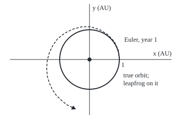

# Symplectic steps: for frictionless motion, a stepper that keeps energy bounded for a million steps

[Syllabus](../../../SYLLABUS.md) → [Differential equations and dynamics](../README.md) → [Numerical Evolution](../README.md#s05) → Symplectic steps

---

## General Overview

A planet circles its sun at 1 AU (the Earth–Sun distance) once a year. Nothing slows it, so its energy and its circle never change. A computer follows it for 1,000 years at 100 steps a year.

Euler's method, which steps along the current slope ([Euler's method](01-eulers-method.md)), fails inside the first year. After 100 steps the planet is at 1.7166 AU, 72% too far out; over 1,000 years it wanders up to 25.88 AU from the true circle.

A different stepper uses the same 100 steps a year. Change the speed by half a step's worth of pull, move the planet at that speed, then give the second half of the pull at the new position. Over all 1,000 years the distance never leaves the true circle by more than 0.00197 AU, 0.197%. This kick–drift–kick step is **leapfrog**, or velocity Verlet, after Loup Verlet's 1967 molecule simulations.

A **state** is a position–velocity pair, a point in a plane. **Leapfrog keeps the area of every patch of states exactly, which pins a spring's or a planet's energy in a narrow band for as long as the run lasts; Euler stretches that area every step, so its energy climbs without limit.**

**What kind of fact this is:** a method. The band is a theorem for the spring $q'' = -q$, proved on this card in Why it works; for the planet the matching theorem is stated and the code measures it.

### The picture: the first year, drawn to scale

<p align="center"></p>

Scale: 60 px per AU, the Sun at the centre. The dashed path is Euler every 5 steps for 100 steps, ending at 1.7166 AU. Leapfrog's largest departure over 1,000 years, 0.00197 AU, is far below one pixel.

---

## The formula

Reminder: $q'' = -q$ says the acceleration of $q$ is minus $q$ itself, as for a mass on a spring ([Normal modes](../04-Systems%20and%20the%20Matrix%20Exponential/07-coupled-oscillators-and-normal-modes.md)). Measure distance in AU and time so one orbit takes $2\pi$ units; on the true circle the planet's $x$-coordinate $q = \cos t$ obeys it exactly. As a pair: $q' = v$, $v' = -q$, with $v$ the velocity. The step size $h$ is the time one step covers; $q_n$, $v_n$ are the values after $n$ steps.

$$v_{n+1/2} = v_n - \tfrac{h}{2}\,q_n, \qquad q_{n+1} = q_n + h\,v_{n+1/2}, \qquad v_{n+1} = v_{n+1/2} - \tfrac{h}{2}\,q_{n+1}$$

**Read it aloud:** give the velocity half a step of pull, move the position a whole step at that velocity, then give the other half of the pull, felt at the new position.

As one matrix $A$ applied to the state:

$$\begin{pmatrix} q_{n+1} \\ v_{n+1} \end{pmatrix} = \begin{pmatrix} a & h \\ -hb & a \end{pmatrix} \begin{pmatrix} q_n \\ v_n \end{pmatrix}, \qquad a = 1 - \tfrac{h^2}{2}, \quad b = 1 - \tfrac{h^2}{4}$$

The energy is $E = \tfrac12(q^2 + v^2)$. Leapfrog keeps a slightly different quantity exactly, the **hidden energy** (in the literature, the modified energy):

$$\tilde E = \tfrac12\,(b\,q^2 + v^2) \quad \text{is the same after every step.}$$

**Read it aloud:** weigh the position a hair less than the velocity, and the total never moves.

| Symbol | Plain meaning | In our example | Push it up and the answer… |
| --- | --- | --- | --- |
| $q$, $v$ | position and velocity, scaled | the planet's x in AU, and its rate | a larger start scales everything |
| $t$, $h$ | time, one orbit = $2\pi$; the step size | $h = 2\pi/100 = 0.0628319$ | the band widens as $h^2$ |
| $n$, $q_n$, $v_n$, $v_{n+1/2}$ | steps taken; state after them; the half-kicked velocity | up to 100,000 steps | — |
| $a$, $b$ | the step's coefficients | 0.998026079 and 0.999013040 | $b$ reaches 0 at $h = 2$ |
| $A$ | the step as a matrix | rows ($a$, $h$) and ($-hb$, $a$) | its determinant stays exactly 1 |
| $E$, $\tilde E$ | energy; the hidden energy leapfrog keeps | 0.5; 0.499507 | — |
| $\theta$ | angle leapfrog turns per step | 0.062842193, against $h$ = 0.062831853 | the timing error grows |
| $r$ | the planet's distance from the Sun, AU | 1 on the true orbit | — |

### When it holds

- **No friction, no driving force.** The true motion must keep its energy; for a damped spring keeping area is the wrong target.
- **A fixed step.** Change $h$ as [Adaptive steps](05-adaptive-step-size.md) does, and each step keeps a different hidden energy; the drift comes back.
- **A small enough step.** For $q'' = -q$ the band needs $h < 2$; at $h = 2.5$ one pattern of motion reaches 4096 in 6 steps.
- **A pull that depends on position only.** Then kick and drift are each exact; a velocity-dependent pull, like a magnetic force, needs a different splitting.

---

## Why it works

### Step 0: split the motion into two pieces that can each be done exactly

Freeze the position and $v' = -q$ is trivial: the velocity changes by $-hq$. That is a **kick**. Freeze the velocity and $q' = v$ is trivial: the position changes by $h$ times $v$. That is a **drift**. Each is a shear: it slides one coordinate by an amount set by the other, which leaves the area of every patch of the $(q, v)$ plane unchanged. A chain of shears keeps area too.

### Step 1: leapfrog's matrix has determinant 1

Substitute the half kick into the drift: $q_{n+1} = a\,q_n + h\,v_n$. Substitute that into the last half kick: $v_{n+1} = -hb\,q_n + a\,v_n$. The determinant of a 2-by-2 matrix is the factor by which it scales areas ([Determinants](../../03-Algebra/05-Solving%20Systems/04-determinants.md)). Here it is

$$a^2 + h^2 b = 1 - h^2 + \tfrac{h^4}{4} + h^2 - \tfrac{h^4}{4} = 1.$$

A step that keeps area in the plane of positions and velocities is called **symplectic**, the word used from here on. In two dimensions symplectic means determinant 1.

### Step 2: Euler's matrix stretches area, and energy with it

Euler's step for the same pair is $q_{n+1} = q_n + h v_n$, $v_{n+1} = v_n - h q_n$. Its matrix has rows (1, $h$) and ($-h$, 1), determinant $1 + h^2$. Square and add the two new values; the cross terms cancel:

$$(q + hv)^2 + (v - hq)^2 = (1 + h^2)(q^2 + v^2).$$

So Euler's energy is multiplied by exactly $1 + h^2$ = 1.003947842 each step. After one orbit of 100 steps it is 0.741455, not 0.5; after 1,000 orbits, 6.5165e+170.

### Step 3: leapfrog keeps a hidden energy, so its energy is trapped in a band

Put one leapfrog step into $b\,q^2 + v^2$:

$$b(aq + hv)^2 + (-hbq + av)^2 = b(a^2 + h^2 b)\,q^2 + (a^2 + h^2 b)\,v^2 = b\,q^2 + v^2.$$

The cross terms $2abh\,qv$ cancel, and Step 1's identity does the rest. So $\tilde E$ never changes. The real energy differs from it by a bounded amount: $E = \tilde E + \tfrac{h^2}{8} q^2$. Start at $q = 1$, $v = 0$. Then $\tilde E = b/2$, and since $b\,q^2 \le 2\tilde E$, the position never exceeds 1. Hence

$$\tfrac{b}{2} \le E_n \le \tfrac12 \quad \text{for every } n.$$

That band is 0.499507 to 0.5, a width of 0.099%. The proof counted no steps, so it holds for a run of any length.

### Step 4: what symplectic does not promise

Leapfrog turns the state by an angle $\theta = 2\arcsin(h/2)$ per step; the true motion turns by $h$. The difference, about $h^3/24$ per step, never cancels. After 1,000 orbits leapfrog is 1.0340 rad ahead: energy right to 0.099%, position 0.5114 where the truth is 1. Symplectic keeps the size of the orbit, not the clock.

<details>
<summary>Detailed proof: the rotation, the stability limit, and the planet</summary>

**Rotation.** Since $a^2 + h^2 b = 1$, for $0 < h < 2$ there is one angle $\theta$ between 0 and π with $\cos\theta = a$ and $\sin\theta = h\sqrt b$; since $\cos\theta = 1 - 2\sin^2(\theta/2)$, $\theta = 2\arcsin(h/2)$. Written in $\sqrt b\,q$ and $v$, the step's matrix has rows ($\cos\theta$, $\sin\theta$) and ($-\sin\theta$, $\cos\theta$): a rotation. Adding angles, from (1, 0): $q_n = \cos(n\theta)$, $v_n = -\sqrt b\,\sin(n\theta)$. The code checks the loop against this at all 100,000 steps.

**Order.** The Taylor series of arcsin gives $\theta - h = h^3/24 + \dots$; over one orbit of $2\pi/h$ steps that is second order in $h$.

**Stability limit.** At $h \ge 2$, $a \le -1$ and $b \le 0$, so $\tilde E$ bounds nothing. The matrix's stretch factors along fixed directions (its eigenvalues) are $a \pm \sqrt{a^2 - 1}$. At $h = 2.5$, $a$ = −2.125 and the larger is −4.0; the start (1, −0.75) lies along it. Area is still kept: one direction stretches as the other squeezes.

**The planet.** Under the inverse-square pull, kick and drift are still shears, so the step keeps area (in four dimensions, the sum of the two position–velocity areas). Backward error analysis, proved in the Acta Numerica survey below, says a symplectic method with a fixed small step follows a nearby energy-keeping system, so the energy stays in a band of width proportional to $h^2$ for times exponentially long in $1/h$. Stated here without proof.

</details>

The general setting, motion written from its energy function, is [Hamilton's equations](../12-Calculus%20of%20Variations%20and%20Optimal%20Control/05-hamiltons-equations.md).

---

## Worked numbers, by hand

| Step | Arithmetic | Value |
| --- | --- | --- |
| step size | $2\pi/100$ | 0.0628319 |
| position after one step from (1, 0) | $a = 1 - h^2/2$ | 0.998026079 |
| weight in the hidden energy | $b = 1 - h^2/4$ | 0.999013040 |
| leapfrog's area factor | $a^2 + h^2 b$ | **1.000000000000** |
| Euler's area and energy factor | $1 + h^2$ | 1.003947842 |
| Euler's energy after one orbit | 0.5 × 1.003947842^100 | 0.741455 |
| leapfrog's energy floor | $b/2$ | **0.499507** |

Over 1,000 orbits leapfrog's energy stays between 0.499507 and 0.5, while Euler's reaches 6.5165e+170.

### What breaks if you drop a piece

| Mistake | Comes out at | What went wrong |
| --- | --- | --- |
| Euler instead of leapfrog | planet at 1.7166 AU after 1 year | each step stretches area by $1 + h^2$ |
| Step beyond the limit, $h = 2.5$ | $q$ = 4096 after 6 steps | $b < 0$: the hidden energy no longer bounds anything |
| Trust the clock because the energy is right | $q$ = 0.5114 after 1,000 orbits, truth 1 | the angle per step is 0.062842193, not 0.062831853 |

---

## Code, from first principles, and it actually runs

Two roads. Road one steps leapfrog and Euler in loops, for the spring and for the planet under the inverse-square pull. Road two is closed form: the rotation formula of the Detailed proof, $(1 + h^2)^n$ for Euler's energy, the exact circle for the planet. Halving the step cuts leapfrog's error by 4, Euler's by about 2. The planet has no closed form here; the asserts pin leapfrog's $h^2$ band and Euler's first-year overshoot.

### Python

```python
# Symplectic steps -- the check behind the card.  Road one steps each method in its own loop;
# road two is a closed form: rotation formula, (1 + h^2)^n for Euler, the exact circle.
from math import pi, sin, cos, asin, sqrt, hypot

def leap(q, v, h):                     # half kick, drift, half kick, for q'' = -q
    v -= h / 2 * q; q += h * v
    return q, v - h / 2 * q
def euler(q, v, h): return q + h * v, v - h * q
def energy(q, v): return (q * q + v * v) / 2

def orbit_error(step, m):              # distance from the true state after one orbit
    q, v = 1.0, 0.0
    for _ in range(m): q, v = step(q, v, 2 * pi / m)
    return hypot(q - 1.0, v)
def planet(per_year, method, years=1000):      # sun's pull GM = 4 pi^2 AU^3 per yr^2
    h, gm, x, y, vx, vy, hi, r1, track = 1 / per_year, 4 * pi * pi, 1.0, 0.0, 0.0, 2 * pi, 0.0, 0, []
    for n in range(1, per_year * years + 1):
        r3 = hypot(x, y) ** 3
        if method == "euler":
            x, y, vx, vy = x + h * vx, y + h * vy, vx - h * gm * x / r3, vy - h * gm * y / r3
        else:
            vx -= h / 2 * gm * x / r3; vy -= h / 2 * gm * y / r3; x += h * vx; y += h * vy
            r3 = hypot(x, y) ** 3; vx -= h / 2 * gm * x / r3; vy -= h / 2 * gm * y / r3
        hi = max(hi, abs(hypot(x, y) - 1))
        if n <= per_year and n % 5 == 0: track.append(f"{180 + 60 * x:.0f},{120 - 60 * y:.0f}")
        if n == per_year: r1 = hypot(x, y)
    return hi, r1, track, (vx * vx + vy * vy) / 2 - gm / hypot(x, y)

h = 2 * pi / 100; a, b, theta = 1 - h * h / 2, 1 - h * h / 4, 2 * asin(h / 2)
print(f"h = 2 pi/100 = {h:.7f}; a = {a:.9f}; b = {b:.9f}")
print(f"area factor per step: leapfrog a^2 + h^2 b = {a * a + h * h * b:.12f}; Euler 1 + h^2 = {1 + h * h:.9f}")
q, v, eq, ev, lo, hi, gap = 1.0, 0.0, 1.0, 0.0, 0.5, 0.5, 0.0
for n in range(1, 100001):
    q, v = leap(q, v, h); lo, hi = min(lo, energy(q, v)), max(hi, energy(q, v))
    gap = max(gap, abs(q - cos(n * theta)), abs(v + sqrt(b) * sin(n * theta)))
    eq, ev = euler(eq, ev, h)
    if n == 100: print(f"one orbit: Euler energy {energy(eq, ev):.6f}, formula 0.5(1 + h^2)^100 = {0.5 * (1 + h * h) ** 100:.6f}")
print(f"1000 orbits: leapfrog energy min {lo:.6f}, max {hi:.6f}; band [b/2, 1/2] = [{b / 2:.6f}, 0.5], width {25 * h * h:.3f}%")
print(f"1000 orbits: Euler energy {energy(eq, ev):.4e}, formula {0.5 * (1 + h * h) ** 100000:.4e}")
print(f"leapfrog loop vs rotation formula, largest gap in 100000 steps: {gap:.1e}")
print(f"angle per step {theta:.9f} vs h {h:.9f}; lead after 1000 orbits {100000 * (theta - h):.4f} rad")
print(f"position after 1000 orbits: leapfrog q = {q:.4f}, exact 1; cos(lead) = {cos(100000 * (theta - h)):.4f}")
errs = {m: (orbit_error(leap, m), orbit_error(euler, m)) for m in (50, 100, 200)}
for m, (el, ee) in errs.items(): print(f"one orbit in {m} steps: leapfrog error {el:.3e}, Euler error {ee:.3e}")
hi1, _, _, en1 = planet(100, "leap")
hi2, _, _, _ = planet(200, "leap")
ehi, er1, etrack, een = planet(100, "euler")
print(f"planet, leapfrog, 100/yr, 1000 yr: largest radius error {hi1:.5f} AU ({100 * hi1:.3f}%); energy {en1:.4f}, exact {-2 * pi * pi:.4f}")
print(f"planet, leapfrog, 200/yr, 1000 yr: largest radius error {hi2:.5f} AU; ratio {hi1 / hi2:.2f}")
print(f"planet, Euler, 100/yr: radius after 1 yr {er1:.4f} AU ({100 * (er1 - 1):.0f}% out), largest error in 1000 yr {ehi:.2f} AU; energy {een:.4f}")
q, v = 1.0, -0.75
for _ in range(6): q, v = leap(q, v, 2.5)
a5 = 1 - 2.5 ** 2 / 2
print(f"h = 2.5: a = {a5}, growth root {a5 - sqrt(a5 * a5 - 1)}; from (1, -0.75), 6 steps: q = {q:.0f}, v = {v:.0f}")
print("figure, Euler first year every 5 steps (px): " + " ".join(["240,120"] + etrack))
assert gap < 1e-9                                                       # loop = rotation formula
assert abs(energy(eq, ev) / (0.5 * (1 + h * h) ** 100000) - 1) < 1e-8   # Euler's growth law
assert 3.8 < errs[100][0] / errs[200][0] < 4.2 and 1.8 < errs[100][1] / errs[200][1] < 2.4  # orders 2, 1
assert 3.95 < hi1 / hi2 < 4.05 and hi1 < 0.0025 and er1 > 1.5  # band ~ h^2; Euler > 50% out
print("ALL CHECKS PASS")
```

**Ran 2026-09-28 on macOS, Python 3.14.6, standard library only. All checks passed. Output, pasted from the run:**

```
h = 2 pi/100 = 0.0628319; a = 0.998026079; b = 0.999013040
area factor per step: leapfrog a^2 + h^2 b = 1.000000000000; Euler 1 + h^2 = 1.003947842
one orbit: Euler energy 0.741455, formula 0.5(1 + h^2)^100 = 0.741455
1000 orbits: leapfrog energy min 0.499507, max 0.500000; band [b/2, 1/2] = [0.499507, 0.5], width 0.099%
1000 orbits: Euler energy 6.5165e+170, formula 6.5165e+170
leapfrog loop vs rotation formula, largest gap in 100000 steps: 8.1e-13
angle per step 0.062842193 vs h 0.062831853; lead after 1000 orbits 1.0340 rad
position after 1000 orbits: leapfrog q = 0.5114, exact 1; cos(lead) = 0.5114
one orbit in 50 steps: leapfrog error 4.133e-03, Euler error 4.811e-01
one orbit in 100 steps: leapfrog error 1.033e-03, Euler error 2.179e-01
one orbit in 200 steps: leapfrog error 2.584e-04, Euler error 1.037e-01
planet, leapfrog, 100/yr, 1000 yr: largest radius error 0.00197 AU (0.197%); energy -19.7392, exact -19.7392
planet, leapfrog, 200/yr, 1000 yr: largest radius error 0.00049 AU; ratio 4.00
planet, Euler, 100/yr: radius after 1 yr 1.7166 AU (72% out), largest error in 1000 yr 25.88 AU; energy -1.1493
h = 2.5: a = -2.125, growth root -4.0; from (1, -0.75), 6 steps: q = 4096, v = -3072
figure, Euler first year every 5 steps (px): 240,120 238,101 230,84 217,70 201,60 182,54 164,54 146,59 130,67 116,78 106,92 99,107 95,122 94,138 95,153 99,167 105,180 113,192 123,202 134,211 146,217
ALL CHECKS PASS
```

### Rust

Same numbers, same labels, built with `rustc --edition 2021 -O`; a helper prints exponents Python's way.

```rust
// Symplectic steps -- the same check as the Python, in Rust, no crates.  Road one steps each
// method in its own loop; road two is a closed form: rotation formula, (1 + h^2)^n, the circle.
use std::f64::consts::PI;

fn leap(q: f64, v: f64, h: f64) -> (f64, f64) {     // half kick, drift, half kick
    let v = v - h / 2.0 * q;
    let q = q + h * v;
    (q, v - h / 2.0 * q)
}
fn euler(q: f64, v: f64, h: f64) -> (f64, f64) { (q + h * v, v - h * q) }
fn energy(q: f64, v: f64) -> f64 { (q * q + v * v) / 2.0 }
fn sci(x: f64, d: usize) -> String {                  // Python-style exponent: e+170, e-03
    let s = format!("{:.*e}", d, x);
    let (m, e) = s.split_once('e').unwrap();
    let k: i32 = e.parse().unwrap();
    format!("{}e{}{:02}", m, if k < 0 { '-' } else { '+' }, k.abs())
}
fn orbit_error(step: fn(f64, f64, f64) -> (f64, f64), m: usize) -> f64 {
    let (mut q, mut v) = (1.0, 0.0);
    for _ in 0..m { (q, v) = step(q, v, 2.0 * PI / m as f64) }
    (q - 1.0).hypot(v)
}
fn planet(per_year: usize, is_euler: bool) -> (f64, f64, Vec<String>, f64) {
    let (h, gm) = (1.0 / per_year as f64, 4.0 * PI * PI);
    let (mut x, mut y, mut vx, mut vy, mut hi, mut r1) = (1.0f64, 0.0f64, 0.0, 2.0 * PI, 0.0f64, 0.0);
    let mut track = vec![];
    for n in 1..=per_year * 1000 {
        let r3 = x.hypot(y).powi(3);
        if is_euler {
            (x, y, vx, vy) = (x + h * vx, y + h * vy, vx - h * gm * x / r3, vy - h * gm * y / r3);
        } else {
            vx -= h / 2.0 * gm * x / r3; vy -= h / 2.0 * gm * y / r3; x += h * vx; y += h * vy;
            let r3 = x.hypot(y).powi(3); vx -= h / 2.0 * gm * x / r3; vy -= h / 2.0 * gm * y / r3;
        }
        hi = hi.max((x.hypot(y) - 1.0).abs());
        if n <= per_year && n % 5 == 0 { track.push(format!("{:.0},{:.0}", 180.0 + 60.0 * x, 120.0 - 60.0 * y)) }
        if n == per_year { r1 = x.hypot(y) }
    }
    (hi, r1, track, (vx * vx + vy * vy) / 2.0 - gm / x.hypot(y))
}
fn main() {
    let h = 2.0 * PI / 100.0;
    let (a, b, theta) = (1.0 - h * h / 2.0, 1.0 - h * h / 4.0, 2.0 * (h / 2.0).asin());
    println!("h = 2 pi/100 = {:.7}; a = {:.9}; b = {:.9}", h, a, b);
    println!("area factor per step: leapfrog a^2 + h^2 b = {:.12}; Euler 1 + h^2 = {:.9}", a * a + h * h * b, 1.0 + h * h);
    let (mut q, mut v, mut eq, mut ev, mut lo, mut hi, mut gap) = (1.0f64, 0.0f64, 1.0, 0.0, 0.5f64, 0.5f64, 0.0f64);
    for n in 1..=100000 {
        (q, v) = leap(q, v, h); lo = lo.min(energy(q, v)); hi = hi.max(energy(q, v));
        let t = n as f64 * theta;
        gap = gap.max((q - t.cos()).abs()).max((v + b.sqrt() * t.sin()).abs());
        (eq, ev) = euler(eq, ev, h);
        if n == 100 { println!("one orbit: Euler energy {:.6}, formula 0.5(1 + h^2)^100 = {:.6}", energy(eq, ev), 0.5 * (1.0 + h * h).powi(100)) }
    }
    println!("1000 orbits: leapfrog energy min {:.6}, max {:.6}; band [b/2, 1/2] = [{:.6}, 0.5], width {:.3}%", lo, hi, b / 2.0, 25.0 * h * h);
    println!("1000 orbits: Euler energy {}, formula {}", sci(energy(eq, ev), 4), sci(0.5 * (1.0 + h * h).powi(100000), 4));
    println!("leapfrog loop vs rotation formula, largest gap in 100000 steps: {}", sci(gap, 1));
    let lead = 100000.0 * (theta - h);
    println!("angle per step {:.9} vs h {:.9}; lead after 1000 orbits {:.4} rad", theta, h, lead);
    println!("position after 1000 orbits: leapfrog q = {:.4}, exact 1; cos(lead) = {:.4}", q, lead.cos());
    let errs: Vec<(f64, f64)> = [50, 100, 200].iter().map(|&m| (orbit_error(leap, m), orbit_error(euler, m))).collect();
    for (m, (el, ee)) in [50, 100, 200].iter().zip(&errs) {
        println!("one orbit in {} steps: leapfrog error {}, Euler error {}", m, sci(*el, 3), sci(*ee, 3));
    }
    let (hi1, _, _, en1) = planet(100, false);
    let (hi2, _, _, _) = planet(200, false);
    let (ehi, er1, etrack, een) = planet(100, true);
    println!("planet, leapfrog, 100/yr, 1000 yr: largest radius error {:.5} AU ({:.3}%); energy {:.4}, exact {:.4}", hi1, 100.0 * hi1, en1, -2.0 * PI * PI);
    println!("planet, leapfrog, 200/yr, 1000 yr: largest radius error {:.5} AU; ratio {:.2}", hi2, hi1 / hi2);
    println!("planet, Euler, 100/yr: radius after 1 yr {:.4} AU ({:.0}% out), largest error in 1000 yr {:.2} AU; energy {:.4}", er1, 100.0 * (er1 - 1.0), ehi, een);
    let (mut q, mut v) = (1.0, -0.75);
    let a5: f64 = 1.0 - 2.5 * 2.5 / 2.0; for _ in 0..6 { (q, v) = leap(q, v, 2.5) }
    println!("h = 2.5: a = {:?}, growth root {:?}; from (1, -0.75), 6 steps: q = {:.0}, v = {:.0}", a5, a5 - (a5 * a5 - 1.0).sqrt(), q, v);
    println!("figure, Euler first year every 5 steps (px): 240,120 {}", etrack.join(" "));
    assert!(gap < 1e-9);                                                            // loop = rotation formula
    assert!((energy(eq, ev) / (0.5 * (1.0 + h * h).powi(100000)) - 1.0).abs() < 1e-8); // Euler's growth law
    let (r2, r1e) = (errs[1].0 / errs[2].0, errs[1].1 / errs[2].1);
    assert!(3.8 < r2 && r2 < 4.2 && 1.8 < r1e && r1e < 2.4);                         // orders 2 and 1
    assert!(3.95 < hi1 / hi2 && hi1 / hi2 < 4.05 && hi1 < 0.0025 && er1 > 1.5); // band ~ h^2; Euler out
    println!("ALL CHECKS PASS");
}
```

**Ran 2026-09-28 on macOS, rustc 1.98.1, no crates. All checks passed. Output, pasted from the run:**

```
h = 2 pi/100 = 0.0628319; a = 0.998026079; b = 0.999013040
area factor per step: leapfrog a^2 + h^2 b = 1.000000000000; Euler 1 + h^2 = 1.003947842
one orbit: Euler energy 0.741455, formula 0.5(1 + h^2)^100 = 0.741455
1000 orbits: leapfrog energy min 0.499507, max 0.500000; band [b/2, 1/2] = [0.499507, 0.5], width 0.099%
1000 orbits: Euler energy 6.5165e+170, formula 6.5165e+170
leapfrog loop vs rotation formula, largest gap in 100000 steps: 8.1e-13
angle per step 0.062842193 vs h 0.062831853; lead after 1000 orbits 1.0340 rad
position after 1000 orbits: leapfrog q = 0.5114, exact 1; cos(lead) = 0.5114
one orbit in 50 steps: leapfrog error 4.133e-03, Euler error 4.811e-01
one orbit in 100 steps: leapfrog error 1.033e-03, Euler error 2.179e-01
one orbit in 200 steps: leapfrog error 2.584e-04, Euler error 1.037e-01
planet, leapfrog, 100/yr, 1000 yr: largest radius error 0.00197 AU (0.197%); energy -19.7392, exact -19.7392
planet, leapfrog, 200/yr, 1000 yr: largest radius error 0.00049 AU; ratio 4.00
planet, Euler, 100/yr: radius after 1 yr 1.7166 AU (72% out), largest error in 1000 yr 25.88 AU; energy -1.1493
h = 2.5: a = -2.125, growth root -4.0; from (1, -0.75), 6 steps: q = 4096, v = -3072
figure, Euler first year every 5 steps (px): 240,120 238,101 230,84 217,70 201,60 182,54 164,54 146,59 130,67 116,78 106,92 99,107 95,122 94,138 95,153 99,167 105,180 113,192 123,202 134,211 146,217
ALL CHECKS PASS
```

The two outputs match line for line.

> [!TIP]
> **Try changing**
> Guess first, then run it.
> - **Twice as many steps.** In the line that sets `hi1`, call `planet(200, "leap")`: the first planet line prints 0.00049 AU, a quarter, since the band shrinks as $h^2$; the last assert stops the run, as the two runs now match.
> - **Inside the limit.** In the six-step loop, change `leap(q, v, 2.5)` to `leap(q, v, 1.9)`: $q$ and $v$ stay in single digits instead of reaching 4096, because $b$ is still positive.
> - **Kick once, not twice.** In `leap`, make the first kick `v -= h * q` and drop the last half kick. This is symplectic Euler: still bounded, but its band grows with $h$ rather than $h^2$, and the first assert stops the run.

---

## The usual mistake

> [!warning]
> **Reading "symplectic" as "conserves energy".** Leapfrog's energy is not constant: it wobbles between 0.499507 and 0.5. What is constant is a nearby hidden energy, and that is what traps the real one in a band.
>
> - **Expecting the right timing.** The orbit keeps its size but runs ahead: 1.0340 rad after 1,000 orbits.
> - **Any step size.** Above $h = 2$ the band disappears.
> - **Adaptive steps.** Each new $h$ brings a new hidden energy, and the drift returns.

---

## Where you meet it in real life

- **Planetary orbits.** Solar-system runs over millions of years use symplectic steppers.
- **Molecular dynamics.** Simulations of proteins and liquids take billions of velocity Verlet steps.
- **Particle accelerators.** A beam tracked round a ring for millions of turns needs area-keeping maps.

> **Say it back**
> Leapfrog is a half kick, a drift and a half kick. Each piece slides one coordinate by the other, so the step keeps area: determinant 1. Euler's step has determinant $1 + h^2$ and multiplies the energy by it every step. Leapfrog keeps a hidden energy exactly, which pins the real energy in a band 0.099% wide at 100 steps an orbit. It does not keep the timing, and it needs a fixed step below the limit.

---

## What this builds on

- [Euler's method](01-eulers-method.md): the stepper whose energy growth this card measures.
- [Normal modes](../04-Systems%20and%20the%20Matrix%20Exponential/07-coupled-oscillators-and-normal-modes.md): $q'' = -q$ as a pair of first-order equations, and its energy.
- [Determinants](../../03-Algebra/05-Solving%20Systems/04-determinants.md): the determinant as the factor that scales area.

## Where this goes next

- [Hamilton's equations](../12-Calculus%20of%20Variations%20and%20Optimal%20Control/05-hamiltons-equations.md): motion written from its energy function; symplectic in general.
- Symplectic steps: higher-order methods and the theorem behind the planet's band.
- Splitting: kick–drift–kick as one case of splitting a flow into exactly solvable pieces.

---

## Sources

Verified 2026-09-28: every link below resolves to the publisher's page.

- Hairer, Ernst, Christian Lubich, and Gerhard Wanner. "Geometric numerical integration illustrated by the Störmer–Verlet method." *Acta Numerica* 12 (2003). [doi:10.1017/S0962492902000144](https://doi.org/10.1017/S0962492902000144). Leapfrog, its symplecticity, and the long-time energy band by backward error analysis.
- Leimkuhler, Benedict, and Sebastian Reich. *Simulating Hamiltonian Dynamics*. Cambridge University Press, 2004. [doi:10.1017/CBO9780511614118](https://doi.org/10.1017/CBO9780511614118). Splitting methods and the hidden energy of leapfrog.
