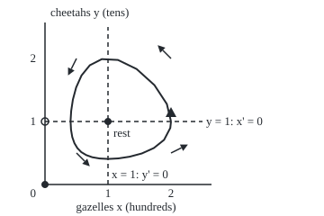
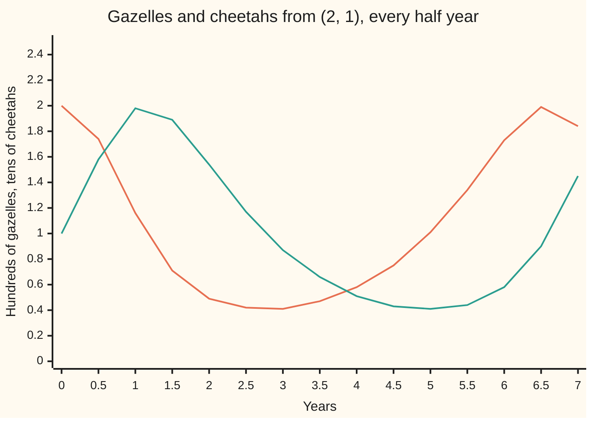

# Phase portraits and nullclines: draw where each variable stops changing and the arrows fill themselves in

[Syllabus](../../../SYLLABUS.md) → [Differential equations and dynamics](../../../SYLLABUS.md#w08) → [Nonlinear Dynamics in the Plane](../../../SYLLABUS.md#w08-s06) → Phase portraits and nullclines

---

## General Overview

A reserve holds gazelles and the cheetahs that hunt them. With fewer than 10 cheetahs about, the herd grows; with more, it shrinks. With more than 100 gazelles to catch, the cheetahs multiply; with fewer, they starve. The reserve starts with 200 gazelles and 10 cheetahs.

Call the gazelles x, in hundreds, and the cheetahs y, in tens; time runs in years. As on [From one equation to a system](../04-Systems%20and%20the%20Matrix%20Exponential/01-from-one-equation-to-a-system.md), a prime marks a rate: x' is how fast x changes per year. The model is x' = x(1 − y) and y' = y(x − 1), each rate constant 1 per year.

The pair (x, y) is a point in a plane, the **state**; over time it traces a **trajectory**. The plane drawn with arrows and a few trajectories is a **phase portrait**. Draw one by first finding where each rate is zero: the **nullclines**. Here: x = 0 and y = 1 for the gazelle rate, y = 0 and x = 1 for the cheetah rate. They cut the quarter-plane into four boxes the reserve circles through.

**Between the nullclines each rate keeps one sign, so one test point per region fixes every arrow. Rests sit where nullclines of the two rates cross. Trajectories follow the arrows.**

**What kind of fact this is:** a method for drawing, backed by a theorem (a continuous rate cannot change sign without passing through zero), proved on this card in Why it works.

### The picture: the reserve's phase portrait

<p align="center"></p>

To scale, 70 px a unit: across, 100 gazelles; up, 10 cheetahs. Dashed: the nullclines x = 1 and y = 1; the axes are the other two. Filled dots: the rests (0, 0) and (1, 1). Open circle: (0, 1), where two gazelle nullclines meet and nothing rests. One arrow per box; the loop is the path from (2, 1).

---

## The formula

A planar system gives each state two rates:

$$x' = f(x, y), \qquad y' = g(x, y)$$

$$\text{x-nullcline: } f(x, y) = 0 \qquad \text{y-nullcline: } g(x, y) = 0 \qquad \text{rest: both at once}$$

**Read it aloud:** the x-nullcline is where x stops changing, the y-nullcline where y stops, and a rest lies on both.

The arrow points right or left by the sign of $f$, up or down by the sign of $g$. For the reserve:

$$f(x, y) = x(1 - y), \qquad g(x, y) = y(x - 1)$$

A product is zero when a factor is: $f = 0$ on x = 0 or y = 1, $g = 0$ on y = 0 or x = 1.

| Symbol | Plain meaning | In our example | Push it up and the answer… |
| --- | --- | --- | --- |
| $x$ | gazelles, in hundreds | 2 at the start | cheetahs gain faster |
| $y$ | cheetahs, in tens | 1 at the start | gazelles lose faster |
| $t$ | time, in years | one turn: 6.608 | further round the loop |
| $f$ | gazelle rate x', hundreds a year | 0 at the start | moves right faster |
| $g$ | cheetah rate y', tens a year | 1 at the start | moves up faster |
| $V$ | x − ln x + y − ln y (ln: natural logarithm), fixed along a path | 2.3069 on our loop | a bigger loop |

### When it holds

- **Rates depend on the state, not the clock.** With a breeding season, one point gets different arrows in March and October, and no single portrait holds.
- **Rates are continuous.** Culling switched on above a set herd size makes the rate jump, and its sign can flip with no nullcline.
- **Rates have bounded slopes.** Then one trajectory passes through each point and trajectories never cross; without it two paths can leave one state.
- **Two variables.** In three, nullclines are surfaces; the signs still fix each arrow, but a sketch by eye no longer shows the paths.

---

## Why it works

### Step 0: only signs are needed to draw an arrow

Each point gets a velocity: $f$ across, $g$ up. Its direction, to the nearest quarter-turn, needs only the two signs. At (2, 0.5): x' = 2 × 0.5 = +1 and y' = 0.5 × 1 = +0.5, so right and up.

### Step 1: a sign can flip only on a nullcline

Join two points of one region by a path inside it. Along the path $f$ is continuous. Positive at one end and negative at the other, it would pass through zero between them (the intermediate value theorem), at a point of the x-nullcline, which the region excludes. So $f$ keeps one sign in the region, and so does $g$: one test point fixes the arrow for all of it.

### Step 2: rests sit at mixed crossings

A rest needs $f = 0$ and $g = 0$ together. Here x = 0 meets y = 0 at (0, 0), and y = 1 meets x = 1 at (1, 1). Two curves of one kind do not count: at (0, 1) two x-nullclines meet, x' = 0, but y' = 1 × (0 − 1) = −1.

### Step 3: paths cross nullclines straight

On the x-nullcline x' = 0, so a path crosses it vertically; it crosses the y-nullcline horizontally. The start (2, 1) lies on y = 1: x' = 0, y' = +1, straight up. Where a path crosses x = 1, y' = 0, so y is at a peak or trough.

### Step 4: chain the regions

The four test points give the four arrows:

| Region | Test point | Signs of x', y' | Arrow |
| --- | --- | --- | --- |
| below right (SE) | (2, 0.5) | + + | right and up |
| above right (NE) | (2, 2) | − + | left and up |
| above left (NW) | (0.5, 2) | − − | left and down |
| below left (SW) | (0.5, 0.5) | + − | right and down |

Up from SE leads into NE, left into NW, down into SW, right back to SE: counterclockwise round (1, 1). Gazelles feed cheetahs, cheetahs cut gazelles; the lag makes the turn.

### Step 5: the axes are fences

With no gazelles, none appear, and cheetahs die away at y' = −y; with no cheetahs, the herd grows at x' = x. Each axis is made of whole trajectories, and trajectories never cross, so a path starting with both animals never reaches an axis.

### Step 6: what the signs cannot tell

The signs say the path turns, not whether it closes or spirals. One more fact settles it: $V = x - \ln x + y - \ln y$ has rate (1 − 1/x)x' + (1 − 1/y)y' = (x − 1)(1 − y) + (y − 1)(x − 1) = 0 along a path. Curves of constant $V$ round (1, 1) are closed, so the path is a loop. The model's full story is on [Predator and prey](06-predator-prey.md).

<details>
<summary>Detailed proof: fences hold, and level curves of V close</summary>

**Fences.** Polynomial rates have bounded slopes on bounded patches, so one trajectory passes through each state. On x = 0, the pair x(t) = 0, y(t) = y(0)e^(−t) solves both equations. A path from x > 0 reaching x = 0 would share a state with it, giving two histories through one state. So x stays positive; x(t) = x(0)e^t on y = 0 keeps y positive.

**Loops.** Write V = a(x) + a(y) with a(u) = u − ln u, which falls on (0, 1), rises after, is least (1) at u = 1 and grows without bound at both ends. So V is least (2) at (1, 1), and each level V = c above 2 is one closed curve round (1, 1). A path on it cannot stop, since the one interior rest has V = 2, and by Step 4 it keeps turning, so it goes all the way round.

</details>

A second road zooms in on (1, 1) and replaces the rates by their best straight-line fit: [Linearisation](02-linearisation-and-the-jacobian.md).

---

## Worked numbers, by hand

| Step | Arithmetic | Value |
| --- | --- | --- |
| x-nullclines | x(1 − y) = 0 | x = 0 and y = 1 |
| y-nullclines | y(x − 1) = 0 | y = 0 and x = 1 |
| rests | mixed crossings | **(0, 0) and (1, 1)** |
| the loop's level | V = 2 − ln 2 + 1 − ln 1 = 3 − 0.6931 | 2.3069 |
| cheetah peak, on x = 1 | y − ln y = 2.3069 − 1 = 1.3069, met by y = 2 | **y = 2** |
| troughs | u − ln u = 1.3069, u below 1 | 0.4064 |

The herd swings between 200 and about 41 gazelles, the cheetahs between 20 and about 4, and one turn takes 6.608 years.

### The picture: the loop against time



Orange: gazelles; green: cheetahs. The cheetahs peak at 1.146 years, the gazelles bottom out at 2.764 and the cheetahs at 4.991. The portrait drops the clock; this chart keeps it.

### What breaks if you drop a piece

| Mistake | Comes out at | What went wrong |
| --- | --- | --- |
| Calling (0, 1) a rest | y' = −1: ten cheetahs lost a year | Two nullclines of one kind met |
| Start arrow drawn flat, since x' = 0 | truth: (0, +1), straight up | x frozen means motion all in y |
| Signs trusted to close the loop | crowded herd x' = x(1 − y − 0.2x): same turning, distance to rest 1.000 → 0.103 in 20 years | Signs give turning, not closure |

The code prints all three.

---

## Code, from first principles, and it actually runs

Road one reads the rates: mixed crossings, checked by a 301 x 301 grid scan for exact zeros, then the four test points. Road two steps the flow with Runge-Kutta 4 (four slope samples a step, from the Numerical Evolution shelf) at step h = 0.01 years, logs the regions in order, and checks each step against road one's signs. The referee is $V$: bisection finds the loop's extremes, and the stepped path must match. Halving the step cuts the error about 16-fold (16.7 here), as a fourth-order method should.

### Python

```python
# Phase portraits and nullclines.  Gazelles x (hundreds), cheetahs y (tens), years: x' = x(1 - y),
# y' = y(x - 1).  Road one: signs of the rates.  Road two: Runge-Kutta 4.  Referee: the conserved V.
from math import log
def f(x, y): return x * (1 - y)                 # gazelle rate, hundreds per year
def g(x, y): return y * (x - 1)                 # cheetah rate, tens per year
def V(x, y): return x - log(x) + y - log(y)     # constant along every orbit
def sg(v): return "+" if v > 0 else "-" if v < 0 else "0"
def reg(x, y): return ("N" if y > 1 else "S") + ("E" if x > 1 else "W")
def p(x, y): return f"{50 + 70 * x:.1f},{205 - 70 * y:.1f}"   # figure scale, 70 px a unit
def rk4(x, y, h, F=f):
    k = lambda a, b: (F(a, b), g(a, b))          # the two rates at one point
    a1, b1 = k(x, y); a2, b2 = k(x + h * a1 / 2, y + h * b1 / 2)
    a3, b3 = k(x + h * a2 / 2, y + h * b2 / 2); a4, b4 = k(x + h * a3, y + h * b3)
    return x + h * (a1 + 2 * a2 + 2 * a3 + a4) / 6, y + h * (b1 + 2 * b2 + 2 * b3 + b4) / 6
def run(h, T, F=f, x=2.0, y=1.0):
    for _ in range(round(T / h)): x, y = rk4(x, y, h, F)
    return x, y
x, y, t, seen, when, box, pts, ok = 2.0, 1.0, 0.0, ["NE"], [], [2, 2, 1, 1], [p(2, 1)], True
while len(seen) < 5:                            # road two: one full turn from (2, 1)
    nx, ny = rk4(x, y, 0.01)
    if reg(nx, ny) == reg(x, y): ok = ok and sg(nx - x) + sg(ny - y) == sg(f(x, y)) + sg(g(x, y))
    elif t > 0:
        s = (1 - x) / (nx - x) if (x > 1) != (nx > 1) else (1 - y) / (ny - y)
        seen.append(reg(nx, ny)); when.append(t + s * 0.01)
    x, y, t = nx, ny, t + 0.01
    box = [min(box[0], x), max(box[1], x), min(box[2], y), max(box[3], y)]
    if round(t * 100) % 25 == 0: pts.append(p(x, y))
def root(lo, hi, c):                            # bisection on u - ln u = c
    for _ in range(80):
        mid = (lo + hi) / 2
        lo, hi = (mid, hi) if (mid - log(mid) > c) == (lo - log(lo) > c) else (lo, mid)
    return lo
tests = [(2, 0.5), (2, 2), (0.5, 2), (0.5, 0.5)]
mixed = [(a, b) for a, b in [(0, 0), (1, 0), (0, 1), (1, 1)] if (a == 0 or b == 1) and (b == 0 or a == 1)]
grid = [(i / 100, j / 100) for i in range(301) for j in range(301) if f(i / 100, j / 100) == 0 == g(i / 100, j / 100)]
print("x' = x(1 - y), y' = y(x - 1); x-nullclines x = 0 and y = 1; y-nullclines y = 0 and x = 1")
print(f"rests at mixed crossings: {mixed}; by grid scan of 301 x 301 points: {grid}")
print(f"same-kind crossing (0, 1): x' = {f(0, 1):.3f}, y' = {g(0, 1):.3f}; (1, 0): x' = {f(1, 0):.3f}, y' = {g(1, 0):.3f}")
for a, b in tests:
    print(f"region {reg(a, b)}, test point ({a}, {b}): x' = {f(a, b):+.3f}, y' = {g(a, b):+.3f}, signs {sg(f(a, b))}{sg(g(a, b))}")
print(f"start (2, 1) on the x-nullcline: x' = {f(2, 1):.3f}, y' = {g(2, 1):.3f}, straight up")
print(f"RK4 h = 0.01, regions in order: {' '.join(seen)}; every step's signs match its region: {'yes' if ok else 'no'}")
print(f"crossing times (years): {' '.join(f'{w:.3f}' for w in when)}; one turn T = {when[-1]:.3f}")
print(f"extremes by RK4: x {box[0]:.4f} to {box[1]:.4f}, y {box[2]:.4f} to {box[3]:.4f}; V = {V(2, 1):.4f}")
print(f"ln 2 = {log(2):.4f}; bisection on u - ln u = {V(2, 1) - 1:.4f}: low {(lo := root(0.01, 1, V(2, 1) - 1)):.4f}, high {(hi := root(1, 10, V(2, 1) - 1)):.4f}")
ref = run(0.001, 2)                             # a fine run is the yardstick for step-size error
e = [((a - ref[0]) ** 2 + (b - ref[1]) ** 2) ** 0.5 for a, b in (run(0.2, 2), run(0.1, 2))]
print(f"error at t = 2 against h = 0.001, in millionths: h = 0.2 {e[0] * 1e6:.3f}, h = 0.1 {e[1] * 1e6:.3f}, ratio {e[0] / e[1]:.1f}")
far = sum((a - b) ** 2 for a, b in zip(run(0.01, 20, lambda x, y: x * (1 - y - 0.2 * x), 2.0, 0.8), (1, 0.8))) ** 0.5
print(f"crowded gazelles x' = x(1 - y - 0.2x): distance to rest (1, 0.8) from 1.000 to {far:.3f} after 20 years")
print("figure, loop at 70 px a unit:", " ".join(pts))
print("figure, arrows:", " ".join(p(a, b) + ">" + p(a + 0.3 * f(a, b) / r, b + 0.3 * g(a, b) / r)
      for a, b in tests for r in [(f(a, b) ** 2 + g(a, b) ** 2) ** 0.5]))   # 0.3-unit arrows
cs = [run(0.01, k / 2) for k in range(15)]
for i, name in ((0, "gazelles"), (1, "cheetahs")): print(f"chart, {name}:", ", ".join(f"{c[i]:.2f}" for c in cs))
assert grid == [(float(a), float(b)) for a, b in mixed]           # two roads to the rests
assert seen == ["NE", "NW", "SW", "SE", "NE"] and ok             # the flow follows the sign table
assert max(abs(box[0] - lo), abs(box[2] - lo), abs(box[1] - hi), abs(box[3] - hi)) < 1e-4   # RK4 loop sits on V's level
assert 12 < e[0] / e[1] < 20 and far < 0.3                       # order 4; crowding spirals in
print("ALL CHECKS PASS")
```

**Ran 2026-09-28 on macOS, Python 3.14.6, standard library only. All checks passed. Output, pasted from the run:**

```
x' = x(1 - y), y' = y(x - 1); x-nullclines x = 0 and y = 1; y-nullclines y = 0 and x = 1
rests at mixed crossings: [(0, 0), (1, 1)]; by grid scan of 301 x 301 points: [(0.0, 0.0), (1.0, 1.0)]
same-kind crossing (0, 1): x' = 0.000, y' = -1.000; (1, 0): x' = 1.000, y' = 0.000
region SE, test point (2, 0.5): x' = +1.000, y' = +0.500, signs ++
region NE, test point (2, 2): x' = -2.000, y' = +2.000, signs -+
region NW, test point (0.5, 2): x' = -0.500, y' = -1.000, signs --
region SW, test point (0.5, 0.5): x' = +0.250, y' = -0.250, signs +-
start (2, 1) on the x-nullcline: x' = 0.000, y' = 1.000, straight up
RK4 h = 0.01, regions in order: NE NW SW SE NE; every step's signs match its region: yes
crossing times (years): 1.146 2.764 4.991 6.608; one turn T = 6.608
extremes by RK4: x 0.4064 to 2.0000, y 0.4064 to 2.0000; V = 2.3069
ln 2 = 0.6931; bisection on u - ln u = 1.3069: low 0.4064, high 2.0000
error at t = 2 against h = 0.001, in millionths: h = 0.2 37.130, h = 0.1 2.228, ratio 16.7
crowded gazelles x' = x(1 - y - 0.2x): distance to rest (1, 0.8) from 1.000 to 0.103 after 20 years
figure, loop at 70 px a unit: 190.0,135.0 185.4,115.6 171.6,94.6 151.8,76.7 131.0,66.6 113.1,65.7 99.8,72.5 90.6,83.8 84.6,97.2 81.0,110.6 79.1,123.2 78.4,134.4 78.9,144.1 80.3,152.3 82.7,159.1 86.0,164.6 90.3,169.0 95.8,172.3 102.5,174.7 110.7,176.1 120.4,176.6 131.6,176.0 144.1,174.1 157.6,170.5 170.9,164.5 182.3,155.4 189.2,142.2
figure, arrows: 190.0,170.0>208.8,160.6 190.0,65.0>175.2,50.2 85.0,65.0>75.6,83.8 85.0,170.0>99.8,184.8
chart, gazelles: 2.00, 1.74, 1.16, 0.71, 0.49, 0.42, 0.41, 0.47, 0.58, 0.75, 1.01, 1.34, 1.73, 1.99, 1.84
chart, cheetahs: 1.00, 1.58, 1.98, 1.89, 1.54, 1.17, 0.87, 0.66, 0.51, 0.43, 0.41, 0.44, 0.58, 0.90, 1.45
ALL CHECKS PASS
```

### Rust

Same numbers, same labels, built with `rustc --edition 2021 -O`.

```rust
// Phase portraits and nullclines -- the same check as the Python, in Rust, no crates.  Gazelles x
// (hundreds), cheetahs y (tens), years: x' = x(1 - y), y' = y(x - 1).  Road one: signs of the
// rates.  Road two: Runge-Kutta 4.  Referee: the conserved V.
fn f(x: f64, y: f64) -> f64 { x * (1.0 - y) }                 // gazelle rate, hundreds per year
fn g(x: f64, y: f64) -> f64 { y * (x - 1.0) }                 // cheetah rate, tens per year
fn crowd(x: f64, y: f64) -> f64 { x * (1.0 - y - 0.2 * x) }   // gazelles that crowd themselves
fn v(x: f64, y: f64) -> f64 { x - x.ln() + y - y.ln() }       // constant along every orbit
fn sg(a: f64) -> &'static str { if a > 0.0 { "+" } else if a < 0.0 { "-" } else { "0" } }
fn reg(x: f64, y: f64) -> String { format!("{}{}", if y > 1.0 { "N" } else { "S" }, if x > 1.0 { "E" } else { "W" }) }
fn p(x: f64, y: f64) -> String { format!("{:.1},{:.1}", 50.0 + 70.0 * x, 205.0 - 70.0 * y) }  // 70 px a unit
fn rk4(x: f64, y: f64, h: f64, ff: fn(f64, f64) -> f64) -> (f64, f64) {
    let k = |a: f64, b: f64| (ff(a, b), g(a, b));             // the two rates at one point
    let (a1, b1) = k(x, y); let (a2, b2) = k(x + h * a1 / 2.0, y + h * b1 / 2.0);
    let (a3, b3) = k(x + h * a2 / 2.0, y + h * b2 / 2.0); let (a4, b4) = k(x + h * a3, y + h * b3);
    (x + h * (a1 + 2.0 * a2 + 2.0 * a3 + a4) / 6.0, y + h * (b1 + 2.0 * b2 + 2.0 * b3 + b4) / 6.0)
}
fn run(h: f64, t: f64, ff: fn(f64, f64) -> f64, mut x: f64, mut y: f64) -> (f64, f64) {
    for _ in 0..(t / h).round() as usize { (x, y) = rk4(x, y, h, ff) }
    (x, y)
}
fn root(mut lo: f64, mut hi: f64, c: f64) -> f64 {           // bisection on u - ln u = c
    for _ in 0..80 {
        let mid = (lo + hi) / 2.0;
        if (mid - mid.ln() > c) == (lo - lo.ln() > c) { lo = mid } else { hi = mid }
    }
    lo
}
fn main() {
    let (mut x, mut y, mut t, mut ok) = (2.0f64, 1.0f64, 0.0f64, true);
    let (mut seen, mut when, mut bx, mut pts) = (vec!["NE".to_string()], vec![], [2.0f64, 2.0, 1.0, 1.0], vec![p(2.0, 1.0)]);
    while seen.len() < 5 {                                    // road two: one full turn from (2, 1)
        let (nx, ny) = rk4(x, y, 0.01, f);
        if reg(nx, ny) == reg(x, y) { ok = ok && format!("{}{}", sg(nx - x), sg(ny - y)) == format!("{}{}", sg(f(x, y)), sg(g(x, y))) }
        else if t > 0.0 {
            let s = if (x > 1.0) != (nx > 1.0) { (1.0 - x) / (nx - x) } else { (1.0 - y) / (ny - y) };
            seen.push(reg(nx, ny)); when.push(t + s * 0.01);
        }
        (x, y, t) = (nx, ny, t + 0.01);
        bx = [bx[0].min(x), bx[1].max(x), bx[2].min(y), bx[3].max(y)];
        if (t * 100.0).round() as i64 % 25 == 0 { pts.push(p(x, y)) }
    }
    let tests = [(2.0, 0.5), (2.0, 2.0), (0.5, 2.0), (0.5, 0.5)];
    let mixed: Vec<(i32, i32)> = [(0, 0), (1, 0), (0, 1), (1, 1)].into_iter().filter(|&(a, b)| (a == 0 || b == 1) && (b == 0 || a == 1)).collect();
    let mut grid = vec![];
    for i in 0..301 { for j in 0..301 { let (a, b) = (i as f64 / 100.0, j as f64 / 100.0); if f(a, b) == 0.0 && g(a, b) == 0.0 { grid.push((a, b)) } } }
    let ms: Vec<String> = mixed.iter().map(|(a, b)| format!("({}, {})", a, b)).collect();
    let gs: Vec<String> = grid.iter().map(|(a, b)| format!("({:.1}, {:.1})", a, b)).collect();
    println!("x' = x(1 - y), y' = y(x - 1); x-nullclines x = 0 and y = 1; y-nullclines y = 0 and x = 1");
    println!("rests at mixed crossings: [{}]; by grid scan of 301 x 301 points: [{}]", ms.join(", "), gs.join(", "));
    println!("same-kind crossing (0, 1): x' = {:.3}, y' = {:.3}; (1, 0): x' = {:.3}, y' = {:.3}", f(0.0, 1.0), g(0.0, 1.0), f(1.0, 0.0), g(1.0, 0.0));
    for (a, b) in tests {
        println!("region {}, test point ({}, {}): x' = {:+.3}, y' = {:+.3}, signs {}{}", reg(a, b), a, b, f(a, b), g(a, b), sg(f(a, b)), sg(g(a, b)));
    }
    println!("start (2, 1) on the x-nullcline: x' = {:.3}, y' = {:.3}, straight up", f(2.0, 1.0), g(2.0, 1.0));
    println!("RK4 h = 0.01, regions in order: {}; every step's signs match its region: {}", seen.join(" "), if ok { "yes" } else { "no" });
    let ws: Vec<String> = when.iter().map(|w| format!("{:.3}", w)).collect();
    println!("crossing times (years): {}; one turn T = {:.3}", ws.join(" "), when[3]);
    println!("extremes by RK4: x {:.4} to {:.4}, y {:.4} to {:.4}; V = {:.4}", bx[0], bx[1], bx[2], bx[3], v(2.0, 1.0));
    let (lo, hi) = (root(0.01, 1.0, v(2.0, 1.0) - 1.0), root(1.0, 10.0, v(2.0, 1.0) - 1.0));
    println!("ln 2 = {:.4}; bisection on u - ln u = {:.4}: low {:.4}, high {:.4}", 2f64.ln(), v(2.0, 1.0) - 1.0, lo, hi);
    let rf = run(0.001, 2.0, f, 2.0, 1.0);                    // a fine run is the yardstick for step-size error
    let e: Vec<f64> = [0.2, 0.1].iter().map(|&h| { let (a, b) = run(h, 2.0, f, 2.0, 1.0); ((a - rf.0).powi(2) + (b - rf.1).powi(2)).sqrt() }).collect();
    println!("error at t = 2 against h = 0.001, in millionths: h = 0.2 {:.3}, h = 0.1 {:.3}, ratio {:.1}", e[0] * 1e6, e[1] * 1e6, e[0] / e[1]);
    let (dx, dy) = run(0.01, 20.0, crowd, 2.0, 0.8);
    let far = ((dx - 1.0).powi(2) + (dy - 0.8).powi(2)).sqrt();
    println!("crowded gazelles x' = x(1 - y - 0.2x): distance to rest (1, 0.8) from 1.000 to {:.3} after 20 years", far);
    println!("figure, loop at 70 px a unit: {}", pts.join(" "));
    let ar: Vec<String> = tests.iter().map(|&(a, b)| { let r = (f(a, b).powi(2) + g(a, b).powi(2)).sqrt();
        format!("{}>{}", p(a, b), p(a + 0.3 * f(a, b) / r, b + 0.3 * g(a, b) / r)) }).collect();   // 0.3-unit arrows
    println!("figure, arrows: {}", ar.join(" "));
    let cs: Vec<(f64, f64)> = (0..15).map(|k| run(0.01, k as f64 / 2.0, f, 2.0, 1.0)).collect();
    println!("chart, gazelles: {}", cs.iter().map(|c| format!("{:.2}", c.0)).collect::<Vec<_>>().join(", "));
    println!("chart, cheetahs: {}", cs.iter().map(|c| format!("{:.2}", c.1)).collect::<Vec<_>>().join(", "));
    assert!(grid == mixed.iter().map(|&(a, b)| (a as f64, b as f64)).collect::<Vec<_>>());   // two roads to the rests
    assert!(seen == ["NE", "NW", "SW", "SE", "NE"] && ok);                                     // the flow follows the sign table
    assert!((bx[0] - lo).abs().max((bx[2] - lo).abs()).max((bx[1] - hi).abs()).max((bx[3] - hi).abs()) < 1e-4);   // on V's level
    assert!(12.0 < e[0] / e[1] && e[0] / e[1] < 20.0 && far < 0.3);                          // order 4; crowding spirals in
    println!("ALL CHECKS PASS");
}
```

**Ran 2026-09-28 on macOS, rustc 1.98.1, no crates. All checks passed. Output, pasted from the run:**

```
x' = x(1 - y), y' = y(x - 1); x-nullclines x = 0 and y = 1; y-nullclines y = 0 and x = 1
rests at mixed crossings: [(0, 0), (1, 1)]; by grid scan of 301 x 301 points: [(0.0, 0.0), (1.0, 1.0)]
same-kind crossing (0, 1): x' = 0.000, y' = -1.000; (1, 0): x' = 1.000, y' = 0.000
region SE, test point (2, 0.5): x' = +1.000, y' = +0.500, signs ++
region NE, test point (2, 2): x' = -2.000, y' = +2.000, signs -+
region NW, test point (0.5, 2): x' = -0.500, y' = -1.000, signs --
region SW, test point (0.5, 0.5): x' = +0.250, y' = -0.250, signs +-
start (2, 1) on the x-nullcline: x' = 0.000, y' = 1.000, straight up
RK4 h = 0.01, regions in order: NE NW SW SE NE; every step's signs match its region: yes
crossing times (years): 1.146 2.764 4.991 6.608; one turn T = 6.608
extremes by RK4: x 0.4064 to 2.0000, y 0.4064 to 2.0000; V = 2.3069
ln 2 = 0.6931; bisection on u - ln u = 1.3069: low 0.4064, high 2.0000
error at t = 2 against h = 0.001, in millionths: h = 0.2 37.130, h = 0.1 2.228, ratio 16.7
crowded gazelles x' = x(1 - y - 0.2x): distance to rest (1, 0.8) from 1.000 to 0.103 after 20 years
figure, loop at 70 px a unit: 190.0,135.0 185.4,115.6 171.6,94.6 151.8,76.7 131.0,66.6 113.1,65.7 99.8,72.5 90.6,83.8 84.6,97.2 81.0,110.6 79.1,123.2 78.4,134.4 78.9,144.1 80.3,152.3 82.7,159.1 86.0,164.6 90.3,169.0 95.8,172.3 102.5,174.7 110.7,176.1 120.4,176.6 131.6,176.0 144.1,174.1 157.6,170.5 170.9,164.5 182.3,155.4 189.2,142.2
figure, arrows: 190.0,170.0>208.8,160.6 190.0,65.0>175.2,50.2 85.0,65.0>75.6,83.8 85.0,170.0>99.8,184.8
chart, gazelles: 2.00, 1.74, 1.16, 0.71, 0.49, 0.42, 0.41, 0.47, 0.58, 0.75, 1.01, 1.34, 1.73, 1.99, 1.84
chart, cheetahs: 1.00, 1.58, 1.98, 1.89, 1.54, 1.17, 0.87, 0.66, 0.51, 0.43, 0.41, 0.44, 0.58, 0.90, 1.45
ALL CHECKS PASS
```

The two outputs agree line for line.

> [!TIP]
> **Try changing**
> - **Start nearer the rest.** Guess first: longer or shorter turn? Start at (1.5, 1). The loop sits inside the first, $V$ is smaller, and the turn is shorter than 6.608 years.
> - **Move the cheetahs' break-even.** Guess first: which assert fails? Set g to y(x − 1.5). The grid finds a rest at (1.5, 1), the hand list still says (1, 1), and the first assert fails.
> - **Let gazelles help each other.** Guess first: in or out? Replace −0.2x by +0.05x in the crowded herd. The turning is unchanged, the path spirals out, and the last assert fails.
> - **Halve the step again.** Guess first: what ratio? Compare 0.1 with 0.05: close to 16 again.

---

## The usual mistake

> [!warning]
> **Drawing the arrow along the nullcline instead of across it.** "x' = 0" says x is frozen, so on the x-nullcline the arrow is vertical: at (2, 1) it is (0, +1). Swap the two kinds and every arrow drawn on a nullcline points the wrong way.
>
> - **Forgetting the axes.** They are nullclines too, giving the rest at (0, 0) and the fences.
> - **Taking a nullcline for a path.** From (2, 1) the path leaves y = 1 at once. The axes are paths too, but that took Step 5.
> - **Reading speed off the portrait.** The path reaches the top at 1.146 years but spends 2.764 to 4.991 crossing the slow bottom-left box.

---

## Where you meet it in real life

- **Wildlife management.** Hare and lynx records swing like this loop; [Predator and prey](06-predator-prey.md) fits the model and its conserved quantity.
- **Epidemics.** Susceptible against infected, the peak of infection on a nullcline: [The SIR model](07-the-sir-epidemic-model.md).
- **Nerve cells.** Two-variable neuron models have a cubic nullcline and a straight one; a spike is a path round the cubic's bend.

> **Say it back**
> Two changing quantities make a point in a plane, and the rates give it an arrow. Curves where one rate is zero split the plane into regions of fixed signs, so one test point per region draws every arrow. Rests sit where curves of the two kinds cross, and paths cross each nullcline straight. The reserve turns counterclockwise round 100 gazelles and 10 cheetahs. Whether the turning closes takes one more fact, here the unchanging $V$.

---

## What this builds on

- [From one equation to a system](../04-Systems%20and%20the%20Matrix%20Exponential/01-from-one-equation-to-a-system.md): two unknowns tied together by two rate laws, and the prime notation.
- [Slope fields and the phase line](../01-Rate%20Equations/02-slope-fields-and-the-phase-line.md): the one-variable version, rests and arrows on a line.

## Where this goes next

- [Linearisation](02-linearisation-and-the-jacobian.md): the type of each rest, read from the rates' slopes there.
- [Predator and prey](06-predator-prey.md): the reserve's model in full, with its conserved quantity.
- [The SIR model](07-the-sir-epidemic-model.md): the drawing for an outbreak.

The sketch says the reserve turns round (1, 1) but not whether nearby paths spiral in, spiral out or circle; [Linearisation](02-linearisation-and-the-jacobian.md) settles that for paths close to a rest.

---

## Sources

Verified 2026-09-28: every link below resolves to the publisher's page.

- Strogatz, Steven H. *Nonlinear Dynamics and Chaos*, 3rd ed. Chapman & Hall/CRC, 2024. [Publisher page](https://www.routledge.com/Nonlinear-Dynamics-and-Chaos-With-Applications-to-Physics-Biology-Chemistry-and-Engineering/Strogatz/p/book/9780367026509). Chapter 6: phase plane and nullclines.
- Gerstner, Wulfram, Werner M. Kistler, Richard Naud, and Liam Paninski. *Neuronal Dynamics*. Cambridge University Press, 2014. [Section 4.3, online](https://neuronaldynamics.epfl.ch/online/Ch4.S3.html). Nullclines of neuron models, crossed vertically and horizontally.
- Teschl, Gerald. *Ordinary Differential Equations and Dynamical Systems*. American Mathematical Society, 2012. [Author's text](https://mat.univie.ac.at/~gerald/ftp/book-ode/). Planar systems, predator-prey, uniqueness proofs.
