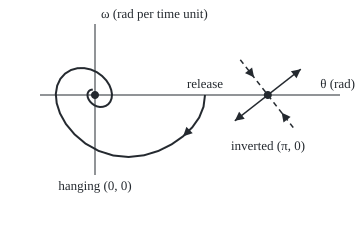

# Linearisation: near an equilibrium the system looks like its matrix of slopes, and usually that is enough

Differential equations and dynamics → Nonlinear Dynamics in the Plane → Reading a rest up close → Linearisation

---

## General Overview

A playground swing can rest in two places. Hanging straight down, a push dies away in a few shrinking swings. Balanced straight up on rigid rods, the smallest breath of wind tips it over.

Gravity pulls with the sine of the angle: the law is not linear and has no formula solution. Close to either rest the sine curve is almost a straight line, and straight-line laws are solved in full ([classifying-equilibria-by-trace-and-determinant](../04-Systems%20and%20the%20Matrix%20Exponential/05-classifying-equilibria-by-trace-and-determinant.md)).

So near a rest, replace each rate by its straight-line version. The rates' slopes, in a two-by-two table, form the **Jacobian matrix**, after Carl Jacobi; the swap is **linearisation**. At the hanging rest the matrix says "spiral in"; at the upright rest, "saddle": one way in, one way out. Both verdicts are right.

**Near a rest the rates are the Jacobian times the offset, plus a leftover that shrinks faster; when no eigenvalue of the Jacobian has real part zero, the rest attracts, repels or is a saddle exactly as the matrix says.**

**What kind of fact this is:** a theorem. The attracting case is proved in Why it works, fully in a folded Detailed proof; the saddle case, the Hartman–Grobman theorem, is stated with its proof in the sources.

### The picture: the swing near its two rests

<p align="center"></p>

To scale, 55 px per unit both ways. The curve: the swing released at 2 rad, for 12 time units. At the upright rest, solid is the linear way out, dashed the way in. Both checks print the coordinates on `figure,` lines.

---

## The formula

The angle from hanging is $\theta$ (theta), in radians; the angular speed is $\omega$ (omega). Time $t$ runs in units of 0.5 s: the square root of rod length, 2.45 m, over gravity's 9.81 m/s^2. A prime is a rate. With damping 0.5 per time unit, the swing is $\theta'' + 0.5\theta' + \sin\theta = 0$, or as a pair:

$$\theta' = f(\theta, \omega) = \omega, \qquad \omega' = g(\theta, \omega) = -\sin\theta - 0.5\,\omega$$

Both rates are zero at the **rests**, hanging (0, 0) and inverted (π, 0). Call the rest's angle $\theta_e$ and the offsets from it $u = \theta - \theta_e$ and $v = \omega$. ∂f/∂θ is the slope of f when only θ moves ([partial-derivatives](../../06-Calculus%20and%20analysis/07-Several%20Variables/01-partial-derivatives.md)).

$$J = \begin{pmatrix} \partial f/\partial\theta & \partial f/\partial\omega \\ \partial g/\partial\theta & \partial g/\partial\omega \end{pmatrix}_{\text{at the rest}}, \qquad \begin{pmatrix} u \\ v \end{pmatrix}' = J\begin{pmatrix} u \\ v \end{pmatrix} + r$$

**Read it aloud:** near a rest, the offsets change at the matrix of slopes times the offsets, plus a leftover r that shrinks faster than the offsets.

For the swing the only slope that varies is that of $-\sin\theta$, which is $-\cos\theta$:

$$J = \begin{pmatrix} 0 & 1 \\ -\cos\theta_e & -0.5 \end{pmatrix}: \quad \text{hanging } \begin{pmatrix} 0 & 1 \\ -1 & -0.5 \end{pmatrix}, \quad \text{inverted } \begin{pmatrix} 0 & 1 \\ 1 & -0.5 \end{pmatrix}$$

Trace $\tau$ (the diagonal's sum) and determinant $\Delta$ (the diagonal's product minus the other two entries' product) sort the rest; eigenvalues $\lambda$ solve $\lambda^2 - \tau\lambda + \Delta = 0$. A rest is **hyperbolic** when no eigenvalue has real part zero.

| Symbol | Plain meaning | In our example | Push it up and the answer… |
| --- | --- | --- | --- |
| $\theta$, $\omega$ | angle from hanging, rad; angular speed, rad per time unit | released at 2 rad | past π, over the top |
| $t$ | time, in units of 0.5 s | one damped swing: 6.4892 units | — |
| $f$, $g$ | the rates of θ and ω | ω and −sin θ − 0.5ω | — |
| $\theta_e$, $u$, $v$, $r$ | rest angle; offsets; leftover | 0 or π; r at most u cubed over 6 | — |
| $J$ | the rates' slopes at the rest | `[[0, 1], [-1, -0.5]]` hanging | — |
| $\tau$, $\Delta$ | trace and determinant of J | −0.5; 1 hanging, −1 inverted | Δ below 0 means a saddle |
| $\lambda$ | eigenvalue: a special motion's rate | −0.25 ± 0.968246i; 0.780776, −1.280776 | real part above 0: it grows |
| $k$, $E$ | air-drag strength; energy | 0.5; 0.122417 from 0.5 rad | faster loss |

### When it holds

- **Smooth rates.** A swing hitting a stop at its rest has a kink; no one matrix fits both sides.
- **No eigenvalue with real part zero.** At a **centre** (a purely imaginary pair) or a zero eigenvalue, the leftover decides.
- **Near the rest only.** Released at 1 rad, not 0.01, the swing is a few per cent off the linear answer by t = 10.
- **A real rest.** At (π/2, 0) the rates are 0 and −1; the nonzero value swamps the slopes.

---

## Why it works

### Step 0: close up, a smooth curve is its tangent line

Zoomed in at 0 the sine curve is the line of slope 1; at π, of slope −1. A smooth rate near a point is its value, plus slopes times offsets, plus a leftover shrinking faster than the offset: Taylor's first-order statement.

### Step 1: at a rest, the value term vanishes

Both rates are zero at a rest, leaving $J$ times the offset, plus $r$. For the swing, $-\sin u = -u + (u - \sin u)$, and $u - \sin u$ is at most the cube of u over 6 in size. At π, $\sin(\pi + u) = -\sin u$: the slope's sign flips, the leftover's size does not.

### Step 2: solve the linear part and sort the rest

Linear motions are built from special motions changing like $e^{\lambda t}$.

- **Hanging:** τ = −0.5, Δ = 1, discriminant τ^2 − 4Δ = −3.75. Eigenvalues −0.25 ± 0.968246i: a **stable spiral**. Each swing takes 6.4892 units and keeps 0.1974 of its size.
- **Inverted:** Δ = −1, so the eigenvalues have opposite signs, 0.780776 and −1.280776: a **saddle**. A nudge along the way out, direction (1, 0.780776), doubles every 0.8878 units.

### Step 3: when every real part is negative, the leftover cannot win

At the hanging rest every linear motion shrinks like $e^{-0.25t}$. The leftover, relative to the offset, goes to zero with the offset, so near enough the rest it eats part of the 0.25 margin, never all. The true swing shrinks too, a little slower.

<details>
<summary>Detailed proof: all real parts negative means the rest attracts</summary>

Write x for the offset (u, v), |x| for its length. Then x' = Jx + r(x) with |r(x)| at most |u|^3/6, so at most (δ^2/6)|x| while |x| is below δ.

By variation of constants ([forced-systems-and-variation-of-constants](../04-Systems%20and%20the%20Matrix%20Exponential/06-forced-systems-and-variation-of-constants.md)): x(t) = e^(Jt) x(0) + the integral from 0 to t of e^(J(t − s)) r(x(s)) ds.

Both eigenvalues have real part −0.25, so some constant M gives |e^(Jt) y| at most M e^(−0.25t) |y| for all vectors y and all t from 0 on.

Put φ(t) = e^(0.25t)|x(t)|. While |x| is below δ, φ(t) is at most M|x(0)| + (Mδ^2/6) times the integral of φ from 0 to t. Gronwall's inequality ([gronwall-and-continuous-dependence](../02-Existence%2C%20Uniqueness%20and%20Sensitivity/04-gronwall-and-continuous-dependence.md)) turns that into φ(t) at most M|x(0)| e^((Mδ^2/6)t), so

|x(t)| at most M|x(0)| e^(−(0.25 − Mδ^2/6)t).

Choose δ with Mδ^2/6 below 0.125 and |x(0)| below δ/M. The bound keeps |x| below δ, so the argument never stops, and the offset shrinks at rate at least 0.125. Any smooth system with all real parts negative runs the same way.

At a centre the margin is 0, no δ leaves anything over, and the leftover alone decides.

</details>

### Step 4: a saddle stays a saddle

The **Hartman–Grobman theorem** (Grobman 1959, Hartman 1960): at a hyperbolic rest, a continuous change of coordinates near the rest carries the linear paths onto the true ones, direction kept. So the true swing has one curve in and one out at the top. Their tangency to the pictured lines is a further result, the stable manifold theorem (Perko §2.7). The proof is in Hartman's paper and Perko §2.8.

### Step 5: at a centre the matrix says nothing

Replace friction by air drag, growing with speed squared: $\omega' = -\sin\theta - k\,\omega|\omega|$. Drag has slope 0 at ω = 0, so the hanging Jacobian is `[[0, 1], [-1, 0]]`: τ = 0, Δ = 1, a centre, for every k.

The energy is $E = \omega^2/2 + 1 - \cos\theta$, and the chain rule gives $E' = \omega\omega' + \sin\theta\,\theta' = -k|\omega|^3$. With k = 0 energy is fixed and the swing swings for ever ([the-nonlinear-pendulum](03-the-nonlinear-pendulum.md)). With k above 0 energy falls whenever the swing moves: it spirals in. With k below 0, a child pumping, it spirals out. One matrix, three truths.

Released at 0.5 rad, energy 0.122417. At t = 60 the drag-free swing still holds 0.122417; with k = 0.5, 0.002308. Averaging the loss over each swing gives amplitude A(t) = A(0)/(1 + 4kA(0)t/(3π)), shrinking like one over time, not exponentially: energy 0.002303.

---

## Worked numbers, by hand

| Step | Arithmetic | Value |
| --- | --- | --- |
| hanging J | slope of −sin θ is −cos θ; −cos 0 = −1 | `[[0, 1], [-1, -0.5]]` |
| trace, determinant | 0 − 0.5; 0 − 1 × (−1) | −0.5; 1 |
| discriminant | 0.25 − 4 | −3.75 |
| eigenvalues | −0.25 ± i × (square root of 3.75)/2 | **−0.25 ± 0.968246i, stable spiral** |
| one swing | 2π/0.968246 | 6.4892 units = 3.2446 s |
| size kept per swing | e^(−0.25 × 6.4892) | 0.1974 |
| inverted J | −cos π = +1 | `[[0, 1], [1, -0.5]]` |
| determinant | 0 − 1 × 1 | −1 |
| eigenvalues | (−0.5 ± square root of 4.25)/2 | **0.780776 and −1.280776, saddle** |
| doubling time out | ln 2/0.780776 | 0.8878 units |

A push on the hanging swing shrinks to a fifth each 3.2446 s; a nudge on the balanced one doubles in under half a second.

### What breaks if you drop a piece

| Mistake | Comes out at | What went wrong |
| --- | --- | --- |
| cos π read as +1 | det 1, disc −3.75: a spiral | truly det −1, a saddle |
| Linearising at (π/2, 0) | rates 0 and −1 | not a rest |
| Trusting the centre, with drag | energy 0.122417 for ever | truly 0.002308 at t = 60 |

The code prints all three.

---

## Code, from first principles, and it actually runs

Road one: the Jacobian by hand, then its eigenvalues. Road two: the Jacobian by nudging each variable, and the true swing stepped by Runge–Kutta 4 ([runge-kutta-four](../05-Numerical%20Evolution/04-runge-kutta-four.md)), step 0.01. Four asserts tie the roads together.

### Python

```python
# Linearisation and the Jacobian -- the check behind the card.  Standard library
# only.  The swing: theta'' + 0.5 theta' + sin theta = 0, written as the pair
# theta' = w, w' = -sin(theta) - 0.5 w; time in units of 0.5 s.  An optional
# air drag k w|w| makes the centre case.  Runge-Kutta 4 is written out here.
from math import sin, cos, sqrt, pi, exp, log
def rate(s, c=0.5, k=0.0):
    return (s[1], -sin(s[0]) - c * s[1] - k * s[1] * abs(s[1]))
def rk4(s, t, c=0.5, k=0.0, h=0.01):              # returns every state along the way
    path = [s]
    for _ in range(round(t / h)):
        a = rate(s, c, k); b = rate((s[0] + h/2*a[0], s[1] + h/2*a[1]), c, k)
        d = rate((s[0] + h/2*b[0], s[1] + h/2*b[1]), c, k); e = rate((s[0] + h*d[0], s[1] + h*d[1]), c, k)
        s = (s[0] + h/6*(a[0] + 2*b[0] + 2*d[0] + e[0]), s[1] + h/6*(a[1] + 2*b[1] + 2*d[1] + e[1]))
        path.append(s)
    return path
def nudged(p, e=1e-5):                            # road two: slopes by nudging each variable
    col = lambda j: [(rate((p[0] + e*(j == 0), p[1] + e*(j == 1)))[i]
                      - rate((p[0] - e*(j == 0), p[1] - e*(j == 1)))[i]) / (2*e) for i in (0, 1)]
    c0, c1 = col(0), col(1)
    return [[c0[0], c1[0]], [c0[1], c1[1]]]
def classify(J):                                  # road one: trace, determinant, eigenvalues
    tr, det = J[0][0] + J[1][1], J[0][0]*J[1][1] - J[0][1]*J[1][0]
    disc = tr*tr - 4*det
    return tr, det, disc, (tr/2, sqrt(-disc)/2) if disc < 0 else ((tr + sqrt(disc))/2, (tr - sqrt(disc))/2)
energy = lambda s: s[1]**2/2 + 1 - cos(s[0])
fmt = lambda J: "[[%g, %g], [%g, %g]]" % (J[0][0], J[0][1], J[1][0], J[1][1])
print("swing theta'' + 0.5 theta' + sin theta = 0, time unit 0.5 s; rests where w = 0 and sin theta = 0")
for name, th in (("hanging (0, 0)", 0.0), ("inverted (pi, 0)", pi)):
    J = [[0.0, 1.0], [-cos(th), -0.5]]                        # the partial derivatives, by hand
    tr, det, disc, (l1, l2) = classify(J)
    err = max(abs(J[i][j] - nudged((th, 0.0))[i][j]) for i in (0, 1) for j in (0, 1))
    assert err < 1e-8                                         # the two roads to J agree
    kind = "%.6f +/- %.6fi: stable spiral" % (l1, l2) if disc < 0 else "%.6f and %.6f: %s" % (l1, l2, "saddle" if det < 0 else "node")
    print(f"{name}: J = {fmt(J)}, trace {tr:g}, det {det:g}, disc {disc:g}; eigenvalues {kind}")
b = classify([[0.0, 1.0], [-1.0, -0.5]])[3][1]                # road one's eigenvalues, tested below
print(f"hanging: one swing {2*pi/b:.4f} units = {pi/b:.4f} s; amplitude kept per swing {exp(-0.25*2*pi/b):.4f}")
lin = 0.01*exp(-2.5)*(cos(10*b) + 0.25/b*sin(10*b))           # the linear model's exact answer
non = rk4((0.01, 0.0), 10)[-1][0]                             # the true swing, stepped
assert abs(non - lin) < 1e-3*abs(lin)
print(f"road two, hanging: released at 0.01 rad, theta at t = 10 in 1e-4 rad: swing {non*1e4:.6f}, linear {lin*1e4:.6f}")
lu = classify([[0.0, 1.0], [1.0, -0.5]])[3][0]
end = rk4((pi + 1e-6, 1e-6*lu), 10)[-1]
grow = log(sqrt((end[0] - pi)**2 + end[1]**2) / (1e-6*sqrt(1 + lu*lu))) / 10
assert abs(grow - lu) < 1e-3                                  # measured escape rate = eigenvalue
print(f"road two, inverted: nudged 1e-6 along the out-direction, escape rate {grow:.6f} per unit; "
      f"doubling time {log(2)/lu:.4f} units")
print("centre case, air drag k w|w|: its slope at w = 0 is 0, so J = [[0, 1], [-1, 0]], trace 0, det 1")
e0, ef = energy((0.5, 0.0)), energy(rk4((0.5, 0.0), 60, 0.0, 0.0)[-1])
ed, A = energy(rk4((0.5, 0.0), 60, 0.0, 0.5)[-1]), 0.5/(1 + 4*0.5*0.5*60/(3*pi))
assert abs(ed - (1 - cos(A))) < 0.01*ed                       # stepped drag swing vs averaged loss
print(f"released at 0.5 rad, energy {e0:.6f}; at t = 60: no drag {ef:.6f}, drag 0.5 {ed:.6f}, averaged estimate {1 - cos(A):.6f}")
print(f"mistake 1, cos(pi) read as +1: det {classify([[0, 1], [-1, -0.5]])[1]:g}, disc {classify([[0, 1], [-1, -0.5]])[2]:g}, a spiral, not the saddle")
print(f"mistake 2, linearising at (pi/2, 0): rates there are {rate((pi/2, 0.0))[0]:g} and {rate((pi/2, 0.0))[1]:g}, not a rest")
px = lambda p: "%.1f,%.1f" % (95 + 55*p[0], 95 - 55*p[1])
pts = rk4((2.0, 0.0), 12)[::25]
print("figure, rests " + px((0, 0)) + " " + px((pi, 0)) + "; out-line " + px((pi - 0.6, -0.6*lu)) + " " + px((pi + 0.6, 0.6*lu))
      + "; in-line " + px((pi - 0.5, 0.5*(lu + 0.5))) + " " + px((pi + 0.5, -0.5*(lu + 0.5))))
print("figure, path released at (2, 0), every 0.25 up to t = 12: " + " ".join(px(p) for p in pts))
print("ALL CHECKS PASS")
```

**Ran 2026-09-28 on macOS, Python 3.14.6, standard library only. All checks passed. Output, pasted from the run:**

```
swing theta'' + 0.5 theta' + sin theta = 0, time unit 0.5 s; rests where w = 0 and sin theta = 0
hanging (0, 0): J = [[0, 1], [-1, -0.5]], trace -0.5, det 1, disc -3.75; eigenvalues -0.250000 +/- 0.968246i: stable spiral
inverted (pi, 0): J = [[0, 1], [1, -0.5]], trace -0.5, det -1, disc 4.25; eigenvalues 0.780776 and -1.280776: saddle
hanging: one swing 6.4892 units = 3.2446 s; amplitude kept per swing 0.1974
road two, hanging: released at 0.01 rad, theta at t = 10 in 1e-4 rad: swing -8.477581, linear -8.477596
road two, inverted: nudged 1e-6 along the out-direction, escape rate 0.780776 per unit; doubling time 0.8878 units
centre case, air drag k w|w|: its slope at w = 0 is 0, so J = [[0, 1], [-1, 0]], trace 0, det 1
released at 0.5 rad, energy 0.122417; at t = 60: no drag 0.122417, drag 0.5 0.002308, averaged estimate 0.002303
mistake 1, cos(pi) read as +1: det 1, disc -3.75, a spiral, not the saddle
mistake 2, linearising at (pi/2, 0): rates there are 0 and -1, not a rest
figure, rests 95.0,95.0 267.8,95.0; out-line 234.8,120.8 300.8,69.2; in-line 240.3,59.8 295.3,130.2
figure, path released at (2, 0), every 0.25 up to t = 12: 205.0,95.0 203.5,106.8 199.2,117.5 192.3,127.3 183.1,136.3 171.7,144.3 158.5,150.9 144.0,155.3 128.6,157.0 113.2,155.5 98.6,150.9 85.5,143.6 74.5,134.3 65.9,124.0 60.0,113.4 56.7,103.2 55.8,93.9 57.2,85.6 60.4,78.8 65.1,73.6 71.0,70.0 77.5,68.2 84.2,68.1 90.8,69.5 96.9,72.2 102.1,76.0 106.3,80.4 109.4,85.2 111.2,89.9 112.0,94.4 111.6,98.3 110.3,101.7 108.3,104.2 105.8,105.9 102.9,106.8 99.9,107.0 97.0,106.4 94.3,105.2 92.0,103.5 90.1,101.6 88.7,99.5 87.8,97.4 87.5,95.4 87.6,93.6 88.2,92.1 89.1,90.9 90.2,90.1 91.5,89.7 92.8,89.7
ALL CHECKS PASS
```

### Rust

Same numbers, same labels.

```rust
// Linearisation and the Jacobian -- the same check as the Python, in Rust, no
// crates.  The swing: theta'' + 0.5 theta' + sin theta = 0, written as the pair
// theta' = w, w' = -sin(theta) - 0.5 w; time in units of 0.5 s.  An optional
// air drag k w|w| makes the centre case.  Runge-Kutta 4 is written out here.
use std::f64::consts::PI;
type S = (f64, f64);
fn rate(s: S, c: f64, k: f64) -> S { (s.1, -s.0.sin() - c * s.1 - k * s.1 * s.1.abs()) }
fn rk4(mut s: S, t: f64, c: f64, k: f64) -> Vec<S> {    // every state along the way
    let h = 0.01;
    let mut path = vec![s];
    for _ in 0..(t / h).round() as usize {
        let a = rate(s, c, k);
        let b = rate((s.0 + h / 2.0 * a.0, s.1 + h / 2.0 * a.1), c, k);
        let d = rate((s.0 + h / 2.0 * b.0, s.1 + h / 2.0 * b.1), c, k);
        let e = rate((s.0 + h * d.0, s.1 + h * d.1), c, k);
        s = (s.0 + h / 6.0 * (a.0 + 2.0 * b.0 + 2.0 * d.0 + e.0), s.1 + h / 6.0 * (a.1 + 2.0 * b.1 + 2.0 * d.1 + e.1));
        path.push(s);
    }
    path
}
fn nudged(p: S) -> [[f64; 2]; 2] {                       // road two: slopes by nudging each variable
    let e = 1e-5;
    let (fx, bx) = (rate((p.0 + e, p.1), 0.5, 0.0), rate((p.0 - e, p.1), 0.5, 0.0));
    let (fy, by) = (rate((p.0, p.1 + e), 0.5, 0.0), rate((p.0, p.1 - e), 0.5, 0.0));
    [[(fx.0 - bx.0) / (2.0 * e), (fy.0 - by.0) / (2.0 * e)], [(fx.1 - bx.1) / (2.0 * e), (fy.1 - by.1) / (2.0 * e)]]
}
fn classify(j: [[f64; 2]; 2]) -> (f64, f64, f64, f64, f64) {  // road one: trace, det, eigenvalues
    let (tr, det) = (j[0][0] + j[1][1], j[0][0] * j[1][1] - j[0][1] * j[1][0]);
    let disc = tr * tr - 4.0 * det;
    if disc < 0.0 { (tr, det, disc, tr / 2.0, (-disc).sqrt() / 2.0) }
    else { (tr, det, disc, (tr + disc.sqrt()) / 2.0, (tr - disc.sqrt()) / 2.0) }
}
fn energy(s: S) -> f64 { s.1 * s.1 / 2.0 + 1.0 - s.0.cos() }
fn px(p: S) -> String { format!("{:.1},{:.1}", 95.0 + 55.0 * p.0, 95.0 - 55.0 * p.1) }
fn main() {
    println!("swing theta'' + 0.5 theta' + sin theta = 0, time unit 0.5 s; rests where w = 0 and sin theta = 0");
    for (name, th) in [("hanging (0, 0)", 0.0), ("inverted (pi, 0)", PI)] {
        let j = [[0.0, 1.0], [-f64::cos(th), -0.5]];            // the partial derivatives, by hand
        let (tr, det, disc, l1, l2) = classify(j);
        let n = nudged((th, 0.0));
        let err = (0..4).map(|m| (j[m / 2][m % 2] - n[m / 2][m % 2]).abs()).fold(0.0, f64::max);
        assert!(err < 1e-8);                                     // the two roads to J agree
        let kind = if disc < 0.0 { format!("{:.6} +/- {:.6}i: stable spiral", l1, l2) } else { format!("{:.6} and {:.6}: {}", l1, l2, if det < 0.0 { "saddle" } else { "node" }) };
        println!("{}: J = [[{}, {}], [{}, {}]], trace {}, det {}, disc {}; eigenvalues {}", name, j[0][0], j[0][1], j[1][0], j[1][1], tr, det, disc, kind);
    }
    let b = classify([[0.0, 1.0], [-1.0, -0.5]]).4;             // road one's eigenvalues, tested below
    println!("hanging: one swing {:.4} units = {:.4} s; amplitude kept per swing {:.4}", 2.0 * PI / b, PI / b, (-0.25 * 2.0 * PI / b).exp());
    let lin = 0.01 * (-2.5f64).exp() * ((10.0 * b).cos() + 0.25 / b * (10.0 * b).sin());  // the linear model, exact
    let non = rk4((0.01, 0.0), 10.0, 0.5, 0.0).last().unwrap().0;                         // the true swing, stepped
    assert!((non - lin).abs() < 1e-3 * lin.abs());
    println!("road two, hanging: released at 0.01 rad, theta at t = 10 in 1e-4 rad: swing {:.6}, linear {:.6}", non * 1e4, lin * 1e4);
    let lu = classify([[0.0, 1.0], [1.0, -0.5]]).3;
    let end = *rk4((PI + 1e-6, 1e-6 * lu), 10.0, 0.5, 0.0).last().unwrap();
    let grow = (((end.0 - PI).powi(2) + end.1 * end.1).sqrt() / (1e-6 * (1.0 + lu * lu).sqrt())).ln() / 10.0;
    assert!((grow - lu).abs() < 1e-3);                           // measured escape rate = eigenvalue
    println!("road two, inverted: nudged 1e-6 along the out-direction, escape rate {:.6} per unit; doubling time {:.4} units", grow, 2f64.ln() / lu);
    println!("centre case, air drag k w|w|: its slope at w = 0 is 0, so J = [[0, 1], [-1, 0]], trace 0, det 1");
    let (e0, ef) = (energy((0.5, 0.0)), energy(*rk4((0.5, 0.0), 60.0, 0.0, 0.0).last().unwrap()));
    let ed = energy(*rk4((0.5, 0.0), 60.0, 0.0, 0.5).last().unwrap());
    let a = 0.5 / (1.0 + 4.0 * 0.5 * 0.5 * 60.0 / (3.0 * PI));
    assert!((ed - (1.0 - a.cos())).abs() < 0.01 * ed);          // stepped drag swing vs averaged loss
    println!("released at 0.5 rad, energy {:.6}; at t = 60: no drag {:.6}, drag 0.5 {:.6}, averaged estimate {:.6}", e0, ef, ed, 1.0 - a.cos());
    let m = classify([[0.0, 1.0], [-1.0, -0.5]]);
    println!("mistake 1, cos(pi) read as +1: det {}, disc {}, a spiral, not the saddle", m.1, m.2);
    let r = rate((PI / 2.0, 0.0), 0.5, 0.0);
    println!("mistake 2, linearising at (pi/2, 0): rates there are {} and {}, not a rest", r.0, r.1);
    println!("figure, rests {} {}; out-line {} {}; in-line {} {}", px((0.0, 0.0)), px((PI, 0.0)), px((PI - 0.6, -0.6 * lu)), px((PI + 0.6, 0.6 * lu)),
             px((PI - 0.5, 0.5 * (lu + 0.5))), px((PI + 0.5, -0.5 * (lu + 0.5))));
    let pts: Vec<String> = rk4((2.0, 0.0), 12.0, 0.5, 0.0).iter().step_by(25).map(|&p| px(p)).collect();
    println!("figure, path released at (2, 0), every 0.25 up to t = 12: {}", pts.join(" "));
    println!("ALL CHECKS PASS");
}
```

**Ran 2026-09-28 on macOS, rustc 1.98.1, no crates. All checks passed. Output, pasted from the run:**

```
swing theta'' + 0.5 theta' + sin theta = 0, time unit 0.5 s; rests where w = 0 and sin theta = 0
hanging (0, 0): J = [[0, 1], [-1, -0.5]], trace -0.5, det 1, disc -3.75; eigenvalues -0.250000 +/- 0.968246i: stable spiral
inverted (pi, 0): J = [[0, 1], [1, -0.5]], trace -0.5, det -1, disc 4.25; eigenvalues 0.780776 and -1.280776: saddle
hanging: one swing 6.4892 units = 3.2446 s; amplitude kept per swing 0.1974
road two, hanging: released at 0.01 rad, theta at t = 10 in 1e-4 rad: swing -8.477581, linear -8.477596
road two, inverted: nudged 1e-6 along the out-direction, escape rate 0.780776 per unit; doubling time 0.8878 units
centre case, air drag k w|w|: its slope at w = 0 is 0, so J = [[0, 1], [-1, 0]], trace 0, det 1
released at 0.5 rad, energy 0.122417; at t = 60: no drag 0.122417, drag 0.5 0.002308, averaged estimate 0.002303
mistake 1, cos(pi) read as +1: det 1, disc -3.75, a spiral, not the saddle
mistake 2, linearising at (pi/2, 0): rates there are 0 and -1, not a rest
figure, rests 95.0,95.0 267.8,95.0; out-line 234.8,120.8 300.8,69.2; in-line 240.3,59.8 295.3,130.2
figure, path released at (2, 0), every 0.25 up to t = 12: 205.0,95.0 203.5,106.8 199.2,117.5 192.3,127.3 183.1,136.3 171.7,144.3 158.5,150.9 144.0,155.3 128.6,157.0 113.2,155.5 98.6,150.9 85.5,143.6 74.5,134.3 65.9,124.0 60.0,113.4 56.7,103.2 55.8,93.9 57.2,85.6 60.4,78.8 65.1,73.6 71.0,70.0 77.5,68.2 84.2,68.1 90.8,69.5 96.9,72.2 102.1,76.0 106.3,80.4 109.4,85.2 111.2,89.9 112.0,94.4 111.6,98.3 110.3,101.7 108.3,104.2 105.8,105.9 102.9,106.8 99.9,107.0 97.0,106.4 94.3,105.2 92.0,103.5 90.1,101.6 88.7,99.5 87.8,97.4 87.5,95.4 87.6,93.6 88.2,92.1 89.1,90.9 90.2,90.1 91.5,89.7 92.8,89.7
ALL CHECKS PASS
```

The two outputs match line for line.

> [!TIP]
> **Try changing**
> Guess first, then run it.
> - **Release far out.** In road two, change `0.01` to `1.0` in both places. The two answers now differ by a few per cent and the assert stops the run: linearisation is local.
> - **Nudge along the way in.** Start the upright run at `(pi + 1e-6, -1e-6*(lu + 0.5))`. The measured rate turns negative, −1.244 (the in-eigenvalue is −1.280776), and the assert stops the run.
> - **Pump the swing.** Set the drag in `rk4((0.5, 0.0), 60, 0.0, 0.5)` to `-0.05`. Same Jacobian; the energy rises, and the last assert stops the run.

---

## The usual mistake

> [!warning]
> **Reading a centre in the matrix as a centre in the swing.** With purely imaginary eigenvalues the linear part neither pulls nor pushes, so the smallest nonlinear term decides. The drag swing and the frictionless swing share `[[0, 1], [-1, 0]]`; one keeps energy 0.122417, the other is at 0.002308 by t = 60.
>
> - **Slopes before the rest.** At (π/2, 0) the rates are 0 and −1; the matrix there says nothing about stillness.
> - **A dropped sign.** The slope of −sin θ at π is +1. Reading it as −1 gives a spiral at the top, not the saddle.
> - **Stretching the verdict.** "Stable spiral" is local. That the swing released at 2 rad settles needs [lasalle-and-the-damped-pendulum](05-lasalle-and-the-damped-pendulum.md), not the matrix.

---

## Where you meet it in real life

- **Balancing machines.** A self-balancing scooter is an inverted pendulum; feedback designed on its linearisation pushes the out-eigenvalue below zero (linearisation-about-an-equilibrium).
- **Populations.** Predator and prey numbers rest where births balance deaths, at a linear centre the matrix cannot settle ([predator-prey](06-predator-prey.md)).
- **Epidemics.** An outbreak takes off when one eigenvalue at the disease-free rest is positive ([the-sir-epidemic-model](07-the-sir-epidemic-model.md)).

> **Say it back**
> Near a rest, each rate is slopes times offsets plus a leftover that shrinks faster. The slopes form the Jacobian; its eigenvalues sort the rest. With no real part zero, the leftover cannot change the verdict: the hanging swing is a stable spiral, the balanced one a saddle. At a centre the matrix is silent: drag or a pump decides.

---

## What this builds on

- [phase-portraits-and-nullclines](01-phase-portraits-and-nullclines.md): rests, and the phase plane.
- [classifying-equilibria-by-trace-and-determinant](../04-Systems%20and%20the%20Matrix%20Exponential/05-classifying-equilibria-by-trace-and-determinant.md): sorting a linear system by trace and determinant.
- [partial-derivatives](../../06-Calculus%20and%20analysis/07-Several%20Variables/01-partial-derivatives.md): slopes with one variable held.

## Where this goes next

- [the-nonlinear-pendulum](03-the-nonlinear-pendulum.md): the whole swing, far from its rests.
- [lyapunov-functions](04-lyapunov-functions.md): verdicts where the matrix is silent.
- [predator-prey](06-predator-prey.md): a linear centre that truly is one.
- [limit-cycles-and-van-der-pol](08-limit-cycles-and-van-der-pol.md): an unstable rest whose paths settle on a loop.
- linearisation-about-an-equilibrium: the same step with a control input.

---

## Sources

Verified 28 Sep 2026: every link below resolves to the publisher's page.

- Strogatz, Steven H. *Nonlinear Dynamics and Chaos*. CRC Press / Routledge. [Publisher page](https://www.routledge.com/Nonlinear-Dynamics-and-Chaos-With-Applications-to-Physics-Biology-Chemistry-and-Engineering/Strogatz/p/book/9780367026509). Section 6.3: robust and borderline cases.
- Perko, Lawrence. *Differential Equations and Dynamical Systems*, 3rd ed. Springer, Texts in Applied Mathematics, 2001. [DOI](https://doi.org/10.1007/978-1-4613-0003-8). Section 2.8: Hartman–Grobman, proved.
- Hirsch, Morris W., Stephen Smale and Robert L. Devaney. *Differential Equations, Dynamical Systems, and an Introduction to Chaos*, 3rd ed. Academic Press (Elsevier). [Publisher page](https://shop.elsevier.com/books/differential-equations-dynamical-systems-and-an-introduction-to-chaos/hirsch/978-0-12-382010-5). Linearisation, and when to trust it.
- Hartman, Philip. "A lemma in the theory of structural stability of differential equations." *Proceedings of the American Mathematical Society* 11 (1960). [DOI](https://doi.org/10.1090/S0002-9939-1960-0121542-7). The original proof.
