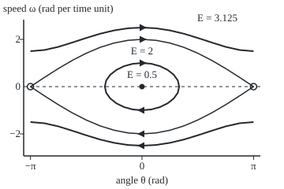
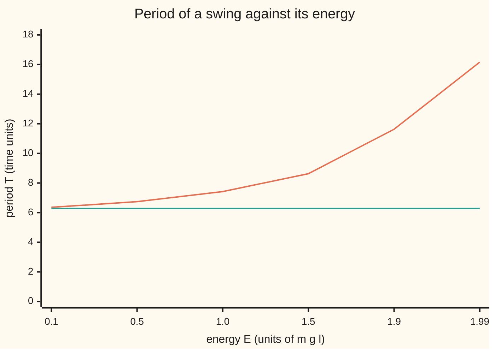

# The pendulum: swinging and spinning over live in one picture, separated by the energy of standing on end

[Syllabus](../../../SYLLABUS.md) → [Differential equations and dynamics](../README.md) → [Nonlinear Dynamics in the Plane](../README.md#s06) → The pendulum

---

## General Overview

A swing hangs from rigid rods 1 m long. Pull the seat back to 60 degrees and let go. School physics says one full swing takes 2.006 s, whatever the release angle. The true time is 2.153 s, 7.3% longer, and a higher release is slower still.

Push the seat from the bottom instead. Below 6.264 m/s it rises, stops and falls back. Above 6.264 m/s it goes over the top and keeps turning, like a wheel.

One number sorts every motion: the energy, speed and height combined into one score that only friction changes. Its level curves (lines of equal energy) draw every motion at once: closed loops are swings, wavy lines are spins, and between them runs one curve, at the energy of the swing balanced upside down.

**Without friction the pendulum's energy never changes, so each motion runs along one level curve: below the energy of standing on end the curve is a closed loop and the motion a swing, above it a wavy line and the motion a full rotation.**

**What kind of fact this is:** a theorem, proved on this card in Why it works; the pendulum equation itself is a model of a rigid, frictionless swing.

### The picture: every motion of the swing at once

<p align="center"></p>

Scale: 45 units per radian across, 30 per unit of angular speed up. The loop is the swing from 60 degrees, energy 0.5. The curves through the open circles (upside down) are the separatrix, energy 2. The wavy lines are a push of 2.5 units, energy 3.125, turning either way.

---

## The formula

The angle $\theta$ is measured from straight down, in radians; its rate $\theta'$ is the angular speed, written $\omega$. With gravity $g$ = 9.81 m/s^2 and rod length $l$ = 1 m the law is $\theta'' = -(g/l)\sin\theta$: the rate of the angular speed is minus g over l times the sine of the angle. Counting time $t$ in units of $\sqrt{l/g}$, 0.3193 s here, removes the constant:

$$\theta' = \omega, \qquad \omega' = -\sin\theta$$

**Read it aloud:** the angle changes at the angular speed, and the angular speed changes at minus the sine of the angle.

The energy, counted in units of $m g l$ (bob mass times gravity times rod length):

$$E(\theta, \omega) = \tfrac12\,\omega^2 + 1 - \cos\theta$$

**Read it aloud:** half the square of the speed, for motion, plus one minus the cosine of the angle, for height.

The height term is the bob's height in rod lengths: 0 hanging, 1 horizontal, 2 upside down ([Sine, cosine and tangent](../../05-Geometry%20and%20trig/03-Trigonometry/01-right-triangle-trigonometry.md)). A swing below energy 2 turns back at $\theta_{\max}$, where $\cos\theta_{\max} = 1 - E$. Its period, one full swing there and back, is:

$$T = 4\int_0^{\pi/2}\frac{d\varphi}{\sqrt{1 - k^2\sin^2\varphi}}, \qquad k = \sin\tfrac{\theta_{\max}}{2}, \quad k^2 = \tfrac{E}{2}$$

**Read it aloud:** the period is four quarter swings, each an integral whose only input is k, the sine of half the amplitude.

| Symbol | Plain meaning | In our example | Push it up and the answer… |
| --- | --- | --- | --- |
| $\theta$ | angle of the rod from straight down, rad | π/3, 60 degrees | bob higher: 2 rod lengths up at π |
| $\omega$ | angular speed, rad per time unit | 0 at release; 2.5 pushed | more motion energy |
| $t$ | time, in units of $\sqrt{l/g}$ | one unit is 0.3193 s | — |
| $g$, $l$ | gravity 9.81 m/s^2, rod length | $l$ = 1 m | longer rod: slower, by $\sqrt{l}$ |
| $E$ | energy, in units of $m g l$ | 0.5 for the swing, 3.125 for the push | past 2: rotation |
| $\theta_{\max}$, $k$ | turning angle; $k$ is the sine of half of it | 60 degrees; 0.5 | period grows without bound |
| $T$, $\varphi$ | period; $\varphi$ is the integral's variable | 6.743 units, 2.153 s | — |
| $\lambda$ | growth rate near a rest (an eigenvalue) | ±i hanging, ±1 upside down | — |

### When it holds

- **No friction.** With friction, $\theta'' + 0.5\,\theta' + \sin\theta = 0$ (the shelf's house swing), the energy falls from 0.5 to 0.0186 in 6.74 time units: loops become spirals.
- **A rigid, light rod.** A chain goes slack above the horizontal when the seat moves slowly, so rotation needs rods.
- **A fixed length.** A rider who stands and squats changes $l$ each swing and pumps energy in.
- **A smooth law.** The sine has a bounded slope, so solutions are unique and never cross.

---

## Why it works

### Step 0: one quantity that the motion cannot change

A law with two unknowns fills a plane, the phase plane of [Phase portraits and nullclines](01-phase-portraits-and-nullclines.md). A conserved quantity, a function of the state fixed along every solution, traps each solution on one level curve, and level curves can be drawn without solving anything.

### Step 1: the energy is conserved

Differentiate $E$ along a solution with the chain rule. The speed term changes at $\omega\,\omega'$ and the height term at $\sin\theta\,\theta'$:

$$E' = \omega\,(-\sin\theta) + \sin\theta\,\omega = 0.$$

Speed lost pays exactly for height gained, so $E$ keeps its starting value: 0.5 for the swing. Each motion runs along the curve $\omega = \pm\sqrt{2(E - 1 + \cos\theta)}$.

### Step 2: below energy 2, a closed loop and a swing

The square root needs $\cos\theta \ge 1 - E$. Below energy 2 that caps the angle: at 0.5, $\cos\theta_{\max} = 0.5$, so 60 degrees. On the upper half $\omega > 0$ and the angle rises; on the lower half it falls. At the ends the speed is zero but $\omega' = -\sin\theta_{\max}$ is not, so the swing turns back rather than stalling. The motion circles the loop and repeats.

<details>
<summary>Detailed proof: the loop is travelled in finite time and repeats</summary>

Take $0 < E < 2$. On the upper arc $dt = d\theta/\omega$. Near $\theta_{\max}$ the mean value theorem gives $\cos\theta - \cos\theta_{\max} \ge c\,(\theta_{\max} - \theta)$ for some constant $c > 0$, since the slope of cosine there is $-\sin\theta_{\max} < 0$. So the integrand is at most a constant times $(\theta_{\max} - \theta)^{-1/2}$, whose integral is finite. At $(\theta_{\max}, 0)$, $\omega' < 0$, so the lower arc begins. The law is unchanged by $(\theta, \omega, t) \to (-\theta, -\omega, t)$ and by $(\theta, \omega, t) \to (\theta, -\omega, -t)$, so the four quarter-arcs take equal times. After four the state is back at its start, and uniqueness makes the motion repeat with period four quarter-arcs.

</details>

### Step 3: above energy 2, a wavy line and a rotation

If $E > 2$, then $E - 1 + \cos\theta \ge E - 2 > 0$ at every angle. The speed never reaches zero, keeps one sign, and the angle grows forever. It dips at the top and peaks at the bottom, so the curve waves. The push of 2.5 has energy 3.125, speed $\sqrt{2(3.125 - 2)} = 1.5$ at the top, and turns once every 3.1925 time units.

### Step 4: at energy 2, the separatrix

At $E = 2$ the curve is $\omega = \pm 2\cos(\theta/2)$, reaching zero speed exactly upside down. This is the separatrix: it separates the loops inside from the wavy lines outside. The Jacobian, the table of slopes of each rate against each unknown ([Linearisation](02-linearisation-and-the-jacobian.md)), is `[[0, 1], [-cos θ, 0]]`, so its eigenvalues satisfy $\lambda^2 = -\cos\theta$. Hanging, $\lambda = \pm i$: a centre, which linearisation alone cannot trust; the energy settles it, since its level curves around its minimum are closed. Upside down, $\lambda = \pm 1$: a saddle, with one direction in and one out, of slopes ±1, exactly the separatrix's slopes there. Near the top the gap shrinks like $e^{-t}$, so a swing on the separatrix creeps toward standing on end and never arrives.

### Step 5: the period, and why it grows

A quarter swing takes $\int_0^{\theta_{\max}} d\theta/\omega$, which half-angles turn into the integral in The formula. At $k = 0$ the integrand is 1 and $T = 2\pi$, the small-angle period. Any $k > 0$ enlarges the integrand, so every real swing is slower. As $E$ nears 2, $k$ nears 1, the integrand nears $1/\cos\varphi$, and the period grows without bound, close to $2\ln(32/(2 - E))$.

<details>
<summary>The algebra behind the integral</summary>

With $1 - \cos\theta = 2\sin^2(\theta/2)$, the speed is $\omega = 2\sqrt{k^2 - \sin^2(\theta/2)}$. Substitute $\sin(\theta/2) = k\sin\varphi$. Then $\omega = 2k\cos\varphi$ and $d\theta = 2k\cos\varphi\,d\varphi/\sqrt{1 - k^2\sin^2\varphi}$, so $d\theta/\omega = d\varphi/\sqrt{1 - k^2\sin^2\varphi}$, with $\varphi$ running from 0 to $\pi/2$. For a rotation, $\varphi = \theta/2$ gives one turn as $2k$ times the same integral, with $k^2 = 2/E$.

</details>



The orange line is the true period; the green line is the small-angle period, 6.28 at every energy. The integral is a complete elliptic integral of the first kind; stepping the law, as the code does, reaches the same period without it.

---

## Worked numbers, by hand

| Step | Arithmetic | Value |
| --- | --- | --- |
| energy at release | 1 − cos 60° = 1 − 0.5 | 0.5 |
| energy upside down | 1 − cos 180° = 2; 0.5 < 2 | a swing |
| $k$ | sin 30°; $k^2$ = E ÷ 2 = 0.25 | 0.5 |
| period, true | 4 × the integral at $k^2$ = 0.25 | **6.743 units** |
| period, small-angle | 2π | 6.283 units |
| in seconds | 6.743 × 0.3193 and 6.283 × 0.3193 | **2.153 s** against 2.006 s |
| push needed for the top | ½ ω^2 = 2, so ω = 2 units; times $\sqrt{g l}$ for m/s | **6.264 m/s** |

The swing from 60 degrees takes 2.153 s, not 2.006 s; a push faster than 6.264 m/s carries it over the top.

### What breaks if you drop a piece

| Mistake | Comes out at | What went wrong |
| --- | --- | --- |
| Small-angle period at 60 degrees | 6.283 units, not 6.743 | sin θ replaced by θ |
| Push of 4.429 m/s, aiming one rod length up | energy 1, turns back at 90 degrees | The top is two rod lengths up |
| Friction 0.5, the house swing | energy 0.0186 after 6.74 units | Not conserved: no closed loops |
| Euler's rule (straight steps along the current slope), step 0.1 | energy 0.8474 after 6.74 units | The rule pumps energy in |

---

## Code, from first principles, and it actually runs

Road one evaluates the period integral by Simpson's rule (parabolas through points three at a time). Road two never sees that integral: it steps the law with Runge-Kutta 4, RK4 (each step samples the slope four times), until the swing reaches the bottom, bisects the last step to land on it, and multiplies by four. Its error falls 16-fold when the step halves: RK4 is order four. Both roads also time one turn of the push.

### Python

```python
# The nonlinear pendulum -- the check behind the card.  Imports only math's
# sin, cos, asin, acos, sqrt, log and pi.  Time is counted in units of sqrt(l/g)
# and energy per m g l, so the swing obeys theta'' = -sin(theta).  Road one: the
# period integral by Simpson's rule.  Road two: RK4 steps that know no formula.
from math import sin, cos, asin, acos, sqrt, log, pi
G, L, TH0 = 9.81, 1.0, pi / 3; U = sqrt(L / G)         # 1 m rod, 60 degrees; one time unit in s
def energy(th, w): return 0.5 * w * w + 1 - cos(th)
def quarter(k2, n=400):                                # integral of 1/sqrt(1 - k2 sin^2) on [0, pi/2]
    h = pi / 2 / n
    f = lambda p: 1 / sqrt(1 - k2 * sin(p) ** 2)
    return h / 3 * (f(0) + f(pi / 2) + sum((4 if i % 2 else 2) * f(i * h) for i in range(1, n)))
def rk4(th, w, h, c=0.0):                              # one Runge-Kutta 4 step; c = friction
    f = lambda a, b: (b, -sin(a) - c * b)
    a1, b1 = f(th, w); a2, b2 = f(th + h / 2 * a1, w + h / 2 * b1)
    a3, b3 = f(th + h / 2 * a2, w + h / 2 * b2); a4, b4 = f(th + h * a3, w + h * b3)
    return th + h / 6 * (a1 + 2 * a2 + 2 * a3 + a4), w + h / 6 * (b1 + 2 * b2 + 2 * b3 + b4)
def time_to(th, w, target, h):                         # step until theta passes target,
    t, s = 0.0, th - target                            # then bisect the length of the last step
    while (rk4(th, w, h)[0] - target) * s > 0: th, w = rk4(th, w, h); t += h
    lo, hi = 0.0, h
    for _ in range(60):
        mid = (lo + hi) / 2
        lo, hi = (mid, hi) if (rk4(th, w, mid)[0] - target) * s > 0 else (lo, mid)
    return t + lo
def run(th, w, t, h, step):                            # march a fixed time, return the energy
    for _ in range(round(t / h)): th, w = step(th, w, h)
    return energy(th, w)
euler = lambda th, w, h: (th + h * w, w - h * sin(th))
E0 = energy(TH0, 0.0); T_simp = 4 * quarter(E0 / 2)
T_rk = [4 * time_to(TH0, 0.0, 0.0, h) for h in (0.1, 0.05)]
err = [abs(t - T_simp) for t in T_rk]
jac = [(-sin(x + 1e-5) + sin(x - 1e-5)) / 2e-5 for x in (0.0, pi)]   # d(omega')/d(theta)
sep = (2 * cos((pi + 1e-5) / 2) - 2 * cos((pi - 1e-5) / 2)) / 2e-5    # separatrix slope at pi
Er = energy(0.0, 2.5); k = sqrt(2 / Er)                # the push of 2.5 goes over the top
print(f"energy at release, 60 deg: {E0:.6f}; standing on end at rest: {energy(pi, 0):.6f}")
print(f"bottom speed to reach the top: {sqrt(2 * energy(pi, 0)):.4f} units = {2 * sqrt(G * L):.3f} m/s")
print(f"lambda^2 = d(omega')/d(theta): at 0 {jac[0]:.6f} -> +-i, centre; at pi {jac[1]:.6f} -> +-1, saddle")
print(f"separatrix omega = 2 cos(theta/2), slope at pi: {sep:.6f}")
print(f"period at 60 deg, Simpson: {T_simp:.6f}; small-angle 2 pi: {2 * pi:.6f}; ratio {T_simp / (2 * pi):.4f}")
print(f"period at 60 deg, RK4 h = 0.1, 0.05: {T_rk[0]:.6f} {T_rk[1]:.6f}; errors {err[0]:.8f} {err[1]:.8f}, ratio {err[0] / err[1]:.1f}")
print(f"energy after one period, RK4 h = 0.1: {run(TH0, 0.0, T_simp, 0.1, rk4):.6f}")
print(f"1 m rod: one unit {U:.4f} s; period {T_simp * U:.3f} s against small-angle {2 * pi * U:.3f} s")
print("chart, period at E = 0.1, 0.5, 1.0, 1.5, 1.9, 1.99:", " ".join(f"{4 * quarter(e / 2):.2f}" for e in (0.1, 0.5, 1.0, 1.5, 1.9, 1.99)))
print(f"near the top, 2 ln(32/(2 - E)) at E = 1.9, 1.99: {2 * log(32 / 0.1):.2f} {2 * log(32 / 0.01):.2f}")
print(f"push 2.5 ({2.5 * sqrt(G * L):.3f} m/s): energy {Er:.4f}, speed at the top {sqrt(2 * (Er - 2)):.4f}, one turn Simpson {2 * k * quarter(k * k):.4f}, RK4 {time_to(0.0, 2.5, 2 * pi, 0.05):.4f}")
print(f"mistake 1, bottom speed sqrt(2 g l) = {sqrt(2 * G * L):.3f} m/s: energy {energy(0, sqrt(2)):.4f}, turns back at {acos(1 - energy(0, sqrt(2))) * 180 / pi:.1f} deg")
print(f"mistake 2, friction 0.5 (the house swing): energy after 6.74 units {run(TH0, 0.0, 6.74, 0.01, lambda a, b, h: rk4(a, b, h, 0.5)):.4f}")
print(f"mistake 3, Euler's rule h = 0.1: energy after 6.74 units {run(TH0, 0.0, 6.74, 0.1, euler):.4f}")
X, Y = lambda th: 180 + 45 * th, lambda w: 110 - 30 * w            # 45 units per rad, 30 per unit of speed
pts = lambda cs: " ".join(f"{X(a):.1f},{Y(b):.1f}" for a, b in cs)
ks = sqrt(E0 / 2)
print("figure, swing loop:", pts((2 * asin(ks * sin(i * pi / 12)), 2 * ks * cos(i * pi / 12)) for i in range(24)))
for sg in (1, -1):
    print(f"figure, separatrix {sg:+d}:", pts((i * pi / 8, sg * 2 * cos(i * pi / 16)) for i in range(-8, 9)))
    print(f"figure, turning {sg:+d}:", pts((i * pi / 8, sg * sqrt(2 * (Er - 1 + cos(i * pi / 8)))) for i in range(-8, 9)))
assert abs(T_rk[1] - T_simp) < 1e-6 and 12 < err[0] / err[1] < 20   # two roads; RK4 is order four
assert abs(sqrt(jac[1]) - abs(sep)) < 1e-6              # saddle rate = separatrix slope
assert abs(2 * k * quarter(k * k) - time_to(0.0, 2.5, 2 * pi, 0.05)) < 1e-5
assert abs(run(TH0, 0.0, T_simp, 0.1, rk4) - E0) < 1e-4 < abs(run(TH0, 0.0, 6.74, 0.1, euler) - E0)
print("ALL CHECKS PASS")
```

**Ran 2026-09-28 on macOS, Python 3.14.6, standard library only. All checks passed. Output, pasted from the run:**

```
energy at release, 60 deg: 0.500000; standing on end at rest: 2.000000
bottom speed to reach the top: 2.0000 units = 6.264 m/s
lambda^2 = d(omega')/d(theta): at 0 -1.000000 -> +-i, centre; at pi 1.000000 -> +-1, saddle
separatrix omega = 2 cos(theta/2), slope at pi: -1.000000
period at 60 deg, Simpson: 6.743001; small-angle 2 pi: 6.283185; ratio 1.0732
period at 60 deg, RK4 h = 0.1, 0.05: 6.743005 6.743002; errors 0.00000364 0.00000023, ratio 15.9
energy after one period, RK4 h = 0.1: 0.500000
1 m rod: one unit 0.3193 s; period 2.153 s against small-angle 2.006 s
chart, period at E = 0.1, 0.5, 1.0, 1.5, 1.9, 1.99: 6.36 6.74 7.42 8.63 11.63 16.16
near the top, 2 ln(32/(2 - E)) at E = 1.9, 1.99: 11.54 16.14
push 2.5 (7.830 m/s): energy 3.1250, speed at the top 1.5000, one turn Simpson 3.1925, RK4 3.1925
mistake 1, bottom speed sqrt(2 g l) = 4.429 m/s: energy 1.0000, turns back at 90.0 deg
mistake 2, friction 0.5 (the house swing): energy after 6.74 units 0.0186
mistake 3, Euler's rule h = 0.1: energy after 6.74 units 0.8474
figure, swing loop: 180.0,80.0 191.7,81.0 202.7,84.0 212.5,88.8 220.3,95.0 225.4,102.2 227.1,110.0 225.4,117.8 220.3,125.0 212.5,131.2 202.7,136.0 191.7,139.0 180.0,140.0 168.3,139.0 157.3,136.0 147.5,131.2 139.7,125.0 134.6,117.8 132.9,110.0 134.6,102.2 139.7,95.0 147.5,88.8 157.3,84.0 168.3,81.0
figure, separatrix +1: 38.6,110.0 56.3,98.3 74.0,87.0 91.6,76.7 109.3,67.6 127.0,60.1 144.7,54.6 162.3,51.2 180.0,50.0 197.7,51.2 215.3,54.6 233.0,60.1 250.7,67.6 268.4,76.7 286.0,87.0 303.7,98.3 321.4,110.0
figure, turning +1: 38.6,65.0 56.3,63.5 74.0,59.5 91.6,54.0 109.3,48.2 127.0,42.8 144.7,38.6 162.3,35.9 180.0,35.0 197.7,35.9 215.3,38.6 233.0,42.8 250.7,48.2 268.4,54.0 286.0,59.5 303.7,63.5 321.4,65.0
figure, separatrix -1: 38.6,110.0 56.3,121.7 74.0,133.0 91.6,143.3 109.3,152.4 127.0,159.9 144.7,165.4 162.3,168.8 180.0,170.0 197.7,168.8 215.3,165.4 233.0,159.9 250.7,152.4 268.4,143.3 286.0,133.0 303.7,121.7 321.4,110.0
figure, turning -1: 38.6,155.0 56.3,156.5 74.0,160.5 91.6,166.0 109.3,171.8 127.0,177.2 144.7,181.4 162.3,184.1 180.0,185.0 197.7,184.1 215.3,181.4 233.0,177.2 250.7,171.8 268.4,166.0 286.0,160.5 303.7,156.5 321.4,155.0
ALL CHECKS PASS
```

### Rust

Same numbers, same labels, built with `rustc --edition 2021 -O`.

```rust
// The nonlinear pendulum -- the same check as the Python, in Rust.  No crates.
// Time is counted in units of sqrt(l/g) and energy per m g l, so the swing obeys
// theta'' = -sin(theta).  Road one: the period integral by Simpson's rule.
// Road two: RK4 steps that know no formula.
use std::f64::consts::PI;
const G: f64 = 9.81; const L: f64 = 1.0; const TH0: f64 = PI / 3.0;   // 1 m rod, released at 60 degrees
fn energy(th: f64, w: f64) -> f64 { 0.5 * w * w + 1.0 - th.cos() }
fn quarter(k2: f64) -> f64 {                            // integral of 1/sqrt(1 - k2 sin^2) on [0, pi/2]
    let (n, h) = (400, PI / 800.0);
    let f = |p: f64| 1.0 / (1.0 - k2 * p.sin().powi(2)).sqrt();
    let mid: f64 = (1..n).map(|i| (if i % 2 == 1 { 4.0 } else { 2.0 }) * f(i as f64 * h)).sum();
    h / 3.0 * (f(0.0) + f(PI / 2.0) + mid)
}
fn rk4(th: f64, w: f64, h: f64, c: f64) -> (f64, f64) { // one Runge-Kutta 4 step; c = friction
    let f = |a: f64, b: f64| (b, -a.sin() - c * b);
    let (a1, b1) = f(th, w);
    let (a2, b2) = f(th + h / 2.0 * a1, w + h / 2.0 * b1); let (a3, b3) = f(th + h / 2.0 * a2, w + h / 2.0 * b2);
    let (a4, b4) = f(th + h * a3, w + h * b3);
    (th + h / 6.0 * (a1 + 2.0 * a2 + 2.0 * a3 + a4), w + h / 6.0 * (b1 + 2.0 * b2 + 2.0 * b3 + b4))
}
fn time_to(mut th: f64, mut w: f64, target: f64, h: f64) -> f64 {   // step until theta passes target,
    let (mut t, s) = (0.0, th - target);                            // then bisect the last step
    while (rk4(th, w, h, 0.0).0 - target) * s > 0.0 { (th, w) = rk4(th, w, h, 0.0); t += h }
    let (mut lo, mut hi) = (0.0, h);
    for _ in 0..60 {
        let mid = (lo + hi) / 2.0;
        if (rk4(th, w, mid, 0.0).0 - target) * s > 0.0 { lo = mid } else { hi = mid }
    }
    t + lo
}
fn run(mut th: f64, mut w: f64, t: f64, h: f64, step: &dyn Fn(f64, f64, f64) -> (f64, f64)) -> f64 {
    for _ in 0..(t / h).round() as i64 { (th, w) = step(th, w, h) }
    energy(th, w)
}
fn pts(cs: &[(f64, f64)]) -> String {                   // 45 units per rad, 30 per unit of speed
    cs.iter().map(|&(a, b)| format!("{:.1},{:.1}", 180.0 + 45.0 * a, 110.0 - 30.0 * b)).collect::<Vec<_>>().join(" ")
}
fn main() {
    let (u, rk) = ((L / G).sqrt(), |a: f64, b: f64, h: f64| rk4(a, b, h, 0.0));
    let euler = |a: f64, b: f64, h: f64| (a + h * b, b - h * a.sin());
    let (e0, top) = (energy(TH0, 0.0), energy(PI, 0.0));
    let t_simp = 4.0 * quarter(e0 / 2.0);
    let t_rk: Vec<f64> = [0.1, 0.05].iter().map(|&h| 4.0 * time_to(TH0, 0.0, 0.0, h)).collect();
    let err: Vec<f64> = t_rk.iter().map(|t| (t - t_simp).abs()).collect();
    let jac: Vec<f64> = [0.0, PI].iter().map(|&x| (-(x + 1e-5).sin() + (x - 1e-5).sin()) / 2e-5).collect();
    let sep = (2.0 * ((PI + 1e-5) / 2.0).cos() - 2.0 * ((PI - 1e-5) / 2.0).cos()) / 2e-5;
    let (er, e1) = (energy(0.0, 2.5), energy(0.0, 2f64.sqrt()));
    let k = (2.0 / er).sqrt();
    let (turn_s, turn_rk) = (2.0 * k * quarter(k * k), time_to(0.0, 2.5, 2.0 * PI, 0.05));
    let (e_rk, e_eu) = (run(TH0, 0.0, t_simp, 0.1, &rk), run(TH0, 0.0, 6.74, 0.1, &euler));
    println!("energy at release, 60 deg: {:.6}; standing on end at rest: {:.6}", e0, top);
    println!("bottom speed to reach the top: {:.4} units = {:.3} m/s", (2.0 * top).sqrt(), 2.0 * (G * L).sqrt());
    println!("lambda^2 = d(omega')/d(theta): at 0 {:.6} -> +-i, centre; at pi {:.6} -> +-1, saddle", jac[0], jac[1]);
    println!("separatrix omega = 2 cos(theta/2), slope at pi: {:.6}", sep);
    println!("period at 60 deg, Simpson: {:.6}; small-angle 2 pi: {:.6}; ratio {:.4}", t_simp, 2.0 * PI, t_simp / (2.0 * PI));
    println!("period at 60 deg, RK4 h = 0.1, 0.05: {:.6} {:.6}; errors {:.8} {:.8}, ratio {:.1}", t_rk[0], t_rk[1], err[0], err[1], err[0] / err[1]);
    println!("energy after one period, RK4 h = 0.1: {:.6}", e_rk);
    println!("1 m rod: one unit {:.4} s; period {:.3} s against small-angle {:.3} s", u, t_simp * u, 2.0 * PI * u);
    let ch: Vec<String> = [0.1, 0.5, 1.0, 1.5, 1.9, 1.99].iter().map(|&e| format!("{:.2}", 4.0 * quarter(e / 2.0))).collect();
    println!("chart, period at E = 0.1, 0.5, 1.0, 1.5, 1.9, 1.99: {}", ch.join(" "));
    println!("near the top, 2 ln(32/(2 - E)) at E = 1.9, 1.99: {:.2} {:.2}", 2.0 * (32.0f64 / 0.1).ln(), 2.0 * (32.0f64 / 0.01).ln());
    println!("push 2.5 ({:.3} m/s): energy {:.4}, speed at the top {:.4}, one turn Simpson {:.4}, RK4 {:.4}", 2.5 * (G * L).sqrt(), er, (2.0 * (er - 2.0)).sqrt(), turn_s, turn_rk);
    println!("mistake 1, bottom speed sqrt(2 g l) = {:.3} m/s: energy {:.4}, turns back at {:.1} deg", (2.0 * G * L).sqrt(), e1, (1.0 - e1).acos() * 180.0 / PI);
    println!("mistake 2, friction 0.5 (the house swing): energy after 6.74 units {:.4}", run(TH0, 0.0, 6.74, 0.01, &|a, b, h| rk4(a, b, h, 0.5)));
    println!("mistake 3, Euler's rule h = 0.1: energy after 6.74 units {:.4}", e_eu);
    let ks = (e0 / 2.0).sqrt();
    let lp: Vec<(f64, f64)> = (0..24).map(|i| { let p = i as f64 * PI / 12.0; (2.0 * (ks * p.sin()).asin(), 2.0 * ks * p.cos()) }).collect();
    println!("figure, swing loop: {}", pts(&lp));
    for sg in [1.0f64, -1.0] {
        let sp: Vec<(f64, f64)> = (-8..9).map(|i| (i as f64 * PI / 8.0, sg * 2.0 * (i as f64 * PI / 16.0).cos())).collect();
        let tp: Vec<(f64, f64)> = (-8..9).map(|i| { let a = i as f64 * PI / 8.0; (a, sg * (2.0 * (er - 1.0 + a.cos())).sqrt()) }).collect();
        println!("figure, separatrix {:+}: {}", sg as i32, pts(&sp));
        println!("figure, turning {:+}: {}", sg as i32, pts(&tp));
    }
    assert!((t_rk[1] - t_simp).abs() < 1e-6 && 12.0 < err[0] / err[1] && err[0] / err[1] < 20.0);   // two roads; order four
    assert!((jac[1].sqrt() - sep.abs()).abs() < 1e-6);            // saddle rate = separatrix slope
    assert!((turn_s - turn_rk).abs() < 1e-5);
    assert!((e_rk - e0).abs() < 1e-4 && 1e-4 < (e_eu - e0).abs());
    println!("ALL CHECKS PASS");
}
```

**Ran 2026-09-28 on macOS, rustc 1.98.1, no crates. All checks passed. Output, pasted from the run:**

```
energy at release, 60 deg: 0.500000; standing on end at rest: 2.000000
bottom speed to reach the top: 2.0000 units = 6.264 m/s
lambda^2 = d(omega')/d(theta): at 0 -1.000000 -> +-i, centre; at pi 1.000000 -> +-1, saddle
separatrix omega = 2 cos(theta/2), slope at pi: -1.000000
period at 60 deg, Simpson: 6.743001; small-angle 2 pi: 6.283185; ratio 1.0732
period at 60 deg, RK4 h = 0.1, 0.05: 6.743005 6.743002; errors 0.00000364 0.00000023, ratio 15.9
energy after one period, RK4 h = 0.1: 0.500000
1 m rod: one unit 0.3193 s; period 2.153 s against small-angle 2.006 s
chart, period at E = 0.1, 0.5, 1.0, 1.5, 1.9, 1.99: 6.36 6.74 7.42 8.63 11.63 16.16
near the top, 2 ln(32/(2 - E)) at E = 1.9, 1.99: 11.54 16.14
push 2.5 (7.830 m/s): energy 3.1250, speed at the top 1.5000, one turn Simpson 3.1925, RK4 3.1925
mistake 1, bottom speed sqrt(2 g l) = 4.429 m/s: energy 1.0000, turns back at 90.0 deg
mistake 2, friction 0.5 (the house swing): energy after 6.74 units 0.0186
mistake 3, Euler's rule h = 0.1: energy after 6.74 units 0.8474
figure, swing loop: 180.0,80.0 191.7,81.0 202.7,84.0 212.5,88.8 220.3,95.0 225.4,102.2 227.1,110.0 225.4,117.8 220.3,125.0 212.5,131.2 202.7,136.0 191.7,139.0 180.0,140.0 168.3,139.0 157.3,136.0 147.5,131.2 139.7,125.0 134.6,117.8 132.9,110.0 134.6,102.2 139.7,95.0 147.5,88.8 157.3,84.0 168.3,81.0
figure, separatrix +1: 38.6,110.0 56.3,98.3 74.0,87.0 91.6,76.7 109.3,67.6 127.0,60.1 144.7,54.6 162.3,51.2 180.0,50.0 197.7,51.2 215.3,54.6 233.0,60.1 250.7,67.6 268.4,76.7 286.0,87.0 303.7,98.3 321.4,110.0
figure, turning +1: 38.6,65.0 56.3,63.5 74.0,59.5 91.6,54.0 109.3,48.2 127.0,42.8 144.7,38.6 162.3,35.9 180.0,35.0 197.7,35.9 215.3,38.6 233.0,42.8 250.7,48.2 268.4,54.0 286.0,59.5 303.7,63.5 321.4,65.0
figure, separatrix -1: 38.6,110.0 56.3,121.7 74.0,133.0 91.6,143.3 109.3,152.4 127.0,159.9 144.7,165.4 162.3,168.8 180.0,170.0 197.7,168.8 215.3,165.4 233.0,159.9 250.7,152.4 268.4,143.3 286.0,133.0 303.7,121.7 321.4,110.0
figure, turning -1: 38.6,155.0 56.3,156.5 74.0,160.5 91.6,166.0 109.3,171.8 127.0,177.2 144.7,181.4 162.3,184.1 180.0,185.0 197.7,184.1 215.3,181.4 233.0,177.2 250.7,171.8 268.4,166.0 286.0,160.5 303.7,156.5 321.4,155.0
ALL CHECKS PASS
```

The two outputs match line for line.

> [!TIP]
> **Try changing**
> Guess first, then run it. Every run passes its asserts.
> - **Release from 90 degrees.** Set `TH0` to `pi / 2`. The period is 7.416299 units (the labels still say 60 deg).
> - **A weaker push.** Replace every `2.5` with `2.1`. Energy 2.2050, top speed 0.6403, one turn 4.9761 units.
> - **Less friction.** Change `rk4(a, b, h, 0.5)` to `rk4(a, b, h, 0.1)`. The energy after 6.74 units is 0.2623.

---

## The usual mistake

> [!warning]
> **Treating the period as fixed.** The small-angle 2π holds only for tiny swings. At 60 degrees the period is 6.743 units; at energy 1.9 it is 11.63, at 1.99 it is 16.16.
>
> - **Pushing to one rod length of height.** A push of 4.429 m/s gives energy 1: the seat reaches the horizontal and falls back.
> - **Trusting a coarse simulation.** Euler's rule with step 0.1 raises the energy to 0.8474 in one swing: the loop spirals out, a fault of the method.

---

## Where you meet it in real life

- **Looping swing rides.** A fairground swing that goes over the top rides a wavy line on a rigid arm.
- **Pendulum clocks.** A clock that swings wider runs slow, so clockmakers keep the swing small and steady.
- **Balancing upright.** Standing on end is a saddle: a small error grows like $e^{t}$, which a Segway steers against.
- **Other closed loops.** Predator and prey counts circle for the same reason: [Predator and prey](06-predator-prey.md). A lone loop with none is a limit cycle: [Limit cycles](08-limit-cycles-and-van-der-pol.md).

> **Say it back**
> Without friction the pendulum's energy stays fixed, so every motion runs along one level curve. Below energy 2, the energy of standing on end, the curve is a closed loop: a swing, slower the wider it goes. Above 2 the speed never reaches zero and the swing turns over and over. At exactly 2 lies the separatrix, which creeps toward the top forever.

---

## What this builds on

- [Linearisation](02-linearisation-and-the-jacobian.md): the Jacobian's eigenvalues, a centre that linearisation cannot trust, and a saddle it can.
- [Sine, cosine and tangent](../../05-Geometry%20and%20trig/03-Trigonometry/01-right-triangle-trigonometry.md): the bob's height, $l(1 - \cos\theta)$, read off the right triangle under the rod.

## Where this goes next

- [LaSalle's principle](05-lasalle-and-the-damped-pendulum.md): the same energy with friction, which only falls.
- [Lagrangian mechanics](../12-Calculus%20of%20Variations%20and%20Optimal%20Control/04-lagrangian-mechanics.md): where the law and its conserved energy come from.
- [Regular perturbation](../../13-Engineering%20mathematics/01-Units%20and%20Modelling/05-regular-perturbation.md): the period's growth as a series in the amplitude.

---

## Sources

Verified 2026-09-28: each page names the cited work; the DOI checked against Crossref.

- Strogatz, Steven H. *Nonlinear Dynamics and Chaos*, 3rd ed. CRC Press, 2024. [Publisher page](https://www.routledge.com/Nonlinear-Dynamics-and-Chaos-With-Applications-to-Physics-Biology-Chemistry-and-Engineering/Strogatz/p/book/9780367026509). The pendulum's energy, phase portrait and separatrix.
- Nelson, Robert A., and M. G. Olsson. "The pendulum: Rich physics from a simple system." *American Journal of Physics* 54, 112–121 (1986). [DOI](https://doi.org/10.1119/1.14703). The exact period and its growth with amplitude.
- NIST Digital Library of Mathematical Functions, §19.2, "Legendre's Integrals: Definitions." [Page](https://dlmf.nist.gov/19.2). The period's integral.
- MIT OpenCourseWare. *18.03 Differential Equations*, Spring 2010. [Course page](https://ocw.mit.edu/courses/18-03-differential-equations-spring-2010/). Nonlinear systems in the plane.
