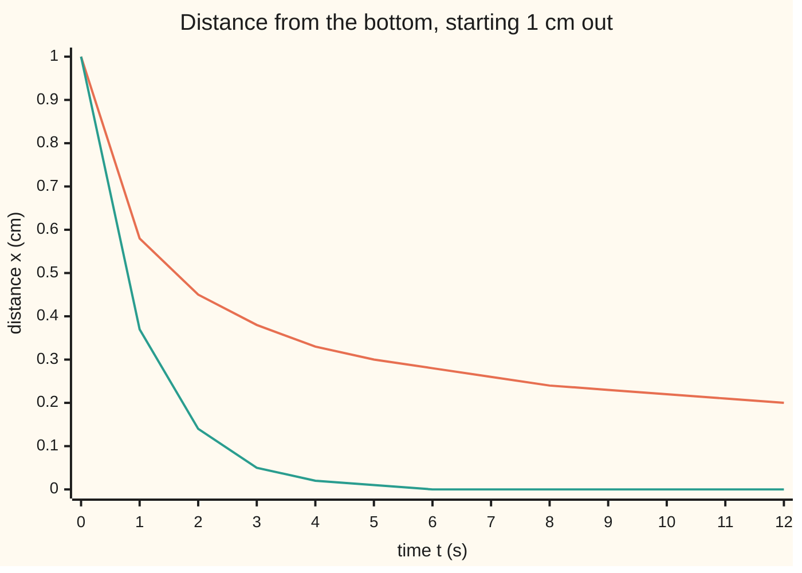

# Lyapunov functions: find something that only ever decreases and you have proved the system settles, without solving it

[Syllabus](../../../SYLLABUS.md) → [Differential equations and dynamics](../../../SYLLABUS.md#w08) → [Nonlinear Dynamics in the Plane](../../../SYLLABUS.md#w08-s06) → Lyapunov functions

---

## General Overview

A steel ball sits in a bowl of thick honey, 1 cm from the lowest point. The floor is very flat near the bottom, so the push back is weak there. In honey, speed follows the push: 1 cm per second at 1 cm, only 0.125 at 0.5 cm. The rate law is x' = −x^3, with x the distance from the bottom in cm and t the time in s (the constant in front is 1 per cm^2 per s).

Does the ball reach the bottom? The linearisation test reads the slope of the rate law at the rest. Here that slope is 0: the test is silent. The upturned bowl, x' = +x^3, has the same zero slope, and its ball flies off to infinity in half a second.

The way out is to watch one number instead of the motion. Take V = x^2/2, half the squared distance: zero at the bottom, positive elsewhere. It is not the bowl's height, only a score that behaves like one. The chain rule gives its rate without solving anything: V' = x · x' = −x^4, never positive. Such a score is called a **Lyapunov function**, after Aleksandr Lyapunov, who set out the method in 1892.

**If a quantity is zero at a rest, positive elsewhere, and never rises along any motion, the rest is stable; if it strictly falls everywhere except at the rest, nearby motions settle there.**

**What kind of fact this is:** a theorem, proved in Why it works; finding V is a search with no recipe that always works.

### The picture: the honey bowl against a round bowl



Orange: the honey bowl, x' = −x^3, still 0.20 cm out at 12 s. Green: a round bowl, x' = −x (rate constant 1 per s), under 0.005 cm from 6 s. Both settle; only the round one passes the linear test.

---

## The formula

Notation first. A rest of x' = f(x) is a point x* where f(x*) = 0. A function V is **positive definite** about x* when V(x*) = 0 and V is positive at every other point near it. The rate of V along a motion is written V' and computed from f alone:

$$V'(x) = \nabla V(x)\cdot f(x)$$

**Read it aloud:** the rate of V along the motion is the gradient of V (its slopes in each direction) dotted with the velocity the rate law prescribes.

On a line the gradient is the plain slope, so V' = x · (−x^3) = −x^4 in the bowl. Lyapunov's direct method: for V positive definite with continuous slopes near x*,

$$V' \le 0 \;\Rightarrow\; x^* \text{ stable}, \qquad V' < 0 \text{ except at } x^* \;\Rightarrow\; x^* \text{ asymptotically stable}.$$

**Read it aloud:** if V never rises, motions that start close stay close; if V always falls away from the rest, they also settle into it.

**Stable** means: for any allowed distance, starts close enough never exceed it. **Asymptotically stable** adds that motions tend to the rest. If V' > 0 except at x*, the rest is unstable.

| Symbol | Plain meaning | In our example | Push it up and the answer… |
| --- | --- | --- | --- |
| $x$ | distance of the ball from the bottom, cm | 1 cm at the start | V and the push grow |
| $t$ | time since release, s | 0 to 12 s | x shrinks, slowly |
| $f$ | the rate law: velocity at each place | −x^3 cm/s | — |
| $x^*$ | the rest being tested | 0, the bottom | — |
| $x_0$ | starting distance | 1 cm | x(12) barely changes |
| $V$ | the Lyapunov function, a height-like score | x^2/2, 0.5 at the start | — |
| $V'$ | rate of V along the motion | −x^4: −1 at 1 cm | more negative: settles faster |
| $y$, $E$ | without honey: speed in cm/s, and energy x^4/4 + y^2/2 | E = 0.25 from rest at 1 cm | E never changes |

### When it holds

- **V and f have continuous slopes**, so the chain rule applies; otherwise V' may not exist.
- **V is positive away from the rest.** Otherwise a falling V proves nothing: V = −x^2/2 falls along x' = +x^3, whose ball is at 7.0711 cm at 0.49 s.
- **V' < 0 strictly, for settling.** Without honey (x' = y, y' = −x^3) the energy E has E' = 0: it stays 0.25 and the ball swings out to 1.0000 cm for ever.
- **Only where checked.** For x' = −x + x^3, V = x^2/2 gives V' = −x^2(1 − x^2), negative only under 1 cm. From 1.1 cm the ball escapes at 0.876 s.
- **A failed candidate proves nothing.** Another V may still work.

---

## Why it works

### Step 0: the chain rule turns a formula for V into a clock reading

Along a motion x(t), V(x(t)) is an ordinary function of time. Its rate is the slope of V times the velocity, and the velocity is f(x). So V' is known from the rate law, before any solution. At 4 s the stepped path gives −0.012346 cm^2 per s, and −x^4 there is −0.012346.

### Step 1: V' ≤ 0 fences the motion into its starting bowl

V never rises, so the motion stays where V is at most its starting value. Released at 1 cm, the ball stays between −1 and 1 cm.

### Step 2: a small start gives a small bowl

Pick any allowed distance. At the points exactly that far out (two on a line, a circle in the plane) V has a smallest value, positive because V is positive away from the rest. Starts close enough have V below it, since V is continuous and zero at the rest. Reaching the circle would need V to climb. That is stability.

### Step 3: V' < 0 drives V to zero

V falls but never below zero, so it tends to a limit c. If c were positive, the motion would stay a fixed distance from the rest, where V' is at most −g for some fixed g > 0. V would then drop by g every second and pass zero: impossible. So c = 0, and the ball tends to the rest.

<details>
<summary>Detailed proof</summary>

Let x* = 0, V continuously differentiable and positive definite on a ball of radius r, and V' ≤ 0 there. Stability: given ε in (0, r), let m > 0 be the minimum of V on the sphere |x| = ε (closed and bounded, V > 0 on it). Choose δ < ε with V < m for |x| < δ. If |x(0)| < δ, then V(x(t)) ≤ V(x(0)) < m for all t ≥ 0, so x(t) never meets the sphere: |x(t)| < ε, and trapped in a closed bounded set the solution exists for all t ≥ 0. Asymptotic stability: let V' < 0 except at 0. V(x(t)) decreases and is bounded below, so it tends to c ≥ 0. If c > 0, pick ρ > 0 with V < c on |x| < ρ; then ρ ≤ |x(t)| ≤ ε for all t. On that closed shell V' ≤ −g for some g > 0, so V(x(t)) ≤ V(x(0)) − g t, negative for large t: a contradiction. So c = 0, and since V is bounded below by a positive number on every shell ε' ≤ |x| ≤ ε, x(t) tends to 0.

</details>

### Step 4: in the honey bowl, V obeys its own equation

Since x^4 = 4V^2, the rate is V' = −4V^2. That separates: 1/V = 1/V0 + 4t, with V0 = 0.5. At 12 s, 1/V = 50, so V = 0.02; the stepped path agrees. The fall is slow because −x^4 is tiny near the bottom: −0.0016 at 0.2 cm.

### Step 5: the same V, the opposite sign, the opposite verdict

For x' = +x^3, V' = +x^4 > 0 away from 0. V rises, so no motion off the rest can approach it: unstable. From 1 cm, 1/x^2 = 1 − 2t hits zero at 0.5 s; at 0.49 s the ball is at 7.0711 cm.

On a line, separating variables ([Separable equations](../01-Rate%20Equations/03-separable-equations.md)) also answers the question. The method earns its keep in the plane, where a solution formula is rarely available.

---

## Worked numbers, by hand

| Step | Arithmetic | Value |
| --- | --- | --- |
| the rest | f(0) = −0^3 | x* = 0 |
| the linear test | slope of −x^3 is −3x^2, at 0 | 0: silent |
| the candidate | V = x^2/2 at 1 cm | 0.5 |
| rate of V at 1, 0.5, 0.2 cm | x · (−x^3) = −x^4 | −1, −0.0625, −0.0016 |
| at 4 s | 1/x^2 = 1 + 2 × 4 = 9 | x = 0.333 cm |
| at 12 s | 1/x^2 = 1 + 2 × 12 = 25 | x = 0.200 cm |
| V by its own law | 1/V = 2 + 4 × 12 = 50 | V = 0.020 |
| down to 0.1 cm | 100 = 1 + 2t | **t = 49.50 s** |

Within a millimetre of the bottom after 49.50 s; a round bowl, x' = −x, takes ln 10 = 2.30 s.

### What breaks if you drop a piece

| Mistake | Comes out at | What went wrong |
| --- | --- | --- |
| Sign flipped, x' = +x^3, same V | 7.0711 cm at 0.49 s | V' = +x^4: V rises; the linear test still reads 0 |
| No honey, E as V | E stays 0.250000; swings reach 1.0000 cm | E' = 0: stable, never settles |
| x' = −x + x^3 from 1.1 cm | escape at 0.876 s | V' < 0 only under 1 cm; from 0.9 cm, x(5) = 0.01391 |

---

## Code, from first principles, and it actually runs

Road one is the closed form from separating variables: 1/x^2 = 1/x0^2 + 2t, and 1/V = 1/V0 + 4t. Road two steps the rate law by Runge-Kutta 4, written out (four slope samples per step, weighted 1, 2, 2, 1); its error falls near 16-fold per halving of the step, the mark of a fourth-order method. Differencing V along the stepped path checks the chain rule. The same stepper runs the what-breaks cases.

### Python

```python
# Lyapunov functions -- the check behind the card.  Standard library only; the
# imports are math.sqrt, exp and log.  A ball settling in a bowl: x' = -x^3,
# x in cm from the bottom, t in s, V = x^2/2.  Road one: closed forms from
# separating variables.  Road two: Runge-Kutta 4 steps written out below.
from math import sqrt, exp, log

def rk4(f, s, h, n):                                   # n classical RK4 steps
    for _ in range(n):
        k1 = f(s); k2 = f([a + h / 2 * b for a, b in zip(s, k1)])
        k3 = f([a + h / 2 * b for a, b in zip(s, k2)]); k4 = f([a + h * b for a, b in zip(s, k3)])
        s = [a + h / 6 * (p + 2 * q + 2 * r + w) for a, p, q, r, w in zip(s, k1, k2, k3, k4)]
    return s

def first_time(f, x0, h, done):                        # step until done(x) turns true
    s, n = [x0], 0
    while not done(s[0]): s, n = rk4(f, s, h, 1), n + 1
    return n * h

settle, burst = (lambda s: [-s[0] ** 3]), (lambda s: [s[0] ** 3])
closed = lambda x0, t: x0 / sqrt(1 + 2 * x0 * x0 * t)  # 1/x^2 = 1/x0^2 + 2t
step = lambda f, x0, t, h=0.01: rk4(f, [x0], h, round(t / h))[0]
V = lambda x: x * x / 2
print("ball in a bowl: x' = -x^3, x in cm, t in s; V = x^2/2, V' = x x' = -x^4")
s0 = (settle([1e-4])[0] - settle([-1e-4])[0]) / 2e-4
print(f"slope of the rate at x = 0, by differences: {round(s0, 6) + 0.0:.6f} -> linearisation silent")
print("rate x' = -x^3 at x = 1, 0.5, 0.2:", " ".join(f"{settle([x])[0]:.3f}" for x in (1, 0.5, 0.2)))
print("V' = -x^4 at x = 1, 0.5, 0.2:", " ".join(f"{-x ** 4:.6f}" for x in (1, 0.5, 0.2)))
x4 = step(settle, 1, 4)
dV = (V(rk4(settle, [x4], 1e-3, 1)[0]) - V(rk4(settle, [x4], -1e-3, 1)[0])) / 2e-3
print(f"at t = 4 s: dV/dt by differences along the stepped path {dV:.6f}, chain rule -x^4 {-x4 ** 4:.6f}")
print(f"x at t = 4, 12 s: closed {closed(1, 4):.6f} {closed(1, 12):.6f}; RK4 h = 0.01 {x4:.6f} {step(settle, 1, 12):.6f}")
print(f"V at t = 12 s: from the stepped x {V(step(settle, 1, 12)):.6f}; from 1/V = 1/V0 + 4t {1 / (2 + 4 * 12):.6f}")
err = [step(settle, 1, 1, h) - closed(1, 1) for h in (0.02, 0.01, 0.005)]
print("RK4 error at t = 1 s, h = 0.02, 0.01, 0.005:", " ".join(f"{e:.3e}" for e in err),
      f"ratios {err[0] / err[1]:.1f} {err[1] / err[2]:.1f}")
lin = lambda s: [-s[0]]                                # the linear bowl x' = -x, for contrast
print(f"time to reach 0.1 cm: cubic closed {(100 - 1) / 2:.2f} s, stepped {first_time(settle, 1, 0.01, lambda x: x <= 0.1):.2f} s;"
      f" linear closed {log(10):.2f} s, stepped {first_time(lin, 1, 0.01, lambda x: x <= 0.1):.2f} s")
print("chart, cubic x at t = 0..12 s:", " ".join(f"{step(settle, 1, t):.2f}" for t in range(13)))
print("chart, linear x at t = 0..12 s:", " ".join(f"{step(lin, 1, t):.2f}" for t in range(13)))
xb = step(burst, 1, 0.49, 0.001)
print(f"x' = +x^3 from 1 cm: V' = +x^4; x(0.49) closed {1 / sqrt(1 - 2 * 0.49):.4f}, RK4 {xb:.4f}; blow-up at t = 0.5 s")
free = lambda s: [s[1], -s[0] ** 3]                    # no friction: x' = y, y' = -x^3
E = lambda s: s[1] ** 2 / 2 + s[0] ** 4 / 4            # its energy, E' = y(-x^3) + x^3 y = 0
s, top = rk4(free, [1.0, 0.0], 0.01, 1000), 0.0
for _ in range(1000): s = rk4(free, s, 0.01, 1); top = max(top, abs(s[0]))
print(f"frictionless bowl from (1, 0): E at t = 0, 20 s {E([1, 0]):.6f} {E(s):.6f}; largest |x| on 10..20 s {top:.4f}")
local = lambda s: [-s[0] + s[0] ** 3]                  # V' = -x^2 (1 - x^2): negative only for |x| < 1
u0 = 1 / 1.21
t_esc = first_time(local, 1.1, 1e-4, lambda x: x > 100)
print(f"x' = -x + x^3 from 1.1 cm: escape at t closed {0.5 * log(1 / (1 - u0)):.3f} s, stepped {t_esc:.3f} s")
x9 = 1 / sqrt(1 + (1 / 0.81 - 1) * exp(10))
print(f"x' = -x + x^3 from 0.9 cm: x(5) closed {x9:.5f}, stepped {step(local, 0.9, 5):.5f}")
assert abs(step(settle, 1, 12) - closed(1, 12)) < 1e-8   # the stepped path meets the closed form
assert 14 < err[1] / err[2] < 17                          # error falls near 16-fold per halving: order 4
assert abs(dV + x4 ** 4) < 1e-7                            # V' along the path equals grad V . f
assert abs(top - (4 * E([1, 0])) ** 0.25) < 1e-3 and abs(t_esc - 0.5 * log(1 / (1 - u0))) < 2e-3
print("ALL CHECKS PASS")
```

**Ran 2026-09-28 on macOS, Python 3.14.6, standard library only. All checks passed. Output, pasted from the run:**

```
ball in a bowl: x' = -x^3, x in cm, t in s; V = x^2/2, V' = x x' = -x^4
slope of the rate at x = 0, by differences: 0.000000 -> linearisation silent
rate x' = -x^3 at x = 1, 0.5, 0.2: -1.000 -0.125 -0.008
V' = -x^4 at x = 1, 0.5, 0.2: -1.000000 -0.062500 -0.001600
at t = 4 s: dV/dt by differences along the stepped path -0.012346, chain rule -x^4 -0.012346
x at t = 4, 12 s: closed 0.333333 0.200000; RK4 h = 0.01 0.333333 0.200000
V at t = 12 s: from the stepped x 0.020000; from 1/V = 1/V0 + 4t 0.020000
RK4 error at t = 1 s, h = 0.02, 0.01, 0.005: 2.609e-10 1.785e-11 1.162e-12 ratios 14.6 15.4
time to reach 0.1 cm: cubic closed 49.50 s, stepped 49.51 s; linear closed 2.30 s, stepped 2.31 s
chart, cubic x at t = 0..12 s: 1.00 0.58 0.45 0.38 0.33 0.30 0.28 0.26 0.24 0.23 0.22 0.21 0.20
chart, linear x at t = 0..12 s: 1.00 0.37 0.14 0.05 0.02 0.01 0.00 0.00 0.00 0.00 0.00 0.00 0.00
x' = +x^3 from 1 cm: V' = +x^4; x(0.49) closed 7.0711, RK4 7.0711; blow-up at t = 0.5 s
frictionless bowl from (1, 0): E at t = 0, 20 s 0.250000 0.250000; largest |x| on 10..20 s 1.0000
x' = -x + x^3 from 1.1 cm: escape at t closed 0.876 s, stepped 0.876 s
x' = -x + x^3 from 0.9 cm: x(5) closed 0.01391, stepped 0.01391
ALL CHECKS PASS
```

### Rust

Same numbers, same labels, built with `rustc --edition 2021 -O`.

```rust
// Lyapunov functions -- the same check as the Python, in Rust, no crates.
// A ball settling in a bowl: x' = -x^3, x in cm from the bottom, t in s,
// V = x^2/2.  Road one: closed forms from separating variables.  Road two:
// Runge-Kutta 4 steps written out below.
type F = fn(&[f64]) -> Vec<f64>;

fn rk4(f: F, s0: &[f64], h: f64, n: usize) -> Vec<f64> {    // n classical RK4 steps
    let mut s = s0.to_vec();
    let add = |s: &[f64], k: &[f64], c: f64| -> Vec<f64> { s.iter().zip(k).map(|(a, b)| a + c * b).collect() };
    for _ in 0..n {
        let k1 = f(&s); let k2 = f(&add(&s, &k1, h / 2.0));
        let k3 = f(&add(&s, &k2, h / 2.0)); let k4 = f(&add(&s, &k3, h));
        s = (0..s.len()).map(|i| s[i] + h / 6.0 * (k1[i] + 2.0 * k2[i] + 2.0 * k3[i] + k4[i])).collect();
    }
    s
}

fn first_time(f: F, x0: f64, h: f64, done: &dyn Fn(f64) -> bool) -> f64 {   // step until done(x)
    let (mut s, mut n) = (vec![x0], 0);
    while !done(s[0]) { s = rk4(f, &s, h, 1); n += 1; }
    n as f64 * h
}

fn settle(s: &[f64]) -> Vec<f64> { vec![-s[0].powi(3)] }
fn burst(s: &[f64]) -> Vec<f64> { vec![s[0].powi(3)] }
fn lin(s: &[f64]) -> Vec<f64> { vec![-s[0]] }                    // the linear bowl, for contrast
fn free(s: &[f64]) -> Vec<f64> { vec![s[1], -s[0].powi(3)] }     // no friction: x' = y, y' = -x^3
fn local(s: &[f64]) -> Vec<f64> { vec![-s[0] + s[0].powi(3)] }   // V' = -x^2 (1 - x^2)
fn closed(x0: f64, t: f64) -> f64 { x0 / (1.0 + 2.0 * x0 * x0 * t).sqrt() }   // 1/x^2 = 1/x0^2 + 2t
fn step(f: F, x0: f64, t: f64, h: f64) -> f64 { rk4(f, &[x0], h, (t / h).round() as usize)[0] }
fn v(x: f64) -> f64 { x * x / 2.0 }
fn en(s: &[f64]) -> f64 { s[1] * s[1] / 2.0 + s[0].powi(4) / 4.0 }   // energy, E' = 0

fn main() {
    println!("ball in a bowl: x' = -x^3, x in cm, t in s; V = x^2/2, V' = x x' = -x^4");
    let s0 = (settle(&[1e-4])[0] - settle(&[-1e-4])[0]) / 2e-4;
    println!("slope of the rate at x = 0, by differences: {:.6} -> linearisation silent", (s0 * 1e6).round() / 1e6 + 0.0);
    let rp: Vec<String> = [1.0f64, 0.5, 0.2].iter().map(|&x| format!("{:.3}", settle(&[x])[0])).collect();
    println!("rate x' = -x^3 at x = 1, 0.5, 0.2: {}", rp.join(" "));
    let vp: Vec<String> = [1.0f64, 0.5, 0.2].iter().map(|x| format!("{:.6}", -x.powi(4))).collect();
    println!("V' = -x^4 at x = 1, 0.5, 0.2: {}", vp.join(" "));
    let x4 = step(settle, 1.0, 4.0, 0.01);
    let dv = (v(rk4(settle, &[x4], 1e-3, 1)[0]) - v(rk4(settle, &[x4], -1e-3, 1)[0])) / 2e-3;
    println!("at t = 4 s: dV/dt by differences along the stepped path {:.6}, chain rule -x^4 {:.6}", dv, -x4.powi(4));
    let x12 = step(settle, 1.0, 12.0, 0.01);
    println!("x at t = 4, 12 s: closed {:.6} {:.6}; RK4 h = 0.01 {:.6} {:.6}", closed(1.0, 4.0), closed(1.0, 12.0), x4, x12);
    println!("V at t = 12 s: from the stepped x {:.6}; from 1/V = 1/V0 + 4t {:.6}", v(x12), 1.0 / (2.0 + 4.0 * 12.0));
    let err: Vec<f64> = [0.02, 0.01, 0.005].iter().map(|&h| step(settle, 1.0, 1.0, h) - closed(1.0, 1.0)).collect();
    println!("RK4 error at t = 1 s, h = 0.02, 0.01, 0.005: {:.3e} {:.3e} {:.3e} ratios {:.1} {:.1}",
             err[0], err[1], err[2], err[0] / err[1], err[1] / err[2]);
    println!("time to reach 0.1 cm: cubic closed {:.2} s, stepped {:.2} s; linear closed {:.2} s, stepped {:.2} s",
             (100.0 - 1.0) / 2.0, first_time(settle, 1.0, 0.01, &|x| x <= 0.1), 10f64.ln(), first_time(lin, 1.0, 0.01, &|x| x <= 0.1));
    for (name, f) in [("cubic", settle as F), ("linear", lin as F)] {
        let pts: Vec<String> = (0..13).map(|t| format!("{:.2}", step(f, 1.0, t as f64, 0.01))).collect();
        println!("chart, {} x at t = 0..12 s: {}", name, pts.join(" "));
    }
    let xb = step(burst, 1.0, 0.49, 0.001);
    println!("x' = +x^3 from 1 cm: V' = +x^4; x(0.49) closed {:.4}, RK4 {:.4}; blow-up at t = 0.5 s", 1.0 / (1.0 - 2.0 * 0.49f64).sqrt(), xb);
    let (mut s, mut top) = (rk4(free, &[1.0, 0.0], 0.01, 1000), 0.0f64);
    for _ in 0..1000 { s = rk4(free, &s, 0.01, 1); top = top.max(s[0].abs()); }
    println!("frictionless bowl from (1, 0): E at t = 0, 20 s {:.6} {:.6}; largest |x| on 10..20 s {:.4}", en(&[1.0, 0.0]), en(&s), top);
    let u0: f64 = 1.0 / 1.21;
    let t_esc = first_time(local, 1.1, 1e-4, &|x| x > 100.0);
    println!("x' = -x + x^3 from 1.1 cm: escape at t closed {:.3} s, stepped {:.3} s", 0.5 * (1.0 / (1.0 - u0)).ln(), t_esc);
    let x9 = 1.0 / (1.0 + (1.0 / 0.81 - 1.0) * 10f64.exp()).sqrt();
    println!("x' = -x + x^3 from 0.9 cm: x(5) closed {:.5}, stepped {:.5}", x9, step(local, 0.9, 5.0, 0.01));
    assert!((x12 - closed(1.0, 12.0)).abs() < 1e-8);            // the stepped path meets the closed form
    assert!(14.0 < err[1] / err[2] && err[1] / err[2] < 17.0);   // near 16-fold per halving: order 4
    assert!((dv + x4.powi(4)).abs() < 1e-7);                    // V' along the path equals grad V . f
    assert!((top - (4.0 * en(&[1.0, 0.0])).powf(0.25)).abs() < 1e-3 && (t_esc - 0.5 * (1.0 / (1.0 - u0)).ln()).abs() < 2e-3);
    println!("ALL CHECKS PASS");
}
```

**Ran 2026-09-28 on macOS, rustc 1.98.1, no crates. All checks passed. Output, pasted from the run:**

```
ball in a bowl: x' = -x^3, x in cm, t in s; V = x^2/2, V' = x x' = -x^4
slope of the rate at x = 0, by differences: 0.000000 -> linearisation silent
rate x' = -x^3 at x = 1, 0.5, 0.2: -1.000 -0.125 -0.008
V' = -x^4 at x = 1, 0.5, 0.2: -1.000000 -0.062500 -0.001600
at t = 4 s: dV/dt by differences along the stepped path -0.012346, chain rule -x^4 -0.012346
x at t = 4, 12 s: closed 0.333333 0.200000; RK4 h = 0.01 0.333333 0.200000
V at t = 12 s: from the stepped x 0.020000; from 1/V = 1/V0 + 4t 0.020000
RK4 error at t = 1 s, h = 0.02, 0.01, 0.005: 2.609e-10 1.785e-11 1.162e-12 ratios 14.6 15.4
time to reach 0.1 cm: cubic closed 49.50 s, stepped 49.51 s; linear closed 2.30 s, stepped 2.31 s
chart, cubic x at t = 0..12 s: 1.00 0.58 0.45 0.38 0.33 0.30 0.28 0.26 0.24 0.23 0.22 0.21 0.20
chart, linear x at t = 0..12 s: 1.00 0.37 0.14 0.05 0.02 0.01 0.00 0.00 0.00 0.00 0.00 0.00 0.00
x' = +x^3 from 1 cm: V' = +x^4; x(0.49) closed 7.0711, RK4 7.0711; blow-up at t = 0.5 s
frictionless bowl from (1, 0): E at t = 0, 20 s 0.250000 0.250000; largest |x| on 10..20 s 1.0000
x' = -x + x^3 from 1.1 cm: escape at t closed 0.876 s, stepped 0.876 s
x' = -x + x^3 from 0.9 cm: x(5) closed 0.01391, stepped 0.01391
ALL CHECKS PASS
```

The two outputs match line for line.

> [!TIP]
> **Try changing**
> Guess first, then run it.
> - **Start twice as far out.** In the cubic chart line, change `step(settle, 1, t)` to `step(settle, 2, t)`. Guess x at 12 s: 0.20 again. The flat bowl forgets its start, since 1/x^2 = 1/x0^2 + 2t is soon all 2t.
> - **Release nearer the edge.** Change `1.1` in the `first_time(local, ...)` call to `1.01`, and `u0 = 1 / 1.21` to `u0 = 1 / 1.0201`. Guess: escape comes later, 1.963 s closed, 1.964 s stepped.
> - **Put the honey back.** Change `free` to `lambda s: [s[1], -s[0] ** 3 - 0.5 * s[1]]`. Guess: E falls to 0.000017 by 20 s, the widest late swing is 0.1995 cm, and the fourth assert fails. Now E' = −0.5y^2 is only ≤ 0, yet the ball settles; LaSalle's principle explains why.

---

## The usual mistake

> [!warning]
> **Reading "V' ≤ 0" as "it settles".** A V that never rises proves only that motions stay close. Without honey E' = 0, and the ball swings for ever.
>
> - **Computing V' from V alone.** The same V = x^2/2 gives −x^4 in the honey bowl and +x^4 on the upturned one.
> - **Taking a zero slope as "neutral".** That predicts the ball stays at 1 cm; it is at 0.200 cm by 12 s.
> - **Stretching a local V over everything.** For x' = −x + x^3 from 1.1 cm, the ball escapes at 0.876 s.

---

## Where you meet it in real life

- **Mechanical systems.** Total energy is the first candidate V; friction makes it fall. The swing on [The pendulum](03-the-nonlinear-pendulum.md) is the standard case.
- **Control engineering.** A designer picks V first, then a feedback law that makes V' negative, so the controller carries its own proof of stability.
- **Power grids.** An energy-like V for linked generators estimates how large a fault they survive: the "only where checked" limit, measured.

> **Say it back**
> At a zero slope the linear test gives no verdict. A Lyapunov function is a height-like score, zero at the rest and positive elsewhere. The chain rule gives its rate from the rate law alone. If it never rises, motions stay close; if it always falls away from the rest, they settle. In the honey bowl V = x^2/2 falls at −x^4, so the ball settles, slowly.

---

## What this builds on

- [Linearisation](02-linearisation-and-the-jacobian.md): the eigenvalue test, and the zero-slope case where it goes silent.
- [Chain rule](../../06-Calculus%20and%20analysis/02-Derivatives/03-chain-rule.md): the rate of V(x(t)) as slope times velocity, the whole of Step 0.

## Where this goes next

- [LaSalle's principle](05-lasalle-and-the-damped-pendulum.md): settling proved from V' ≤ 0 alone, on the damped swing.
- Stability of a state-space model: for stable linear systems a quadratic V always exists, found from a matrix equation.
- Passivity: stored energy as V for whole families of feedback loops.

---

## Sources

Verified 2026-09-28: every link below resolves to the publisher's page.

- Lyapunov, A. M. "The general problem of the stability of motion," translated by A. T. Fuller. *International Journal of Control* 55(3), 1992. [DOI](https://doi.org/10.1080/00207179208934253). The 1892 thesis in English.
- Strogatz, Steven H. *Nonlinear Dynamics and Chaos*, 3rd ed. CRC Press, 2024. [Publisher page](https://www.routledge.com/Nonlinear-Dynamics-and-Chaos-With-Applications-to-Physics-Biology-Chemistry-and-Engineering/Strogatz/p/book/9780367026509). Section 2.4 sets x' = −x^3 beside x' = x^3; section 7.2 uses Liapunov functions.
- Hirsch, Morris W., Stephen Smale, and Robert L. Devaney. *Differential Equations, Dynamical Systems, and an Introduction to Chaos*, 3rd ed. Academic Press, 2012. [Publisher page](https://shop.elsevier.com/books/differential-equations-dynamical-systems-and-an-introduction-to-chaos/hirsch/978-0-12-382010-5). Proves Liapunov's stability theorem.
