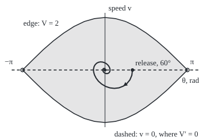
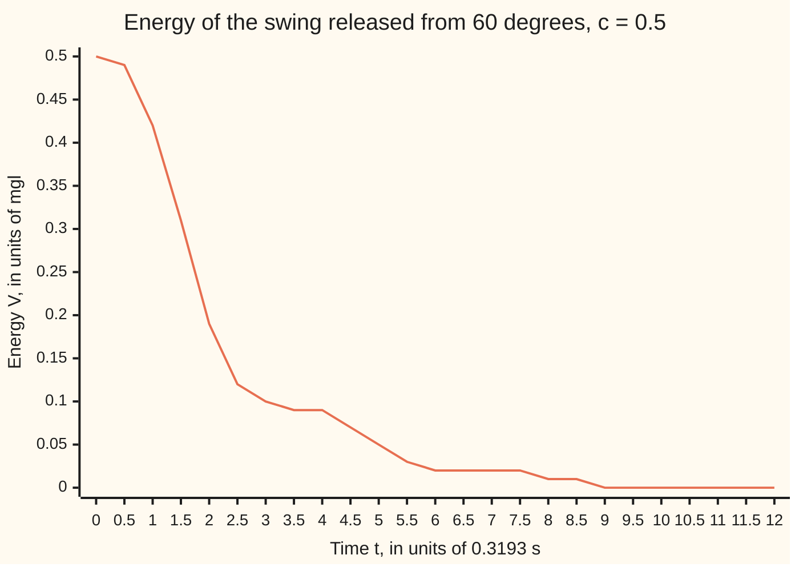

# LaSalle's principle: when the energy only pauses on a thin set, solutions still end where they can stay on it

Differential equations and dynamics → Nonlinear Dynamics in the Plane → Energy that only pauses → LaSalle's principle

---

## General Overview

A playground swing hangs from rigid rods 1 m long. Pull the seat back to 60 degrees and let go. Air and the pivots drag on it, more at higher speed. It ends hanging straight down, yet the equation of motion has no formula solution to prove it.

Energy is the natural witness: drag only takes it, so it never rises. But at the release and each turnaround the seat is still for an instant, drag does nothing, and the energy pauses. The energy test of [lyapunov-functions](04-lyapunov-functions.md) needs the energy to fall at every moment away from rest, so it gives no verdict.

The way out: a pause is not a place to stay. At a turnaround gravity still pulls the seat off. Only hanging straight down is a still position gravity leaves alone. Joseph LaSalle made this a theorem in 1960: **LaSalle's principle**.

**A trapped motion whose energy never rises ends where a whole motion could stay inside the pause set; for the swing that is hanging at rest, so every swing with less energy than upside down settles there.**

**What kind of fact this is:** a theorem, proved on this card in Why it works, the limit argument in a folded proof.

### The picture: the swing in the angle-and-speed plane

<p align="center"></p>

To scale: 45 drawing units per radian and per unit of speed, centred on hanging at rest. The spiral is the swing every 0.25 time units to t = 12. The eye holds every state with less energy than upside down, the open circles.

### The picture: the energy only pauses



The line is the energy V: steep while the seat is fast, flat near the turnarounds at t = 3.41 and 6.68, never rising.

---

## The formula

A prime means a rate, as across this wing: θ′ is how fast the angle changes, V′ how fast the energy does. From [the-nonlinear-pendulum](03-the-nonlinear-pendulum.md), with drag added:

$$\theta'' + c\,\theta' + \sin\theta = 0, \qquad v = \theta'$$

**Read it aloud:** angular acceleration is minus the sine of the angle (gravity) minus c times the speed (drag).

Time runs in units of $\sqrt{l/g}$: rod length $l$ = 1 m, gravity $g$ = 9.81 m/s^2, so one unit is 0.3193 s.

$$V(\theta, v) = \tfrac12 v^2 + 1 - \cos\theta, \qquad V' = -c\,v^2$$

**Read it aloud:** energy is motion energy plus height energy, and it drains at c times the square of the speed.

$V$ is counted in units of the seat's weight times $l$: 0 hanging at rest, 2 upside down.

**LaSalle's principle.** Let $K$ be a closed, bounded region no motion leaves once inside, with $V' \le 0$ throughout. Let $Z$ be the points of $K$ where $V' = 0$, and $M$ the largest invariant set in $Z$: every state whose whole motion, past and future, stays in $Z$. Then

$$\text{every motion starting in } K \text{ approaches } M \text{ as } t \to \infty.$$

**Read it aloud:** a trapped motion whose energy never rises ends on the pause points it could stay on for ever.

| Symbol | Plain meaning | In our example | Push it up and the answer… |
| --- | --- | --- | --- |
| $\theta$, $v$ | angle from straight down, in radians; angular speed | π/3 and 0 at release | past π, over the top |
| $t$, $l$, $g$ | time in units of √(l/g); rod length; gravity | 1 m, 9.81 m/s^2; unit 0.3193 s | longer rods, slower swings |
| $c$ | drag per unit of speed | 0.5 per time unit | faster settling; at 0, none |
| $V$, $V'$ | energy; its rate along the motion | 0.500 and 0.000 at release | above 2, the trap is lost |
| $K$ | the trap | angles within ±π, V ≤ 0.5 | same conclusion |
| $Z$, $M$ | where V′ = 0; the part a whole motion can stay on | line v = 0; point (0, 0) | a bigger M says less |
| $\lambda$ | Jacobian eigenvalues at a rest point | −0.250 ± 0.9682i at the bottom | positive: a saddle |

### When it holds

- **Drag c above 0.** At c = 0, Z is the whole trap, so M is too, and the swing turns at 60° for ever.
- **A closed, bounded trap.** Energy below 2 keeps the seat from upside down. Above 2 it may go over the top and settle in the next well, 360° round.
- **V′ ≤ 0 on the whole trap; V and the rate law with continuous slopes.** Nearby starts then give nearby motions, as Step 3 needs.
- **The conclusion is a set.** It names one end point only when M is one point.

---

## Why it works

### Step 0: a pause is not a place to stay

Energy that never rises levels off, so the late swing loses almost none. Losing none for a while means staying on the pause line v = 0, and only hanging at rest can.

### Step 1: the energy drains at c times speed squared

By the chain rule:

$$V' = \sin\theta \cdot \theta' + v \cdot v' = \sin\theta \cdot v + v(-\sin\theta - c v) = -c\,v^2.$$

Gravity's terms cancel: climbing trades motion energy for height one for one. Drag's term is zero exactly when v = 0. At release V′ = 0, yet the acceleration is −sin 60° = −0.866: the swing leaves the pause line at once.

### Step 2: the energy builds the trap

V stays at most 0.5, so 1 − cos θ ≤ 0.5: the angle stays within 60°, the speed at most 1. Upside down needs V = 2. So K, angles within ±π with V ≤ 0.5, is a closed, bounded trap, and a motion held there runs for all time.

### Step 3: the late motion lives on the pause line, for ever

V falls and stays above 0, so it tends to a limit. The states the swing returns arbitrarily close to, later and later, form the **limit set**: not empty, since the trap is bounded, with V at its limit value throughout. A motion started there copies the old one's late behaviour, so it stays there with V′ = 0: it lies in Z. So the limit set is inside M, and the swing approaches M.

<details>
<summary>Detailed proof: trapped motions approach M</summary>

Let x(t) be the motion from a start in K, and φ(s, p) the state at time s of the motion from p.

1. V(x(t)) never increases and is bounded below on K, so it tends to a limit ℓ.
2. Let Ω be the points p with x(tₙ) → p for some times tₙ → ∞. K is closed and bounded, so every sequence in it has a convergent subsequence: Ω is not empty and lies in K. By continuity V = ℓ on Ω.
3. If x(tₙ) → p, then for each real s, x(tₙ + s) = φ(s, x(tₙ)) → φ(s, p), since motions depend continuously on the start (the pendulum's slopes are bounded, so its motions run for all time, forward and back). So Ω is invariant.
4. V = ℓ along φ(s, p), so V′ = 0 there: the motion through p lies in Z. Hence Ω lies in M.
5. If x(t) stayed ε from M at times tₙ → ∞, a subsequence would converge to a point of Ω, which is in M: a contradiction.

</details>

### Step 4: only hanging at rest can stay on the pause line

A motion staying on v = 0 has θ′ = 0, so θ is constant, and v′ = −sin θ must be 0. Within ±π only θ = 0 works. So M is the point (0, 0): the swing approaches hanging at rest. With the stay-near half from [lyapunov-functions](04-lyapunov-functions.md), the bottom is **asymptotically stable**: nearby motions stay near and settle.

### Step 5: the eye is inside the basin

Only one fact about 60° was used: its energy is below 2. So every start within ±π below energy 2 ends at (0, 0). Since 1 + cos θ = 2 cos^2(θ/2), the edge V = 2 is v = ±2 cos(θ/2): the eye. It lies inside the **basin**, the starts that end at rest, but is not all of it: a push of speed 3 from the bottom, energy 4.500, loses enough to drag on the way up to fall back.

A second road: linearise at (0, 0) ([linearisation-and-the-jacobian](02-linearisation-and-the-jacobian.md)). Trace −c and determinant 1 give λ^2 + 0.5λ + 1 = 0, so λ = −0.250 ± 0.9682i. That covers only starts near rest; LaSalle covers the eye.

---

## Worked numbers, by hand

| Step | Arithmetic | Value |
| --- | --- | --- |
| release energy | 1 − cos 60° | 0.500 |
| acceleration at release | −sin 60° | −0.866 |
| widest angle, fastest speed | 1 − cos θ = 0.5; √(2 × 0.5) | 60.00°; 1.000 |
| energy upside down | 1 − cos 180° | 2.000 |
| eigenvalues at the bottom | λ^2 + 0.5λ + 1 = 0 | −0.250 ± 0.9682i |
| late shrink per half swing | e^(−0.25 × π / 0.9682) | 0.4443 |
| where it ends | M is one point | **hanging at rest, (0, 0)** |

Turnarounds fall to 25.16°, 11.07°, 4.91°, 2.18°, 0.97°: under 1° from t = 16.42, which is 5.24 s.

### What breaks if you drop a piece

| Mistake | Comes out at | What went wrong |
| --- | --- | --- |
| No drag, c = 0 | V(40) = 0.500000, turning at 59.99° | M is the whole trap |
| The strict energy test | no verdict: V′ = 0.000 at release | V′ = 0 on all of v = 0 |
| Starting upside down | stays: eigenvalues 0.781 and −1.281 | a saddle on the eye's edge |
| Eye taken as the basin | energy 4.500 settles in well 0; 6.125 in well 1 | the eye is enough, not everything |

The code prints all four.

---

## Code, from first principles, and it actually runs

Only `math` is imported. Road one steps the swing by Runge-Kutta 4 (four slope samples per step, weighted 1, 2, 2, 1; its card is on the Numerical Evolution shelf). Road two checks without stepping: energy lost must equal c times the integral of v^2 by Simpson's rule, the gap shrinking sixteenfold as the step halves, and late half swings must shrink by the eigenvalue factor. A bisection finds the widest angle.

### Python

```python
# LaSalle and the damped swing -- the check behind the card.  Only math is
# imported.  theta'' + c theta' + sin(theta) = 0, time in units of sqrt(l/g).
# Road one steps the swing by Runge-Kutta 4 and records where it ends.  Road
# two books the energy lost against c times the integral of v^2 (Simpson),
# and the late swings against the eigenvalues of the swing near the bottom.
from math import sin, cos, sqrt, pi, exp
C, TH0, T, DEG, UNIT = 0.5, pi / 3, 40.0, 180 / pi, sqrt(1 / 9.81)

def f(th, v, c): return v, -sin(th) - c * v
def energy(th, v): return 0.5 * v * v + 1 - cos(th)

def run(th, v, c, h):                    # RK4 steps; a turnaround is where v flips sign
    out, turns = [(th, v)], []
    for k in range(round(T / h)):
        a1, b1 = f(th, v, c); a2, b2 = f(th + h/2*a1, v + h/2*b1, c)
        a3, b3 = f(th + h/2*a2, v + h/2*b2, c); a4, b4 = f(th + h*a3, v + h*b3, c)
        t2, v2 = th + h/6*(a1 + 2*a2 + 2*a3 + a4), v + h/6*(b1 + 2*b2 + 2*b3 + b4)
        if v * v2 < 0: turns.append((k*h + h*v/(v - v2), th + (t2 - th)*v/(v - v2)))
        th, v = t2, v2; out.append((th, v))
    return out, turns

def lost(out, c, h):                     # c times the integral of v^2, by Simpson's rule
    w = [1] + [4 if i % 2 else 2 for i in range(1, len(out) - 1)] + [1]
    return c * h / 3 * sum(wi * v * v for wi, (_, v) in zip(w, out))

def widest(e):                           # bisection: the angle where 1 - cos(theta) = e
    lo, hi = 0.0, pi
    for _ in range(60):
        m = (lo + hi) / 2
        lo, hi = (m, hi) if 1 - cos(m) < e else (lo, m)
    return lo

E0 = energy(TH0, 0.0)
print(f"time unit {UNIT:.4f} s; release: V0 = {E0:.3f}, V' = {sin(TH0) * 0.0 + 0.0 * f(TH0, 0.0, C)[1]:.3f}, v' = {f(TH0, 0.0, C)[1]:.3f}")
print(f"trap: |theta| <= {widest(E0) * DEG:.2f} deg, |v| <= {sqrt(2 * E0):.3f}, top V(pi, 0) = {energy(pi, 0.0):.3f}")
w, s = sqrt(4 - C * C) / 2, sqrt(C * C + 4)          # bottom: trace -c, det 1; top: det -1
print(f"eigenvalues: bottom {-C / 2:.3f} +- {w:.4f}i, top {(-C + s) / 2:.3f} and {(-C - s) / 2:.3f}")
out, turns = run(TH0, 0.0, C, 0.05)
print("turnarounds (t, deg): " + ", ".join(f"({t:.2f}, {a * DEG:.2f})" for t, a in turns[:5]))
ratios = [abs(turns[i + 1][1] / turns[i][1]) for i in range(len(turns) - 1)]
pred = exp(-C / 2 * pi / w)              # linear swing: each half swing shrinks by this
print(f"half-swing ratio: first {abs(turns[0][1] / TH0):.4f}, 6th {ratios[5]:.4f}, from eigenvalues {pred:.4f}")
first = next(t for t, a in turns if abs(a) * DEG < 1)
print(f"turnarounds under 1 deg from t = {first:.2f}, which is {first * UNIT:.2f} s")
print(f"at t = 40: theta = {out[-1][0]:.6f}, v = {out[-1][1]:.6f}, widest ever {max(abs(a) for a, _ in out) * DEG:.2f} deg")
d = [E0 - energy(*o[-1]) - lost(o, C, h) for h in (0.1, 0.05) for o in [run(TH0, 0.0, C, h)[0]]]
print(f"V0 - V(40) = {E0 - energy(*out[-1]):.6f}; c * integral of v^2 = {lost(out, C, 0.05):.6f}")
print(f"bookkeeping gap in millionths: h = 0.1 {d[0] * 1e6:.3f}, h = 0.05 {d[1] * 1e6:.3f}, ratio {d[0] / d[1]:.1f}")
print("chart, V at t = 0, 0.5, ..., 12: " + ", ".join(f"{energy(*p):.2f}" for p in out[:241:10]))
print("figure, spiral x = 180 + 45 theta, y = 120 - 45 v: " + " ".join(f"{180 + 45 * a:.1f},{120 - 45 * b:.1f}" for a, b in out[:241:5]))
print("figure, eye edge v = 2 cos(theta/2), theta = -pi..pi by pi/8: " + " ".join(f"{2 * cos(k * pi / 16):.2f}" for k in range(-8, 9)))
free, free_turns = run(TH0, 0.0, 0.0, 0.05)
print(f"c = 0: V(40) = {energy(*free[-1]):.6f}, last turnaround {abs(free_turns[-1][1]) * DEG:.2f} deg")
ends = {v0: run(0.0, v0, C, 0.05)[0][-1][0] for v0 in (3.0, 3.5)}
print("push from the bottom: " + ", ".join(f"v0 = {v0:.1f} (V0 = {energy(0.0, v0):.3f}) ends in well {round(e / (2 * pi))}" for v0, e in ends.items()))
assert abs(d[1]) < 1e-6 and 12 < d[0] / d[1] < 20       # energy book balances, at RK4's order
assert abs(ratios[5] / pred - 1) < 0.01                  # late swings obey the eigenvalues
assert abs(out[-1][0]) < 1e-3 and abs(out[-1][1]) < 1e-3 and max(abs(a) for a, _ in out) <= widest(E0) + 1e-9
assert abs(energy(*free[-1]) - E0) < 1e-6 and abs(ends[3.5] - 2 * pi) < 1e-3
print("ALL CHECKS PASS")
```

**Ran 2026-09-28 on macOS, Python 3.14.6, standard library only. All checks passed. Output, pasted from the run:**

```
time unit 0.3193 s; release: V0 = 0.500, V' = 0.000, v' = -0.866
trap: |theta| <= 60.00 deg, |v| <= 1.000, top V(pi, 0) = 2.000
eigenvalues: bottom -0.250 +- 0.9682i, top 0.781 and -1.281
turnarounds (t, deg): (3.41, -25.16), (6.68, 11.07), (9.93, -4.91), (13.18, 2.18), (16.42, -0.97)
half-swing ratio: first 0.4193, 6th 0.4444, from eigenvalues 0.4443
turnarounds under 1 deg from t = 16.42, which is 5.24 s
at t = 40: theta = 0.000040, v = -0.000036, widest ever 60.00 deg
V0 - V(40) = 0.500000; c * integral of v^2 = 0.500000
bookkeeping gap in millionths: h = 0.1 -1.961, h = 0.05 -0.123, ratio 16.0
chart, V at t = 0, 0.5, ..., 12: 0.50, 0.49, 0.42, 0.31, 0.19, 0.12, 0.10, 0.09, 0.09, 0.07, 0.05, 0.03, 0.02, 0.02, 0.02, 0.02, 0.01, 0.01, 0.00, 0.00, 0.00, 0.00, 0.00, 0.00, 0.00
figure, spiral x = 180 + 45 theta, y = 120 - 45 v: 227.1,120.0 226.0,129.1 222.7,136.9 217.6,143.1 211.3,147.7 203.9,150.6 196.1,151.5 188.3,150.6 181.0,148.1 174.4,144.2 168.9,139.4 164.8,134.0 162.0,128.5 160.5,123.2 160.3,118.3 161.3,114.1 163.2,110.8 165.8,108.3 169.0,106.7 172.4,106.1 175.8,106.4 179.1,107.4 182.1,109.0 184.6,111.1 186.5,113.5 187.8,115.9 188.5,118.3 188.7,120.6 188.3,122.5 187.5,124.0 186.3,125.2 184.9,125.9 183.4,126.2 181.9,126.1 180.4,125.6 179.1,124.9 178.0,124.0 177.1,122.9 176.5,121.8 176.2,120.7 176.2,119.8 176.3,118.9 176.7,118.2 177.2,117.7 177.8,117.4 178.5,117.3 179.2,117.3 179.8,117.5 180.4,117.8
figure, eye edge v = 2 cos(theta/2), theta = -pi..pi by pi/8: 0.00 0.39 0.77 1.11 1.41 1.66 1.85 1.96 2.00 1.96 1.85 1.66 1.41 1.11 0.77 0.39 0.00
c = 0: V(40) = 0.500000, last turnaround 59.99 deg
push from the bottom: v0 = 3.0 (V0 = 4.500) ends in well 0, v0 = 3.5 (V0 = 6.125) ends in well 1
ALL CHECKS PASS
```

### Rust

Same numbers, same labels.

```rust
// LaSalle and the damped swing -- the same check as the Python, in Rust.  No
// crates.  theta'' + c theta' + sin(theta) = 0, time in units of sqrt(l/g).
// Road one steps the swing by Runge-Kutta 4 and records where it ends.  Road
// two books the energy lost against c times the integral of v^2 (Simpson),
// and the late swings against the eigenvalues of the swing near the bottom.
use std::f64::consts::PI;
const C: f64 = 0.5;
const TH0: f64 = PI / 3.0;
const T: f64 = 40.0;
const DEG: f64 = 180.0 / PI;
fn f(th: f64, v: f64, c: f64) -> (f64, f64) { (v, -th.sin() - c * v) }
fn energy(p: (f64, f64)) -> f64 { 0.5 * p.1 * p.1 + 1.0 - p.0.cos() }
type Run = (Vec<(f64, f64)>, Vec<(f64, f64)>);
fn run(mut th: f64, mut v: f64, c: f64, h: f64) -> Run {  // RK4; a turnaround is where v flips sign
    let (mut out, mut turns) = (vec![(th, v)], Vec::new());
    for k in 0..(T / h).round() as usize {
        let (a1, b1) = f(th, v, c);
        let (a2, b2) = f(th + h / 2.0 * a1, v + h / 2.0 * b1, c);
        let (a3, b3) = f(th + h / 2.0 * a2, v + h / 2.0 * b2, c);
        let (a4, b4) = f(th + h * a3, v + h * b3, c);
        let t2 = th + h / 6.0 * (a1 + 2.0 * a2 + 2.0 * a3 + a4);
        let v2 = v + h / 6.0 * (b1 + 2.0 * b2 + 2.0 * b3 + b4);
        if v * v2 < 0.0 { turns.push((k as f64 * h + h * v / (v - v2), th + (t2 - th) * v / (v - v2))); }
        th = t2; v = v2; out.push((th, v));
    }
    (out, turns)
}
fn lost(out: &[(f64, f64)], c: f64, h: f64) -> f64 {     // c times the integral of v^2, Simpson
    let n = out.len() - 1;
    let s: f64 = out.iter().enumerate()
        .map(|(i, p)| (if i == 0 || i == n { 1.0 } else if i % 2 == 1 { 4.0 } else { 2.0 }) * p.1 * p.1).sum();
    c * h / 3.0 * s
}
fn widest(e: f64) -> f64 {                                 // bisection: 1 - cos(theta) = e
    let (mut lo, mut hi) = (0.0f64, PI);
    for _ in 0..60 { let m = (lo + hi) / 2.0; if 1.0 - m.cos() < e { lo = m } else { hi = m } }
    lo
}
fn join(v: Vec<String>, sep: &str) -> String { v.join(sep) }
fn main() {
    let (e0, unit) = (energy((TH0, 0.0)), (1.0f64 / 9.81).sqrt());
    println!("time unit {:.4} s; release: V0 = {:.3}, V' = {:.3}, v' = {:.3}", unit, e0, TH0.sin() * 0.0 + 0.0 * f(TH0, 0.0, C).1, f(TH0, 0.0, C).1);
    println!("trap: |theta| <= {:.2} deg, |v| <= {:.3}, top V(pi, 0) = {:.3}", widest(e0) * DEG, (2.0 * e0).sqrt(), energy((PI, 0.0)));
    let (w, s) = ((4.0 - C * C).sqrt() / 2.0, (C * C + 4.0).sqrt());  // bottom: det 1; top: det -1
    println!("eigenvalues: bottom {:.3} +- {:.4}i, top {:.3} and {:.3}", -C / 2.0, w, (-C + s) / 2.0, (-C - s) / 2.0);
    let (out, turns) = run(TH0, 0.0, C, 0.05);
    println!("turnarounds (t, deg): {}", join(turns[..5].iter().map(|(t, a)| format!("({:.2}, {:.2})", t, a * DEG)).collect(), ", "));
    let ratios: Vec<f64> = (0..turns.len() - 1).map(|i| (turns[i + 1].1 / turns[i].1).abs()).collect();
    let pred = (-C / 2.0 * PI / w).exp();                  // linear swing: shrink per half swing
    println!("half-swing ratio: first {:.4}, 6th {:.4}, from eigenvalues {:.4}", (turns[0].1 / TH0).abs(), ratios[5], pred);
    let first = turns.iter().find(|(_, a)| a.abs() * DEG < 1.0).unwrap().0;
    println!("turnarounds under 1 deg from t = {:.2}, which is {:.2} s", first, first * unit);
    let end = out[out.len() - 1];
    let widest_seen = out.iter().map(|p| p.0.abs()).fold(0.0, f64::max);
    println!("at t = 40: theta = {:.6}, v = {:.6}, widest ever {:.2} deg", end.0, end.1, widest_seen * DEG);
    let d: Vec<f64> = [0.1, 0.05].iter().map(|&h| { let o = run(TH0, 0.0, C, h).0; e0 - energy(o[o.len() - 1]) - lost(&o, C, h) }).collect();
    println!("V0 - V(40) = {:.6}; c * integral of v^2 = {:.6}", e0 - energy(end), lost(&out, C, 0.05));
    println!("bookkeeping gap in millionths: h = 0.1 {:.3}, h = 0.05 {:.3}, ratio {:.1}", d[0] * 1e6, d[1] * 1e6, d[0] / d[1]);
    println!("chart, V at t = 0, 0.5, ..., 12: {}", join(out[..241].iter().step_by(10).map(|&p| format!("{:.2}", energy(p))).collect(), ", "));
    let fg = out[..241].iter().step_by(5).map(|p| format!("{:.1},{:.1}", 180.0 + 45.0 * p.0, 120.0 - 45.0 * p.1)).collect();
    println!("figure, spiral x = 180 + 45 theta, y = 120 - 45 v: {}", join(fg, " "));
    let eye = (-8..=8).map(|k| format!("{:.2}", 2.0 * (k as f64 * PI / 16.0).cos())).collect();
    println!("figure, eye edge v = 2 cos(theta/2), theta = -pi..pi by pi/8: {}", join(eye, " "));
    let (free, free_turns) = run(TH0, 0.0, 0.0, 0.05);
    let fend = free[free.len() - 1];
    println!("c = 0: V(40) = {:.6}, last turnaround {:.2} deg", energy(fend), free_turns[free_turns.len() - 1].1.abs() * DEG);
    let ends: Vec<f64> = [3.0, 3.5].iter().map(|&v0| { let o = run(0.0, v0, C, 0.05).0; o[o.len() - 1].0 }).collect();
    let pl = [3.0f64, 3.5].iter().zip(&ends).map(|(v0, e)| format!("v0 = {:.1} (V0 = {:.3}) ends in well {}", v0, energy((0.0, *v0)), (e / (2.0 * PI)).round() as i64)).collect();
    println!("push from the bottom: {}", join(pl, ", "));
    assert!(d[1].abs() < 1e-6 && 12.0 < d[0] / d[1] && d[0] / d[1] < 20.0);   // book balances, RK4 order
    assert!((ratios[5] / pred - 1.0).abs() < 0.01);                          // late swings obey eigenvalues
    assert!(end.0.abs() < 1e-3 && end.1.abs() < 1e-3 && widest_seen <= widest(e0) + 1e-9);
    assert!((energy(fend) - e0).abs() < 1e-6 && (ends[1] - 2.0 * PI).abs() < 1e-3);
    println!("ALL CHECKS PASS");
}
```

**Ran 2026-09-28 on macOS, rustc 1.98.1, no crates. All checks passed. Output, pasted from the run:**

```
time unit 0.3193 s; release: V0 = 0.500, V' = 0.000, v' = -0.866
trap: |theta| <= 60.00 deg, |v| <= 1.000, top V(pi, 0) = 2.000
eigenvalues: bottom -0.250 +- 0.9682i, top 0.781 and -1.281
turnarounds (t, deg): (3.41, -25.16), (6.68, 11.07), (9.93, -4.91), (13.18, 2.18), (16.42, -0.97)
half-swing ratio: first 0.4193, 6th 0.4444, from eigenvalues 0.4443
turnarounds under 1 deg from t = 16.42, which is 5.24 s
at t = 40: theta = 0.000040, v = -0.000036, widest ever 60.00 deg
V0 - V(40) = 0.500000; c * integral of v^2 = 0.500000
bookkeeping gap in millionths: h = 0.1 -1.961, h = 0.05 -0.123, ratio 16.0
chart, V at t = 0, 0.5, ..., 12: 0.50, 0.49, 0.42, 0.31, 0.19, 0.12, 0.10, 0.09, 0.09, 0.07, 0.05, 0.03, 0.02, 0.02, 0.02, 0.02, 0.01, 0.01, 0.00, 0.00, 0.00, 0.00, 0.00, 0.00, 0.00
figure, spiral x = 180 + 45 theta, y = 120 - 45 v: 227.1,120.0 226.0,129.1 222.7,136.9 217.6,143.1 211.3,147.7 203.9,150.6 196.1,151.5 188.3,150.6 181.0,148.1 174.4,144.2 168.9,139.4 164.8,134.0 162.0,128.5 160.5,123.2 160.3,118.3 161.3,114.1 163.2,110.8 165.8,108.3 169.0,106.7 172.4,106.1 175.8,106.4 179.1,107.4 182.1,109.0 184.6,111.1 186.5,113.5 187.8,115.9 188.5,118.3 188.7,120.6 188.3,122.5 187.5,124.0 186.3,125.2 184.9,125.9 183.4,126.2 181.9,126.1 180.4,125.6 179.1,124.9 178.0,124.0 177.1,122.9 176.5,121.8 176.2,120.7 176.2,119.8 176.3,118.9 176.7,118.2 177.2,117.7 177.8,117.4 178.5,117.3 179.2,117.3 179.8,117.5 180.4,117.8
figure, eye edge v = 2 cos(theta/2), theta = -pi..pi by pi/8: 0.00 0.39 0.77 1.11 1.41 1.66 1.85 1.96 2.00 1.96 1.85 1.66 1.41 1.11 0.77 0.39 0.00
c = 0: V(40) = 0.500000, last turnaround 59.99 deg
push from the bottom: v0 = 3.0 (V0 = 4.500) ends in well 0, v0 = 3.5 (V0 = 6.125) ends in well 1
ALL CHECKS PASS
```

The two outputs match line for line.

> [!TIP]
> **Try changing**
> Guess first, then run it.
> - **Double the drag.** `C` to `1.0`: under 1° from t = 11.11 (3.55 s), late shrink 0.1630. The push of 3.5 falls back to well 0, so the last assert fails.
> - **Release from 170°.** `TH0` to `170 * pi / 180`: energy 1.985, under 2, so all checks pass; under 1° from t = 22.59.
> - **No drag.** `C` to `0.0`: turnarounds stay at 59.99°, and the search for one under 1° stops the program.

---

## The usual mistake

> [!warning]
> **Treating a zero energy rate as a resting place.** At the release V′ = 0, yet the acceleration is −0.866. The pause set, the line v = 0, is far bigger than where a motion can stay, one point. LaSalle's principle is the step between them.
>
> - **Forgetting the trap.** Energy 6.125 ends in well 1, 360° round.
> - **Taking the eye for the basin.** Energy 4.500 still settles in well 0.
> - **Claiming a speed.** LaSalle says where, not how fast; the shrink of 0.4443 per late half swing is the eigenvalues' work.

---

## Where you meet it in real life

- **Power grids.** A generator's rotor angle obeys this law, the swing equation; an eye-like energy region bounds the fault it survives.
- **Robot arms.** Drag added through velocity alone gives an energy rate like −c v^2; the settling proof is this card's.
- **Checking a simulation.** Energy lost must equal the drag integral: 0.500000 against 0.500000 here.
- **Limit sets.** Step 3's limit set is what [poincare-bendixson-and-bendixsons-criterion](09-poincare-bendixson-and-bendixsons-criterion.md) classifies; a closed loop, as in [limit-cycles-and-van-der-pol](08-limit-cycles-and-van-der-pol.md), can be one.

> **Say it back**
> The swing's energy drains at c times speed squared: it never rises, but pauses at each turnaround. Below the energy of upside down, the swing is trapped. Its late motion loses no energy, so it lies on the pause line for all time. Only hanging at rest can, so the swing ends there, as does every start in the eye.

---

## What this builds on

- [lyapunov-functions](04-lyapunov-functions.md): the energy test, and the stay-near half of the conclusion.
- [the-nonlinear-pendulum](03-the-nonlinear-pendulum.md): the equation of motion, its time unit, its energy and its rest points.

## Where this goes next

- passivity-and-absolute-stability: systems that only store or burn energy, and feedback proved stable by the same pause-set argument.

Physics handed the swing its energy function; for a controller or a circuit with no obvious energy, the open question is how to build one whose rate is never positive, and passivity supplies it.

---

## Sources

Verified 2026-09-28: every link below resolves to the publisher's page.

- LaSalle, J. "Some Extensions of Liapunov's Second Method." *IRE Transactions on Circuit Theory* 7, no. 4 (1960): 520–527. [doi:10.1109/TCT.1960.1086720](https://doi.org/10.1109/TCT.1960.1086720). The invariance principle, first stated.
- Teschl, Gerald. *Ordinary Differential Equations and Dynamical Systems*. AMS Graduate Studies in Mathematics 140. [Author's page with the free text](https://www.mat.univie.ac.at/~gerald/ftp/book-ode/). Theorems 6.14 and 6.15 prove the Krasovskii–LaSalle principle; the pendulum with friction is Problem 6.26.
- Strogatz, Steven H. *Nonlinear Dynamics and Chaos*, 3rd ed. CRC Press. [Publisher page](https://www.routledge.com/Nonlinear-Dynamics-and-Chaos-With-Applications-to-Physics-Biology-Chemistry-and-Engineering/Strogatz/p/book/9780367026509). The pendulum's phase plane.
