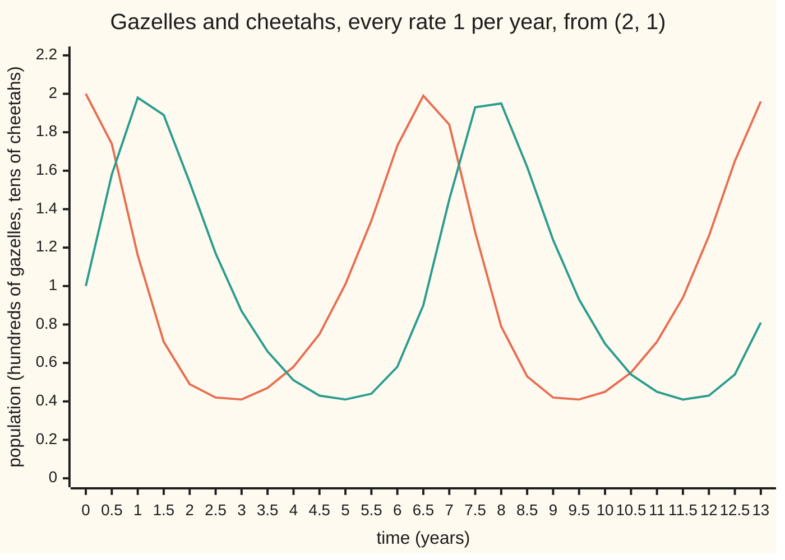
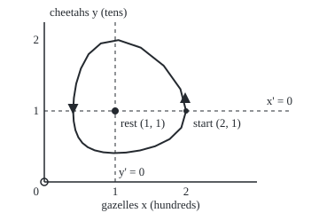

# Predator and prey: two populations chase each other in cycles that never die out

[Syllabus](../../../SYLLABUS.md) → [Differential equations and dynamics](../../../SYLLABUS.md#w08) → [Nonlinear Dynamics in the Plane](../../../SYLLABUS.md#w08-s06) → Predator and prey

---

## General Overview

A fenced reserve holds 200 gazelles and 10 cheetahs. Gazelles breed on open grass. Cheetahs live only by catching gazelles.

Well-fed cheetahs multiply. More cheetahs catch more gazelles, so the herd shrinks. Hungry cheetahs die back. Then the herd recovers, and the story repeats.

The Lotka-Volterra model turns that story into two rate laws, one per species. The herd swings between about 41 and 200 gazelles, the cheetahs between about 4 and 20. One lap takes 6.61 years and ends at the same 200 and 10, every time. Averaged over a lap, the reserve holds exactly 100 gazelles and 10 cheetahs.

**A hidden quantity stays fixed along every path, so predator and prey ride a closed loop forever, and their averages over a lap equal the balance point.**

**What kind of fact this is:** a model, catching the lag between prey and predator peaks but not real counts; the fixed quantity, loops and averages are theorems about it, proved in Why it works.

### The picture: two counts that rise and fall, the cheetahs a year behind



Orange: gazelles, in hundreds. Green: cheetahs, in tens. The cheetahs peak at 2 about a year after the gazelles; the troughs, 0.41 each, fall near years 3 and 5.

---

## The formula

As in [Phase portraits and nullclines](01-phase-portraits-and-nullclines.md), $x'$ is the rate of $x$, and paths live in the plane of the two populations. The Lotka-Volterra system is

$$x' = a\,x - b\,x\,y, \qquad y' = -c\,y + d\,x\,y .$$

**Read it aloud:** gazelles breed in proportion to their number and are eaten in proportion to meetings with cheetahs; cheetahs die in proportion to their number and are born in proportion to those meetings.

On this card every rate is 1, so the laws are $x' = x - xy$ and $y' = -y + xy$, from $x$ = 2, $y$ = 1. The quantity that never changes is

$$H = x - \ln x + y - \ln y, \qquad H(2, 1) = 3 - \ln 2 = 2.306853 .$$

**Read it aloud:** each count minus its logarithm, added; the sum stays at 2.31 forever.

| Symbol | Plain meaning | In our example | Push it up and the answer… |
| --- | --- | --- | --- |
| $x$ | gazelles, in hundreds | 2 at the start | cheetahs breed faster |
| $y$ | cheetahs, in tens | 1 at the start | gazelles die faster |
| $a$, $c$ | gazelle birth rate; cheetah death rate, per year | 1, 1 | larger $c$: more gazelles at balance |
| $b$, $d$ | per-meeting rates: gazelles lost, cheetahs born | 1, 1 | larger $b$: fewer cheetahs at balance |
| $H$, $g$ | the fixed quantity; $g(u) = u - \ln u$, one half of it | $H$ = 2.306853 | a wider loop |
| $T$ | one lap, the period | 6.6085 years | — |
| $\lambda$ | an eigenvalue of the Jacobian at a rest | ±1 at (0, 0); ±i at (1, 1) | — |

With general rates the balance point is $x$ = $c/d$, $y$ = $a/b$, and the fixed quantity is $d\,x - c \ln x + b\,y - a \ln y$. Here the balance is (1, 1): 100 gazelles, 10 cheetahs.

### When it holds

- **Gazelles breed without limit when alone.** Cap the herd, as grass would, and the loops become spirals into a rest (What breaks).
- **Kills scale with both counts.** Sated cheetahs break the product term, and cycles can grow or shrink.
- **Fixed rates, no seasons.** A dry season makes $a$ vary, and $H$ is no longer fixed.
- **Large, smooth counts.** A trough of about 4 cheetahs could lose the species; the model always recovers.

---

## Why it works

### Step 0: remove time, and a fixed quantity appears

Divide one rate law by the other and the clock cancels. What is left integrates to a quantity no path can change, and its level curves are closed loops.

### Step 1: find the rests

A rest is a state where both rates are zero. $x(1 - y)$ = 0 and $y(x - 1)$ = 0 hold together only at (0, 0), the empty reserve, and at (1, 1), the balance point. The nullclines (lines where one rate is zero), $y$ = 1 and $x$ = 1, cut the quarter plane into four boxes whose arrows turn anticlockwise round (1, 1).

### Step 2: linearise at each rest

By [Linearisation](02-linearisation-and-the-jacobian.md), the Jacobian (the table of partial derivatives of the two rates) is $\begin{pmatrix} 1 - y & -x \\ y & x - 1 \end{pmatrix}$.

At (0, 0) it is $\begin{pmatrix} 1 & 0 \\ 0 & -1 \end{pmatrix}$, with $\lambda$ = +1 and −1: a saddle.

At (1, 1) it is $\begin{pmatrix} 0 & -1 \\ 1 & 0 \end{pmatrix}$, with $\lambda$ = ±i: a linear centre, small paths circling once every 2π = 6.2832 years. Linearisation cannot settle a centre, since a nonlinear term can make it a slow spiral. Step 3 settles it.

### Step 3: the fixed quantity

Along a path, cheetahs change per gazelle at the ratio of the rates, $y(x - 1)$ over $x(1 - y)$. Put each letter on its own side: $(1 - y)/y$ per unit of $y$ matches $(x - 1)/x$ per unit of $x$. Integrate: $\ln y - y$ equals $x - \ln x$ plus a constant. So $H$ is constant.

Directly, by the chain rule the rate of $H$ is $(1 - 1/x)\,x' + (1 - 1/y)\,y'$ = $(x - 1)(1 - y) + (y - 1)(x - 1)$ = 0.

### Step 4: the paths are closed loops

$H$ is $g(x) + g(y)$. The function $g$ is a bowl: its slope $1 - 1/u$ is negative below 1 and positive above, its lowest value is 1, and it climbs without bound at both ends. So $H$ is a bowl with its bottom, 2, at (1, 1).

The start sits at height 2.306853. The contour there is a closed loop round (1, 1), and the path must stay on it. The loop holds no rest, so the path never stops and comes back to (2, 1). One path runs through each point, so it then repeats exactly.

On the line $y$ = 1 the loop meets $g(x)$ = 1.306853 at $x$ = 0.406376 and $x$ = 2. $H$ is symmetric, so the cheetahs span the same range.

<details>
<summary>Detailed proof: every contour above the bottom is one closed loop, and the path goes round it</summary>

Fix a height h > 2. Since g falls strictly on (0, 1), rises strictly on (1, ∞) and runs to infinity at both ends, each x with g(x) < h − 1 has exactly two y with g(y) = h − g(x), one either side of 1; they merge at y = 1 where g(x) = h − 1. So the contour is two branches over one closed interval of x, joined at its ends: one closed curve, clear of both axes.

No rest lies on it, so the speed there has a positive minimum m, and the curve has finite length L. A path on it stays on it and moves one way round, since reversing needs a rest. It returns to its start within time L/m and, by uniqueness of solutions, repeats.

</details>

### Step 5: the averages are the balance point

Divide the gazelle law by $x$: the rate of $\ln x$ is $1 - y$. Integrate over one lap of length $T$. The left side, the change in $\ln x$ over a lap, is zero. The right side is $T$ minus the area under the cheetah curve. So that area is $T$: the cheetahs average exactly 1. The rate of $\ln y$ is $x - 1$, which gives the gazelles an average of 1 the same way.

With general rates the averages are $c/d$ gazelles and $a/b$ cheetahs: the balance point, whatever the loop's size.

### Step 6: bigger loops take longer

Near (1, 1) the loops are small circles with period 2π = 6.2832 years. The loop through (2, 1) takes 6.6085 years.

A second road: in the coordinates $\ln x$ and $\ln y$ the system becomes a frictionless oscillator with $H$ as its energy, the picture of [The pendulum](03-the-nonlinear-pendulum.md).

### The picture: the loop through (2, 1), with the nullclines

<p align="center"></p>

Scale: 80 units per hundred gazelles across and per ten cheetahs up. The loop is plotted at 24 equal times over one lap. Dashed: the nullclines. Filled dot: the balance point; open dot: the saddle.

---

## Worked numbers, by hand

| Step | Arithmetic | Value |
| --- | --- | --- |
| rates at the start | $x'$ = 2 − 2 × 1; $y'$ = −1 + 2 × 1 | 0 and +1 per year |
| fixed quantity at the start | 2 − ln 2 + 1 − ln 1 = 3 − 0.693147 | 2.306853 |
| the loop on the line $y$ = 1 | $g(x)$ = 2.306853 − 1 | 1.306853 |
| the trough | $g(0.406376)$ = 0.406376 − ln 0.406376 = 0.406376 + 0.900477 | 1.306853 |
| this lap | stepped by Runge-Kutta 4 | 6.6085 years |
| average over a lap | Step 5 | **1 each: 100 gazelles, 10 cheetahs** |

### What breaks if you drop a piece

| Mistake | Comes out at | What went wrong |
| --- | --- | --- |
| Euler steps (plain slope steps), 20 years | $H$ = 3.9123 at h = 0.1, 2.3728 at h = 0.01, not 2.3069 | each step leaves the loop outward |
| Gazelles capped at 5 (hundreds) | (0.9953, 0.7871) after 40 years, nearing (1, 0.8) | unlimited breeding dropped: the cycles die |
| Average taken as mid of peak and trough | 1.2032 | the herd lingers near its trough |
| Small-swing period for this lap | 6.2832 years, not 6.6085 | holds only for small loops |

---

## Code, from first principles, and it actually runs

Two roads reach the loop. Road one uses only $H$: bisection (halving an interval until it pins a root) solves $g(u)$ = 1.306853 for trough and peak. Road two never uses $H$: it steps the rate laws with Runge-Kutta 4, the four-slope rule from the Numerical Evolution shelf, and reads off the extremes, the lap time and the averages. The checks also show the drift in $H$ falling sixteenfold per halved step, as a fourth-order rule should.

### Python

```python
# Predator and prey -- the check behind the card.  Gazelles x (hundreds), cheetahs y (tens), years,
# every rate 1: x' = x - x y, y' = -y + x y, from (2, 1).  Road one reads the orbit off the conserved
# quantity H = x - ln x + y - ln y; road two steps the equations by Runge-Kutta 4, never using H.
from math import log, sqrt, pi
def lv(x, y): return (x - x * y, -y + x * y)               # the rate law
def ad(s, k, c): return (s[0] + c * k[0], s[1] + c * k[1])
def rk4(g, s, h):                                          # one Runge-Kutta 4 step
    k1 = g(*s); k2 = g(*ad(s, k1, h / 2)); k3 = g(*ad(s, k2, h / 2)); k4 = g(*ad(s, k3, h))
    return ad(s, [k1[i] + 2 * k2[i] + 2 * k3[i] + k4[i] for i in (0, 1)], h / 6)
def euler(g, s, h): return ad(s, g(*s), h)                 # one plain step along the slope
def run(g, s, h, n, step=rk4):
    out = [s]
    for _ in range(n): s = step(g, s, h); out.append(s)
    return out
def H(x, y): return x - log(x) + y - log(y)                # the conserved quantity
def bisect(fn, a, b):                                      # root of fn between a and b
    for _ in range(200): m = (a + b) / 2; a, b = (m, b) if (fn(a) > 0) == (fn(m) > 0) else (a, m)
    return (a + b) / 2
def period(s, h=0.001):                                    # time until y next climbs back through its start
    t, p, q = 0.0, s, rk4(lv, s, h)
    while not (t > 1 and p[1] < s[1] <= q[1]): t, p, q = t + h, q, rk4(lv, q, h)
    return t + h * (s[1] - p[1]) / (q[1] - p[1])
def jac(x, y, d=1e-6):                                     # Jacobian by differences
    a, b = lv(x + d, y), lv(x - d, y); c, e = lv(x, y + d), lv(x, y - d)
    return [[(a[0] - b[0]) / (2 * d), (c[0] - e[0]) / (2 * d)], [(a[1] - b[1]) / (2 * d), (c[1] - e[1]) / (2 * d)]]
def eig(J):                                                 # from trace and determinant
    tr, det = J[0][0] + J[1][1], J[0][0] * J[1][1] - J[0][1] * J[1][0]; disc = tr * tr / 4 - det
    if disc >= 0: return f"{tr / 2 + sqrt(disc):+.4f}, {tr / 2 - sqrt(disc):+.4f}"
    return f"{tr / 2:+.4f} +/- {sqrt(-disc):.4f}i"
def row(v, fmt=".2f"): return " ".join(format(u, fmt) for u in v)
H0 = H(2, 1); lvl = lambda u: u - log(u) - (H0 - 1)       # the level curve on the line y = 1
lo, hi = bisect(lvl, 1e-9, 1), bisect(lvl, 1, 10)
T, Ts = period((2, 1)), period((1.01, 1)); orb = run(lv, (2, 1), T / 4800, 4800)[:-1]
xs, ys = [p[0] for p in orb], [p[1] for p in orb]; J1 = jac(1, 1); w = sqrt(J1[0][0] * J1[1][1] - J1[0][1] * J1[1][0])
drift = [max(abs(H(*p) - H0) for p in run(lv, (2, 1), h, round(T / h))) for h in (0.1, 0.05, 0.025)]
tl = run(lv, (2, 1), 0.005, 2600)[::100]; eu = [H(*run(lv, (2, 1), h, round(20 / h), euler)[-1]) for h in (0.1, 0.01)]
cap = run(lambda x, y: (x * (1 - x / 5) - x * y, -y + x * y), (2, 1), 0.01, 4000)[-1]
print("gazelles x (hundreds), cheetahs y (tens), years: x' = x - xy, y' = -y + xy, start (2, 1)")
print(f"rests: rates at (0, 0) = {row(lv(0, 0))}, at (1, 1) = {row(lv(1, 1))}")
print(f"Jacobian at (0, 0): {row(jac(0, 0)[0], '.4f')} / {row(jac(0, 0)[1], '.4f')}; eigenvalues {eig(jac(0, 0))}: a saddle")
print(f"Jacobian at (1, 1): {row(J1[0], '.4f')} / {row(J1[1], '.4f')}; eigenvalues {eig(J1)}: a linear centre, period 2 pi / {w:.4f} = {2 * pi / w:.4f}")
print(f"conserved: H(2, 1) = 3 - ln 2 = {H0:.6f}; H(1, 1) = {H(1, 1):.6f}, the lowest value")
print(f"road 1, level curve u - ln u = {H0 - 1:.6f} by bisection: from {lo:.6f} to {hi:.6f} for each population; minus ln there {-log(lo):.6f}, {-log(hi):.6f}")
print(f"road 2, RK4 over one lap: x from {min(xs):.6f} to {max(xs):.6f}, y from {min(ys):.6f} to {max(ys):.6f}; period {T:.4f} years")
print(f"averages over one lap: gazelles {sum(xs) / len(xs):.6f}, cheetahs {sum(ys) / len(ys):.6f}")
print(f"small swing from (1.01, 1): period {Ts:.4f} years, against 2 pi = {2 * pi:.4f}")
print(f"RK4 largest drift in H over one lap, in billionths, h = 0.1, 0.05, 0.025: {row(d * 1e9 for d in drift)}; ratios {drift[0] / drift[1]:.1f}, {drift[1] / drift[2]:.1f}")
print("chart, gazelles, years 0 to 13 by 0.5:", row(p[0] for p in tl))
print("chart, cheetahs, years 0 to 13 by 0.5:", row(p[1] for p in tl))
print(f"mistake 1, Euler steps for 20 years: H ends at {eu[0]:.4f} (h = 0.1) and {eu[1]:.4f} (h = 0.01), not {H0:.4f}")
print(f"mistake 2, gazelles capped at 5 (hundreds): after 40 years ({cap[0]:.4f}, {cap[1]:.4f}), closing on the rest (1, 0.8)")
print(f"mistake 3, midpoint of peak and trough {(lo + hi) / 2:.4f}, not the average 1; small-swing period {2 * pi:.4f} for this lap, not {T:.4f}")
X, Y = (lambda x: 50 + 80 * x), (lambda y: 205 - 80 * y)   # 80 units per hundred gazelles and per ten cheetahs
print(f"figure, origin ({X(0):.1f}, {Y(0):.1f}); rest (1, 1) at ({X(1):.1f}, {Y(1):.1f}); start (2, 1) at ({X(2):.1f}, {Y(1):.1f})")
print("figure, orbit:", " ".join(f"{X(p[0]):.1f},{Y(p[1]):.1f}" for p in orb[::200]))
assert abs(min(xs) - lo) < 1e-6 and abs(max(ys) - hi) < 1e-6    # road 2 lands on road 1's curve
assert abs(sum(xs) / len(xs) - 1) < 1e-6 and abs(sum(ys) / len(ys) - 1) < 1e-6   # averages proved to be 1
assert abs(Ts - 2 * pi / w) < 1e-3                                # small laps take the Jacobian's period
assert 12 < drift[0] / drift[1] < 20                              # RK4 error falls at order four
print("ALL CHECKS PASS")
```

**Ran 2026-09-28 on macOS, Python 3.14.6, standard library only. All checks passed. Output, pasted from the run:**

```
gazelles x (hundreds), cheetahs y (tens), years: x' = x - xy, y' = -y + xy, start (2, 1)
rests: rates at (0, 0) = 0.00 0.00, at (1, 1) = 0.00 0.00
Jacobian at (0, 0): 1.0000 0.0000 / 0.0000 -1.0000; eigenvalues +1.0000, -1.0000: a saddle
Jacobian at (1, 1): 0.0000 -1.0000 / 1.0000 0.0000; eigenvalues +0.0000 +/- 1.0000i: a linear centre, period 2 pi / 1.0000 = 6.2832
conserved: H(2, 1) = 3 - ln 2 = 2.306853; H(1, 1) = 2.000000, the lowest value
road 1, level curve u - ln u = 1.306853 by bisection: from 0.406376 to 2.000000 for each population; minus ln there 0.900477, -0.693147
road 2, RK4 over one lap: x from 0.406376 to 2.000000, y from 0.406376 to 2.000000; period 6.6085 years
averages over one lap: gazelles 1.000000, cheetahs 1.000000
small swing from (1.01, 1): period 6.2832 years, against 2 pi = 6.2832
RK4 largest drift in H over one lap, in billionths, h = 0.1, 0.05, 0.025: 1231.69 75.20 4.66; ratios 16.4, 16.1
chart, gazelles, years 0 to 13 by 0.5: 2.00 1.74 1.16 0.71 0.49 0.42 0.41 0.47 0.58 0.75 1.01 1.34 1.73 1.99 1.84 1.28 0.79 0.53 0.42 0.41 0.45 0.55 0.71 0.94 1.26 1.65 1.96
chart, cheetahs, years 0 to 13 by 0.5: 1.00 1.58 1.98 1.89 1.54 1.17 0.87 0.66 0.51 0.43 0.41 0.44 0.58 0.90 1.45 1.93 1.95 1.62 1.24 0.93 0.70 0.54 0.45 0.41 0.43 0.54 0.81
mistake 1, Euler steps for 20 years: H ends at 3.9123 (h = 0.1) and 2.3728 (h = 0.01), not 2.3069
mistake 2, gazelles capped at 5 (hundreds): after 40 years (0.9953, 0.7871), closing on the rest (1, 0.8)
mistake 3, midpoint of peak and trough 1.2032, not the average 1; small-swing period 6.2832 for this lap, not 6.6085
figure, origin (50.0, 205.0); rest (1, 1) at (130.0, 125.0); start (2, 1) at (210.0, 125.0)
figure, orbit: 210.0,125.0 203.6,100.4 184.8,74.1 158.9,53.7 133.7,45.2 113.8,48.9 100.0,61.0 91.3,77.2 86.0,94.3 83.4,110.3 82.5,124.5 83.2,136.6 85.1,146.6 88.4,154.7 93.0,161.1 99.1,165.9 106.9,169.4 116.6,171.6 128.4,172.5 142.2,171.9 158.0,169.5 175.0,164.8 191.5,156.7 204.6,143.9
ALL CHECKS PASS
```

### Rust

Same numbers, same labels, built with `rustc --edition 2021 -O`.

```rust
// Predator and prey -- the same check as the Python, in Rust, no crates.  Gazelles x (hundreds),
// cheetahs y (tens), years, every rate 1: x' = x - x y, y' = -y + x y, from (2, 1).  Road one reads
// the orbit off H = x - ln x + y - ln y; road two steps the equations by Runge-Kutta 4, never using H.
use std::f64::consts::PI;
type P = (f64, f64);
fn lv(x: f64, y: f64) -> P { (x - x * y, -y + x * y) }             // the rate law
fn ad(s: P, k: P, c: f64) -> P { (s.0 + c * k.0, s.1 + c * k.1) }
fn rk4(g: &dyn Fn(f64, f64) -> P, s: P, h: f64) -> P {            // one Runge-Kutta 4 step
    let k1 = g(s.0, s.1); let a = ad(s, k1, h / 2.0); let k2 = g(a.0, a.1);
    let b = ad(s, k2, h / 2.0); let k3 = g(b.0, b.1); let c = ad(s, k3, h); let k4 = g(c.0, c.1);
    ad(s, (k1.0 + 2.0 * k2.0 + 2.0 * k3.0 + k4.0, k1.1 + 2.0 * k2.1 + 2.0 * k3.1 + k4.1), h / 6.0)
}
fn euler(g: &dyn Fn(f64, f64) -> P, s: P, h: f64) -> P { ad(s, g(s.0, s.1), h) }
type Step = fn(&dyn Fn(f64, f64) -> P, P, f64) -> P;
fn run(g: &dyn Fn(f64, f64) -> P, s: P, h: f64, n: usize, step: Step) -> Vec<P> {
    let mut out = vec![s];
    for _ in 0..n { let q = step(g, *out.last().unwrap(), h); out.push(q) }
    out
}
fn hh(x: f64, y: f64) -> f64 { x - x.ln() + y - y.ln() }          // the conserved quantity
fn bisect(f: &dyn Fn(f64) -> f64, mut a: f64, mut b: f64) -> f64 {  // root of f between a and b
    for _ in 0..200 { let m = (a + b) / 2.0; if (f(a) > 0.0) == (f(m) > 0.0) { a = m } else { b = m } }
    (a + b) / 2.0
}
fn period(s: P) -> f64 {                                           // time until y next climbs back through its start
    let h = 0.001; let (mut t, mut p, mut q) = (0.0, s, rk4(&lv, s, h));
    while !(t > 1.0 && p.1 < s.1 && s.1 <= q.1) { t += h; p = q; q = rk4(&lv, q, h) }
    t + h * (s.1 - p.1) / (q.1 - p.1)
}
fn jac(x: f64, y: f64) -> [[f64; 2]; 2] {                          // Jacobian by differences
    let d = 1e-6; let (a, b, c, e) = (lv(x + d, y), lv(x - d, y), lv(x, y + d), lv(x, y - d));
    [[(a.0 - b.0) / (2.0 * d), (c.0 - e.0) / (2.0 * d)], [(a.1 - b.1) / (2.0 * d), (c.1 - e.1) / (2.0 * d)]]
}
fn eig(j: [[f64; 2]; 2]) -> String {                               // from trace and determinant
    let (tr, det) = (j[0][0] + j[1][1], j[0][0] * j[1][1] - j[0][1] * j[1][0]); let disc = tr * tr / 4.0 - det;
    if disc >= 0.0 { format!("{:+.4}, {:+.4}", tr / 2.0 + disc.sqrt(), tr / 2.0 - disc.sqrt()) }
    else { format!("{:+.4} +/- {:.4}i", tr / 2.0, (-disc).sqrt()) }
}
fn row(v: &[f64], p: usize) -> String { v.iter().map(|u| format!("{:.*}", p, u)).collect::<Vec<_>>().join(" ") }
fn main() {
    let h0 = hh(2.0, 1.0); let lvl = |u: f64| u - u.ln() - (h0 - 1.0);   // the level curve on the line y = 1
    let (lo, hi) = (bisect(&lvl, 1e-9, 1.0), bisect(&lvl, 1.0, 10.0));
    let (t, ts) = (period((2.0, 1.0)), period((1.01, 1.0)));
    let mut orb = run(&lv, (2.0, 1.0), t / 4800.0, 4800, rk4); orb.pop();
    let xs: Vec<f64> = orb.iter().map(|p| p.0).collect(); let ys: Vec<f64> = orb.iter().map(|p| p.1).collect();
    let mn = |v: &[f64]| v.iter().cloned().fold(f64::MAX, f64::min); let mx = |v: &[f64]| v.iter().cloned().fold(f64::MIN, f64::max);
    let avg = |v: &[f64]| v.iter().sum::<f64>() / v.len() as f64;
    let (j0, j1) = (jac(0.0, 0.0), jac(1.0, 1.0)); let w = (j1[0][0] * j1[1][1] - j1[0][1] * j1[1][0]).sqrt();
    let drift: Vec<f64> = [0.1, 0.05, 0.025].iter().map(|&h| run(&lv, (2.0, 1.0), h, (t / h).round() as usize, rk4)
        .iter().map(|p| (hh(p.0, p.1) - h0).abs()).fold(0.0, f64::max)).collect();
    let tl: Vec<P> = run(&lv, (2.0, 1.0), 0.005, 2600, rk4).into_iter().step_by(100).collect();
    let eu: Vec<f64> = [0.1, 0.01].iter().map(|&h| { let e = *run(&lv, (2.0, 1.0), h, (20.0 / h).round() as usize, euler).last().unwrap(); hh(e.0, e.1) }).collect();
    let cap = *run(&|x, y| (x * (1.0 - x / 5.0) - x * y, -y + x * y), (2.0, 1.0), 0.01, 4000, rk4).last().unwrap();
    let (r0, r1) = (lv(0.0, 0.0), lv(1.0, 1.0));
    println!("gazelles x (hundreds), cheetahs y (tens), years: x' = x - xy, y' = -y + xy, start (2, 1)");
    println!("rests: rates at (0, 0) = {:.2} {:.2}, at (1, 1) = {:.2} {:.2}", r0.0, r0.1, r1.0, r1.1);
    println!("Jacobian at (0, 0): {} / {}; eigenvalues {}: a saddle", row(&j0[0], 4), row(&j0[1], 4), eig(j0));
    println!("Jacobian at (1, 1): {} / {}; eigenvalues {}: a linear centre, period 2 pi / {:.4} = {:.4}", row(&j1[0], 4), row(&j1[1], 4), eig(j1), w, 2.0 * PI / w);
    println!("conserved: H(2, 1) = 3 - ln 2 = {:.6}; H(1, 1) = {:.6}, the lowest value", h0, hh(1.0, 1.0));
    println!("road 1, level curve u - ln u = {:.6} by bisection: from {:.6} to {:.6} for each population; minus ln there {:.6}, {:.6}", h0 - 1.0, lo, hi, -lo.ln(), -hi.ln());
    println!("road 2, RK4 over one lap: x from {:.6} to {:.6}, y from {:.6} to {:.6}; period {:.4} years", mn(&xs), mx(&xs), mn(&ys), mx(&ys), t);
    println!("averages over one lap: gazelles {:.6}, cheetahs {:.6}", avg(&xs), avg(&ys));
    println!("small swing from (1.01, 1): period {:.4} years, against 2 pi = {:.4}", ts, 2.0 * PI);
    println!("RK4 largest drift in H over one lap, in billionths, h = 0.1, 0.05, 0.025: {}; ratios {:.1}, {:.1}", row(&drift.iter().map(|d| d * 1e9).collect::<Vec<_>>(), 2), drift[0] / drift[1], drift[1] / drift[2]);
    println!("chart, gazelles, years 0 to 13 by 0.5: {}", row(&tl.iter().map(|p| p.0).collect::<Vec<_>>(), 2));
    println!("chart, cheetahs, years 0 to 13 by 0.5: {}", row(&tl.iter().map(|p| p.1).collect::<Vec<_>>(), 2));
    println!("mistake 1, Euler steps for 20 years: H ends at {:.4} (h = 0.1) and {:.4} (h = 0.01), not {:.4}", eu[0], eu[1], h0);
    println!("mistake 2, gazelles capped at 5 (hundreds): after 40 years ({:.4}, {:.4}), closing on the rest (1, 0.8)", cap.0, cap.1);
    println!("mistake 3, midpoint of peak and trough {:.4}, not the average 1; small-swing period {:.4} for this lap, not {:.4}", (lo + hi) / 2.0, 2.0 * PI, t);
    let fx = |x: f64| 50.0 + 80.0 * x; let fy = |y: f64| 205.0 - 80.0 * y;   // 80 units per hundred gazelles and per ten cheetahs
    println!("figure, origin ({:.1}, {:.1}); rest (1, 1) at ({:.1}, {:.1}); start (2, 1) at ({:.1}, {:.1})", fx(0.0), fy(0.0), fx(1.0), fy(1.0), fx(2.0), fy(1.0));
    let pts: Vec<String> = orb.iter().step_by(200).map(|p| format!("{:.1},{:.1}", fx(p.0), fy(p.1))).collect();
    println!("figure, orbit: {}", pts.join(" "));
    assert!((mn(&xs) - lo).abs() < 1e-6 && (mx(&ys) - hi).abs() < 1e-6);        // road 2 lands on road 1's curve
    assert!((avg(&xs) - 1.0).abs() < 1e-6 && (avg(&ys) - 1.0).abs() < 1e-6);   // averages proved to be 1
    assert!((ts - 2.0 * PI / w).abs() < 1e-3);                                 // small laps take the Jacobian's period
    assert!(drift[0] / drift[1] > 12.0 && drift[0] / drift[1] < 20.0);         // RK4 error falls at order four
    println!("ALL CHECKS PASS");
}
```

**Ran 2026-09-28 on macOS, rustc 1.98.1, no crates. All checks passed. Output, pasted from the run:**

```
gazelles x (hundreds), cheetahs y (tens), years: x' = x - xy, y' = -y + xy, start (2, 1)
rests: rates at (0, 0) = 0.00 0.00, at (1, 1) = 0.00 0.00
Jacobian at (0, 0): 1.0000 0.0000 / 0.0000 -1.0000; eigenvalues +1.0000, -1.0000: a saddle
Jacobian at (1, 1): 0.0000 -1.0000 / 1.0000 0.0000; eigenvalues +0.0000 +/- 1.0000i: a linear centre, period 2 pi / 1.0000 = 6.2832
conserved: H(2, 1) = 3 - ln 2 = 2.306853; H(1, 1) = 2.000000, the lowest value
road 1, level curve u - ln u = 1.306853 by bisection: from 0.406376 to 2.000000 for each population; minus ln there 0.900477, -0.693147
road 2, RK4 over one lap: x from 0.406376 to 2.000000, y from 0.406376 to 2.000000; period 6.6085 years
averages over one lap: gazelles 1.000000, cheetahs 1.000000
small swing from (1.01, 1): period 6.2832 years, against 2 pi = 6.2832
RK4 largest drift in H over one lap, in billionths, h = 0.1, 0.05, 0.025: 1231.69 75.20 4.66; ratios 16.4, 16.1
chart, gazelles, years 0 to 13 by 0.5: 2.00 1.74 1.16 0.71 0.49 0.42 0.41 0.47 0.58 0.75 1.01 1.34 1.73 1.99 1.84 1.28 0.79 0.53 0.42 0.41 0.45 0.55 0.71 0.94 1.26 1.65 1.96
chart, cheetahs, years 0 to 13 by 0.5: 1.00 1.58 1.98 1.89 1.54 1.17 0.87 0.66 0.51 0.43 0.41 0.44 0.58 0.90 1.45 1.93 1.95 1.62 1.24 0.93 0.70 0.54 0.45 0.41 0.43 0.54 0.81
mistake 1, Euler steps for 20 years: H ends at 3.9123 (h = 0.1) and 2.3728 (h = 0.01), not 2.3069
mistake 2, gazelles capped at 5 (hundreds): after 40 years (0.9953, 0.7871), closing on the rest (1, 0.8)
mistake 3, midpoint of peak and trough 1.2032, not the average 1; small-swing period 6.2832 for this lap, not 6.6085
figure, origin (50.0, 205.0); rest (1, 1) at (130.0, 125.0); start (2, 1) at (210.0, 125.0)
figure, orbit: 210.0,125.0 203.6,100.4 184.8,74.1 158.9,53.7 133.7,45.2 113.8,48.9 100.0,61.0 91.3,77.2 86.0,94.3 83.4,110.3 82.5,124.5 83.2,136.6 85.1,146.6 88.4,154.7 93.0,161.1 99.1,165.9 106.9,169.4 116.6,171.6 128.4,172.5 142.2,171.9 158.0,169.5 175.0,164.8 191.5,156.7 204.6,143.9
ALL CHECKS PASS
```

The outputs match line for line.

> [!TIP]
> **Try changing**
> Guess first, then run it. The labels stay fixed; read the numbers.
> - **A wider small swing.** Change `(1.01, 1)` to `(1.5, 1)`. The period prints 6.3826 years and the third assert stops the run: that loop is no longer small.
> - **Finer plain steps.** Change the Euler steps `(0.1, 0.01)` to `(0.1, 0.001)`. The second $H$ prints 2.3129: a tenfold smaller step, a tenfold smaller leak, the mark of a first-order rule.
> - **A looser cap.** Change `x / 5` to `x / 50`. After 40 years the pair sits at (1.4293, 1.3839), still swinging.

---

## The usual mistake

> [!warning]
> **Reading the loop as a cycle the populations are pulled onto.** Every start has its own loop, nested among the others. Nudge the populations and they move to a neighbouring loop and stay there. A cycle that attracts is a limit cycle, on [Limit cycles](08-limit-cycles-and-van-der-pol.md).
>
> - **Average from peak and trough.** (0.406376 + 2) ÷ 2 = 1.2032, not 1.
> - **Trusting plain steps.** Euler's rule with h = 0.1 drives $H$ to 3.9123 in 20 years: a spiral the model lacks.
> - **Predators first.** The prey peaks first, the predators a year later.

---

## Where you meet it in real life

- **Fur-trade records.** Canadian pelt counts of hare and lynx cycle over about a decade, the lynx lagging.
- **Fisheries.** Volterra built the model to explain why predatory fish rose in the Adriatic catch when fishing paused in the First World War. Fishing lowers $a$ and raises $c$, so by Step 5 the averages shift toward prey.
- **Epidemics.** Susceptible and infected people meet through the same product term in [The SIR model](07-the-sir-epidemic-model.md).

> **Say it back**
> Prey breed, predators die, and each meeting moves one count down and the other up. Dividing the two rate laws removes time and leaves a fixed quantity, $H = x - \ln x + y - \ln y$, a bowl with its bottom at the balance point. Every path rides one contour of that bowl, a closed loop repeated forever. Over a lap the averages equal the balance point: 100 gazelles and 10 cheetahs.

---

## What this builds on

- [Phase portraits and nullclines](01-phase-portraits-and-nullclines.md): the plane of two populations, the nullclines and the boxes of arrows.
- [Linearisation](02-linearisation-and-the-jacobian.md): the saddle at the empty reserve, and why a linear centre settles nothing.

## Where this goes next

- [Lyapunov functions](04-lyapunov-functions.md): $H$ as a Lyapunov function with rate exactly zero.
- [The SIR model](07-the-sir-epidemic-model.md): the product term in an outbreak that runs once.
- [Limit cycles](08-limit-cycles-and-van-der-pol.md): an isolated loop that pulls paths onto itself.
- [Poincare-Bendixson](09-poincare-bendixson-and-bendixsons-criterion.md): when a closed loop must exist, and when none can.

The capped herd lost every loop to one small change; which cycles survive a small change is [Bifurcations](10-bifurcations-of-equilibria.md).

---

## Sources

Verified 2026-09-28: every link below resolves to the cited work.

- Lotka, Alfred J. "Analytical Note on Certain Rhythmic Relations in Organic Systems." *Proceedings of the National Academy of Sciences* 6 (1920), 410–415. [doi:10.1073/pnas.6.7.410](https://doi.org/10.1073/pnas.6.7.410). The undamped oscillations.
- Volterra, Vito. "Fluctuations in the Abundance of a Species considered Mathematically." *Nature* 118 (1926), 558–560. [Nature](https://www.nature.com/articles/118558a0). The averages and the Adriatic fisheries.
- Teschl, Gerald. *Ordinary Differential Equations and Dynamical Systems*. AMS Graduate Studies in Mathematics 140. [Author's page and full text, posted with AMS permission](https://mat.univie.ac.at/~gerald/ftp/book-ode/). The first integral and the closed orbits.
