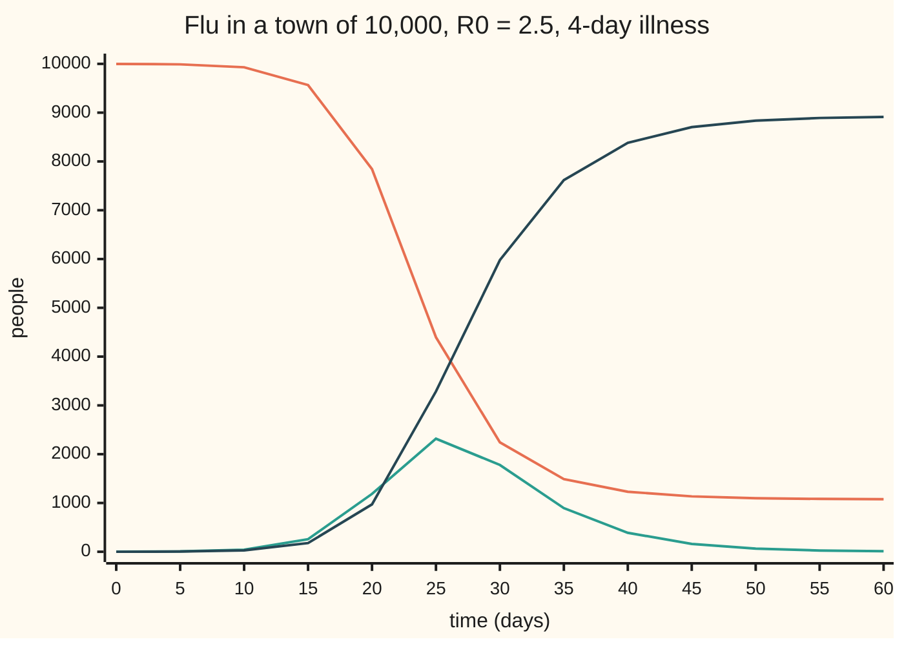
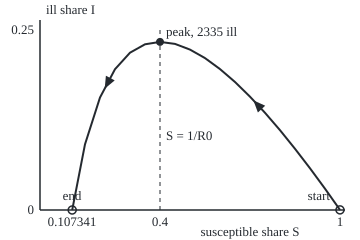

# The SIR model: an outbreak grows while each case infects more than one, and burns out before everyone is ill

[Syllabus](../../../SYLLABUS.md) → [Differential equations and dynamics](../README.md) → [Nonlinear Dynamics in the Plane](../README.md#s06) → The SIR model

---

## General Overview

A town of 10,000 people. On day 0 one resident comes home with flu, and nobody is immune. An ill person stays ill for 4 days on average and, while everyone around can still catch it, passes it to 0.625 people a day: 2.5 new cases per case.

Each resident sits in one of three boxes: susceptible (can still catch it), infected (ill and passing it on), removed (recovered and immune). Infection moves people from the first box to the second, time from the second to the third.

The number ill at once peaks at 2,335 on day 25.65, then falls, though 1,073 people never caught it: the flu ran out of carriers before it ran out of people. In all 8,927 residents, 89.3% of the town, fall ill.

**Cases multiply while each ill person infects more than one other; that stops once the susceptible share falls below one over the reproduction number, and the outbreak dies out with a fixed share of the town never infected.**

**What kind of fact this is:** a model, an assumption that the town mixes evenly and the rates stay fixed; inside it, the peak and the final size are theorems proved on this card in Why it works.

### The picture: the three boxes, day by day



Orange: susceptible. Green: ill at once. Dark blue: removed. The three add to 10,000.

---

## The formula

Notation from [A differential equation](../01-Rate%20Equations/01-what-a-differential-equation-says.md): $S'$ is the rate of $S$. Each box is measured as a share of the town, so $S + I + R = 1$. The SIR model is three rate laws:

$$S' = -bSI, \qquad I' = bSI - gI, \qquad R' = gI .$$

**Read it aloud:** meetings of susceptible and ill people turn the first into the second; a fixed fraction of the ill recover each day.

The **basic reproduction number** counts the new cases one ill person causes in a wholly susceptible town:

$$R_0 = \frac{b}{g} .$$

The **final size** $z$, the share ever infected, solves (for a tiny start)

$$z = 1 - e^{-R_0 z} .$$

| Symbol | Plain meaning | In our example | Push it up and the answer… |
| --- | --- | --- | --- |
| $t$ | time since the first case, in days | day 0 to 60 | the ill share rises, then falls |
| $S$, $S_0$ | share still susceptible; its value on day 0 | $S_0$ = 0.9999 | more fuel for the outbreak |
| $I$, $I_0$ | share ill and passing it on; its value on day 0 | $I_0$ = 0.0001, one person | more infections per day |
| $R$ | share removed: recovered and immune | 0 on day 0, 8,927 people at the end | — |
| $b$ | contact rate: infections per ill person per day, in a wholly susceptible town | 0.625 per day | earlier, higher peak |
| $g$ | recovery rate: fraction of the ill recovering each day; $1/g$ is the average illness | 0.25 per day, 4 days | smaller, later outbreak |
| $R_0$ | basic reproduction number, $b/g$ | 2.5 | larger final size |
| $S_\infty$ | the susceptible share left when the outbreak is over | 0.107341 | — |

The removed share $R$ and the number $R_0$ are unrelated; both names are standard.

### When it holds

- **The town mixes evenly.** Otherwise infections do not scale with $S$ times $I$; clustered contacts give a later, lower peak.
- **The rates stay fixed.** A school holiday lowers $b$ mid-outbreak; fixed $b$ then overstates the peak.
- **Immunity lasts.** If not, people flow from $R$ back to $S$ and the disease can settle at a steady level.
- **The town is closed and large.** No births or visitors, and smooth counts. Whether a lone first case passes it on at all is chance, which needs the probability wing.

---

## Why it works

### Step 0: infections need a meeting, recovery needs only time

A new case needs an ill person to meet a susceptible one; such meetings grow with both shares, so infections run at $b$ times $S$ times $I$. Recovery needs no meeting: a fixed fraction $g$ of the ill recover each day. The three rates add to zero, so the shares always add to 1, and the model lives in the plane of $S$ and $I$, with $R = 1 - S - I$.

### Step 1: R0 and the threshold

Factor the ill share's law:

$$I' = I\,(bS - g) .$$

The ill share grows exactly while $bS > g$, that is, $S > 1/R_0$. On day 0 $S$ is almost 1, so the early growth rate is $b - g$ = 0.375 per day, and cases double every ln 2 ÷ 0.375 = 1.85 days ([Logarithms](../../01-Foundations/03-Powers%2C%20Roots%20and%20Logarithms/05-logarithms.md)).

Why $b/g$ counts cases per case: infections come at $b$ per day for an illness of $1/g$ days, and 0.625 × 4 = 2.5. Below 1, $I'$ is negative from day 0 and nothing happens.

Every point with $I = 0$ is an equilibrium; by [Linearisation](02-linearisation-and-the-jacobian.md), the Jacobian there has eigenvalues 0 and $bS - g$: +0.375 per day at the untouched town, so one case pushes the state away, and −0.1829 per day at the end state, so leftover illness decays.

### Step 2: the phase curve, a quantity the outbreak never changes

The path in the $S$-$I$ plane ([Phase portraits and nullclines](01-phase-portraits-and-nullclines.md)) needs no clock: while anyone is ill, $S$ falls steadily and can serve as one. Divide the two laws:

$$\frac{dI}{dS} = \frac{bSI - gI}{-bSI} = -1 + \frac{1}{R_0 S} .$$

Integrating in $S$:

$$I + S - \frac{\ln S}{R_0} = \text{constant} = I_0 + S_0 - \frac{\ln S_0}{R_0} .$$

The same trick gives the closed orbits of [Predator and prey](06-predator-prey.md); here the curve is open and runs down to $I = 0$.

### The picture: the outbreak in the S-I plane

<p align="center"></p>

Scale: 300 units per unit of $S$ across, 720 units per unit of $I$ up, one point every 0.05 of $S$. The state moves right to left, because $S$ only falls. The dashed line is the nullcline $S = 1/R_0$, where $I' = 0$.

### Step 3: the peak sits where S = 1/R0

The ill share peaks where $I' = 0$, at $S = 1/R_0$ = 0.4. On the phase curve:

$$I_{\max} = S_0 + I_0 - \frac{1}{R_0}\bigl(1 + \ln(R_0 S_0)\bigr) .$$

With $S_0$ = 0.9999 and $I_0$ = 0.0001 this is 0.233524: 2,335 ill at once. The date, day 25.65, needs the laws stepped through time.

### Step 4: the final size

The outbreak ends with $I = 0$. Put $I = 0$ into the phase curve and call the leftover susceptible share $S_\infty$:

$$S_\infty - \frac{\ln S_\infty}{R_0} = S_0 + I_0 - \frac{\ln S_0}{R_0} .$$

As the start shrinks to nothing, $S_0 \to 1$ and $I_0 \to 0$, leaving $\ln S_\infty = -R_0(1 - S_\infty)$; with $z = 1 - S_\infty$ that is $z = 1 - e^{-R_0 z}$, root 0.892645. With the actual single case the exact version gives $S_\infty$ = 0.107341: 8,927 fall ill.

The gap $1 - e^{-R_0 z} - z$ is 0 at $z = 0$, rises at first (slope $R_0 - 1 > 0$), is negative at $z = 1$ and bends downward throughout, so it crosses zero exactly once more. When $R_0 \le 1$ the only root is 0: no outbreak.

### Step 5: why it burns out before everyone is ill

Past the peak each case infects fewer than one other, so the ill share shrinks while susceptible people remain: the flu runs out of carriers, not fuel. The phase curve forbids $S$ reaching 0: $\ln S$ would fall to minus infinity and push $I$ to plus infinity.

<details>
<summary>Detailed proof: the outbreak ends, and ends with S above zero</summary>

$S$ never rises and never goes below 0, so it settles to a limit $S_\infty$; $R$ never falls and stays below 1, so it settles too, and so does $I = 1 - S - R$. If that limit were positive, $R' = gI$ would stay above a fixed positive amount and push $R$ past 1. So $I \to 0$.

The quantity $I + S - \ln(S)/R_0$ is constant along the path: its rate is $I' + S' - S'/(R_0 S) = -gI + gI = 0$, using $S'/(R_0 S) = -gI$. If $S$ tended to 0, $-\ln(S)/R_0$ would grow without bound while $I + S$ stays below 1, breaking the constant. So $S_\infty > 0$. It is the root of Step 4 below $1/R_0$: above it, $I' = I(bS - g)$ would stay positive and $I$ could not fall to 0.

</details>

A second road needs no phase curve: step the laws forward in time, as the code does.

---

## Worked numbers, by hand

| Step | Arithmetic | Value |
| --- | --- | --- |
| reproduction number | $R_0$ = 0.625 ÷ 0.25 | 2.5 |
| early growth | 0.625 − 0.25 per day; doubling ln 2 ÷ 0.375 | 0.375 per day, 1.85 days |
| peak threshold | $S$ = 1 ÷ 2.5 | 0.4 |
| peak height | 1 − 0.4 × (1 + ln(2.5 × 0.9999)) | 0.233524: **2,335 ill** |
| final size | root of $z$ = 1 − e^(−2.5z), by halving an interval | 0.892645 |
| exact end state | $S_\infty$ with the single case | 0.107341: **8,927 ever ill** |

On day 25.65, 2,335 residents are ill at once; 1,073 never catch it.

### What breaks if you drop a piece

| Mistake | Comes out at | What went wrong |
| --- | --- | --- |
| Pure growth e^(0.375t), no depletion | 15,044 ill on day 25.65, in a town of 10,000 | The growth rate is $bS - g$, not $b - g$ |
| Threshold 1 − 1/R0 read as the final size | 60%, not 89.3% | 2,927 more are infected after the peak |
| $g$ = 4 per day from a 4-day illness | $R_0$ = 0.1562, no outbreak | The illness lasts $1/g$ days |

---

## Code, from first principles, and it actually runs

Road one steps the laws with Runge-Kutta 4 (four slope samples per step, averaged; [Runge-Kutta four](../05-Numerical%20Evolution/04-runge-kutta-four.md)) to the peak and the end state; its error falls about sixteenfold as the step halves, the mark of a fourth-order rule. Road two never touches time: the peak from the phase curve at $S = 1/R_0$, the end by bisection (halving an interval that brackets a root) where the curve meets $I = 0$. The checks also build the Jacobian by differences and read its eigenvalues at both rests.

### Python

```python
# The SIR model -- the check behind the card.  Nothing is imported but math.exp
# and math.log.  A flu in a town of 10,000: S, I, R are the shares susceptible,
# ill and recovered; S' = -bSI, I' = bSI - gI, R' = gI, time in days, one case
# on day 0.  Road one steps the equations (Runge-Kutta 4, written out); road two
# is the phase curve I + S - ln(S)/R0 = constant, which needs no stepping at all.
from math import exp, log
N, B, G = 10000, 0.625, 0.25                     # town, contact rate, recovery rate
R0, S0, I0 = B / G, 1 - 1 / N, 1 / N
def f(s, i): return -B * s * i, B * s * i - G * i
def rk4(s, i, h):                                # one Runge-Kutta 4 step
    a = f(s, i); b = f(s + h / 2 * a[0], i + h / 2 * a[1])
    c = f(s + h / 2 * b[0], i + h / 2 * b[1]); d = f(s + h * c[0], i + h * c[1])
    return s + h / 6 * (a[0] + 2 * b[0] + 2 * c[0] + d[0]), i + h / 6 * (a[1] + 2 * b[1] + 2 * c[1] + d[1])
def run(h, days):                                # every step, as (t, S, I)
    s, i, out = S0, I0, [(0.0, S0, I0)]
    for k in range(1, round(days / h) + 1): s, i = rk4(s, i, h); out.append((k * h, s, i))
    return out
def phase_i(s): return S0 + I0 - s + (log(s) - log(S0)) / R0      # road two: I on the phase curve
def bisect(fn, lo, hi):                          # root finder, written out
    for _ in range(200):
        mid = (lo + hi) / 2
        lo, hi = (mid, hi) if fn(lo) * fn(mid) > 0 else (lo, mid)
    return (lo + hi) / 2
def eig(s, i, d=1e-6):                           # Jacobian by differences; 2x2 eigenvalues from trace and det
    j = [[(f(s + d, i)[r] - f(s - d, i)[r]) / (2 * d), (f(s, i + d)[r] - f(s, i - d)[r]) / (2 * d)] for r in (0, 1)]
    tr, det = j[0][0] + j[1][1], j[0][0] * j[1][1] - j[0][1] * j[1][0]
    q = (tr * tr / 4 - det) ** 0.5
    return tr / 2 - q, tr / 2 + q
path = run(0.01, 300)
k = max(range(len(path)), key=lambda n: path[n][2])
t_pk, s_pk, i_pk = path[k]
s_inf = bisect(lambda s: phase_i(s), 1e-9, 1 / R0)                # the phase curve meets I = 0
z = bisect(lambda z: 1 - exp(-R0 * z) - z, 0.5, 1)                 # vanishing-start form
err = [run(h, 300)[-1][1] - s_inf for h in (1, 0.5, 0.25)]
days = [row for row in path if abs(row[0] / 5 - round(row[0] / 5)) < 1e-6 and row[0] <= 60.001]
print(f"town {N}; b = {B}/day, g = {G}/day, illness 1/g = {1 / G:.0f} days; R0 = b/g = {R0}; one case on day 0")
print(f"early growth: I' = (b - g) I = {B - G:.3f} I per day; cases double every {log(2) / (B - G):.2f} days")
print("eigenvalues at (S, I) = (1, 0): {:+.4f} {:+.4f} per day".format(*eig(1, 0)))
print("eigenvalues at (S_inf, 0): {:+.4f} {:+.4f} per day".format(*eig(s_inf, 0)))
print(f"peak, phase curve at S = 1/R0 = {1 / R0}: I = {phase_i(1 / R0):.6f}, {N * phase_i(1 / R0):.0f} ill")
print(f"peak, Runge-Kutta h = 0.01: I = {i_pk:.6f}, {N * i_pk:.0f} ill on day {t_pk:.2f}, S there {s_pk:.4f}")
print(f"final size, phase curve meets I = 0: S_inf = {s_inf:.6f}; {N * (1 - s_inf):.0f} ever ill ({100 * (1 - s_inf):.1f}%), {N * s_inf:.0f} never")
print(f"final size, Runge-Kutta day 300: S = {path[-1][1]:.6f}; z = 1 - e^(-2.5 z) from a vanishing start: {z:.6f}")
print("Runge-Kutta error in never-ill people, day 300, h = 1, 0.5, 0.25: {:.7f} {:.7f} {:.7f}; ratios {:.1f} {:.1f}".format(*(N * e for e in err), err[0] / err[1], err[1] / err[2]))
print("chart days:", " ".join(f"{t:.0f}" for t, _, _ in days))
print("chart S:", " ".join(f"{N * s:.0f}" for _, s, _ in days))
print("chart I:", " ".join(f"{N * i:.0f}" for _, _, i in days))
print("chart R:", " ".join(f"{max(0.0, N * (1 - s - i)):.0f}" for _, s, i in days))
print(f"mistake 1, no depletion: e^({B - G} x {t_pk:.2f}) = {exp((B - G) * t_pk):.0f} ill at the peak day, in a town of {N}")
print(f"mistake 2, threshold 1 - 1/R0 = {1 - 1 / R0:.0%} read as the final size; overshoot {N * (1 - s_inf - (1 - 1 / R0)):.0f} people")
print(f"mistake 3, g = 4 per day (the period used as the rate): R0 = {B / 4:.4f}, no outbreak")
X = lambda s: 40 + 300 * s; Y = lambda i: 210 - 720 * i          # 300 units per unit S, 720 per unit I
print(f"figure, peak ({X(1 / R0):.1f}, {Y(phase_i(1 / R0)):.1f}); start x {X(S0):.1f}; end x {X(s_inf):.1f}")
print("figure, curve:", " ".join(f"{X(s):.1f},{Y(phase_i(s)):.1f}" for s in [S0] + [1 - 0.05 * n for n in range(1, 18)] + [s_inf]))
assert abs(i_pk - phase_i(1 / R0)) < 1e-6 and abs(s_pk - 1 / R0) < 0.002   # peak: stepping vs phase curve
assert abs(path[-1][1] - s_inf) < 1e-7                                     # final size: stepping vs root
assert 14 < err[0] / err[1] < 18                                            # fourth order: error / 16
assert abs(eig(1, 0)[1] - (B - G)) < 1e-6 and abs(eig(s_inf, 0)[0] - (B * s_inf - G)) < 1e-6   # vs hand Jacobian
print("ALL CHECKS PASS")
```

**Ran 2026-09-28 on macOS, Python 3.14.6, standard library only. All checks passed. Output, pasted from the run:**

```
town 10000; b = 0.625/day, g = 0.25/day, illness 1/g = 4 days; R0 = b/g = 2.5; one case on day 0
early growth: I' = (b - g) I = 0.375 I per day; cases double every 1.85 days
eigenvalues at (S, I) = (1, 0): +0.0000 +0.3750 per day
eigenvalues at (S_inf, 0): -0.1829 +0.0000 per day
peak, phase curve at S = 1/R0 = 0.4: I = 0.233524, 2335 ill
peak, Runge-Kutta h = 0.01: I = 0.233524, 2335 ill on day 25.65, S there 0.4000
final size, phase curve meets I = 0: S_inf = 0.107341; 8927 ever ill (89.3%), 1073 never
final size, Runge-Kutta day 300: S = 0.107341; z = 1 - e^(-2.5 z) from a vanishing start: 0.892645
Runge-Kutta error in never-ill people, day 300, h = 1, 0.5, 0.25: 0.0051171 0.0003118 0.0000193; ratios 16.4 16.1
chart days: 0 5 10 15 20 25 30 35 40 45 50 55 60
chart S: 9999 9990 9930 9565 7843 4397 2243 1489 1230 1135 1098 1083 1077
chart I: 1 7 42 258 1186 2317 1779 894 389 161 65 26 11
chart R: 0 4 28 178 972 3286 5978 7617 8381 8704 8837 8891 8912
mistake 1, no depletion: e^(0.375 x 25.65) = 15044 ill at the peak day, in a town of 10000
mistake 2, threshold 1 - 1/R0 = 60% read as the final size; overshoot 2927 people
mistake 3, g = 4 per day (the period used as the rate): R0 = 0.1562, no outbreak
figure, peak (160.0, 41.9); start x 340.0; end x 72.2
figure, curve: 340.0,209.9 325.0,188.7 310.0,168.3 295.0,148.8 280.0,130.2 265.0,112.8 250.0,96.7 235.0,82.0 220.0,69.1 205.0,58.1 190.0,49.6 175.0,43.9 160.0,41.9 145.0,44.3 130.0,52.7 115.0,69.2 100.0,97.5 85.0,144.3 72.2,210.0
ALL CHECKS PASS
```

### Rust

Same numbers, same labels, built with `rustc --edition 2021 -O`.

```rust
// The SIR model -- the same check as the Python, in Rust.  No crates.  A flu
// in a town of 10,000: S, I, R are the shares susceptible, ill and recovered;
// S' = -bSI, I' = bSI - gI, R' = gI, time in days, one case on day 0.  Road one
// steps the equations (Runge-Kutta 4, written out); road two is the phase
// curve I + S - ln(S)/R0 = constant, which needs no stepping at all.
const N: f64 = 10000.0;
const B: f64 = 0.625; const G: f64 = 0.25;          // contact rate and recovery rate, per day
const R0: f64 = B / G;
const I0: f64 = 1.0 / N;
const S0: f64 = 1.0 - I0;

fn f(s: f64, i: f64) -> [f64; 2] { [-B * s * i, B * s * i - G * i] }

fn rk4(s: f64, i: f64, h: f64) -> (f64, f64) {             // one Runge-Kutta 4 step
    let a = f(s, i);
    let b = f(s + h / 2.0 * a[0], i + h / 2.0 * a[1]);
    let c = f(s + h / 2.0 * b[0], i + h / 2.0 * b[1]);
    let d = f(s + h * c[0], i + h * c[1]);
    (s + h / 6.0 * (a[0] + 2.0 * b[0] + 2.0 * c[0] + d[0]), i + h / 6.0 * (a[1] + 2.0 * b[1] + 2.0 * c[1] + d[1]))
}

fn run(h: f64, days: f64) -> Vec<(f64, f64, f64)> {         // every step, as (t, S, I)
    let (mut s, mut i, mut out) = (S0, I0, vec![(0.0, S0, I0)]);
    for k in 1..=(days / h).round() as usize { let n = rk4(s, i, h); s = n.0; i = n.1; out.push((k as f64 * h, s, i)); }
    out
}

fn phase_i(s: f64) -> f64 { S0 + I0 - s + (s.ln() - S0.ln()) / R0 }   // road two: I on the phase curve

fn bisect(fun: &dyn Fn(f64) -> f64, mut lo: f64, mut hi: f64) -> f64 {   // root finder, written out
    for _ in 0..200 { let mid = (lo + hi) / 2.0; if fun(lo) * fun(mid) > 0.0 { lo = mid } else { hi = mid } }
    (lo + hi) / 2.0
}

fn eig(s: f64, i: f64) -> (f64, f64) {       // Jacobian by differences; 2x2 eigenvalues from trace and det
    let d = 1e-6;
    let j: Vec<[f64; 2]> = (0..2).map(|r| [(f(s + d, i)[r] - f(s - d, i)[r]) / (2.0 * d), (f(s, i + d)[r] - f(s, i - d)[r]) / (2.0 * d)]).collect();
    let (tr, det) = (j[0][0] + j[1][1], j[0][0] * j[1][1] - j[0][1] * j[1][0]);
    let q = (tr * tr / 4.0 - det).sqrt();
    (tr / 2.0 - q, tr / 2.0 + q)
}

fn join(v: Vec<String>) -> String { v.join(" ") }

fn main() {
    let path = run(0.01, 300.0);
    let (t_pk, s_pk, i_pk) = *path.iter().max_by(|a, b| a.2.partial_cmp(&b.2).unwrap()).unwrap();
    let s_inf = bisect(&|s| phase_i(s), 1e-9, 1.0 / R0);                  // the phase curve meets I = 0
    let z = bisect(&|z| 1.0 - (-R0 * z).exp() - z, 0.5, 1.0);             // vanishing-start form
    let err: Vec<f64> = [1.0, 0.5, 0.25].iter().map(|&h| run(h, 300.0).last().unwrap().1 - s_inf).collect();
    let days: Vec<&(f64, f64, f64)> = path.iter().filter(|r| (r.0 / 5.0 - (r.0 / 5.0).round()).abs() < 1e-6 && r.0 <= 60.001).collect();
    let s_end = path.last().unwrap().1;
    let (e1, e2) = (eig(1.0, 0.0), eig(s_inf, 0.0));
    println!("town {}; b = {}/day, g = {}/day, illness 1/g = {:.0} days; R0 = b/g = {}; one case on day 0", N, B, G, 1.0 / G, R0);
    println!("early growth: I' = (b - g) I = {:.3} I per day; cases double every {:.2} days", B - G, 2f64.ln() / (B - G));
    println!("eigenvalues at (S, I) = (1, 0): {:+.4} {:+.4} per day", e1.0, e1.1);
    println!("eigenvalues at (S_inf, 0): {:+.4} {:+.4} per day", e2.0, e2.1);
    println!("peak, phase curve at S = 1/R0 = {}: I = {:.6}, {:.0} ill", 1.0 / R0, phase_i(1.0 / R0), N * phase_i(1.0 / R0));
    println!("peak, Runge-Kutta h = 0.01: I = {:.6}, {:.0} ill on day {:.2}, S there {:.4}", i_pk, N * i_pk, t_pk, s_pk);
    println!("final size, phase curve meets I = 0: S_inf = {:.6}; {:.0} ever ill ({:.1}%), {:.0} never", s_inf, N * (1.0 - s_inf), 100.0 * (1.0 - s_inf), N * s_inf);
    println!("final size, Runge-Kutta day 300: S = {:.6}; z = 1 - e^(-2.5 z) from a vanishing start: {:.6}", s_end, z);
    println!("Runge-Kutta error in never-ill people, day 300, h = 1, 0.5, 0.25: {:.7} {:.7} {:.7}; ratios {:.1} {:.1}", N * err[0], N * err[1], N * err[2], err[0] / err[1], err[1] / err[2]);
    println!("chart days: {}", join(days.iter().map(|r| format!("{:.0}", r.0)).collect()));
    println!("chart S: {}", join(days.iter().map(|r| format!("{:.0}", N * r.1)).collect()));
    println!("chart I: {}", join(days.iter().map(|r| format!("{:.0}", N * r.2)).collect()));
    println!("chart R: {}", join(days.iter().map(|r| format!("{:.0}", (N * (1.0 - r.1 - r.2)).max(0.0))).collect()));
    println!("mistake 1, no depletion: e^({} x {:.2}) = {:.0} ill at the peak day, in a town of {}", B - G, t_pk, ((B - G) * t_pk).exp(), N);
    println!("mistake 2, threshold 1 - 1/R0 = {:.0}% read as the final size; overshoot {:.0} people", 100.0 * (1.0 - 1.0 / R0), N * (1.0 - s_inf - (1.0 - 1.0 / R0)));
    println!("mistake 3, g = 4 per day (the period used as the rate): R0 = {:.4}, no outbreak", B / 4.0);
    let x = |s: f64| 40.0 + 300.0 * s;                       // 300 units per unit S
    let y = |i: f64| 210.0 - 720.0 * i;                      // 720 units per unit I
    println!("figure, peak ({:.1}, {:.1}); start x {:.1}; end x {:.1}", x(1.0 / R0), y(phase_i(1.0 / R0)), x(S0), x(s_inf));
    let mut ss = vec![S0]; ss.extend((1..18).map(|n| 1.0 - 0.05 * n as f64)); ss.push(s_inf);
    println!("figure, curve: {}", join(ss.iter().map(|&s| format!("{:.1},{:.1}", x(s), y(phase_i(s)))).collect()));
    assert!((i_pk - phase_i(1.0 / R0)).abs() < 1e-6 && (s_pk - 1.0 / R0).abs() < 0.002);   // peak: stepping vs phase curve
    assert!((s_end - s_inf).abs() < 1e-7);                                                  // final size: stepping vs root
    assert!(err[0] / err[1] > 14.0 && err[0] / err[1] < 18.0);                               // fourth order: error / 16
    assert!((e1.1 - (B - G)).abs() < 1e-6 && (e2.0 - (B * s_inf - G)).abs() < 1e-6);         // vs hand Jacobian
    println!("ALL CHECKS PASS");
}
```

**Ran 2026-09-28 on macOS, rustc 1.98.1, no crates. All checks passed. Output, pasted from the run:**

```
town 10000; b = 0.625/day, g = 0.25/day, illness 1/g = 4 days; R0 = b/g = 2.5; one case on day 0
early growth: I' = (b - g) I = 0.375 I per day; cases double every 1.85 days
eigenvalues at (S, I) = (1, 0): +0.0000 +0.3750 per day
eigenvalues at (S_inf, 0): -0.1829 +0.0000 per day
peak, phase curve at S = 1/R0 = 0.4: I = 0.233524, 2335 ill
peak, Runge-Kutta h = 0.01: I = 0.233524, 2335 ill on day 25.65, S there 0.4000
final size, phase curve meets I = 0: S_inf = 0.107341; 8927 ever ill (89.3%), 1073 never
final size, Runge-Kutta day 300: S = 0.107341; z = 1 - e^(-2.5 z) from a vanishing start: 0.892645
Runge-Kutta error in never-ill people, day 300, h = 1, 0.5, 0.25: 0.0051171 0.0003118 0.0000193; ratios 16.4 16.1
chart days: 0 5 10 15 20 25 30 35 40 45 50 55 60
chart S: 9999 9990 9930 9565 7843 4397 2243 1489 1230 1135 1098 1083 1077
chart I: 1 7 42 258 1186 2317 1779 894 389 161 65 26 11
chart R: 0 4 28 178 972 3286 5978 7617 8381 8704 8837 8891 8912
mistake 1, no depletion: e^(0.375 x 25.65) = 15044 ill at the peak day, in a town of 10000
mistake 2, threshold 1 - 1/R0 = 60% read as the final size; overshoot 2927 people
mistake 3, g = 4 per day (the period used as the rate): R0 = 0.1562, no outbreak
figure, peak (160.0, 41.9); start x 340.0; end x 72.2
figure, curve: 340.0,209.9 325.0,188.7 310.0,168.3 295.0,148.8 280.0,130.2 265.0,112.8 250.0,96.7 235.0,82.0 220.0,69.1 205.0,58.1 190.0,49.6 175.0,43.9 160.0,41.9 145.0,44.3 130.0,52.7 115.0,69.2 100.0,97.5 85.0,144.3 72.2,210.0
ALL CHECKS PASS
```

The two outputs match line for line.

> [!TIP]
> **Try changing**
> Guess first, then run it.
> - **Halve the contact rate.** Set `B` to `0.3125`, so $R_0$ = 1.25. The peak drops to 216 ill on day 109.60 and 37.2% are ever ill; unfinished by day 300, so the final-size assert stops the run.
> - **Push R0 below 1.** Set `B` to `0.2`. Growth prints −0.050 per day and 5 people are ever ill; $S = 1/R_0$ = 1.25 lies outside the town, so the peak assert stops the run.
> - **Start with 10 cases.** Change `1 / N` to `10 / N` twice on the `R0, S0, I0` line. The peak comes on day 19.49; its height (2,339) and the final size barely move.

---

## The usual mistake

> [!warning]
> **Believing an outbreak ends when everyone has had it.** It ends when the ill can no longer replace themselves, once $S$ is below $1/R_0$: here 1,073 of 10,000 are never infected.
>
> - **Stopping at the threshold.** Herd immunity, $S = 1/R_0$, is where cases start falling; the 2,335 still ill infect 2,927 more, 89.3% in all, not 60%.
> - **Mixing the rate and the period.** A 4-day illness means $g$ = 0.25 per day; using 4 gives $R_0$ = 0.1562.
> - **Reading $R$ as $R_0$.** The removed box climbs to 8,927 people; the reproduction number stays 2.5.

---

## Where you meet it in real life

- **Hospital planning.** Beds are sized by the peak formula; distancing lowers $b$ and the peak.
- **Vaccination targets.** Vaccinating a share $1 - 1/R_0$ beforehand puts $S$ at the threshold on day 0, so cases cannot grow: 60% for a flu with $R_0$ = 2.5.
- **Computer worms and rumours.** Anything passed on by contact and dropped after a while fits the same boxes; with nobody recovering it reduces to [Logistic growth](../01-Rate%20Equations/07-logistic-growth.md).

> **Say it back**
> The SIR model splits a town into susceptible, infected and removed; infection needs a meeting, recovery only time. Each case infects $R_0 = b/g$ others in a fresh town, and cases grow while $S$ is above $1/R_0$. Dividing the laws drops time and gives a curve on which $I + S - \ln(S)/R_0$ never changes. The peak is on that curve at $S = 1/R_0$, and the end is where it meets $I = 0$. For the flu that is 2,335 ill at the peak and 89.3% ill in all.

---

## What this builds on

- [Phase portraits and nullclines](01-phase-portraits-and-nullclines.md): the $S$-$I$ plane, the nullcline $S = 1/R_0$, and a line of rests.
- [Logarithms](../../01-Foundations/03-Powers%2C%20Roots%20and%20Logarithms/05-logarithms.md): the $\ln S$ that integrates $1/S$ and sets the final size.

## Where this goes next

- Epidemics on a network: the same boxes when people meet only their neighbours.

---

## Sources

Verified 2026-09-28: every link below resolves to the publisher's page.

- Kermack, W. O., and A. G. McKendrick. "A contribution to the mathematical theory of epidemics." *Proceedings of the Royal Society A* 115 (1927), 700–721. [DOI](https://doi.org/10.1098/rspa.1927.0118). The original model, threshold and final size.
- Hethcote, Herbert W. "The Mathematics of Infectious Diseases." *SIAM Review* 42(4) (2000), 599–653. [DOI](https://doi.org/10.1137/S0036144500371907). $R_0$, the phase plane and the peak.
- Brauer, Fred, and Carlos Castillo-Chavez. *Mathematical Models in Population Biology and Epidemiology*, 2nd ed. Springer, 2012. [Publisher page](https://doi.org/10.1007/978-1-4614-1686-9). The final-size equation and its root.
- Strogatz, Steven H. *Nonlinear Dynamics and Chaos*, 2nd ed. CRC Press. [Publisher page](https://www.routledge.com/Nonlinear-Dynamics-and-Chaos-With-Applications-to-Physics-Biology-Chemistry-and-Engineering/Strogatz/p/book/9780367026509). Epidemic models read as systems in the plane.
