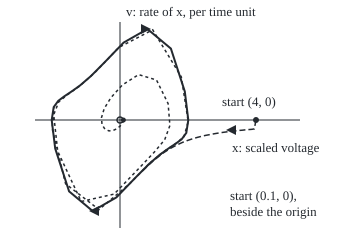

# Limit cycles: a self-sustaining rhythm that nearby states spiral onto, unlike the fragile circles of a centre

[Syllabus](../../../SYLLABUS.md) → [Differential equations and dynamics](../../../SYLLABUS.md#w08) → [Nonlinear Dynamics in the Plane](../../../SYLLABUS.md#w08-s06) → Limit cycles

---

## General Overview

A heart keeps its own rhythm. After a skipped beat or a jolt it returns to the same beat at the same strength. A pendulum does not: push it harder and it swings wider for good, or friction runs it down.

In 1928 Balthasar van der Pol and Jan van der Mark modelled the heart with a valve (vacuum-tube) circuit. Near rest the circuit pumps energy in, so small motions grow. Far from rest it drains energy, so large motions shrink. Between sits one rhythm where pumping and braking cancel over a beat.

Start the model at a tiny voltage, 0.1, or a large one, 4. Both settle onto one loop, peak 2.0086, one beat every 6.6633 units of model time. With the unit set to 0.12 s, that is 0.800 s a beat, 75.0 a minute.

**A limit cycle is a closed loop in the plane of states that is isolated: nearby starts spiral onto it (or away from it), so the rhythm it carries is fixed by the law itself, not by where the motion began.**

**What kind of fact this is:** a theorem about a defined object. For the polar model the attraction is proved in Why it works; for van der Pol it is Liénard's theorem, sketched in the folded Detailed proof and checked by two roads in the code.

### The picture: two starts, one loop

<p align="center"></p>

Scale: 34 px per unit on both axes, origin at (120, 120). Solid: the loop. Short dashes: the start (0.1, 0) over 16 time units. Long dashes: the start (4, 0) over 7. Open circle: the rest point.

---

## The formula

A state is a point in the plane: the voltage $x$ and its rate $v$ ($x'$ is the rate of $x$, as across this wing). The warm-up law is solvable by hand and written in polar coordinates: $r$ is distance from the origin, $\theta$ the angle.

$$r' = r\,(1 - r^2), \qquad \theta' = 1$$

**Read it aloud:** the point turns steadily; its distance grows below 1 and shrinks above 1.

The second is the van der Pol law, the heart model:

$$x' = v, \qquad v' = \mu\,(1 - x^2)\,v - x$$

**Read it aloud:** the rate of $v$ is a spring pulling back to zero, plus a push along the motion while the voltage is small, and a drag once it passes 1 either way.

| Symbol | Plain meaning | In our example | Push it up and the answer… |
| --- | --- | --- | --- |
| $x$ | the state's position: a scaled voltage, no unit | starts 0.1 and 4 | — |
| $v$ | the rate of $x$, per time unit | starts at 0 | — |
| $\mu$ | the strength of the push and the drag | 1 | slow crawls and quick jumps; a longer period |
| $t$ | time, in model units of 0.12 s | 0 to 60 | — |
| $r$ | distance of the state from the origin (polar model) | starts 0.1 and 2 | — |
| $\theta$ | angle of the state, in radians (polar model) | grows by 1 per unit | — |
| $r_0$ | the starting distance | 0.1 | earlier arrival near 1 from inside |
| $a$ | a start on the positive $x$ axis, with $v$ = 0; $P(a)$ is where it lands after one lap | 2.0086 on the loop | — |
| $T$ | the period: the time for one lap of the loop | 6.6633 units, 0.800 s | the beat slows |
| $F$, $b$ | used only in the folded proof: $F(x) = \mu(x^3/3 - x)$, and $b$ a start on the upper y axis | — | — |

Solved, the polar model gives the distance at every time:

$$r(t) = \frac{1}{\sqrt{1 + \left(\frac{1}{r_0^{2}} - 1\right) e^{-2t}}}$$

The factor $e^{-2t}$ wipes out the start's offset.

### When it holds

- **Two dimensions, a law fixed in time.** Drive the circuit with an outside periodic push and it can turn chaotic.
- **A smooth law.** Paths then never cross, so a path inside the loop stays inside. Without it, spiralling on is not guaranteed.
- **Strength above zero.** At $\mu$ = 0 every circle is a loop and none attracts. Below zero the law is the same law run backwards in time, so the loop repels.
- **Isolated.** Nested loops, as in a centre, are not limit cycles, however closed each one is. A linear law never has one: scale a loop and you get another.

---

## Why it works

### Step 0: a loop attracts when the law pumps inside it and brakes outside it

On a centre every nearby start runs its own loop, so a nudge moves the rhythm for good. On a limit cycle the neighbours lead onto the loop, which needs a law that adds energy near rest and removes it far out.

### Step 1: the polar model has one distance that does not change

The angle turns at rate 1 regardless. The distance law $r' = r(1 - r^2)$ is a phase line (one rate law read along one axis). Its rate is zero at $r$ = 0 and $r$ = 1, positive between, negative above. Every start but the origin moves toward $r$ = 1 from either side: the unit circle is a limit cycle.

### Step 2: solving it shows how fast

Put $u = 1/r^2$. The chain rule gives $u' = -2r'/r^3 = -2(1 - r^2)/r^2 = -2u + 2$. That is a linear law: $u - 1$ shrinks by the factor $e^{-2t}$. So $u = 1 + (u_0 - 1)e^{-2t}$, and $r = 1/\sqrt{u}$ is the formula above. The gap to the loop fades like $e^{-2t}$: after one lap of $2\pi$ time units it has shrunk by $e^{-4\pi}$, or 3.49e-06.

### Step 3: van der Pol trades energy the same way

Take the spring's energy $E = (x^2 + v^2)/2$. Along a path its rate is $xv + v(\mu(1 - x^2)v - x) = \mu(1 - x^2)v^2$. Where $x$ lies between −1 and 1 that rate is positive: energy flows in. Outside, it drains. Small motions gain each lap, large ones lose.

Linearisation confirms the first half. At the origin the Jacobian (the table of the law's rates of change) has trace 1 and determinant 1, so eigenvalues $(1 \pm \sqrt{1 - 4})/2$ = 0.500 ± 0.866i: a spiral outward ([Linearisation](02-linearisation-and-the-jacobian.md)).

### Step 4: one lap as a map

Start on the positive $x$ axis at a point $a$ with $v$ = 0. Follow the path once round to its next crossing of that half-axis; call the landing point $P(a)$, the return map. A loop is a start that lands on itself, $P(a) = a$. Below the loop $P(a) > a$, above it $P(a) < a$, so bisection on that sign finds the loop without waiting for anything to settle.

### Step 5: the pull per lap is an integral

A small patch of starts changes area at a relative rate equal to the Jacobian's trace, here $\mu(1 - x^2)$. Over one lap, a patch on the loop keeps its width along the loop, since loop points return to themselves, so the whole area change lands on the width across it. The return map's slope is the exponential of the trace integrated over a lap: 8.597e-04, a small gap cut to under a thousandth in one beat. The polar model gives $e^{-4\pi}$ again.

<details>
<summary>Detailed proof: van der Pol has exactly one loop, and it attracts (Liénard's theorem)</summary>

Write $F(x) = \mu(x^3/3 - x)$ and $y = v - \mu(x - x^3/3)$, so the law becomes $x' = y - F(x)$, $y' = -x$. Take $E = (x^2 + y^2)/2$; then $E' = -xF(x)$.

The law is unchanged by $(x, y) \to (-x, -y)$, so a path from $(0, b)$ on the upper y axis closes exactly when its energy change $\Delta(b)$, up to the lower y axis, is zero.

$F$ is negative for $x$ between 0 and $\sqrt{3}$ and positive beyond, so $-xF(x)$ is positive in the band and negative outside it. A half-lap inside the band gains energy: $\Delta(b) > 0$ for small $b$. Once it leaves the band, splitting the path at $x = \sqrt{3}$ and comparing pieces shows $\Delta(b)$ strictly decreasing, to minus infinity. So $\Delta(b)$ has exactly one zero: one loop, with paths climbing out below it and falling in above it. Full estimates: Perko, section 3.8.

</details>

Another route to existence, with no formula at all, traps the path in a ring it cannot leave: [Poincare-Bendixson](09-poincare-bendixson-and-bendixsons-criterion.md).

---

## Worked numbers, by hand

The polar model from $r_0$ = 0.1 at $t$ = 5, then the heart model.

| Step | Arithmetic | Value |
| --- | --- | --- |
| offset of the start | 1/0.1^2 − 1 | 99 |
| decay by $t$ = 5 | e^(−2 × 5) | 4.540e-05 |
| offset left | 99 × 4.540e-05 | 0.004495 |
| distance | 1 / √(1 + 0.004495) | **0.99776** |
| from $r_0$ = 2 instead | the same four steps | **1.000017** |
| rest point of van der Pol | trace 1, determinant 1 | 0.500 ± 0.866i, a source |
| the beat | 6.6633 × 0.12 s | **0.800 s**, 75.0 a minute |

By $t$ = 5 both polar starts sit within a quarter of a percent of the unit circle, one from each side.

### What breaks if you drop a piece

| Mistake | Comes out at | What went wrong |
| --- | --- | --- |
| Strength $\mu$ set to 0 | amplitudes stay 0.1000 and 4.0000 | A frictionless spring: every circle is a loop, none attracts |
| Keeping only the linear law $v' = v - x$ | largest size 1363 by $t$ = 20, not 2 | Without the drag term the outward spiral never stops |
| Period taken as 2π = 6.2832 | 5.7% short, 79.6 beats a minute | The loop is not a circle; its speed varies round the lap |

---

## Code, from first principles, and it actually runs

Both scripts step with Runge-Kutta 4 ([Runge-Kutta four](../05-Numerical%20Evolution/04-runge-kutta-four.md)). Road one steps the polar model in $x$ and $v$, $x' = x(1 - r^2) - v$, $v' = v(1 - r^2) + x$, and meets its closed form; halving the step cuts the error by 16.2, the fourth-order rate. Road two settles van der Pol from both starts, finds the loop again by bisection on the return map, and measures the pull per lap by the map's slope and by the trace integral.

### Python

```python
# Limit cycles and van der Pol -- the check behind the card.  Only math is imported; RK4 is
# written out.  Road one: the polar model against its closed form.  Road two: van der Pol
# settled from two starts, then its loop found again by a return map and bisection.
import math
S = 0.12                                   # seconds of heartbeat per model time unit
def rk4(f, p, h):
    k1 = f(p); k2 = f([p[i] + h / 2 * k1[i] for i in (0, 1)])
    k3 = f([p[i] + h / 2 * k2[i] for i in (0, 1)]); k4 = f([p[i] + h * k3[i] for i in (0, 1)])
    return [p[i] + h / 6 * (k1[i] + 2 * k2[i] + 2 * k3[i] + k4[i]) for i in (0, 1)]
polar = lambda p: [p[0] * (1 - p[0] ** 2 - p[1] ** 2) - p[1], p[1] * (1 - p[0] ** 2 - p[1] ** 2) + p[0]]
vdp = lambda mu: lambda p: [p[1], mu * (1 - p[0] ** 2) * p[1] - p[0]]   # x' = v, v' = mu(1-x^2)v - x
def run(f, p, t, h=0.001):                 # step from p for time t, keeping the path
    path = [p]
    for _ in range(round(t / h)): path.append(rk4(f, path[-1], h))
    return path
def lap(f, p, mu=1.0, h=0.001):            # step until v turns from + to -; return x there,
    t, div = 0.0, 0.0                      # the time taken, and the integral of mu(1 - x^2)
    while True:
        q = rk4(f, p, h); t += h
        if p[1] > 0 >= q[1]:               # Newton on the last part-step lands v on 0
            s = 0.0
            for _ in range(4): s -= rk4(f, p, s)[1] / f(rk4(f, p, s))[1]
            r = rk4(f, p, s)
            return r[0], t - h + s, div + s * mu * (1 - (p[0] ** 2 + r[0] ** 2) / 2)
        div += h * mu * (1 - (p[0] ** 2 + q[0] ** 2) / 2); p = q

closed = lambda r0, t: 1 / math.sqrt(1 + (1 / r0 ** 2 - 1) * math.exp(-2 * t))
err = [abs(math.hypot(*run(polar, [0.1, 0.0], 5, h)[-1]) - closed(0.1, 5)) for h in (0.1, 0.05)]
print(f"polar model at t = 5, from r0 = 0.1: 99 x e^-10 = 99 x {math.exp(-10):.3e} = {99 * math.exp(-10):.6f}, r = {closed(0.1, 5):.5f}; from r0 = 2: r = {closed(2, 5):.6f}")
print(f"RK4 error at h = 0.1 and 0.05: {err[0]:.2e}, {err[1]:.2e}; ratio {err[0] / err[1]:.1f} (fourth order: 16)")
d = 1e-6; J = [[vdp(1.0)([d * (j == 0), d * (j == 1)])[i] / d for j in (0, 1)] for i in (0, 1)]
tr, det = J[0][0] + J[1][1], J[0][0] * J[1][1] - J[0][1] * J[1][0]
print(f"van der Pol origin: trace {tr:.3f}, det {det:.3f}, eigenvalues {tr / 2:.3f} +/- {math.sqrt(det - tr * tr / 4):.3f}i")
paths, got = {}, []
for s in (0.1, 4.0):
    paths[s] = run(vdp(1.0), [s, 0.0], 60)
    got.append(lap(vdp(1.0), [lap(vdp(1.0), paths[s][-1])[0], 0.0]))
    print(f"start ({s}, 0), after t = 60: amplitude {got[-1][0]:.4f}, period {got[-1][1]:.4f}")
lo, hi = 1.0, 3.0                          # road two: the x the return map sends to itself
for _ in range(40):
    lo, hi = ((lo + hi) / 2, hi) if lap(vdp(1.0), [(lo + hi) / 2, 0.0])[0] > (lo + hi) / 2 else (lo, (lo + hi) / 2)
a, T, div = lap(vdp(1.0), [lo, 0.0])
slope = (lap(vdp(1.0), [a + 1e-3, 0.0])[0] - lap(vdp(1.0), [a - 1e-3, 0.0])[0]) / 2e-3
print(f"return map fixed point by bisection: amplitude {a:.4f}, period {T:.4f}; x {S} s = {T * S:.3f} s, {60 / (T * S):.1f} beats/min")
print(f"pull per lap: exp(integral) = {math.exp(div):.3e}, return-map slope = {slope:.3e}; polar exp(-4 pi) = {math.exp(-4 * math.pi):.2e}")
amp0 = [lap(vdp(0.0), run(vdp(0.0), [s, 0.0], 60)[-1], mu=0.0)[0] for s in (0.1, 4.0)]
lin = run(lambda p: [p[1], p[1] - p[0]], [0.1, 0.0], 20)
print(f"mistake 1, mu = 0: amplitudes stay {amp0[0]:.4f} and {amp0[1]:.4f}; every circle is a loop")
print(f"mistake 2, linearised law from (0.1, 0): largest |x| by t = 20 is {max(abs(p[0]) for p in lin):.0f}, not 2")
print(f"mistake 3, period taken as 2 pi = {2 * math.pi:.4f}: {100 * (1 - 2 * math.pi / T):.1f}% short, {60 / (2 * math.pi * S):.1f} beats/min")
X = lambda x: 120 + 34 * x; Y = lambda v: 120 - 34 * v
print(f"figure, 34 px per unit; origin ({X(0):.0f}, {Y(0):.0f}); x = 4 at {X(4):.0f}; x = {a:.4f} at {X(a):.1f}")
for s, n, k in ((0.1, 16, 400), (4.0, 7, 250)):
    print(f"figure, start {s}:", " ".join(f"{X(p[0]):.1f},{Y(p[1]):.1f}" for p in paths[s][:n * 1000 + 1:k]))
print("figure, loop:", " ".join(f"{X(p[0]):.1f},{Y(p[1]):.1f}" for p in run(vdp(1.0), [a, 0.0], T, T / 24000)[:-1:1000]))
assert err[1] < 1e-6 and 12 < err[0] / err[1] < 20                   # RK4 meets the closed form at order 4
assert all(abs(g[0] - a) < 1e-4 and abs(g[1] - T) < 1e-3 for g in got)  # settling agrees with bisection
assert abs(math.exp(div) / slope - 1) < 1e-3 and slope < 1            # two measures of the pull agree
assert abs(tr - 1) < 1e-6 and abs(det - 1) < 1e-6 and abs(amp0[1] - 4) < 1e-4
print("ALL CHECKS PASS")
```

**Ran 2026-09-28 on macOS, Python 3.14.6, standard library only. All checks passed. Output, pasted from the run:**

```
polar model at t = 5, from r0 = 0.1: 99 x e^-10 = 99 x 4.540e-05 = 0.004495, r = 0.99776; from r0 = 2: r = 1.000017
RK4 error at h = 0.1 and 0.05: 3.17e-06, 1.96e-07; ratio 16.2 (fourth order: 16)
van der Pol origin: trace 1.000, det 1.000, eigenvalues 0.500 +/- 0.866i
start (0.1, 0), after t = 60: amplitude 2.0086, period 6.6633
start (4.0, 0), after t = 60: amplitude 2.0086, period 6.6633
return map fixed point by bisection: amplitude 2.0086, period 6.6633; x 0.12 s = 0.800 s, 75.0 beats/min
pull per lap: exp(integral) = 8.597e-04, return-map slope = 8.597e-04; polar exp(-4 pi) = 3.49e-06
mistake 1, mu = 0: amplitudes stay 0.1000 and 4.0000; every circle is a loop
mistake 2, linearised law from (0.1, 0): largest |x| by t = 20 is 1363, not 2
mistake 3, period taken as 2 pi = 6.2832: 5.7% short, 79.6 beats/min
figure, 34 px per unit; origin (120, 120); x = 4 at 256; x = 2.0086 at 188.3
figure, start 0.1: 123.4,120.0 123.1,121.6 122.0,123.7 120.1,126.1 117.1,128.6 113.3,130.4 109.0,130.9 104.9,129.1 102.0,124.6 101.5,117.6 104.2,108.6 110.9,97.7 122.3,85.0 138.6,74.6 156.5,80.0 168.1,103.6 169.9,125.5 164.7,139.7 154.4,152.0 138.5,168.8 114.1,194.1 81.2,201.5 57.7,151.2 53.7,114.7 58.8,101.8 67.5,94.7 79.2,86.4 95.2,72.2 118.9,47.4 152.7,29.8 181.3,76.9 188.2,121.6 184.0,136.6 175.9,143.5 165.1,150.7 150.7,162.3 130.0,183.4 99.0,209.6 65.6,183.8 52.1,128.4 54.0,106.6
figure, start 4.0: 256.0,120.0 254.3,128.9 252.0,129.3 249.7,129.5 247.3,129.7 244.8,129.9 242.3,130.2 239.7,130.4 237.1,130.7 234.4,131.0 231.6,131.3 228.7,131.6 225.8,132.0 222.7,132.4 219.6,132.9 216.3,133.4 212.9,134.0 209.3,134.7 205.5,135.4 201.6,136.3 197.3,137.4 192.8,138.7 188.0,140.3 182.7,142.3 176.8,145.0 170.1,148.5 162.4,153.5 153.2,160.8 141.7,171.6
figure, loop: 188.3,120.0 186.3,132.9 181.7,139.2 175.8,143.6 168.6,148.4 159.9,154.6 149.1,163.9 135.1,178.0 116.4,197.4 92.6,211.0 69.1,191.4 55.2,148.5 51.7,120.0 53.7,107.1 58.3,100.8 64.2,96.4 71.4,91.6 80.1,85.4 90.9,76.1 104.9,62.0 123.6,42.6 147.4,29.0 170.9,48.6 184.8,91.5
ALL CHECKS PASS
```

### Rust

Same rows, same labels, built with `rustc --edition 2021 -O`.

```rust
// Limit cycles and van der Pol -- the same check as the Python, in Rust, std only.  RK4 is
// written out.  Road one: the polar model against its closed form.  Road two: van der Pol
// settled from two starts, then its loop found again by a return map and bisection.
type P = [f64; 2];
const S: f64 = 0.12;                                // seconds of heartbeat per model time unit
fn rk4(f: &dyn Fn(P) -> P, p: P, h: f64) -> P {
    let k1 = f(p); let k2 = f([p[0] + h / 2.0 * k1[0], p[1] + h / 2.0 * k1[1]]);
    let k3 = f([p[0] + h / 2.0 * k2[0], p[1] + h / 2.0 * k2[1]]); let k4 = f([p[0] + h * k3[0], p[1] + h * k3[1]]);
    [0, 1].map(|i| p[i] + h / 6.0 * (k1[i] + 2.0 * k2[i] + 2.0 * k3[i] + k4[i]))
}
fn polar(p: P) -> P { let s = 1.0 - p[0] * p[0] - p[1] * p[1]; [p[0] * s - p[1], p[1] * s + p[0]] }
fn vdp(mu: f64) -> impl Fn(P) -> P { move |p: P| [p[1], mu * (1.0 - p[0] * p[0]) * p[1] - p[0]] }
fn run(f: &dyn Fn(P) -> P, p: P, t: f64, h: f64) -> Vec<P> {   // step from p for time t, keeping the path
    let mut path = vec![p];
    for _ in 0..(t / h).round() as usize { let q = rk4(f, *path.last().unwrap(), h); path.push(q) }
    path
}
fn lap(f: &dyn Fn(P) -> P, mut p: P, mu: f64) -> (f64, f64, f64) {   // x where v turns + to -, time, integral
    let (h, mut t, mut div) = (0.001, 0.0, 0.0);
    loop {
        let q = rk4(f, p, h); t += h;
        if p[1] > 0.0 && q[1] <= 0.0 {               // Newton on the last part-step lands v on 0
            let mut s = 0.0;
            for _ in 0..4 { let r = rk4(f, p, s); s -= r[1] / f(r)[1] }
            let r = rk4(f, p, s);
            return (r[0], t - h + s, div + s * mu * (1.0 - (p[0] * p[0] + r[0] * r[0]) / 2.0));
        }
        div += h * mu * (1.0 - (p[0] * p[0] + q[0] * q[0]) / 2.0); p = q;
    }
}
fn sci(x: f64, d: usize) -> String {                 // 3.17e-06, the way Python prints it
    let s = format!("{:.*e}", d, x); let (m, e) = s.split_once('e').unwrap(); let e: i32 = e.parse().unwrap();
    format!("{}e{}{:02}", m, if e < 0 { '-' } else { '+' }, e.abs())
}
fn pts(path: &[P], k: usize) -> String {
    path.iter().step_by(k).map(|p| format!("{:.1},{:.1}", 120.0 + 34.0 * p[0], 120.0 - 34.0 * p[1])).collect::<Vec<_>>().join(" ")
}
fn main() {
    let closed = |r0: f64, t: f64| 1.0 / (1.0 + (1.0 / (r0 * r0) - 1.0) * (-2.0 * t).exp()).sqrt();
    let err: Vec<f64> = [0.1, 0.05].iter().map(|&h| { let e = *run(&polar, [0.1, 0.0], 5.0, h).last().unwrap(); (e[0].hypot(e[1]) - closed(0.1, 5.0)).abs() }).collect();
    println!("polar model at t = 5, from r0 = 0.1: 99 x e^-10 = 99 x {} = {:.6}, r = {:.5}; from r0 = 2: r = {:.6}", sci((-10.0f64).exp(), 3), 99.0 * (-10.0f64).exp(), closed(0.1, 5.0), closed(2.0, 5.0));
    println!("RK4 error at h = 0.1 and 0.05: {}, {}; ratio {:.1} (fourth order: 16)", sci(err[0], 2), sci(err[1], 2), err[0] / err[1]);
    let (d, v1) = (1e-6, vdp(1.0));
    let (c0, c1) = (v1([d, 0.0]), v1([0.0, d]));    // columns of the Jacobian at the origin
    let (tr, det) = ((c0[0] + c1[1]) / d, (c0[0] * c1[1] - c1[0] * c0[1]) / (d * d));
    println!("van der Pol origin: trace {:.3}, det {:.3}, eigenvalues {:.3} +/- {:.3}i", tr, det, tr / 2.0, (det - tr * tr / 4.0).sqrt());
    let (mut paths, mut got) = (Vec::new(), Vec::new());
    for s in [0.1, 4.0] {
        paths.push(run(&v1, [s, 0.0], 60.0, 0.001));
        let g = lap(&v1, [lap(&v1, *paths.last().unwrap().last().unwrap(), 1.0).0, 0.0], 1.0);
        println!("start ({:.1}, 0), after t = 60: amplitude {:.4}, period {:.4}", s, g.0, g.1); got.push(g);
    }
    let (mut lo, mut hi) = (1.0, 3.0);              // road two: the x the return map sends to itself
    for _ in 0..40 { let m = (lo + hi) / 2.0; if lap(&v1, [m, 0.0], 1.0).0 > m { lo = m } else { hi = m } }
    let (a, t, div) = lap(&v1, [lo, 0.0], 1.0);
    let slope = (lap(&v1, [a + 1e-3, 0.0], 1.0).0 - lap(&v1, [a - 1e-3, 0.0], 1.0).0) / 2e-3;
    println!("return map fixed point by bisection: amplitude {:.4}, period {:.4}; x {} s = {:.3} s, {:.1} beats/min", a, t, S, t * S, 60.0 / (t * S));
    println!("pull per lap: exp(integral) = {}, return-map slope = {}; polar exp(-4 pi) = {}", sci(div.exp(), 3), sci(slope, 3), sci((-4.0 * std::f64::consts::PI).exp(), 2));
    let v0 = vdp(0.0);
    let amp0: Vec<f64> = [0.1, 4.0].iter().map(|&s| lap(&v0, *run(&v0, [s, 0.0], 60.0, 0.001).last().unwrap(), 0.0).0).collect();
    let lin = run(&|p: P| [p[1], p[1] - p[0]], [0.1, 0.0], 20.0, 0.001);
    println!("mistake 1, mu = 0: amplitudes stay {:.4} and {:.4}; every circle is a loop", amp0[0], amp0[1]);
    println!("mistake 2, linearised law from (0.1, 0): largest |x| by t = 20 is {:.0}, not 2", lin.iter().map(|p| p[0].abs()).fold(0.0, f64::max));
    let tau = 2.0 * std::f64::consts::PI;
    println!("mistake 3, period taken as 2 pi = {:.4}: {:.1}% short, {:.1} beats/min", tau, 100.0 * (1.0 - tau / t), 60.0 / (tau * S));
    println!("figure, 34 px per unit; origin (120, 120); x = 4 at {:.0}; x = {:.4} at {:.1}", 120.0 + 34.0 * 4.0, a, 120.0 + 34.0 * a);
    println!("figure, start 0.1: {}", pts(&paths[0][..16001], 400));
    println!("figure, start 4.0: {}", pts(&paths[1][..7001], 250));
    let cyc = run(&v1, [a, 0.0], t, t / 24000.0);
    println!("figure, loop: {}", pts(&cyc[..24000], 1000));
    assert!(err[1] < 1e-6 && 12.0 < err[0] / err[1] && err[0] / err[1] < 20.0);   // RK4 meets the closed form at order 4
    assert!(got.iter().all(|g| (g.0 - a).abs() < 1e-4 && (g.1 - t).abs() < 1e-3)); // settling agrees with bisection
    assert!((div.exp() / slope - 1.0).abs() < 1e-3 && slope < 1.0);             // two measures of the pull agree
    assert!((tr - 1.0).abs() < 1e-6 && (det - 1.0).abs() < 1e-6 && (amp0[1] - 4.0).abs() < 1e-4);
    println!("ALL CHECKS PASS");
}
```

**Ran 2026-09-28 on macOS, rustc 1.98.1, no crates. All checks passed. Output, pasted from the run:**

```
polar model at t = 5, from r0 = 0.1: 99 x e^-10 = 99 x 4.540e-05 = 0.004495, r = 0.99776; from r0 = 2: r = 1.000017
RK4 error at h = 0.1 and 0.05: 3.17e-06, 1.96e-07; ratio 16.2 (fourth order: 16)
van der Pol origin: trace 1.000, det 1.000, eigenvalues 0.500 +/- 0.866i
start (0.1, 0), after t = 60: amplitude 2.0086, period 6.6633
start (4.0, 0), after t = 60: amplitude 2.0086, period 6.6633
return map fixed point by bisection: amplitude 2.0086, period 6.6633; x 0.12 s = 0.800 s, 75.0 beats/min
pull per lap: exp(integral) = 8.597e-04, return-map slope = 8.597e-04; polar exp(-4 pi) = 3.49e-06
mistake 1, mu = 0: amplitudes stay 0.1000 and 4.0000; every circle is a loop
mistake 2, linearised law from (0.1, 0): largest |x| by t = 20 is 1363, not 2
mistake 3, period taken as 2 pi = 6.2832: 5.7% short, 79.6 beats/min
figure, 34 px per unit; origin (120, 120); x = 4 at 256; x = 2.0086 at 188.3
figure, start 0.1: 123.4,120.0 123.1,121.6 122.0,123.7 120.1,126.1 117.1,128.6 113.3,130.4 109.0,130.9 104.9,129.1 102.0,124.6 101.5,117.6 104.2,108.6 110.9,97.7 122.3,85.0 138.6,74.6 156.5,80.0 168.1,103.6 169.9,125.5 164.7,139.7 154.4,152.0 138.5,168.8 114.1,194.1 81.2,201.5 57.7,151.2 53.7,114.7 58.8,101.8 67.5,94.7 79.2,86.4 95.2,72.2 118.9,47.4 152.7,29.8 181.3,76.9 188.2,121.6 184.0,136.6 175.9,143.5 165.1,150.7 150.7,162.3 130.0,183.4 99.0,209.6 65.6,183.8 52.1,128.4 54.0,106.6
figure, start 4.0: 256.0,120.0 254.3,128.9 252.0,129.3 249.7,129.5 247.3,129.7 244.8,129.9 242.3,130.2 239.7,130.4 237.1,130.7 234.4,131.0 231.6,131.3 228.7,131.6 225.8,132.0 222.7,132.4 219.6,132.9 216.3,133.4 212.9,134.0 209.3,134.7 205.5,135.4 201.6,136.3 197.3,137.4 192.8,138.7 188.0,140.3 182.7,142.3 176.8,145.0 170.1,148.5 162.4,153.5 153.2,160.8 141.7,171.6
figure, loop: 188.3,120.0 186.3,132.9 181.7,139.2 175.8,143.6 168.6,148.4 159.9,154.6 149.1,163.9 135.1,178.0 116.4,197.4 92.6,211.0 69.1,191.4 55.2,148.5 51.7,120.0 53.7,107.1 58.3,100.8 64.2,96.4 71.4,91.6 80.1,85.4 90.9,76.1 104.9,62.0 123.6,42.6 147.4,29.0 170.9,48.6 184.8,91.5
ALL CHECKS PASS
```

The two outputs match line for line.

> [!TIP]
> **Try changing**
> Guess first, then run it.
> - **Coarser steps.** Change `(0.1, 0.05)` to `(0.2, 0.1)`. The ratio stays near 16, but the first assert stops the run: its error bound suits the finer step.
> - **A bracket with no loop.** Change `lo, hi = 1.0, 3.0` to `0.5, 1.5`. Every start there lands further out, so bisection runs to the top; the period comes out wrong and the second assert stops it.
> - **A slower time unit.** Set `S = 0.15`. The loop is unchanged; the rate falls to about one beat a second.

---

## The usual mistake

> [!warning]
> **Calling every closed loop a limit cycle.** The loops of [Predator and prey](06-predator-prey.md) and a frictionless pendulum's swings are closed, but each has neighbours on loops of their own, so a nudge changes the rhythm for good. A limit cycle is isolated, and nudges die out.
>
> - **Trusting the rest point's spiral.** The linear law spirals out without end, 1363 by $t$ = 20; the drag far out stops the real one.
> - **Using the spring's period.** 2π = 6.2832 undercounts the loop's 6.6633 by 5.7%, a heart rate of 79.6 instead of 75.0.
> - **Trusting a picture.** A nearly settled path looks closed on a graph; the return map's fixed point, or a proof, decides.

---

## Where you meet it in real life

- **The heart and nerves.** Pacemaker-cell and nerve-impulse models descend from this one.
- **Electronic oscillators.** A circuit that feeds back more than it loses at low level and less at high level settles at one amplitude, as a radio transmitter does.
- **Clocks.** An escapement tops up each swing, turning the damped pendulum of [LaSalle's principle](05-lasalle-and-the-damped-pendulum.md) into a limit cycle.

> **Say it back**
> A limit cycle is a closed loop that stands alone: nearby starts spiral onto it. It arises where a law pumps energy in near rest and drains it far out. The polar model shows this exactly, gaps fading like $e^{-2t}$. Van der Pol's heart model settles from 0.1 and from 4 onto one loop, peak 2.0086, period 6.6633. A return map finds the same loop, and each lap cuts a gap to under a thousandth.

---

## What this builds on

- [Linearisation](02-linearisation-and-the-jacobian.md): the Jacobian's trace and determinant that make the rest point a source.
- [Runge-Kutta four](../05-Numerical%20Evolution/04-runge-kutta-four.md): the stepping rule both scripts write out, and its fourth-order error.
- [Polar coordinates](../../05-Geometry%20and%20trig/04-Coordinates%20and%20Curves/03-polar-coordinates.md): distance and angle, which split the warm-up model into two separate laws.

## Where this goes next

- [Poincare-Bendixson](09-poincare-bendixson-and-bendixsons-criterion.md): when a trapped path must end on a loop, and when no loop can exist.
- [Bifurcations](10-bifurcations-of-equilibria.md): how a loop is born from a rest point as a strength like $\mu$ crosses zero.

---

## Sources

Verified 28 Sep 2026: every link below resolves to the publisher's page.

- van der Pol, Balth., and J. van der Mark. "The heartbeat considered as a relaxation oscillation, and an electrical model of the heart." *Philosophical Magazine* 6(38), 763–775, 1928. [DOI](https://doi.org/10.1080/14786441108564652). The heart model used here.
- van der Pol, Balth. "On 'relaxation-oscillations'." *Philosophical Magazine* 2(11), 978–992, 1926. [DOI](https://doi.org/10.1080/14786442608564127). The equation, from a valve circuit.
- Strogatz, Steven H. *Nonlinear Dynamics and Chaos*, 3rd ed. CRC Press. [Publisher page](https://www.routledge.com/Nonlinear-Dynamics-and-Chaos-With-Applications-to-Physics-Biology-Chemistry-and-Engineering/Strogatz/p/book/9780367026509). Chapter 7: limit cycles, van der Pol, Liénard's theorem.
- Perko, Lawrence. *Differential Equations and Dynamical Systems*, 3rd ed. Springer, 2001. [Publisher page](https://link.springer.com/book/10.1007/978-1-4613-0003-8). Section 3.8: Liénard's theorem in full.
