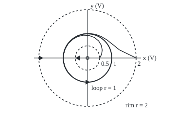

# Poincare-Bendixson: in the plane a trapped path that cannot rest must loop, and a divergence test rules loops out

Differential equations and dynamics → Nonlinear Dynamics in the Plane → Proving a loop exists, or cannot → Poincare-Bendixson

---

## General Overview

A smoke alarm's tone comes from an electronic oscillator: two capacitor voltages chasing each other round. An amplifier feeds small swings, so a swing of half a volt grows. Losses eat big swings, so a swing of 2 volts shrinks. In between, the circuit settles into a steady repeating swing.

A swing starting between half a volt and 2 volts stays in that band and never stops moving: it is trapped. In the plane, such a path must end up going round a closed loop. The Poincaré-Bendixson theorem proves it, even when the loop has no formula.

A second tool points the other way. A car's shock absorber shrinks every patch of its phase plane at a fixed rate, so no path can loop. That is Bendixson's criterion.

**In the plane, a path trapped in a closed bounded region with no resting point must approach a closed loop; and if the flow shrinks (or grows) area everywhere in a region without holes, no closed loop fits inside it.**

**What kind of fact this is:** two theorems, Bendixson's criterion proved on this card in Why it works, Poincaré-Bendixson proved in outline there with the full argument folded.

### The picture: the oscillator's ring, its rims and its loop

<p align="center"></p>

Scale: 50 units per volt, origin at the centre. Dashed: the rims; thick: the loop. Paths from (0.5, 0) and (2, 0), drawn from 0 to 4 ms, one point every 0.25 ms. Triangles: flow crossing both rims into the ring, and turning counterclockwise. Open circle: the resting point, outside the ring.

---

## The formula

Notation from [phase-portraits-and-nullclines](01-phase-portraits-and-nullclines.md): a planar system $x' = f(x, y)$, $y' = g(x, y)$ puts an arrow $F = (f, g)$ at every point, the vector field; a path is one solution traced in the plane.

The oscillator, with voltages in volts and time in milliseconds, all constants set to 1:

$$x' = x - y - x(x^2 + y^2), \qquad y' = x + y - y(x^2 + y^2).$$

In polar form, with $r$ the distance from the origin and $\theta$ the angle, it splits in two:

$$r' = r(1 - r^2), \qquad \theta' = 1.$$

**Read it aloud:** the swing's size changes at the rate $r$ times one minus $r$ squared; the phase turns at one radian per millisecond.

**Poincaré-Bendixson.** If a closed (edge included), bounded region $R$ of the plane holds no resting point (an equilibrium, where $f = g = 0$), and a path enters $R$ and never leaves, then $R$ contains a closed loop (a periodic path) that the trapped path approaches.

**Bendixson's criterion.** The divergence of the field is

$$f_x + g_y,$$

where $f_x$ is how fast $f$ changes as $x$ moves with $y$ held fixed, and $g_y$ likewise. If on a region $D$ with no holes the divergence keeps one sign and is not zero throughout any patch, no closed loop lies in $D$.

**Read it aloud:** a flow that shrinks area everywhere, or grows it everywhere, cannot go round in a loop.

The shock absorber, car body offset $p$ in cm and speed $v$ in cm/s, is $p'' + 2p' + 5p = 0$, or $p' = v$, $v' = -5p - 2v$. Its divergence is 0 + (−2) = −2 per second everywhere.

| Symbol | Plain meaning | In our example | Push it up and the answer… |
| --- | --- | --- | --- |
| $x$, $y$ | the two capacitor voltages, in V | start at (0.5, 0) or (2, 0) | — |
| $r$, $r_0$ | size of the swing: distance from the origin, in V; $r_0$ at the start | rims 0.5 and 2, loop at 1 | above 1 it shrinks |
| $\theta$ | phase: the angle, in radians | turns at 1 per ms | — |
| $t$ | time, in ms (in s for the car) | 2, 4, 8 ms | closer to the loop |
| $f$, $g$, $F$ | rates of $x$ and $y$; together the vector field | as displayed | — |
| $f_x$, $g_y$ | slope of $f$ along $x$, of $g$ along $y$; their sum is the divergence | 2 at the origin, −2 on the loop | area grows faster |
| $R$, $D$, $C$, $A$ | trapping region; a region with no holes; a loop and the patch it encloses | the ring from 0.5 to 2 | — |
| $p$, $v$ | car body offset, cm; its speed, cm/s | start (√5, 0); $5p^2 + v^2 = 25$, twice the energy per unit mass | — |

### When it holds

- **The plane only.** On a doughnut, two angles turning at rates 1 and √2 stay trapped, never rest, and never close.
- **A smooth field.** $f$ and $g$ need continuous slopes, so paths never cross or merge.
- **No resting point inside.** Drop it and the trapped path may stop: the shock absorber, trapped in its energy ellipse, spirals into rest at (0, 0).
- **For Bendixson, one sign on a region with no holes.** On the ring the sign changes, so the test is silent; round a hole, a loop encloses points the test never checked.

---

## Why it works

### Step 0: in the plane, a closed curve is a fence

A loop in the plane splits it into inside and outside, and paths cannot cross. Both theorems use this one fact.

### Step 1: the ring traps every path that enters it

On the inner rim, $r = 0.5$, the rate $r' = 0.5 × (1 − 0.25) = 0.375$ is positive: every arrow points outward, into the ring. On the outer rim, $r = 2$, it is $2 × (1 − 4) = −6$: every arrow points inward. No path can leave. The check asserts this at 360 points per rim.

### Step 2: nothing in the ring can rest

The angle turns at 1 everywhere except the origin, so the origin is the only resting point, and it lies in the hole.

### Step 3: a trapped, restless path must close up

The points a trapped path keeps coming back close to, forever, form its **limit set**, non-empty because the ring is bounded. Take a short segment the flow crosses one way (a **transversal**). The path crosses it in order: each crossing, with the path since the last, fences off the way back. So the limit set meets a transversal once at most, and with no rest in it, that forces a single closed loop.

<details>
<summary>Detailed proof</summary>

Let γ be trapped in the compact, rest-free region R, with limit set L: the points q with γ(tₙ) → q for some tₙ → ∞. L is non-empty, compact and made of whole paths. If γ crosses a transversal Σ at s1 and later at s2, the arc between them plus the segment s1 to s2 is a closed curve the flow crosses one way only, so later crossings lie beyond s2; the crossings converge, and L meets Σ at most once. Take q in L, and z in the limit set of q's path; F(z) ≠ 0 gives a transversal Σ at z. q's path lies in L and crosses Σ near z repeatedly, always at the one point L ∩ Σ, so it revisits a point: it is periodic, and γ spirals onto it.

</details>

The theorem gives a loop, not how many. The polar form shows exactly one, at $r = 1$, where $r' = 0$; a path on it returns to its start after $2\pi$ = 6.283185 ms. For the Van der Pol circuit, whose loop has no formula, the trap is the proof ([limit-cycles-and-van-der-pol](08-limit-cycles-and-van-der-pol.md)).

### Step 4: Bendixson, by Green's theorem

Suppose a closed loop $C$ lay in $D$, enclosing the patch $A$. Green's theorem ([greens-theorem](../../06-Calculus%20and%20analysis/09-Vector%20Calculus/06-greens-theorem.md)) turns the divergence over the patch into a sum round its edge:

$$\iint_A (f_x + g_y)\,dA = \oint_C (f\,dy - g\,dx).$$

The right side is flow out through the edge. Along the loop, $dx = f\,dt$ and $dy = g\,dt$, so $f\,dy - g\,dx = (fg - gf)\,dt = 0$: nothing crosses a loop made of the flow. The left side, divergence of one sign added over the patch, is not zero. Contradiction: no loop. "No holes" keeps the patch inside $D$.

For the shock absorber the left side is −2 times the area. Round the energy ellipse $5p^2 + v^2 = 25$ the edge sum is −70.248147, exactly that: flow leaks inward, so this curve is no loop, and nor is any other.

### Step 5: why chaos needs a third dimension

Steps 0 and 3 used the fence. In three dimensions a curve fences nothing: a path can pass round it. So a bounded path in space can wander forever without resting or repeating, the room chaos needs. The Lorenz system does it with three variables ([the-lorenz-system-and-strange-attractors](../11-Discrete%20Dynamics%20and%20Chaos/06-the-lorenz-system-and-strange-attractors.md)).

<details>
<summary>Divergence as shrinkage, seen directly</summary>

Carry a small triangle of starting states along the shock absorber's flow for 1 s. Its area is multiplied by 0.135335, which is $e^{-2}$: area shrinks at the rate the divergence gives.

</details>

---

## Worked numbers, by hand

| Step | Arithmetic | Value |
| --- | --- | --- |
| inner rim | 0.5 × (1 − 0.5^2) | 0.375: outward, into the ring |
| outer rim | 2 × (1 − 2^2) | −6: inward, into the ring |
| swing from 0.5 V at 2 ms | 1 ÷ √(1 + 3e^(−4)) | 0.973609 V |
| the loop's lap | 2π ÷ 1 | **6.283185 ms** |
| shock divergence | ∂v/∂p + ∂(−5p − 2v)/∂v = 0 − 2 | **−2 per s** |
| edge sum round the ellipse | −2 × π × √5 × 5 | −70.248147, not 0 |

The alarm settles to a 1-volt swing repeating every 6.283185 ms; the shock absorber cannot ring on forever. Row 3 solves $r' = r(1 - r^2)$ as a separable equation: $r^2 = 1 / (1 + (1/r_0^2 - 1)e^{-2t})$.

### What breaks if you drop a piece

| Mistake | Comes out at | What went wrong |
| --- | --- | --- |
| A rest inside: shock absorber in its ellipse | energy 5p^2 + v^2 is 25, 0.815529, 0.011284 at 0, 2, 4 s | It rests at (0, 0): no loop |
| Off the plane: a doughnut, angles at rates 1 and √2 | closest return in 1000 laps 0.002255 rad | No fence: trapped, restless, never closes |
| Bendixson on the ring | divergence 2, 1, −2, −14 at r = 0, 0.5, 1, 2 | Sign changes: silent, yet a loop exists |

---

## Code, from first principles, and it actually runs

Road one is the closed form for the swing; road two steps the $x, y$ system by Runge-Kutta 4 (four slope samples per step, [runge-kutta-four](../05-Numerical%20Evolution/04-runge-kutta-four.md)) and never uses polar form. Halving the step cuts the error about 16-fold: fourth order. For Bendixson, divergence by differences meets a flowed triangle's area ratio, and Green's edge sum meets its area sum.

### Python

```python
# Poincare-Bendixson and Bendixson's criterion -- the check behind the card.  Only
# math primitives imported.  Oscillator r' = r(1 - r^2), angle' = 1, in x, y (volts, ms);
# shock absorber p' = v, v' = -5p - 2v (cm, s).  Two roads each time, see the card.
from math import sin, cos, exp, sqrt, pi
def ring(p): x, y = p; s = x * x + y * y; return (x - y - x * s, x + y - y * s)
def shock(p): x, v = p; return (v, -5 * x - 2 * v)
def add(p, k, c): return (p[0] + c * k[0], p[1] + c * k[1])
def rk4(F, p, h, n):                                     # Runge-Kutta 4, written out
    for _ in range(n):
        k1 = F(p); k2 = F(add(p, k1, h / 2)); k3 = F(add(p, k2, h / 2)); k4 = F(add(p, k3, h))
        p = (p[0] + h * (k1[0] + 2 * k2[0] + 2 * k3[0] + k4[0]) / 6, p[1] + h * (k1[1] + 2 * k2[1] + 2 * k3[1] + k4[1]) / 6)
    return p
def closed(r0, t): return 1 / sqrt(1 + (1 / r0 ** 2 - 1) * exp(-2 * t))
def div(F, p, e=1e-5):                                   # f_x + g_y by central differences
    return (F((p[0] + e, p[1]))[0] - F((p[0] - e, p[1]))[0] + F((p[0], p[1] + e))[1] - F((p[0], p[1] - e))[1]) / (2 * e)
def flux(F, a, b, n=4000):                               # line integral of f dy - g dx round an ellipse
    S = [2 * pi * (i + 0.5) / n for i in range(n)]
    return sum((F((a * cos(s), b * sin(s)))[0] * b * cos(s) + F((a * cos(s), b * sin(s)))[1] * a * sin(s)) * 2 * pi / n for s in S)
def disk(F, R, n=1000, m=32):                            # double integral of the divergence over a disk
    return sum(div(F, (r * cos(s), r * sin(s))) * r * (R / n) * (2 * pi / m)
               for r in [(i + 0.5) * R / n for i in range(n)] for s in [2 * pi * (j + 0.5) / m for j in range(m)])
def rad(r, a): x, y = r * cos(a), r * sin(a); f, g = ring((x, y)); return (x * f + y * g) / r, (x * g - y * f) / r ** 2
def area(P): return abs((P[1][0] - P[0][0]) * (P[2][1] - P[0][1]) - (P[2][0] - P[0][0]) * (P[1][1] - P[0][1])) / 2
def f6(xs): return " ".join(f"{x:.6f}" for x in xs)
print("oscillator r' = r(1 - r^2), angle' = 1; shock absorber p'' + 2p' + 5p = 0")
rims = [[rad(R, 2 * pi * j / 360) for j in range(360)] for R in (0.5, 2.0)]
print("rims r = 0.5, 2: radial rate", " ".join(f"{min(q[0] for q in w):.6f}..{max(q[0] for q in w):.6f}" for w in rims)
      + f"; angular rate min {min(q[1] for w in rims for q in w):.6f}")
ts, rk = (2, 4, 8), {}
for r0 in (0.5, 2.0):
    rk[r0] = [sqrt(sum(c * c for c in rk4(ring, (r0, 0.0), 0.01, 100 * t))) for t in ts]
    print(f"from r = {r0}, r at t = 2, 4, 8 ms: closed {f6(closed(r0, t) for t in ts)}")
    print(f"from r = {r0}, r at t = 2, 4, 8 ms: RK4    {f6(rk[r0])}")
err = [abs(sqrt(sum(c * c for c in rk4(ring, (0.5, 0.0), h, round(2 / h)))) - closed(0.5, 2)) for h in (0.2, 0.1)]
print(f"RK4 error at t = 2 ms, h = 0.2, 0.1, in millionths: {err[0] * 1e6:.3f} {err[1] * 1e6:.3f}; ratio {err[0] / err[1]:.2f}")
back = rk4(ring, (1.0, 0.0), 2 * pi / 6283, 6283)
print(f"start on the cycle at (1, 0): after {2 * pi:.6f} ms the gap is {sqrt((back[0] - 1) ** 2 + back[1] ** 2):.6f}")
print("oscillator divergence at r = 0, 0.5, 1, 2:", f6(div(ring, (r, 0.0)) for r in (0, 0.5, 1, 2)))
g1, g2 = (flux(ring, 0.5, 0.5), disk(ring, 0.5)), (flux(ring, 1, 1), disk(ring, 1))
print(f"Green, circle r = 0.5: line {g1[0]:.5f} area {g1[1]:.5f}; cycle r = 1: line {g2[0]:.5f} area {g2[1]:.5f}")
dv = [div(shock, p) for p in ((0, 0), (3, -4), (-10, 7))]
T0 = ((1.0, 0.0), (1.01, 0.0), (1.0, 0.01)); ratio = area([rk4(shock, p, 0.001, 1000) for p in T0]) / area(T0)
print(f"shock divergence at (0,0), (3,-4), (-10,7): {f6(dv)}; patch area after 1 s x {ratio:.6f}, e^(-2) = {exp(-2):.6f}")
ell = (flux(shock, sqrt(5), 5), -2 * pi * sqrt(5) * 5)
print(f"ellipse 5p^2 + v^2 = 25: line integral {ell[0]:.6f}; -2 x area {ell[1]:.6f}")
E = [5 * p[0] ** 2 + p[1] ** 2 for p in (rk4(shock, (sqrt(5), 0.0), 0.001, 1000 * t) for t in (0, 2, 4))]
print(f"mistake 1, rest inside: energy 5p^2 + v^2 at t = 0, 2, 4 s: {f6(E)}")
gap = min(abs(k * sqrt(2) - round(k * sqrt(2))) * 2 * pi for k in range(1, 1001))
print(f"mistake 2, doughnut angles' = 1, sqrt 2: closest return in 1000 laps {gap:.6f} rad, not 0")
X = lambda p: f"{180 + 50 * p[0]:.1f},{120 - 50 * p[1]:.1f}"
for r0 in (0.5, 2.0):
    print(f"figure, from r = {r0}, t = 0 to 4 ms every 0.25:", " ".join(X(rk4(ring, (r0, 0.0), 0.01, 25 * k)) for k in range(17)))
assert max(abs(rk[r0][i] - closed(r0, t)) for r0 in rk for i, t in enumerate(ts)) < 1e-8 and min(q[0] for q in rims[0]) > 0 > max(q[0] for q in rims[1])
assert 14 < err[0] / err[1] < 18                         # error falls 16-fold as h halves: order 4
assert abs(ratio - exp(dv[1] * 1)) < 1e-6                # Liouville: area shrinks at the divergence
assert abs(g1[0] - g1[1]) < 1e-5 and abs(ell[0] - ell[1]) < 1e-6   # Green's two sides agree
print("ALL CHECKS PASS")
```

**Ran 2026-09-28 on macOS, Python 3.14.6, standard library only. All checks passed. Output, pasted from the run:**

```
oscillator r' = r(1 - r^2), angle' = 1; shock absorber p'' + 2p' + 5p = 0
rims r = 0.5, 2: radial rate 0.375000..0.375000 -6.000000..-6.000000; angular rate min 1.000000
from r = 0.5, r at t = 2, 4, 8 ms: closed 0.973609 0.999497 1.000000
from r = 0.5, r at t = 2, 4, 8 ms: RK4    0.973609 0.999497 1.000000
from r = 2.0, r at t = 2, 4, 8 ms: closed 1.006940 1.000126 1.000000
from r = 2.0, r at t = 2, 4, 8 ms: RK4    1.006940 1.000126 1.000000
RK4 error at t = 2 ms, h = 0.2, 0.1, in millionths: 45.855 2.842; ratio 16.13
start on the cycle at (1, 0): after 6.283185 ms the gap is 0.000000
oscillator divergence at r = 0, 0.5, 1, 2: 2.000000 1.000000 -2.000000 -14.000000
Green, circle r = 0.5: line 1.17810 area 1.17810; cycle r = 1: line 0.00000 area 0.00000
shock divergence at (0,0), (3,-4), (-10,7): -2.000000 -2.000000 -2.000000; patch area after 1 s x 0.135335, e^(-2) = 0.135335
ellipse 5p^2 + v^2 = 25: line integral -70.248147; -2 x area -70.248147
mistake 1, rest inside: energy 5p^2 + v^2 at t = 0, 2, 4 s: 25.000000 0.815529 0.011284
mistake 2, doughnut angles' = 1, sqrt 2: closest return in 1000 laps 0.002255 rad, not 0
figure, from r = 0.5, t = 0 to 4 ms every 0.25: 205.0,120.0 208.9,112.6 210.3,103.5 208.3,93.6 202.8,84.5 194.1,77.5 183.3,73.5 171.5,72.9 159.7,75.7 149.1,81.7 140.3,90.4 134.1,101.0 130.7,113.0 130.4,125.4 133.2,137.5 139.0,148.6 147.3,157.8
figure, from r = 2.0, t = 0 to 4 ms every 0.25: 280.0,120.0 245.6,103.2 231.6,91.8 220.1,82.6 208.5,75.6 196.3,71.0 183.6,69.2 171.0,70.2 159.0,74.2 148.5,80.9 139.8,90.0 133.7,100.9 130.5,112.9 130.3,125.4 133.2,137.5 139.0,148.6 147.3,157.8
ALL CHECKS PASS
```

### Rust

Same numbers, same labels, built with `rustc --edition 2021 -O`.

```rust
// Poincare-Bendixson and Bendixson's criterion -- the same check as the Python, in
// Rust, std only.  Oscillator r' = r(1 - r^2), angle' = 1, in x, y (volts, ms);
// shock absorber p' = v, v' = -5p - 2v (cm, s).  Two roads each time, see the card.
use std::f64::consts::PI;
type P = (f64, f64);
fn ring(p: P) -> P { let (x, y) = p; let s = x * x + y * y; (x - y - x * s, x + y - y * s) }
fn shock(p: P) -> P { let (x, v) = p; (v, -5.0 * x - 2.0 * v) }
fn add(p: P, k: P, c: f64) -> P { (p.0 + c * k.0, p.1 + c * k.1) }
fn rk4(f: fn(P) -> P, mut p: P, h: f64, n: usize) -> P {     // Runge-Kutta 4, written out
    for _ in 0..n {
        let k1 = f(p); let k2 = f(add(p, k1, h / 2.0)); let k3 = f(add(p, k2, h / 2.0)); let k4 = f(add(p, k3, h));
        p = (p.0 + h * (k1.0 + 2.0 * k2.0 + 2.0 * k3.0 + k4.0) / 6.0, p.1 + h * (k1.1 + 2.0 * k2.1 + 2.0 * k3.1 + k4.1) / 6.0);
    }
    p
}
fn closed(r0: f64, t: f64) -> f64 { 1.0 / (1.0 + (1.0 / (r0 * r0) - 1.0) * (-2.0 * t).exp()).sqrt() }
fn div(f: fn(P) -> P, p: P) -> f64 {                          // f_x + g_y by central differences
    let e = 1e-5;
    (f((p.0 + e, p.1)).0 - f((p.0 - e, p.1)).0 + f((p.0, p.1 + e)).1 - f((p.0, p.1 - e)).1) / (2.0 * e)
}
fn flux(f: fn(P) -> P, a: f64, b: f64) -> f64 {              // line integral of f dy - g dx round an ellipse
    let n = 4000;
    (0..n).map(|i| { let s = 2.0 * PI * (i as f64 + 0.5) / n as f64; let q = f((a * s.cos(), b * s.sin()));
        (q.0 * b * s.cos() + q.1 * a * s.sin()) * 2.0 * PI / n as f64 }).sum()
}
fn disk(f: fn(P) -> P, big_r: f64) -> f64 {                  // double integral of the divergence over a disk
    let (n, m) = (1000, 32); let mut tot = 0.0;
    for i in 0..n { let r = (i as f64 + 0.5) * big_r / n as f64;
        for j in 0..m { let s = 2.0 * PI * (j as f64 + 0.5) / m as f64;
            tot += div(f, (r * s.cos(), r * s.sin())) * r * (big_r / n as f64) * (2.0 * PI / m as f64); } }
    tot
}
fn rad(r: f64, a: f64) -> P { let (x, y) = (r * a.cos(), r * a.sin()); let (f, g) = ring((x, y)); ((x * f + y * g) / r, (x * g - y * f) / (r * r)) }
fn area(q: &[P]) -> f64 { ((q[1].0 - q[0].0) * (q[2].1 - q[0].1) - (q[2].0 - q[0].0) * (q[1].1 - q[0].1)).abs() / 2.0 }
fn f6(xs: &[f64]) -> String { xs.iter().map(|x| format!("{:.6}", x)).collect::<Vec<_>>().join(" ") }
fn norm(p: P) -> f64 { (p.0 * p.0 + p.1 * p.1).sqrt() }
fn main() {
    println!("oscillator r' = r(1 - r^2), angle' = 1; shock absorber p'' + 2p' + 5p = 0");
    let rims: Vec<Vec<P>> = [0.5, 2.0].iter().map(|&r| (0..360).map(|j| rad(r, 2.0 * PI * j as f64 / 360.0)).collect()).collect();
    let lo = |w: &Vec<P>| w.iter().map(|q| q.0).fold(f64::INFINITY, f64::min);
    let hi = |w: &Vec<P>| w.iter().map(|q| q.0).fold(f64::NEG_INFINITY, f64::max);
    let amin = rims.iter().flatten().map(|q| q.1).fold(f64::INFINITY, f64::min);
    println!("rims r = 0.5, 2: radial rate {:.6}..{:.6} {:.6}..{:.6}; angular rate min {:.6}", lo(&rims[0]), hi(&rims[0]), lo(&rims[1]), hi(&rims[1]), amin);
    let ts = [2.0, 4.0, 8.0]; let mut worst: f64 = 0.0;
    for r0 in [0.5, 2.0] {
        let c: Vec<f64> = ts.iter().map(|&t| closed(r0, t)).collect();
        let k: Vec<f64> = ts.iter().map(|&t| norm(rk4(ring, (r0, 0.0), 0.01, (100.0 * t) as usize))).collect();
        for i in 0..3 { worst = worst.max((k[i] - c[i]).abs()) }
        println!("from r = {:.1}, r at t = 2, 4, 8 ms: closed {}", r0, f6(&c));
        println!("from r = {:.1}, r at t = 2, 4, 8 ms: RK4    {}", r0, f6(&k));
    }
    let err: Vec<f64> = [0.2, 0.1].iter().map(|&h: &f64| (norm(rk4(ring, (0.5, 0.0), h, (2.0 / h).round() as usize)) - closed(0.5, 2.0)).abs()).collect();
    println!("RK4 error at t = 2 ms, h = 0.2, 0.1, in millionths: {:.3} {:.3}; ratio {:.2}", err[0] * 1e6, err[1] * 1e6, err[0] / err[1]);
    let back = rk4(ring, (1.0, 0.0), 2.0 * PI / 6283.0, 6283);
    println!("start on the cycle at (1, 0): after {:.6} ms the gap is {:.6}", 2.0 * PI, norm((back.0 - 1.0, back.1)));
    let dr: Vec<f64> = [0.0, 0.5, 1.0, 2.0].iter().map(|&r| div(ring, (r, 0.0))).collect();
    println!("oscillator divergence at r = 0, 0.5, 1, 2: {}", f6(&dr));
    let (g1, g2) = ((flux(ring, 0.5, 0.5), disk(ring, 0.5)), (flux(ring, 1.0, 1.0), disk(ring, 1.0)));
    println!("Green, circle r = 0.5: line {:.5} area {:.5}; cycle r = 1: line {:.5} area {:.5}", g1.0, g1.1, g2.0, g2.1);
    let dv: Vec<f64> = [(0.0, 0.0), (3.0, -4.0), (-10.0, 7.0)].iter().map(|&p| div(shock, p)).collect();
    let t0 = [(1.0, 0.0), (1.01, 0.0), (1.0, 0.01)];
    let t1: Vec<P> = t0.iter().map(|&p| rk4(shock, p, 0.001, 1000)).collect();
    let ratio = area(&t1) / area(&t0);
    println!("shock divergence at (0,0), (3,-4), (-10,7): {}; patch area after 1 s x {:.6}, e^(-2) = {:.6}", f6(&dv), ratio, (-2.0f64).exp());
    let ell = (flux(shock, 5f64.sqrt(), 5.0), -2.0 * PI * 5f64.sqrt() * 5.0);
    println!("ellipse 5p^2 + v^2 = 25: line integral {:.6}; -2 x area {:.6}", ell.0, ell.1);
    let e: Vec<f64> = [0, 2, 4].iter().map(|&t| { let p = rk4(shock, (5f64.sqrt(), 0.0), 0.001, 1000 * t); 5.0 * p.0 * p.0 + p.1 * p.1 }).collect();
    println!("mistake 1, rest inside: energy 5p^2 + v^2 at t = 0, 2, 4 s: {}", f6(&e));
    let gap = (1..1001).map(|k| { let z = k as f64 * 2f64.sqrt(); (z - z.round()).abs() * 2.0 * PI }).fold(f64::INFINITY, f64::min);
    println!("mistake 2, doughnut angles' = 1, sqrt 2: closest return in 1000 laps {:.6} rad, not 0", gap);
    for r0 in [0.5, 2.0] {
        let pts: Vec<String> = (0..17).map(|k| { let p = rk4(ring, (r0, 0.0), 0.01, 25 * k); format!("{:.1},{:.1}", 180.0 + 50.0 * p.0, 120.0 - 50.0 * p.1) }).collect();
        println!("figure, from r = {:.1}, t = 0 to 4 ms every 0.25: {}", r0, pts.join(" "));
    }
    assert!(worst < 1e-8 && lo(&rims[0]) > 0.0 && hi(&rims[1]) < 0.0);   // RK4 meets the closed form; both rims point in
    assert!(err[0] / err[1] > 14.0 && err[0] / err[1] < 18.0);  // error falls 16-fold as h halves: order 4
    assert!((ratio - (dv[1] * 1.0).exp()).abs() < 1e-6);         // Liouville: area shrinks at the divergence
    assert!((g1.0 - g1.1).abs() < 1e-5 && (ell.0 - ell.1).abs() < 1e-6);   // Green's two sides agree
    println!("ALL CHECKS PASS");
}
```

**Ran 2026-09-28 on macOS, rustc 1.98.1, no crates. All checks passed. Output, pasted from the run:**

```
oscillator r' = r(1 - r^2), angle' = 1; shock absorber p'' + 2p' + 5p = 0
rims r = 0.5, 2: radial rate 0.375000..0.375000 -6.000000..-6.000000; angular rate min 1.000000
from r = 0.5, r at t = 2, 4, 8 ms: closed 0.973609 0.999497 1.000000
from r = 0.5, r at t = 2, 4, 8 ms: RK4    0.973609 0.999497 1.000000
from r = 2.0, r at t = 2, 4, 8 ms: closed 1.006940 1.000126 1.000000
from r = 2.0, r at t = 2, 4, 8 ms: RK4    1.006940 1.000126 1.000000
RK4 error at t = 2 ms, h = 0.2, 0.1, in millionths: 45.855 2.842; ratio 16.13
start on the cycle at (1, 0): after 6.283185 ms the gap is 0.000000
oscillator divergence at r = 0, 0.5, 1, 2: 2.000000 1.000000 -2.000000 -14.000000
Green, circle r = 0.5: line 1.17810 area 1.17810; cycle r = 1: line 0.00000 area 0.00000
shock divergence at (0,0), (3,-4), (-10,7): -2.000000 -2.000000 -2.000000; patch area after 1 s x 0.135335, e^(-2) = 0.135335
ellipse 5p^2 + v^2 = 25: line integral -70.248147; -2 x area -70.248147
mistake 1, rest inside: energy 5p^2 + v^2 at t = 0, 2, 4 s: 25.000000 0.815529 0.011284
mistake 2, doughnut angles' = 1, sqrt 2: closest return in 1000 laps 0.002255 rad, not 0
figure, from r = 0.5, t = 0 to 4 ms every 0.25: 205.0,120.0 208.9,112.6 210.3,103.5 208.3,93.6 202.8,84.5 194.1,77.5 183.3,73.5 171.5,72.9 159.7,75.7 149.1,81.7 140.3,90.4 134.1,101.0 130.7,113.0 130.4,125.4 133.2,137.5 139.0,148.6 147.3,157.8
figure, from r = 2.0, t = 0 to 4 ms every 0.25: 280.0,120.0 245.6,103.2 231.6,91.8 220.1,82.6 208.5,75.6 196.3,71.0 183.6,69.2 171.0,70.2 159.0,74.2 148.5,80.9 139.8,90.0 133.7,100.9 130.5,112.9 130.3,125.4 133.2,137.5 139.0,148.6 147.3,157.8
ALL CHECKS PASS
```

> [!TIP]
> **Try changing**
> - **Double the damping, v' = −5p − 4v.** Guess first: divergence −4 per s, area ratio e^(−4) after 1 s.
> - **Flip the growth term, r' = −r(1 − r^2).** Guess first: both rims' arrows reverse and the loop at 1 repels.

---

## The usual mistake

> [!warning]
> **Reading Poincaré-Bendixson as "a trap contains a loop".** The region must hold no resting point: the shock absorber is trapped in its ellipse yet spirals into rest. Trapping regions are built as rings, with the rest cut out.
>
> - **Taking Bendixson backwards.** A sign change proves nothing either way. Multiplying the field by a well-chosen positive function first (Dulac's criterion) can restore one sign.

---

## Where you meet it in real life

- **Oscillator circuits.** Tone generators and radio transmitters feed small swings and damp large ones: a trap, so a steady tone ([limit-cycles-and-van-der-pol](08-limit-cycles-and-van-der-pol.md)).
- **Damped machines.** Shock absorbers and door closers shrink area, so cannot oscillate forever; the energy view is [lyapunov-functions](04-lyapunov-functions.md).

> **Say it back**
> In the plane a closed curve is a fence, and paths cannot cross. So a path trapped in a bounded region with no resting point must approach a closed loop. The oscillator's ring from 0.5 to 2 volts traps every path and holds no rest, so it holds the loop at 1 volt. A divergence of one sign on a region without holes makes a loop impossible, by Green's theorem: the shock absorber, at −2 per second, has none. In three dimensions the fence is gone, and chaos becomes possible.

---

## What this builds on

- [limit-cycles-and-van-der-pol](08-limit-cycles-and-van-der-pol.md): what a limit cycle is, and the circuit whose loop has no formula.
- [greens-theorem](../../06-Calculus%20and%20analysis/09-Vector%20Calculus/06-greens-theorem.md): the edge sum equals the area sum, which is all Bendixson needs.

## Where this goes next

- [the-lorenz-system-and-strange-attractors](../11-Discrete%20Dynamics%20and%20Chaos/06-the-lorenz-system-and-strange-attractors.md): three variables, a bounded restless path that never closes.
- [bifurcations-of-equilibria](10-bifurcations-of-equilibria.md): how a loop like the oscillator's is born from a resting point as a setting is turned.

In the plane a trapped path ends at a rest, a loop, or a cycle of rests joined by paths; the Lorenz system shows what else a third variable allows.

---

## Sources

Verified 2026-09-28: every link below resolves to the publisher's or author's page.

- Hirsch, Morris W., Stephen Smale, and Robert L. Devaney. *Differential Equations, Dynamical Systems, and an Introduction to Chaos*, 3rd ed. Academic Press, 2013. [Publisher page](https://shop.elsevier.com/books/differential-equations-dynamical-systems-and-an-introduction-to-chaos/hirsch/978-0-12-382010-5). Chapter 10: the proof by transversals.
- Strogatz, Steven H. *Nonlinear Dynamics and Chaos*, 3rd ed. CRC Press, 2024. [Publisher page](https://www.routledge.com/Nonlinear-Dynamics-and-Chaos-With-Applications-to-Physics-Biology-Chemistry-and-Engineering/Strogatz/p/book/9780367026509). Chapter 7: trapping rings and the divergence test.
- Teschl, Gerald. *Ordinary Differential Equations and Dynamical Systems*. AMS Graduate Studies in Mathematics 140. [Author's page, with the text](https://www.mat.univie.ac.at/~gerald/ftp/book-ode/). Chapter 7: planar theory in full.
- Poincaré, Henri. "Mémoire sur les courbes définies par une équation différentielle." *Journal de Mathématiques Pures et Appliquées*, 1881. [NUMDAM](https://www.numdam.org/item/JMPA_1881_3_7__375_0/). Where limit cycles began.
