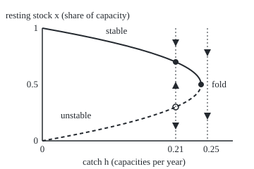
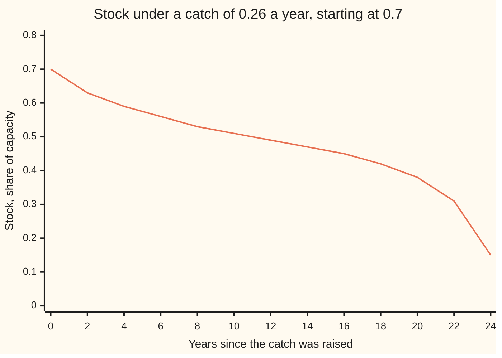

# Bifurcations: turn a dial slowly and a resting state can vanish, swap stability or split in two

[Syllabus](../../../SYLLABUS.md) → [Differential equations and dynamics](../README.md) → [Nonlinear Dynamics in the Plane](../README.md#s06) → Bifurcations

---

## General Overview

A fish stock grows by the logistic law: fast when sparse, slow near the most the lake can hold ([Logistic growth](../01-Rate%20Equations/07-logistic-growth.md)). Measure the stock as a share of that capacity, so a full lake is 1. At half capacity it grows fastest: a quarter of capacity a year.

A fleet takes a fixed catch every year. At 21% of capacity a year the stock settles at 70%, where growth replaces the catch: a resting state, or **equilibrium** (a rest, for short). At 24% it settles at 60%; at 25%, at 50%. At 26% there is no resting stock at all, and a stock at 70% reaches zero 24.805 years later.

The resting level did not glide to zero; it stood at half capacity, then vanished. A slow turn of a dial that changes the number or stability of resting states is a **bifurcation**. The dial is a **parameter**: a number held fixed while the system runs.

**A resting state can only vanish, split or swap stability where the rate's slope at that rest is zero; near such a point a typical one-variable system looks like one of three short formulas, and the fishery is the first.**

**What kind of fact this is:** a theorem. The zero-slope condition is proved in Why it works; that three forms cover the typical cases is sketched in a folded note; the planar Hopf bifurcation is stated in words, its proof in the sources.

### The picture: resting stock against the catch

<p align="center"></p>

Scale: 900 units per capacity-per-year across from 60; 160 units per capacity up from 200. Dotted lines mark catches 0.21 and 0.26; arrows show where the stock moves.

---

## The formula

A dash on a letter means its rate: $x'$ is how fast the stock changes, in capacities per year. The fishery's rate law is

$$x' = f(x) = x(1 - x) - h$$

**Read it aloud:** the stock's rate of change is logistic growth minus a fixed yearly catch.

Setting the rate to zero gives the rests:

$$x = \tfrac12 \pm \sqrt{\tfrac14 - h}$$

**Read it aloud:** the rests sit either side of half capacity and close in as the catch nears a quarter.

The square root needs a number zero or more: two rests for $h$ below 1/4, one at 1/4, none above. Three short formulas, the **normal forms**, capture every typical way a rest changes as a dial $\mu$ passes zero:

$$\text{saddle-node: } u' = \mu - u^2 \qquad \text{transcritical: } u' = \mu u - u^2 \qquad \text{pitchfork: } u' = \mu u - u^3$$

**Read it aloud:** two rests meet and vanish; two rests cross and trade stability; one rest splits into three.

| Symbol | Plain meaning | In our example | Push it up and the answer… |
| --- | --- | --- | --- |
| $x$, $x_0$ | stock as a share of capacity; $x_0$ a starting value | rests 0.3 and 0.7 at catch 0.21 | above the upper rest, it falls back |
| $h$, $h_0$ | fixed catch, capacities per year; $h_0$ a starting value | 0.21; fold at 0.25 | rests draw together, then vanish |
| $t$ | time, in years | 24.805 to collapse at catch 0.26 | — |
| $f$ | the rate law, growth minus catch | $x(1-x) - h$ | — |
| $u$ | stock minus one half | 0 at half capacity | — |
| $a$, $\pi$ | distance past the fold, $\sqrt{h - \tfrac14}$; $\pi$ the circle constant | 0.1 at catch 0.26 | collapse within $\pi/a$ years, sooner |
| $\mu$ | the dial in a normal form | 0.25 and −0.25 | crossing zero changes the rests |
| $E$ | catch as a share of the stock, per year | 0.5 | above 1, the stock dies out |

### When it holds

- **One number is the state, and the law ignores the clock.** A catch that changes with the season makes the law depend on the date, and this diagram no longer applies.
- **The dial turns slowly.** The diagram shows where the stock settles, not how fast.
- **The fold is typical: the rate curves at the rest and the dial moves it.** A symmetry, or a rest the dial cannot move, gives a pitchfork or transcritical change.
- **No randomness.** Random shocks (wing 11) can push a stock below the unstable rest before the fold.

---

## Why it works

### Step 0: a rest with a nonzero slope cannot vanish

Near a rest the rate is nearly a straight line: slope times distance from the rest. Nudge the dial and the line shifts, but a tilted line still crosses zero nearby, so the rest moves and survives with its stability. Rests can meet, split or trade stability only where the slope is zero.

<details>
<summary>Detailed proof: the rest persists when the slope is not zero</summary>

Let $f(x_0, h_0) = 0$ with slope $s < 0$ there. By continuity the slope stays below $s/2$ in a box around the point, so the rate is negative a little above $x_0$ and positive a little below. Continuity keeps both signs for catches near $h_0$. The intermediate value theorem gives a zero between; the slope below $s/2$ makes it unique and stable. The case $s > 0$ is the same. This is the implicit function theorem in one dimension.

</details>

### Step 1: complete the square to see the fold

With $u = x - \tfrac12$,

$$x(1 - x) - h = \left(\tfrac14 - h\right) - u^2 .$$

This is the saddle-node normal form exactly, with dial $\mu = \tfrac14 - h$. Below catch 1/4 there are two rests, $u = \pm\sqrt{\tfrac14 - h}$; at 1/4 they meet at half capacity; above it the rate is negative for every stock.

### Step 2: the sign of the slope decides stability

The slope of the rate is $1 - 2x$. At the upper rest it is negative: a stock above falls back, one below rises, so the rest attracts ([Linearisation](02-linearisation-and-the-jacobian.md) makes the test exact). The lower rest has the opposite slope and repels. At catch 0.21 the slopes are −0.40 and +0.40; at 0.24, −0.20 and +0.20. Both shrink toward zero: Step 0's warning sign.

### Step 3: past the fold, the collapse time in closed form

Above the fold write $a = \sqrt{h - \tfrac14}$, and the law is $u' = -(a^2 + u^2)$. The angle $\arctan(u/a)$ then changes at rate $(u'/a)/(1 + u^2/a^2) = -a$, a steady fall. The time from a starting stock $x_0$ down to a stock $x$ is

$$t = \frac{\arctan\!\big((x_0 - \tfrac12)/a\big) - \arctan\!\big((x - \tfrac12)/a\big)}{a}.$$

The angle stays between $-\pi/2$ and $\pi/2$, so no stock survives $\pi / a$ years. Near the fold most of that time is spent near half capacity, where the rest was.

### Step 4: the other two normal forms

**Transcritical.** Take a fixed share $E$ of the stock a year instead. The law $x' = x(1 - E - x)$ is the form $\mu x - x^2$ with $\mu = 1 - E$. Zero is always a rest; the other is $1 - E$. As $E$ passes 1 they cross and trade stability; the stock fades gradually.

**Pitchfork.** If the law treats $u$ and $-u$ alike, its simplest form is $\mu u - u^3$. Below $\mu = 0$ the only rest is 0, stable. Above, 0 turns unstable and stable rests appear at $\pm\sqrt{\mu}$: a loaded column buckling left or right.

<details>
<summary>Why these three are all the typical cases</summary>

Expand the rate in $u$ and the dial at a rest with zero slope. If the dial moves the rate and the rate curves, a dial term minus a $u^2$ term leads: after rescaling, the saddle-node. If the rest survives every dial value, the dial term is gone: $\mu u - u^2$, transcritical. If the law is also odd, the $u^2$ term is gone too: pitchfork.

</details>

### Step 5: in the plane, a spiral point can birth a cycle

With two variables a rest can be a **spiral point**: nearby motion winds around it, and its linearised eigenvalues are complex, a growth rate (real part) and a turning rate (imaginary part). Turn the dial so the growth rate passes from negative to positive while the turning rate stays away from zero. The spiral turns from winding in to winding out. Typically a small stable limit cycle is born, its radius growing like the square root of the dial's distance past the crossing; otherwise a small unstable cycle shrinks onto the point and vanishes. The cubic terms decide which (Kuznetsov). That is the **Hopf bifurcation**. The polar model of [Limit cycles](08-limit-cycles-and-van-der-pol.md) with a dial, $r' = r(\mu - r^2)$, $\theta' = 1$, shows the first case: a cycle of radius $\sqrt{\mu}$ once $\mu > 0$. Van der Pol's cycle appears at full size, radius about 2: a degenerate case.

---

## Worked numbers, by hand

| Step | Arithmetic | Value |
| --- | --- | --- |
| rests at catch 0.21 | 0.5 ± √(0.25 − 0.21) = 0.5 ± 0.2 | 0.3 and 0.7 |
| their slopes | 1 − 2 × 0.3, 1 − 2 × 0.7 | +0.40 and −0.40 |
| the fold | rests meet where 0.25 − h = 0 | h = 0.25, x = 0.5 |
| catch 0.26: distance past the fold | a = √(0.26 − 0.25) | 0.1 |
| from 0.7 to half capacity | (arctan 2 − arctan 0) / 0.1 | 11.071 years |
| from 0.7 to zero | (arctan 2 + arctan 5) / 0.1 | **24.805 years** |

A catch one point above the maximum sustainable yield empties the lake in 24.805 years; for the first 11.071 the stock stays above half capacity.

### The picture: the slow start of a collapse



The line is Step 3's closed form. It flattens near 0.5, where the rest used to be, then drops.

### What breaks if you drop a piece

| Mistake | Comes out at | What went wrong |
| --- | --- | --- |
| Cutting back to 0.21 with the stock at 0.29 | zero after 7.166 years anyway | below the unstable rest 0.3 |
| Fishing at exactly 0.25 | from 0.49, zero after 98.00 years | the fold's rest attracts from above only |
| Reading the slow first decade as a gentle trend | half capacity at 11.071 years, zero at 24.805 | the lingering is the lost rest's ghost |

The code prints all three.

---

## Code, from first principles, and it actually runs

Two roads to every rest and collapse time. Rests: the square-root formula, and bisection (halving an interval where the rate changes sign). Stability: the slope formula, and a difference quotient. Collapse times: the arctangent formula, and Runge-Kutta 4 (a stepping rule sampling the rate four times per step) at two step sizes.

### Python

```python
# Bifurcations -- the check behind the card.  Fishery x' = x(1 - x) - h: stock x as a
# fraction of capacity, catch h in capacities per year, time in years.
from math import sqrt, sin, cos, log, pi

def f(x, h): return x * (1 - x) - h
def bisect(g, lo, hi):                       # a root of g where its sign changes
    for _ in range(200):
        mid = (lo + hi) / 2
        if (g(lo) < 0) == (g(mid) < 0): lo = mid
        else: hi = mid
    return (lo + hi) / 2
def atan(y): return bisect(lambda a: sin(a) - y * cos(a), -pi / 2 + 1e-12, pi / 2 - 1e-12)
def run(x, h, dt, t_end, marks):             # RK4 steps; times x first falls through each mark
    t, hits = 0.0, {}
    while t < t_end - 1e-9 and x > 0:
        k1 = f(x, h); k2 = f(x + dt * k1 / 2, h); k3 = f(x + dt * k2 / 2, h); k4 = f(x + dt * k3, h)
        y = x + dt * (k1 + 2 * k2 + 2 * k3 + k4) / 6
        for m in marks:
            if y <= m < x: hits[m] = t + dt * (x - m) / (x - y)
        x, t = y, t + dt
    return x, hits

slope = lambda x, h: (f(x + 1e-6, h) - f(x - 1e-6, h)) / 2e-6    # difference quotient, not 1 - 2x
for h in (0.21, 0.24):
    lo, hi = (1 - sqrt(1 - 4 * h)) / 2, (1 + sqrt(1 - 4 * h)) / 2
    blo, bhi = bisect(lambda x: f(x, h), 0, 0.5), bisect(lambda x: f(x, h), 0.5, 1)
    assert abs(blo - lo) < 1e-12 and abs(bhi - hi) < 1e-12 and slope(blo, h) > 0 > slope(bhi, h)
    print(f"h {h}: rests {lo:.4f} (slope {1 - 2 * lo:+.2f}, unstable) and {hi:.4f} (slope {1 - 2 * hi:+.2f}, stable);"
          f" bisection {blo:.4f}, {bhi:.4f}")
for h in (0.25, 0.26):
    print(f"h {h}: largest growth minus catch on a grid of stocks {max(f(i / 1e4, h) for i in range(10001)):+.4f} at x = 0.5")
a, u0 = sqrt(0.26 - 0.25), 0.7 - 0.5
closed = {m: (atan(u0 / a) - atan((m - 0.5) / a)) / a for m in (0.5, 0.3, 0.0)}
print(f"h 0.26 from 0.7, a = {a:.1f}, closed form: at 0.5 after %.3f y, at 0.3 after %.3f y, at 0 after %.3f y" % tuple(closed.values()))
for dt in (0.1, 0.01):
    _, hits = run(0.7, 0.26, dt, 40, (0.5, 0.3, 0.0))
    gap = max(abs(hits[m] - closed[m]) for m in closed)
    print(f"RK4 step {dt}: at 0 after {hits[0.0]:.3f} y; largest gap to the closed form {gap:.6f} y")
    assert gap < 0.2 * dt ** 2
path = [0.5 + a * sin(atan(u0 / a) - a * t) / cos(atan(u0 / a) - a * t) for t in range(0, 25, 2)]
print("chart, stock at years 0, 2, ..., 24:", ", ".join(f"{x:.2f}" for x in path))
a2 = sqrt(0.2501 - 0.25)
print(f"h 0.2501 from 0.7: at 0 after {(atan(0.2 / a2) + atan(0.5 / a2)) / a2:.1f} y; pi / a = {pi / a2:.1f} y")
end_up, _ = run(0.31, 0.21, 0.01, 60, ())
_, down = run(0.29, 0.21, 0.01, 60, (0.0,))
t_down = (log(0.3 / 0.7) - log(0.01 / 0.41)) / (2 * 0.2)       # u' = b^2 - u^2, b = 0.2, u = x - 0.5
print(f"cut to h 0.21 at stock 0.31: year 60 stock {end_up:.4f}; at 0.29: at 0 after {down[0.0]:.3f} y (closed form {t_down:.3f})")
assert abs(end_up - 0.7) < 1e-4 and abs(down[0.0] - t_down) < 1e-3
_, fold = run(0.49, 0.25, 0.01, 200, (0.0,))
v0 = -0.01                                                     # u' = -u^2 at the fold: u = v0 / (1 + v0 t)
print(f"h 0.25 from 0.49: at 0 after {fold[0.0]:.2f} y (closed form {(-2 * v0 - 1) / v0:.2f}); from 0.51 at year 98: {0.5 + 0.01 / 1.98:.4f}")
assert abs(fold[0.0] - (-2 * v0 - 1) / v0) < 1e-3
for E in (0.5, 1.2):
    print(f"catch E x with E {E}: rests 0 (slope {1 - E:+.2f}) and {1 - E:.2f} (slope {E - 1:+.2f}); yield {E * max(1 - E, 0):.2f}")
for mu in (0.25, -0.25):
    print(f"pitchfork x' = mu x - x^3, mu {mu}: rest 0 (slope {mu:+.2f})" + (f"; +-{sqrt(mu):.2f} (slope {-2 * mu:+.2f})" if mu > 0 else ""))
px, py = lambda h: 60 + 900 * h, lambda x: 200 - 160 * x
pts = [(0, 0), (0.25, 0.25), (0.25, 0.5), (0.25, 0.75), (0, 1), (0.21, 0.3), (0.21, 0.7), (0.26, 0.5)]
print("figure,", " ".join(f"({h},{x})->({px(h):g},{py(x):g})" for h, x in pts))
print("ALL CHECKS PASS")
```

**Ran 2026-09-28 on macOS, Python 3.14.6, standard library only. All checks passed. Output, pasted from the run:**

```
h 0.21: rests 0.3000 (slope +0.40, unstable) and 0.7000 (slope -0.40, stable); bisection 0.3000, 0.7000
h 0.24: rests 0.4000 (slope +0.20, unstable) and 0.6000 (slope -0.20, stable); bisection 0.4000, 0.6000
h 0.25: largest growth minus catch on a grid of stocks +0.0000 at x = 0.5
h 0.26: largest growth minus catch on a grid of stocks -0.0100 at x = 0.5
h 0.26 from 0.7, a = 0.1, closed form: at 0.5 after 11.071 y, at 0.3 after 22.143 y, at 0 after 24.805 y
RK4 step 0.1: at 0 after 24.805 y; largest gap to the closed form 0.000490 y
RK4 step 0.01: at 0 after 24.805 y; largest gap to the closed form 0.000012 y
chart, stock at years 0, 2, ..., 24: 0.70, 0.63, 0.59, 0.56, 0.53, 0.51, 0.49, 0.47, 0.45, 0.42, 0.38, 0.31, 0.15
h 0.2501 from 0.7: at 0 after 307.2 y; pi / a = 314.2 y
cut to h 0.21 at stock 0.31: year 60 stock 0.7000; at 0.29: at 0 after 7.166 y (closed form 7.166)
h 0.25 from 0.49: at 0 after 98.00 y (closed form 98.00); from 0.51 at year 98: 0.5051
catch E x with E 0.5: rests 0 (slope +0.50) and 0.50 (slope -0.50); yield 0.25
catch E x with E 1.2: rests 0 (slope -0.20) and -0.20 (slope +0.20); yield 0.00
pitchfork x' = mu x - x^3, mu 0.25: rest 0 (slope +0.25); +-0.50 (slope -0.50)
pitchfork x' = mu x - x^3, mu -0.25: rest 0 (slope -0.25)
figure, (0,0)->(60,200) (0.25,0.25)->(285,160) (0.25,0.5)->(285,120) (0.25,0.75)->(285,80) (0,1)->(60,40) (0.21,0.3)->(249,152) (0.21,0.7)->(249,88) (0.26,0.5)->(294,120)
ALL CHECKS PASS
```

### Rust

Same numbers, same labels, built with `rustc --edition 2021 -O`.

```rust
// Bifurcations -- the same check as the Python, in Rust, std only.  Fishery
// x' = x(1 - x) - h: stock x as a fraction of capacity, catch h per year, time in years.
use std::f64::consts::PI;
fn f(x: f64, h: f64) -> f64 { x * (1.0 - x) - h }
fn bisect(g: &dyn Fn(f64) -> f64, mut lo: f64, mut hi: f64) -> f64 {
    for _ in 0..200 {
        let mid = (lo + hi) / 2.0;
        if (g(lo) < 0.0) == (g(mid) < 0.0) { lo = mid } else { hi = mid }
    }
    (lo + hi) / 2.0
}
fn atan(y: f64) -> f64 { bisect(&|a: f64| a.sin() - y * a.cos(), -PI / 2.0 + 1e-12, PI / 2.0 - 1e-12) }
// RK4 steps; returns the final stock and the time x first falls through each mark (NaN if never)
fn run(mut x: f64, h: f64, dt: f64, t_end: f64, marks: &[f64]) -> (f64, Vec<f64>) {
    let (mut t, mut hits) = (0.0, vec![f64::NAN; marks.len()]);
    while t < t_end - 1e-9 && x > 0.0 {
        let k1 = f(x, h); let k2 = f(x + dt * k1 / 2.0, h); let k3 = f(x + dt * k2 / 2.0, h); let k4 = f(x + dt * k3, h);
        let y = x + dt * (k1 + 2.0 * k2 + 2.0 * k3 + k4) / 6.0;
        for (i, &m) in marks.iter().enumerate() { if y <= m && m < x { hits[i] = t + dt * (x - m) / (x - y); } }
        x = y; t += dt;
    }
    (x, hits)
}
fn slope(x: f64, h: f64) -> f64 { (f(x + 1e-6, h) - f(x - 1e-6, h)) / 2e-6 } // difference quotient, not 1 - 2x
fn main() {
    for h in [0.21f64, 0.24] {
        let (lo, hi) = ((1.0 - (1.0 - 4.0 * h).sqrt()) / 2.0, (1.0 + (1.0 - 4.0 * h).sqrt()) / 2.0);
        let (blo, bhi) = (bisect(&|x| f(x, h), 0.0, 0.5), bisect(&|x| f(x, h), 0.5, 1.0));
        assert!((blo - lo).abs() < 1e-12 && (bhi - hi).abs() < 1e-12 && slope(blo, h) > 0.0 && slope(bhi, h) < 0.0);
        println!("h {}: rests {:.4} (slope {:+.2}, unstable) and {:.4} (slope {:+.2}, stable); bisection {:.4}, {:.4}",
                 h, lo, 1.0 - 2.0 * lo, hi, 1.0 - 2.0 * hi, blo, bhi);
    }
    for h in [0.25f64, 0.26] {
        let top = (0..=10000).map(|i| f(i as f64 / 1e4, h)).fold(f64::MIN, f64::max);
        println!("h {}: largest growth minus catch on a grid of stocks {:+.4} at x = 0.5", h, top);
    }
    let (a, u0) = ((0.26f64 - 0.25).sqrt(), 0.7 - 0.5);
    let marks = [0.5, 0.3, 0.0];
    let closed: Vec<f64> = marks.iter().map(|m| (atan(u0 / a) - atan((m - 0.5) / a)) / a).collect();
    println!("h 0.26 from 0.7, a = {:.1}, closed form: at 0.5 after {:.3} y, at 0.3 after {:.3} y, at 0 after {:.3} y", a, closed[0], closed[1], closed[2]);
    for dt in [0.1, 0.01] {
        let (_, hits) = run(0.7, 0.26, dt, 40.0, &marks);
        let gap = (0..3).map(|i| (hits[i] - closed[i]).abs()).fold(0.0, f64::max);
        println!("RK4 step {}: at 0 after {:.3} y; largest gap to the closed form {:.6} y", dt, hits[2], gap);
        assert!(gap < 0.2 * dt * dt);
    }
    let path: Vec<String> = (0..25).step_by(2).map(|t| format!("{:.2}", 0.5 + a * (atan(u0 / a) - a * t as f64).tan())).collect();
    println!("chart, stock at years 0, 2, ..., 24: {}", path.join(", "));
    let a2 = (0.2501f64 - 0.25).sqrt();
    println!("h 0.2501 from 0.7: at 0 after {:.1} y; pi / a = {:.1} y", (atan(0.2 / a2) + atan(0.5 / a2)) / a2, PI / a2);
    let (end_up, _) = run(0.31, 0.21, 0.01, 60.0, &[]);
    let (_, down) = run(0.29, 0.21, 0.01, 60.0, &[0.0]);
    let t_down = ((0.3f64 / 0.7).ln() - (0.01f64 / 0.41).ln()) / (2.0 * 0.2); // u' = b^2 - u^2, b = 0.2, u = x - 0.5
    println!("cut to h 0.21 at stock 0.31: year 60 stock {:.4}; at 0.29: at 0 after {:.3} y (closed form {:.3})", end_up, down[0], t_down);
    assert!((end_up - 0.7).abs() < 1e-4 && (down[0] - t_down).abs() < 1e-3);
    let (_, fold) = run(0.49, 0.25, 0.01, 200.0, &[0.0]);
    let v0 = -0.01; // u' = -u^2 at the fold: u = v0 / (1 + v0 t)
    println!("h 0.25 from 0.49: at 0 after {:.2} y (closed form {:.2}); from 0.51 at year 98: {:.4}", fold[0], (-2.0 * v0 - 1.0) / v0, 0.5 + 0.01 / 1.98);
    assert!((fold[0] - (-2.0 * v0 - 1.0) / v0).abs() < 1e-3);
    for e in [0.5f64, 1.2] {
        println!("catch E x with E {}: rests 0 (slope {:+.2}) and {:.2} (slope {:+.2}); yield {:.2}", e, 1.0 - e, 1.0 - e, e - 1.0, e * (1.0 - e).max(0.0));
    }
    for mu in [0.25f64, -0.25] {
        let outer = if mu > 0.0 { format!("; +-{:.2} (slope {:+.2})", mu.sqrt(), -2.0 * mu) } else { String::new() };
        println!("pitchfork x' = mu x - x^3, mu {}: rest 0 (slope {:+.2}){}", mu, mu, outer);
    }
    let pts = [(0.0, 0.0), (0.25, 0.25), (0.25, 0.5), (0.25, 0.75), (0.0, 1.0), (0.21, 0.3), (0.21, 0.7), (0.26, 0.5)];
    let s: Vec<String> = pts.iter().map(|&(h, x): &(f64, f64)| format!("({},{})->({},{})", h, x, 60.0 + 900.0 * h, 200.0 - 160.0 * x)).collect();
    println!("figure, {}", s.join(" "));
    println!("ALL CHECKS PASS");
}
```

**Ran 2026-09-28 on macOS, rustc 1.98.1, no crates. All checks passed. Output, pasted from the run:**

```
h 0.21: rests 0.3000 (slope +0.40, unstable) and 0.7000 (slope -0.40, stable); bisection 0.3000, 0.7000
h 0.24: rests 0.4000 (slope +0.20, unstable) and 0.6000 (slope -0.20, stable); bisection 0.4000, 0.6000
h 0.25: largest growth minus catch on a grid of stocks +0.0000 at x = 0.5
h 0.26: largest growth minus catch on a grid of stocks -0.0100 at x = 0.5
h 0.26 from 0.7, a = 0.1, closed form: at 0.5 after 11.071 y, at 0.3 after 22.143 y, at 0 after 24.805 y
RK4 step 0.1: at 0 after 24.805 y; largest gap to the closed form 0.000490 y
RK4 step 0.01: at 0 after 24.805 y; largest gap to the closed form 0.000012 y
chart, stock at years 0, 2, ..., 24: 0.70, 0.63, 0.59, 0.56, 0.53, 0.51, 0.49, 0.47, 0.45, 0.42, 0.38, 0.31, 0.15
h 0.2501 from 0.7: at 0 after 307.2 y; pi / a = 314.2 y
cut to h 0.21 at stock 0.31: year 60 stock 0.7000; at 0.29: at 0 after 7.166 y (closed form 7.166)
h 0.25 from 0.49: at 0 after 98.00 y (closed form 98.00); from 0.51 at year 98: 0.5051
catch E x with E 0.5: rests 0 (slope +0.50) and 0.50 (slope -0.50); yield 0.25
catch E x with E 1.2: rests 0 (slope -0.20) and -0.20 (slope +0.20); yield 0.00
pitchfork x' = mu x - x^3, mu 0.25: rest 0 (slope +0.25); +-0.50 (slope -0.50)
pitchfork x' = mu x - x^3, mu -0.25: rest 0 (slope -0.25)
figure, (0,0)->(60,200) (0.25,0.25)->(285,160) (0.25,0.5)->(285,120) (0.25,0.75)->(285,80) (0,1)->(60,40) (0.21,0.3)->(249,152) (0.21,0.7)->(249,88) (0.26,0.5)->(294,120)
ALL CHECKS PASS
```

> [!TIP]
> **Try changing**
> - **Catch 0.2501.** How long does a stock at 0.7 last? Answer: 307.2 years, just under $\pi/a$ = 314.2.
> - **Cut-back start 0.29 or 0.31.** Answer: from 0.31 the stock climbs to 0.7000 by year 60; from 0.29 it collapses. The unstable rest 0.3 is the threshold.
> - **Share rule, E from 0.5 to 1.2.** Is the collapse sudden? Answer: no; the rest 1 − E reaches zero at E = 1, and zero turns stable, slope −0.20.
> - **Pitchfork dial 0.25 to −0.25.** Answer: rests ±0.50 vanish; zero's slope goes from +0.25 to −0.25.

---

## The usual mistake

> [!warning]
> **Expecting a collapse to show first as a gradual fall in the resting level.** Under a fixed catch the resting stock falls only to 0.5, then ceases to exist: 0.7, 0.6, 0.5, then nothing.
>
> - **Turning the dial back.** From 0.29, below the unstable rest, a catch of 0.21 still empties the lake in 7.166 years. The way down and the way back differ: **hysteresis**.
> - **Calling every lost rest a fold.** Under the share rule, 1 − E reaches zero smoothly: transcritical.
> - **Reading a Hopf bifurcation off the eigenvalues alone.** Whether a stable cycle appears or an unstable one vanishes depends on the cubic terms.

---

## Where you meet it in real life

- **Fisheries.** Fixed quotas give this card's fold; the maximum sustainable yield, 0.25 of capacity a year, sits on it.
- **Lakes.** A clear lake turning murky as nutrients rise, and staying murky when they fall, is a fold with hysteresis.
- **Buckling.** A loaded column is a pitchfork (Buckling).
- **Epidemics.** Add births to the SIR model and, as infection speeds up, the disease-free state hands its stability to one where the disease persists: transcritical ([The SIR model](07-the-sir-epidemic-model.md)).
- **Oscillators.** Circuits and aircraft wings start shaking through a Hopf bifurcation.

> **Say it back**
> A bifurcation is a dial value where resting states change in number or stability. A rest with a nonzero slope survives a small turn, so changes happen only where the slope is zero. There one variable follows the saddle-node, transcritical or pitchfork form. The fixed-catch fishery is a saddle-node: past a quarter of capacity no rest remains, and the stock lingers near half before collapsing. In the plane, a spiral point turning unstable can birth a cycle: the Hopf bifurcation.

---

## What this builds on

- [Slope fields and the phase line](../01-Rate%20Equations/02-slope-fields-and-the-phase-line.md): the phase line, with rests and arrows, that the bifurcation diagram stacks side by side.
- [Limit cycles](08-limit-cycles-and-van-der-pol.md): the limit cycle the Hopf bifurcation gives birth to.

## Where this goes next

- Buckling: the pitchfork in a loaded column.
- Reaction-diffusion: a uniform state losing stability across space.

---

## Sources

Verified 2026-09-28: every link below resolves to the publisher's page.

- Strogatz, Steven H. *Nonlinear Dynamics and Chaos*, 3rd ed. CRC Press, 2024. [Publisher page](https://www.routledge.com/Nonlinear-Dynamics-and-Chaos-With-Applications-to-Physics-Biology-Chemistry-and-Engineering/Strogatz/p/book/9780367026509). Chapter 3: the three normal forms on the phase line; chapter 8: Hopf.
- Kuznetsov, Yuri A. *Elements of Applied Bifurcation Theory*, 4th ed. Springer, 2023. [DOI](https://doi.org/10.1007/978-3-031-22007-4). The conditions for each normal form; the Hopf proof.
- Scheffer, M., S. Carpenter, J. A. Foley, C. Folke and B. Walker. "Catastrophic shifts in ecosystems." *Nature* 413, 591–596 (2001). [DOI](https://doi.org/10.1038/35098000). Folds and hysteresis in lakes, reefs, forests and deserts.
