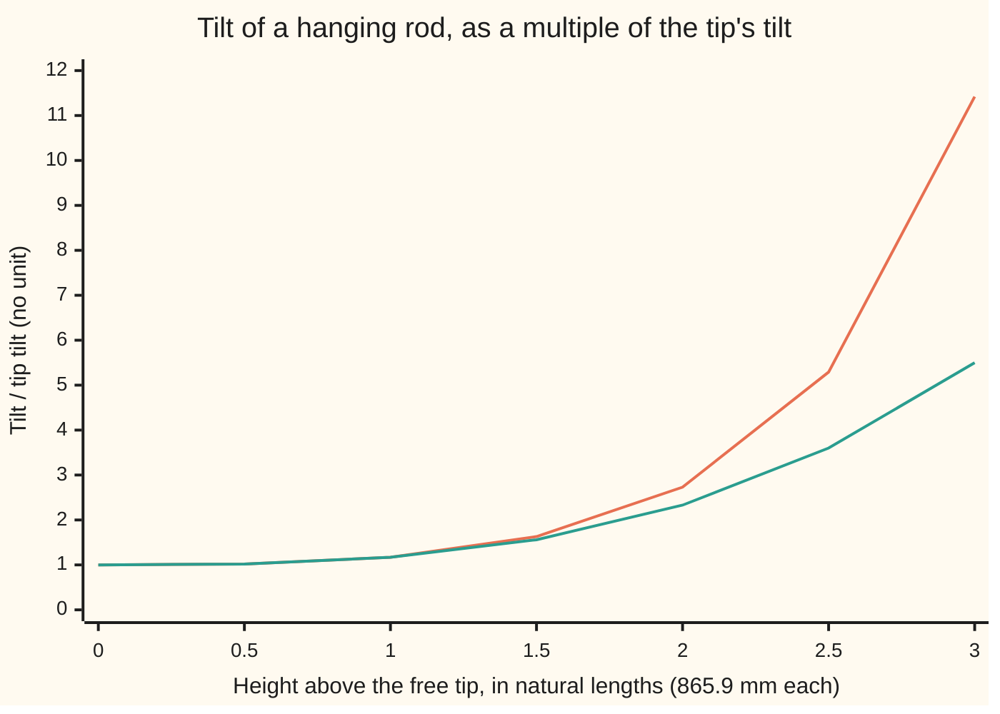

# Series solutions: assume the answer is a polynomial that never stops and match the coefficients

[Syllabus](../../../SYLLABUS.md) → [Differential equations and dynamics](../../../SYLLABUS.md#w08) → [Series Solutions and Boundary Problems](../../../SYLLABUS.md#w08-s07) → Series solutions

---

## General Overview

A steel rod 2 mm thick and 865.9 mm long hangs from a clamp tilted 2 degrees off vertical. Its weight pulls it back toward vertical. How much tilt is left at the free tip?

The tension at each height is the weight of rod below, so the law for the tilt has a coefficient that grows along the rod, and the exponentials that solve a car's shock absorber no longer fit.

The way through: assume the answer is a polynomial that never stops, put it into the equation, and let the equation choose each coefficient: 1, 1/6, 1/180, 1/12960 and so on. Summed, the clamp's tilt is 1.1723 times the tip's, so the tip keeps 1.706 degrees.

**Where a linear equation's coefficients are power series, so are its solutions: substituting one turns the equation into a rule for each coefficient, and the series converges at least out to the nearest point, real or complex, where a coefficient fails.**

**What kind of fact this is:** a method; the promise about how far the series converges is a theorem, proved on this card in Why it works.

### The picture: the tilt up the rod, and the first two terms alone



Orange: the series summed to x^30. Teal: 1 + x^3/6 alone. They agree to two decimals up to one natural length, then part.

---

## The formula

Here the rates run up the rod, not through time. Height $x$ is measured up from the tip in **natural lengths** (865.9 mm here, derived below); $y$ is the tilt over the tip's tilt. The law is **Airy's equation**, met by George Airy in 1838 at a rainbow's edge:

$$y'' = x\,y, \qquad y(0) = 1, \qquad y'(0) = 0.$$

**Read it aloud:** the rate of the tilt's rate equals height times tilt; at the tip the tilt is 1 and not changing.

The method, for any equation $y'' + P(x)\,y' + Q(x)\,y = 0$ with the leading coefficient divided out:

$$y = \sum_{n=0}^{\infty} a_n\,(x - x_0)^n, \qquad a_0 = y(x_0), \quad a_1 = y'(x_0).$$

**Read it aloud:** the answer is a power series around the start; its first two coefficients are the starting value and rate, and the equation fixes the rest.

For Airy's equation, with $x_0 = 0$:

$$a_2 = 0, \qquad a_{n+3} = \frac{a_n}{(n+3)(n+2)} \quad (n \ge 0)$$

**Read it aloud:** each coefficient is the one three places back, divided by the two numbers just stepped past.

The point $x_0$ is **ordinary** when $P$ and $Q$ are power series around it. The reach:

$$R \;\ge\; \text{distance from } x_0 \text{ to the nearest complex point where } P \text{ or } Q \text{ fails}.$$

| Symbol | Plain meaning | In our example | Push it up and the answer… |
| --- | --- | --- | --- |
| $x$ | height above the tip, in natural lengths | 0 tip, 1 clamp | tilt grows faster |
| $y$, $y'$, $y''$ | tilt over tip tilt; its rate; that rate's rate | 1.1723 at the clamp | — |
| $\ell$ | natural length, (EI/w)^(1/3): E stiffness, I bending factor, w weight per metre | 865.9 mm | the tip keeps more of the clamp's tilt |
| $x_0$ | centre of the series | 0, the tip | — |
| $P$, $Q$ | coefficients of y' and y, y'' alone | P = 0, Q = −x | — |
| $a_n$, $n$ | coefficient of the n-th power; the power | a_3 = 1/6 | — |
| $S_N$ | partial sum, cut after power N | S_3 = 1.166667 | nearer 1.172300 |
| $R$ | radius of convergence: how far out the series adds up | unlimited; 1 for arctan | — |

### When it holds

- **An ordinary point.** In x^2 y'' + x y' + (x^2 − 1) y = 0, dividing by x^2 leaves 1/x and 1/x^2, which fail at 0; there [Frobenius](02-frobenius-and-regular-singular-points.md) repairs it.
- **A linear equation, for the radius promise.** y' = y^2, y(0) = 1, has no bad coefficient, yet its answer 1/(1 − x) blows up at x = 1.
- **A floor, not the exact radius.** Legendre's equation fails at ±1, yet some solutions are polynomials ([Legendre's equation](04-legendre-polynomials.md)).
- **Inside the radius only.** Past R the partial sums swing wildly, as the arctan case shows.

---

## Why it works

### Step 0: a power series can be differentiated term by term

Inside its radius a power series has as its rate the series of its terms' rates ([Power series](../../06-Calculus%20and%20analysis/06-Series/04-power-series.md)). Two power series are equal only when every coefficient matches, so one equation becomes one equation per power of x.

<details>
<summary>Where y'' = x y comes from, for the hanging rod</summary>

Height s in metres up from the tip; u(s) the sideways offset; θ = u' the tilt. The rod below s, hanging off line, bends it: EI u'' = ∫ from 0 to s of w (u(s) − u(σ)) dσ, σ running over the heights below s, EI being the bending stiffness. Differentiating: EI θ'' = w s θ. The tip carries no bending, so θ'(0) = 0. With s = ℓ x and ℓ^3 = EI / w, θ'' = x θ. A round rod has ℓ^3 = E d^2 / (16 ρ g); for steel (E = 200 GPa, ρ = 7850 kg/m^3), g = 9.81 m/s^2 and d = 2 mm, ℓ = 865.9 mm.

</details>

### Step 1: substitute and match the powers

With $y = \sum a_n x^n$, $y'' = \sum (n+2)(n+1)\,a_{n+2}\,x^n$ and $x\,y = \sum a_{n-1}\,x^n$ from n = 1. Match x^n. At n = 0, 2 a_2 = 0, since x y has no constant term. For n ≥ 1, (n + 2)(n + 1) a_{n+2} = a_{n−1}; renaming n − 1 as n gives the rule. It steps by three, so there are three chains, from a_0, a_1 and a_2; the last stays zero.

### Step 2: the two starting values fix the two free coefficients

At x = 0 the series reads a_0 and its rate a_1, so a_0 = 1 and a_1 = 0, silencing the second chain. The first gives y = 1 + x^3/6 + x^6/180 + x^9/12960 + …. Two free coefficients match the two conditions a second-order equation needs: a_0 = 0, a_1 = 1 gives the other basic solution, x + x^4/12 + …, and every solution mixes the two ([Superposition](../03-Oscillators%20-%20Second-Order%20Linear%20Equations/01-superposition-and-the-shape-of-linear-solutions.md)).

### Step 3: the series converges, so it is a real solution

Matching assumed a series existed. Successive terms have ratio x^3 / ((n + 3)(n + 2)), which shrinks to 0 for any x, so by the ratio test the series converges everywhere (a term outgrows the last only while x^3 > (n + 3)(n + 2): x > 10.2 at n = 30, 45.1 at n = 300). Step 0's term-by-term rates are then legitimate, the sum solves y'' = x y, and since only one solution starts at value 1 with rate 0 ([The Picard-Lindelof theorem](../02-Existence%2C%20Uniqueness%20and%20Sensitivity/02-lipschitz-and-the-picard-lindelof-theorem.md)), it is the rod's tilt.

### Step 4: the radius is set by the nearest bad point, even an invisible one

Airy's coefficient, x, is fine everywhere. A second case has a limit: (1 + x^2) y'' + 2x y' = 0, y(0) = 0, y'(0) = 1, is solved by arctan x, whose rate is 1/(1 + x^2). Here P = 2x / (1 + x^2), smooth on the whole real line. But 1 + x^2 is zero at ±i, the complex numbers whose square is −1, at distance 1 from 0.

A power series converges on a disc in the complex plane, never past a point where its function fails ([Power series in the plane](../../07-Complex%20analysis/02-Holomorphic%20Functions/02-complex-power-series.md)). Matching gives a_{n+2} = −n a_n / (n + 2): x − x^3/3 + x^5/5 − …, radius 1. It converges at x = 0.5 and flies apart at x = 2, where arctan is 1.107149.

<details>
<summary>Detailed proof: the series reaches at least as far as P and Q do</summary>

Let P = Σ p_k x^k and Q = Σ q_k x^k converge for |x| < ρ; fix r < ρ. Their terms at r are bounded, so |p_k|, |q_k| ≤ M r^(−k). Matching x^n gives
(n + 2)(n + 1) a_(n+2) = −Σ from k = 0 to n of [(k + 1) a_(k+1) p_(n−k) + a_k q_(n−k)].

Take positive b_0 ≥ |a_0|, b_1 ≥ |a_1| and define
(n + 2)(n + 1) b_(n+2) = M T_n, with T_n = Σ from k = 0 to n of [(k + 1) b_(k+1) + b_k] r^(k−n).
By induction and the triangle inequality, |a_n| ≤ b_n.

Since T_n = T_(n−1) / r + (n + 1) b_(n+1) + b_n and M T_(n−1) = (n + 1) n b_(n+1),
b_(n+2) / b_(n+1) = n / ((n + 2) r) + M / (n + 2) + M b_n / ((n + 2)(n + 1) b_(n+1)).
The first term keeps the ratio above 1/(3r), so the last shrinks to 0 and the ratio tends to 1/r. By the ratio test Σ b_n |x|^n, hence Σ a_n x^n, converges for |x| < r. As r < ρ was arbitrary, the radius is at least ρ.

</details>

A second road needs no series: step the equation up the rod with Runge-Kutta 4 ([Runge-Kutta four](../05-Numerical%20Evolution/04-runge-kutta-four.md)).

---

## Worked numbers, by hand

| Step | Arithmetic | Value |
| --- | --- | --- |
| a_0, a_1, a_2 | y(0), y'(0), the x^0 match | 1, 0, 0 |
| a_3, a_6 | 1 / (3 × 2), then ÷ (6 × 5) | 1/6, 1/180 |
| a_9, a_12 | ÷ (9 × 8), then ÷ (12 × 11) | 1/12960, 1/1710720 |
| sums at the clamp, x = 1 | 1 + 1/6, + 1/180, + 1/12960 | 1.166667, 1.172222, 1.172299 |
| series to x^30 | later terms add 0.000000003 | **1.1723** |
| tip tilt, 2-degree clamp | 2 / 1.1723 | **1.706 degrees** |

The 865.9 mm rod straightens under its own weight from 2 degrees at the clamp to 1.706 at the tip.

### What breaks if you drop a piece

| Mistake | Comes out at | What went wrong |
| --- | --- | --- |
| Stop at 1 + x^3/6 | 1.166667; at x = 3, 5.50 not 11.42 | dropped terms grow with x |
| Freeze x at 1, so y'' = y, y = cosh x | 1.543081, not 1.172300 | the clamp's tension, applied all the way down |
| Sum the arctan series at x = 2 | 44.3, −21580.2, −11157818536.0 after 5, 10, 20 terms, not 1.107149 | x = 2 is outside the radius 1 set by ±i |

---

## Code, from first principles, and it actually runs

Two roads to the clamp's tilt: the series summed to x^30, and Runge-Kutta 4 steps that never see a coefficient, whose error falls about 16-fold per halved step. For arctan, the code finds ±i, estimates the radius from the coefficients, and tests the series inside and outside it.

### Python

```python
# Power series at an ordinary point -- the check behind the card.  Standard library
# only.  A 2 mm steel rod hangs from a tilted clamp; its tilt y at height x above the
# free tip (x in natural lengths) obeys Airy's y'' = x y, y(0) = 1, y'(0) = 0.  Road one:
# the coefficient recurrence, summed.  Road two: Runge-Kutta 4.  Second case: arctan.
import math

def horner(a, x):                        # a[0] + a[1] x + a[2] x^2 + ...
    s = 0.0
    for c in reversed(a):
        s = s * x + c
    return s

def rk4(f, x, s, x1, n):                 # s = [y, y'], f returns [y', y'']
    h = (x1 - x) / n
    for _ in range(n):
        k1 = f(x, s)
        k2 = f(x + h / 2, [s[i] + h / 2 * k1[i] for i in (0, 1)])
        k3 = f(x + h / 2, [s[i] + h / 2 * k2[i] for i in (0, 1)])
        k4 = f(x + h, [s[i] + h * k3[i] for i in (0, 1)])
        s = [s[i] + h / 6 * (k1[i] + 2 * k2[i] + 2 * k3[i] + k4[i]) for i in (0, 1)]
        x += h
    return s[0]

airy = lambda x, s: [s[1], x * s[0]]
atan_eq = lambda x, s: [s[1], -2 * x * s[1] / (1 + x * x)]
a = [1.0, 0.0, 0.0] + [0.0] * 30         # a_(n+3) = a_n / ((n + 3)(n + 2))
for n in range(30):
    a[n + 3] = a[n] / ((n + 3) * (n + 2))
b = [0.0, 1.0] + [0.0] * 400             # a_(n+2) = -n a_n / (n + 2)
for n in range(1, 400):
    b[n + 2] = -n * b[n] / (n + 2)
ell = (200e9 * 0.002 ** 2 / (16 * 7850 * 9.81)) ** (1 / 3)
print(f"natural length (E d^2 / (16 rho g))^(1/3), 2 mm steel: {ell * 1000:.1f} mm")
print("1/a3, 1/a6, 1/a9, 1/a12:", " ".join(f"{1 / a[k]:.0f}" for k in (3, 6, 9, 12)))
print("partial sums at x = 1, degree 3/6/9/12:", " ".join(f"{horner(a[:d + 1], 1.0):.9f}" for d in (3, 6, 9, 12)))
y1 = horner(a, 1.0)
print(f"series to degree 30 at x = 1: {y1:.12f}")
errs = [rk4(airy, 0.0, [1.0, 0.0], 1.0, n) - y1 for n in (5, 10, 20)]
print("RK4 errors x 1e9 at h = 0.2/0.1/0.05:", " ".join(f"{e * 1e9:.1f}" for e in errs))
print(f"error ratio when h halves: {errs[0] / errs[1]:.1f}, {errs[1] / errs[2]:.1f}")
print(f"clamp tilted 2.000 deg: tip tilt {2 / y1:.3f} deg")
print("Airy ratio ((n+3)(n+2))^(1/3) at n = 30, 300:", " ".join(f"{((n + 3) * (n + 2)) ** (1 / 3):.1f}" for n in (30, 300)))
dist = math.sqrt(4 * 1 * 1 - 0 * 0) / 2  # 1 + x^2 = 0: roots 0 +/- (sqrt(4ac - b^2) / 2a) i
print(f"second case: 1 + x^2 = 0 at 0 +/- {dist:.3f}i, distance {dist:.3f}")
est = math.sqrt(abs(b[399] / b[401]))
print(f"ratio estimate sqrt|a_399 / a_401|: {est:.5f}")
s05, r05 = horner(b[:41], 0.5), rk4(atan_eq, 0.0, [0.0, 1.0], 0.5, 40)
print(f"at x = 0.5: series 20 terms {s05:.9f}, RK4 {r05:.9f}")
r2 = rk4(atan_eq, 0.0, [0.0, 1.0], 2.0, 200)
print("at x = 2: series 5/10/20 terms", " ".join(f"{horner(b[:2 * k + 1], 2.0):.1f}" for k in (5, 10, 20)) + f"; RK4 {r2:.9f}")
print(f"mistake, x frozen at 1 (y'' = y, y = cosh x): y(1) = {(math.exp(1) + math.exp(-1)) / 2:.6f}")
xs = [0.0, 0.5, 1.0, 1.5, 2.0, 2.5, 3.0]
print("figure, x:          ", " ".join(f"{x:5.2f}" for x in xs))
print("figure, series y:   ", " ".join(f"{horner(a, x):5.2f}" for x in xs))
print("figure, 1 + x^3/6:  ", " ".join(f"{1 + x ** 3 / 6:5.2f}" for x in xs))
assert abs(rk4(airy, 0.0, [1.0, 0.0], 1.0, 80) - y1) < 1e-9          # two roads, one tilt
assert 14 < errs[0] / errs[1] < 18 and 14 < errs[1] / errs[2] < 18  # fourth order
assert abs(s05 - r05) < 1e-9 and abs(horner(b[:41], 2.0)) > 100 * r2  # inside vs outside radius
assert abs(est - dist) < 0.01                                        # radius = distance to +/- i
print("ALL CHECKS PASS")
```

**Ran 2026-09-28 on macOS, Python 3.14.6, standard library only. All checks passed. Output, pasted from the run:**

```
natural length (E d^2 / (16 rho g))^(1/3), 2 mm steel: 865.9 mm
1/a3, 1/a6, 1/a9, 1/a12: 6 180 12960 1710720
partial sums at x = 1, degree 3/6/9/12: 1.166666667 1.172222222 1.172299383 1.172299967
series to degree 30 at x = 1: 1.172299970058
RK4 errors x 1e9 at h = 0.2/0.1/0.05: -6272.6 -374.9 -22.9
error ratio when h halves: 16.7, 16.4
clamp tilted 2.000 deg: tip tilt 1.706 deg
Airy ratio ((n+3)(n+2))^(1/3) at n = 30, 300: 10.2 45.1
second case: 1 + x^2 = 0 at 0 +/- 1.000i, distance 1.000
ratio estimate sqrt|a_399 / a_401|: 1.00250
at x = 0.5: series 20 terms 0.463647609, RK4 0.463647609
at x = 2: series 5/10/20 terms 44.3 -21580.2 -11157818536.0; RK4 1.107148718
mistake, x frozen at 1 (y'' = y, y = cosh x): y(1) = 1.543081
figure, x:            0.00  0.50  1.00  1.50  2.00  2.50  3.00
figure, series y:     1.00  1.02  1.17  1.63  2.73  5.29 11.42
figure, 1 + x^3/6:    1.00  1.02  1.17  1.56  2.33  3.60  5.50
ALL CHECKS PASS
```

### Rust

Same numbers, same labels, built with `rustc --edition 2021 -O`.

```rust
// Power series at an ordinary point -- the same check as the Python, in Rust.  No
// crates.  A 2 mm steel rod hangs from a tilted clamp; its tilt y at height x above the
// free tip (x in natural lengths) obeys Airy's y'' = x y, y(0) = 1, y'(0) = 0.  Road one:
// the coefficient recurrence, summed.  Road two: Runge-Kutta 4.  Second case: arctan.

fn horner(a: &[f64], x: f64) -> f64 {            // a[0] + a[1] x + a[2] x^2 + ...
    a.iter().rev().fold(0.0, |s, &c| s * x + c)
}

fn rk4(f: fn(f64, [f64; 2]) -> [f64; 2], mut x: f64, mut s: [f64; 2], x1: f64, n: usize) -> f64 {
    let h = (x1 - x) / n as f64;                 // s = [y, y'], f returns [y', y'']
    let add = |s: [f64; 2], k: [f64; 2], c: f64| [s[0] + c * k[0], s[1] + c * k[1]];
    for _ in 0..n {
        let k1 = f(x, s);
        let k2 = f(x + h / 2.0, add(s, k1, h / 2.0));
        let k3 = f(x + h / 2.0, add(s, k2, h / 2.0));
        let k4 = f(x + h, add(s, k3, h));
        s = [0, 1].map(|i| s[i] + h / 6.0 * (k1[i] + 2.0 * k2[i] + 2.0 * k3[i] + k4[i]));
        x += h;
    }
    s[0]
}

fn airy(x: f64, s: [f64; 2]) -> [f64; 2] { [s[1], x * s[0]] }
fn atan_eq(x: f64, s: [f64; 2]) -> [f64; 2] { [s[1], -2.0 * x * s[1] / (1.0 + x * x)] }
fn join(v: Vec<String>) -> String { v.join(" ") }

fn main() {
    let mut a = vec![0.0; 33];                   // a_(n+3) = a_n / ((n + 3)(n + 2))
    a[0] = 1.0;
    for n in 0..30 { a[n + 3] = a[n] / ((n + 3) * (n + 2)) as f64 }
    let mut b = vec![0.0; 402];                  // a_(n+2) = -n a_n / (n + 2)
    b[1] = 1.0;
    for n in 1..400 { b[n + 2] = -(n as f64) * b[n] / (n + 2) as f64 }
    let ell = (200e9 * 0.002f64.powi(2) / (16.0 * 7850.0 * 9.81)).powf(1.0 / 3.0);
    println!("natural length (E d^2 / (16 rho g))^(1/3), 2 mm steel: {:.1} mm", ell * 1000.0);
    println!("1/a3, 1/a6, 1/a9, 1/a12: {}", join([3, 6, 9, 12].iter().map(|&k| format!("{:.0}", 1.0 / a[k])).collect()));
    println!("partial sums at x = 1, degree 3/6/9/12: {}",
             join([3, 6, 9, 12].iter().map(|&d| format!("{:.9}", horner(&a[..d + 1], 1.0))).collect()));
    let y1 = horner(&a, 1.0);
    println!("series to degree 30 at x = 1: {:.12}", y1);
    let errs: Vec<f64> = [5, 10, 20].iter().map(|&n| rk4(airy, 0.0, [1.0, 0.0], 1.0, n) - y1).collect();
    println!("RK4 errors x 1e9 at h = 0.2/0.1/0.05: {}", join(errs.iter().map(|e| format!("{:.1}", e * 1e9)).collect()));
    println!("error ratio when h halves: {:.1}, {:.1}", errs[0] / errs[1], errs[1] / errs[2]);
    println!("clamp tilted 2.000 deg: tip tilt {:.3} deg", 2.0 / y1);
    println!("Airy ratio ((n+3)(n+2))^(1/3) at n = 30, 300: {}",
             join([30.0f64, 300.0].iter().map(|n| format!("{:.1}", ((n + 3.0) * (n + 2.0)).powf(1.0 / 3.0))).collect()));
    let dist = (4.0f64 * 1.0 * 1.0 - 0.0 * 0.0).sqrt() / 2.0; // 1 + x^2 = 0: roots 0 +/- (sqrt(4ac - b^2) / 2a) i
    println!("second case: 1 + x^2 = 0 at 0 +/- {:.3}i, distance {:.3}", dist, dist);
    let est = (b[399] / b[401]).abs().sqrt();
    println!("ratio estimate sqrt|a_399 / a_401|: {:.5}", est);
    let (s05, r05) = (horner(&b[..41], 0.5), rk4(atan_eq, 0.0, [0.0, 1.0], 0.5, 40));
    println!("at x = 0.5: series 20 terms {:.9}, RK4 {:.9}", s05, r05);
    let r2 = rk4(atan_eq, 0.0, [0.0, 1.0], 2.0, 200);
    println!("at x = 2: series 5/10/20 terms {}; RK4 {:.9}",
             join([5, 10, 20].iter().map(|&k| format!("{:.1}", horner(&b[..2 * k + 1], 2.0))).collect()), r2);
    println!("mistake, x frozen at 1 (y'' = y, y = cosh x): y(1) = {:.6}", (1f64.exp() + (-1f64).exp()) / 2.0);
    let xs = [0.0, 0.5, 1.0, 1.5, 2.0, 2.5, 3.0];
    println!("figure, x:           {}", join(xs.iter().map(|x| format!("{:5.2}", x)).collect()));
    println!("figure, series y:    {}", join(xs.iter().map(|&x| format!("{:5.2}", horner(&a, x))).collect()));
    println!("figure, 1 + x^3/6:   {}", join(xs.iter().map(|x| format!("{:5.2}", 1.0 + x * x * x / 6.0)).collect()));
    assert!((rk4(airy, 0.0, [1.0, 0.0], 1.0, 80) - y1).abs() < 1e-9);          // two roads, one tilt
    assert!(14.0 < errs[0] / errs[1] && errs[0] / errs[1] < 18.0 && 14.0 < errs[1] / errs[2] && errs[1] / errs[2] < 18.0);
    assert!((s05 - r05).abs() < 1e-9 && horner(&b[..41], 2.0).abs() > 100.0 * r2); // inside vs outside radius
    assert!((est - dist).abs() < 0.01);                                        // radius = distance to +/- i
    println!("ALL CHECKS PASS");
}
```

**Ran 2026-09-28 on macOS, rustc 1.98.1, no crates. All checks passed. Output, pasted from the run:**

```
natural length (E d^2 / (16 rho g))^(1/3), 2 mm steel: 865.9 mm
1/a3, 1/a6, 1/a9, 1/a12: 6 180 12960 1710720
partial sums at x = 1, degree 3/6/9/12: 1.166666667 1.172222222 1.172299383 1.172299967
series to degree 30 at x = 1: 1.172299970058
RK4 errors x 1e9 at h = 0.2/0.1/0.05: -6272.6 -374.9 -22.9
error ratio when h halves: 16.7, 16.4
clamp tilted 2.000 deg: tip tilt 1.706 deg
Airy ratio ((n+3)(n+2))^(1/3) at n = 30, 300: 10.2 45.1
second case: 1 + x^2 = 0 at 0 +/- 1.000i, distance 1.000
ratio estimate sqrt|a_399 / a_401|: 1.00250
at x = 0.5: series 20 terms 0.463647609, RK4 0.463647609
at x = 2: series 5/10/20 terms 44.3 -21580.2 -11157818536.0; RK4 1.107148718
mistake, x frozen at 1 (y'' = y, y = cosh x): y(1) = 1.543081
figure, x:            0.00  0.50  1.00  1.50  2.00  2.50  3.00
figure, series y:     1.00  1.02  1.17  1.63  2.73  5.29 11.42
figure, 1 + x^3/6:    1.00  1.02  1.17  1.56  2.33  3.60  5.50
ALL CHECKS PASS
```

The two outputs match line for line.

> [!TIP]
> **Try changing**
> Guess first, then run it.
> - **A thicker rod.** Change `0.002` to `0.004`. The natural length grows by 2^(2/3), to 1374.6 mm (the label still says 2 mm).
> - **The index slip.** In the loop filling `a`, change `(n + 3) * (n + 2)` to `(n + 2) * (n + 1)`. The sum at x = 1 becomes 1.525451 and the first assert stops the run: Runge-Kutta 4 never saw the slip.
> - **The edge of the radius.** Change both `0.5`s on the `s05` line to `0.99`. The series gives 0.772019 against 0.780373 stepped, and the third assert stops the run.

---

## The usual mistake

> [!warning]
> **Reading the radius off the real line.** 2x / (1 + x^2) is smooth for every real x, yet the arctan series stops at radius 1, because 1 + x^2 vanishes at ±i.
>
> - **Dropping the x^0 match.** Without a_2 = 0 a false third chain appears.
> - **Shifting the index.** Dividing by (n + 2)(n + 1) instead: Try changing shows what it costs.
> - **A partial sum as the answer.** 1 + x^3/6 gives 1.166667, not 1.172300.

---

## Where you meet it in real life

- **Optics.** Airy's function sets the brightness at a rainbow's edge.
- **Standing columns.** With the sign flipped, it sets the tallest pole that stands under its own weight.
- **Quantum mechanics.** The quantum oscillator runs the same method on another equation.

> **Say it back**
> When a linear equation's coefficients are power series at a point, so are its solutions. Matching each power of x turns the equation into a rule for each coefficient; the starting value and rate fill the first two. For the hanging rod that gives 1 + x^3/6 + x^6/180 + …, a clamp tilt 1.1723 times the tip's. The series reaches at least the nearest complex point where a coefficient fails, which is why arctan's stops at 1.

---

## What this builds on

- [Superposition](../03-Oscillators%20-%20Second-Order%20Linear%20Equations/01-superposition-and-the-shape-of-linear-solutions.md): a_0 and a_1 pick the mix of two basic solutions.
- [Power series](../../06-Calculus%20and%20analysis/06-Series/04-power-series.md): the radius of convergence and term-by-term rates.
- [Taylor series](../../06-Calculus%20and%20analysis/06-Series/05-taylor-series.md): why a_0 and a_1 are the starting value and rate.
- [Power series in the plane](../../07-Complex%20analysis/02-Holomorphic%20Functions/02-complex-power-series.md): why a series stops at the nearest complex bad point.

## Where this goes next

- [Frobenius](02-frobenius-and-regular-singular-points.md): a series centred at a bad point, times a power of x.
- [Legendre's equation](04-legendre-polynomials.md): a recurrence that stops by itself.
- The quantum oscillator: a series forced to stop, so energy comes in steps.

---

## Sources

Verified 28 Sep 2026: every link below opens a page naming the cited work.

- Boyce, William E., Richard C. DiPrima and Douglas B. Meade. *Elementary Differential Equations and Boundary Value Problems*, 12th ed. Wiley. [Publisher page](https://www.wiley.com/en-us/Elementary+Differential+Equations+and+Boundary+Value+Problems%2C+12th+Edition-p-9781119777694). Series near an ordinary point; the radius theorem.
- Lebl, Jiří. *Notes on Diffy Qs*, §7.2. [Series solutions](https://www.jirka.org/diffyqs/html/seriessols_section.html). Works Airy's equation.
- Teschl, Gerald. *Ordinary Differential Equations and Dynamical Systems*. [Author's page and free text](https://www.mat.univie.ac.at/~gerald/ftp/book-ode/). Section 4.1: convergence for analytic coefficients.
- NIST Digital Library of Mathematical Functions. [§9.2 Differential Equation](https://dlmf.nist.gov/9.2). Airy's equation and its standard solutions.
