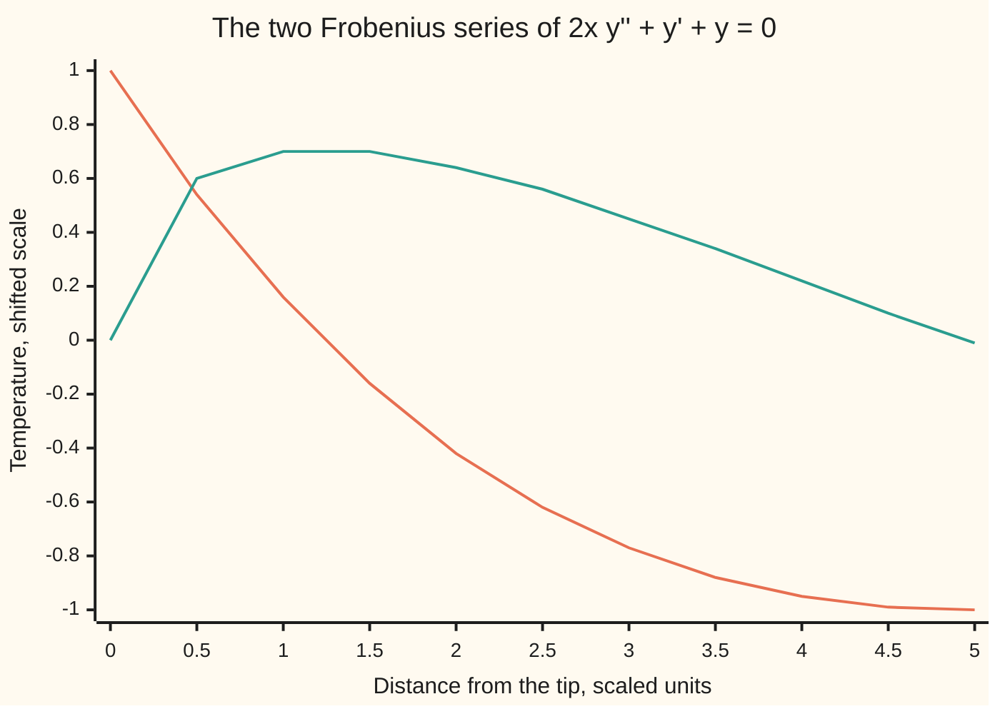

# Frobenius: at a mild singular point, let the series start at a fractional or negative power

[Syllabus](../../../SYLLABUS.md) → [Differential equations and dynamics](../../../SYLLABUS.md#w08) → [Series Solutions and Boundary Problems](../../../SYLLABUS.md#w08-s07) → Frobenius

---

## General Overview

A current heats a metal wire that tapers to a sharp tip, its cross-section growing like the square root of the distance from the tip. Conduction scales with the cross-section; heating per centimetre scales with temperature and falls as the wire thickens. In scaled units, with x the distance and y the temperature on a shifted scale, the steady heat balance reads 2x y'' + y' + y = 0.

At the tip, x = 0, the factor in front of the bend y'' vanishes: no cross-section is left to conduct through. The plain power series of [Series solutions](01-power-series-at-an-ordinary-point.md) then finds only one of the two solutions.

The repair: let the series start at a power the equation chooses, here 0 and 1/2. The x^(1/2) series leaves the tip with a vertical tangent, which no whole-number power series can copy. Near the tip the equation behaves like a Cauchy-Euler equation, solved by powers ([The Cauchy-Euler equation](../03-Oscillators%20-%20Second-Order%20Linear%20Equations/09-the-cauchy-euler-equation.md)); a Frobenius series is that power times a correcting power series.

**At a singular point where the blow-up is mild, try a power x^r times a power series: the lowest power fixes r through a quadratic, the rest is a recurrence, and a logarithm is needed only when the two allowed powers collide.**

**What kind of fact this is:** a method, resting on Frobenius's theorem that its series converge and give every solution; derived in Why it works, with the convergence proof folded under Detailed proof.

### The picture: the two starting powers of the wire



First line: the x^0 series, leaving height 1 with a finite slope. Second line: the x^(1/2) series, leaving height 0 with a vertical tangent.

---

## The formula

Divide the equation by its leading coefficient so the bend y'' stands alone:

$$y'' + p(x)\,y' + q(x)\,y = 0, \qquad \text{wire: } p(x) = q(x) = \frac{1}{2x}.$$

The point x = 0 is **ordinary** when $p$ and $q$ are power series there. It is a **regular singular point** (the mild kind) when they are not, but $P(x) = x\,p(x)$ and $Q(x) = x^2 q(x)$ are. Anything worse is an **irregular singular point**. For the wire, $P = 1/2$ and $Q = x/2$: regular.

At a regular singular point, try

$$y = x^r \sum_{n=0}^{\infty} a_n x^n, \qquad a_0 \ne 0.$$

The lowest power of x gives the **indicial equation** (the equation for the starting power):

$$I(r) = r(r-1) + P_0\, r + Q_0 = 0.$$

**Read it aloud:** the starting power must make the lowest-order terms cancel.

Each later power gives the **recurrence**, one coefficient from the ones before:

$$I(r+n)\,a_n = -\sum_{k=1}^{n}\big[(r+n-k)P_k + Q_k\big]\,a_{n-k}.$$

| Symbol | Plain meaning | In our example | Push it up and the answer… |
| --- | --- | --- | --- |
| $x$, $s$ | distance from the tip; $s = \sqrt{2x}$ (Step 4) | 0 to 5 | the curves oscillate |
| $y$, $y_1$, $y_2$ | temperature; the two independent solutions | $\cos\sqrt{2x}$, $\sin\sqrt{2x}/\sqrt 2$ | — |
| $p$, $q$ | coefficients once $y''$ stands alone | both $1/(2x)$ | — |
| $P$, $Q$, $P_0$, $Q_0$, $P_k$, $Q_k$, $R$ | $x\,p$, $x^2 q$, their series coefficients, and those series' radius | $P_0 = 1/2$, $Q_0 = 0$; $R$ unlimited | the series reach further |
| $r$, $r_1$, $r_2$, $I$, $N$ | starting power; the indicial polynomial's roots, larger first; a whole gap | roots 1/2 and 0 | the gap decides the logarithm |
| $a_n$, $a_0$, $a_N$, $b_n$, $n$ | coefficients of the first and second series; the index | $a_1 = -1$ when $r = 0$ | — |
| $c$ | weight of the logarithm in the second solution | 0 for the wire | nonzero if the recurrence jams |
| $W$ | the Wronskian $y_1 y_2' - y_1' y_2$; nonzero means independent | $\tfrac12 x^{-1/2}$ | — |

The second solution takes one of three shapes, with $r_1 \ge r_2$ the real roots:

| Gap between the roots | Second solution |
| --- | --- |
| not a whole number | $y_2 = x^{r_2}\sum b_n x^n$ |
| zero (a repeated root) | $y_2 = y_1 \ln x + x^{r_1}\sum b_n x^n$ |
| a whole number $N \ge 1$ | $y_2 = c\,y_1 \ln x + x^{r_2}\sum b_n x^n$, and $c$ may be 0 |

### When it holds

- **A regular singular point.** Drop it and the series can diverge everywhere, as What breaks shows.
- **Positive x.** x^(1/2) and ln x are taken for x > 0; the other side uses |x|.
- **Real indicial roots.** Complex roots give complex powers; take their real and imaginary parts.
- **Inside the radius.** Convergence is guaranteed for 0 < x < R, where R is how far the series for P and Q reach.

---

## Why it works

### Step 0: near the point, the equation is nearly Cauchy-Euler

Multiply by x^2: x^2 y'' + x P(x) y' + Q(x) y = 0. Freeze $P$ and $Q$ at the point and this is a Cauchy-Euler equation, solved by x^r. The rest carries extra powers of x, so correct x^r with a power series.

### Step 1: the lowest power gives the indicial equation

Put $y = \sum a_n x^{n+r}$ in. A term $a_n x^{n+r}$ turns x^2 y'' into $(n+r)(n+r-1)a_n x^{n+r}$ and x y' into $(n+r)a_n x^{n+r}$. The lowest power, x^r, collects only $a_0$, with coefficient $I(r)\,a_0$. Since $a_0 \ne 0$, $I(r) = 0$. For the wire, $I(r) = r(r - 1/2)$: roots 0 and 1/2.

### Step 2: every later power gives one coefficient

The power $x^{r+n}$ collects $I(r+n)\,a_n$ plus each earlier $a_{n-k}$ times $P_k$ and $Q_k$. Setting the total to 0 is the recurrence; where $I(r+n) \ne 0$ it hands over $a_n$. On the wire only $Q_1 = 1/2$ is nonzero; for $r = 1/2$ the coefficients run 1, −1/3, 1/30, −1/630, 1/22680.

### Step 3: the series converge, so the formal answer is a function

The denominators $I(r+n)$ grow like n^2 while the right side grows only like n, so the series converge for 0 < x < R and may be differentiated term by term. On the wire they converge for every x.

<details>
<summary>Detailed proof: the larger root's series converges</summary>

Let $d = r_1 - r_2 \ge 0$, so $I(r_1 + n) = n(n + d) \ge n^2$. Fix ρ < R; the series for P and Q converge at ρ, so some M bounds $|P_k|\rho^k$ and $|Q_k|\rho^k$. As $|r_1 + n - k| + 1 \le |r_1| + n \le (|r_1| + 1)\,n$ for k ≥ 1, the recurrence gives, with $K = M(|r_1| + 1)$,

$|a_n|\rho^n \le \dfrac{K}{n} \sum_{k=1}^{n} |a_{n-k}|\rho^{n-k}.$

Call the left side A_n and the sum of the first n of them S_n. Then S_(n+1) ≤ S_n (1 + K/n), so S_n ≤ A_0 e^K n^K, since 1 + t ≤ e^t and 1 + 1/2 + … + 1/n ≤ 1 + ln n. Hence $|a_n| \le C n^K \rho^{-n}$ for a constant C: convergence for |x| < ρ, and ρ < R was arbitrary. The smaller root, if its denominators never vanish, is the same with $I(r_2 + n) = n(n - d) \ge n^2/2$ once n ≥ 2d.

</details>

### Step 4: a second road for the wire

Put $s = \sqrt{2x}$. The chain rule turns the equation into $d^2y/ds^2 + y = 0$, a spring, so $y_1 = \cos\sqrt{2x}$ and $y_2 = \sin\sqrt{2x}/\sqrt 2$. The cosine's even powers of s are whole powers of x; each odd power in the sine carries a factor $\sqrt x$.

### Step 5: when a logarithm is forced

The larger root never jams: $I(r_1 + n) = n(n + r_1 - r_2) > 0$. The smaller root jams at $n = N$ when the gap is a whole number N, since $I(r_2 + N) = I(r_1) = 0$: the recurrence reads 0 · a_N = (right side).

- **Right side 0:** $a_N$ is free, $c = 0$. x^2 y'' − 2x y' + 2y = 0 has roots 1 and 2 and solutions x and x^2.
- **Right side not 0:** no plain series. x(1 − x) y'' + x y' − y = 0 has roots 0 and 1, and at r = 0, n = 1 asks 0 · a_1 = 1. Its second solution is $1 + x\ln x$, so $c = 1$; at x = 0.5 it is 0.653426410, and finite differences leave a residual below 0.00000002.
- **Repeated root:** one root, one series, so the logarithm is always needed.

<details>
<summary>Where the logarithm comes from</summary>

Build the series with r left free: only $I(r)\,a_0\,x^r$ survives substitution. At a double root both it and its r-derivative vanish, so the r-derivative of the series solves the equation, and the r-derivative of $x^r = e^{r \ln x}$ is $x^r \ln x$.

</details>

Abel's formula ([The Wronskian](../03-Oscillators%20-%20Second-Order%20Linear%20Equations/04-wronskian-and-reduction-of-order.md)) makes $W$ a constant times $x^{-1/2}$, and the leading terms fix it at 1/2: the two series are independent. Reduction of order from $y_1$ is the other road to $y_2$.

---

## Worked numbers, by hand

| Step | Arithmetic | Value |
| --- | --- | --- |
| standard form | divide by 2x | $p = q = 1/(2x)$ |
| regular? | $x\,p = 1/2$, $x^2 q = x/2$ | yes |
| indicial | r(r − 1) + r/2 | roots **0** and **1/2**, gap not whole |
| r = 0 coefficients | divide by 1·1, 2·3, 3·5, 4·7; alternate signs | 1, −1, 1/6, −1/90, 1/2520 |
| five terms at x = 1 | 1 − 1 + 1/6 − 1/90 + 1/2520 | 0.155952380952 |
| full series at x = 1 | 30 terms, summed by the code | **0.155943694765** |

**Back in the wire.** Heat flow along the wire is proportional to √x · y'. At x = 0.000001 it is 0.500 for the r = 1/2 series, −0.001 for r = 0. A sealed tip passes no heat, so only the r = 0 series survives: at x = 1 the temperature is 0.155943694765 of the tip's.

### What breaks if you drop a piece

| Mistake | Comes out at | What went wrong |
| --- | --- | --- |
| Indicial written r^2 + P_0 r + Q_0 | roots 0 and −0.5; x^(−0.5) leaves 1.0 x^(−1.5) | x^2 y'' gives r(r − 1), not r^2 |
| Irregular point: x^2 y'' + (3x − 1) y' + y = 0 | terms n! x^n at x = 0.1: 0.000363, 0.024329, 265.252860 at n = 10, 20, 30 | x p = 3 − 1/x blows up |
| Logarithm forced on x^2 y'' − 2x y' + 2y = 0 | x ln x leaves −1.000 at x = 1 | a whole gap only may force a log |

---

## Code, from first principles, and it actually runs

Three roads: the series from the recurrence; the closed forms from s = √(2x); and Runge-Kutta 4 ([Runge-Kutta four](../05-Numerical%20Evolution/04-runge-kutta-four.md)) stepping the equation from x = 1 to x = 2. Its error falls from 0.000000057179 at step h = 0.1 to 0.000000003625 at h = 0.05, a ratio of 15.8, near the 16 of a fourth-order method.

### Python

```python
# Frobenius check for the wire 2x y'' + y' + y = 0, tip at x = 0.  Road 1: the
# series from the recurrence.  Road 2: s = sqrt(2x) makes it y'' + y = 0 in s,
# so cos s and sin s.  Road 3: Runge-Kutta 4 from x = 1 to x = 2.
from math import sqrt, cos, sin, log
from itertools import accumulate

def series(r, x, terms=30):               # y and y' of the series with a0 = 1
    a, y, dy = 1.0, 0.0, 0.0
    for n in range(terms):
        if n > 0:
            a = -a / ((n + r) * (2 * n + 2 * r - 1))
        y += a * x ** (n + r)
        if n + r > 0 and x > 0: dy += a * (n + r) * x ** (n + r - 1)
    return y, dy
def exact(r2):                            # a0..a4 as fractions; r2 is 2r
    d, out = 1, ["1"]
    for n in range(1, 5):
        d *= (2 * n + r2) * (2 * n + r2 - 1) // 2
        out.append(("-" if n % 2 else "") + ("1" if d == 1 else f"1/{d}"))
    return ", ".join(out)
def rk4(y, v, x, h, steps):               # road 3: y'' = -(y' + y) / (2x)
    f = lambda x, y, v: (v, -(v + y) / (2 * x))
    for _ in range(steps):
        k1 = f(x, y, v)
        k2 = f(x + h / 2, y + h / 2 * k1[0], v + h / 2 * k1[1])
        k3 = f(x + h / 2, y + h / 2 * k2[0], v + h / 2 * k2[1])
        k4 = f(x + h, y + h * k3[0], v + h * k3[1])
        y += h / 6 * (k1[0] + 2 * k2[0] + 2 * k3[0] + k4[0])
        v += h / 6 * (k1[1] + 2 * k2[1] + 2 * k3[1] + k4[1])
        x += h
    return y

P0, Q0 = 0.5, 0.0                          # x p and x^2 q at the tip
b, disc = P0 - 1, sqrt((P0 - 1) ** 2 - 4 * Q0)
print(f"indicial r(r-1) + {P0:.1f} r + {Q0:.1f} = 0: roots {(-b - disc) / 2:.1f} and {(-b + disc) / 2:.1f}")
print(f"r = 0 series: {exact(0)}\nr = 1/2 series: {exact(1)}")
y1, y2, c1, c2 = series(0, 1)[0], series(0.5, 1)[0], cos(sqrt(2)), sin(sqrt(2)) / sqrt(2)
print(f"x = 1: r = 0 series {y1:.12f} (five terms {series(0, 1, 5)[0]:.12f}), cos(sqrt(2x)) {c1:.12f}")
print(f"x = 1: r = 1/2 series {y2:.12f}, sin(sqrt(2x))/sqrt(2) {c2:.12f}")
w = [(series(0, x)[0] * series(0.5, x)[1] - series(0, x)[1] * series(0.5, x)[0]) * sqrt(x) for x in (0.5, 1, 2)]
print("Wronskian times sqrt(x) at x = 0.5, 1, 2: " + ", ".join(f"{t:.12f}" for t in w))
e1, e2 = (abs(rk4(*series(0, 1), 1.0, h, n) - cos(2)) for h, n in ((0.1, 10), (0.05, 20)))
print(f"RK4 from x = 1 to 2, error: h = 0.1 {e1:.12f}, h = 0.05 {e2:.12f}, ratio {e1 / e2:.1f}")
f1, f2 = (sqrt(1e-6) * series(r, 1e-6)[1] for r in (0, 0.5))
print(f"tip heat flow sqrt(x) y' at x = 0.000001: r = 0 mode {f1:.3f}, r = 1/2 mode {f2:.3f}")
for r in (0, 0.5):
    print(f"chart r = {r:.1f}: " + ", ".join(f"{series(r, k / 2)[0]:.2f}" for k in range(11)))
g, h = (lambda x: 1 + x * log(x)), 1e-4                 # residual by finite differences
res = max(abs(x * (1 - x) * (g(x + h) - 2 * g(x) + g(x - h)) / (h * h) + x * (g(x + h) - g(x - h)) / (2 * h) - g(x)) for x in (0.25, 0.5, 0.75))
print(f"log case x(1-x)y'' + xy' - y = 0, roots 0 and 1: r = 0, n = 1 asks {1 * (1 - 1) + 0 * 1 + 0} * a1 = {-(1 * 0 + -1) * 1}")
print(f"log case: 1 + x ln x at x = 0.5 is {g(0.5):.9f}, largest residual at x = 0.25, 0.5, 0.75: {res:.9f}")
print(f"mistake, forgetting -r: roots 0 and -0.5; x^-0.5 leaves {-0.5 * (2 * -0.5 - 1):.1f} x^-1.5")
terms = [f"{t:.6f}" for t in accumulate((n * 0.1 for n in range(1, 31)), lambda a, b: a * b)][9::10]
print("mistake, irregular x^2 y'' + (3x-1) y' + y = 0, n! 0.1^n at n = 10, 20, 30: " + ", ".join(terms))
print(f"mistake, a log forced on x^2 y'' - 2x y' + 2y = 0: x ln x leaves {1 - 2 * (log(1) + 1) + 2 * log(1):.3f} at x = 1")
assert abs(y1 - c1) < 1e-12 and abs(y2 - c2) < 1e-12        # road 1 = road 2
assert all(abs(t - 0.5) < 1e-12 for t in w)                # Abel: W = (1/2) x^(-1/2)
assert e2 < 1e-8 and 14 < e1 / e2 < 18                     # road 3, fourth order
assert res < 1e-6                                          # the log partner solves it
print("ALL CHECKS PASS")
```

**Ran 2026-09-28 on macOS, Python 3.14.6, standard library only. All checks passed. Output, pasted from the run:**

```
indicial r(r-1) + 0.5 r + 0.0 = 0: roots 0.0 and 0.5
r = 0 series: 1, -1, 1/6, -1/90, 1/2520
r = 1/2 series: 1, -1/3, 1/30, -1/630, 1/22680
x = 1: r = 0 series 0.155943694765 (five terms 0.155952380952), cos(sqrt(2x)) 0.155943694765
x = 1: r = 1/2 series 0.698455998637, sin(sqrt(2x))/sqrt(2) 0.698455998637
Wronskian times sqrt(x) at x = 0.5, 1, 2: 0.500000000000, 0.500000000000, 0.500000000000
RK4 from x = 1 to 2, error: h = 0.1 0.000000057179, h = 0.05 0.000000003625, ratio 15.8
tip heat flow sqrt(x) y' at x = 0.000001: r = 0 mode -0.001, r = 1/2 mode 0.500
chart r = 0.0: 1.00, 0.54, 0.16, -0.16, -0.42, -0.62, -0.77, -0.88, -0.95, -0.99, -1.00
chart r = 0.5: 0.00, 0.60, 0.70, 0.70, 0.64, 0.56, 0.45, 0.34, 0.22, 0.10, -0.01
log case x(1-x)y'' + xy' - y = 0, roots 0 and 1: r = 0, n = 1 asks 0 * a1 = 1
log case: 1 + x ln x at x = 0.5 is 0.653426410, largest residual at x = 0.25, 0.5, 0.75: 0.000000014
mistake, forgetting -r: roots 0 and -0.5; x^-0.5 leaves 1.0 x^-1.5
mistake, irregular x^2 y'' + (3x-1) y' + y = 0, n! 0.1^n at n = 10, 20, 30: 0.000363, 0.024329, 265.252860
mistake, a log forced on x^2 y'' - 2x y' + 2y = 0: x ln x leaves -1.000 at x = 1
ALL CHECKS PASS
```

### Rust

Same numbers, same labels, built with `rustc --edition 2021 -O`.

```rust
// Frobenius check for the wire 2x y'' + y' + y = 0, tip at x = 0.  Road 1: the
// series from the recurrence.  Road 2: s = sqrt(2x) makes it y'' + y = 0 in s,
// so cos s and sin s.  Road 3: Runge-Kutta 4 from x = 1 to x = 2.  No crates.
fn series(r: f64, x: f64) -> (f64, f64) {        // y and y' of the series with a0 = 1
    let (mut a, mut y, mut dy) = (1.0_f64, 0.0_f64, 0.0_f64);
    for n in 0..30 {
        let n = n as f64;
        if n > 0.0 { a = -a / ((n + r) * (2.0 * n + 2.0 * r - 1.0)); }
        y += a * x.powf(n + r);
        if n + r > 0.0 && x > 0.0 { dy += a * (n + r) * x.powf(n + r - 1.0); }
    }
    (y, dy)
}
fn exact(r2: u64) -> String {                    // a0..a4 as fractions; r2 is 2r
    let (mut d, mut out) = (1_u64, vec!["1".to_string()]);
    for n in 1..5_u64 {
        d *= (2 * n + r2) * (2 * n + r2 - 1) / 2;
        let sign = if n % 2 == 1 { "-" } else { "" };
        out.push(if d == 1 { format!("{}1", sign) } else { format!("{}1/{}", sign, d) });
    }
    out.join(", ")
}
fn f(x: f64, y: f64, v: f64) -> (f64, f64) { (v, -(v + y) / (2.0 * x)) }
fn rk4(mut y: f64, mut v: f64, mut x: f64, h: f64, steps: usize) -> f64 {
    for _ in 0..steps {                          // road 3: y'' = -(y' + y) / (2x)
        let k1 = f(x, y, v);
        let k2 = f(x + h / 2.0, y + h / 2.0 * k1.0, v + h / 2.0 * k1.1);
        let k3 = f(x + h / 2.0, y + h / 2.0 * k2.0, v + h / 2.0 * k2.1);
        let k4 = f(x + h, y + h * k3.0, v + h * k3.1);
        y += h / 6.0 * (k1.0 + 2.0 * k2.0 + 2.0 * k3.0 + k4.0);
        v += h / 6.0 * (k1.1 + 2.0 * k2.1 + 2.0 * k3.1 + k4.1);
        x += h;
    }
    y
}
fn join(v: &[f64], d: usize) -> String {
    v.iter().map(|t| format!("{:.*}", d, t)).collect::<Vec<_>>().join(", ")
}
fn main() {
    let (p0, q0) = (0.5_f64, 0.0_f64);           // x p and x^2 q at the tip
    let (b, disc) = (p0 - 1.0, ((p0 - 1.0).powi(2) - 4.0 * q0).sqrt());
    println!("indicial r(r-1) + {:.1} r + {:.1} = 0: roots {:.1} and {:.1}", p0, q0, (-b - disc) / 2.0, (-b + disc) / 2.0);
    println!("r = 0 series: {}\nr = 1/2 series: {}", exact(0), exact(1));
    let (y1, y2) = (series(0.0, 1.0).0, series(0.5, 1.0).0);
    let (c1, c2) = (2.0_f64.sqrt().cos(), 2.0_f64.sqrt().sin() / 2.0_f64.sqrt());
    let five: f64 = [1.0, -1.0, 1.0 / 6.0, -1.0 / 90.0, 1.0 / 2520.0].iter().sum();
    println!("x = 1: r = 0 series {:.12} (five terms {:.12}), cos(sqrt(2x)) {:.12}", y1, five, c1);
    println!("x = 1: r = 1/2 series {:.12}, sin(sqrt(2x))/sqrt(2) {:.12}", y2, c2);
    let w: Vec<f64> = [0.5_f64, 1.0, 2.0].iter().map(|&x| {
        let ((u, du), (v, dv)) = (series(0.0, x), series(0.5, x));
        (u * dv - du * v) * x.sqrt()
    }).collect();
    println!("Wronskian times sqrt(x) at x = 0.5, 1, 2: {}", join(&w, 12));
    let (s0, d0) = series(0.0, 1.0);
    let e1 = (rk4(s0, d0, 1.0, 0.1, 10) - 2.0_f64.cos()).abs();
    let e2 = (rk4(s0, d0, 1.0, 0.05, 20) - 2.0_f64.cos()).abs();
    println!("RK4 from x = 1 to 2, error: h = 0.1 {:.12}, h = 0.05 {:.12}, ratio {:.1}", e1, e2, e1 / e2);
    let (f1, f2) = (1e-6_f64.sqrt() * series(0.0, 1e-6).1, 1e-6_f64.sqrt() * series(0.5, 1e-6).1);
    println!("tip heat flow sqrt(x) y' at x = 0.000001: r = 0 mode {:.3}, r = 1/2 mode {:.3}", f1, f2);
    for r in [0.0_f64, 0.5] {
        let pts: Vec<f64> = (0..11).map(|k| series(r, k as f64 / 2.0).0).collect();
        println!("chart r = {:.1}: {}", r, join(&pts, 2));
    }
    let (lhs, rhs) = (1 * (1 - 1) + 0 * 1 + 0, -(1 * 0 + -1) * 1);   // I(1) a1 = -(P1 r + Q1) a0
    let (g, h) = (|x: f64| 1.0 + x * x.ln(), 1e-4_f64);          // residual by finite differences
    let res = [0.25_f64, 0.5, 0.75].iter().map(|&x| (x * (1.0 - x) * (g(x + h) - 2.0 * g(x) + g(x - h)) / (h * h) + x * (g(x + h) - g(x - h)) / (2.0 * h) - g(x)).abs()).fold(0.0_f64, f64::max);
    println!("log case x(1-x)y'' + xy' - y = 0, roots 0 and 1: r = 0, n = 1 asks {} * a1 = {}", lhs, rhs);
    println!("log case: 1 + x ln x at x = 0.5 is {:.9}, largest residual at x = 0.25, 0.5, 0.75: {:.9}", g(0.5), res);
    println!("mistake, forgetting -r: roots 0 and -0.5; x^-0.5 leaves {:.1} x^-1.5", -0.5 * (2.0 * -0.5 - 1.0));
    let terms: Vec<f64> = (1..31).scan(1.0_f64, |p, n| { *p *= n as f64 * 0.1; Some(*p) }).skip(9).step_by(10).collect();
    println!("mistake, irregular x^2 y'' + (3x-1) y' + y = 0, n! 0.1^n at n = 10, 20, 30: {}", join(&terms, 6));
    let lg = 1.0_f64.ln();
    println!("mistake, a log forced on x^2 y'' - 2x y' + 2y = 0: x ln x leaves {:.3} at x = 1", 1.0 - 2.0 * (lg + 1.0) + 2.0 * lg);
    assert!((y1 - c1).abs() < 1e-12 && (y2 - c2).abs() < 1e-12);   // road 1 = road 2
    assert!(w.iter().all(|t| (t - 0.5).abs() < 1e-12));           // Abel: W = (1/2) x^(-1/2)
    assert!(e2 < 1e-8 && 14.0 < e1 / e2 && e1 / e2 < 18.0);        // road 3, fourth order
    assert!(res < 1e-6);                                           // the log partner solves it
    println!("ALL CHECKS PASS");
}
```

**Ran 2026-09-28 on macOS, rustc 1.98.1, no crates. All checks passed. Output, pasted from the run:**

```
indicial r(r-1) + 0.5 r + 0.0 = 0: roots 0.0 and 0.5
r = 0 series: 1, -1, 1/6, -1/90, 1/2520
r = 1/2 series: 1, -1/3, 1/30, -1/630, 1/22680
x = 1: r = 0 series 0.155943694765 (five terms 0.155952380952), cos(sqrt(2x)) 0.155943694765
x = 1: r = 1/2 series 0.698455998637, sin(sqrt(2x))/sqrt(2) 0.698455998637
Wronskian times sqrt(x) at x = 0.5, 1, 2: 0.500000000000, 0.500000000000, 0.500000000000
RK4 from x = 1 to 2, error: h = 0.1 0.000000057179, h = 0.05 0.000000003625, ratio 15.8
tip heat flow sqrt(x) y' at x = 0.000001: r = 0 mode -0.001, r = 1/2 mode 0.500
chart r = 0.0: 1.00, 0.54, 0.16, -0.16, -0.42, -0.62, -0.77, -0.88, -0.95, -0.99, -1.00
chart r = 0.5: 0.00, 0.60, 0.70, 0.70, 0.64, 0.56, 0.45, 0.34, 0.22, 0.10, -0.01
log case x(1-x)y'' + xy' - y = 0, roots 0 and 1: r = 0, n = 1 asks 0 * a1 = 1
log case: 1 + x ln x at x = 0.5 is 0.653426410, largest residual at x = 0.25, 0.5, 0.75: 0.000000014
mistake, forgetting -r: roots 0 and -0.5; x^-0.5 leaves 1.0 x^-1.5
mistake, irregular x^2 y'' + (3x-1) y' + y = 0, n! 0.1^n at n = 10, 20, 30: 0.000363, 0.024329, 265.252860
mistake, a log forced on x^2 y'' - 2x y' + 2y = 0: x ln x leaves -1.000 at x = 1
ALL CHECKS PASS
```

The two outputs match line for line.

> [!TIP]
> **Try changing**
> Guess first, then run the Python.
> - **Break the recurrence.** In `series`, change `2 * n + 2 * r - 1` to `2 * n + 2 * r + 1`. The first assert fires.
> - **Drop the starting power.** In `y += a * x ** (n + r)`, write `x ** n`. Nothing changes at x = 1, but the Wronskian assert fires.
> - **Spoil the stepper.** In `rk4`, change `2 * k2[0]` to `k2[0]`. The error stops shrinking; the third assert fires.

---

## The usual mistake

> [!warning]
> **Taking a whole-number gap as a promise of a logarithm.** The gap says only that the recurrence might jam; the right side at step N decides. x^2 y'' − 2x y' + 2y = 0 (roots 1, 2) needs none; x(1 − x) y'' + x y' − y = 0 (roots 0, 1) needs one.
>
> - **Forgetting the −r.** The wire gets roots 0 and −0.5, and x^(−0.5) leaves 1.0 x^(−1.5).
> - **An irregular point.** The terms n! x^n reach 265.252860 at n = 30, x = 0.1.
> - **Keeping every mode.** The situation picks: the wire's x^(1/2) mode would carry heat 0.500 through the tip.

---

## Where you meet it in real life

- **Drums.** The centre of a drumhead is a regular singular point; it vibrates in the Frobenius series of [Bessel's equation](03-bessels-equation-and-the-drum.md).
- **Spheres.** Heat on a sphere leads to regular singular points at the poles; finite values there pick out [Legendre's equation](04-legendre-polynomials.md).
- **Singular ends.** Where a tapered beam's or this wire's leading coefficient vanishes, the mode kept is the boundary condition, as in [Sturm-Liouville](09-sturm-liouville-and-orthogonality.md).

> **Say it back**
> Where the leading coefficient vanishes, a plain power series can miss a solution. If x p and x^2 q are power series, try x^r times a power series. The lowest power gives a quadratic for r, each later power one coefficient. The wire's roots, 0 and 1/2, give cos √(2x) and sin √(2x)/√2. Repeated roots force a logarithm; a whole-number gap only may.

---

## What this builds on

- [Series solutions](01-power-series-at-an-ordinary-point.md): matching coefficients power by power, and term-by-term differentiation inside the radius.
- [The Cauchy-Euler equation](../03-Oscillators%20-%20Second-Order%20Linear%20Equations/09-the-cauchy-euler-equation.md): the trial x^r, its quadratic, and the ln x of a repeated root.

## Where this goes next

- [Bessel's equation](03-bessels-equation-and-the-drum.md): the most used Frobenius series, roots repeating or a whole number apart.

---

## Sources

Verified 2026-09-28: each link names the cited work.

- Lebl, Jiří. *Notes on Diffy Qs*, "Singular points and the method of Frobenius". [Free online text](https://www.jirka.org/diffyqs/html/frobenius_section.html). The indicial equation and the root cases.
- Boyce, William E., Richard C. DiPrima and Douglas B. Meade. *Elementary Differential Equations and Boundary Value Problems*, 12th ed. Wiley, 2021. [Publisher page](https://www.wiley.com/en-us/Elementary+Differential+Equations+and+Boundary+Value+Problems%2C+12th+Edition-p-9781119777694). Series near a regular singular point, logarithms included.
- Frobenius, Georg. "Ueber die Integration der linearen Differentialgleichungen durch Reihen." *Journal für die reine und angewandte Mathematik* 76 (1873): 214–235. [DOI](https://doi.org/10.1515/crll.1873.76.214). The original method and convergence proof.
