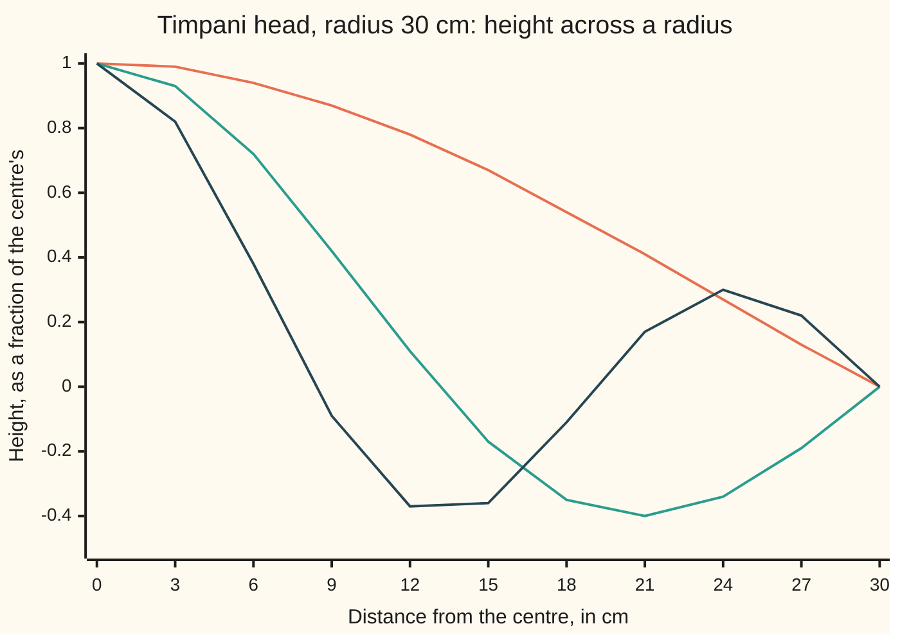

# Bessel's equation: the drum's answer is a new function whose zeros set the drum's notes

[Syllabus](../../../SYLLABUS.md) → [Differential equations and dynamics](../../../SYLLABUS.md#w08) → [Series Solutions and Boundary Problems](../../../SYLLABUS.md#w08-s07) → Bessel's equation

---

## General Overview

A timpani head is a round plastic sheet, 0.3 m in radius, clamped at the rim of a kettle. Waves cross it at 100 m/s, a speed set by its tension and its mass per square metre. Modelled as a thin sheet with no air behind it, its round notes are 127.6 Hz (vibrations per second), 292.8 Hz and 459.1 Hz.

A string with that lowest note would add 255.2 Hz and 382.7 Hz, two and three times it: a whole-number ladder, heard as one clear pitch. A string's notes come from sin(nπx), whose zeros are evenly spaced. The drum's come from the zeros of a new curve, which are not: 2.295 and 3.598 times the fundamental.

The Frobenius method builds that curve as a power series, J0, Bessel's function of order zero. Its first three zeros, 2.404826, 5.520078 and 8.653728, found numerically, fix the three lowest round notes.

**A pure note of a round drum has the shape J0(kr), the one solution of Bessel's equation that stays finite at the centre; clamping the rim forces kR onto a zero of J0, and those zeros are not in whole-number ratio.**

**What kind of fact this is:** a theorem, proved on this card in Why it works; the zeros are computed, and their spacing rule is an approximation.

### The picture: the head's shape in its three lowest round notes



Orange: the fundamental, 127.6 Hz. Teal: 292.8 Hz, one still circle inside the rim. Dark blue: 459.1 Hz, two. Each is J0 stretched so its first, second or third zero lands on the rim.

---

## The formula

Reminder: a differential equation links a function to its own rates ([A differential equation](../01-Rate%20Equations/01-what-a-differential-equation-says.md)); here the rates run outward from the centre.

Bessel's equation of order zero, and its solution equal to 1 at the centre:

$$x^2 y'' + x\,y' + x^2 y = 0, \qquad J_0(x) = \sum_{m=0}^{\infty} \frac{(-1)^m\, x^{2m}}{4^m\,(m!)^2} = 1 - \frac{x^2}{4} + \frac{x^4}{64} - \frac{x^6}{2304} + \cdots$$

**Read it aloud:** start at 1; each term is the last times minus x squared, over four times the term's number squared.

The drum's notes:

$$f_n = \frac{c\, j_n}{2\pi R}$$

**Read it aloud:** the n-th round note is the wave speed times the n-th zero of J0, over the rim's circumference.

| Symbol | Plain meaning | In our example | Push it up and the answer… |
| --- | --- | --- | --- |
| $r$, $R$ | distance from the centre; the rim's radius | 0 to 0.3 m; R = 0.3 m | R up: every note falls |
| $w$ | the head's height in a pure note, as a fraction of the centre's | 1 at the centre, 0 at the rim | — |
| $f$, $c$ | a note's frequency, in Hz; the speed of waves across the head | 127.6 Hz; 100 m/s | c up: notes rise, ratios fixed |
| $k$ | 2πf/c, radians of wave per metre | j_n/R for note n | — |
| $x$, $y$ | the scaled distance kr, a pure number; the shape in terms of x | 0 to 2.404826 for the fundamental | — |
| $s$, $a_n$ | the Frobenius trial power; the coefficient of x^n | s = 0; a_2 = −1/4 | — |
| $J_0$ | the series solution, 1 at the centre: Bessel's function of order zero | J0(2.4) = 0.002508 | — |
| $j_n$ | the n-th zero of J0 | 2.404826, 5.520078, 8.653728 | later zeros space out by about π |

m counts terms; m! is 1 × 2 × … × m.

### When it holds

- **A uniform head at even tension**, so c is the same everywhere; otherwise J0 does not describe it.
- **Round notes only**: shapes that depend on distance, not direction. Notes with a still diameter solve Bessel's equations of higher order, with solutions J1, J2 and so on.
- **Small swings.** A hard strike stretches the head and raises its tension, so the notes rise with loudness.
- **A thin head in empty space.** Stiffness and the kettle's air shift real notes.

---

## Why it works

### Step 0: a note is a shape that keeps its form

In a pure note every point swings in step: height w(r) times cos(2πft), t the time in s. Which shapes and which f does a clamped round head allow?

### Step 1: forces on a ring give the equation

Cut the head into thin rings. Tension pulls each ring from inside and outside. The pull scales with slope times edge length, r w'; where that changes across the ring, the pulls fail to cancel and drive it. Force equals mass times acceleration:

$$w'' + \frac{1}{r}\,w' + k^2 w = 0, \qquad k = \frac{2\pi f}{c}.$$

The middle term is what a string lacks: an outer ring is longer.

<details>
<summary>The ring balance</summary>

Take the ring between r and r + dr. Tension T (newtons per metre of edge) has upward part T w' per metre, over 2πr metres: 2πT r w'. The net upward force is its change across dr, 2πT (r w')' dr. The ring's mass is σ 2πr dr, σ the mass per square metre, and its acceleration is −(2πf)^2 times its height. So T (r w')' = −σ (2πf)^2 r w. Expand (r w')' = r w'' + w', divide by T r, and write c^2 = T/σ.

</details>

Measure distance as x = kr, a pure number. Each rate picks up a factor k, cancelling the k^2; multiplying by x^2 gives Bessel's equation.

### Step 2: the centre is a regular singular point, so try Frobenius

Divided by x^2 the equation reads y'' + y'/x + y = 0. The 1/x blows up at the centre, but no faster than 1/x: a regular singular point, where [Frobenius](02-frobenius-and-regular-singular-points.md) tries a power x^s times a power series:

$$y = \sum_{n \ge 0} a_n\, x^{n+s}.$$

Put it in. The x^2 y'' and x y' terms give (n + s)^2 a_n x^(n+s); the x^2 y term shifts each power up by two. Matching powers:

- lowest, n = 0: s^2 a_0 = 0, so s = 0 twice (the indicial equation);
- n = 1: a_1 = 0;
- every later n: n^2 a_n = −a_(n−2).

Odd coefficients vanish; with a_0 = 1, a_2 = −1/4, a_4 = 1/64, a_6 = −1/2304, a_8 = 1/147456.

### Step 3: the series converges everywhere and solves the equation

Each term is the last times x^2/(4m^2) in size. For fixed x that factor drops below 1/2 once m is large, so the tail is below a halving series: the sum converges for every x. A convergent power series may be differentiated term by term, and the recurrence cancels every power.

### Step 4: the centre rules out the other solution

A second-order equation has two independent solutions. A double indicial root forces the second to carry a logarithm (the Frobenius card): J0(x) ln x plus a series, named Y0 once normalised. It falls without bound at x = 0. A drumhead's centre has finite height, so its shape is a constant times J0(kr).

### Step 5: the clamped rim picks the notes

At the rim the height is zero: J0(kR) = 0. So kR is a zero j_n, and since k = 2πf/c, f_n = c j_n/(2πR). J0(2.4) = 0.002508 and J0(2.41) = −0.002683 bracket the first zero; halving the bracket over and over pins it at 2.404826. Scanning x in steps of 0.1 for sign changes finds 5.520078 and 8.653728.

### Step 6: why the zeros are not evenly spaced

Write y = u/√x. Bessel's equation becomes

$$u'' + \left(1 + \frac{1}{4x^2}\right) u = 0.$$

Far out the 1/(4x^2) is tiny, u behaves like a sine wave, and zeros settle to a spacing of π. Near the centre that term shifts where the wave starts. The zeros come out near (n − 1/4)π: 2.356, 5.498, 8.639, with ratios (4n − 1)/3, that is 2.333 and 3.667, not 2 and 3. The quarter-step offset puts the drum out of tune with itself.

<details>
<summary>Detailed proof: the substitution, and what is stated without proof</summary>

With y = u x^(−1/2): y' = u' x^(−1/2) − (1/2) u x^(−3/2) and y'' = u'' x^(−1/2) − u' x^(−3/2) + (3/4) u x^(−5/2). Then x^2 y'' + x y' + x^2 y = x^(3/2) [u'' + u + u/(4x^2)]: the u' terms cancel.

Not proved here: the phase. J0(x) ≈ √(2/(πx)) cos(x − π/4) for large x (DLMF §10.17). McMahon's correction puts the n-th zero near β + 1/(8β), with β = (n − 1/4)π: 2.4092, 5.5205, 8.6538. The code checks each lies within 0.005 of the computed zero.

</details>

A second road uses no series: Runge-Kutta 4 ([Runge-Kutta four](../05-Numerical%20Evolution/04-runge-kutta-four.md)) steps the equation out from height 1 and slope 0. At x = 0, y'/x is replaced by its limit y''(0), which makes y''(0) = −y(0)/2.

---

## Worked numbers, by hand

| Step | Arithmetic | Value |
| --- | --- | --- |
| indicial equation | lowest power: s^2 a_0 = 0 | s = 0, twice |
| coefficients | a_n = −a_(n−2)/n^2 from a_0 = 1 | −1/4, 1/64, −1/2304, 1/147456 |
| J0(2.4) | 1 − 1.440000 + 0.518400 − 0.082944 + 0.007465 − 0.000430 + 0.000017 | 0.002508 |
| J0(2.41) | the same sum | −0.002683 |
| first zero | halve the bracket until it stops moving | **2.404826** |
| fundamental | 100 × 2.404826 / (2π × 0.3) | **127.6 Hz** |
| overtones | the same with 5.520078 and 8.653728 | **292.8 Hz, 459.1 Hz** |
| ratios | 5.520078 / 2.404826, 8.653728 / 2.404826 | **2.295, 3.598** |

No whole-number ladder: a coloured thud, not a clear pitch.

### What breaks if you drop a piece

| Mistake | Comes out at | What went wrong |
| --- | --- | --- |
| Overtones assumed to be whole multiples | 255.2 and 382.7 Hz, not 292.8 and 459.1 | a string's pattern, not a drum's |
| The y'/x term dropped | cos x: zeros 1.571, 4.712, 7.854, fundamental 83.3 Hz; in the real equation at x = 1.5 it leaves −1.496 | ignores the rings' growing circumference |
| Only four terms of the series kept | 1 zero below 10, at 2.392 | −x^6/2304 takes over; the curve never returns |

---

## Code, from first principles, and it actually runs

Road one sums the series and bisects each sign change. Road two steps the equation by Runge-Kutta 4 at three step lengths; its gap to road one shrinks about sixteenfold per halving.

### Python

```python
# Bessel's equation and the drum -- the check behind the card.  Standard library only.  A timpani
# head, radius 0.3 m, wave speed 100 m/s.  A pure note's shape y(x), x = k r, obeys x^2 y'' + x y' + x^2 y = 0.
# Road one: the Frobenius series J0, zeros by bisection.  Road two: Runge-Kutta 4 out from the centre.
import math
R, C = 0.3, 100.0                          # drum radius (m), wave speed on the head (m/s)
def terms(x, n, wrong=False):              # a_n = -a_(n-2) / n^2; wrong: n(n - 1), y'/x dropped
    out = [1.0]
    for k in range(1, n): out.append(out[-1] * -x * x / ((2 * k) * (2 * k - 1) if wrong else 4 * k * k))
    return out

series = lambda x, n=40, wrong=False: sum(terms(x, n, wrong))
def bisect(f, lo, hi):
    for _ in range(80): lo, hi = ((lo + hi) / 2, hi) if f(lo) * f((lo + hi) / 2) > 0 else (lo, (lo + hi) / 2)
    return (lo + hi) / 2
def zeros(f, xmax=10.0, step=0.1):         # every sign change of f below xmax, refined
    return [bisect(f, i * step, (i + 1) * step) for i in range(int(xmax / step)) if f(i * step) * f((i + 1) * step) < 0]
def rk4(x, y, v, h):                       # one step of y'' = -y'/x - y; at x = 0, y'' = -y/2
    f = lambda x, y, v: (v, -y / 2 if x == 0 else -v / x - y)
    k1 = f(x, y, v); k2 = f(x + h / 2, y + h / 2 * k1[0], v + h / 2 * k1[1])
    k3 = f(x + h / 2, y + h / 2 * k2[0], v + h / 2 * k2[1]); k4 = f(x + h, y + h * k3[0], v + h * k3[1])
    return y + h / 6 * (k1[0] + 2 * k2[0] + 2 * k3[0] + k4[0]), v + h / 6 * (k1[1] + 2 * k2[1] + 2 * k3[1] + k4[1])
def rk4_zeros(h, xmax=10.0):               # step out from y(0) = 1, y'(0) = 0; refine each crossing
    x, y, v, found = 0.0, 1.0, 0.0, []
    while x < xmax - h / 2:
        y2, v2 = rk4(x, y, v, h)
        if y * y2 < 0: found.append(x + bisect(lambda s: rk4(x, y, v, s)[0], 0.0, h))
        x, y, v = x + h, y2, v2
    return found
row = lambda vals, p: " ".join(f"{round(v, p) + 0.0:.{p}f}" for v in vals)
resid = lambda g, x, h=1e-3: x * x * (g(x + h) - 2 * g(x) + g(x - h)) / h ** 2 + x * (g(x + h) - g(x - h)) / (2 * h) + x * x * g(x)
print("indicial s^2 = 0: double root s = 0; a1 = 0; a2, a4, a6, a8 = -1/4, 1/64, -1/2304, 1/147456")
print(f"J0 put into the equation at x = 1.5, rates by differences: residual below 1e-5: {'yes' if abs(resid(series, 1.5)) < 1e-5 else 'no'}")
print("hand check, terms at x = 2.4:", row(terms(2.4, 7), 6), f"; J0(2.4) = {series(2.4):.6f}, J0(2.41) = {series(2.41):.6f}")
js = zeros(series)
print("zeros, series and bisection:", row(js, 6))
errs = []
for h in (0.2, 0.1, 0.05):
    rz = rk4_zeros(h)
    errs.append(max(abs(a - b) for a, b in zip(rz, js)))
    print(f"zeros, RK4 from the centre, h = {h:.2f}:", row(rz, 6), f"; worst error {errs[-1] * 1e6:.2f} millionths")
print(f"error ratio when h halves: {errs[0] / errs[1]:.1f}, {errs[1] / errs[2]:.1f}")
beta = [(n - 0.25) * math.pi for n in (1, 2, 3)]
print("overtone ratios j2/j1, j3/j1:", row([j / js[0] for j in js[1:]], 3), "; large-x estimate (n - 1/4) pi:", row(beta, 3),
      "; its ratios", row([b / beta[0] for b in beta[1:]], 3), "; with 1/(8 beta) added:", row([b + 1 / (8 * b) for b in beta], 4))
fs = [C * j / (2 * math.pi * R) for j in js]
print(f"timpani R = {R} m, c = {C:.0f} m/s: notes", row(fs, 1), "Hz")
print("figure, r (cm):", " ".join(f"{3 * i:5d}" for i in range(11)))
for n in range(3): print(f"figure, mode {n + 1}: ", " ".join(f"{round(series(js[n] * i / 10), 2) + 0.0:5.2f}" for i in range(11)))
print(f"mistake, harmonic overtones: {2 * fs[0]:.1f} and {3 * fs[0]:.1f} Hz, not {fs[1]:.1f} and {fs[2]:.1f}")
cz = zeros(lambda x: series(x, wrong=True))
print("mistake, y'/x dropped (cos x): zeros", row(cz, 3), "; ratios", row([z / cz[0] for z in cz[1:]], 3),
      f"; fundamental {C * cz[0] / (2 * math.pi * R):.1f} Hz; cos x in J0's equation at 1.5: {resid(math.cos, 1.5):.3f}")
tz = zeros(lambda x: series(x, 4))
print(f"mistake, 4 terms of the series: {len(tz)} zero below 10, at {tz[0]:.3f}")
assert errs[-1] < 5e-7                                                         # two roads, one set of zeros
assert 10 < errs[0] / errs[1] < 22 and 10 < errs[1] / errs[2] < 22          # the gap shrinks at fourth order
assert abs(resid(series, 1.5)) < 1e-5 and abs(resid(math.cos, 1.5)) > 1     # J0 solves it, cos x does not
assert all(abs(j - b - 1 / (8 * b)) < 0.005 for j, b in zip(js, beta))     # large-x estimate agrees
print("ALL CHECKS PASS")
```

**Ran 2026-09-28 on macOS, Python 3.14.6, standard library only. All checks passed. Output, pasted from the run:**

```
indicial s^2 = 0: double root s = 0; a1 = 0; a2, a4, a6, a8 = -1/4, 1/64, -1/2304, 1/147456
J0 put into the equation at x = 1.5, rates by differences: residual below 1e-5: yes
hand check, terms at x = 2.4: 1.000000 -1.440000 0.518400 -0.082944 0.007465 -0.000430 0.000017 ; J0(2.4) = 0.002508, J0(2.41) = -0.002683
zeros, series and bisection: 2.404826 5.520078 8.653728
zeros, RK4 from the centre, h = 0.20: 2.404827 5.520115 8.653807 ; worst error 78.59 millionths
zeros, RK4 from the centre, h = 0.10: 2.404825 5.520080 8.653732 ; worst error 4.56 millionths
zeros, RK4 from the centre, h = 0.05: 2.404826 5.520078 8.653728 ; worst error 0.28 millionths
error ratio when h halves: 17.2, 16.5
overtone ratios j2/j1, j3/j1: 2.295 3.598 ; large-x estimate (n - 1/4) pi: 2.356 5.498 8.639 ; its ratios 2.333 3.667 ; with 1/(8 beta) added: 2.4092 5.5205 8.6538
timpani R = 0.3 m, c = 100 m/s: notes 127.6 292.8 459.1 Hz
figure, r (cm):     0     3     6     9    12    15    18    21    24    27    30
figure, mode 1:   1.00  0.99  0.94  0.87  0.78  0.67  0.54  0.41  0.27  0.13  0.00
figure, mode 2:   1.00  0.93  0.72  0.42  0.11 -0.17 -0.35 -0.40 -0.34 -0.19  0.00
figure, mode 3:   1.00  0.82  0.38 -0.09 -0.37 -0.36 -0.11  0.17  0.30  0.22  0.00
mistake, harmonic overtones: 255.2 and 382.7 Hz, not 292.8 and 459.1
mistake, y'/x dropped (cos x): zeros 1.571 4.712 7.854 ; ratios 3.000 5.000 ; fundamental 83.3 Hz; cos x in J0's equation at 1.5: -1.496
mistake, 4 terms of the series: 1 zero below 10, at 2.392
ALL CHECKS PASS
```

### Rust

Same numbers, same labels, built with `rustc --edition 2021 -O`.

```rust
// Bessel's equation and the drum -- the same check as the Python, in Rust.  No crates.  A timpani
// head, radius 0.3 m, wave speed 100 m/s.  A pure note's shape y(x), x = k r, obeys x^2 y'' + x y' + x^2 y = 0.
// Road one: the Frobenius series J0, zeros by bisection.  Road two: Runge-Kutta 4 out from the centre.
use std::f64::consts::PI;
const R: f64 = 0.3; const C: f64 = 100.0;              // drum radius (m), wave speed on the head (m/s)

fn terms(x: f64, n: usize, wrong: bool) -> Vec<f64> {  // a_n = -a_(n-2) / n^2; wrong: n(n - 1), y'/x dropped
    let mut out = vec![1.0];
    for k in 1..n { let d = if wrong { (2 * k * (2 * k - 1)) as f64 } else { (4 * k * k) as f64 }; out.push(out[k - 1] * -x * x / d); }
    out
}
fn series(x: f64) -> f64 { terms(x, 40, false).iter().sum() }
fn bisect(f: &dyn Fn(f64) -> f64, mut lo: f64, mut hi: f64) -> f64 {
    for _ in 0..80 { let mid = (lo + hi) / 2.0; if f(lo) * f(mid) > 0.0 { lo = mid } else { hi = mid } }
    (lo + hi) / 2.0
}
fn zeros(f: &dyn Fn(f64) -> f64) -> Vec<f64> {         // every sign change of f below 10, refined
    (0..100).map(|i| i as f64 * 0.1).filter(|&a| f(a) * f(a + 0.1) < 0.0).map(|a| bisect(f, a, a + 0.1)).collect()
}
fn rk4(x: f64, y: f64, v: f64, h: f64) -> (f64, f64) { // one step of y'' = -y'/x - y; at x = 0, y'' = -y/2
    let f = |x: f64, y: f64, v: f64| (v, if x == 0.0 { -y / 2.0 } else { -v / x - y });
    let k1 = f(x, y, v); let k2 = f(x + h / 2.0, y + h / 2.0 * k1.0, v + h / 2.0 * k1.1);
    let k3 = f(x + h / 2.0, y + h / 2.0 * k2.0, v + h / 2.0 * k2.1); let k4 = f(x + h, y + h * k3.0, v + h * k3.1);
    (y + h / 6.0 * (k1.0 + 2.0 * k2.0 + 2.0 * k3.0 + k4.0), v + h / 6.0 * (k1.1 + 2.0 * k2.1 + 2.0 * k3.1 + k4.1))
}
fn rk4_zeros(h: f64) -> Vec<f64> {                     // step out from y(0) = 1, y'(0) = 0; refine each crossing
    let (mut x, mut y, mut v, mut found) = (0.0, 1.0, 0.0, Vec::new());
    while x < 10.0 - h / 2.0 {
        let (y2, v2) = rk4(x, y, v, h);
        if y * y2 < 0.0 { found.push(x + bisect(&|s| rk4(x, y, v, s).0, 0.0, h)); }
        x += h; y = y2; v = v2;
    }
    found
}
fn fx(v: f64, p: usize, w: usize) -> String {          // fixed decimals, no "-0.00"
    let s = format!("{:w$.p$}", v, w = w, p = p);
    if s.trim_start_matches(|c: char| c == ' ' || c == '-').chars().all(|c| c == '0' || c == '.') { format!("{:w$.p$}", 0.0, w = w, p = p) } else { s }
}
fn row(vals: &[f64], p: usize) -> String { vals.iter().map(|&v| fx(v, p, 0)).collect::<Vec<_>>().join(" ") }
fn resid(g: &dyn Fn(f64) -> f64, x: f64) -> f64 {
    let h = 1e-3;
    x * x * (g(x + h) - 2.0 * g(x) + g(x - h)) / (h * h) + x * (g(x + h) - g(x - h)) / (2.0 * h) + x * x * g(x)
}

fn main() {
    println!("indicial s^2 = 0: double root s = 0; a1 = 0; a2, a4, a6, a8 = -1/4, 1/64, -1/2304, 1/147456");
    println!("J0 put into the equation at x = 1.5, rates by differences: residual below 1e-5: {}", if resid(&series, 1.5).abs() < 1e-5 { "yes" } else { "no" });
    println!("hand check, terms at x = 2.4: {} ; J0(2.4) = {:.6}, J0(2.41) = {:.6}", row(&terms(2.4, 7, false), 6), series(2.4), series(2.41));
    let js = zeros(&series);
    println!("zeros, series and bisection: {}", row(&js, 6));
    let mut errs: Vec<f64> = Vec::new();
    for h in [0.2, 0.1, 0.05] {
        let rz = rk4_zeros(h);
        errs.push(rz.iter().zip(&js).map(|(a, b)| (a - b).abs()).fold(0.0, f64::max));
        println!("zeros, RK4 from the centre, h = {:.2}: {} ; worst error {:.2} millionths", h, row(&rz, 6), errs[errs.len() - 1] * 1e6);
    }
    println!("error ratio when h halves: {:.1}, {:.1}", errs[0] / errs[1], errs[1] / errs[2]);
    let beta: Vec<f64> = (1..=3).map(|n| (n as f64 - 0.25) * PI).collect();
    let ratios: Vec<f64> = js[1..].iter().map(|j| j / js[0]).collect();
    let bratios: Vec<f64> = beta[1..].iter().map(|b| b / beta[0]).collect();
    let mcm: Vec<f64> = beta.iter().map(|b| b + 1.0 / (8.0 * b)).collect();
    println!("overtone ratios j2/j1, j3/j1: {} ; large-x estimate (n - 1/4) pi: {} ; its ratios {} ; with 1/(8 beta) added: {}", row(&ratios, 3), row(&beta, 3), row(&bratios, 3), row(&mcm, 4));
    let fs: Vec<f64> = js.iter().map(|j| C * j / (2.0 * PI * R)).collect();
    println!("timpani R = {} m, c = {:.0} m/s: notes {} Hz", R, C, row(&fs, 1));
    println!("figure, r (cm): {}", (0..11).map(|i| format!("{:5}", 3 * i)).collect::<Vec<_>>().join(" "));
    for n in 0..3 { println!("figure, mode {}:  {}", n + 1, (0..11).map(|i| fx(series(js[n] * i as f64 / 10.0), 2, 5)).collect::<Vec<_>>().join(" ")); }
    println!("mistake, harmonic overtones: {:.1} and {:.1} Hz, not {:.1} and {:.1}", 2.0 * fs[0], 3.0 * fs[0], fs[1], fs[2]);
    let cz = zeros(&|x| terms(x, 40, true).iter().sum());
    let cr: Vec<f64> = cz[1..].iter().map(|z| z / cz[0]).collect();
    println!("mistake, y'/x dropped (cos x): zeros {} ; ratios {} ; fundamental {:.1} Hz; cos x in J0's equation at 1.5: {:.3}", row(&cz, 3), row(&cr, 3), C * cz[0] / (2.0 * PI * R), resid(&|x: f64| x.cos(), 1.5));
    let tz = zeros(&|x| terms(x, 4, false).iter().sum());
    println!("mistake, 4 terms of the series: {} zero below 10, at {:.3}", tz.len(), tz[0]);
    assert!(errs[errs.len() - 1] < 5e-7);                                            // two roads, one set of zeros
    assert!(10.0 < errs[0] / errs[1] && errs[0] / errs[1] < 22.0 && 10.0 < errs[1] / errs[2] && errs[1] / errs[2] < 22.0);
    assert!(resid(&series, 1.5).abs() < 1e-5 && resid(&|x: f64| x.cos(), 1.5).abs() > 1.0);   // J0 solves it, cos x does not
    assert!(js.iter().zip(&beta).all(|(j, b)| (j - b - 1.0 / (8.0 * b)).abs() < 0.005));     // large-x estimate agrees
    println!("ALL CHECKS PASS");
}
```

**Ran 2026-09-28 on macOS, rustc 1.98.1, no crates. All checks passed. Output, pasted from the run:**

```
indicial s^2 = 0: double root s = 0; a1 = 0; a2, a4, a6, a8 = -1/4, 1/64, -1/2304, 1/147456
J0 put into the equation at x = 1.5, rates by differences: residual below 1e-5: yes
hand check, terms at x = 2.4: 1.000000 -1.440000 0.518400 -0.082944 0.007465 -0.000430 0.000017 ; J0(2.4) = 0.002508, J0(2.41) = -0.002683
zeros, series and bisection: 2.404826 5.520078 8.653728
zeros, RK4 from the centre, h = 0.20: 2.404827 5.520115 8.653807 ; worst error 78.59 millionths
zeros, RK4 from the centre, h = 0.10: 2.404825 5.520080 8.653732 ; worst error 4.56 millionths
zeros, RK4 from the centre, h = 0.05: 2.404826 5.520078 8.653728 ; worst error 0.28 millionths
error ratio when h halves: 17.2, 16.5
overtone ratios j2/j1, j3/j1: 2.295 3.598 ; large-x estimate (n - 1/4) pi: 2.356 5.498 8.639 ; its ratios 2.333 3.667 ; with 1/(8 beta) added: 2.4092 5.5205 8.6538
timpani R = 0.3 m, c = 100 m/s: notes 127.6 292.8 459.1 Hz
figure, r (cm):     0     3     6     9    12    15    18    21    24    27    30
figure, mode 1:   1.00  0.99  0.94  0.87  0.78  0.67  0.54  0.41  0.27  0.13  0.00
figure, mode 2:   1.00  0.93  0.72  0.42  0.11 -0.17 -0.35 -0.40 -0.34 -0.19  0.00
figure, mode 3:   1.00  0.82  0.38 -0.09 -0.37 -0.36 -0.11  0.17  0.30  0.22  0.00
mistake, harmonic overtones: 255.2 and 382.7 Hz, not 292.8 and 459.1
mistake, y'/x dropped (cos x): zeros 1.571 4.712 7.854 ; ratios 3.000 5.000 ; fundamental 83.3 Hz; cos x in J0's equation at 1.5: -1.496
mistake, 4 terms of the series: 1 zero below 10, at 2.392
ALL CHECKS PASS
```

The two outputs match line for line.

> [!TIP]
> **Try changing**
> Guess first, then run it.
> - **Tighten the head.** Double `C`. Every note doubles; the ratios stay 2.295 and 3.598.
> - **A bigger drum.** Set `R` to `0.6`. Every note halves.
> - **Coarser steps.** Put `0.4` first in the step lengths. Its worst error is about seventeen times that at 0.2, near the sixteen fourth order predicts.

---

## The usual mistake

> [!warning]
> **Expecting a drum's overtones to be whole multiples, as a string's are.** A string's notes come from sin(nπx), with evenly spaced zeros. J0's zeros sit near (n − 1/4)π: evenly spaced far out, but shifted a quarter step, so their ratios are not whole numbers. The overtones land at 2.295 and 3.598 times the fundamental, 292.8 and 459.1 Hz, not 255.2 and 382.7.
>
> - **Dropping y'/x.** The answer becomes cos x, fundamental 83.3 Hz.
> - **Keeping Y0 as well.** It is infinite at the centre.
> - **Trusting a short series far out.** Four terms find one zero, at 2.392.

---

## Where you meet it in real life

- **Orchestral timpani.** The kettle's air pulls the notes with still diameters, J1 and higher, close to a whole-number ladder, and the round J0 notes fade fast: that is how timpani get a pitch at all.
- **This shelf.** The notes are eigenvalues of a boundary problem ([Eigenvalue problems](08-eigenvalues-and-eigenfunctions.md)); aiming from the centre at the rim is [Shooting](06-the-shooting-method.md).

> **Say it back**
> Forces on thin rings of a drumhead give Bessel's equation. Frobenius gives J0, a series converging everywhere; the other solution is infinite at the centre, so the shape is J0(kr). A clamped rim puts kR on a zero of J0: 2.404826, 5.520078, 8.653728. These sit near (n − 1/4)π, so the overtones are 2.295 and 3.598 times the fundamental: no clear pitch.

---

## What this builds on

- [Frobenius](02-frobenius-and-regular-singular-points.md): the trial x^s times a series, the indicial equation, and the logarithm a double root forces.

## Where this goes next

- [Sturm-Liouville](09-sturm-liouville-and-orthogonality.md): why the zeros never run out, and why the shapes are orthogonal.
- Waves on strings and drums: the wave equation behind the ring balance.
- Drumheads: every mode, including those with still diameters.

A real strike sounds many notes at once; how much of each it contains is the orthogonality question Sturm-Liouville answers.

---

## Sources

Verified 2026-09-28: every link below opens a page naming the cited work.

- NIST Digital Library of Mathematical Functions, §10.2, "Definitions," Bessel Functions. [dlmf.nist.gov/10.2](https://dlmf.nist.gov/10.2). The equation, J0's series, and the logarithmic second solution.
- NIST Digital Library of Mathematical Functions, §10.21, "Zeros." [dlmf.nist.gov/10.21](https://dlmf.nist.gov/10.21). Zeros of J0 and McMahon's expansion.
- Bender, Carl M., and Steven A. Orszag. *Advanced Mathematical Methods for Scientists and Engineers I*. Springer, 1999. [DOI 10.1007/978-1-4757-3069-2](https://doi.org/10.1007/978-1-4757-3069-2). Frobenius series at a regular singular point; Bessel as the model case.
- Fletcher, Neville H., and Thomas D. Rossing. *The Physics of Musical Instruments*, 2nd ed. Springer, 1998. [DOI 10.1007/978-0-387-21603-4](https://doi.org/10.1007/978-0-387-21603-4). The round membrane's modes, and how the kettle's air tunes timpani.
