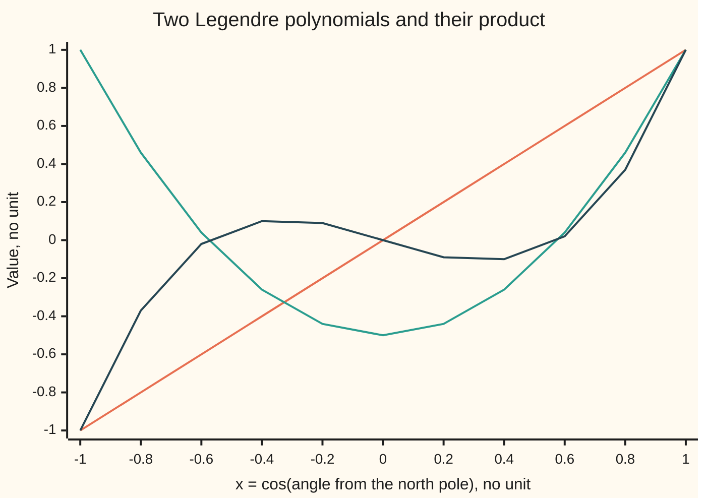

# Legendre's equation: for whole-number parameters the series stops, giving a family of polynomials

[Syllabus](../../../SYLLABUS.md) → [Differential equations and dynamics](../../../SYLLABUS.md#w08) → [Series Solutions and Boundary Problems](../../../SYLLABUS.md#w08-s07) → Legendre's equation

---

## General Overview

A hollow sphere of radius 10 cm has its surface held at 30 V times the square of the cosine of the angle from the north pole: 30 V at both poles, 0 V round the equator. No charge sits inside. What is the voltage at the centre, and 5 cm out?

Inside, the voltage obeys Laplace's equation: at every point it equals its average over any small ball around it. Write θ for the angle from the north pole and x = cos θ: x runs from 1 at the north pole through 0 on the equator to −1 at the south pole. In x, the angle part of Laplace's equation is Legendre's equation, whose solutions finite at both poles are the Legendre polynomials. The surface voltage mixes two of them, and the answers follow: 10 V at the centre, 15 V at 5 cm along the axis, 7.50 V at 5 cm towards the equator.

Two facts do the work. The power-series solution stops exactly when a parameter is a whole number. And the polynomials are orthogonal: two different ones, multiplied and integrated from −1 to 1, give zero, so each one's share of a mix is read off alone.

**When the parameter n is a whole number, one series solution of (1 − x^2) y'' − 2x y' + n(n + 1) y = 0 stops at x^n; scaled to equal 1 at x = 1 it is the Legendre polynomial of degree n, and different ones are orthogonal on −1 to 1.**

**What kind of fact this is:** a theorem, proved on this card in Why it works; the norm 2/(2n + 1) is checked for n up to 4 and proved in the sources.

### The picture: P1, P2 and their product



Orange: P1(x) = x. Teal: P2(x) = (3x^2 − 1)/2, lowest on the equator. Dark blue: the product P1 P2, odd (flipping x flips its sign), so its area left of 0 cancels its area right of 0. The picture illustrates; Step 3 proves.

---

## The formula

Reminder: a differential equation links an unknown function to its own rates. Here the variable is x = cos θ, and primes are rates in x.

$$(1 - x^2)\,y'' - 2x\,y' + n(n+1)\,y = 0$$

**Read it aloud:** one minus x squared times the second rate, minus 2x times the first rate, plus n(n + 1) times the function, is zero between the poles.

A power series y = a_0 + a_1 x + a_2 x^2 + … must obey

$$a_{k+2} = \frac{(k - n)(k + n + 1)}{(k + 1)(k + 2)}\,a_k$$

**Read it aloud:** each coefficient is the one two back times a factor that is zero at k = n.

So for whole n one series stops at x^n. Scaled to 1 at x = 1:

$$P_0 = 1,\quad P_1 = x,\quad P_2 = \tfrac{3x^2 - 1}{2},\quad P_3 = \tfrac{5x^3 - 3x}{2},\quad P_4 = \tfrac{35x^4 - 30x^2 + 3}{8}$$

For different whole numbers m and n:

$$\int_{-1}^{1} P_m(x)\,P_n(x)\,dx = 0, \qquad \int_{-1}^{1} P_n(x)^2\,dx = \frac{2}{2n + 1}.$$

**Read it aloud:** two different ones multiplied and integrated from −1 to 1 give zero; one squared gives 2/(2n + 1).

| Symbol | Plain meaning | In our example | Push it up and the answer… |
| --- | --- | --- | --- |
| $x$, $\theta$ | cos θ, no unit; θ the angle from the north pole | x = 1 at the pole, 0 on the equator | — |
| $n$ | the whole number in n(n + 1); the degree | 2 | one more zero between poles |
| $y$, $y'$, $y''$ | the unknown; its rate in x; that rate's rate | P2 = −0.5 at x = 0 | — |
| $a_k$ | coefficient of x^k | 1, 0, −3 for n = 2, unscaled | — |
| $P_n$ | Legendre polynomial, degree n, P_n(1) = 1 | (3x^2 − 1)/2 | more wiggles |
| $c_n$ | volts of P_n in the surface voltage | 10, 0, 20, 0, 0 | — |
| $r$, $R$, $V$ | distance from centre; radius; voltage | 5 cm; 10 cm; 15 V | r up: V nears the surface |

### When it holds

- **n whole.** For n = 0.5 no series stops, and at x = 1 the partial sums run 0.2167, −0.4464, −1.1242 up to x^10, x^100, x^1000: no finite pole value.
- **Finite at both poles.** The other series solves the equation too but blows up at x = ±1. A cone that leaves out the south pole asks for one finite pole only, and non-whole n return.
- **Weight 1 on −1 to 1.** With weight 1 − x^2 inside the integral, P0 and P2 give −0.2667, not 0.
- **Latitude only.** A voltage that also changes with longitude needs the associated Legendre functions (The Laplacian in round coordinates, and the modes it splits into).

---

## Why it works

### Step 0: x = 0 is an ordinary point, so a power series works

Near x = 0 the coefficient 1 − x^2 is not zero, so a power series solves the equation for any a_0 and a_1 ([Series solutions](01-power-series-at-an-ordinary-point.md)). It is promised only up to the poles x = ±1, where 1 − x^2 is zero; whether it survives there decides everything.

### Step 1: matching powers gives the two-step rule

Put y = sum of a_k x^k in and collect the x^k terms: (1 − x^2) y'' gives (k+2)(k+1) a_{k+2} and −k(k−1) a_k, −2x y' gives −2k a_k, the last term n(n+1) a_k. Their total is zero for every k:

$$(k+2)(k+1)\,a_{k+2}=\bigl(k(k+1)-n(n+1)\bigr)\,a_k=(k-n)(k+n+1)\,a_k.$$

Even links only to even: an even series started by a_0, an odd one by a_1.

### Step 2: a whole number n stops one of them

At k = n the factor k − n is zero. For even n the even series stops at x^n; for odd n, the odd one. The other never meets k = n.

For n = 2: a_0 = 1, a_2 = (0−2)(0+3)/2 = −3, a_4 = 0. So 1 − 3x^2, which is −2 at x = 1; dividing by −2 gives P2. Likewise x − (5/3)x^3 is −0.6667 at x = 1, and the n = 4 series is 2.6667.

A series that does not stop is infinite at a pole, so only whole n give a solution finite at both.

<details>
<summary>Detailed proof: a series that does not stop is infinite at a pole</summary>

For the even series (the odd is alike) and k ≥ 2, a_{k+2}/a_k = (k/(k + 2)) × (1 − n(n + 1)/(k(k + 1))). The first factor alone gives a_k = constant/k. The second is never zero when k never equals n, and the product of such factors converges to a non-zero number, since the sum of 1/(k(k + 1)) converges. So a_k is about L/k, L not zero.

At x = 1 the series is about L(1/2 + 1/4 + 1/6 + …), half the harmonic series: it grows like (L/2) ln k. The odd series does the same with sign flipped at x = −1. A mix whose growths cancel at x = 1 doubles at x = −1 unless both amounts are zero.

</details>

### Step 3: different P_n are orthogonal

The equation is ((1 − x^2) y')' + n(n+1) y = 0, as expanding the first rate shows. Multiply P_m's equation by P_n and P_n's by P_m, subtract, integrate from −1 to 1:

$$\bigl(m(m+1)-n(n+1)\bigr)\int_{-1}^{1}P_mP_n\,dx=\Bigl[(1-x^2)\bigl(P_mP_n'-P_nP_m'\bigr)\Bigr]_{-1}^{1}.$$

<details>
<summary>The algebra behind this</summary>

P_n ((1 − x^2) P_m')' − P_m ((1 − x^2) P_n')' is the rate of (1 − x^2)(P_n P_m' − P_m P_n'), by the product rule: the cross terms (1 − x^2) P_n' P_m' cancel. Integrating a rate leaves the end values. The n(n + 1) terms give the left side.

</details>

The right side is zero: 1 − x^2 vanishes at both ends, where the polynomials are finite. For m ≠ n the bracket on the left is not zero, so the integral is. The same argument for every equation of this shape is [Sturm-Liouville](09-sturm-liouville-and-orthogonality.md).

The squared integrals are 2, 0.6667, 0.4000, 0.2857, 0.2222 for n = 0 to 4, matching 2/(2n + 1), proved in the DLMF (Sources).

### Step 4: orthogonality reads off the mix

If a surface voltage f(x) is c_0 P_0 + c_1 P_1 + c_2 P_2 + …, multiply by P_n and integrate from −1 to 1. Only the n-th term survives:

$$c_n=\frac{2n+1}{2}\int_{-1}^{1}f(x)\,P_n(x)\,dx.$$

This is projection onto one direction ([Projection](../../03-Algebra/06-Dot%20Products%20and%20Best%20Fits/02-orthogonal-projection.md)), with the integral as the dot product. For f = 30x^2: c_0 = 10 V, c_2 = 20 V, the rest 0, so 30x^2 = 10 + 20 P2(x).

Inside, each P_n is multiplied by (r/R)^n, so V = c_0 + c_2 (r/R)^2 P2(cos θ); that radial factor is derived in The Laplacian in round coordinates, and the modes it splits into.

A second road to the polynomials, with no series, is Bonnet's rule, started from P0 = 1 and P1 = x:

$$(n+1)\,P_{n+1}=(2n+1)\,x\,P_n-n\,P_{n-1}.$$

---

## Worked numbers, by hand

| Step | Arithmetic | Value |
| --- | --- | --- |
| series, n = 2 | a_2 = (0−2)(0+3)/2 | 1 − 3x^2 |
| scale to 1 at x = 1 | divide by −2 | P2 = (3x^2 − 1)/2 |
| P1 P2 integrated | x(3x^2 − 1)/2 is odd | **0** |
| P2 squared integrated | (9×2/5 − 6×2/3 + 2)/4 | **0.4000** |
| c_0 | (1/2)×30×2/3 | 10 V |
| c_2 | (5/2)×15×(6/5 − 2/3) | 20 V |
| centre | c_0 | **10.00 V** |
| 5 cm, axis | 10 + 20×0.25×1 | **15.00 V** |
| 5 cm, equator | 10 + 20×0.25×(−0.5) | **7.50 V** |

The centre sits at 10 V, the surface voltage averaged over the sphere; halfway out, 15 V towards a pole and 7.50 V towards the equator.

### What breaks if you drop a piece

| Mistake | Comes out at | What went wrong |
| --- | --- | --- |
| n = 0.5 | 0.2167, −0.4464, −1.1242 at x = 1, falling | No series stops |
| Weight 1 − x^2 | P0 with P2: −0.2667 | The weight is 1 |
| (2n + 1)/2 dropped | centre 20.00 V, not 10.00 | P_n do not have length 1 |

---

## Code, from first principles, and it actually runs

Two roads each: the polynomials by the stopped series and by Bonnet's rule; orthogonality exactly from coefficients (x^k integrates to 2/(k+1) for even k, 0 for odd) and by Simpson's rule, a weighted sum of samples. Euler's rule, adding step length times rate ([Euler's method](../05-Numerical%20Evolution/01-eulers-method.md)), solves the n = 2 equation with no polynomial; its error halves with the step. The centre voltage is checked against the surface average over θ.

### Python

```python
# Legendre polynomials -- the check behind the card.  Standard library only.
# Legendre's equation: (1 - x^2) y'' - 2x y' + n(n+1) y = 0.  Road one: the
# power series, which stops at x^n when n is whole.  Road two: Bonnet's rule,
# no series.  Orthogonality: exact from coefficients, and by Simpson's rule.
# The sphere: radius 10 cm, surface held at 30 cos^2(theta) volts.
import math

def series(n, start, terms):            # a_(k+2) = (k - n)(k + n + 1) / ((k + 1)(k + 2)) a_k
    a = [0.0] * start + [1.0]
    for k in range(start, terms - 2, 2): a += [0.0, (k - n) * (k + n + 1) / ((k + 1) * (k + 2)) * a[k]]
    return a
def P(n):                               # the series of n's parity, cut at x^n, scaled so P_n(1) = 1
    a = series(n, n % 2, n + 1)
    return [ak / sum(a) + 0.0 for ak in a]
def bonnet(n):                          # (m + 1) P_(m+1) = (2m + 1) x P_m - m P_(m-1)
    p, q = [1.0], [0.0, 1.0]
    for m in range(1, n):
        p, q = q, [((2 * m + 1) * ([0.0] + q)[i] - m * (p + [0.0, 0.0])[i]) / (m + 1) for i in range(m + 2)]
    return p if n == 0 else q
def ev(c, x): return sum(ck * x ** k for k, ck in enumerate(c))
def mul(a, b): return [sum(a[i] * b[k - i] for i in range(len(a)) if 0 <= k - i < len(b)) for k in range(len(a) + len(b) - 1)]
def exact(c): return sum(2 * ck / (k + 1) for k, ck in enumerate(c) if k % 2 == 0)   # integral over [-1, 1]
def simpson(f, a, b, m=2000):
    h = (b - a) / m
    return h / 3 * sum((1 if i in (0, m) else 4 if i % 2 else 2) * f(a + i * h) for i in range(m + 1))

Ps = [P(n) for n in range(5)]
print("before scaling, value at x = 1 for n = 2, 3, 4:", " ".join(f"{sum(series(n, n % 2, n + 1)):.4f}" for n in (2, 3, 4)), "; n = 2 coefficients:", " ".join(f"{a:.4f}" for a in series(2, 0, 3)))
for n in (2, 3, 4): print(f"P{n}, series, coefficients of x^0..x^{n}:", " ".join(f"{c:.4f}" for c in Ps[n]))
gap = max(abs(a - b) for n in range(5) for a, b in zip(Ps[n], bonnet(n)))
print(f"largest gap, series against Bonnet, P0..P4: {gap:.1e}")
G = [[exact(mul(Ps[m], Ps[n])) for n in range(5)] for m in range(5)]
S = [[simpson(lambda x: ev(Ps[m], x) * ev(Ps[n], x), -1, 1) for n in range(5)] for m in range(5)]
print("integral of P_n^2, exact:", " ".join(f"{G[n][n]:.4f}" for n in range(5)), "; 2/(2n+1):", " ".join(f"{2 / (2 * n + 1):.4f}" for n in range(5)))
off = max(abs(S[m][n]) for m in range(5) for n in range(5) if m != n)
print(f"integral of P1 P2: exact {G[1][2]:.6f}, Simpson {S[1][2] + 0.0:.6f}; largest m != n, Simpson: {off:.1e}")
errs = []
for N in (100, 200, 400):               # Euler's rule on the equation, n = 2, from x = 0 to 0.5
    x, y, v, h = 0.0, -0.5, 0.0, 0.5 / N
    for _ in range(N): x, y, v = x + h, y + h * v, v + h * (2 * x * v - 6 * y) / (1 - x * x)
    errs.append(y - ev(Ps[2], 0.5))
print(f"Euler to x = 0.5, n = 2, 100/200/400 steps: errors {errs[0]:+.5f} {errs[1]:+.5f} {errs[2]:+.5f}; P2(0.5) = {ev(Ps[2], 0.5):.4f}")
c = [(2 * n + 1) / 2 * exact(mul([0, 0, 30.0], Ps[n])) + 0.0 for n in range(5)]
cs = [(2 * n + 1) / 2 * simpson(lambda x: 30 * x * x * ev(Ps[n], x), -1, 1) for n in range(5)]
print("sphere, c0..c4 in volts, exact:", " ".join(f"{v:.4f}" for v in c), f"; Simpson gap {max(abs(a - b) for a, b in zip(c, cs)):.1e}")
avg = simpson(lambda t: 30 * math.cos(t) ** 2 * math.sin(t) / 2, 0, math.pi)
V = lambda r, ct: sum(c[n] * (r / 0.1) ** n * ev(Ps[n], ct) for n in range(5))
print(f"potential: centre {V(0, 1):.2f} V, surface average {avg:.4f} V; 5 cm, on the axis {V(0.05, 1):.2f} V, at the equator {V(0.05, 0):.2f} V")
half = [sum(series(0.5, 0, t)) for t in (11, 101, 1001)]
print("mistake, n = 0.5, series at x = 1 up to x^10, x^100, x^1000:", " ".join(f"{s:.4f}" for s in half))
print(f"mistake, weight (1 - x^2): integral of P0 P2 = {exact(mul([1, 0, -1], Ps[2])):.4f}; dropping (2n+1)/2: centre {2 * c[0]:.2f} V")
xs = [(i - 5) / 5 for i in range(11)]
for lab, f in (("P1", lambda x: ev(Ps[1], x)), ("P2", lambda x: ev(Ps[2], x)), ("P1 P2", lambda x: ev(Ps[1], x) * ev(Ps[2], x))):
    print(f"figure, {lab} at x = -1, -0.8, ..., 1:", " ".join(f"{f(x) + 0.0:.2f}" for x in xs))
assert gap < 1e-12 and max(abs(S[n][n] - 2 / (2 * n + 1)) for n in range(5)) < 1e-9 and off < 1e-9
assert abs(errs[2]) < 0.005 and 1.8 < errs[0] / errs[1] < 2.2 and 1.8 < errs[1] / errs[2] < 2.2
assert abs(c[0] - avg) < 1e-9 and max(abs(a - b) for a, b in zip(c, cs)) < 1e-8
assert half[1] - half[2] > 0.5 and half[0] - half[1] > 0.5
print("ALL CHECKS PASS")
```

**Ran 2026-09-28 on macOS, Python 3.14.6, standard library only. All checks passed. Output, pasted from the run:**

```
before scaling, value at x = 1 for n = 2, 3, 4: -2.0000 -0.6667 2.6667 ; n = 2 coefficients: 1.0000 0.0000 -3.0000
P2, series, coefficients of x^0..x^2: -0.5000 0.0000 1.5000
P3, series, coefficients of x^0..x^3: 0.0000 -1.5000 0.0000 2.5000
P4, series, coefficients of x^0..x^4: 0.3750 0.0000 -3.7500 0.0000 4.3750
largest gap, series against Bonnet, P0..P4: 1.8e-15
integral of P_n^2, exact: 2.0000 0.6667 0.4000 0.2857 0.2222 ; 2/(2n+1): 2.0000 0.6667 0.4000 0.2857 0.2222
integral of P1 P2: exact 0.000000, Simpson 0.000000; largest m != n, Simpson: 6.7e-12
Euler to x = 0.5, n = 2, 100/200/400 steps: errors -0.00276 -0.00137 -0.00068; P2(0.5) = -0.1250
sphere, c0..c4 in volts, exact: 10.0000 0.0000 20.0000 0.0000 0.0000 ; Simpson gap 6.5e-10
potential: centre 10.00 V, surface average 10.0000 V; 5 cm, on the axis 15.00 V, at the equator 7.50 V
mistake, n = 0.5, series at x = 1 up to x^10, x^100, x^1000: 0.2167 -0.4464 -1.1242
mistake, weight (1 - x^2): integral of P0 P2 = -0.2667; dropping (2n+1)/2: centre 20.00 V
figure, P1 at x = -1, -0.8, ..., 1: -1.00 -0.80 -0.60 -0.40 -0.20 0.00 0.20 0.40 0.60 0.80 1.00
figure, P2 at x = -1, -0.8, ..., 1: 1.00 0.46 0.04 -0.26 -0.44 -0.50 -0.44 -0.26 0.04 0.46 1.00
figure, P1 P2 at x = -1, -0.8, ..., 1: -1.00 -0.37 -0.02 0.10 0.09 0.00 -0.09 -0.10 0.02 0.37 1.00
ALL CHECKS PASS
```

### Rust

Same numbers, same labels, built with `rustc --edition 2021 -O`.

```rust
// Legendre polynomials -- the same check as the Python, in Rust.  No crates.
// Legendre's equation: (1 - x^2) y'' - 2x y' + n(n+1) y = 0.  Road one: the
// power series, which stops at x^n when n is whole.  Road two: Bonnet's rule,
// no series.  Orthogonality: exact from coefficients, and by Simpson's rule.
// The sphere: radius 10 cm, surface held at 30 cos^2(theta) volts.
fn series(n: f64, start: usize, terms: usize) -> Vec<f64> {   // a_(k+2) = (k - n)(k + n + 1) / ((k + 1)(k + 2)) a_k
    let (mut a, mut k) = ([vec![0.0; start], vec![1.0]].concat(), start);
    while k + 2 < terms {
        let kf = k as f64;
        let next = (kf - n) * (kf + n + 1.0) / ((kf + 1.0) * (kf + 2.0)) * a[k];
        a.push(0.0); a.push(next); k += 2;
    }
    a
}
fn p(n: usize) -> Vec<f64> {            // the series of n's parity, cut at x^n, scaled so P_n(1) = 1
    let a = series(n as f64, n % 2, n + 1);
    let s: f64 = a.iter().sum();
    a.iter().take(n + 1).map(|v| v / s + 0.0).collect()
}
fn bonnet(n: usize) -> Vec<f64> {       // (m + 1) P_(m+1) = (2m + 1) x P_m - m P_(m-1)
    let (mut p0, mut q) = (vec![1.0], vec![0.0, 1.0]);
    for m in 1..n {
        let mf = m as f64;
        let r: Vec<f64> = (0..m + 2).map(|i| ((2.0 * mf + 1.0) * (if i > 0 { q[i - 1] } else { 0.0 }) - mf * p0.get(i).copied().unwrap_or(0.0)) / (mf + 1.0)).collect();
        p0 = q; q = r;
    }
    if n == 0 { p0 } else { q }
}
fn ev(c: &[f64], x: f64) -> f64 { c.iter().enumerate().map(|(k, v)| v * x.powi(k as i32)).sum() }
fn mul(a: &[f64], b: &[f64]) -> Vec<f64> {
    let mut r = vec![0.0; a.len() + b.len() - 1];
    for i in 0..a.len() { for j in 0..b.len() { r[i + j] += a[i] * b[j]; } }
    r
}
fn exact(c: &[f64]) -> f64 { c.iter().enumerate().filter(|(k, _)| k % 2 == 0).map(|(k, v)| 2.0 * v / (k as f64 + 1.0)).sum() }
fn simpson(f: &dyn Fn(f64) -> f64, a: f64, b: f64) -> f64 {
    let (m, h) = (2000, (b - a) / 2000.0);
    h / 3.0 * (0..=m).map(|i| (if i == 0 || i == m { 1.0 } else if i % 2 == 1 { 4.0 } else { 2.0 }) * f(a + i as f64 * h)).sum::<f64>()
}
fn join(v: &[f64], d: usize) -> String { v.iter().map(|x| format!("{:.*}", d, x)).collect::<Vec<_>>().join(" ") }

fn main() {
    let ps: Vec<Vec<f64>> = (0..5).map(p).collect();
    println!("before scaling, value at x = 1 for n = 2, 3, 4: {} ; n = 2 coefficients: {}", join(&[2usize, 3, 4].map(|n| series(n as f64, n % 2, n + 1).iter().sum()), 4), join(&series(2.0, 0, 3), 4));
    for n in 2..5 { println!("P{}, series, coefficients of x^0..x^{}: {}", n, n, join(&ps[n], 4)); }
    let gap = (0..5).flat_map(|n| ps[n].iter().zip(bonnet(n)).map(|(a, b)| (a - b).abs()).collect::<Vec<_>>()).fold(0.0, f64::max);
    println!("largest gap, series against Bonnet, P0..P4: {:.1e}", gap);
    let g = |m: usize, n: usize| exact(&mul(&ps[m], &ps[n]));
    let s = |m: usize, n: usize| simpson(&|x| ev(&ps[m], x) * ev(&ps[n], x), -1.0, 1.0);
    let diag: Vec<f64> = (0..5).map(|n| g(n, n)).collect();
    let norm: Vec<f64> = (0..5).map(|n| 2.0 / (2.0 * n as f64 + 1.0)).collect();
    println!("integral of P_n^2, exact: {} ; 2/(2n+1): {}", join(&diag, 4), join(&norm, 4));
    let off = (0..25).filter(|i| i / 5 != i % 5).map(|i| s(i / 5, i % 5).abs()).fold(0.0, f64::max);
    println!("integral of P1 P2: exact {:.6}, Simpson {:.6}; largest m != n, Simpson: {:.1e}", g(1, 2), s(1, 2) + 0.0, off);
    let mut errs = Vec::new();
    for big_n in [100usize, 200, 400] {  // Euler's rule on the equation, n = 2, from x = 0 to 0.5
        let (mut x, mut y, mut v, h) = (0.0f64, -0.5f64, 0.0f64, 0.5 / big_n as f64);
        for _ in 0..big_n { let v2 = v + h * (2.0 * x * v - 6.0 * y) / (1.0 - x * x); y += h * v; v = v2; x += h; }
        errs.push(y - ev(&ps[2], 0.5));
    }
    println!("Euler to x = 0.5, n = 2, 100/200/400 steps: errors {:+.5} {:+.5} {:+.5}; P2(0.5) = {:.4}", errs[0], errs[1], errs[2], ev(&ps[2], 0.5));
    let c: Vec<f64> = (0..5).map(|n| (2.0 * n as f64 + 1.0) / 2.0 * exact(&mul(&[0.0, 0.0, 30.0], &ps[n])) + 0.0).collect();
    let cs: Vec<f64> = (0..5).map(|n| (2.0 * n as f64 + 1.0) / 2.0 * simpson(&|x| 30.0 * x * x * ev(&ps[n], x), -1.0, 1.0)).collect();
    let cgap = c.iter().zip(&cs).map(|(a, b)| (a - b).abs()).fold(0.0, f64::max);
    println!("sphere, c0..c4 in volts, exact: {} ; Simpson gap {:.1e}", join(&c, 4), cgap);
    let avg = simpson(&|t: f64| 30.0 * t.cos().powi(2) * t.sin() / 2.0, 0.0, std::f64::consts::PI);
    let pot = |r: f64, ct: f64| (0..5).map(|n| c[n] * (r / 0.1).powi(n as i32) * ev(&ps[n], ct)).sum::<f64>();
    println!("potential: centre {:.2} V, surface average {:.4} V; 5 cm, on the axis {:.2} V, at the equator {:.2} V", pot(0.0, 1.0), avg, pot(0.05, 1.0), pot(0.05, 0.0));
    let half: Vec<f64> = [11usize, 101, 1001].iter().map(|&t| series(0.5, 0, t).iter().sum()).collect();
    println!("mistake, n = 0.5, series at x = 1 up to x^10, x^100, x^1000: {}", join(&half, 4));
    println!("mistake, weight (1 - x^2): integral of P0 P2 = {:.4}; dropping (2n+1)/2: centre {:.2} V", exact(&mul(&[1.0, 0.0, -1.0], &ps[2])), 2.0 * c[0]);
    let xs: Vec<f64> = (0..11).map(|i| (i as f64 - 5.0) / 5.0).collect();
    let rows: [(&str, Box<dyn Fn(f64) -> f64>); 3] = [("P1", Box::new(|x| ev(&ps[1], x))), ("P2", Box::new(|x| ev(&ps[2], x))), ("P1 P2", Box::new(|x| ev(&ps[1], x) * ev(&ps[2], x)))];
    for (lab, f) in rows.iter() { println!("figure, {} at x = -1, -0.8, ..., 1: {}", lab, join(&xs.iter().map(|&x| f(x) + 0.0).collect::<Vec<_>>(), 2)); }
    assert!(gap < 1e-12 && (0..5).all(|n| (s(n, n) - norm[n]).abs() < 1e-9) && off < 1e-9);
    assert!(errs[2].abs() < 0.005 && 1.8 < errs[0] / errs[1] && errs[0] / errs[1] < 2.2 && 1.8 < errs[1] / errs[2] && errs[1] / errs[2] < 2.2);
    assert!((c[0] - avg).abs() < 1e-9 && cgap < 1e-8);
    assert!(half[1] - half[2] > 0.5 && half[0] - half[1] > 0.5);
    println!("ALL CHECKS PASS");
}
```

**Ran 2026-09-28 on macOS, rustc 1.98.1, no crates. All checks passed. Output, pasted from the run:**

```
before scaling, value at x = 1 for n = 2, 3, 4: -2.0000 -0.6667 2.6667 ; n = 2 coefficients: 1.0000 0.0000 -3.0000
P2, series, coefficients of x^0..x^2: -0.5000 0.0000 1.5000
P3, series, coefficients of x^0..x^3: 0.0000 -1.5000 0.0000 2.5000
P4, series, coefficients of x^0..x^4: 0.3750 0.0000 -3.7500 0.0000 4.3750
largest gap, series against Bonnet, P0..P4: 1.8e-15
integral of P_n^2, exact: 2.0000 0.6667 0.4000 0.2857 0.2222 ; 2/(2n+1): 2.0000 0.6667 0.4000 0.2857 0.2222
integral of P1 P2: exact 0.000000, Simpson 0.000000; largest m != n, Simpson: 6.7e-12
Euler to x = 0.5, n = 2, 100/200/400 steps: errors -0.00276 -0.00137 -0.00068; P2(0.5) = -0.1250
sphere, c0..c4 in volts, exact: 10.0000 0.0000 20.0000 0.0000 0.0000 ; Simpson gap 6.5e-10
potential: centre 10.00 V, surface average 10.0000 V; 5 cm, on the axis 15.00 V, at the equator 7.50 V
mistake, n = 0.5, series at x = 1 up to x^10, x^100, x^1000: 0.2167 -0.4464 -1.1242
mistake, weight (1 - x^2): integral of P0 P2 = -0.2667; dropping (2n+1)/2: centre 20.00 V
figure, P1 at x = -1, -0.8, ..., 1: -1.00 -0.80 -0.60 -0.40 -0.20 0.00 0.20 0.40 0.60 0.80 1.00
figure, P2 at x = -1, -0.8, ..., 1: 1.00 0.46 0.04 -0.26 -0.44 -0.50 -0.44 -0.26 0.04 0.46 1.00
figure, P1 P2 at x = -1, -0.8, ..., 1: -1.00 -0.37 -0.02 0.10 0.09 0.00 -0.09 -0.10 0.02 0.37 1.00
ALL CHECKS PASS
```

The two outputs match line for line.

> [!TIP]
> **Try changing**
> Guess first, then run it.
> - **Out to the surface.** In the `potential` line set both `0.05` to `0.1`. The axis reads 30.00 V, the equator 0.00 V: the surface rule returns.
> - **A whole n.** Set `0.5` to `2.0` in the `half` line. The sum sits at −2.0000, the unscaled P2 at x = 1, and the last assert fails: nothing grows.
> - **A coarse Euler step.** Set `(100, 200, 400)` to `(10, 20, 40)`. The errors grow about tenfold, still halving with the step; the 0.005 assert fails.

---

## The usual mistake

> [!warning]
> **Thinking the equation needs n whole.** It has two series solutions for every n. Whole n is forced by the demand to be finite at both poles.
>
> - **Taking the P_n to have length 1.** Their squared integral is 2/(2n + 1); drop the (2n + 1)/2 and the centre reads 20.00 V.
> - **Adding a weight.** Integrated with 1 − x^2 as a weight, P0 and P2 give −0.2667.
> - **Feeding in the angle.** P_n takes cos θ: on the equator P2 is −0.5, P2 of cos 90°, not of 90.

---

## Where you meet it in real life

- **Electrostatics.** A charge set off the centre has a voltage that is a sum of P_n terms, the multipole expansion.
- **Geodesy.** The Earth's gravity is a sum of P_n of the sine of latitude; P2 carries the equatorial bulge.
- **Atoms.** Electron states' angular shapes are built on P_n (Hydrogen in outline).
- **Quadrature.** Gauss-Legendre integration samples a function at the zeros of P_n.

> **Say it back**
> Legendre's equation is the angle part of Laplace's equation on a sphere, in x = cos θ. Its series builds each coefficient from the one two back, with a factor k − n that stops it at x^n when n is whole. Only stopped series stay finite at both poles; scaled to 1 at x = 1 they are the Legendre polynomials. Two different ones integrate to zero against each other on −1 to 1, so each one's share of a surface voltage is one integral.

---

## What this builds on

- [Series solutions](01-power-series-at-an-ordinary-point.md): the substitution, the matching of powers, and the radius the series is promised.
- [Projection](../../03-Algebra/06-Dot%20Products%20and%20Best%20Fits/02-orthogonal-projection.md): reading off an amount along one direction when the directions are at right angles.

## Where this goes next

- Hydrogen in outline: P_n in the shapes of electron states.
- Orthogonal polynomials: the same polynomials from 1, x, x^2, … with no equation.
- The Laplacian in round coordinates, and the modes it splits into: the equation's origin and the factor (r/R)^n.

Orthogonality came from the equation's shape; [Sturm-Liouville](09-sturm-liouville-and-orthogonality.md) says which equations share it, so their solutions can always be read off one at a time.

---

## Sources

Verified 2026-09-28: every link below opens a page naming the cited work.

- NIST Digital Library of Mathematical Functions, §18.3. [DLMF 18.3](https://dlmf.nist.gov/18.3). Weight 1 and the norm 2/(2n + 1).
- NIST Digital Library of Mathematical Functions, §14.7. [DLMF 14.7](https://dlmf.nist.gov/14.7). P_n as polynomials, and Rodrigues' formula.
- Griffiths, David J. *Introduction to Electrodynamics*, 4th ed. Cambridge University Press. [DOI 10.1017/9781108333511](https://doi.org/10.1017/9781108333511). A sphere with a given surface voltage.
- Jackson, John David. *Classical Electrodynamics*, 3rd ed. Wiley, 1999. [Internet Archive record, ISBN 9780471309321](https://archive.org/details/classicalelectro0000jack_e8g9). Legendre's equation from Laplace's.
