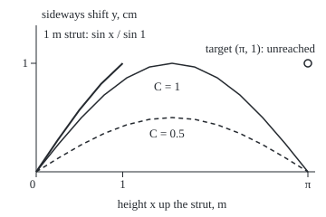

# Boundary value problems: conditions at both ends instead of one start, so there may be one answer, none or infinitely many

Differential equations and dynamics → Series Solutions and Boundary Problems → Conditions at both ends → Boundary value problems

---

## General Overview

A slender steel strut stands upright with a weight on top and its foot pinned to the floor. Where it bends, the weight bends it further and its stiffness pulls back. For small bends, with load over stiffness at 1 per m^2, the sideways shift y (in cm) at height x (in m) obeys y'' + y = 0: the curvature at each height is minus the shift there.

The starting slope is unknown; the two ends are known. An initial-value problem gives value and slope at one point. A **boundary value problem** gives one condition at each end of an interval and asks for the solution in between.

Three struts, one law. A 1 m strut with its top pushed 1 cm sideways takes exactly one shape. A π m strut (about 3.14 m) with both ends on the line takes any shape C sin x, for any amount C: this load buckles it. With its top pushed 1 cm it has no small-bend shape at all.

**A boundary value problem fits the general solution's two free amounts to conditions at two ends; the fit is two linear equations, so it has one answer, none, or infinitely many, and one number decides which.**

**What kind of fact this is:** a theorem, proved on this card in Why it works; the names Dirichlet, Neumann and Robin are a convention.

### The picture: three struts, one law

<p align="center"></p>

To scale: 95.49 px per m across, 120 px per cm up. Solid and dashed humps: C sin x for C = 1 and 0.5, back on the line at π m. Thick curve: the 1 m strut's one shape. Hollow dot: the 1 cm target at π m, unreached.

---

## The formula

Notation first, in words. An end condition pins a value, a slope, or a mix of the two to a target. At the foot, x = 0:

$$\alpha_0\,y(0) + \beta_0\,y'(0) = \gamma_0,$$

and at the top, x = L, the same with subscript L. **Read it aloud:** so much value plus so much slope must equal the target.

- **Dirichlet:** value only, β = 0. The pinned foot, y(0) = 0.
- **Neumann:** slope only, α = 0. A top held upright but free to slide: y'(L) = 0.
- **Robin:** both nonzero. An end held by a spring.

With a value given at each end:

$$y = A\cos x + B\sin x, \qquad A = y_0, \qquad A\cos L + B\sin L = y_L.$$

**Read it aloud:** every solution mixes cos and sin; the foot fixes the cos amount, the top constrains the sin amount.

The **determinant** is the number that must be nonzero for two linear equations to have exactly one answer; for coefficients 1, 0 and cos L, sin L it is

$$D = \sin L.$$

**Read it aloud:** the top steers B only through sin L. If D is not 0, one answer: B = (y_L − y_0 cos L) / sin L. If D = 0, every B works when y_L = y_0 cos L, and none otherwise.

| Symbol | Plain meaning | In our example | Push it up and the answer… |
| --- | --- | --- | --- |
| $x$ | height, in m | 0 to 1, or 0 to π | — |
| $y$, $y'$, $y''$ | shift in cm, slope in cm per m, curvature | y(0) = 0 | — |
| $L$ | strut length, in m | 1 or π | near π, B grows huge |
| $A$, $B$, $C$ | amounts of cos and sin; C free | A = 0, B = 1.188395 | — |
| $y_0$, $y_L$ | targets at foot and top, in cm | 0 and 1 | B grows with $y_L$ |
| $D$ | determinant | sin 1 = 0.841471 | — |
| $\alpha$, $\beta$, $\gamma$ | weights on value and slope, and the target | Robin top: 1, 1 m, 1 cm | — |
| $u$, $v$ | solutions of the equation with nothing on the right, starting at value 1, slope 0 and value 0, slope 1 | cos x, sin x | — |

### When it holds

- **A linear equation:** y and its rates never squared or multiplied. The large-bend strut law is not, and past buckling it has three shapes: straight, bent left, bent right.
- **Linear end conditions.** Squaring one on the 1 m strut, y(1)^2 = 1, gives exactly two answers.
- **A genuine condition at each end:** α and β not both 0, or that end reads 0 = target and says nothing.
- **A regular equation on a finite interval:** coefficients continuous, the one on y'' never 0; singular points are different ([frobenius-and-regular-singular-points](02-frobenius-and-regular-singular-points.md)).

---

## Why it works

### Step 0: two free amounts, two equations

The general solution has two free amounts. Linear end conditions make two linear equations for them, and such a pair has one answer, none, or a whole line of answers.

### Step 1: the strut's general solution

The characteristic equation of y'' + y = 0 is r^2 + 1 = 0 ([the-characteristic-equation](../03-Oscillators%20-%20Second-Order%20Linear%20Equations/02-the-characteristic-equation.md)), roots ±i, whose real solutions are cos x and sin x ([complex-roots-and-damped-oscillation](../03-Oscillators%20-%20Second-Order%20Linear%20Equations/03-complex-roots-and-damped-oscillation.md)). A solution is fixed by its value and slope at 0, and A cos x + B sin x matches any pair, so every solution has this form.

### Step 2: the 1 m strut has one shape

The foot gives A = 0, the top B sin 1 = 1. Since sin 1 = 0.841471 is not 0, B = 1.188395: the shape sin x / sin 1, 0.569747 cm off the line at mid-height.

### Step 3: the π m strut loses its top condition

The foot gives A = 0. At the top, cos π = −1 and sin π = 0, so y(π) = −A = 0 whatever B is: the top has stopped listening to B. A top target of 0 is met by every B, the family C sin x; a target of 1 cm demands −A = 1 against A = 0, and nothing fits. The length, not the count of conditions, changed.

### Step 4: the general theorem

For y'' + p y' + q y = g, with p, q, g given continuous functions of x, every solution is one particular solution plus c1 u + c2 v, for amounts c1 and c2. Each end condition becomes one linear equation in c1 and c2, and the 2-by-2 system's determinant decides. So D is not 0 exactly when the zero-end problem (g = 0, every target 0) has only the solution y = 0.

<details>
<summary>Detailed proof: one, none, or infinitely many</summary>

Let y_p solve the equation, and u, v solve it with g = 0 from the starts above. For a solution y, both y − y_p and c1 u + c2 v, with c1 = y(0) − y_p(0) and c2 = y'(0) − y_p'(0), solve the g = 0 equation from the same start, so they agree everywhere (existence and uniqueness): y = y_p + c1 u + c2 v, with c1, c2 unique.

Write B_0(y) = α_0 y(0) + β_0 y'(0), and B_L the same at L; both respect sums and multiples. The conditions become M c = d, where M has rows (B_0(u), B_0(v)) and (B_L(u), B_L(v)), and d = (γ_0 − B_0(y_p), γ_L − B_L(y_p)).

If det M is not 0, c = M^(−1) d is the one answer. If det M = 0, the nonzero first row (α_0, β_0) gives M rank 1: its range is a line, and it sends the multiples of some nonzero w to 0. If d is off that line, nothing works; if c* works, so does c* + s w for every real s, each a different curve: infinitely many.

</details>

### Step 5: the three kinds of condition do not choose the outcome

Neumann ends on the π m strut, y'(0) = y'(π) = 0: the slope −A sin x + B cos x gives B = 0 and −B = 0, so A is free and every C cos x works. A Neumann top on the 1 m strut, y'(1) = 1, gives B cos 1 = 1, one answer B = 1.850816. A Robin top, y(1) + (1 m) y'(1) = 1 cm, gives B (sin 1 + cos 1) = 1, so B = 0.723708. The kind sets a row; the determinant decides.

[the-shooting-method](06-the-shooting-method.md) and [finite-differences-for-boundary-problems](07-finite-differences-for-boundary-problems.md) reach the same answers numerically. Stretched onto [0, 1] as −y'' = lambda y, the π m strut is lambda = π^2 = 9.869604, the first special value of [eigenvalues-and-eigenfunctions](08-eigenvalues-and-eigenfunctions.md).

---

## Worked numbers, by hand

| Step | Arithmetic | Value |
| --- | --- | --- |
| 1 m strut | A = 0; B sin 1 = 1, sin 1 = 0.841471 | B = 1.188395 |
| mid-height shift | sin 0.5 / sin 1 | **0.569747 cm** |
| π m strut, top | y(π) = −A = 0 whatever B | D = sin π = 0 |
| ends 0 and 0 | every B fits | **infinitely many: C sin x** |
| ends 0 and 1 | −A = 1 and A = 0 | **none** |
| Neumann top, 1 m | B cos 1 = 1 | B = 1.850816 |
| Robin top, 1 m | B (sin 1 + cos 1) = 1 | B = 0.723708 |

The 1 m strut sits 0.569747 cm off the line at mid-height; the π m strut, at its buckling length, has no small-bend answer.

### What breaks if you drop a piece

| Mistake | Comes out at | What went wrong |
| --- | --- | --- |
| "Two conditions, one answer": π m, ends 0, 0 | C = 0.5, 1, 2 all fit | the top ignores B |
| Dividing by a computed D: π m, ends 0, 1 | B = 8.17e15 (floating sin π), 3.81e9 (stepping) | D is exactly 0 |
| Robin sign flipped: y(1) − y'(1) = 1 | B = 3.3204, not 0.7237 | spring pushing the wrong way |
| Condition squared: y(1)^2 = 1 | B = ±1.188395, exactly two | nonlinear condition |

The code prints all four.

---

## Code, from first principles, and it actually runs

Two roads to every answer. Road one fits A and B with sin and cos. Road two never calls them: Runge-Kutta 4 ([runge-kutta-four](../05-Numerical%20Evolution/04-runge-kutta-four.md)), sampling the slope four times per step, carries v to the far end, and B is the target over what v gives there. Halving the step h cuts the error about 16 times: fourth order.

### Python

```python
# Two-point boundary value problems -- the check behind the card.  Standard
# library only.  The strut y'' + y = 0 (x in m, y in cm) has every solution
# A cos x + B sin x.  Road one fits A and B to both ends with sin and cos.
# Road two never calls them: RK4 steps v, the solution with v(0) = 0 and
# v'(0) = 1, to the far end, and fits B from its value and slope there.
# u, with u(0) = 1 and u'(0) = 0, is stepped for the Neumann case.
import math

def rk4(L, n, y=0.0, p=1.0):         # step (y, y') across [0, L] in n steps
    h = L / n
    for _ in range(n):
        k1 = (p, -y); k2 = (p + h / 2 * k1[1], -(y + h / 2 * k1[0]))
        k3 = (p + h / 2 * k2[1], -(y + h / 2 * k2[0])); k4 = (p + h * k3[1], -(y + h * k3[0]))
        y += h / 6 * (k1[0] + 2 * k2[0] + 2 * k3[0] + k4[0])
        p += h / 6 * (k1[1] + 2 * k2[1] + 2 * k3[1] + k4[1])
    return y, p

def sci(x, d):                       # 7.16e-7, the way Rust prints {:.2e}
    e = math.floor(math.log10(abs(x)))
    return f"{x / 10 ** e:.{d}f}e{e}"

s1, c1, pi = math.sin(1), math.cos(1), math.pi
v1, dv1 = rk4(1, 100)                # road two at x = 1 m, h = 0.01
vpi, dvpi = rk4(pi, 314)             # road two at x = pi m
upi, dupi = rk4(pi, 314, 1.0, 0.0)   # u at x = pi m
B, Bn, Br = 1 / s1, 1 / c1, 1 / (s1 + c1)
errs = [abs(1 / rk4(1, n)[0] - B) for n in (10, 20, 40)]
pts = lambda f, xs: " ".join(f"{40 + 300 / pi * x:.1f},{190 - 120 * f(x):.1f}" for x in xs)
print("strut y'' + y = 0, every solution y = A cos x + B sin x; x in m, y in cm")
print(f"[0, 1], ends 0 and 1: D = sin 1 = {s1:.6f}; A = 0, B = 1/sin 1 = {B:.6f}")
print(f"  road two, stepped v(1) = {v1:.6f}, B = {1 / v1:.6f}; midpoint y(0.5) = {math.sin(0.5) * B:.6f} cm")
print(f"  RK4 error in B at h = 0.1 0.05 0.025: {sci(errs[0], 2)} {sci(errs[1], 2)} {sci(errs[2], 2)}; ratios {errs[0] / errs[1]:.1f} {errs[1] / errs[2]:.1f}")
print(f"[0, pi], ends 0 and 0: D = sin pi = 0 exactly (floating sin(pi) = {sci(math.sin(pi), 2)}, stepped v(pi) = {sci(vpi, 2)})")
fam = [rk4(pi, 314, 0.0, c)[0] for c in (0.5, 1, 2)]
print(f"  C sin x for C = 0.5 1 2, stepped y(pi): {sci(fam[0], 1)} {sci(fam[1], 1)} {sci(fam[2], 1)}: every C fits, infinitely many")
print(f"[0, pi], ends 0 and 1: y(pi) = -A = 1 but A = 0: none; naive B = 1/sin(pi) = {sci(1 / math.sin(pi), 2)}, 1/v(pi) = {sci(1 / vpi, 2)}")
print(f"house form -y'' = lambda y on [0, 1]: L = pi is lambda = pi^2 = {pi * pi:.6f}, the first eigenvalue")
print(f"Neumann [0, pi], y'(0) = y'(pi) = 0: B = 0 and -B = 0, A free: y = C cos x; stepped u'(pi) = {sci(dupi, 1)}")
print(f"Dirichlet-Neumann [0, 1], y(0) = 0, y'(1) = 1: B = 1/cos 1 = {Bn:.6f}; stepped 1/v'(1) = {1 / dv1:.6f}")
print(f"Robin [0, 1], y(0) = 0, y(1) + y'(1) = 1: B = 1/(sin 1 + cos 1) = {Br:.6f}; stepped {1 / (v1 + dv1):.6f}")
print(f"mistake, Robin sign flipped, y(1) - y'(1) = 1: B = {1 / (s1 - c1):.4f}, not {Br:.4f}")
print(f"hypothesis dropped, condition squared y(1)^2 = 1: B = +{B:.6f} or -{B:.6f}, exactly two; stepped y(1)^2 = {(B * v1) ** 2:.6f}")
print("figure, scale 95.49 px per m across, 120 px per cm up, origin (40, 190)")
print(f"figure, sin x on [0, pi]: {pts(math.sin, [pi * k / 12 for k in range(13)])}")
print(f"figure, 0.5 sin x: {pts(lambda x: 0.5 * math.sin(x), [pi * k / 12 for k in range(13)])}")
print(f"figure, sin x / sin 1 on [0, 1]: {pts(lambda x: math.sin(x) * B, [k / 4 for k in range(5)])}; target (pi, 1) at {pts(lambda x: 1, [pi])}")
assert abs(1 / v1 - B) < 1e-8 and abs(1 / dv1 - Bn) < 1e-8     # stepping meets the sine fit
assert 12 < errs[0] / errs[1] < 20 and abs(1 / (v1 + dv1) - Br) < 1e-8  # fourth order; Robin by both roads
assert max(abs(f) for f in fam) < 1e-8 and abs(dvpi + 1) < 1e-8 and abs(dupi) < 1e-8  # at pi: v = 0, v' = -1, u' = 0
print("ALL CHECKS PASS")
```

**Ran 2026-09-28 on macOS, Python 3.14.6, standard library only. All checks passed. Output, pasted from the run:**

```
strut y'' + y = 0, every solution y = A cos x + B sin x; x in m, y in cm
[0, 1], ends 0 and 1: D = sin 1 = 0.841471; A = 0, B = 1/sin 1 = 1.188395
  road two, stepped v(1) = 0.841471, B = 1.188395; midpoint y(0.5) = 0.569747 cm
  RK4 error in B at h = 0.1 0.05 0.025: 7.16e-7 4.23e-8 2.56e-9; ratios 16.9 16.5
[0, pi], ends 0 and 0: D = sin pi = 0 exactly (floating sin(pi) = 1.22e-16, stepped v(pi) = 2.62e-10)
  C sin x for C = 0.5 1 2, stepped y(pi): 1.3e-10 2.6e-10 5.2e-10: every C fits, infinitely many
[0, pi], ends 0 and 1: y(pi) = -A = 1 but A = 0: none; naive B = 1/sin(pi) = 8.17e15, 1/v(pi) = 3.81e9
house form -y'' = lambda y on [0, 1]: L = pi is lambda = pi^2 = 9.869604, the first eigenvalue
Neumann [0, pi], y'(0) = y'(pi) = 0: B = 0 and -B = 0, A free: y = C cos x; stepped u'(pi) = -2.6e-10
Dirichlet-Neumann [0, 1], y(0) = 0, y'(1) = 1: B = 1/cos 1 = 1.850816; stepped 1/v'(1) = 1.850816
Robin [0, 1], y(0) = 0, y(1) + y'(1) = 1: B = 1/(sin 1 + cos 1) = 0.723708; stepped 0.723708
mistake, Robin sign flipped, y(1) - y'(1) = 1: B = 3.3204, not 0.7237
hypothesis dropped, condition squared y(1)^2 = 1: B = +1.188395 or -1.188395, exactly two; stepped y(1)^2 = 1.000000
figure, scale 95.49 px per m across, 120 px per cm up, origin (40, 190)
figure, sin x on [0, pi]: 40.0,190.0 65.0,158.9 90.0,130.0 115.0,105.1 140.0,86.1 165.0,74.1 190.0,70.0 215.0,74.1 240.0,86.1 265.0,105.1 290.0,130.0 315.0,158.9 340.0,190.0
figure, 0.5 sin x: 40.0,190.0 65.0,174.5 90.0,160.0 115.0,147.6 140.0,138.0 165.0,132.0 190.0,130.0 215.0,132.0 240.0,138.0 265.0,147.6 290.0,160.0 315.0,174.5 340.0,190.0
figure, sin x / sin 1 on [0, 1]: 40.0,190.0 63.9,154.7 87.7,121.6 111.6,92.8 135.5,70.0; target (pi, 1) at 340.0,70.0
ALL CHECKS PASS
```

### Rust

Same numbers, same labels, built with `rustc --edition 2021 -O`.

```rust
// Two-point boundary value problems -- the same check as the Python, in Rust.
// No crates.  The strut y'' + y = 0 (x in m, y in cm) has every solution
// A cos x + B sin x.  Road one fits A and B to both ends with sin and cos.
// Road two never calls them: RK4 steps v, the solution with v(0) = 0 and
// v'(0) = 1, to the far end, and fits B from its value and slope there.
// u, with u(0) = 1 and u'(0) = 0, is stepped for the Neumann case.
use std::f64::consts::PI;

fn rk4(l: f64, n: usize, mut y: f64, mut p: f64) -> (f64, f64) { // step (y, y') across [0, L]
    let h = l / n as f64;
    for _ in 0..n {
        let k1 = (p, -y);
        let k2 = (p + h / 2.0 * k1.1, -(y + h / 2.0 * k1.0));
        let k3 = (p + h / 2.0 * k2.1, -(y + h / 2.0 * k2.0));
        let k4 = (p + h * k3.1, -(y + h * k3.0));
        y += h / 6.0 * (k1.0 + 2.0 * k2.0 + 2.0 * k3.0 + k4.0);
        p += h / 6.0 * (k1.1 + 2.0 * k2.1 + 2.0 * k3.1 + k4.1);
    }
    (y, p)
}

fn pts(f: &dyn Fn(f64) -> f64, xs: &[f64]) -> String {
    xs.iter().map(|&x| format!("{:.1},{:.1}", 40.0 + 300.0 / PI * x, 190.0 - 120.0 * f(x))).collect::<Vec<_>>().join(" ")
}

fn main() {
    let (s1, c1) = (1f64.sin(), 1f64.cos());
    let (v1, dv1) = rk4(1.0, 100, 0.0, 1.0);     // road two at x = 1 m, h = 0.01
    let (vpi, dvpi) = rk4(PI, 314, 0.0, 1.0);    // road two at x = pi m
    let (_upi, dupi) = rk4(PI, 314, 1.0, 0.0);   // u at x = pi m
    let (b, bn, br) = (1.0 / s1, 1.0 / c1, 1.0 / (s1 + c1));
    let errs: Vec<f64> = [10, 20, 40].iter().map(|&n| (1.0 / rk4(1.0, n, 0.0, 1.0).0 - b).abs()).collect();
    let fam: Vec<f64> = [0.5, 1.0, 2.0].iter().map(|&c| rk4(PI, 314, 0.0, c).0).collect();
    let half: Vec<f64> = (0..13).map(|k| PI * k as f64 / 12.0).collect();
    let unit: Vec<f64> = (0..5).map(|k| k as f64 / 4.0).collect();
    println!("strut y'' + y = 0, every solution y = A cos x + B sin x; x in m, y in cm");
    println!("[0, 1], ends 0 and 1: D = sin 1 = {:.6}; A = 0, B = 1/sin 1 = {:.6}", s1, b);
    println!("  road two, stepped v(1) = {:.6}, B = {:.6}; midpoint y(0.5) = {:.6} cm", v1, 1.0 / v1, 0.5f64.sin() * b);
    println!("  RK4 error in B at h = 0.1 0.05 0.025: {:.2e} {:.2e} {:.2e}; ratios {:.1} {:.1}", errs[0], errs[1], errs[2], errs[0] / errs[1], errs[1] / errs[2]);
    println!("[0, pi], ends 0 and 0: D = sin pi = 0 exactly (floating sin(pi) = {:.2e}, stepped v(pi) = {:.2e})", PI.sin(), vpi);
    println!("  C sin x for C = 0.5 1 2, stepped y(pi): {:.1e} {:.1e} {:.1e}: every C fits, infinitely many", fam[0], fam[1], fam[2]);
    println!("[0, pi], ends 0 and 1: y(pi) = -A = 1 but A = 0: none; naive B = 1/sin(pi) = {:.2e}, 1/v(pi) = {:.2e}", 1.0 / PI.sin(), 1.0 / vpi);
    println!("house form -y'' = lambda y on [0, 1]: L = pi is lambda = pi^2 = {:.6}, the first eigenvalue", PI * PI);
    println!("Neumann [0, pi], y'(0) = y'(pi) = 0: B = 0 and -B = 0, A free: y = C cos x; stepped u'(pi) = {:.1e}", dupi);
    println!("Dirichlet-Neumann [0, 1], y(0) = 0, y'(1) = 1: B = 1/cos 1 = {:.6}; stepped 1/v'(1) = {:.6}", bn, 1.0 / dv1);
    println!("Robin [0, 1], y(0) = 0, y(1) + y'(1) = 1: B = 1/(sin 1 + cos 1) = {:.6}; stepped {:.6}", br, 1.0 / (v1 + dv1));
    println!("mistake, Robin sign flipped, y(1) - y'(1) = 1: B = {:.4}, not {:.4}", 1.0 / (s1 - c1), br);
    println!("hypothesis dropped, condition squared y(1)^2 = 1: B = +{:.6} or -{:.6}, exactly two; stepped y(1)^2 = {:.6}", b, b, (b * v1).powi(2));
    println!("figure, scale 95.49 px per m across, 120 px per cm up, origin (40, 190)");
    println!("figure, sin x on [0, pi]: {}", pts(&|x: f64| x.sin(), &half));
    println!("figure, 0.5 sin x: {}", pts(&|x: f64| 0.5 * x.sin(), &half));
    println!("figure, sin x / sin 1 on [0, 1]: {}; target (pi, 1) at {}", pts(&|x: f64| x.sin() * b, &unit), pts(&|_x: f64| 1.0, &[PI]));
    assert!((1.0 / v1 - b).abs() < 1e-8 && (1.0 / dv1 - bn).abs() < 1e-8);          // stepping meets the sine fit
    assert!(errs[0] / errs[1] > 12.0 && errs[0] / errs[1] < 20.0 && (1.0 / (v1 + dv1) - br).abs() < 1e-8); // order 4; Robin
    assert!(fam.iter().all(|f| f.abs() < 1e-8) && (dvpi + 1.0).abs() < 1e-8 && dupi.abs() < 1e-8); // at pi: v = 0, v' = -1, u' = 0
    println!("ALL CHECKS PASS");
}
```

**Ran 2026-09-28 on macOS, rustc 1.98.1, no crates. All checks passed. Output, pasted from the run:**

```
strut y'' + y = 0, every solution y = A cos x + B sin x; x in m, y in cm
[0, 1], ends 0 and 1: D = sin 1 = 0.841471; A = 0, B = 1/sin 1 = 1.188395
  road two, stepped v(1) = 0.841471, B = 1.188395; midpoint y(0.5) = 0.569747 cm
  RK4 error in B at h = 0.1 0.05 0.025: 7.16e-7 4.23e-8 2.56e-9; ratios 16.9 16.5
[0, pi], ends 0 and 0: D = sin pi = 0 exactly (floating sin(pi) = 1.22e-16, stepped v(pi) = 2.62e-10)
  C sin x for C = 0.5 1 2, stepped y(pi): 1.3e-10 2.6e-10 5.2e-10: every C fits, infinitely many
[0, pi], ends 0 and 1: y(pi) = -A = 1 but A = 0: none; naive B = 1/sin(pi) = 8.17e15, 1/v(pi) = 3.81e9
house form -y'' = lambda y on [0, 1]: L = pi is lambda = pi^2 = 9.869604, the first eigenvalue
Neumann [0, pi], y'(0) = y'(pi) = 0: B = 0 and -B = 0, A free: y = C cos x; stepped u'(pi) = -2.6e-10
Dirichlet-Neumann [0, 1], y(0) = 0, y'(1) = 1: B = 1/cos 1 = 1.850816; stepped 1/v'(1) = 1.850816
Robin [0, 1], y(0) = 0, y(1) + y'(1) = 1: B = 1/(sin 1 + cos 1) = 0.723708; stepped 0.723708
mistake, Robin sign flipped, y(1) - y'(1) = 1: B = 3.3204, not 0.7237
hypothesis dropped, condition squared y(1)^2 = 1: B = +1.188395 or -1.188395, exactly two; stepped y(1)^2 = 1.000000
figure, scale 95.49 px per m across, 120 px per cm up, origin (40, 190)
figure, sin x on [0, pi]: 40.0,190.0 65.0,158.9 90.0,130.0 115.0,105.1 140.0,86.1 165.0,74.1 190.0,70.0 215.0,74.1 240.0,86.1 265.0,105.1 290.0,130.0 315.0,158.9 340.0,190.0
figure, 0.5 sin x: 40.0,190.0 65.0,174.5 90.0,160.0 115.0,147.6 140.0,138.0 165.0,132.0 190.0,130.0 215.0,132.0 240.0,138.0 265.0,147.6 290.0,160.0 315.0,174.5 340.0,190.0
figure, sin x / sin 1 on [0, 1]: 40.0,190.0 63.9,154.7 87.7,121.6 111.6,92.8 135.5,70.0; target (pi, 1) at 340.0,70.0
ALL CHECKS PASS
```

> [!TIP]
> **Try changing**
> - **Make the strut 3 m.** Guess first: one answer or none? One, since sin 3 is not 0; but sin 3 is small, so B is large.
> - **Give the π m strut Neumann ends y'(0) = 0 and y'(π) = 1.** Guess first: B = 0 and −B = 1. None.
> - **Run the error sweep at h = 0.2, 0.1 and 0.05.** Guess first: the ratios stay near 16, the mark of fourth order.

---

## The usual mistake

> [!warning]
> **Carrying over "two conditions fix one solution" from initial-value problems.** That holds when both sit at one point. Spread over two ends they can depend on each other: on the π m strut, C = 0.5, 1 and 2 all meet both ends, and no curve reaches a 1 cm push.
>
> - **Trusting a tiny computed determinant.** Floating sin π is 1.22e-16, not 0, and dividing by it gives B = 8.17e15. Decide D = 0 from the exact fact sin π = 0.
> - **Flipping the Robin sign.** y(1) − y'(1) = 1 gives B = 3.3204 instead of 0.7237.

---

## Where you meet it in real life

- **Buckling columns.** A pinned strut of length L buckles at π^2 times its stiffness over L^2, where the zero-end problem gains bent answers (stress-strain-and-beam-bending).
- **Heat in a rod.** Set end temperature: Dirichlet. Insulated end: Neumann. End cooling into air: Robin (boundary-conditions-dirichlet-neumann-and-robin).
- **Flow in a pipe.** Fluid at the wall does not slip, a Dirichlet condition of zero speed (viscosity-and-pipe-flow).

> **Say it back**
> A boundary value problem sets one condition at each end instead of two at the start. Linear conditions become two linear equations for the two free amounts. A nonzero determinant gives one answer; a zero one gives none or infinitely many. For y'' + y = 0 it is sin L: the 1 m strut has one shape, the π m strut a family or nothing. Dirichlet, Neumann and Robin name what an end fixes, not how many answers there are.

---

## What this builds on

- [the-characteristic-equation](../03-Oscillators%20-%20Second-Order%20Linear%20Equations/02-the-characteristic-equation.md): the general solution with two free amounts, found from r^2 + 1 = 0.

## Where this goes next

- [the-shooting-method](06-the-shooting-method.md): aim the missing slope when no formula exists.
- [finite-differences-for-boundary-problems](07-finite-differences-for-boundary-problems.md): grid values and one linear system.
- [eigenvalues-and-eigenfunctions](08-eigenvalues-and-eigenfunctions.md): the special lengths where D = 0.
- [greens-function-for-a-boundary-problem](10-greens-function-for-a-boundary-problem.md): the one answer as an integral.
- [what-a-pde-says](../10-The%20Classical%20PDEs/01-what-a-pde-says.md): conditions on the edge of a region.
- [functionals-and-the-euler-lagrange-equation](../12-Calculus%20of%20Variations%20and%20Optimal%20Control/01-functionals-and-the-euler-lagrange-equation.md): best paths between two fixed ends.
- [boundary-layers-and-singular-perturbation](../../13-Engineering%20mathematics/01-Units%20and%20Modelling/06-boundary-layers-and-singular-perturbation.md): a tiny coefficient on y'' makes a thin end layer.
- stress-strain-and-beam-bending: the beam law behind the strut.
- viscosity-and-pipe-flow: flow fixed at two walls.
- lax-milgram-theorem: one answer from an energy argument.
- weak-solutions-of-differential-equations: answers without a second derivative.
- boundary-conditions-dirichlet-neumann-and-robin: the three types on a surface.
- jacobi-fields-and-comparison-theorems: zero-end solutions on curved surfaces.

---

## Sources

Verified 2026-09-28: every link below resolves to the publisher's or author's page.

- Teschl, Gerald. *Ordinary Differential Equations and Dynamical Systems*. Graduate Studies in Mathematics 140, American Mathematical Society, 2012. [Author's page, with the free text](https://www.mat.univie.ac.at/~gerald/ftp/book-ode/). Chapter 5: boundary value problems with value and slope conditions.
- Timoshenko, Stephen P., and James M. Gere. *Theory of Elastic Stability*, 2nd ed. Dover, 2009. [Publisher page](https://store.doverpublications.com/products/9780486472072). Chapter 2: the strut equation and its buckling load.
