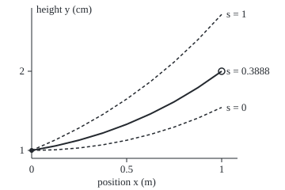
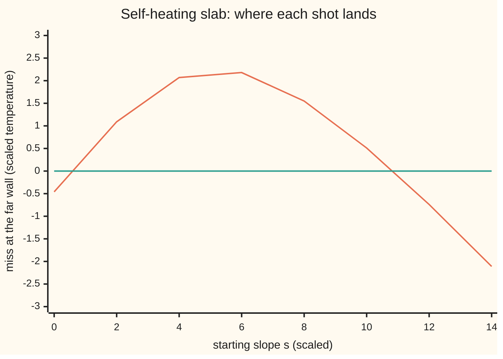

# Shooting: guess the missing starting slope, integrate forward, see how far you miss, and correct

[Syllabus](../../../SYLLABUS.md) → [Differential equations and dynamics](../../../SYLLABUS.md#w08) → [Series Solutions and Boundary Problems](../../../SYLLABUS.md#w08-s07) → Shooting

---

## General Overview

A cable 1 m long is stretched between two posts over a mat of springs. The left post holds it 1 cm above the mat, the right post 2 cm. The springs pull each piece down in proportion to its height, and the tension holds it by curving the cable upward just as much. With stiffness over tension equal to 1 per square metre, the rule is: the cable's bending at each point equals its height there.

Both ends are pinned: a boundary value problem ([Boundary value problems](05-two-point-boundary-value-problems.md)). A stepping method needs the height and the slope at the start. The height is known. The slope is not.

So guess it, the way an archer aims. Pick a slope, step the cable out to the right post, see where it lands. Slope 0 lands at 1.543081 cm, short. Slope 1 lands at 2.718282 cm, over. Here the landing moves in a straight line with the slope, so two shots fix the answer: slope 0.38880097 lands at 2.00000000 cm. The method is called **shooting**, and each trial run a **shot**.

**Shooting turns a problem pinned at both ends into a search for one number, the starting slope, that makes a forward run land on the far condition.**

**What kind of fact this is:** a method; that two shots solve a linear problem exactly, whenever the landing depends on the aim, is a theorem, proved in Why it works.

### The picture: three shots from the left post

<p align="center"></p>

Scale: 240 px per metre across, 100 px per cm up; the bottom axis sits at 0.9 cm. Dashed: trial shots with slopes 0 and 1. Solid: slope 0.3888, landing on the ringed target.

---

## The formula

Reminder: $y''$ is the rate of the rate, the bending. Write $y_s(x)$ for the forward run starting at the left end with the given height and slope $s$. The **miss** is where it lands minus where it should:

$$g(s) = y_s(1) - 2.$$

Shooting solves $g(s) = 0$. From two shots $s_0$ and $s_1$, the next aim is where the straight line through their misses crosses zero:

$$s_{\text{new}} = s_1 - g(s_1)\,\frac{s_1 - s_0}{g(s_1) - g(s_0)}.$$

**Read it aloud:** move the aim from the last shot by its miss, divided by how much the miss changed per unit of aim between the last two shots.

This is the **secant method**: Newton's method ([Newton's method](../../06-Calculus%20and%20analysis/03-What%20Derivatives%20Tell%20You/06-newtons-method.md)) with the derivative replaced by the slope through two recent shots.

For the cable, $y'' = y$ with $y(0) = 1$ cm and $y(1) = 2$ cm, the closed form in cosh and sinh ([Hyperbolic functions](../../06-Calculus%20and%20analysis/02-Derivatives/07-hyperbolic-functions.md)) gives the aim

$$s = \frac{2 - \cosh 1}{\sinh 1} = 0.38880097.$$

| Symbol | Plain meaning | In our example | Push it up and the answer… |
| --- | --- | --- | --- |
| $x$ | position along the cable | 0 to 1 m | — |
| $y$ | height above the mat; $y''$ its bending | 1 cm and 2 cm at the posts | a higher right post needs a steeper aim |
| $s$ | the starting slope: the aim | 0.38880097 cm per m | the landing rises 1.175201 cm per unit |
| $g$ | the miss at the far end, $g(s)$ | −0.456919 at s = 0 | zero means the shot lands |
| $s_0$, $s_1$ | the two most recent aims | 0 and 1 | — |
| $h$ | step size of the forward runs | 1/64 m | slope error grows as its fourth power |
| $\theta$ | theta, a helper number in the slab's closed form | 1.517165 | — |

### When it holds

- **Every shot must reach the far end.** Some nonlinear runs blow up before it; those aims have no landing.
- **The landing must depend on the aim.** For $y'' = -\pi^2 y$ from height 0, every shot returns to 0: the miss never changes and the secant divides by zero.
- **The far end must not be too sensitive.** With a fast-growing solution, the last digit of the aim swings the landing and rounding decides the answer; [Finite differences](07-finite-differences-for-boundary-problems.md) avoids aiming.
- **The starting shots choose the answer.** A nonlinear problem can have several solutions; the secant finds one near its start, or none.

---

## Why it works

### Step 0: one unknown number decides everything

A height and a slope at the left end fix a unique forward run (existence and uniqueness for initial values). So each aim gives one landing, and the problem is one equation in one unknown, $g(s) = 0$.

### Step 1: for the cable, each run is a fixed curve plus s times another

The run with height 1 and slope 0 is cosh x: its bending equals itself, it starts at 1, flat. The run with height 0 and slope 1 is sinh x. The rule is linear, so sums and multiples of runs are runs:

$$y_s(x) = \cosh x + s \sinh x,$$

the only run with height 1 and slope $s$ at the left end. At the far end, $g(s) = \cosh 1 + s \sinh 1 - 2$: a straight line in $s$ with steepness $\sinh 1 = 1.175201$.

### Step 2: a straight-line miss is solved by two shots

The secant draws a line through two points of the miss. If the miss is a line, that line is the miss, and its zero is the answer: 0.456919 / 1.175201 = 0.38880097.

Runge-Kutta four ([Runge-Kutta four](../05-Numerical%20Evolution/04-runge-kutta-four.md)) on a linear rule is linear in its starting values, so the computed landing is a straight line too. The third shot lands at 2.00000000; only stepping error remains.

### Step 3: the stepping error passes to the aim, divided by the steepness

A landing error e moves the root by e / 1.175201. The landing error shrinks as $h^4$, so the aim's error does too. With 4, 8 and 16 steps the aim is off by 3.86e-05, 2.73e-06 and 1.81e-07: ratios 14.16 and 15.07, closing in on 2^4 = 16.

### Step 4: a curved miss needs repeated corrections

A slab of damp wood chips heats itself, faster the warmer it is, roughly exponentially. Both faces are held at air temperature. In scaled units, y is the temperature rise and x runs across the slab from 0 to 1; heat balance reads $y'' = -e^y$ with $y(0) = y(1) = 0$.

Now the miss curves, so the secant's line only approximates it. Each shot's error is roughly a constant times the product of the two before. From shots 0 and 1 the misses fall to +9.44e-03, −2.20e-04, +1.19e-07 and +1.50e-12 in four corrections, landing on slope 0.5493527288.

<details>
<summary>Detailed proof: why the secant's errors multiply</summary>

Let r be the root and e_k = s_k − r the error of shot k. Taylor's theorem near r gives g(s) = g'(r)(s − r) + ½ g''(ξ)(s − r)^2, with ξ (xi) between s and r. The line through shots k − 1 and k then has slope g'(r) + ½ g''(r)(e_k + e_(k−1)) up to smaller terms, and the secant formula gives
e_(k+1) = (g''(r) / 2g'(r)) e_k e_(k−1), plus higher-order terms.
So if g'(r) ≠ 0 and g'' is continuous, there is a δ > 0 (delta) such that shots starting within δ of r converge: for every tolerance ε > 0 (epsilon), from some shot on, every shot lies within ε of r. Taking logarithms, the correct digits of each shot are about the sum of the two before, the Fibonacci rule, so they grow by the golden ratio (1 + √5)/2 per shot. At a double root, g'(r) = 0, the argument fails.

</details>

<details>
<summary>The slab's closed form, if you want it</summary>

Try $y = 2\ln\cosh(\theta/4) - 2\ln\cosh(\theta(x - \tfrac12)/2)$, which is 0 at both walls. Its slope at the left wall is $\theta\tanh(\theta/4)$. With sech meaning one over cosh, its bending is $-\tfrac{\theta^2}{2}\,\text{sech}^2(\theta(x-\tfrac12)/2)$ and $e^y = \cosh^2(\theta/4)\,\text{sech}^2(\theta(x-\tfrac12)/2)$, so $y'' = -e^y$ exactly when $\theta = \sqrt{2}\cosh(\theta/4)$. Bisection finds two roots, 1.517165 and 10.938703: starting slopes 0.549353 and 10.846899.

</details>

Two roots mean two steady profiles: the cool one is the slab's resting state; the hot one, found from aims 10 and 12, is a balance any disturbance knocks off. Solving for all interior points at once, with no aiming, is [Finite differences](07-finite-differences-for-boundary-problems.md).

---

## Worked numbers, by hand

The cable, $y'' = y$, from 1 cm at the left post, aiming for 2 cm at the right.

| Step | Arithmetic | Value |
| --- | --- | --- |
| shot at s = 0 lands at | cosh 1 | 1.543081 cm |
| its miss | 1.543081 − 2 | −0.456919 |
| shot at s = 1 lands at | cosh 1 + sinh 1 = e | 2.718282 cm |
| its miss | 2.718282 − 2 | 0.718282 |
| change of miss per unit of aim | 0.718282 − (−0.456919) = sinh 1 | 1.175201 |
| the corrected aim | 0 − (−0.456919) × 1 / 1.175201 | **0.38880097** |
| third shot lands at | cosh 1 + 0.38880097 × sinh 1 | 2.00000000 cm |

The cable leaves the left post rising 0.3888 cm per metre and meets the right post at 2 cm.

### What breaks if you drop a piece

| Mistake | Comes out at | What went wrong |
| --- | --- | --- |
| Starting height 0 instead of 1 | s = 1.701836, not 0.388801 | That aims a different cable, one pinned at the mat |
| Shooting $y'' = -\pi^2 y$ from 0 at 1 | miss −1.000000 at s = 0 and at s = 1 | Every shot lands at 0; the secant divides by zero, and no aim exists |
| Slab heating 4 times as fast | best landing −0.2630 for aims 0 to 30, never 0 | No steady state: the slab ignites |

The second row is the shelf's house problem at its first eigenvalue: [Eigenvalue problems](08-eigenvalues-and-eigenfunctions.md).

---

## Code, from first principles, and it actually runs

The script writes its own Runge-Kutta four, secant and bisection, and takes two roads to each slope: shooting, and the closed form with cosh, sinh and tanh built from exp. It also prints the error at three step sizes, the chart's misses and the three mistakes.

### Python

```python
# The shooting method -- the check behind the card.  Standard library only;
# math.exp is the one primitive.  Cable on a spring bed: y'' = y, x in m, y in cm,
# y(0) = 1, y(1) = 2.  Self-heating slab: y'' = -e^y, y(0) = y(1) = 0, scaled.
import math
def shoot(f, y0, s, n=64):              # RK4 on y' = v, v' = f(y), from x = 0 to 1
    h, y, v = 1 / n, y0, s
    for _ in range(n):
        k1 = (v, f(y)); k2 = (v + h/2*k1[1], f(y + h/2*k1[0]))
        k3 = (v + h/2*k2[1], f(y + h/2*k2[0])); k4 = (v + h*k3[1], f(y + h*k3[0]))
        y += h/6*(k1[0] + 2*k2[0] + 2*k3[0] + k4[0]); v += h/6*(k1[1] + 2*k2[1] + 2*k3[1] + k4[1])
    return y                            # the landing height y(1)
def secant(g, s0, s1, tol=1e-10):       # re-aim along the line through the last two shots
    g0, g1, rows = g(s0), g(s1), []
    while abs(g1) > tol:
        s0, s1 = s1, s1 - g1 * (s1 - s0) / (g1 - g0); g0, g1 = g1, g(s1); rows.append((s1, g1))
    return s1, rows
def bisect(F, lo, hi):                  # halve a bracket where F changes sign
    for _ in range(100):
        mid = (lo + hi) / 2; lo, hi = (mid, hi) if F(lo) * F(mid) > 0 else (lo, mid)
    return lo
cosh = lambda z: (math.exp(z) + math.exp(-z)) / 2
sinh = lambda z: (math.exp(z) - math.exp(-z)) / 2
ch, sh = cosh(1), sinh(1)
tanh = lambda z: (1 - math.exp(-2 * z)) / (1 + math.exp(-2 * z))
cable = lambda n: (lambda s: shoot(lambda y: y, 1.0, s, n) - 2)
g = cable(64); a, b = g(0) + 2, g(1) + 2
print(f"cable, shots s = 0 and 1 land at {a:.6f} and {b:.6f}, misses {a-2:.6f} and {b-2:.6f}")
s_cab = 0 - (a - 2) * (1 - 0) / (b - a)          # road 1: one secant step from two shots
exact = (2 - ch) / sh                            # road 2: the closed form
print(f"cable, secant through the two shots: s = {s_cab:.8f}, third shot lands at {g(s_cab)+2:.8f}")
print(f"cable, closed form (2 - cosh 1)/sinh 1 = {exact:.8f}; miss rises sinh 1 = {sh:.6f} per unit of s")
assert abs(s_cab - exact) < 1e-8
errs = [abs(secant(cable(n), 0, 1)[0] - exact) for n in (4, 8, 16)]
print(f"cable, slope error with 4, 8, 16 steps: {errs[0]:.2e} {errs[1]:.2e} {errs[2]:.2e}; ratios {errs[0]/errs[1]:.2f} {errs[1]/errs[2]:.2f}")
assert all(14 < errs[i] / errs[i + 1] < 18 for i in range(2))
for s, name in ((0, "s = 0"), (1, "s = 1"), (exact, "s = 0.3888")):
    pts = [(40 + 240 * x, 200 - 100 * (cosh(x) + s * sinh(x) - 0.9)) for x in (k / 8 for k in range(9))]
    print(f"figure, {name}:", " ".join(f"{p:.1f},{q:.1f}" for p, q in pts))
heat = lambda s: shoot(lambda y: -math.exp(y), 0.0, s, 256)
th = [bisect(lambda t: t - math.sqrt(2) * cosh(t / 4), lo, hi) for lo, hi in ((0, 4), (4, 20))]
slopes = [t * tanh(t / 4) for t in th]           # road 2: y'(0) = theta tanh(theta/4)
print(f"slab, theta by bisection {th[0]:.6f} and {th[1]:.6f}; exact slopes {slopes[0]:.6f} and {slopes[1]:.6f}")
low, rows = secant(heat, 0, 1)
for k, (s, m) in enumerate(rows, 1):
    print(f"slab, correction {k}: s = {s:.10f}, miss = {m:+.2e}")
high, rows2 = secant(heat, 10, 12)
print(f"slab, from shots 10 and 12: s = {high:.6f} after {len(rows2)} corrections")
assert abs(low - slopes[0]) < 1e-8 and abs(high - slopes[1]) < 1e-7
print("chart, s:", " ".join(str(s) for s in range(0, 15, 2)))
print("chart, miss:", " ".join(f"{heat(s):.2f}" for s in range(0, 15, 2)))
flat = secant(lambda s: shoot(lambda y: y, 0.0, s) - 2, 0, 1)[0]
res = [shoot(lambda y: -math.pi**2 * y, 0.0, s) - 1 for s in (0, 1)]
hot = max(shoot(lambda y: -4 * math.exp(y), 0.0, s / 10) for s in range(301))
print(f"mistake, left height dropped: s = {flat:.6f}, not {exact:.6f}")
print(f"mistake, y'' = -pi^2 y from y(0) = 0 aiming at 1: misses {res[0]:.6f} and {res[1]:.6f} at s = 0 and 1")
print(f"mistake, slab heating 4 times as fast: best landing for s from 0 to 30 is {hot:.4f}, never 0")
assert abs(flat - 2 / sh) < 1e-8 and all(abs(r + 1) < 1e-6 for r in res) and hot < 0
print("ALL CHECKS PASS")
```

**Ran 2026-09-28 on macOS, Python 3.14.6, standard library only. All checks passed. Output, pasted from the run:**

```
cable, shots s = 0 and 1 land at 1.543081 and 2.718282, misses -0.456919 and 0.718282
cable, secant through the two shots: s = 0.38880097, third shot lands at 2.00000000
cable, closed form (2 - cosh 1)/sinh 1 = 0.38880097; miss rises sinh 1 = 1.175201 per unit of s
cable, slope error with 4, 8, 16 steps: 3.86e-05 2.73e-06 1.81e-07; ratios 14.16 15.07
figure, s = 0: 40.0,190.0 70.0,189.2 100.0,186.9 130.0,182.9 160.0,177.2 190.0,169.8 220.0,160.5 250.0,149.2 280.0,135.7
figure, s = 1: 40.0,190.0 70.0,176.7 100.0,161.6 130.0,144.5 160.0,125.1 190.0,103.2 220.0,78.3 250.0,50.1 280.0,18.2
figure, s = 0.3888: 40.0,190.0 70.0,184.3 100.0,177.0 130.0,168.0 160.0,157.0 190.0,143.9 220.0,128.6 250.0,110.7 280.0,90.0
slab, theta by bisection 1.517165 and 10.938703; exact slopes 0.549353 and 10.846899
slab, correction 1: s = 0.5608260306, miss = +9.44e-03
slab, correction 2: s = 0.5490853702, miss = -2.20e-04
slab, correction 3: s = 0.5493528733, miss = +1.19e-07
slab, correction 4: s = 0.5493527288, miss = +1.50e-12
slab, from shots 10 and 12: s = 10.846899 after 4 corrections
chart, s: 0 2 4 6 8 10 12 14
chart, miss: -0.46 1.09 2.07 2.18 1.55 0.51 -0.74 -2.11
mistake, left height dropped: s = 1.701836, not 0.388801
mistake, y'' = -pi^2 y from y(0) = 0 aiming at 1: misses -1.000000 and -1.000000 at s = 0 and 1
mistake, slab heating 4 times as fast: best landing for s from 0 to 30 is -0.2630, never 0
ALL CHECKS PASS
```

### Rust

Same numbers, same labels, built with `rustc --edition 2021 -O`.

```rust
// The shooting method -- the same check as the Python, in Rust.  No crates; exp is
// the one primitive.  Cable on a spring bed: y'' = y, x in m, y in cm,
// y(0) = 1, y(1) = 2.  Self-heating slab: y'' = -e^y, y(0) = y(1) = 0, scaled.
fn shoot(f: &dyn Fn(f64) -> f64, y0: f64, s: f64, n: usize) -> f64 {
    let (h, mut y, mut v) = (1.0 / n as f64, y0, s);   // RK4 on y' = v, v' = f(y)
    for _ in 0..n {
        let k1 = (v, f(y)); let k2 = (v + h / 2.0 * k1.1, f(y + h / 2.0 * k1.0));
        let k3 = (v + h / 2.0 * k2.1, f(y + h / 2.0 * k2.0)); let k4 = (v + h * k3.1, f(y + h * k3.0));
        y += h / 6.0 * (k1.0 + 2.0 * k2.0 + 2.0 * k3.0 + k4.0); v += h / 6.0 * (k1.1 + 2.0 * k2.1 + 2.0 * k3.1 + k4.1);
    }
    y                                                   // the landing height y(1)
}
fn secant(g: &dyn Fn(f64) -> f64, mut s0: f64, mut s1: f64) -> (f64, Vec<(f64, f64)>) {
    let (mut g0, mut g1, mut rows) = (g(s0), g(s1), vec![]);   // re-aim through the last two shots
    while g1.abs() > 1e-10 {
        let s2 = s1 - g1 * (s1 - s0) / (g1 - g0); s0 = s1; s1 = s2; g0 = g1; g1 = g(s1); rows.push((s1, g1));
    }
    (s1, rows)
}
fn bisect(f: &dyn Fn(f64) -> f64, mut lo: f64, mut hi: f64) -> f64 {
    for _ in 0..100 { let mid = (lo + hi) / 2.0; if f(lo) * f(mid) > 0.0 { lo = mid } else { hi = mid } }
    lo                                                  // halve a bracket where f changes sign
}
fn sci(x: f64, plus: bool) -> String {                  // 1.23e-05, as Python prints it
    let t = format!("{:.2e}", x); let (m, e) = t.split_once('e').unwrap(); let e: i32 = e.parse().unwrap();
    format!("{}{}e{}{:02}", if plus && x >= 0.0 { "+" } else { "" }, m, if e < 0 { '-' } else { '+' }, e.abs())
}
fn cosh(z: f64) -> f64 { (z.exp() + (-z).exp()) / 2.0 }
fn sinh(z: f64) -> f64 { (z.exp() - (-z).exp()) / 2.0 }
fn main() {
    let (ch, sh) = (cosh(1.0), sinh(1.0));
    let tanh = |z: f64| (1.0 - (-2.0 * z).exp()) / (1.0 + (-2.0 * z).exp());
    let cable = |n: usize| move |s: f64| shoot(&|y| y, 1.0, s, n) - 2.0;
    let g = cable(64); let (a, b) = (g(0.0) + 2.0, g(1.0) + 2.0);
    println!("cable, shots s = 0 and 1 land at {:.6} and {:.6}, misses {:.6} and {:.6}", a, b, a - 2.0, b - 2.0);
    let s_cab = 0.0 - (a - 2.0) * (1.0 - 0.0) / (b - a);     // road 1: one secant step from two shots
    let exact = (2.0 - ch) / sh;                            // road 2: the closed form
    println!("cable, secant through the two shots: s = {:.8}, third shot lands at {:.8}", s_cab, g(s_cab) + 2.0);
    println!("cable, closed form (2 - cosh 1)/sinh 1 = {:.8}; miss rises sinh 1 = {:.6} per unit of s", exact, sh);
    assert!((s_cab - exact).abs() < 1e-8);
    let errs: Vec<f64> = [4, 8, 16].iter().map(|&n| (secant(&cable(n), 0.0, 1.0).0 - exact).abs()).collect();
    println!("cable, slope error with 4, 8, 16 steps: {} {} {}; ratios {:.2} {:.2}",
        sci(errs[0], false), sci(errs[1], false), sci(errs[2], false), errs[0] / errs[1], errs[1] / errs[2]);
    assert!((0..2).all(|i| 14.0 < errs[i] / errs[i + 1] && errs[i] / errs[i + 1] < 18.0));
    for (s, name) in [(0.0, "s = 0"), (1.0, "s = 1"), (exact, "s = 0.3888")] {
        let pts: Vec<String> = (0..9).map(|k| { let x = k as f64 / 8.0;
            format!("{:.1},{:.1}", 40.0 + 240.0 * x, 200.0 - 100.0 * (cosh(x) + s * sinh(x) - 0.9)) }).collect();
        println!("figure, {}: {}", name, pts.join(" "));
    }
    let heat = |s: f64| shoot(&|y: f64| -y.exp(), 0.0, s, 256);
    let fth = |t: f64| t - 2f64.sqrt() * cosh(t / 4.0);
    let th = [bisect(&fth, 0.0, 4.0), bisect(&fth, 4.0, 20.0)];
    let slopes = th.map(|t| t * tanh(t / 4.0));             // road 2: y'(0) = theta tanh(theta/4)
    println!("slab, theta by bisection {:.6} and {:.6}; exact slopes {:.6} and {:.6}", th[0], th[1], slopes[0], slopes[1]);
    let (low, rows) = secant(&heat, 0.0, 1.0);
    for (k, (s, m)) in rows.iter().enumerate() { println!("slab, correction {}: s = {:.10}, miss = {}", k + 1, s, sci(*m, true)); }
    let (high, rows2) = secant(&heat, 10.0, 12.0);
    println!("slab, from shots 10 and 12: s = {:.6} after {} corrections", high, rows2.len());
    assert!((low - slopes[0]).abs() < 1e-8 && (high - slopes[1]).abs() < 1e-7);
    let ss: Vec<f64> = (0..8).map(|i| 2.0 * i as f64).collect();
    println!("chart, s: {}", ss.iter().map(|s| format!("{}", s)).collect::<Vec<_>>().join(" "));
    println!("chart, miss: {}", ss.iter().map(|&s| format!("{:.2}", heat(s))).collect::<Vec<_>>().join(" "));
    let flat = secant(&|s| shoot(&|y| y, 0.0, s, 64) - 2.0, 0.0, 1.0).0;
    let pi2 = std::f64::consts::PI * std::f64::consts::PI;
    let res = [0.0, 1.0].map(|s| shoot(&|y| -pi2 * y, 0.0, s, 64) - 1.0);
    let hot = (0..301).map(|s| shoot(&|y: f64| -4.0 * y.exp(), 0.0, s as f64 / 10.0, 64)).fold(f64::MIN, f64::max);
    println!("mistake, left height dropped: s = {:.6}, not {:.6}", flat, exact);
    println!("mistake, y'' = -pi^2 y from y(0) = 0 aiming at 1: misses {:.6} and {:.6} at s = 0 and 1", res[0], res[1]);
    println!("mistake, slab heating 4 times as fast: best landing for s from 0 to 30 is {:.4}, never 0", hot);
    assert!((flat - 2.0 / sh).abs() < 1e-8 && res.iter().all(|r| (r + 1.0).abs() < 1e-6) && hot < 0.0);
    println!("ALL CHECKS PASS");
}
```

**Ran 2026-09-28 on macOS, rustc 1.98.1, no crates. All checks passed. Output, pasted from the run:**

```
cable, shots s = 0 and 1 land at 1.543081 and 2.718282, misses -0.456919 and 0.718282
cable, secant through the two shots: s = 0.38880097, third shot lands at 2.00000000
cable, closed form (2 - cosh 1)/sinh 1 = 0.38880097; miss rises sinh 1 = 1.175201 per unit of s
cable, slope error with 4, 8, 16 steps: 3.86e-05 2.73e-06 1.81e-07; ratios 14.16 15.07
figure, s = 0: 40.0,190.0 70.0,189.2 100.0,186.9 130.0,182.9 160.0,177.2 190.0,169.8 220.0,160.5 250.0,149.2 280.0,135.7
figure, s = 1: 40.0,190.0 70.0,176.7 100.0,161.6 130.0,144.5 160.0,125.1 190.0,103.2 220.0,78.3 250.0,50.1 280.0,18.2
figure, s = 0.3888: 40.0,190.0 70.0,184.3 100.0,177.0 130.0,168.0 160.0,157.0 190.0,143.9 220.0,128.6 250.0,110.7 280.0,90.0
slab, theta by bisection 1.517165 and 10.938703; exact slopes 0.549353 and 10.846899
slab, correction 1: s = 0.5608260306, miss = +9.44e-03
slab, correction 2: s = 0.5490853702, miss = -2.20e-04
slab, correction 3: s = 0.5493528733, miss = +1.19e-07
slab, correction 4: s = 0.5493527288, miss = +1.50e-12
slab, from shots 10 and 12: s = 10.846899 after 4 corrections
chart, s: 0 2 4 6 8 10 12 14
chart, miss: -0.46 1.09 2.07 2.18 1.55 0.51 -0.74 -2.11
mistake, left height dropped: s = 1.701836, not 0.388801
mistake, y'' = -pi^2 y from y(0) = 0 aiming at 1: misses -1.000000 and -1.000000 at s = 0 and 1
mistake, slab heating 4 times as fast: best landing for s from 0 to 30 is -0.2630, never 0
ALL CHECKS PASS
```

The two outputs match line for line.

### The picture: the slab's miss against the aim



Orange: the miss for each aim. Green: zero, the target. The miss crosses zero twice, at slopes 0.549353 and 10.846899: two steady profiles.

> [!TIP]
> **Try changing**
> Guess first, then run it.
> - **Aim the slab from 6 and 8.** Replace `secant(heat, 10, 12)` with `secant(heat, 6, 8)`. Which root? The hot one, 10.846899; the run passes.
> - **Aim it from 2 and 3.** The cool root, 0.549353; the assert expecting the hot one stops the run.
> - **Coarser steps.** In `heat`, change 256 to 64. The steep hot profile's slope drifts past the tolerance and an assert stops the run.

---

## The usual mistake

> [!warning]
> **Treating the first root found as the answer.** A nonlinear boundary problem can have two solutions, one or none, and shooting reports the one its starting shots lead to. The slab has a cool profile at slope 0.549353 and a hot one at 10.846899; only a sweep of aims, like the chart, shows both.
>
> - **Shooting for the wrong unknown.** The height is given; the slope is unknown. Starting the cable at 0 cm returns 1.701836, the aim for a different cable.
> - **Reading a small miss as a small error.** The aim's error is the miss divided by how fast the landing moves with the aim, here 1.175201.
> - **Iterating a linear problem.** For the cable a third correction gains nothing: two shots give the exact root of the computed miss.

---

## Where you meet it in real life

- **Structures on soft ground.** Rails on ballast and pipelines on a seabed rest on springs, with both ends fixed: boundary problems like the cable.
- **Stockpiles.** Hay, coal and wood chips ignite when no steady temperature profile exists, as for the slab heating 4 times as fast.
- **Quantum bound states.** Shooting on the energy instead of the slope finds the energies at which a wave dies away at both ends, as in [Eigenvalue problems](08-eigenvalues-and-eigenfunctions.md).

> **Say it back**
> A boundary problem gives conditions at both ends, so a forward run lacks its starting slope. Shooting guesses it, runs forward, measures the miss and re-aims along the line through the last two shots. For a linear rule the miss is a straight line, so two shots give the exact slope: 0.38880097 for the cable. For a nonlinear rule the corrections repeat, four of them for the slab. The starting shots decide which solution is found.

---

## What this builds on

- [Boundary value problems](05-two-point-boundary-value-problems.md): problems pinned at both ends, with one solution, none or many.
- [Runge-Kutta four](../05-Numerical%20Evolution/04-runge-kutta-four.md): the forward run each shot fires, and its fourth-order error.
- [Hyperbolic functions](../../06-Calculus%20and%20analysis/02-Derivatives/07-hyperbolic-functions.md): cosh and sinh, the cable's closed form.
- [Newton's method](../../06-Calculus%20and%20analysis/03-What%20Derivatives%20Tell%20You/06-newtons-method.md): the root-finding step the secant copies without a derivative.

## Where this goes next

- Two-point boundary problems: multiple shooting, which aims from several points at once, and collocation, which fits a curve to all conditions together.

Shooting fails when a tiny change of aim moves the landing enormously; that card splits the interval so the far end stops amplifying each error.

---

## Sources

Verified 2026-09-28: every link below resolves to a page naming the work.

- Keller, Herbert B. *Numerical Methods for Two-Point Boundary-Value Problems*. Dover, 2018 (first published 1968). [Book page](https://books.google.com/books/about/Numerical_Methods_for_Two_Point_Boundary.html?id=4dxqDwAAQBAJ). The classic account of shooting and its convergence.
- Press, William H., et al. *Numerical Recipes*, 3rd ed. Cambridge University Press, 2007. [Book site](https://numerical.recipes/). Chapter 18 on two-point problems: shooting, shooting to a fitting point, and relaxation.
- Filipov, Stefan M., Ivan D. Gospodinov and István Faragó. "Shooting-Projection Method for Two-Point Boundary Value Problems." arXiv, 2014. [Paper](https://arxiv.org/abs/1406.2615). A modern variant of the re-aiming step, with the classical method laid out for comparison.
