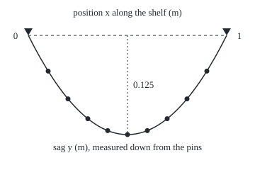
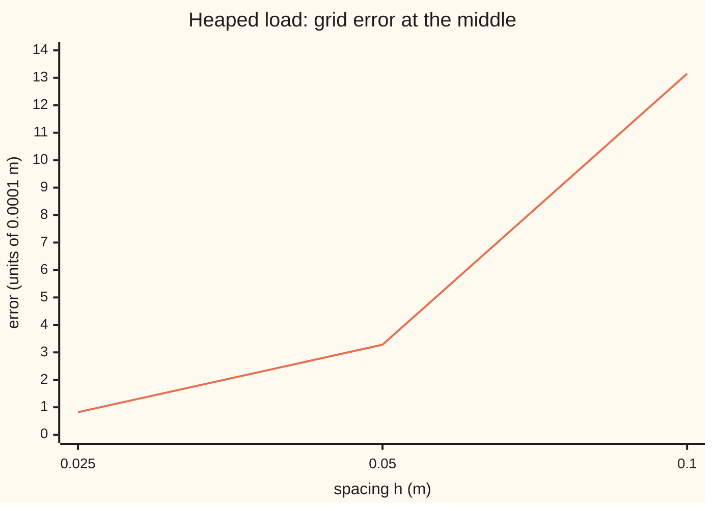

# Finite differences: replace the derivatives by differences on a grid and solve one linear system

[Syllabus](../../../SYLLABUS.md) → [Differential equations and dynamics](../../../SYLLABUS.md#w08) → [Series Solutions and Boundary Problems](../../../SYLLABUS.md#w08-s07) → Finite differences

---

## General Overview

A fabric strap, used as a shelf, is slung between two pins 1 m apart, pulled tight at 200 N, with books spread evenly along it at 200 N per metre. How far does the middle sag?

The strap's curvature at each point (how fast its slope turns) equals the load there divided by the tension, here 1 per metre, and both ends are pinned at zero sag. That is a boundary-value problem: an equation plus a condition at each end ([Boundary value problems](05-two-point-boundary-value-problems.md)). Here the exact sag at distance x from the left pin is x(1 − x)/2 metres: 0.125 m at the middle.

Most boundary problems have no such formula. Finite differences keep only the sag at nine marks 0.1 m apart and turn the curvature at each into a difference of neighbouring values: nine linked equations, solved by one sweep forward and one back. The grid gives 0.125000 m at the middle, matching the exact curve at every printed digit.

**Write the equation at evenly spaced points, replace each second derivative by a difference of three neighbouring values, and the curve becomes one tridiagonal linear system, off by an amount proportional to the spacing squared.**

**What kind of fact this is:** a method; its error bound is a theorem, proved on this card in Why it works.

### The picture: the shelf and its nine grid values

<p align="center"></p>

Dots: the nine grid values. Curve: the exact sag x(1 − x)/2. Triangles: the pins. Drawn to scale at 280 px per metre across and 1120 px per metre down, so the sag is shown four times deeper than it is.

---

## The formula

Notation first, in words. The two primes in $y''$ mean the rate of the rate: the curvature. A small index names a grid point: $x_i$ is mark number $i$, $y_i$ the grid's sag there, $f_i$ the load there.

The shelf's equation is $y'' = f(x)$ with $y(0) = y(1) = 0$, where $f$ is minus the load over the tension, here −1 per metre. Put $N$ marks inside the span at spacing $h = 1/(N+1)$, so $x_i = ih$. The finite-difference equations are

$$\frac{y_{i-1} - 2y_i + y_{i+1}}{h^2} = f_i, \qquad i = 1, \dots, N, \qquad y_0 = y_{N+1} = 0.$$

**Read it aloud:** at each mark, the two neighbours minus twice the mark, over the spacing squared, equals the load there.

Multiplied by $h^2$, they form one linear system whose matrix has −2 down the diagonal, 1 on either side of it, and zeros elsewhere: a tridiagonal matrix. The error $E$, the largest gap between grid and true curve at the marks, obeys

$$E \le \frac{h^2 M}{96},$$

where $M$ is the largest size of the fourth derivative $y''''$ over the span.

**Read it aloud:** halve the spacing and the error falls to a quarter.

| Symbol | Plain meaning | In our example | Push it up and the answer… |
| --- | --- | --- | --- |
| $x$, $y$ | distance from the left pin; sag, measured down | 0 to 1 m; 0.125 m mid | — |
| $f$ | minus load over tension | −1.0 per m | more negative: deeper sag |
| $h$, $N$ | spacing; inside marks | 0.1 m; 9 | $h$ up: error grows like $h^2$ |
| $x_i$, $y_i$, $f_i$, $i$ | mark $i$; grid sag there; load there | mark 5: 0.5 m, 0.125000 m | — |
| $p_i$, $r_i$ | sweep pivot and right side, row $i$ | row 9: −1.1111, −0.0500 | — |
| $E$, $e_i$, $\tau_i$ | largest error; error at mark $i$; truncation error there | 0.00131548 (second load, below) | — |
| $M$, $\xi$ | largest size of $y''''$; Taylor's remainder point | $\pi^3/2$ (second load) | bound loosens |
| $D$, $v$, $v_i$, $\phi_i$ | proof's second difference; any grid list; even sag at mark $i$ | 0.125 mid | — |

### When it holds

- **A smooth load.** The bound needs $y''''$ bounded; one heavy book at a point puts a corner in the sag and slows the error's fall.
- **Even spacing.** The odd error terms cancel only when both neighbours are equally far away.
- **A matrix that cannot be singular.** Here every pivot has size at least 1. Add a spring term, $y'' + ky = f$ with a constant k, and the matrix turns singular for k close to $\pi^2, 4\pi^2, 9\pi^2, \dots$, where the exact problem also fails ([Eigenvalue problems](08-eigenvalues-and-eigenfunctions.md)).
- **Spacing not absurdly small.** Dividing a difference of nearly equal numbers by $h^2$ magnifies rounding, so past some tiny spacing the error rises again.

---

## Why it works

### Step 0: freeze the derivative at a fixed spacing

A derivative is a limit of differences. Stop before the limit: at a fixed spacing the curve becomes a list of numbers and the equation becomes arithmetic between neighbours.

### Step 1: the centred difference, and what it misses

Taylor's theorem expands the sag one step either side of $x$:

$$y(x \pm h) = y \pm h y' + \frac{h^2}{2} y'' \pm \frac{h^3}{6} y''' + \frac{h^4}{24} y''''(\xi_\pm).$$

Add the two. The odd terms cancel because the step is symmetric:

$$\frac{y(x-h) - 2y(x) + y(x+h)}{h^2} = y''(x) + \frac{h^2}{12}\,y''''(\xi),$$

for some point $\xi$ within one step of $x$. The miss, called the truncation error, is proportional to $h^2$. For a parabola $y''''$ is zero, so the centred difference is exact: that is why the even shelf's grid carries no error at all.

### Step 2: the equations form a tridiagonal system

Row $i$ involves only $y_{i-1}$, $y_i$ and $y_{i+1}$. The pinned ends are known zeros and drop out of the first and last rows; a nonzero end value would move to the right side.

### Step 3: the Thomas sweep, Gaussian elimination on a band

Gaussian elimination ([Gaussian elimination](../../03-Algebra/05-Solving%20Systems/02-gaussian-elimination.md)) clears the entries below each pivot (the diagonal entry used to divide). A tridiagonal matrix has one entry below each pivot, and clearing it touches only the next row: that shortcut is the Thomas sweep.

Forward: row 1 keeps $p_1 = -2$ and $r_1 = h^2 f_1$. Subtract row $i-1$, divided by its pivot, from row $i$:

$$p_i = -2 - \frac{1}{p_{i-1}}, \qquad r_i = h^2 f_i - \frac{r_{i-1}}{p_{i-1}}.$$

Row $i$ now reads $p_i y_i + y_{i+1} = r_i$. Back: the last row has one unknown, $y_N = r_N / p_N$; then $y_i = (r_i - y_{i+1}) / p_i$, working upwards.

The work grows in step with $N$, against $N^3$ for full elimination. Here $p_i = -(i+1)/i$, never below 1 in size, so no division by zero occurs.

### Step 4: the error is proportional to the spacing squared

Let $e_i = y_i - y(x_i)$, the error at mark $i$. Subtracting Step 1 from the grid equation shows the errors obey the same system, with the truncation error, at most $h^2 M / 12$, as the load. A load of size 1 produces a sag of at most 1/8: the even shelf's own answer. So the error is at most $\frac{h^2 M}{12} \times \frac18 = \frac{h^2 M}{96}$.

<details>
<summary>Detailed proof: the error is at most $h^2 M/96$</summary>

Write $D v_i = (v_{i-1} - 2v_i + v_{i+1})/h^2$ for any grid list $v$ with $v_0 = v_{N+1} = 0$.

**Maximum principle.** If $D v_i \le 0$ at every inside mark, then every $v_i \ge 0$. Suppose not: take the smallest value, negative, and the first mark $i$ where it occurs. Then $v_{i-1} > v_i$ (the left neighbour is an end, which is zero, or an earlier mark, which is larger) and $v_{i+1} \ge v_i$. So $D v_i > 0$, a contradiction.

**Truncation.** By Step 1 the true values satisfy $D\,y(x_i) = f_i + \tau_i$ with $\lvert\tau_i\rvert \le h^2 M/12$. The grid satisfies $D y_i = f_i$. Subtracting, $D e_i = -\tau_i$.

**Comparison.** Let $\phi_i = x_i(1 - x_i)/2$, the even shelf's sag, for which $D\phi_i = -1$ exactly (Step 1, a parabola). Put $v_i = \frac{h^2 M}{12}\phi_i \pm e_i$. Then $D v_i = -\frac{h^2 M}{12} \mp \tau_i \le 0$, so $v_i \ge 0$ for both signs. Hence $\lvert e_i\rvert \le \frac{h^2 M}{12}\phi_i \le \frac{h^2 M}{12}\cdot\frac18$, since $\phi_i$ is never above 1/8.

</details>

A second load tests this: the same total weight heaped towards the middle, $f = -(\pi/2)\sin(\pi x)$. Its exact sag is $\sin(\pi x)/(2\pi)$, 0.159155 m at the middle, with $M = \pi^3/2$. At $h$ = 0.1000 the midpoint error is 0.00131548, under the bound 0.00161491. Halving $h$ divides it by 4.01, then 4.00.

### The picture: the heaped-load error against the spacing



The line is the midpoint error. Doubling the spacing multiplies it by about 4: an error proportional to $h^2$.

### Other roads

Shooting ([Shooting](06-the-shooting-method.md)) guesses the slope at the left pin, marches across and corrects the guess; finite differences solve for every mark at once.

---

## Worked numbers, by hand

The even shelf, $N$ = 9 and $h$ = 0.1 m, so every right side starts as $h^2 f_i = -0.0100$.

| Step | Arithmetic | Value |
| --- | --- | --- |
| row 1 | $p_1 = -2$, $r_1 = -0.0100$ | −2.0000, −0.0100 |
| row 2 | $p_2 = -2 - 1/(-2)$; $r_2 = -0.0100 - (-0.0100)/(-2)$ | −1.5000, −0.0150 |
| row 3 | $p_3 = -2 - 1/(-1.5)$; $r_3 = -0.0100 - (-0.0150)/(-1.5)$ | −1.3333, −0.0200 |
| rows 4 to 9 | same pattern, $p_i = -(i+1)/i$ | row 9: −1.1111, −0.0500 |
| back, mark 9 | $-0.0500 / -1.1111$ | 0.045000 |
| mark 8 | $(-0.0450 - 0.045000) / -1.1250$ | 0.080000 |
| marks 7, 6 | same step twice | 0.105000, 0.120000 |
| mark 5, the middle | $(-0.0300 - 0.120000) / -1.2000$ | **0.125000** |

The strap sags 0.125 m at its middle, exactly what x(1 − x)/2 gives.

### What breaks if you drop a piece

| Mistake | Comes out at | What went wrong |
| --- | --- | --- |
| Spacing 1/9 for nine inside marks | midpoint 0.154321 m | nine marks make ten gaps |
| Dividing by $h$, not $h^2$ | midpoint 1.250000 m | a second difference needs the spacing squared |
| Measuring the order on the even shelf | errors 0.0000000000 at $h$ = 0.1 and 0.05 | exact on a parabola: no rate to read |

---

## Code, from first principles, and it actually runs

Road one runs the Thomas sweep. Road two never touches it: for the even shelf it is the parabola; for the heaped load, the sine values at the marks are an eigenvector of the matrix (the matrix only rescales them), so the grid answer is the load times $h^2 / (4\sin^2(\pi h/2))$. Asserts check that the roads agree at every mark, that the error lies between 70% of the bound and the bound, and that halving $h$ divides it by between 3.9 and 4.1.

### Python

```python
# Finite differences for a boundary problem -- the check behind the card.
# Standard library only.  The shelf: y'' = -1 on [0, 1] m, y(0) = y(1) = 0,
# exact sag x(1 - x)/2.  Road one: the Thomas sweep.  Road two: closed forms.
from math import sin, pi, log

def sweep(f, n, h):                     # solve y[i-1] - 2 y[i] + y[i+1] = h^2 f(x_i)
    p, r = [-2.0], [h * h * f(h)]
    for i in range(2, n + 1):           # forward: clear the 1 below each pivot
        q = p[-1]
        p.append(-2.0 - 1.0 / q); r.append(h * h * f(i * h) - r[-1] / q)
    y = [r[-1] / p[-1]]
    for i in range(n - 2, -1, -1):      # back: last unknown first
        y.insert(0, (r[i] - y[0]) / p[i])
    return p, r, y

def row(v, d): return " ".join(f"{a:.{d}f}" for a in v)
uni = lambda x: -1.0                     # even load: w/T = 1 per metre
N, h = 9, 0.1
p, r, y = sweep(uni, N, h)
ex = [(i * h) * (1 - i * h) / 2 for i in range(1, N + 1)]
print(f"shelf: tension 200 N, load 200 N/m, y'' = -1.0 per m; N = {N}, h = {h:.1f} m")
print("pivots p1..p9:", row(p, 4))
print("right sides r1..r9:", row(r, 4))
print("grid y1..y9:", row(y, 6))
print("exact x(1-x)/2:", row(ex, 6))
eu = max(abs(a - b) for a, b in zip(y, ex))
print(f"largest node error, even load: {eu:.10f}; midpoint {y[4]:.6f} m")
heap = lambda x: -(pi / 2) * sin(pi * x)  # same total load, heaped in the middle
M = pi ** 3 / 2                          # largest size of y'''' for sin(pi x)/(2 pi)
errs, gap = [], 0.0
for n in (9, 19, 39):
    hh = 1 / (n + 1); _, _, yh = sweep(heap, n, hh)
    eig = [(pi / 2) * sin(pi * i * hh) * hh * hh / (4 * sin(pi * hh / 2) ** 2) for i in range(1, n + 1)]
    gap = max(gap, max(abs(a - b) for a, b in zip(yh, eig)))
    m = n // 2; exm = 1 / (2 * pi); errs.append(yh[m] - exm)
    print(f"heaped N = {n}, h = {hh:.4f}: grid {yh[m]:.6f}, eigen formula {eig[m]:.6f}, "
          f"exact {exm:.6f}, error {errs[-1]:.8f}, bound {hh * hh * M / 96:.8f}")
    assert 0.7 * hh * hh * M / 96 < errs[-1] < hh * hh * M / 96   # max-principle bound
rat = [errs[0] / errs[1], errs[1] / errs[2]]
print(f"error ratios per halving: {rat[0]:.2f}, {rat[1]:.2f}; orders {log(rat[0], 2):.2f}, {log(rat[1], 2):.2f}")
print(f"chart, heaped midpoint error x 10^4 at h = 0.025, 0.05, 0.1: "
      f"{errs[2] * 1e4:.2f}, {errs[1] * 1e4:.2f}, {errs[0] * 1e4:.2f}")
print(f"mistake 1, h = 1/9 for nine points: midpoint {sweep(uni, 9, 1 / 9)[2][4]:.6f} m")
print(f"mistake 2, divide by h not h^2: midpoint {sweep(lambda x: -1.0 / h, 9, h)[2][4]:.6f} m")
e19 = max(abs(a - (i + 1) / 20 * (1 - (i + 1) / 20) / 2) for i, a in enumerate(sweep(uni, 19, 0.05)[2]))
print(f"mistake 3, order read off the even load: errors {eu:.10f} (h = 0.1), {e19:.10f} (h = 0.05)")
pts = [(40 + 28 * i, 50 + 1120 * v) for i, v in enumerate([0.0] + y + [0.0])]
print("figure, 280 px/m across, 1120 px/m down; nodes (px):", " ".join(f"({a},{b:.1f})" for a, b in pts))
assert eu < 1e-12 and e19 < 1e-12      # even load: grid equals the parabola
assert gap < 1e-12                      # heaped load: sweep equals eigenvector formula
assert all(3.9 < q < 4.1 for q in rat)  # error falls with h^2
print("ALL CHECKS PASS")
```

**Ran 2026-09-28 on macOS, Python 3.14.6, standard library only. All checks passed. Output, pasted from the run:**

```
shelf: tension 200 N, load 200 N/m, y'' = -1.0 per m; N = 9, h = 0.1 m
pivots p1..p9: -2.0000 -1.5000 -1.3333 -1.2500 -1.2000 -1.1667 -1.1429 -1.1250 -1.1111
right sides r1..r9: -0.0100 -0.0150 -0.0200 -0.0250 -0.0300 -0.0350 -0.0400 -0.0450 -0.0500
grid y1..y9: 0.045000 0.080000 0.105000 0.120000 0.125000 0.120000 0.105000 0.080000 0.045000
exact x(1-x)/2: 0.045000 0.080000 0.105000 0.120000 0.125000 0.120000 0.105000 0.080000 0.045000
largest node error, even load: 0.0000000000; midpoint 0.125000 m
heaped N = 9, h = 0.1000: grid 0.160470, eigen formula 0.160470, exact 0.159155, error 0.00131548, bound 0.00161491
heaped N = 19, h = 0.0500: grid 0.159483, eigen formula 0.159483, exact 0.159155, error 0.00032765, bound 0.00040373
heaped N = 39, h = 0.0250: grid 0.159237, eigen formula 0.159237, exact 0.159155, error 0.00008184, bound 0.00010093
error ratios per halving: 4.01, 4.00; orders 2.01, 2.00
chart, heaped midpoint error x 10^4 at h = 0.025, 0.05, 0.1: 0.82, 3.28, 13.15
mistake 1, h = 1/9 for nine points: midpoint 0.154321 m
mistake 2, divide by h not h^2: midpoint 1.250000 m
mistake 3, order read off the even load: errors 0.0000000000 (h = 0.1), 0.0000000000 (h = 0.05)
figure, 280 px/m across, 1120 px/m down; nodes (px): (40,50.0) (68,100.4) (96,139.6) (124,167.6) (152,184.4) (180,190.0) (208,184.4) (236,167.6) (264,139.6) (292,100.4) (320,50.0)
ALL CHECKS PASS
```

### Rust

Same rows and labels; the two outputs agree line for line.

```rust
// Finite differences for a boundary problem -- the same check as the Python, in Rust.
// No crates.  The shelf: y'' = -1 on [0, 1] m, y(0) = y(1) = 0, exact sag x(1 - x)/2.
// Road one: the Thomas sweep.  Road two: closed forms.
use std::f64::consts::PI;

fn sweep(f: &dyn Fn(f64) -> f64, n: usize, h: f64) -> (Vec<f64>, Vec<f64>, Vec<f64>) {
    let (mut p, mut r) = (vec![-2.0], vec![h * h * f(h)]);   // y[i-1] - 2 y[i] + y[i+1] = h^2 f(x_i)
    for i in 2..=n {                                          // forward: clear the 1 below each pivot
        let q = p[p.len() - 1];
        p.push(-2.0 - 1.0 / q);
        let last = r[r.len() - 1];
        r.push(h * h * f(i as f64 * h) - last / q);
    }
    let mut y = vec![0.0; n];
    y[n - 1] = r[n - 1] / p[n - 1];
    for i in (0..n - 1).rev() { y[i] = (r[i] - y[i + 1]) / p[i]; }   // back: last unknown first
    (p, r, y)
}
fn row(v: &[f64], d: usize) -> String { v.iter().map(|a| format!("{:.*}", d, a)).collect::<Vec<_>>().join(" ") }
fn maxgap(a: &[f64], b: &[f64]) -> f64 { a.iter().zip(b).map(|(x, y)| (x - y).abs()).fold(0.0, f64::max) }

fn main() {
    let uni = |_x: f64| -1.0;                                 // even load: w/T = 1 per metre
    let (n, h) = (9usize, 0.1);
    let (p, r, y) = sweep(&uni, n, h);
    let ex: Vec<f64> = (1..=n).map(|i| i as f64 * h * (1.0 - i as f64 * h) / 2.0).collect();
    println!("shelf: tension 200 N, load 200 N/m, y'' = -1.0 per m; N = {}, h = {:.1} m", n, h);
    println!("pivots p1..p9: {}", row(&p, 4));
    println!("right sides r1..r9: {}", row(&r, 4));
    println!("grid y1..y9: {}", row(&y, 6));
    println!("exact x(1-x)/2: {}", row(&ex, 6));
    let eu = maxgap(&y, &ex);
    println!("largest node error, even load: {:.10}; midpoint {:.6} m", eu, y[4]);
    let heap = |x: f64| -(PI / 2.0) * (PI * x).sin();         // same total load, heaped in the middle
    let m = PI.powi(3) / 2.0;                                 // largest size of y'''' for sin(pi x)/(2 pi)
    let (mut errs, mut gap) = (vec![], 0.0f64);
    for nn in [9usize, 19, 39] {
        let hh = 1.0 / (nn as f64 + 1.0);
        let (_, _, yh) = sweep(&heap, nn, hh);
        let eig: Vec<f64> = (1..=nn).map(|i| (PI / 2.0) * (PI * i as f64 * hh).sin() * hh * hh
            / (4.0 * (PI * hh / 2.0).sin().powi(2))).collect();
        gap = gap.max(maxgap(&yh, &eig));
        let (k, exm) = (nn / 2, 1.0 / (2.0 * PI));
        errs.push(yh[k] - exm);
        let (e, b) = (errs[errs.len() - 1], hh * hh * m / 96.0);
        println!("heaped N = {}, h = {:.4}: grid {:.6}, eigen formula {:.6}, exact {:.6}, error {:.8}, bound {:.8}",
                 nn, hh, yh[k], eig[k], exm, e, b);
        assert!(0.7 * b < e && e < b);                        // max-principle bound
    }
    let rat = [errs[0] / errs[1], errs[1] / errs[2]];
    println!("error ratios per halving: {:.2}, {:.2}; orders {:.2}, {:.2}", rat[0], rat[1], rat[0].log2(), rat[1].log2());
    println!("chart, heaped midpoint error x 10^4 at h = 0.025, 0.05, 0.1: {:.2}, {:.2}, {:.2}",
             errs[2] * 1e4, errs[1] * 1e4, errs[0] * 1e4);
    println!("mistake 1, h = 1/9 for nine points: midpoint {:.6} m", sweep(&uni, 9, 1.0 / 9.0).2[4]);
    println!("mistake 2, divide by h not h^2: midpoint {:.6} m", sweep(&|_x: f64| -1.0 / h, 9, h).2[4]);
    let ex19: Vec<f64> = (1..=19).map(|i| i as f64 / 20.0 * (1.0 - i as f64 / 20.0) / 2.0).collect();
    let e19 = maxgap(&sweep(&uni, 19, 0.05).2, &ex19);
    println!("mistake 3, order read off the even load: errors {:.10} (h = 0.1), {:.10} (h = 0.05)", eu, e19);
    let mut full = vec![0.0]; full.extend(&y); full.push(0.0);
    let pts: Vec<String> = full.iter().enumerate().map(|(i, v)| format!("({},{:.1})", 40 + 28 * i, 50.0 + 1120.0 * v)).collect();
    println!("figure, 280 px/m across, 1120 px/m down; nodes (px): {}", pts.join(" "));
    assert!(eu < 1e-12 && e19 < 1e-12);                       // even load: grid equals the parabola
    assert!(gap < 1e-12);                                     // heaped load: sweep equals eigenvector formula
    assert!(rat.iter().all(|q| 3.9 < *q && *q < 4.1));        // error falls with h^2
    println!("ALL CHECKS PASS");
}
```

**Ran 2026-09-28 on macOS, rustc 1.98.1, no crates. All checks passed. Output, pasted from the run:**

```
shelf: tension 200 N, load 200 N/m, y'' = -1.0 per m; N = 9, h = 0.1 m
pivots p1..p9: -2.0000 -1.5000 -1.3333 -1.2500 -1.2000 -1.1667 -1.1429 -1.1250 -1.1111
right sides r1..r9: -0.0100 -0.0150 -0.0200 -0.0250 -0.0300 -0.0350 -0.0400 -0.0450 -0.0500
grid y1..y9: 0.045000 0.080000 0.105000 0.120000 0.125000 0.120000 0.105000 0.080000 0.045000
exact x(1-x)/2: 0.045000 0.080000 0.105000 0.120000 0.125000 0.120000 0.105000 0.080000 0.045000
largest node error, even load: 0.0000000000; midpoint 0.125000 m
heaped N = 9, h = 0.1000: grid 0.160470, eigen formula 0.160470, exact 0.159155, error 0.00131548, bound 0.00161491
heaped N = 19, h = 0.0500: grid 0.159483, eigen formula 0.159483, exact 0.159155, error 0.00032765, bound 0.00040373
heaped N = 39, h = 0.0250: grid 0.159237, eigen formula 0.159237, exact 0.159155, error 0.00008184, bound 0.00010093
error ratios per halving: 4.01, 4.00; orders 2.01, 2.00
chart, heaped midpoint error x 10^4 at h = 0.025, 0.05, 0.1: 0.82, 3.28, 13.15
mistake 1, h = 1/9 for nine points: midpoint 0.154321 m
mistake 2, divide by h not h^2: midpoint 1.250000 m
mistake 3, order read off the even load: errors 0.0000000000 (h = 0.1), 0.0000000000 (h = 0.05)
figure, 280 px/m across, 1120 px/m down; nodes (px): (40,50.0) (68,100.4) (96,139.6) (124,167.6) (152,184.4) (180,190.0) (208,184.4) (236,167.6) (264,139.6) (292,100.4) (320,50.0)
ALL CHECKS PASS
```

> [!TIP]
> **Try changing**
> - **Guess first:** set `N, h = 99, 0.01`. Does the grid still match the parabola? Yes: the parabola assert passes.
> - **Guess first:** add 79 to the heaped loop, `(9, 19, 39, 79)`. The new error, 0.00002045, is a quarter of the last and under its bound.
> - **Guess first:** change the pivot rule to `-2.01 - 1.0 / q`, a matrix that no longer matches the equation. An assert fails.

---

## The usual mistake

> [!warning]
> **Testing the method on a problem it solves exactly.** The even shelf's sag is a parabola, on which the centred difference makes no error, so no rate can be read from it. The heaped load shows the real behaviour: 0.00131548 at $h$ = 0.1, a quarter of that at half the spacing.
>
> - **Counting gaps as marks.** Nine inside marks make ten gaps. Spacing 1/9 puts the middle at 0.154321 m instead of 0.125.
> - **The wrong power of $h$.** Dividing by $h$ instead of $h^2$ gives a 1.250000 m sag, ten times too deep.
> - **Forgetting a nonzero end.** A pin off the zero level puts its value on the right side of the first or last row; left out, the grid pins that end at zero.

---

## Where you meet it in real life

- **Cables and strings.** Washing lines and cable runs under an even load sag by this equation.
- **Steady heat in a rod.** Temperature along a rod with heat sources and fixed end temperatures obeys the same equation; the implicit steps of [Stepping the heat equation on a grid](../10-The%20Classical%20PDEs/09-finite-differences-for-the-heat-equation.md) are tridiagonal solves by this sweep.
- **Option pricing grids.** Finite-difference pricers step back in time across a grid of share prices, one tridiagonal solve per step.

> **Say it back**
> Put evenly spaced marks across the span and write the equation at each. Replace the second derivative by the neighbours minus twice the mark, over the spacing squared. The result is a tridiagonal system, solved by one sweep forward and one back. Halving the spacing quarters the error; on a parabola, like the even shelf, there is none.

---

## What this builds on

- [Boundary value problems](05-two-point-boundary-value-problems.md): the equation with a condition at each end, and when it has one answer.
- [Gaussian elimination](../../03-Algebra/05-Solving%20Systems/02-gaussian-elimination.md): row elimination and back substitution, which the Thomas sweep specialises to a band.

## Where this goes next

- [Green's function](10-greens-function-for-a-boundary-problem.md): the exact solution as an integral of the load.
- [Stepping the heat equation on a grid](../10-The%20Classical%20PDEs/09-finite-differences-for-the-heat-equation.md): the same difference, now with time steps.
- Finite elements: small elements on any shape.
- Two-point boundary problems: nonlinear problems and higher-order methods.
- Galerkin: why finite elements converge.

---

## Sources

Verified 2026-09-28: every link below resolves to the publisher's page.

- LeVeque, Randall J. *Finite Difference Methods for Ordinary and Partial Differential Equations*. SIAM, 2007. [Publisher page](https://doi.org/10.1137/1.9780898717839). This problem, its tridiagonal system, and the error proof.
- Strang, Gilbert. *Computational Science and Engineering*. Wellesley-Cambridge Press, 2007. [Book page](https://math.mit.edu/~gs/cse/). The second-difference matrix, its inverse and its sine eigenvectors.
- Conte, S. D., and Carl de Boor. *Elementary Numerical Analysis: An Algorithmic Approach*. SIAM, 2017. [Publisher page](https://doi.org/10.1137/1.9781611975208). Elimination on tridiagonal systems.
