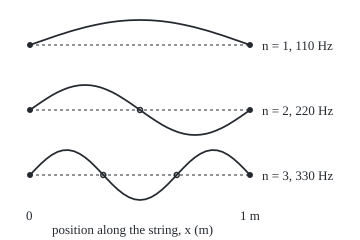
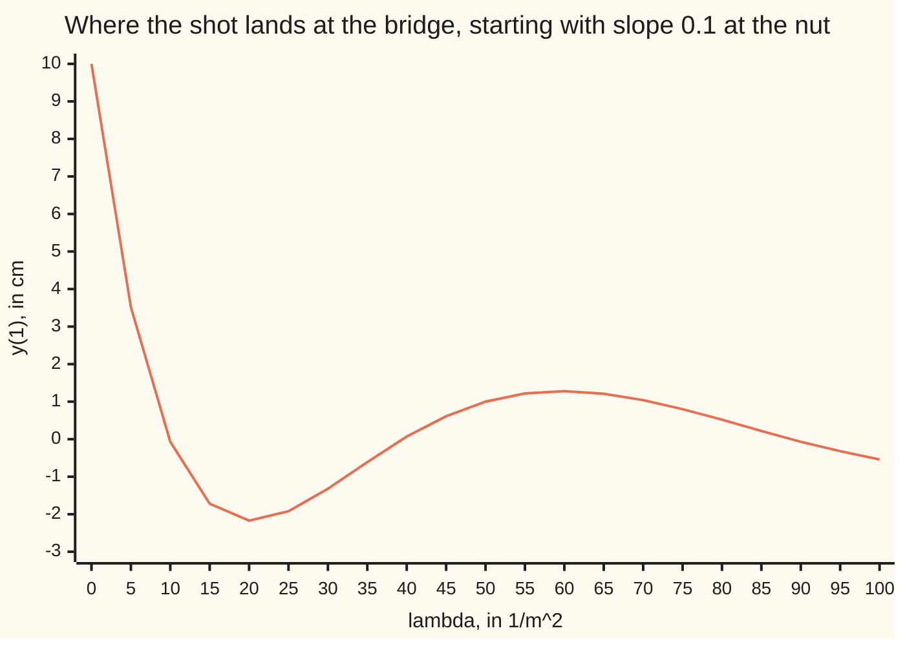

# Eigenvalue problems: only special parameter values allow a nonzero solution, and those are the natural modes

Differential equations and dynamics → Series Solutions and Boundary Problems → Notes a pinned string can play → Eigenvalue problems

---

## General Overview

A 1 m guitar string is pinned at the nut and the bridge, tuned so ripples run along it at 220 m/s. Plucked, it sounds 110 Hz (vibrations a second), the low A. A finger resting on its midpoint gives 220 Hz, the octave; at a third of the way, 330 Hz, an octave and a fifth up. No finger position makes it ring cleanly at 150 Hz.

Each clean note is a **standing wave**: the string keeps one shape, only growing and shrinking. Newton's law turns that shape into a differential equation with one unknown number in it; the pins demand zero at both ends. For almost every value of the number only the flat string fits. A few special values let a nonzero shape through.

Those values are **eigenvalues** (German *eigen*, "own"), and their shapes **eigenfunctions**: the words used when a matrix turns a vector v into a multiple of itself, λv, with λ (Greek lambda) a number. Here the matrix is replaced by "take the second derivative and flip its sign".

**The problem −y'' = λy on a 1 m string with y = 0 at both ends has a nonzero solution only when λ = n^2π^2, n = 1, 2, 3, …, and it is then a multiple of sin(nπx): the n-th harmonic, at n times the lowest note.**

**What kind of fact this is:** a theorem, proved on this card in Why it works; the words eigenvalue and eigenfunction are definitions.

### The picture: the first three modes

<p align="center"></p>

To scale along the string: 220 px per metre, pins (dots) at x_px 30 and 250. One mode per row, rows at y_px 45, 110 and 175, 25 px per unit of height. Open circles are nodes: x_px 140.0, then 103.3 and 176.7.

---

## The formula

Notation first, in words. Position x runs in metres from the nut (x = 0) to the bridge (x = 1). The shape y(x) is the sideways displacement. A prime is a rate along the string: y' is the slope, y'' the rate the slope changes, the bending. The Greek letter λ (lambda) is a number, not yet known.

$$-y'' = \lambda\, y, \qquad y(0) = 0, \qquad y(1) = 0$$

**Read it aloud:** the shape's bending, with its sign flipped, is λ times the shape itself, and the shape is zero at both pins.

A number λ is an **eigenvalue** when some solution y is not zero everywhere; that y is an **eigenfunction**. The theorem lists them all:

$$\lambda_n = n^2\pi^2, \qquad y_n(x) = \sin(n\pi x), \qquad f_n = \frac{c\sqrt{\lambda_n}}{2\pi} = \frac{n\,c}{2}$$

**Read it aloud:** the n-th eigenvalue is n squared times pi squared, its shape a sine with n arches, its note n times half the wave speed.

| Symbol | Plain meaning | In our example | Push it up and the answer… |
| --- | --- | --- | --- |
| $x$ | position along the string, from the nut, in m | 0 to 1 | — |
| $y$, $y_n$ | the shape: sideways displacement at x; $y_n$ the n-th mode's shape | sin(πx), sin(2πx), sin(3πx) | a louder note, same pitch |
| $y'$, $y''$ | slope; rate of change of slope, the bending, in 1/m | — | — |
| $\lambda$, $\lambda_n$ | the number in the equation, in 1/m^2; an eigenvalue when a nonzero shape fits | 9.869604, 39.478418, 88.826440 | more arches, higher note |
| $n$ | the mode number: how many arches | 1, 2, 3 | higher note, one more node |
| $c$ | wave speed on the string, in m/s; tension and weight per metre set it | 220 m/s | every note rises in proportion |
| $f$, $f_n$ | the note's frequency, in Hz (vibrations per second) | 110, 220, 330 Hz | — |
| $A$, $B$ | the two free constants in a general solution | A = 0 at the nut | — |

### When it holds

- **Both ends pinned.** A far end free to slide has y'(1) = 0 instead, and the list becomes ((n − 1/2)π)^2: 55, 165 and 275 Hz.
- **A uniform string.** A string wound heavier in one half moves the eigenvalues off n^2π^2; they still form a rising list ([sturm-liouville-and-orthogonality](09-sturm-liouville-and-orthogonality.md)).
- **Small slopes.** y'' is the bending only while the slope is well under 1; a very hard pluck raises the tension and the pitch.

---

## Why it works

### Step 0: the second pin is a demand on λ

Every solution carries two free constants ([two-point-boundary-value-problems](05-two-point-boundary-value-problems.md)). The first pin fixes one. The other only scales the shape up or down, and scaling a nonzero height never makes it zero. So the second pin is a demand on λ: either λ is right, or the shape collapses to flat.

### Step 1: where the equation comes from

A standing wave's displacement at time t is y(x) cos(2πft). On a taut string each bit accelerates at c^2 times its bending (Newton's law), and this wave's acceleration is −(2πf)^2 times itself, so

−(2πf)^2 y = c^2 y'',  which is  −y'' = λy  with  λ = (2πf/c)^2.

Turned round: f = c√λ/(2π). So √λ, not λ, sets the pitch.

### Step 2: zero and negative λ give only the flat string

For λ = 0 the equation says y'' = 0, so y = A + Bx, a straight line. The nut gives A = 0; the bridge then gives B = 0.

For negative λ, write λ = −k^2 with k > 0. The solutions are A cosh(kx) + B sinh(kx). The nut gives A = 0, and B sinh(k) = 0 forces B = 0, since sinh(k) > 0.

Shooting from the nut with slope 0.1, the far end lands 10.00 cm up for λ = 0 and 11.75 cm up for λ = −1.

### Step 3: positive λ works only at n^2π^2

For λ > 0 the solutions are A cos(√λ x) + B sin(√λ x), the oscillation of [the-characteristic-equation](../03-Oscillators%20-%20Second-Order%20Linear%20Equations/02-the-characteristic-equation.md) with position in place of time. The nut gives A = 0. The bridge demands

B sin(√λ) = 0.

Either B = 0, the flat string, or sin(√λ) = 0, which happens exactly when √λ = nπ. So λ = n^2π^2. For λ = 10, sin(√10) = −0.0207: close, not zero, and the shot lands at −0.07 cm.



The line is the landing height y(1). It crosses zero only at 9.869604, 39.478418 and 88.826440, between plotted points: the eigenvalues.

### Step 4: the eigenfunctions and their nodes

With √λ = nπ the shape is B sin(nπx), any B but zero, with n arches and n − 1 **nodes** (points that never move) at x = 1/n, 2/n, … The case n = 0 gives the flat string; negative n give the same shapes upside down. The notes are c × nπ/(2π) = 110n Hz.

<details>
<summary>Detailed proof: why no other λ, real or complex, can work</summary>

**The list of solutions is complete.** A solution of −y'' = λy is fixed by y(0) and y'(0), by uniqueness for linear equations. cos(√λ x) and sin(√λ x)/√λ start at (1, 0) and (0, 1), so every solution combines them; likewise 1 and x at λ = 0, and cosh and sinh for negative λ. Steps 2 and 3 cover every real λ.

**λ must be real and positive.** Let λ and y be complex, y zero at the pins but not everywhere. Multiply −y'' = λy by the conjugate ȳ and integrate from 0 to 1. Integration by parts moves one derivative across; the boundary term vanishes at the pins:

∫ |y'|^2 dx = λ ∫ |y|^2 dx.

Both integrals are real, the right one positive, so λ is real and at least zero. λ = 0 forces y' = 0, a constant, which the pins make zero. So λ > 0, and Step 3 finishes.

</details>

---

## Worked numbers, by hand

| Step | Arithmetic | Value |
| --- | --- | --- |
| test λ = 10 | sin(√10) = sin(3.1623) | −0.0207: rejected |
| n = 1 | λ = π^2 | 9.869604 |
| n = 2 | λ = 4π^2 | 39.478418 |
| n = 3 | λ = 9π^2 | 88.826440 |
| notes | 220 × nπ / (2π) = 110n | 110, 220, 330 Hz |
| nodes | x = 1/2; x = 1/3 and 2/3 | 0.500 m; 0.333 and 0.667 m |
| ratios | 110 : 220 : 330 | **1 : 2 : 3** |

The string sounds the low A, the A above, and the E above that.

**A second case: the far end free**, so the slope is zero there: y'(1) = 0. With A = 0, B√λ cos(√λ) = 0, so √λ = (n − 1/2)π and λ = 2.4674, 22.2066, 61.6850: notes of 55, 165 and 275 Hz, ratio 1 : 3 : 5.

### What breaks if you drop a piece

| Mistake | Comes out at | What went wrong |
| --- | --- | --- |
| Pitch taken in proportion to λ | 110, 440, 990 Hz | f grows with √λ, not λ |
| Only the nut pinned | any λ: λ = 50 gives a shape at 247.59 Hz, landing 1.00 cm up | one condition cannot pick λ |
| Nine grid points for the third mode | 82.4429, not 88.826440 | too coarse for three arches |

---

## Code, from first principles, and it actually runs

Road one is the closed form n^2π^2. Road two shoots from the nut with Runge-Kutta 4 ([runge-kutta-four](../05-Numerical%20Evolution/04-runge-kutta-four.md)), scans λ in steps of 0.5 until the landing height changes sign, bisects, and counts nodes, then repeats with a free far end ([the-shooting-method](06-the-shooting-method.md)). Road three replaces y'' by differences of neighbouring grid values ([finite-differences-for-boundary-problems](07-finite-differences-for-boundary-problems.md)), which turns the problem into a matrix eigenvalue problem on 9, 19 and 39 inner points, and finds its eigenvalues by bisection on a count: the number of eigenvalues below a trial value s equals the number of negative pivots (the diagonal entries left after elimination) of the matrix minus s times the identity. Its error falls fourfold per halving of the spacing: second order.

### Python

```python
# Eigenvalue problems -- the check behind the card.  Standard library only.  A 1 m string,
# pinned at both ends, waves at 220 m/s: -y'' = lam y, y(0) = y(1) = 0.  Road one: the closed
# form n^2 pi^2.  Road two: RK4 shots bisected on lam.  Road three: finite differences.
import math
C, PI = 220.0, math.pi
def shoot(lam, n=1000):                # y'' = -lam y, y(0) = 0, slope 0.1: (y(1) in cm, y'(1), nodes)
    f, h, y, p, nodes = (lambda y, p: (p, -lam * y)), 1.0 / n, 0.0, 0.1, 0
    for i in range(n):
        a = f(y, p); b = f(y + h / 2 * a[0], p + h / 2 * a[1])
        c = f(y + h / 2 * b[0], p + h / 2 * b[1]); d = f(y + h * c[0], p + h * c[1])
        yn = y + h / 6 * (a[0] + 2 * b[0] + 2 * c[0] + d[0]); p += h / 6 * (a[1] + 2 * b[1] + 2 * c[1] + d[1])
        nodes += i < n - 1 and yn * y < 0; y = yn
    return 100 * y, p, nodes
def roots(g, count, step=0.5):         # scan lam upward from 0.5, bisect each sign change of g
    out, a, ga = [], step, g(step)
    while len(out) < count:
        b = a + step; gb = g(b)
        if ga * gb < 0:
            lo, hi, glo = a, b, ga
            for _ in range(50):
                m = (lo + hi) / 2; gm = g(m)
                if glo * gm <= 0: hi = m
                else: lo, glo = m, gm
            out.append((lo + hi) / 2)
        a, ga = b, gb
    return out
def fd(N, k):                          # k-th eigenvalue of (1/h^2) tridiag(-1, 2, -1), N - 1 rows, by Sturm counts
    q = N * N                          # 1/h^2
    def below(x):                      # eigenvalues below x = negative pivots of A - x I
        d, cnt = 2 * q - x, 0
        for i in range(N - 1):
            if i: d = 2 * q - x - q * q / (d or 1e-300)
            cnt += d < 0
        return cnt
    lo, hi = 0.0, 4.0 * q
    for _ in range(60): m = (lo + hi) / 2; lo, hi = (lo, m) if below(m) >= k else (m, hi)
    return (lo + hi) / 2
lam, exact = roots(lambda l: shoot(l)[0], 3), [(n * PI) ** 2 for n in (1, 2, 3)]
free, errs = roots(lambda l: shoot(l)[1], 3), []  # far end free to slide: y'(1) = 0
hz = lambda l: C * math.sqrt(l) / (2 * PI)
print(f"not eigenvalues: lambda = -1, 0, 10 lands y(1) at {shoot(-1)[0]:.2f}, {shoot(0)[0]:.2f}, {shoot(10)[0]:.2f} cm; sin(sqrt 10) = sin({math.sqrt(10):.4f}) = {math.sin(math.sqrt(10)):.4f}")
print("chart lambda", " ".join(str(5 * i) for i in range(21)))
print("chart y(1) cm", " ".join(f"{shoot(5 * i)[0]:.2f}" for i in range(21)))
print("shooting roots, both ends pinned:", " ".join(f"{l:.6f}" for l in lam))
print("closed form n^2 pi^2:            ", " ".join(f"{l:.6f}" for l in exact))
print("frequencies c sqrt(lam)/(2 pi):", " ".join(f"{hz(l):.2f}" for l in lam), f"Hz; ratios 1 : {hz(lam[1]) / hz(lam[0]):.3f} : {hz(lam[2]) / hz(lam[0]):.3f}")
print("nodes inside the string for n = 1, 2, 3:", " ".join(str(shoot(l)[2]) for l in lam))
for N in (10, 20, 40):
    e = [fd(N, k) for k in (1, 2, 3)]; errs.append(exact[0] - e[0])
    print(f"finite differences, {N - 1} inner points: {e[0]:.4f} {e[1]:.4f} {e[2]:.4f}; error in lambda_1 {errs[-1]:.5f}")
print(f"error ratios as the grid halves: {errs[0] / errs[1]:.3f} {errs[1] / errs[2]:.3f}")
print("free far end: lambda", " ".join(f"{l:.4f}" for l in free), "->", " ".join(f"{hz(l):.2f}" for l in free), "Hz")
print("mistake, frequency in proportion to lambda:", " ".join(f"{110 * l / lam[0]:.2f}" for l in lam), "Hz")
print(f"mistake, one pin only: lambda = 50 gives a shape at {hz(50):.2f} Hz, y(1) = {shoot(50)[0]:.2f} cm")
print(f"figure, x_px = 30 + 220 x; rows at y_px 45 110 175, 25 px per unit; nodes x = {1 / 2:.3f}, {1 / 3:.3f}, {2 / 3:.3f} m at x_px {30 + 220 / 2:.1f}, {30 + 220 / 3:.1f}, {30 + 440 / 3:.1f}")
assert all(abs(a - b) < 1e-6 for a, b in zip(lam, exact))
assert all(abs(a - ((n - 0.5) * PI) ** 2) < 1e-6 for n, a in zip((1, 2, 3), free))
assert [shoot(l)[2] for l in lam] == [0, 1, 2]
assert all(3.9 < r < 4.1 for r in (errs[0] / errs[1], errs[1] / errs[2]))    # error falls 4x per halving: order two
print("ALL CHECKS PASS")
```

**Ran 2026-09-28 on macOS, Python 3.14.6, standard library only. All checks passed. Output, pasted from the run:**

```
not eigenvalues: lambda = -1, 0, 10 lands y(1) at 11.75, 10.00, -0.07 cm; sin(sqrt 10) = sin(3.1623) = -0.0207
chart lambda 0 5 10 15 20 25 30 35 40 45 50 55 60 65 70 75 80 85 90 95 100
chart y(1) cm 10.00 3.52 -0.07 -1.72 -2.17 -1.92 -1.32 -0.61 0.07 0.61 1.00 1.22 1.28 1.21 1.04 0.80 0.52 0.22 -0.07 -0.32 -0.54
shooting roots, both ends pinned: 9.869604 39.478418 88.826440
closed form n^2 pi^2:             9.869604 39.478418 88.826440
frequencies c sqrt(lam)/(2 pi): 110.00 220.00 330.00 Hz; ratios 1 : 2.000 : 3.000
nodes inside the string for n = 1, 2, 3: 0 1 2
finite differences, 9 inner points: 9.7887 38.1966 82.4429; error in lambda_1 0.08091
finite differences, 19 inner points: 9.8493 39.1548 87.1948; error in lambda_1 0.02028
finite differences, 39 inner points: 9.8645 39.3973 88.4163; error in lambda_1 0.00507
error ratios as the grid halves: 3.990 3.998
free far end: lambda 2.4674 22.2066 61.6850 -> 55.00 165.00 275.00 Hz
mistake, frequency in proportion to lambda: 110.00 440.00 990.00 Hz
mistake, one pin only: lambda = 50 gives a shape at 247.59 Hz, y(1) = 1.00 cm
figure, x_px = 30 + 220 x; rows at y_px 45 110 175, 25 px per unit; nodes x = 0.500, 0.333, 0.667 m at x_px 140.0, 103.3, 176.7
ALL CHECKS PASS
```

### Rust

```rust
// Eigenvalue problems -- the same check as the Python, in Rust.  No crates.  A 1 m string,
// pinned at both ends, waves at 220 m/s: -y'' = lam y, y(0) = y(1) = 0.  Road one: the closed
// form n^2 pi^2.  Road two: RK4 shots bisected on lam.  Road three: finite differences.
use std::f64::consts::PI;
const C: f64 = 220.0;
fn shoot(lam: f64) -> (f64, f64, u32) { // y'' = -lam y, y(0) = 0, slope 0.1: (y(1) in cm, y'(1), nodes)
    let (n, mut nodes) = (1000u32, 0u32);
    let (h, mut y, mut p) = (1.0 / n as f64, 0.0f64, 0.1f64);
    let f = |y: f64, p: f64| (p, -lam * y);
    for i in 0..n {
        let a = f(y, p); let b = f(y + h / 2.0 * a.0, p + h / 2.0 * a.1);
        let c = f(y + h / 2.0 * b.0, p + h / 2.0 * b.1);
        let d = f(y + h * c.0, p + h * c.1);
        let yn = y + h / 6.0 * (a.0 + 2.0 * b.0 + 2.0 * c.0 + d.0);
        p += h / 6.0 * (a.1 + 2.0 * b.1 + 2.0 * c.1 + d.1);
        nodes += (i < n - 1 && yn * y < 0.0) as u32;
        y = yn;
    }
    (100.0 * y, p, nodes)
}
fn roots(g: &dyn Fn(f64) -> f64, count: usize) -> Vec<f64> { // scan lam upward from 0.5, bisect each sign change
    let (step, mut out, mut a, mut ga) = (0.5, vec![], 0.5, g(0.5));
    while out.len() < count {
        let (b, gb) = (a + step, g(a + step));
        if ga * gb < 0.0 {
            let (mut lo, mut hi, mut glo) = (a, b, ga);
            for _ in 0..50 {
                let (m, gm) = ((lo + hi) / 2.0, g((lo + hi) / 2.0));
                if glo * gm <= 0.0 { hi = m } else { lo = m; glo = gm }
            }
            out.push((lo + hi) / 2.0);
        }
        (a, ga) = (b, gb);
    }
    out
}
fn fd(n: usize, k: usize) -> f64 { // k-th eigenvalue of (1/h^2) tridiag(-1, 2, -1), n - 1 rows, by Sturm counts
    let q = (n * n) as f64; // 1/h^2
    let below = |x: f64| { // eigenvalues below x = negative pivots of A - x I
        let (mut d, mut cnt) = (2.0 * q - x, 0);
        for i in 0..n - 1 {
            if i > 0 { d = 2.0 * q - x - q * q / (if d == 0.0 { 1e-300 } else { d }) }
            if d < 0.0 { cnt += 1 }
        }
        cnt
    };
    let (mut lo, mut hi) = (0.0, 4.0 * q);
    for _ in 0..60 { let m = (lo + hi) / 2.0; if below(m) >= k { hi = m } else { lo = m } }
    (lo + hi) / 2.0
}
fn hz(l: f64) -> f64 { C * l.sqrt() / (2.0 * PI) }
fn join(v: &[f64], d: usize) -> String { v.iter().map(|x| format!("{:.*}", d, x)).collect::<Vec<_>>().join(" ") }
fn main() {
    let lam = roots(&|l| shoot(l).0, 3);
    let exact: Vec<f64> = (1..4).map(|n| (n as f64 * PI).powi(2)).collect();
    let free = roots(&|l| shoot(l).1, 3); // far end free to slide: y'(1) = 0
    println!("not eigenvalues: lambda = -1, 0, 10 lands y(1) at {:.2}, {:.2}, {:.2} cm; sin(sqrt 10) = sin({:.4}) = {:.4}", shoot(-1.0).0, shoot(0.0).0, shoot(10.0).0, 10f64.sqrt(), 10f64.sqrt().sin());
    println!("chart lambda {}", (0..21).map(|i| (5 * i).to_string()).collect::<Vec<_>>().join(" "));
    println!("chart y(1) cm {}", join(&(0..21).map(|i| shoot(5.0 * i as f64).0).collect::<Vec<_>>(), 2));
    println!("shooting roots, both ends pinned: {}", join(&lam, 6));
    println!("closed form n^2 pi^2:             {}", join(&exact, 6));
    println!("frequencies c sqrt(lam)/(2 pi): {} Hz; ratios 1 : {:.3} : {:.3}", join(&lam.iter().map(|&l| hz(l)).collect::<Vec<_>>(), 2), hz(lam[1]) / hz(lam[0]), hz(lam[2]) / hz(lam[0]));
    println!("nodes inside the string for n = 1, 2, 3: {}", lam.iter().map(|&l| shoot(l).2.to_string()).collect::<Vec<_>>().join(" "));
    let mut errs = vec![];
    for n in [10, 20, 40] {
        let e: Vec<f64> = (1..4).map(|k| fd(n, k)).collect();
        errs.push(exact[0] - e[0]);
        println!("finite differences, {} inner points: {:.4} {:.4} {:.4}; error in lambda_1 {:.5}", n - 1, e[0], e[1], e[2], errs[errs.len() - 1]);
    }
    println!("error ratios as the grid halves: {:.3} {:.3}", errs[0] / errs[1], errs[1] / errs[2]);
    println!("free far end: lambda {} -> {} Hz", join(&free, 4), join(&free.iter().map(|&l| hz(l)).collect::<Vec<_>>(), 2));
    println!("mistake, frequency in proportion to lambda: {} Hz", join(&lam.iter().map(|&l| 110.0 * l / lam[0]).collect::<Vec<_>>(), 2));
    println!("mistake, one pin only: lambda = 50 gives a shape at {:.2} Hz, y(1) = {:.2} cm", hz(50.0), shoot(50.0).0);
    println!("figure, x_px = 30 + 220 x; rows at y_px 45 110 175, 25 px per unit; nodes x = {:.3}, {:.3}, {:.3} m at x_px {:.1}, {:.1}, {:.1}", 0.5, 1.0 / 3.0, 2.0 / 3.0, 30.0 + 220.0 / 2.0, 30.0 + 220.0 / 3.0, 30.0 + 440.0 / 3.0);
    assert!(lam.iter().zip(&exact).all(|(a, b)| (a - b).abs() < 1e-6));
    assert!(free.iter().enumerate().all(|(i, a)| (a - ((i as f64 + 0.5) * PI).powi(2)).abs() < 1e-6));
    assert!(lam.iter().map(|&l| shoot(l).2).collect::<Vec<_>>() == vec![0, 1, 2]);
    assert!([errs[0] / errs[1], errs[1] / errs[2]].iter().all(|&r| 3.9 < r && r < 4.1)); // error falls 4x per halving: order two
    println!("ALL CHECKS PASS");
}
```

**Ran 2026-09-28 on macOS, rustc 1.98.1, no crates. All checks passed. Output, pasted from the run:**

```
not eigenvalues: lambda = -1, 0, 10 lands y(1) at 11.75, 10.00, -0.07 cm; sin(sqrt 10) = sin(3.1623) = -0.0207
chart lambda 0 5 10 15 20 25 30 35 40 45 50 55 60 65 70 75 80 85 90 95 100
chart y(1) cm 10.00 3.52 -0.07 -1.72 -2.17 -1.92 -1.32 -0.61 0.07 0.61 1.00 1.22 1.28 1.21 1.04 0.80 0.52 0.22 -0.07 -0.32 -0.54
shooting roots, both ends pinned: 9.869604 39.478418 88.826440
closed form n^2 pi^2:             9.869604 39.478418 88.826440
frequencies c sqrt(lam)/(2 pi): 110.00 220.00 330.00 Hz; ratios 1 : 2.000 : 3.000
nodes inside the string for n = 1, 2, 3: 0 1 2
finite differences, 9 inner points: 9.7887 38.1966 82.4429; error in lambda_1 0.08091
finite differences, 19 inner points: 9.8493 39.1548 87.1948; error in lambda_1 0.02028
finite differences, 39 inner points: 9.8645 39.3973 88.4163; error in lambda_1 0.00507
error ratios as the grid halves: 3.990 3.998
free far end: lambda 2.4674 22.2066 61.6850 -> 55.00 165.00 275.00 Hz
mistake, frequency in proportion to lambda: 110.00 440.00 990.00 Hz
mistake, one pin only: lambda = 50 gives a shape at 247.59 Hz, y(1) = 1.00 cm
figure, x_px = 30 + 220 x; rows at y_px 45 110 175, 25 px per unit; nodes x = 0.500, 0.333, 0.667 m at x_px 140.0, 103.3, 176.7
ALL CHECKS PASS
```

The two outputs match line for line.

> [!TIP]
> **Try changing**
> Guess first, then run it.
> - **A tighter string.** Set `C` to `330.0`. Every note rises by half; the eigenvalues stay, since they belong to the shape equation. The asserts pass.
> - **A harder start.** Change the starting slope `0.1` to `0.2`. Every landing height doubles; the eigenvalues stay put.
> - **A coarse scan.** Set `step=50` in `roots`. The window 0.5 to 50.5 holds two sign changes that cancel, so the first eigenvalue reported is 88.826440 and the first assert stops the run.

---

## The usual mistake

> [!warning]
> **Expecting a nonzero answer for every λ.** With height and slope given at one end, every λ has a solution. With one condition at each end, most λ allow only the flat string. The second pin selects the notes; drop it and λ = 50 gives a shape at 247.59 Hz that no pinned string can play.
>
> - **Pitch in proportion to λ.** Eigenvalues grow 1 : 4 : 9, notes 1 : 2 : 3; the mistake gives 110, 440 and 990 Hz.
> - **Counting n = 0 or negative n.** One is the flat string, the others old modes upside down. (With both ends free, λ = 0 and a constant shape do count.)

---

## Where you meet it in real life

- **Guitar harmonics.** A resting finger lets through only modes with a node under it: 220 Hz at the midpoint, 330 Hz at a third.
- **Clarinets.** Air in a pipe closed at one end obeys the free-end case: odd multiples only, 1 : 3 : 5.
- **Columns under load.** A pinned column stays straight until the load reaches a critical value set by the lowest eigenvalue of the same problem, then bows: buckling-and-stability.
- **A particle in a box.** The same equation gives an electron's allowed energies, in the ratio 1 : 4 : 9: schrodinger-equation-and-the-particle-in-a-box.

> **Say it back**
> A clean note on a pinned string keeps one shape, which must solve −y'' = λy with zero at both pins. The first pin removes the cosine; the second leaves only the flat string unless sin(√λ) = 0. So the eigenvalues are n^2π^2 and the eigenfunctions sin(nπx), with n − 1 nodes. The pitch follows √λ: 110, 220 and 330 Hz on this string.

---

## What this builds on

- [two-point-boundary-value-problems](05-two-point-boundary-value-problems.md): conditions at two ends, and why a solution may fail to exist or fail to be unique.
- [eigenvalues-and-eigenvectors](../../03-Algebra/07-Eigenvalues%20and%20Symmetric%20Matrices/02-eigenvalues-and-eigenvectors.md): Av = λv for a matrix, the pattern this card repeats for a derivative.

## Where this goes next

- [sturm-liouville-and-orthogonality](09-sturm-liouville-and-orthogonality.md): the whole family of such problems, and why their modes are perpendicular.
- [half-range-sine-and-cosine-series](../09-Fourier%20Series/04-half-range-sine-and-cosine-series.md): any pluck shape written as a sum of these sines.
- buckling-and-stability: the lowest eigenvalue as the load a column can bear.
- schrodinger-equation-and-the-particle-in-a-box: eigenvalues as the energies an electron may have.
- self-adjoint-extensions-and-the-spectral-theorem: end conditions as the choice that makes the operator symmetric.
- helmholtz-and-eigenfunctions: the same question for a drum or a room.
- volume-form-and-the-laplace-beltrami-operator: the bending operator on a curved surface.

---

## Sources

Verified 2026-09-28: every link below resolves to the page it names.

- Strang, Gilbert. *Computational Science and Engineering*. Wellesley-Cambridge Press, 2007. [Book page](https://math.mit.edu/~gs/cse/). Section 1.5: the second-difference matrix, its eigenvalues and sine eigenvectors.
- Hancock, Matthew. *18.303 Linear Partial Differential Equations*, Fall 2006. MIT OpenCourseWare. [Course page](https://ocw.mit.edu/courses/18-303-linear-partial-differential-equations-fall-2006/). Separation of variables, eigenvalue problems and Green's functions for the classical equations.
- Rayleigh, Lord (John William Strutt). *The Theory of Sound*, Volume 1. Macmillan, London, 1877. [Scan at the Internet Archive](https://archive.org/details/theorysound06raylgoog). The classical account of a string's harmonics.
