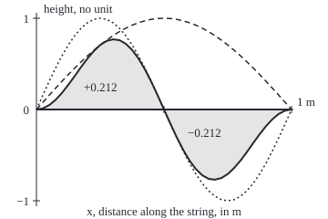

# Sturm-Liouville: the standard form whose modes are real, perpendicular under a weight, and rich enough to expand functions in

[Syllabus](../../../SYLLABUS.md) → [Differential equations and dynamics](../README.md) → [Series Solutions and Boundary Problems](../README.md#s07) → Sturm-Liouville

---

## General Overview

A string 1 m long is pinned at both ends. It vibrates in a mix of pure shapes called modes: one arch, two arches, three, each at its own pitch ([Eigenvalue problems](08-eigenvalues-and-eigenfunctions.md)). Multiply the one-arch shape by the two-arch shape, point by point, and integrate along the string. The answer is exactly 0.

A round drum skin of radius 1 m has ring-shaped modes built from Bessel's function ([Bessel's equation](03-bessels-equation-and-the-drum.md)). Multiply two and integrate along a radius: 0.196082, not 0. Count each point by its ring's circumference, which grows with the radius, and the answer is 0 again.

Both are one theorem about equations in the Sturm-Liouville form, and the cancellation is what splits any starting shape into modes, one pitch at a time.

**Put the equation in Sturm-Liouville form and, under shared end conditions, every eigenvalue is real and any two different modes integrate to zero against the form's weight.**

**What kind of fact this is:** a theorem, proved on this card in Why it works; that every shape is a sum of modes is stated here and proved on the spectral-theorem card.

### The picture: two string modes cancel

<p align="center"></p>

To scale: 280 px per metre across, 100 px per unit up. Dashed: sin(πx). Dotted: sin(2πx). Shaded: their product, lobes of area +0.212207 and −0.212207, peak 0.7698 at x = 0.3041 m.

---

## The formula

Notation first: y' is the slope along the string, and (p y')' the rate of change of p times the slope. A **mode** is a nonzero shape y solving the equation below with the end conditions; its number λ is its **eigenvalue**. The Sturm-Liouville form:

$$-\big(p(x)\,y'\big)' + q(x)\,y = \lambda\, w(x)\, y, \qquad a < x < b .$$

**Read it aloud:** minus the rate of (stiffness times slope), plus the potential times the shape, equals the eigenvalue times the weight times the shape.

The left side is $L$ for short. Each end has one condition: y = 0, or p y' = 0, or a fixed real ratio of the two. The conclusion:

$$\int_a^b w(x)\,y_m(x)\,y_n(x)\,dx = 0 \quad (m \ne n), \qquad c_n = \frac{\int_a^b w\,f\,y_n\,dx}{\int_a^b w\,y_n^{2}\,dx}.$$

**Read it aloud:** two different modes, multiplied and weighted, integrate to zero; the amount of mode n in a shape f is their weighted overlap over the mode's weighted size.

| Symbol | Plain meaning | In our example | Push it up and the answer… |
| --- | --- | --- | --- |
| $x$, $r$, $a$, $b$ | position: m along the string, drum radii from the centre; ends a and b | 0 to 1 on both | — |
| $y$, $y_n$, $u$, $v$ | a mode's shape; mode number n; two modes compared | sin(nπx); J0(j1 r) | — |
| $p$, $B$ | stiffness; B is the slope coefficient it is built from | p = 1 string, p = r drum | higher eigenvalues |
| $q$, $L$ | a potential, like springs under the string; L is the left side | q = 0 on both | eigenvalues shift up |
| $w$ | the weight: how much each point counts | w = 1 string, w = r drum | lower eigenvalues |
| $\lambda$, $\lambda_n$, $\mu$ | eigenvalues: the square of each mode's wave number | n^2 π^2 string; j1^2 drum | a faster mode |
| $f$, $c_n$, $N$ | a starting shape, in cm; amount of mode n; modes kept | x(1 − x); c1 = 0.258012 | closer to f |
| $J_0$, $J_1$, $j_1$, $j_2$ | Bessel's functions of order 0 and 1; J0's first two zeros | 2.404825558, 5.520078110 | — |

### When it holds

- **p and w positive inside the interval.** A sign-changing weight can give a mode size 0, and c_n cannot be divided out. p may reach 0 at an end, as the drum's does, if modes stay finite there.
- **p, q and w real.** An absorbing medium's complex coefficient gives complex eigenvalues.
- **The same end conditions for both modes.** The free-end constant 1 against the pinned sin(πx) integrates to 0.636620.
- **For the expansion, the integral of w f^2 finite.** The sum then reaches f on average, and pointwise inside the interval where f is smooth.

---

## Why it works

### Step 0: the operator behaves like a symmetric matrix

A symmetric matrix A, with u · Av equal to v · Au for all vectors u and v, has real eigenvalues and perpendicular eigenvectors. For functions the integral of a product is the dot product ([Gram-Schmidt](../../03-Algebra/06-Dot%20Products%20and%20Best%20Fits/03-gram-schmidt-and-orthonormal-bases.md)). The Sturm-Liouville form is the shape that makes the integral of u L v equal that of v L u.

### Step 1: put the equation in the form

Take y'' + B(x) y' + (a multiple of y) = −λ y. Multiply through by $p$ = e raised to the integral of B. Then p' = p B, so p y'' + p B y' is (p y')', the product rule backwards. Whatever now multiplies λ is the weight.

The drum's ring modes solve y'' + (1/r) y' + λ y = 0, with y(1) = 0 at the rim. B = 1/r integrates to ln r, so p = r: (r y')' + λ r y = 0, with weight r, the overview's circumference factor. The string already has p = w = 1.

### Step 2: the two-sided integration by parts

Take shapes u and v with the same end conditions. Integrate u (p v')' by parts twice ([Integration by parts](../../06-Calculus%20and%20analysis/04-Integrals/04-integration-by-parts.md)); each round moves a derivative from v to u and leaves an end term, and the middle pieces p u' v' cancel:

$$\int_a^b (u\,Lv - v\,Lu)\,dx = \Big[\,p\,(u'v - u\,v')\,\Big]_a^b .$$

This is **Lagrange's identity**; q u v appears on both sides and drops out. At a pinned end u = v = 0, so the bracket is 0; at the drum's centre p = r = 0 kills it.

### Step 3: different modes are perpendicular under the weight

Let u be a mode with eigenvalue λ and v one with eigenvalue μ. Then Lu = λ w u and Lv = μ w v. The identity's right side is 0, so

$$(\mu - \lambda)\int_a^b w\,u\,v\,dx = 0 .$$

If μ ≠ λ the weighted integral must vanish. On the drum, λ = j1^2 and μ = j2^2, and the integral of r J0(j1 r) J0(j2 r) is 0.

### Step 4: every eigenvalue is real

Suppose a mode y were complex, with eigenvalue λ. Since p, q and w are real, its complex conjugate is a mode with the conjugate eigenvalue. Step 3 then says (λ minus its conjugate) times the integral of w |y|^2 is 0. That integral is positive, so λ is real.

### Step 5: read off the amounts of each mode

If f = c1 y1 + c2 y2 + …, multiply by w y_n and integrate. By Step 3 every term dies but the one with y_n, leaving c_n times the integral of w y_n^2. Divide: that is the formula for $c_n$, the same move that finds a vector's components along perpendicular axes.

Whether the sum rebuilds f with nothing missing is a separate claim, **completeness**. It holds for regular problems (finite interval, p and w positive on all of it, ends included) and for the drum; the proof is on Compact and symmetric.

<details>
<summary>Detailed proof: Lagrange's identity and the reality of eigenvalues</summary>

With p, q real and u, v twice differentiable, u (p v')' − v (p u')' = p'(u v' − v u') + p(u v'' − v u''), the derivative of p(u v' − v u'). The q terms cancel, so ∫ (u L v − v L u) dx = [p(u' v − u v')] from a to b.

End terms. An end condition α y + β p y' = 0, with real α, β not both 0, makes (u, p u') and (v, p v') both perpendicular to (α, β), so parallel; (p u') v − u (p v') is their determinant, 0. Where p → 0 with bounded u, v and slopes, the term tends to 0.

Reality. If L y = λ w y with y ≠ 0 complex, conjugating gives L ȳ = λ̄ w ȳ under the same end conditions. With u = y, v = ȳ: (λ̄ − λ) ∫ w |y|^2 dx = 0, and the integral is positive, so λ̄ = λ.

</details>

A second road replaces the string by a row of beads and derivatives by differences ([Finite differences](07-finite-differences-for-boundary-problems.md)): the matrix is symmetric, so its eigenvectors are perpendicular, and they approach the modes as the beads multiply.

---

## Worked numbers, by hand

The string: −y'' = λ y on 0 ≤ x ≤ 1 m, pinned, so λ_n = n^2 π^2 and y_n = sin(nπx). The start is the arch f(x) = x(1 − x), in cm with x in m, 0.25 cm high in the middle, the shape a steady even push leaves.

| Step | Arithmetic | Value |
| --- | --- | --- |
| one arch times two | ½[cos(πx) − cos(3πx)] | integrates to **0** |
| each lobe | 2/(3π) | 0.212207, and −0.212207 |
| a mode's size | sin^2(πx) = ½[1 − cos(2πx)] | integrates to **0.5** |
| amount of mode n | 2 × integral of x(1 − x) sin(nπx), by parts twice: 4(1 − (−1)^n)/(nπ)^3 | c1 = 0.258012, c2 = 0, c3 = 0.009556 |
| rebuild the middle | c1 − c3 + c5 − c7 | 0.258012, 0.248456, 0.250520, **0.249768** |
| drum, weighted | integral of r J0(j1 r) J0(j2 r) | **0** |
| drum's mode size | integral of r J0(j1 r)^2 = J1(j1)^2/2 | 0.134757062 |

The arch holds 0.258012 cm of the lowest pitch and 0.009556 cm of the third; the symmetric arch has no even harmonics.

### What breaks if you drop a piece

| Mistake | Comes out at | What went wrong |
| --- | --- | --- |
| Drum modes integrated without the weight r | 0.196082, not 0 | Perpendicular only under the weight |
| Coefficient not divided by the mode's size ½ | c1 = 0.129006, half the true 0.258012 | Modes are perpendicular, not unit size |
| A free-end mode, 1, set against a pinned one, sin(πx) | 0.636620, not 0 | Step 2's end terms need shared end conditions |

The code prints all three.

---

## Code, from first principles, and it actually runs

The check writes its own integrator (Simpson's rule), Bessel functions and root finder. Two roads per claim: Simpson against antiderivatives; J0's zeros from its series and from the integral J0(x) = (1/π) ∫ cos(x sin t) dt over 0 to π; the drum's size against J1; coefficients by Simpson and by parts. Four asserts.

### Python

```python
# Sturm-Liouville and orthogonality -- the check behind the card.  Standard library only;
# integrator, Bessel functions and root finder are written here.  Each claim is reached
# twice: Simpson against antiderivatives, J0 zeros by series and by integral, norm by J1.
from math import sin, cos, pi, acos, sqrt

def simpson(f, a, b, n=2000):                  # Simpson's rule, n even
    h = (b - a) / n
    return (f(a) + f(b) + sum((4 if k % 2 else 2) * f(a + k * h) for k in range(1, n))) * h / 3

def z(v): return 0.0 if abs(v) < 5e-10 else v  # print a vanishing number as 0
def j_series(x, order=0):                      # J0 or J1 from its power series
    term, total, k = (x / 2) ** order, (x / 2) ** order, 0
    while abs(term) > 1e-18:
        k += 1
        term *= -(x / 2) ** 2 / (k * (k + order))
        total += term
    return total

def j0_integral(x):                            # J0(x) = (1/pi) * integral of cos(x sin t)
    return simpson(lambda t: cos(x * sin(t)), 0, pi, 200) / pi
def bisect(f, lo, hi):                         # root finder, 60 halvings
    for _ in range(60):
        mid = (lo + hi) / 2
        lo, hi = (mid, hi) if f(lo) * f(mid) > 0 else (lo, mid)
    return (lo + hi) / 2

pairs = ((1, 1), (1, 2), (2, 2), (1, 3), (2, 3))
num = [simpson(lambda x: sin(m * pi * x) * sin(n * pi * x), 0, 1) for m, n in pairs]
anti = [0.5 if m == n else (sin((m - n) * pi) / (m - n) - sin((m + n) * pi) / (m + n)) / (2 * pi)
        for m, n in pairs]
print("string, Simpson:       " + " ".join(f"({m},{n}) {z(v):.6f}" for (m, n), v in zip(pairs, num)))
print("string, antiderivative:" + "".join(f" ({m},{n}) {z(v):.6f}" for (m, n), v in zip(pairs, anti)))
assert max(abs(a - b) for a, b in zip(num, anti)) < 1e-12
lobe = simpson(lambda x: sin(pi * x) * sin(2 * pi * x), 0, 0.5)
print(f"lobes of sin(pi x) sin(2 pi x): +{lobe:.6f} and -{lobe:.6f}; 2/(3 pi) = {2 / (3 * pi):.6f}")
j1, j2 = bisect(j_series, 2, 3), bisect(j_series, 5, 6)
i1, i2 = bisect(j0_integral, 2, 3), bisect(j0_integral, 5, 6)
print(f"drum J0 zeros, series road: {j1:.9f}, {j2:.9f}; integral road: {i1:.9f}, {i2:.9f}")
assert abs(j1 - i1) < 1e-9 and abs(j2 - i2) < 1e-9
wcross = simpson(lambda r: r * j_series(j1 * r) * j_series(j2 * r), 0, 1)
wnorm = simpson(lambda r: r * j_series(j1 * r) ** 2, 0, 1)
bare = simpson(lambda r: j_series(j1 * r) * j_series(j2 * r), 0, 1)
half_j1sq = j_series(j1, 1) ** 2 / 2
print(f"drum, weight r: cross {z(wcross):.9f}; norm {wnorm:.9f}, J1(j1)^2/2 = {half_j1sq:.9f}")
print(f"drum, weight dropped: cross {bare:.6f}, not 0")
assert abs(wcross) < 1e-10 and abs(wnorm - half_j1sq) < 1e-10
cs = [2 * simpson(lambda x: x * (1 - x) * sin(n * pi * x), 0, 1) for n in (1, 2, 3)]
cp = [4 * (1 - (-1) ** n) / (n * pi) ** 3 for n in range(1, 8)]
print("arch x(1 - x), c_1 c_2 c_3 by Simpson: " + " ".join(f"{z(c):.6f}" for c in cs))
print("arch x(1 - x), c_1 c_2 c_3 by parts:   " + " ".join(f"{c:.6f}" for c in cp[:3]))
assert max(abs(a - b) for a, b in zip(cs, cp)) < 1e-12
sums = [sum(cp[k] * sin((k + 1) * pi / 2) for k in range(n)) for n in (1, 3, 5, 7)]
print("partial sums at x = 0.5, target 0.25: " + ", ".join(f"N={2 * i + 1} {s:.6f}" for i, s in enumerate(sums)))
print(f"mistake, norm 1/2 left out: c_1 = {4 / pi ** 3:.6f}, half the true {cp[0]:.6f}")
print(f"mistake, slope-zero mode 1 against sin(pi x): {simpson(lambda x: sin(pi * x), 0, 1):.6f}, not 0")
xp = acos(1 / sqrt(3)) / pi
yp = sin(pi * xp) * sin(2 * pi * xp)
print(f"figure, peak x = {xp:.4f} value {yp:.4f} at ({40 + 280 * xp:.1f}, {120 - 100 * yp:.1f}), "
      f"trough at ({40 + 280 * (1 - xp):.1f}, {120 + 100 * yp:.1f})")
print("ALL CHECKS PASS")
```

**Ran 2026-09-28 on macOS, Python 3.14.6, standard library only. All checks passed. Output, pasted from the run:**

```
string, Simpson:       (1,1) 0.500000 (1,2) 0.000000 (2,2) 0.500000 (1,3) 0.000000 (2,3) 0.000000
string, antiderivative: (1,1) 0.500000 (1,2) 0.000000 (2,2) 0.500000 (1,3) 0.000000 (2,3) 0.000000
lobes of sin(pi x) sin(2 pi x): +0.212207 and -0.212207; 2/(3 pi) = 0.212207
drum J0 zeros, series road: 2.404825558, 5.520078110; integral road: 2.404825558, 5.520078110
drum, weight r: cross 0.000000000; norm 0.134757062, J1(j1)^2/2 = 0.134757062
drum, weight dropped: cross 0.196082, not 0
arch x(1 - x), c_1 c_2 c_3 by Simpson: 0.258012 0.000000 0.009556
arch x(1 - x), c_1 c_2 c_3 by parts:   0.258012 0.000000 0.009556
partial sums at x = 0.5, target 0.25: N=1 0.258012, N=3 0.248456, N=5 0.250520, N=7 0.249768
mistake, norm 1/2 left out: c_1 = 0.129006, half the true 0.258012
mistake, slope-zero mode 1 against sin(pi x): 0.636620, not 0
figure, peak x = 0.3041 value 0.7698 at (125.1, 43.0), trough at (234.9, 197.0)
ALL CHECKS PASS
```

### Rust

Same numbers, same labels, built with `rustc --edition 2021 -O`.

```rust
// Sturm-Liouville and orthogonality -- the same check as the Python, in Rust.  No crates;
// integrator, Bessel functions and root finder are written here.  Each claim is reached
// twice: Simpson against antiderivatives, J0 zeros by series and by integral, norm by J1.
use std::f64::consts::PI;

fn simpson(f: &dyn Fn(f64) -> f64, a: f64, b: f64, n: usize) -> f64 { // Simpson's rule, n even
    let h = (b - a) / n as f64;
    let inner: f64 = (1..n).map(|k| (if k % 2 == 1 { 4.0 } else { 2.0 }) * f(a + k as f64 * h)).sum();
    (f(a) + f(b) + inner) * h / 3.0
}

fn z(v: f64) -> f64 { if v.abs() < 5e-10 { 0.0 } else { v } } // print a vanishing number as 0

fn j_series(x: f64, order: i32) -> f64 {           // J0 or J1 from its power series
    let (mut term, mut k) = ((x / 2.0).powi(order), 0.0);
    let mut total = term;
    while term.abs() > 1e-18 {
        k += 1.0;
        term *= -(x / 2.0).powi(2) / (k * (k + order as f64));
        total += term;
    }
    total
}

fn j0_integral(x: f64) -> f64 {                    // J0(x) = (1/pi) * integral of cos(x sin t)
    simpson(&|t: f64| (x * t.sin()).cos(), 0.0, PI, 200) / PI
}

fn bisect(f: &dyn Fn(f64) -> f64, mut lo: f64, mut hi: f64) -> f64 { // root finder, 60 halvings
    for _ in 0..60 {
        let mid = (lo + hi) / 2.0;
        if f(lo) * f(mid) > 0.0 { lo = mid } else { hi = mid }
    }
    (lo + hi) / 2.0
}

fn main() {
    let pairs = [(1.0, 1.0), (1.0, 2.0), (2.0, 2.0), (1.0, 3.0), (2.0, 3.0)];
    let num: Vec<f64> = pairs.iter().map(|&(m, n)| simpson(&|x: f64| (m * PI * x).sin() * (n * PI * x).sin(), 0.0, 1.0, 2000)).collect();
    let anti: Vec<f64> = pairs.iter().map(|&(m, n)| if m == n { 0.5 } else {
        (((m - n) * PI).sin() / (m - n) - ((m + n) * PI).sin() / (m + n)) / (2.0 * PI) }).collect();
    let show = |v: &Vec<f64>| pairs.iter().zip(v).map(|(&(m, n), &x)| format!(" ({},{}) {:.6}", m, n, z(x))).collect::<String>();
    println!("string, Simpson:      {}", show(&num));
    println!("string, antiderivative:{}", show(&anti));
    assert!(num.iter().zip(&anti).all(|(a, b)| (a - b).abs() < 1e-12));
    let lobe = simpson(&|x: f64| (PI * x).sin() * (2.0 * PI * x).sin(), 0.0, 0.5, 2000);
    println!("lobes of sin(pi x) sin(2 pi x): +{:.6} and -{:.6}; 2/(3 pi) = {:.6}", lobe, lobe, 2.0 / (3.0 * PI));
    let j0 = |x: f64| j_series(x, 0);
    let (j1, j2) = (bisect(&j0, 2.0, 3.0), bisect(&j0, 5.0, 6.0));
    let (i1, i2) = (bisect(&j0_integral, 2.0, 3.0), bisect(&j0_integral, 5.0, 6.0));
    println!("drum J0 zeros, series road: {:.9}, {:.9}; integral road: {:.9}, {:.9}", j1, j2, i1, i2);
    assert!((j1 - i1).abs() < 1e-9 && (j2 - i2).abs() < 1e-9);
    let wcross = simpson(&|r: f64| r * j0(j1 * r) * j0(j2 * r), 0.0, 1.0, 2000);
    let wnorm = simpson(&|r: f64| r * j0(j1 * r).powi(2), 0.0, 1.0, 2000);
    let bare = simpson(&|r: f64| j0(j1 * r) * j0(j2 * r), 0.0, 1.0, 2000);
    let half_j1sq = j_series(j1, 1).powi(2) / 2.0;
    println!("drum, weight r: cross {:.9}; norm {:.9}, J1(j1)^2/2 = {:.9}", z(wcross), wnorm, half_j1sq);
    println!("drum, weight dropped: cross {:.6}, not 0", bare);
    assert!(wcross.abs() < 1e-10 && (wnorm - half_j1sq).abs() < 1e-10);
    let cs: Vec<f64> = (1..4).map(|n| 2.0 * simpson(&|x: f64| x * (1.0 - x) * (n as f64 * PI * x).sin(), 0.0, 1.0, 2000)).collect();
    let cp: Vec<f64> = (1..8).map(|n| 4.0 * (1.0 - (-1f64).powi(n)) / (n as f64 * PI).powi(3)).collect();
    println!("arch x(1 - x), c_1 c_2 c_3 by Simpson: {}", cs.iter().map(|c| format!("{:.6}", z(*c))).collect::<Vec<_>>().join(" "));
    println!("arch x(1 - x), c_1 c_2 c_3 by parts:   {}", cp[..3].iter().map(|c| format!("{:.6}", c)).collect::<Vec<_>>().join(" "));
    assert!(cs.iter().zip(&cp).all(|(a, b)| (a - b).abs() < 1e-12));
    let sums: Vec<String> = [1, 3, 5, 7].iter().map(|&n| {
        let s: f64 = (0..n).map(|k| cp[k] * ((k + 1) as f64 * PI / 2.0).sin()).sum();
        format!("N={} {:.6}", n, s) }).collect();
    println!("partial sums at x = 0.5, target 0.25: {}", sums.join(", "));
    println!("mistake, norm 1/2 left out: c_1 = {:.6}, half the true {:.6}", 4.0 / PI.powi(3), cp[0]);
    println!("mistake, slope-zero mode 1 against sin(pi x): {:.6}, not 0", simpson(&|x: f64| (PI * x).sin(), 0.0, 1.0, 2000));
    let xp = (1.0 / 3f64.sqrt()).acos() / PI;
    let yp = (PI * xp).sin() * (2.0 * PI * xp).sin();
    println!("figure, peak x = {:.4} value {:.4} at ({:.1}, {:.1}), trough at ({:.1}, {:.1})",
             xp, yp, 40.0 + 280.0 * xp, 120.0 - 100.0 * yp, 40.0 + 280.0 * (1.0 - xp), 120.0 + 100.0 * yp);
    println!("ALL CHECKS PASS");
}
```

**Ran 2026-09-28 on macOS, rustc 1.98.1, no crates. All checks passed. Output, pasted from the run:**

```
string, Simpson:       (1,1) 0.500000 (1,2) 0.000000 (2,2) 0.500000 (1,3) 0.000000 (2,3) 0.000000
string, antiderivative: (1,1) 0.500000 (1,2) 0.000000 (2,2) 0.500000 (1,3) 0.000000 (2,3) 0.000000
lobes of sin(pi x) sin(2 pi x): +0.212207 and -0.212207; 2/(3 pi) = 0.212207
drum J0 zeros, series road: 2.404825558, 5.520078110; integral road: 2.404825558, 5.520078110
drum, weight r: cross 0.000000000; norm 0.134757062, J1(j1)^2/2 = 0.134757062
drum, weight dropped: cross 0.196082, not 0
arch x(1 - x), c_1 c_2 c_3 by Simpson: 0.258012 0.000000 0.009556
arch x(1 - x), c_1 c_2 c_3 by parts:   0.258012 0.000000 0.009556
partial sums at x = 0.5, target 0.25: N=1 0.258012, N=3 0.248456, N=5 0.250520, N=7 0.249768
mistake, norm 1/2 left out: c_1 = 0.129006, half the true 0.258012
mistake, slope-zero mode 1 against sin(pi x): 0.636620, not 0
figure, peak x = 0.3041 value 0.7698 at (125.1, 43.0), trough at (234.9, 197.0)
ALL CHECKS PASS
```

> [!TIP]
> **Try changing**
> - Guess first: change the pair `(2, 3)` to `(3, 3)`. Both roads print 0.500000; every string mode has size ½.
> - Guess first: delete `r *` from the `wnorm` line. The third assert fails: J1(j1)^2/2 is the weighted size only.
> - Guess first: change the by-parts factor 4 to 2. The fourth assert fails; Simpson's answer does not move.

---

## The usual mistake

> [!warning]
> **Testing perpendicularity with the plain integral when the problem has a weight.** The drum's first two ring modes give 0.196082; they are perpendicular only when each radius r counts r times. The weight is read off the equation, never chosen afterwards.
>
> - **Not dividing by the mode's size.** String modes have size ½, so c1 comes out 0.129006 instead of 0.258012.
> - **Mixing end conditions.** The free-end constant 1 against the pinned sin(πx) gives 0.636620.
> - **Taking perpendicular for complete.** Delete sin(πx) and the rest stay perpendicular, yet no sum of them rebuilds the arch: its 0.258012 cm of fundamental has nowhere to go.

---

## Where you meet it in real life

- **Strings and drums.** The c_n say how loud each harmonic is.
- **Heat in a rod.** Each mode cools at its own rate ([Fourier series](../09-Fourier%20Series/01-fourier-series-and-orthogonality.md)).
- **Legendre's polynomials.** Already in form, with p = 1 − x^2, so perpendicular on −1 to 1 ([Legendre's equation](04-legendre-polynomials.md)).
- **A forced string.** Expanding the force in modes solves one mode at a time; the closed form is [Green's function](10-greens-function-for-a-boundary-problem.md).

> **Say it back**
> Sturm-Liouville form: minus the rate of stiffness times slope, plus a potential, equals an eigenvalue times a weight times the shape. Integrating by parts twice shows the operator is symmetric under shared end conditions. Symmetry forces real eigenvalues and perpendicular modes under the weight. Each mode's amount in a shape is the weighted overlap over the mode's size. Drum modes need the weight r.

---

## What this builds on

- [Eigenvalue problems](08-eigenvalues-and-eigenfunctions.md): the string's modes.
- [Bessel's equation](03-bessels-equation-and-the-drum.md): J0 and the drum's modes.
- [Gram-Schmidt](../../03-Algebra/06-Dot%20Products%20and%20Best%20Fits/03-gram-schmidt-and-orthonormal-bases.md): components along perpendicular axes.
- [Integration by parts](../../06-Calculus%20and%20analysis/04-Integrals/04-integration-by-parts.md): Lagrange's identity.

## Where this goes next

- [Fourier series](../09-Fourier%20Series/01-fourier-series-and-orthogonality.md): the sine and cosine case, and convergence.
- Schrodinger's equation: the string equation as allowed energies.
- Compact and symmetric: the proof of completeness.
- Self-adjoint extensions: end conditions as a choice of operator.
- Helmholtz: the theorem in two and three dimensions.

---

## Sources

Verified 2026-09-28: every link below opens a page that names the cited work.

- Teschl, Gerald. *Ordinary Differential Equations and Dynamical Systems*. AMS, Graduate Studies in Mathematics 140. [Author's page, free text](https://www.mat.univie.ac.at/~gerald/ftp/book-ode/). Chapter 5: regular problems, Lagrange's identity, real eigenvalues, completeness.
- Lebl, Jiří. *Notes on Diffy Qs*, §5.1 "Sturm–Liouville problems". [Section page](https://www.jirka.org/diffyqs/html/slproblems_section.html). The form, weighted orthogonality, expansions.
- NIST Digital Library of Mathematical Functions, §10.9 "Integral Representations". [Section page](https://dlmf.nist.gov/10.9). The integral for J0, the check's second road.
- NIST Digital Library of Mathematical Functions, §10.22 "Integrals". [Section page](https://dlmf.nist.gov/10.22). J0 modes perpendicular with weight r; the size J1(j)^2/2.
