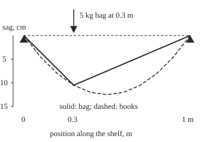

# Green's function: the response to a single point load, from which every load's response is a sum

Differential equations and dynamics → Series Solutions and Boundary Problems → Responses to a point load → Green's function

---

## General Overview

A canvas shelf 1 m long is stretched between two brackets with a tension of 98.1 N, the weight of 10 kg. Spread 10 kg of paperbacks evenly along it and it sags into a smooth curve, 12.5 cm deep at the middle. Hang one 5 kg bag at 0.3 m from the left bracket instead: two straight pieces, with a corner 10.5 cm down under the bag.

The shelf is linear: two loads together sag it by the sum of their separate sags. A spread load is many small bags side by side, so the shape made by one unit bag at each place gives every load's shape by adding. That shape is the **Green's function**, the name used from here on, after George Green's 1828 work on electric charge.

For this shelf it is a tent: G(x, s) = min(x, s)(1 − max(x, s)), with s where the bag hangs and x where the sag is read; min(x, s) is the smaller of the two, max(x, s) the larger. Adding tents over the books gives x(1 − x)/2.

**Find the tent that a unit point load makes at each place; the sag under any load is the sum of those tents, each weighted by the load at its place.**

**What kind of fact this is:** a theorem, proved on this card in Why it works.

### The picture: one bag, then the books

<p align="center"></p>

To scale: 280 px per metre across, 800 px per metre down, so sag is drawn 2.86 times deeper. Both shapes pass 10.5 cm at x = 0.3 m, by coincidence.

---

## The formula

Write x for the distance from the left bracket in metres and y(x) for the sag there, downward; y′ is the slope, y″ the bend. A tight canvas with small slopes obeys −T y″ = q, with T the tension and q the weight per metre. Divide by T and call f = q/T the **load**:

$$-y'' = f, \qquad y(0) = 0, \quad y(1) = 0$$

Its conditions sit at both ends, not at the start ([two-point-boundary-value-problems](05-two-point-boundary-value-problems.md)). Its solution is

$$y(x) = \int_0^1 G(x, s)\, f(s)\, ds, \qquad G(x, s) = \begin{cases} x\,(1 - s), & x \le s \\ s\,(1 - x), & x \ge s \end{cases}$$

**Read it aloud:** the sag at x is the load at each place s, times the tent that a unit bag at s makes at x, added up over the whole shelf.

The two cases fold into one line, G(x, s) = min(x, s)(1 − max(x, s)). A bag of size P at s sags the shelf by P G(x, s).

| Symbol | Plain meaning | In our example | Push it up and the answer… |
| --- | --- | --- | --- |
| $x$, $s$ | where the sag is read; where a load sits, in m | 0 to 1; the bag at s = 0.3 | moving s moves the corner |
| $y$ | sag in m, downward; y′ slope, y″ bend | 0.105 m under the bag | — |
| $T$, $q$ | tension in N; weight per metre in N/m | 98.1 N; books 98.1 N/m | more T, less sag |
| $f$ | load, q/T, per metre | 1 per m for the books | sag grows in proportion |
| $P$ | a point weight divided by T | 49.05 N / 98.1 N = 0.5 | the tent scales with it |
| $G$ | Green's function: sag at x from a unit load at s | G(0.3, 0.3) = 0.21 | — |
| $u_1$, $u_2$ | unloaded shapes pinned at one end: x at the left, 1 − x at the right | 0 at their own bracket | — |
| $A$, $B$ | the tent's left slope and the size of its right slope, set by s | 0.7 and 0.3 at s = 0.3 | — |

### When it holds

- **Small slopes.** Sags add only while slopes stay small; at the bag's slope of 0.35 the rule is a fair approximation, not exact.
- **Both ends fixed.** Ends at heights a and b: add the straight line a(1 − x) + bx. Other end conditions need another G.
- **The unloaded problem has only the flat answer.** With sliding ends (zero slope at both brackets) any constant height solves it, and no G exists: mistake 4 below.
- **A continuous load, or finitely many point bags.**

---

## Why it works

### Step 0: a load is a pile of point loads, and responses add

Cut the books into slices of width ds; the slice at s is a small bag of size f(s) ds. The rule −y″ = f is linear, so the slices' sags add, ends still at zero, and the full sag is the sum of f(s) ds times the unit bag's sag.

### Step 1: away from the bag the canvas is straight

Off the bag there is no load, so −y″ = 0: the slope is constant and each piece is straight. The left piece passes through the left bracket, so it is A x, a multiple of u₁ = x. The right piece is B(1 − x), a multiple of u₂ = 1 − x. Two unknowns, A and B, remain.

### Step 2: the bag puts a corner in the canvas

Integrate −y″ = f across a short stretch around s. The left side becomes −(slope just right − slope just left); the right side is the load in the stretch, 1 for a unit bag. So the slope drops by exactly 1 at the bag: the tension's pull on both sides of the corner holds the bag up. The sag itself does not jump, since the canvas does not tear.

### Step 3: two conditions fix the tent

Equal heights at s: A s = B(1 − s). Slope drop of 1: (−B) − A = −1. Solving, A = 1 − s and B = s, which is the formula. At s = 0.3: A = 0.7, B = 0.3, peak height 0.3 × 0.7 = 0.21.

In general, with u₁ an unloaded solution meeting the left condition and u₂ one meeting the right, G(x, s) = u₁(smaller of x, s) u₂(larger of x, s) / C, where C = u₁′u₂ − u₁u₂′. Here C = 1 × (1 − x) − x × (−1) = 1. If u₁ also meets the right condition, C = 0 and the recipe fails: the unloaded problem then has a nonflat answer.

### Step 4: add the tents and check the sum solves the problem

Split the sum at s = x: loads left of x act through s(1 − x), loads right of x through x(1 − s):

$$y(x) = (1 - x)\int_0^x s\, f(s)\, ds \;+\; x\int_x^1 (1 - s)\, f(s)\, ds$$

Differentiating twice by the fundamental theorem of calculus gives −y″ = f, with zero at both ends (folded proof below). For the books, f = 1: y = (1 − x)x^2/2 + x(1 − x)^2/2 = x(1 − x)/2.

### Step 5: nothing else solves it

Two solutions differ by a w with w″ = 0, a straight line w = c₀ + c₁x, zero at both ends; so c₀ = c₁ = 0.

<details>
<summary>Detailed proof</summary>

Let f be continuous on the interval from 0 to 1. Write L(x) for the integral of s f(s) from 0 to x, and R(x) for the integral of (1 − s) f(s) from x to 1. The fundamental theorem gives L′(x) = x f(x) and R′(x) = −(1 − x) f(x).

Then y = (1 − x)L + xR, and by the product rule y′ = −L + (1 − x) x f(x) + R − x(1 − x) f(x) = −L + R. The two moving-end terms cancel. Differentiating again, y″ = −x f(x) − (1 − x) f(x) = −f(x); nothing was assumed about the derivatives of f.

Ends: y(0) = 1 × L(0) + 0 × R(0) = 0, since L(0) = 0; y(1) = 0 × L(1) + 1 × R(1) = 0, since R(1) = 0.

</details>

A second route runs through the grid of [finite-differences-for-boundary-problems](07-finite-differences-for-boundary-problems.md). The inverse of its matrix holds the step h times G at the grid points, which is why the grid below lands on the tent exactly. The formula also gives G(x, s) = G(s, x): a bag at 0.3 sags the point 0.7 by 0.045 m, as the same bag at 0.7 sags the point 0.3.

---

## Worked numbers, by hand

The bag: 5 kg at s = 0.3 m, P = 49.05 / 98.1 = 0.5.

| Step | Arithmetic | Value |
| --- | --- | --- |
| left slope of the unit tent | A = 1 − s | 0.7 |
| right slope's size | B = s | 0.3 |
| unit tent's peak | G(0.3, 0.3) = 0.3 × 0.7 | 0.21 |
| the bag's peak | 0.5 × 0.21 | **0.105 m** |
| slopes beside the bag | 0.5 × 0.7 and −0.5 × 0.3 | 0.35 and −0.15 |
| slope drop | −0.15 − 0.35 | −0.5 = −P |
| books, midpoint | (1 − 0.5) × 0.5^2/2 + 0.5 × 0.5^2/2 | **0.125 m** |

The bag's corner sits 10.5 cm down; the books sag 12.5 cm at the middle.

### What breaks if you drop a piece

| Mistake | Comes out at | What went wrong |
| --- | --- | --- |
| No corner: left piece used everywhere | far bracket at 0.35 m, not 0 | The right end condition is lost |
| Only loads left of x, as in a start-time problem | midpoint 0.0625 m, not 0.125 | Loads on both sides pull |
| Slope rises by 1 instead of dropping | bag point at −0.105 m, the shelf lifted | The sign of −y″ was dropped |
| Sliding ends, y′(0) = y′(1) = 0 | y′(1) − y′(0) = −1, needs 0 | No solution, so no G |

The code prints all four.

---

## Code, from first principles, and it actually runs

Nothing is imported. Road one builds the tent from Step 3's corner conditions by Cramer's rule and sums it against the books by a midpoint rule. Road two never mentions G: steps of h = 0.1 m, y″ replaced by the second difference, and the equations solved by the Thomas algorithm (elimination along a three-band matrix), the bag entering as load P/h on one node. Four asserts compare the roads.

### Python

```python
# Green's function for -y'' = f with zero ends -- the check behind the card.
# A canvas shelf 1 m long; sag y in m; load f = weight per metre / tension.
# Road 1: the tent G(x, s) built from Step 3's corner conditions, summed against the load.
# Road 2: a finite-difference grid solving -y'' = f directly, never using G.
def build(s, jump):      # A s - B (1 - s) = 0 and -A - B = jump, by Cramer's rule
    det = s * -1 - (-(1 - s)) * -1
    return (0 * -1 - (-(1 - s)) * jump) / det, (s * jump - 0 * -1) / det
def G(x, s, jump=-1.0):  # the tent for a unit load at s: A x left of s, B (1 - x) right of it
    A, B = build(s, jump)
    return A * x if x <= s else B * (1 - x)
def green_sum(x, f, top=1.0, m=2000):      # midpoint rule for the sum of G(x, s) f(s)
    h = top / m
    return sum(G(x, (j + 0.5) * h) * f((j + 0.5) * h) for j in range(m)) * h

def grid_solve(n, rhs):  # (-y[i-1] + 2 y[i] - y[i+1]) / h^2 = rhs[i], zero ends, Thomas
    h, cp, dp, y = 1.0 / n, [0.0] * n, [0.0] * n, [0.0] * (n + 1)
    for i in range(1, n):
        den = 2.0 + cp[i - 1]
        cp[i], dp[i] = -1.0 / den, (rhs[i] * h * h + dp[i - 1]) / den
    for i in range(n - 1, 0, -1): y[i] = dp[i] - cp[i] * y[i + 1]
    return y

def bag_grid(n, at):  # the bag as load P / h on the one node at `at`
    return grid_solve(n, [P * n if i == round(at * n) else 0.0 for i in range(n + 1)])

T, W, q = 10 * 9.81, 5 * 9.81, 10 * 9.81 / 1.0   # tension = weight of 10 kg; bag 5 kg; books 10 kg/m
P, xs, fmt = W / T, [i / 10 for i in range(11)], lambda v: " ".join(f"{a:.4f}" for a in v)
A, B = build(0.3, -1.0)
books_g, books_d = [green_sum(x, lambda s: q / T) for x in xs], grid_solve(10, [q / T] * 11)
bag_g, bag_d = [P * G(x, 0.3) for x in xs], bag_grid(10, 0.3)
left, right = (bag_d[3] - bag_d[2]) / 0.1, (bag_d[4] - bag_d[3]) / 0.1
print(f"shelf: tension {T:.2f} N, bag {W:.2f} N, P = {P:.4f}; books {q:.2f} N/m, f = {q / T:.4f} per m")
print(f"construction at s = 0.3: A = {A:.4f}, B = {B:.4f}, peak G(0.3, 0.3) = {A * 0.3:.4f}")
print("x                     " + "    ".join(f"{x:.1f}" for x in xs))
print("books, Green sum      " + fmt(books_g))
print("books, grid h = 0.1   " + fmt(books_d))
print("bag, 0.5 G(x, 0.3)    " + fmt(bag_g))
print("bag, grid h = 0.1     " + fmt(bag_d))
print(f"peak sag under the bag {bag_d[3]:.4f} m at x = 0.3; books at the middle {books_d[5]:.4f} m")
print(f"slopes beside the bag, grid: left {left:.4f}, right {right:.4f}, jump {right - left:.4f}")
print(f"reciprocity, grid: bag at 0.3 sags x = 0.7 by {bag_d[7]:.4f}; bag at 0.7 sags x = 0.3 by "
      f"{bag_grid(10, 0.7)[3]:.4f}")
for n in (10, 20):
    eb = max(abs(v - (i / n) * (1 - i / n) / 2) for i, v in enumerate(grid_solve(n, [1.0] * (n + 1))))
    ep = max(abs(v - P * G(i / n, 0.3)) for i, v in enumerate(bag_grid(n, 0.3)))
    print(f"grid h = {1 / n:.2f}: every node within 1e-15 of the kernel, books and bag: "
          f"{'yes' if max(eb, ep) < 1e-15 else 'no'}")
print(f"mistake 1, no slope jump (left piece everywhere): far end at {P * A * 1.0:.4f} m, not 0")
print(f"mistake 2, loads on the left only: books at the middle "
      f"{green_sum(0.5, lambda s: 1.0, top=0.5):.4f} m, not {books_g[5]:.4f}")
print(f"mistake 3, jump of +1: bag at x = 0.3 gives {P * G(0.3, 0.3, 1.0):.4f} m, the shelf lifted")
print(f"mistake 4, sliding ends y'(0) = y'(1) = 0: y'(1) - y'(0) = {-sum(0.1 for _ in range(10)):.4f}, needs 0")
print(f"figure, 280 px/m across, 800 px/m down, depth x {800 / 280:.2f}; bag tent px: " + " ".join(f"({40 + 280 * x:.0f},{60 + 800 * v:.0f})" for x, v in
      [(0, bag_d[0]), (0.3, bag_d[3]), (1, bag_d[10])]))
print("figure, books px y at x = 0 to 1: " + " ".join(f"{60 + 800 * v:.0f}" for v in books_d))
assert max(abs(g - d) for g, d in zip(books_g, books_d)) < 1e-12      # road 1 = road 2, books
assert max(abs(g - d) for g, d in zip(bag_g, bag_d)) < 1e-12          # road 1 = road 2, bag
assert abs((right - left) - (-P)) < 1e-9                              # grid kink = derived jump
assert abs(bag_d[7] - bag_grid(10, 0.7)[3]) < 1e-12                   # reciprocity on the grid
print("ALL CHECKS PASS")
```

**Ran 2026-09-28 on macOS, Python 3.14.6, standard library only. All checks passed. Output, pasted from the run:**

```
shelf: tension 98.10 N, bag 49.05 N, P = 0.5000; books 98.10 N/m, f = 1.0000 per m
construction at s = 0.3: A = 0.7000, B = 0.3000, peak G(0.3, 0.3) = 0.2100
x                     0.0    0.1    0.2    0.3    0.4    0.5    0.6    0.7    0.8    0.9    1.0
books, Green sum      0.0000 0.0450 0.0800 0.1050 0.1200 0.1250 0.1200 0.1050 0.0800 0.0450 0.0000
books, grid h = 0.1   0.0000 0.0450 0.0800 0.1050 0.1200 0.1250 0.1200 0.1050 0.0800 0.0450 0.0000
bag, 0.5 G(x, 0.3)    0.0000 0.0350 0.0700 0.1050 0.0900 0.0750 0.0600 0.0450 0.0300 0.0150 0.0000
bag, grid h = 0.1     0.0000 0.0350 0.0700 0.1050 0.0900 0.0750 0.0600 0.0450 0.0300 0.0150 0.0000
peak sag under the bag 0.1050 m at x = 0.3; books at the middle 0.1250 m
slopes beside the bag, grid: left 0.3500, right -0.1500, jump -0.5000
reciprocity, grid: bag at 0.3 sags x = 0.7 by 0.0450; bag at 0.7 sags x = 0.3 by 0.0450
grid h = 0.10: every node within 1e-15 of the kernel, books and bag: yes
grid h = 0.05: every node within 1e-15 of the kernel, books and bag: yes
mistake 1, no slope jump (left piece everywhere): far end at 0.3500 m, not 0
mistake 2, loads on the left only: books at the middle 0.0625 m, not 0.1250
mistake 3, jump of +1: bag at x = 0.3 gives -0.1050 m, the shelf lifted
mistake 4, sliding ends y'(0) = y'(1) = 0: y'(1) - y'(0) = -1.0000, needs 0
figure, 280 px/m across, 800 px/m down, depth x 2.86; bag tent px: (40,60) (124,144) (320,60)
figure, books px y at x = 0 to 1: 60 96 124 144 156 160 156 144 124 96 60
ALL CHECKS PASS
```

### Rust

Same numbers, same labels, built with `rustc --edition 2021 -O`.

```rust
// Green's function for -y'' = f with zero ends -- the same check as the Python, in Rust.
// A canvas shelf 1 m long; sag y in m; load f = weight per metre / tension.
// Road 1: the tent G(x, s) built from Step 3's corner conditions, summed against the load.
// Road 2: a finite-difference grid solving -y'' = f directly, never using G.
fn build(s: f64, jump: f64) -> (f64, f64) { // A s - B (1 - s) = 0 and -A - B = jump, by Cramer's rule
    let det = s * -1.0 - (-(1.0 - s)) * -1.0;
    ((0.0 * -1.0 - (-(1.0 - s)) * jump) / det, (s * jump - 0.0 * -1.0) / det)
}
fn gj(x: f64, s: f64, jump: f64) -> f64 { // the tent for a unit load at s: A x left of s, B (1 - x) right of it
    let (a, b) = build(s, jump);
    if x <= s { a * x } else { b * (1.0 - x) }
}
fn g(x: f64, s: f64) -> f64 { gj(x, s, -1.0) }
fn green_sum(x: f64, f: &dyn Fn(f64) -> f64, top: f64) -> f64 { // midpoint rule for the sum of G(x, s) f(s) over s from 0 to top
    let (m, h) = (2000, top / 2000.0);
    (0..m).map(|j| { let s = (j as f64 + 0.5) * h; g(x, s) * f(s) }).sum::<f64>() * h
}
fn grid_solve(n: usize, rhs: &[f64]) -> Vec<f64> { // (-y[i-1] + 2 y[i] - y[i+1]) / h^2 = rhs[i], zero ends, Thomas algorithm
    let h = 1.0 / n as f64;
    let (mut cp, mut dp, mut y) = (vec![0.0; n], vec![0.0; n], vec![0.0; n + 1]);
    for i in 1..n {
        let den = 2.0 + cp[i - 1];
        cp[i] = -1.0 / den;
        dp[i] = (rhs[i] * h * h + dp[i - 1]) / den;
    }
    for i in (1..n).rev() { y[i] = dp[i] - cp[i] * y[i + 1]; } y
}
fn bag_grid(n: usize, at: f64, p: f64) -> Vec<f64> { // the bag as load P / h on the one node at `at`
    let k = (at * n as f64).round() as usize;
    grid_solve(n, &(0..=n).map(|i| if i == k { p * n as f64 } else { 0.0 }).collect::<Vec<_>>())
}
fn fmt(v: &[f64]) -> String { v.iter().map(|a| format!("{:.4}", a)).collect::<Vec<_>>().join(" ") }
fn main() {
    let (t, w, q) = (10.0 * 9.81, 5.0 * 9.81, 10.0 * 9.81 / 1.0); // tension = weight of 10 kg; bag 5 kg; books 10 kg/m
    let p = w / t;
    let xs: Vec<f64> = (0..=10).map(|i| i as f64 / 10.0).collect();
    let one = |_s: f64| q / t;
    let (a, b) = build(0.3, -1.0);
    let books_g: Vec<f64> = xs.iter().map(|&x| green_sum(x, &one, 1.0)).collect();
    let books_d = grid_solve(10, &[q / t; 11]);
    let bag_g: Vec<f64> = xs.iter().map(|&x| p * g(x, 0.3)).collect();
    let bag_d = bag_grid(10, 0.3, p);
    let (left, right) = ((bag_d[3] - bag_d[2]) / 0.1, (bag_d[4] - bag_d[3]) / 0.1);
    let recip = bag_grid(10, 0.7, p)[3];
    println!("shelf: tension {:.2} N, bag {:.2} N, P = {:.4}; books {:.2} N/m, f = {:.4} per m", t, w, p, q, q / t);
    println!("construction at s = 0.3: A = {:.4}, B = {:.4}, peak G(0.3, 0.3) = {:.4}", a, b, a * 0.3);
    println!("x                     {}", xs.iter().map(|x| format!("{:.1}", x)).collect::<Vec<_>>().join("    "));
    println!("books, Green sum      {}", fmt(&books_g));
    println!("books, grid h = 0.1   {}", fmt(&books_d));
    println!("bag, 0.5 G(x, 0.3)    {}", fmt(&bag_g));
    println!("bag, grid h = 0.1     {}", fmt(&bag_d));
    println!("peak sag under the bag {:.4} m at x = 0.3; books at the middle {:.4} m", bag_d[3], books_d[5]);
    println!("slopes beside the bag, grid: left {:.4}, right {:.4}, jump {:.4}", left, right, right - left);
    println!("reciprocity, grid: bag at 0.3 sags x = 0.7 by {:.4}; bag at 0.7 sags x = 0.3 by {:.4}", bag_d[7], recip);
    for n in [10usize, 20] {
        let nf = n as f64;
        let eb = grid_solve(n, &vec![1.0; n + 1]).iter().enumerate()
            .map(|(i, v)| (v - (i as f64 / nf) * (1.0 - i as f64 / nf) / 2.0).abs()).fold(0.0, f64::max);
        let ep = bag_grid(n, 0.3, p).iter().enumerate()
            .map(|(i, v)| (v - p * g(i as f64 / nf, 0.3)).abs()).fold(0.0, f64::max);
        println!("grid h = {:.2}: every node within 1e-15 of the kernel, books and bag: {}",
                 1.0 / nf, if eb.max(ep) < 1e-15 { "yes" } else { "no" });
    }
    println!("mistake 1, no slope jump (left piece everywhere): far end at {:.4} m, not 0", p * a * 1.0);
    println!("mistake 2, loads on the left only: books at the middle {:.4} m, not {:.4}",
             green_sum(0.5, &one, 0.5), books_g[5]);
    println!("mistake 3, jump of +1: bag at x = 0.3 gives {:.4} m, the shelf lifted", p * gj(0.3, 0.3, 1.0));
    println!("mistake 4, sliding ends y'(0) = y'(1) = 0: y'(1) - y'(0) = {:.4}, needs 0",
             -(0..10).map(|_| 0.1).sum::<f64>());
    let px = |x: f64, v: f64| format!("({:.0},{:.0})", 40.0 + 280.0 * x, 60.0 + 800.0 * v);
    println!("figure, 280 px/m across, 800 px/m down, depth x {:.2}; bag tent px: {} {} {}",
             800.0 / 280.0, px(0.0, bag_d[0]), px(0.3, bag_d[3]), px(1.0, bag_d[10]));
    println!("figure, books px y at x = 0 to 1: {}",
             books_d.iter().map(|v| format!("{:.0}", 60.0 + 800.0 * v)).collect::<Vec<_>>().join(" "));
    assert!(books_g.iter().zip(&books_d).map(|(u, v)| (u - v).abs()).fold(0.0, f64::max) < 1e-12);
    assert!(bag_g.iter().zip(&bag_d).map(|(u, v)| (u - v).abs()).fold(0.0, f64::max) < 1e-12);
    assert!(((right - left) - (-p)).abs() < 1e-9); // grid kink = derived jump
    assert!((bag_d[7] - recip).abs() < 1e-12); // reciprocity on the grid
    println!("ALL CHECKS PASS");
}
```

**Ran 2026-09-28 on macOS, rustc 1.98.1, no crates. All checks passed. Output, pasted from the run:**

```
shelf: tension 98.10 N, bag 49.05 N, P = 0.5000; books 98.10 N/m, f = 1.0000 per m
construction at s = 0.3: A = 0.7000, B = 0.3000, peak G(0.3, 0.3) = 0.2100
x                     0.0    0.1    0.2    0.3    0.4    0.5    0.6    0.7    0.8    0.9    1.0
books, Green sum      0.0000 0.0450 0.0800 0.1050 0.1200 0.1250 0.1200 0.1050 0.0800 0.0450 0.0000
books, grid h = 0.1   0.0000 0.0450 0.0800 0.1050 0.1200 0.1250 0.1200 0.1050 0.0800 0.0450 0.0000
bag, 0.5 G(x, 0.3)    0.0000 0.0350 0.0700 0.1050 0.0900 0.0750 0.0600 0.0450 0.0300 0.0150 0.0000
bag, grid h = 0.1     0.0000 0.0350 0.0700 0.1050 0.0900 0.0750 0.0600 0.0450 0.0300 0.0150 0.0000
peak sag under the bag 0.1050 m at x = 0.3; books at the middle 0.1250 m
slopes beside the bag, grid: left 0.3500, right -0.1500, jump -0.5000
reciprocity, grid: bag at 0.3 sags x = 0.7 by 0.0450; bag at 0.7 sags x = 0.3 by 0.0450
grid h = 0.10: every node within 1e-15 of the kernel, books and bag: yes
grid h = 0.05: every node within 1e-15 of the kernel, books and bag: yes
mistake 1, no slope jump (left piece everywhere): far end at 0.3500 m, not 0
mistake 2, loads on the left only: books at the middle 0.0625 m, not 0.1250
mistake 3, jump of +1: bag at x = 0.3 gives -0.1050 m, the shelf lifted
mistake 4, sliding ends y'(0) = y'(1) = 0: y'(1) - y'(0) = -1.0000, needs 0
figure, 280 px/m across, 800 px/m down, depth x 2.86; bag tent px: (40,60) (124,144) (320,60)
figure, books px y at x = 0 to 1: 60 96 124 144 156 160 156 144 124 96 60
ALL CHECKS PASS
```

The two outputs are identical.

> [!TIP]
> **Try changing**
> - **Double the tension**: change `T, W, q = 10 * 9.81` to `20 * 9.81`. Guess first: P and f halve, so every sag halves and the asserts still pass.
> - **Break the grid**: change `2.0 + cp` to `2.1 + cp`. Guess first: the first assert fails.
> - **Flip the corner**: change `jump=-1.0` to `jump=1.0` in `def G`. Guess first: every tent turns upside down and the first two asserts fail, because the grid never used the tent.

---

## The usual mistake

> [!warning]
> **Treating G as a smooth solution.** The tent has no second derivative at its corner, and must not: the corner is the point load. Drop the corner and the far end sits 0.35 m off its bracket.
>
> - **Reusing the tent under other end conditions.** With sliding ends the books have no solution at all.
> - **Counting loads on one side only.** A start-time Green's function looks backwards; a boundary one looks both ways. One side gives 0.0625 m at the middle, half the truth.

---

## Where you meet it in real life

- **Bridges.** Engineers call G an influence line: the sag at one point as a truck crosses the deck.
- **Heat in a rod.** Ends at 0 °C, heat made along it: −k θ″ = source, θ the temperature, k the conductivity. The same tents.
- **Electrostatics.** Green's 1828 essay; the plane version is greens-functions-and-the-representation-formula.
- **Modes.** G splits into the shelf's modes sin(nπx) from [eigenvalues-and-eigenfunctions](08-eigenvalues-and-eigenfunctions.md), by the orthogonality of [sturm-liouville-and-orthogonality](09-sturm-liouville-and-orthogonality.md).

> **Say it back**
> A linear boundary problem adds responses, so a load is a pile of point loads. Under a unit point load the canvas is straight on each side, pinned at both brackets, its slope dropping by 1 at the load. That fixes the tent min(x, s)(1 − max(x, s)). Any load's sag is the load-weighted sum of tents, and nothing else.

---

## What this builds on

- [two-point-boundary-value-problems](05-two-point-boundary-value-problems.md): conditions at both ends.
- [finite-differences-for-boundary-problems](07-finite-differences-for-boundary-problems.md): the grid, the second road here.

## Where this goes next

- integral-operators-and-the-shift: the map from load to sag as an operator.
- fredholm-alternative-and-integral-equations: the sliding-ends failure made general.
- fundamental-solutions-and-the-response-to-a-spike: the unit bag made exact.
- greens-functions-and-the-representation-formula: the same idea on a drumhead.
- integral-equations-fredholm-and-volterra: the unknown inside such a sum.
- fourier-methods-for-differential-equations: with no brackets, the sum becomes a convolution.

The tent settles a strip held at two brackets; what replaces it on a surface, where a point load's sag grows without bound near the point, is what the plane Green's function answers.

---

## Sources

Verified 2026-09-28: every link below opens the cited work.

- Stakgold, Ivar, and Michael Holst. *Green's Functions and Boundary Value Problems*, 3rd ed. Wiley, 2011. [Publisher page](https://doi.org/10.1002/9780470906538). Construction, jump, and failure of G.
- LeVeque, Randall J. *Finite Difference Methods for Ordinary and Partial Differential Equations*. SIAM, 2007. [Publisher page](https://doi.org/10.1137/1.9780898717839). Chapter 2: the grid's discrete Green's function.
- Green, George. *An Essay on the Application of Mathematical Analysis to the Theories of Electricity and Magnetism*, 1828. [arXiv reprint](https://arxiv.org/abs/0807.0088). The original.
- Johnson, Steven G. *18.303 Linear Partial Differential Equations*. MIT OpenCourseWare, 2014. [Course page](https://ocw.mit.edu/courses/18-303-linear-partial-differential-equations-analysis-and-numerics-fall-2014/). Notes on Green's functions for −y″.
