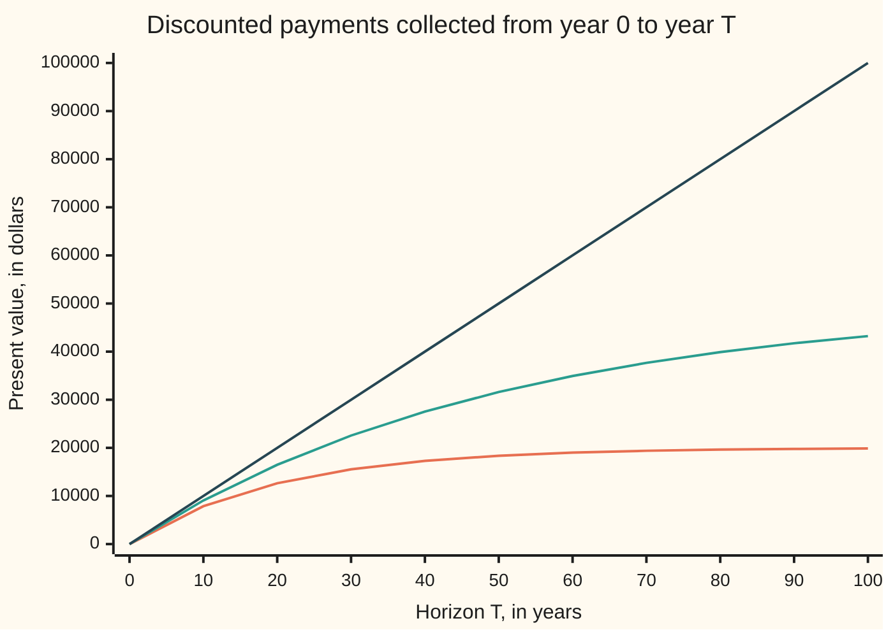

# The Laplace transform: multiply by a decaying exponential and integrate, and calculus turns into algebra

Differential equations and dynamics → Laplace Transforms for Initial-Value Problems → Discounting a whole signal → The Laplace transform

---

## General Overview

A fund pays 1,000 dollars a year forever, as a steady trickle rather than yearly lumps. At a discount rate of 5% a year, compounded continuously, a dollar due in t years is worth e^(−0.05t) dollars now ([discounting-and-present-value](../../01-Foundations/04-Compound%20Growth%20and%20Discounting/06-discounting-and-present-value.md)).

Weigh each instant's payment by that factor and add them up. The stream is worth 1000/0.05 = 20,000 dollars today. Let the payments grow at 3% a year instead, 1,000e^(0.03t) dollars per year, and the same sum gives 50,000 dollars, as long as the discount rate beats the growth rate. At a discount rate of 3% or less the sum never settles.

That weighing is the **Laplace transform**. Leave the discount rate as a letter, s, and the answer becomes a function of s: 1000/s for the level stream, 1000/(s − 0.03) for the growing one. It applies to any signal that starts at time zero and grows no faster than some exponential. For equations it does one thing: a rate of change goes in, multiplication by s comes out.

**The Laplace transform discounts a whole signal back to time zero at rate s and adds it up, turning each signal into a function of s; it exists when s beats the signal's exponential growth, and it turns a rate of change into multiplication by s, less the starting value.**

**What kind of fact this is:** a definition; the table of five transforms, linearity and the existence condition are theorems proved on this card in Why it works.

### The picture: present value collected up to each horizon



Orange: the level stream at s = 0.05, levelling off toward 20,000. Teal: the growing stream at s = 0.05, climbing toward 50,000. Dark blue: the growing stream at s = 0.03, a straight line with no ceiling, so no transform.

---

## The formula

Notation first, in words. A signal f is a function of time t from t = 0 on. A curly L, $\mathcal{L}$, read "the Laplace transform of", turns it into a function of the discount rate s named by the capital letter: $\mathcal{L}[f] = F$. The card [laplace-transform](../../07-Complex%20analysis/08-Transforms%20in%20Outline/05-laplace-transform.md) allows complex s; solving equations needs only real s.

$$F(s)=\int_0^\infty e^{-st}f(t)\,dt$$

**Read it aloud:** F at s is the whole signal from time zero on, each instant discounted at rate s back to time zero, added up.

An integral to infinity means the limit of the integral up to a horizon T as T grows ([improper-integrals](../../06-Calculus%20and%20analysis/04-Integrals/07-improper-integrals.md)); the chart plots those partial integrals.

The table an initial-value problem needs, valued at s = 0.05, with one cycle a year, b = 2π:

| Signal f(t), t ≥ 0 | Transform F(s) | Exists for | At s = 0.05 |
| --- | --- | --- | --- |
| 1 | 1/s | s > 0 | 20 |
| t | 1/s^2 | s > 0 | 400 |
| e^(at) | 1/(s − a) | s > a | 50, with a = 0.03 |
| cos(bt) | s/(s^2 + b^2) | s > 0 | 0.00126643 |
| sin(bt) | b/(s^2 + b^2) | s > 0 | 0.15914487 |

Linearity, the rule that lets the table be used in pieces:

$$\mathcal{L}[c f + k g] = c F + k G$$

**Read it aloud:** the transform of a weighted sum of signals is the same weighted sum of their transforms.

| Symbol | Plain meaning | In our example | Push it up and the answer… |
| --- | --- | --- | --- |
| $t$ | time since the start, in years | 0 on | — |
| $s$ | the discount rate, per year | 0.05 | every entry but the cosine's shrinks |
| $f$, $g$; $F$, $G$ | signals; their transforms | 1000; 1000/s | — |
| $\mathcal{L}$ | "the Laplace transform of" | turns 1 into 1/s | — |
| $a$, $M$ | growth rate, per year; the signal stays under M e^(at) | 0.03; 1000 | the smallest usable s rises |
| $b$ | a wave's turning rate, radians per year | 2π | the wave's transform shrinks |
| $c$, $k$ | constant weights in a sum | 1000, 400 | the transform scales |
| $T$ | horizon where a partial integral stops, in years | 10 to 100 | the partial integral nears F, if F exists |

### When it holds

- **The signal grows no faster than an exponential.** If |f(t)| stays below M e^(at) from some time on, F(s) exists for every s > a. The signal e^(t^2) outgrows every exponential and has no transform at any s.
- **s beats the growth.** For 1,000e^(0.03t) at s = 0.03 the partial integrals rise by 1,000 dollars every year and never settle.
- **Finite area near t = 0.** Jumps are fine, and so is 1/√t; 1/t has no finite integral from 0.

---

## Why it works

### Step 0: the discount factor fades, and its derivative is itself times −s

For s > 0 the factor e^(−st) shrinks toward zero. Its derivative is −s e^(−st): the factor itself, times −s. That builds the table and turns rates into multiplication.

### Step 1: the level stream, 1 → 1/s

An antiderivative of e^(−st) is −e^(−st)/s. At t = 0 it is −1/s; as t grows it goes to 0 when s > 0. The integral is 0 − (−1/s) = 1/s. At s = 0.05 that is 20.

### Step 2: growth only shifts s, e^(at) → 1/(s − a)

Multiply: e^(at) e^(−st) = e^(−(s − a)t). That is Step 1 with s − a in place of s, so the answer is 1/(s − a), valid when s − a > 0: 50 at a = 0.03, s = 0.05. At s = 0.03 the integrand is the constant 1, whose integral up to T is T, with no limit.

### Step 3: the ramp, t → 1/s^2

Integrate t e^(−st) by parts: differentiate t, integrate e^(−st). The boundary term t e^(−st)/s is 0 at both ends when s > 0. What is left is 1/s times Step 1's integral: 1/s^2, which is 400 at s = 0.05.

### Step 4: waves, by the complex exponential

Euler's formula writes cos(bt) + i sin(bt) = e^(ibt), where i is the square root of −1. Step 2 works unchanged for a = ib, since e^(ibt) has size 1 and so the integral converges for s > 0:

$$\int_0^\infty e^{ibt}e^{-st}\,dt=\frac{1}{s-ib}=\frac{s+ib}{s^2+b^2}$$

The real part is the cosine's transform, s/(s^2 + b^2); the imaginary part is the sine's, b/(s^2 + b^2). At s = 0.05 and b = 2π the cosine gives 0.00126643, since each cycle's ups and downs nearly cancel; the sine gives 0.15914487, since its positive first half-year is discounted least.

### Step 5: linearity

Integrals and limits both respect weighted sums. So payments swinging with the seasons, 1,000 + 400 cos(2πt) dollars a year, are worth 1,000 × 20 + 400 × 0.00126643 = 20000.5066 dollars, with no new integral.

### Step 6: why a rate becomes multiplication by s

Integrate the transform of a rate f′ by parts, moving the derivative onto the discount factor. By Step 0 a factor s comes out, and the boundary term at t = 0 leaves the starting value:

$$\mathcal{L}[f'](s)=sF(s)-f(0)$$

Check it on the growing stream: f = e^(0.03t) rises at f′ = 0.03e^(0.03t), whose transform is 0.03 × 50 = 1.5. The rule gives 0.05 × 50 − 1 = 1.5. The rule turns a differential equation into algebra; the full statement and the second derivative are [transforms-of-derivatives](02-transforms-of-derivatives.md).

### Step 7: when the transform exists

If |f(t)| ≤ M e^(at), then |e^(−st) f(t)| ≤ M e^(−(s − a)t), whose integral is finite, M/(s − a), when s > a. For e^(t^2), the exponent t^2 − st is positive and rising once t passes s, whatever s is.

<details>
<summary>Detailed proof: exponential growth bound gives a transform for every s &gt; a</summary>

Suppose f is integrable on every finite interval and |f(t)| ≤ M e^(at) for all t ≥ t0. Write I(T) for the integral of e^(−st) f(t) from 0 to T. For t0 ≤ T1 < T2, |I(T2) − I(T1)| is at most the integral of M e^(−(s − a)t) from T1 to T2, below M e^(−(s − a)T1)/(s − a). Given ε > 0, choose T1 to make that bound less than ε; then all later values of I lie within ε of each other, so I(T) has a limit as T grows (the Cauchy criterion). That limit is F(s). For e^(t^2): at t ≥ s + 1 the integrand is at least e^(t), whose integral grows without bound.

</details>

Complex s and its half plane of convergence: [strips-of-convergence-and-shifting-the-line](../../07-Complex%20analysis/08-Transforms%20in%20Outline/06-strips-of-convergence-and-shifting-the-line.md).

---

## Worked numbers, by hand

| Step | Arithmetic | Value |
| --- | --- | --- |
| level stream, table row 1 | 1000 × 1/0.05 | 20,000 dollars |
| growing stream, table row 3 | 1000 × 1/(0.05 − 0.03) | 50,000 dollars |
| seasonal swing, table row 4 | 0.05/(0.05^2 + (2π)^2) | 0.00126643 |
| its dollars | 400 × 0.00126643 | 0.5066 dollars |
| linearity | 20,000 + 0.5066 | **20000.5066 dollars** |
| rate rule on e^(0.03t) | 0.05 × 50 − 1 | 1.5, equal to 0.03 × 50 |

A seasonal swing of 400 dollars either side adds about 51 cents to a 20,000-dollar fund: each low season nearly cancels the high season before it.

### What breaks if you drop a piece

| Mistake | Comes out at | What went wrong |
| --- | --- | --- |
| Growing stream at s = 0.03 | 100,000 by year 100, 200,000 by year 200 | s must exceed a |
| Sign slip: 1/(s + a) for e^(at) | 12,500 dollars, not 50,000 | treats growth as decay |
| Sine's transform used for the cosine | 63.6579 dollars, not 0.5066 | b on top belongs to the sine |
| Transform e^(t^2) at s = 0.05 | 15.169 up to T = 2, 9.4742e+05 up to T = 4, 2.7118e+14 up to T = 6 | outgrows every exponential |

---

## Code, from first principles, and it actually runs

Only `exp`, `sin`, `cos` and `pi` are imported. Road one reads each transform off the table. Road two computes the defining integral with Simpson's rule (a weighted sum of the integrand at evenly spaced points), stopped where the discount has faded to e^(−40). The code also checks linearity, the rate rule, every chart point and every what-breaks number.

### Python

```python
# The Laplace transform -- the check behind the card.  Only math's exp, sin,
# cos and pi are imported.  Road one: the table, F(s) read off a formula.
# Road two: the defining integral of e^(-st) f(t), summed by Simpson's rule
# written out here and cut off where the weight has faded to e^(-40).
from math import exp, sin, cos, pi

S, B = 0.05, 2 * pi            # discount rate per year; one seasonal cycle a year

def simpson(g, T, n=200000):   # integral of g from 0 to T, n even
    h = T / n
    total = g(0) + g(T)
    for k in range(1, n):
        total += (4 if k % 2 else 2) * g(k * h)
    return total * h / 3

def laplace(f, s, a=0.0):      # road two, stopped where e^(-(s - a)T) = e^(-40)
    return simpson(lambda t: f(t) * exp(-s * t), 40 / (s - a))

def pv_to(f, s, T):            # present value of the stream f up to year T
    return simpson(lambda t: f(t) * exp(-s * t), T, 2000) if T else 0.0

rows = [("1", lambda t: 1.0, 1 / S, 0.0),
        ("t", lambda t: t, 1 / S**2, 0.0),
        ("e^(0.03t)", lambda t: exp(0.03 * t), 1 / (S - 0.03), 0.03),
        ("cos(2 pi t)", lambda t: cos(B * t), S / (S**2 + B**2), 0.0),
        ("sin(2 pi t)", lambda t: sin(B * t), B / (S**2 + B**2), 0.0)]
print(f"s = {S} per year: table F(s) against the integral, summed")
worst = 0.0
for name, f, table, a in rows:
    num = laplace(f, S, a)
    worst = max(worst, abs(num - table) / table)
    print(f"{name:12s} table {table:.8f}   integral {num:.8f}")
level, growing = 1000 * rows[0][2], 1000 * rows[2][2]
print(f"level 1000/s = {level:.2f} dollars; growing 1000 e^(0.03t): {growing:.2f} dollars")
mix_t = 1000 / S + 400 * rows[3][2]
mix_n = laplace(lambda t: 1000 + 400 * cos(B * t), S)
print(f"linearity, 1000 + 400 cos(2 pi t): table {mix_t:.4f}   integral {mix_n:.4f}")
d_exp = laplace(lambda t: 0.03 * exp(0.03 * t), S, 0.03)
d_cos = laplace(lambda t: -B * sin(B * t), S)
print(f"rate rule, e^(0.03t): L[f'] = {d_exp:.8f}   s F - f(0) = {S * rows[2][2] - 1:.8f}")
print(f"rate rule, cos(2 pi t): L[f'] = {d_cos:.8f}   s F - f(0) = {S * rows[3][2] - 1:.8f}")
grow = lambda t: 1000 * exp(0.03 * t)
for label, f, s in (("level at 5%", lambda t: 1000.0, S), ("growing at 5%", grow, S),
                    ("growing at 3%", grow, 0.03)):
    print(f"chart, {label}:", " ".join(f"{pv_to(f, s, T):.0f}" for T in range(0, 101, 10)))
stall = [pv_to(grow, 0.03, T) for T in (100, 200)]
print(f"mistake 1, growing stream at s = 0.03: {stall[0]:.0f} by year 100, {stall[1]:.0f} by year 200")
print(f"mistake 2, sign slip 1000/(s + 0.03) = {1000 / (S + 0.03):.2f}, not {growing:.2f}")
print(f"mistake 3, sine for cosine: 400 x {rows[4][2]:.6f} = {400 * rows[4][2]:.4f}, not {400 * rows[3][2]:.4f}")
sq = [simpson(lambda t: exp(t * t - S * t), T) for T in (2, 4, 6)]
print("mistake 4, e^(t^2) at s = 0.05, integral to T = 2, 4, 6:", "  ".join(f"{v:.4e}" for v in sq))
assert worst < 1e-7                                    # table = integral, five signals
assert abs(mix_n - mix_t) < 1e-6                        # linearity: the sum transforms as the sum
assert max(abs(d_exp - (S * rows[2][2] - 1)), abs(d_cos - (S * rows[3][2] - 1))) < 1e-7
assert stall[1] - stall[0] > 99000                      # no limit when s does not beat the growth
print("ALL CHECKS PASS")
```

**Ran 2026-09-28 on macOS, Python 3.14.6, standard library only. All checks passed. Output, pasted from the run:**

```
s = 0.05 per year: table F(s) against the integral, summed
1            table 20.00000000   integral 20.00000000
t            table 400.00000000   integral 400.00000000
e^(0.03t)    table 50.00000000   integral 50.00000000
cos(2 pi t)  table 0.00126643   integral 0.00126643
sin(2 pi t)  table 0.15914487   integral 0.15914487
level 1000/s = 20000.00 dollars; growing 1000 e^(0.03t): 50000.00 dollars
linearity, 1000 + 400 cos(2 pi t): table 20000.5066   integral 20000.5066
rate rule, e^(0.03t): L[f'] = 1.50000000   s F - f(0) = 1.50000000
rate rule, cos(2 pi t): L[f'] = -0.99993668   s F - f(0) = -0.99993668
chart, level at 5%: 0 7869 12642 15537 17293 18358 19004 19396 19634 19778 19865
chart, growing at 5%: 0 9063 16484 22559 27534 31606 34940 37670 39905 41735 43233
chart, growing at 3%: 0 10000 20000 30000 40000 50000 60000 70000 80000 90000 100000
mistake 1, growing stream at s = 0.03: 100000 by year 100, 200000 by year 200
mistake 2, sign slip 1000/(s + 0.03) = 12500.00, not 50000.00
mistake 3, sine for cosine: 400 x 0.159145 = 63.6579, not 0.5066
mistake 4, e^(t^2) at s = 0.05, integral to T = 2, 4, 6: 1.5169e+01  9.4742e+05  2.7118e+14
ALL CHECKS PASS
```

### Rust

Same rows, same labels, built with `rustc --edition 2021 -O`; the outputs agree line for line.

```rust
// The Laplace transform -- the same check as the Python, in Rust.  No crates.
// Road one: the table, F(s) read off a formula.  Road two: the defining
// integral of e^(-st) f(t), summed by Simpson's rule written out here and
// cut off where the weight has faded to e^(-40).
use std::f64::consts::PI;
const S: f64 = 0.05; // discount rate per year
const B: f64 = 2.0 * PI; // one seasonal cycle a year

fn simpson(g: &dyn Fn(f64) -> f64, t_end: f64, n: usize) -> f64 {
    let h = t_end / n as f64;
    let mut total = g(0.0) + g(t_end);
    for k in 1..n {
        total += if k % 2 == 1 { 4.0 } else { 2.0 } * g(k as f64 * h);
    }
    total * h / 3.0
}
fn laplace(f: &dyn Fn(f64) -> f64, s: f64, a: f64) -> f64 {
    simpson(&|t: f64| f(t) * (-s * t).exp(), 40.0 / (s - a), 200000)
}
fn pv_to(f: &dyn Fn(f64) -> f64, s: f64, t_end: f64) -> f64 {
    if t_end == 0.0 { 0.0 } else { simpson(&|t: f64| f(t) * (-s * t).exp(), t_end, 2000) }
}
fn sci(v: f64) -> String {
    let e = v.abs().log10().floor() as i32;
    format!("{:.4}e+{:02}", v / 10f64.powi(e), e)
}

fn main() {
    let rows: [(&str, fn(f64) -> f64, f64, f64); 5] = [
        ("1", |_t| 1.0, 1.0 / S, 0.0),
        ("t", |t| t, 1.0 / (S * S), 0.0),
        ("e^(0.03t)", |t| (0.03 * t).exp(), 1.0 / (S - 0.03), 0.03),
        ("cos(2 pi t)", |t| (B * t).cos(), S / (S * S + B * B), 0.0),
        ("sin(2 pi t)", |t| (B * t).sin(), B / (S * S + B * B), 0.0),
    ];
    println!("s = {} per year: table F(s) against the integral, summed", S);
    let mut worst: f64 = 0.0;
    for (name, f, table, a) in rows.iter() {
        let num = laplace(f, S, *a);
        worst = worst.max((num - table).abs() / table);
        println!("{:12} table {:.8}   integral {:.8}", name, table, num);
    }
    let (level, growing) = (1000.0 * rows[0].2, 1000.0 * rows[2].2);
    println!("level 1000/s = {:.2} dollars; growing 1000 e^(0.03t): {:.2} dollars", level, growing);
    let mix_t = 1000.0 / S + 400.0 * rows[3].2;
    let mix_n = laplace(&|t: f64| 1000.0 + 400.0 * (B * t).cos(), S, 0.0);
    println!("linearity, 1000 + 400 cos(2 pi t): table {:.4}   integral {:.4}", mix_t, mix_n);
    let d_exp = laplace(&|t: f64| 0.03 * (0.03 * t).exp(), S, 0.03);
    let d_cos = laplace(&|t: f64| -B * (B * t).sin(), S, 0.0);
    println!("rate rule, e^(0.03t): L[f'] = {:.8}   s F - f(0) = {:.8}", d_exp, S * rows[2].2 - 1.0);
    println!("rate rule, cos(2 pi t): L[f'] = {:.8}   s F - f(0) = {:.8}", d_cos, S * rows[3].2 - 1.0);
    let grow = |t: f64| 1000.0 * (0.03 * t).exp();
    let level_f = |_t: f64| 1000.0;
    let series: [(&str, &dyn Fn(f64) -> f64, f64); 3] =
        [("level at 5%", &level_f, S), ("growing at 5%", &grow, S), ("growing at 3%", &grow, 0.03)];
    for (label, f, s) in series.iter() {
        let pts: Vec<String> = (0..11).map(|k| format!("{:.0}", pv_to(*f, *s, 10.0 * k as f64))).collect();
        println!("chart, {}: {}", label, pts.join(" "));
    }
    let stall = [pv_to(&grow, 0.03, 100.0), pv_to(&grow, 0.03, 200.0)];
    println!("mistake 1, growing stream at s = 0.03: {:.0} by year 100, {:.0} by year 200", stall[0], stall[1]);
    println!("mistake 2, sign slip 1000/(s + 0.03) = {:.2}, not {:.2}", 1000.0 / (S + 0.03), growing);
    println!("mistake 3, sine for cosine: 400 x {:.6} = {:.4}, not {:.4}", rows[4].2, 400.0 * rows[4].2, 400.0 * rows[3].2);
    let sq: Vec<String> = [2.0, 4.0, 6.0].iter()
        .map(|&te| sci(simpson(&|t: f64| (t * t - S * t).exp(), te, 200000))).collect();
    println!("mistake 4, e^(t^2) at s = 0.05, integral to T = 2, 4, 6: {}", sq.join("  "));
    assert!(worst < 1e-7); // table = integral, five signals
    assert!((mix_n - mix_t).abs() < 1e-6); // linearity: the sum transforms as the sum
    assert!((d_exp - (S * rows[2].2 - 1.0)).abs().max((d_cos - (S * rows[3].2 - 1.0)).abs()) < 1e-7);
    assert!(stall[1] - stall[0] > 99000.0); // no limit when s does not beat the growth
    println!("ALL CHECKS PASS");
}
```

**Ran 2026-09-28 on macOS, rustc 1.98.1, no crates. All checks passed. Output, pasted from the run:**

```
s = 0.05 per year: table F(s) against the integral, summed
1            table 20.00000000   integral 20.00000000
t            table 400.00000000   integral 400.00000000
e^(0.03t)    table 50.00000000   integral 50.00000000
cos(2 pi t)  table 0.00126643   integral 0.00126643
sin(2 pi t)  table 0.15914487   integral 0.15914487
level 1000/s = 20000.00 dollars; growing 1000 e^(0.03t): 50000.00 dollars
linearity, 1000 + 400 cos(2 pi t): table 20000.5066   integral 20000.5066
rate rule, e^(0.03t): L[f'] = 1.50000000   s F - f(0) = 1.50000000
rate rule, cos(2 pi t): L[f'] = -0.99993668   s F - f(0) = -0.99993668
chart, level at 5%: 0 7869 12642 15537 17293 18358 19004 19396 19634 19778 19865
chart, growing at 5%: 0 9063 16484 22559 27534 31606 34940 37670 39905 41735 43233
chart, growing at 3%: 0 10000 20000 30000 40000 50000 60000 70000 80000 90000 100000
mistake 1, growing stream at s = 0.03: 100000 by year 100, 200000 by year 200
mistake 2, sign slip 1000/(s + 0.03) = 12500.00, not 50000.00
mistake 3, sine for cosine: 400 x 0.159145 = 63.6579, not 0.5066
mistake 4, e^(t^2) at s = 0.05, integral to T = 2, 4, 6: 1.5169e+01  9.4742e+05  2.7118e+14
ALL CHECKS PASS
```

> [!TIP]
> **Try changing**
> Guess first, then run.
> - **Discount at the growth rate.** Set `S = 0.03`. The e^(0.03t) row's horizon, 40/(s − a), divides by zero: the existence condition failing in code.
> - **Stop too early.** Change the 40 in `laplace` to 10. The tail beyond the horizon, about e^(−10) of the whole, is left out, and the first assert fails.
> - **Swap the wave formulas.** Put b/(s^2 + b^2) on the cosine row. The integral still prints 0.00126643, the table prints 0.15914487, and the first assert fails.
> - **Two cycles a year.** Set `B = 4 * pi`. The cosine's transform falls to about a quarter.

---

## The usual mistake

> [!warning]
> **Treating s as time.** F(s) is the whole signal squeezed into one number per discount rate. F(0.05) = 20 does not say the stream pays 20 at any time; it says 1 dollar a year, forever, is worth 20 dollars today at 5%.
>
> - **Ignoring where it exists.** 1/(s − 0.03) at s = 0.02 is negative, a negative value for a positive stream; the integral there has no value at all.
> - **Wrong sign in the exponential.** 1/(s + a) for a growing stream gives 12,500 dollars for a stream worth 50,000.
> - **Forgetting f(0) in the rate rule.** sF(s) alone overshoots the growing stream's 1.5 by its starting value, f(0) = 1.

---

## Where you meet it in real life

- **Finance.** The present value of a continuous cash flow at rate s is its Laplace transform: the table is a table of perpetuity prices.
- **Shock absorbers.** A car's suspension obeys a forced rate law; the transform turns y'' + 2y' + 5y = f(t) into algebra, solved in [solving-an-initial-value-problem-by-transform](04-solving-an-initial-value-problem-by-transform.md).
- **Circuits and control.** A system is described by output transform over input transform, its transfer function ([impulse-response-and-transfer-functions](../../13-Engineering%20mathematics/02-Linear%20Systems%20and%20Transforms/02-impulse-response-and-transfer-functions.md)).
- **Switched and kicked inputs.** A motor switched on at a set time, and a hammer blow: [step-functions-and-delays](05-step-functions-and-delays.md), [impulses-and-the-delta-function](06-impulses-and-the-delta-function.md).

> **Say it back**
> The Laplace transform discounts a signal back to time zero at rate s and adds up every instant. A level stream becomes 1/s, a stream growing at rate a becomes 1/(s − a), and waves follow from a turning exponent. It exists when s beats the signal's exponential growth, and sums transform as sums. Because the discount factor's derivative is itself times −s, a rate transforms to s times the transform, minus the starting value.

---

## What this builds on

- [exponential-growth-decay-and-cooling](../01-Rate%20Equations/04-exponential-growth-decay-and-cooling.md): e^(at) as the solution of y' = ay, the signal behind row 3.
- [improper-integrals](../../06-Calculus%20and%20analysis/04-Integrals/07-improper-integrals.md): what an integral to infinity means, and when it converges.
- [discounting-and-present-value](../../01-Foundations/04-Compound%20Growth%20and%20Discounting/06-discounting-and-present-value.md): the discount factor e^(−st) and present value.
- [laplace-transform](../../07-Complex%20analysis/08-Transforms%20in%20Outline/05-laplace-transform.md): the same transform with complex s.
- [strips-of-convergence-and-shifting-the-line](../../07-Complex%20analysis/08-Transforms%20in%20Outline/06-strips-of-convergence-and-shifting-the-line.md): the region where the integral converges.

## Where this goes next

- [transforms-of-derivatives](02-transforms-of-derivatives.md): the rate rule in full, with second derivatives and the starting values they carry.
- [impulse-response-and-transfer-functions](../../13-Engineering%20mathematics/02-Linear%20Systems%20and%20Transforms/02-impulse-response-and-transfer-functions.md): a whole system summed up as one function of s.

The table runs from signals to transforms; solving an equation needs the road back, which [inverting-by-partial-fractions](03-inverting-by-partial-fractions.md) builds.

---

## Sources

Verified 2026-09-28: every link below resolves to the publisher's page.

- Schiff, Joel L. *The Laplace Transform: Theory and Applications*. Springer, 1999. [DOI](https://doi.org/10.1007/978-0-387-22757-3). Definition, exponential order and the table, with proofs.
- Miller, Haynes, and Arthur Mattuck. *18.03SC Differential Equations*, Unit III: Fourier Series and Laplace Transform. MIT OpenCourseWare, 2011. [Course page](https://ocw.mit.edu/courses/18-03sc-differential-equations-fall-2011/pages/unit-iii-fourier-series-and-laplace-transform/). The table and the rate rule, for solving equations.
- Dawkins, Paul. "The Definition." *Paul's Online Notes: Differential Equations*, Lamar University. [Notes](https://tutorial.math.lamar.edu/Classes/DE/LaplaceDefinition.aspx). Worked transforms and the existence conditions.
