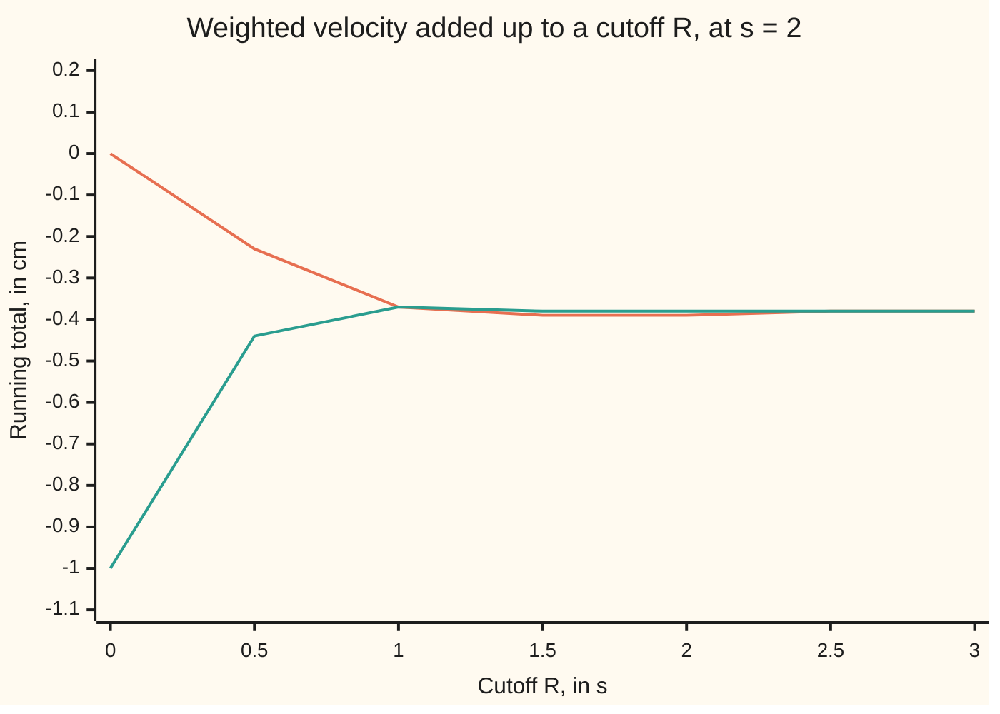

# Transforming a derivative: multiply by s and the initial value walks in on its own

[Syllabus](../../../SYLLABUS.md) → [Differential equations and dynamics](../../../SYLLABUS.md#w08) → [Laplace Transforms for Initial-Value Problems](../../../SYLLABUS.md#w08-s08) → Transforming a derivative

---

## General Overview

A car's body sits 1 cm above its resting height after a bump, momentarily still. The spring pulls it down; the shock absorber drags against the motion. Per unit of mass: acceleration equals minus 5 per s^2 times the height, minus 2 per s times the velocity. In symbols, y'' + 2y' + 5y = 0, with y the height in cm and t the time in seconds; y' is the velocity and y'' the acceleration.

The Laplace transform weighs a signal from time zero on by a fading exponential e^(−st) and adds it up ([The Laplace transform](01-the-laplace-transform.md)). The number s, per second, sets how fast the weight fades; Y names the height's transform. Apply it to every term of the rate law and one rule does the work: the transform of a rate is s times the transform, minus the starting value. The equation about rates becomes (s^2 + 2s + 5)Y = s + 2, with no derivative left in it. The s + 2 on the right is the release from 1 cm at rest, written in automatically.

The characteristic-equation route ([The characteristic equation](../03-Oscillators%20-%20Second-Order%20Linear%20Equations/02-the-characteristic-equation.md)) finds every solution, then fits the starting values. Here they are inside the equation from the first line: they fall out of an integration by parts.

**Transforming a derivative multiplies by s and subtracts the starting value, so each initial condition enters the transformed equation as a known number and never has to be fitted later.**

**What kind of fact this is:** a theorem, proved on this card in Why it works; the full limit argument is in the folded Detailed proof.

### The picture: the leftover end term fading away



Orange: the velocity, weighted by e^(−2t), added up from 0 to R. Teal: 2 times the weighted height added up the same way, minus the starting 1 cm. The gap is the end term at R; it fades, and both settle on −0.384615 cm.

---

## The formula

Reminder from [The Laplace transform](01-the-laplace-transform.md): the curly $\mathcal{L}$ reads "the Laplace transform of", and the capital letter names the result, $Y = \mathcal{L}[y]$.

$$Y(s)=\int_0^\infty e^{-st}\,y(t)\,dt$$

The theorem, for one derivative and for two:

$$\mathcal{L}[y'](s) = sY(s) - y(0)$$

$$\mathcal{L}[y''](s) = s^2Y(s) - s\,y(0) - y'(0)$$

**Read it aloud:** the transform of the velocity is s times the transform of the height, minus the starting height; the transform of the acceleration is s squared times the transform, minus s times the starting height, minus the starting velocity.

| Symbol | Plain meaning | In our example | Push it up and the answer… |
| --- | --- | --- | --- |
| $t$ | time since release, in s | 0 to 30 s in the checks | — |
| $y$, $y'$, $y''$ | height above level (cm), velocity (cm/s), acceleration (cm/s^2) | released at 1 cm, at rest | — |
| $\mathcal{L}$, $Y$ | "transform it"; the height's transform, in cm·s | Y = 0.307692 at s = 2 | — |
| $s$ | how fast the weight e^(−st) fades, per s | 2, and 0 | past s = 0.24, Y shrinks: the weight forgets sooner |
| $y(0)$, $y'(0)$ | starting height and starting velocity | 1 cm and 0 cm/s | the numerator s + 2 changes |
| $R$, $I_R$, $J_R$ | a finite cutoff; the weighted height and weighted velocity added up to it | R = 0.5 s | the end term at R shrinks |
| $M$, $a$ | a growth bound: the size of y stays below M e^(at) | a = −1 for the car | a larger a needs a larger s |
| $f$, $F$ | a signal with a jump; its transform | a step to 1 at t = 1 s | — |

### When it holds

- **The signal has no jump.** A step f from 0 to 1 at t = 1 s has derivative 0 wherever it has one, so that transform is 0; the rule gives sF − f(0) = 0.135335 at s = 2.
- **The signal and its rate grow no faster than an exponential.** If y stays below M e^(at) in size, the rule holds for s with real part above a. The signal e^(t^2) outgrows every exponential and has no transform.
- **The second-derivative rule asks the same of y'.** The velocity must also be continuous and exponentially bounded. A hammer blow breaks this; [Impulses](06-impulses-and-the-delta-function.md) repairs it.

---

## Why it works

### Step 0: the weight's own rate is minus s times itself

Differentiate e^(−st) and it comes back multiplied by −s. Integration by parts moves a derivative from one factor to the other ([Integration by parts](../../06-Calculus%20and%20analysis/04-Integrals/04-integration-by-parts.md)). Moved onto the weight, "differentiate y" becomes "multiply by s". The price is a term at the two ends; the end at t = 0 supplies the starting value.

### Step 1: integrate by parts up to a finite cutoff

Stop at a finite time R. Write $I_R$ for the weighted height added up from 0 to R, $J_R$ for the weighted velocity. By the product rule, e^(−st) y(t) has rate e^(−st) y'(t) − s e^(−st) y(t). Added up from 0 to R, that rate gives the product's value at R minus its value at 0, which is y(0). Rearranged:

$$J_R = e^{-sR}\,y(R) - y(0) + s\,I_R$$

Nothing is dropped yet. For the car at s = 2 and R = 0.5 s the checks find $J_R$ = −0.229925 cm, s $I_R$ − y(0) = −0.444362 cm and the end term 0.214437 cm, which add up.

### Step 2: the end term at R dies away

The weight shrinks like e^(−sR) and the height is bounded by a fading exponential, so the end term dies. As R runs to infinity, $J_R$ becomes the transform of the velocity, $I_R$ becomes Y, and the identity becomes sY − y(0). The chart shows this closing.

<details>
<summary>Detailed proof</summary>

Assume y is continuous on t ≥ 0, y' is continuous there too, and both have size at most $M$ e^(at) for all t, with constants $M$ and $a$. Take s with real part σ greater than a.

The integrals converge. The weighted height has size at most M e^(−(σ − a)t), whose integral from 0 to infinity is M/(σ − a); so $I_R$ tends to Y(s) by comparison ([Improper integrals](../../06-Calculus%20and%20analysis/04-Integrals/07-improper-integrals.md)). The same bound makes $J_R$ converge.

The end term vanishes. Its size is e^(−σR) times the size of y(R), at most M e^(−(σ − a)R), and σ − a > 0 sends that to 0 as R grows.

Pass to the limit in $J_R = e^{-sR}y(R) - y(0) + sI_R$. Every term has a limit, so the limits satisfy the same identity: the transform of y' equals sY(s) − y(0).

For the second derivative, assume the same of y'' as well. The first rule applied to y' in place of y gives the transform of y'' as s times the transform of y', minus y'(0). Substitute the first rule for the transform of y': s(sY − y(0)) − y'(0), which is $s^2Y - s\,y(0) - y'(0)$.

For the car, height, velocity and acceleration each fade inside an envelope proportional to e^(−t) ([Complex roots](../03-Oscillators%20-%20Second-Order%20Linear%20Equations/03-complex-roots-and-damped-oscillation.md)), so a = −1 and s = 0 is allowed.

</details>

### Step 3: iterate for the second derivative

The velocity is itself a signal, so the rule applies to it: the transform of y'' is s times the transform of y', minus y'(0). Substituting sY − y(0) gives s^2 Y − s y(0) − y'(0). Each derivative adds one power of s and one more starting value.

### Step 4: the starting values land on the known side

Transform every term of y'' + 2y' + 5y = 0:

$$\bigl(s^2Y - s\,y(0) - y'(0)\bigr) + 2\bigl(sY - y(0)\bigr) + 5Y = 0$$

Gather the Y terms on the left and the rest on the right:

$$(s^2 + 2s + 5)\,Y = (s + 2)\,y(0) + y'(0)$$

The left side is the characteristic polynomial times Y; the right side holds the starting values alone. With y(0) = 1 cm and y'(0) = 0 it is s + 2. No constants are left to fit.

---

## Worked numbers, by hand

| Step | Arithmetic | Value |
| --- | --- | --- |
| transformed equation | (s^2 + 2s + 5)Y = s + 2 | at s = 2: 13Y = 4 |
| transform of the height | Y = 4/13 | **0.307692 cm·s** |
| transform of the velocity | sY − y(0) = 8/13 − 1 | −0.384615 cm |
| transform of the acceleration | s^2 Y − s y(0) − y'(0) = 16/13 − 2 − 0 | −0.769231 cm/s |
| back into the rate law | −10/13 + 2(−5/13) + 5(4/13) | 0 |
| at s = 0, the weight is 1 | Y = 2/5; sY − y(0) = −1; s^2 Y − s y(0) − y'(0) = 0 | 0.4, −1, 0 |

At s = 0 the numbers speak about the car directly: the velocity added up over all time is the total change in height, −1 cm, so the body ends at level; the acceleration added up is the change in velocity, 0, from rest to rest.

### What breaks if you drop a piece

| Mistake | Comes out at | What went wrong |
| --- | --- | --- |
| Transform of y' taken as sY | sY = 0.615385 cm, not −0.384615; then Y = 0 and the car never moves | the end term at t = 0 was dropped |
| Transform of y'' taken as s^2 Y − y(0) − y'(0) | Y = 0.230769 at s = 2, not 0.307692 | the starting height lost its factor of s |
| The rule used on a step at t = 1 s | sF − f(0) = 0.135335, but the derivative's transform is 0 | a jump adds an end term at t = 1 s |

---

## Code, from first principles, and it actually runs

Two roads sharing no step. Road one never uses the rule: it steps the motion with Runge-Kutta 4 (four slope samples per step, averaged; [Runge-Kutta four](../05-Numerical%20Evolution/04-runge-kutta-four.md)), carrying running totals of e^(−st) times height, velocity and acceleration. Road two is the rule and the algebra. The error at two step sizes falls by about 16 when the step halves: the method's order, 4.

### Python

```python
# Transforming a derivative -- the check behind the card.  Only math.exp is
# imported.  The car body: y'' + 2y' + 5y = 0, released from 1 cm at rest.
# Road one steps the motion with Runge-Kutta 4 and adds up e^(-st) times the
# height, velocity and acceleration as it goes, never using the rule.  Road two
# is the rule: multiply by s, subtract the starting values, solve for Y.
from math import exp
Y0, V0, T_END = 1.0, 0.0, 30.0

def acc(y, v):                                 # the rate law, per unit mass
    return -2.0 * v - 5.0 * y

def road_one(s, h):                            # returns totals every 0.5 s of cutoff
    def f(t, u):
        w = exp(-s * t)
        return [u[1], acc(u[0], u[1]), w * u[0], w * u[1], w * acc(u[0], u[1])]
    u, marks, every = [Y0, V0, 0.0, 0.0, 0.0], [], round(0.5 / h)
    for n in range(round(T_END / h)):
        if n % every == 0: marks.append(list(u))
        t = n * h
        k1 = f(t, u)
        k2 = f(t + h / 2, [a + h / 2 * b for a, b in zip(u, k1)])
        k3 = f(t + h / 2, [a + h / 2 * b for a, b in zip(u, k2)])
        k4 = f(t + h, [a + h * b for a, b in zip(u, k3)])
        u = [a + h / 6 * (p + 2 * q + 2 * r + w) for a, p, q, r, w in zip(u, k1, k2, k3, k4)]
    return u[2:], marks

def road_two(s, y0=Y0, v0=V0):                 # (s^2 + 2s + 5) Y = s y(0) + y'(0) + 2 y(0)
    return (s * y0 + v0 + 2 * y0) / (s * s + 2 * s + 5)

errs = []
for s in (2.0, 0.0):
    Y = road_two(s)
    print(f"s = {s:g}: rule and algebra give Y = {Y:.6f}, sY - y(0) = {s*Y - Y0:.6f}, "
          f"s^2 Y - s y(0) - y'(0) = {s*s*Y - s*Y0 - V0:.6f}")
    for h in (0.05, 0.025):
        (I0, I1, I2), marks = road_one(s, h)
        errs.append(abs(I0 - Y))
        print(f"  RK4 h = {h}: L[y] = {I0:.6f}, L[y'] = {I1:.6f}, L[y''] = {I2:.6f}, error in Y {errs[-1]:.1e}")
    assert abs(I0 - Y) < 1e-6                                  # stepped motion = algebra
    assert abs(I1 - (s * I0 - Y0)) < 1e-6 and abs(I2 - (s * s * I0 - s * Y0 - V0)) < 1e-6
    print(f"  transformed equation L[y''] + 2 L[y'] + 5 L[y] = {I2 + 2 * I1 + 5 * I0:.1e}")
print(f"error ratio at s = 2, h halved: {errs[0] / errs[1]:.1f}, near 2^4 = 16 for order 4")
assert 12 < errs[0] / errs[1] < 20                             # RK4's order, seen in the run
_, marks = road_one(2.0, 0.025)
m = marks[1]                                                   # the totals at cutoff R = 0.5 s
print(f"cutoff R = 0.5: J = {m[3]:.6f}, sI - y(0) = {2 * m[2] - Y0:.6f}, "
      f"end term e^(-sR) y(R) = {exp(-1.0) * m[0]:.6f}")
print("figure, R      " + " ".join(f"{0.5 * k:5.2f}" for k in range(7)))
print("figure, J_R    " + " ".join(f"{mk[3]:5.2f}" for mk in marks[:7]))
print("figure, sI_R-1 " + " ".join(f"{2 * mk[2] - Y0:5.2f}" for mk in marks[:7]))
print(f"mistake 1, drop y(0): sY = {2 * road_two(2.0):.6f}, and (s^2+2s+5)Y = 0 forces Y = 0")
print(f"mistake 2, drop the s on y(0): Y = {(Y0 + V0 + 2 * Y0) / 13.0:.6f} instead of {road_two(2.0):.6f}")
F = sum(0.001 * exp(-2.0 * (1.0 + (k + 0.5) * 0.001)) for k in range(29000))
print(f"mistake 3, step at t = 1: L[f'] = 0 but sF - f(0) = {2.0 * F:.6f}")
assert abs(2.0 * F - exp(-2.0)) < 1e-6                         # midpoint sum vs e^(-2)
print("ALL CHECKS PASS")
```

**Ran 2026-09-28 on macOS, Python 3.14.6, standard library only. All checks passed. Output, pasted from the run:**

```
s = 2: rule and algebra give Y = 0.307692, sY - y(0) = -0.384615, s^2 Y - s y(0) - y'(0) = -0.769231
  RK4 h = 0.05: L[y] = 0.307692, L[y'] = -0.384615, L[y''] = -0.769231, error in Y 1.8e-07
  RK4 h = 0.025: L[y] = 0.307692, L[y'] = -0.384615, L[y''] = -0.769231, error in Y 1.1e-08
  transformed equation L[y''] + 2 L[y'] + 5 L[y] = 2.0e-15
s = 0: rule and algebra give Y = 0.400000, sY - y(0) = -1.000000, s^2 Y - s y(0) - y'(0) = 0.000000
  RK4 h = 0.05: L[y] = 0.400000, L[y'] = -1.000000, L[y''] = 0.000000, error in Y 2.8e-14
  RK4 h = 0.025: L[y] = 0.400000, L[y'] = -1.000000, L[y''] = 0.000000, error in Y 2.8e-14
  transformed equation L[y''] + 2 L[y'] + 5 L[y] = 3.1e-15
error ratio at s = 2, h halved: 16.3, near 2^4 = 16 for order 4
cutoff R = 0.5: J = -0.229925, sI - y(0) = -0.444362, end term e^(-sR) y(R) = 0.214437
figure, R       0.00  0.50  1.00  1.50  2.00  2.50  3.00
figure, J_R     0.00 -0.23 -0.37 -0.39 -0.39 -0.38 -0.38
figure, sI_R-1 -1.00 -0.44 -0.37 -0.38 -0.38 -0.38 -0.38
mistake 1, drop y(0): sY = 0.615385, and (s^2+2s+5)Y = 0 forces Y = 0
mistake 2, drop the s on y(0): Y = 0.230769 instead of 0.307692
mistake 3, step at t = 1: L[f'] = 0 but sF - f(0) = 0.135335
ALL CHECKS PASS
```

### Rust

Same numbers, same labels, built with `rustc --edition 2021 -O`.

```rust
// Transforming a derivative -- the same check as the Python, in Rust.  No
// crates.  The car body: y'' + 2y' + 5y = 0, released from 1 cm at rest.
// Road one steps the motion with Runge-Kutta 4 and adds up e^(-st) times the
// height, velocity and acceleration as it goes, never using the rule.  Road two
// is the rule: multiply by s, subtract the starting values, solve for Y.
const Y0: f64 = 1.0; const V0: f64 = 0.0; const T_END: f64 = 30.0;

fn acc(y: f64, v: f64) -> f64 { -2.0 * v - 5.0 * y }       // the rate law, per unit mass

fn f(s: f64, t: f64, u: &[f64; 5]) -> [f64; 5] {
    let w = (-s * t).exp();
    [u[1], acc(u[0], u[1]), w * u[0], w * u[1], w * acc(u[0], u[1])]
}

fn step(u: &[f64; 5], k: &[f64; 5], c: f64) -> [f64; 5] {
    let mut out = *u;
    for i in 0..5 { out[i] += c * k[i] }
    out
}

fn road_one(s: f64, h: f64) -> ([f64; 5], Vec<[f64; 5]>) { // totals every 0.5 s of cutoff
    let (mut u, mut marks) = ([Y0, V0, 0.0, 0.0, 0.0], Vec::new());
    let every = (0.5 / h).round() as usize;
    for n in 0..(T_END / h).round() as usize {
        if n % every == 0 { marks.push(u) }
        let t = n as f64 * h;
        let k1 = f(s, t, &u);
        let k2 = f(s, t + h / 2.0, &step(&u, &k1, h / 2.0));
        let k3 = f(s, t + h / 2.0, &step(&u, &k2, h / 2.0));
        let k4 = f(s, t + h, &step(&u, &k3, h));
        for i in 0..5 { u[i] += h / 6.0 * (k1[i] + 2.0 * k2[i] + 2.0 * k3[i] + k4[i]) }
    }
    (u, marks)
}

fn road_two(s: f64) -> f64 { (s * Y0 + V0 + 2.0 * Y0) / (s * s + 2.0 * s + 5.0) }

fn sci(x: f64) -> String {                                   // 1.8e-07, as Python prints it
    let t = format!("{:.1e}", x);
    let (m, e) = t.split_once('e').unwrap();
    let e: i32 = e.parse().unwrap();
    format!("{}e{}{:02}", m, if e < 0 { '-' } else { '+' }, e.abs())
}

fn main() {
    let mut errs: Vec<f64> = Vec::new();
    for s in [2.0_f64, 0.0] {
        let y = road_two(s);
        println!("s = {}: rule and algebra give Y = {:.6}, sY - y(0) = {:.6}, s^2 Y - s y(0) - y'(0) = {:.6}",
                 s, y, s * y - Y0, s * s * y - s * Y0 - V0);
        let mut last = [0.0; 5];
        for h in [0.05_f64, 0.025] {
            last = road_one(s, h).0;
            errs.push((last[2] - y).abs());
            println!("  RK4 h = {}: L[y] = {:.6}, L[y'] = {:.6}, L[y''] = {:.6}, error in Y {}",
                     h, last[2], last[3], last[4], sci(errs[errs.len() - 1]));
        }
        let (i0, i1, i2) = (last[2], last[3], last[4]);
        assert!((i0 - y).abs() < 1e-6);                              // stepped motion = algebra
        assert!((i1 - (s * i0 - Y0)).abs() < 1e-6 && (i2 - (s * s * i0 - s * Y0 - V0)).abs() < 1e-6);
        println!("  transformed equation L[y''] + 2 L[y'] + 5 L[y] = {}", sci(i2 + 2.0 * i1 + 5.0 * i0));
    }
    let r1 = errs[0] / errs[1];
    println!("error ratio at s = 2, h halved: {:.1}, near 2^4 = 16 for order 4", r1);
    assert!(12.0 < r1 && r1 < 20.0);                                 // RK4's order, seen in the run
    let marks = road_one(2.0, 0.025).1;
    let m = marks[1];                                                // the totals at cutoff R = 0.5 s
    println!("cutoff R = 0.5: J = {:.6}, sI - y(0) = {:.6}, end term e^(-sR) y(R) = {:.6}",
             m[3], 2.0 * m[2] - Y0, (-1.0_f64).exp() * m[0]);
    let row = |v: Vec<f64>| v.iter().map(|x| format!("{:5.2}", x)).collect::<Vec<_>>().join(" ");
    println!("figure, R      {}", row((0..7).map(|k| 0.5 * k as f64).collect()));
    println!("figure, J_R    {}", row(marks[..7].iter().map(|mk| mk[3]).collect()));
    println!("figure, sI_R-1 {}", row(marks[..7].iter().map(|mk| 2.0 * mk[2] - Y0).collect()));
    println!("mistake 1, drop y(0): sY = {:.6}, and (s^2+2s+5)Y = 0 forces Y = 0", 2.0 * road_two(2.0));
    println!("mistake 2, drop the s on y(0): Y = {:.6} instead of {:.6}", (Y0 + V0 + 2.0 * Y0) / 13.0, road_two(2.0));
    let big_f: f64 = (0..29000).map(|k| 0.001 * (-2.0 * (1.0 + (k as f64 + 0.5) * 0.001)).exp()).sum();
    println!("mistake 3, step at t = 1: L[f'] = 0 but sF - f(0) = {:.6}", 2.0 * big_f);
    assert!((2.0 * big_f - (-2.0_f64).exp()).abs() < 1e-6);          // midpoint sum vs e^(-2)
    println!("ALL CHECKS PASS");
}
```

**Ran 2026-09-28 on macOS, rustc 1.98.1, no crates. All checks passed. Output, pasted from the run:**

```
s = 2: rule and algebra give Y = 0.307692, sY - y(0) = -0.384615, s^2 Y - s y(0) - y'(0) = -0.769231
  RK4 h = 0.05: L[y] = 0.307692, L[y'] = -0.384615, L[y''] = -0.769231, error in Y 1.8e-07
  RK4 h = 0.025: L[y] = 0.307692, L[y'] = -0.384615, L[y''] = -0.769231, error in Y 1.1e-08
  transformed equation L[y''] + 2 L[y'] + 5 L[y] = 2.0e-15
s = 0: rule and algebra give Y = 0.400000, sY - y(0) = -1.000000, s^2 Y - s y(0) - y'(0) = 0.000000
  RK4 h = 0.05: L[y] = 0.400000, L[y'] = -1.000000, L[y''] = 0.000000, error in Y 2.8e-14
  RK4 h = 0.025: L[y] = 0.400000, L[y'] = -1.000000, L[y''] = 0.000000, error in Y 2.8e-14
  transformed equation L[y''] + 2 L[y'] + 5 L[y] = 3.1e-15
error ratio at s = 2, h halved: 16.3, near 2^4 = 16 for order 4
cutoff R = 0.5: J = -0.229925, sI - y(0) = -0.444362, end term e^(-sR) y(R) = 0.214437
figure, R       0.00  0.50  1.00  1.50  2.00  2.50  3.00
figure, J_R     0.00 -0.23 -0.37 -0.39 -0.39 -0.38 -0.38
figure, sI_R-1 -1.00 -0.44 -0.37 -0.38 -0.38 -0.38 -0.38
mistake 1, drop y(0): sY = 0.615385, and (s^2+2s+5)Y = 0 forces Y = 0
mistake 2, drop the s on y(0): Y = 0.230769 instead of 0.307692
mistake 3, step at t = 1: L[f'] = 0 but sF - f(0) = 0.135335
ALL CHECKS PASS
```

The outputs match line for line. At s = 0 the error does not shrink: there the totals are fixed combinations of height and velocity, which Runge-Kutta 4 carries exactly. What remains, about 2.7e-14, is the part of the total after the 30 s cutoff.

> [!TIP]
> **Try changing**
> Guess first, then run it.
> - **Start the car moving.** Set `V0 = 3.0`, a push of 3 cm/s. The numerator becomes s + 5 and both roads still agree.
> - **Forget the starting height.** In `road_two`, change `s * y0` to `y0`. The first assert stops the program: the stepped motion still gives 0.307692, the broken rule 0.230769.
> - **Push s below −1.** Set the cases to `(2.0, -1.5)`. The weight grows faster than the height fades, the totals never settle, and the first assert stops it.

---

## The usual mistake

> [!warning]
> **Treating the starting value as a correction to add later.** The −y(0) is the end term of the integration by parts at t = 0, and the only place the release from 1 cm enters. Drop it and Y = 0: a car released from 1 cm that never moves.
>
> - **Wrong factor on y(0) in the second-derivative rule.** The starting height carries one power of s, the starting velocity none. Writing s^2 Y − y(0) − y'(0) gives Y = 0.230769 at s = 2 instead of 0.307692.
> - **Using the rule across a jump.** A step at t = 1 s gives sF − f(0) = 0.135335, yet its derivative transforms to 0: the jump is an end term the rule never sees.

---

## Where you meet it in real life

- **Circuits.** A capacitor already charged when a switch closes enters the transformed equation as a known source.
- **Control engineering.** With every starting value zero, the transformed equation is Y = F(s) divided by the characteristic polynomial, a ratio called the transfer function ([Transfer functions](../../13-Engineering%20mathematics/02-Linear%20Systems%20and%20Transforms/02-impulse-response-and-transfer-functions.md)).
- **Forced problems and switches.** [The round trip](04-solving-an-initial-value-problem-by-transform.md) runs the round trip with forcing; [Step functions](05-step-functions-and-delays.md) handles jumps.

> **Say it back**
> Integrating a weighted derivative by parts moves the derivative onto the weight, where it becomes a factor of s. The end term at t = 0 is minus the starting value; the one at infinity dies. Doing it twice gives s^2 Y − s y(0) − y'(0). So the car's equation becomes (s^2 + 2s + 5)Y = s + 2, with the release from 1 cm already inside it.

---

## What this builds on

- [The Laplace transform](01-the-laplace-transform.md): the weighted integral, where it converges, and the notation $\mathcal{L}$.
- [Integration by parts](../../06-Calculus%20and%20analysis/04-Integrals/04-integration-by-parts.md): moving a derivative from one factor to the other for the price of an end term.

## Where this goes next

- [Inverting](03-inverting-by-partial-fractions.md): turning (s + 2)/(s^2 + 2s + 5) back into a height against time.
- [Transfer functions](../../13-Engineering%20mathematics/02-Linear%20Systems%20and%20Transforms/02-impulse-response-and-transfer-functions.md): the same algebra with zero starting values, read as a property of the system.

---

## Sources

Verified 2026-09-28: every link below opens a page naming the cited work.

- Lebl, Jiří. *Notes on Diffy Qs: Differential Equations for Engineers*. [Book site](https://www.jirka.org/diffyqs/). Proves the derivative rule by parts and applies it to second-order equations.
- Trench, William F. *Elementary Differential Equations*. Trinity University, 2013. [Publisher page](https://digitalcommons.trinity.edu/mono/8/). States the rule with its growth hypotheses; treats piecewise signals.
- Dawkins, Paul. "Solving IVP's with Laplace Transforms." Paul's Online Notes, Lamar University. [Page](https://tutorial.math.lamar.edu/Classes/DE/IVPWithLaplace.aspx). Worked problems where starting values enter through the rule.
