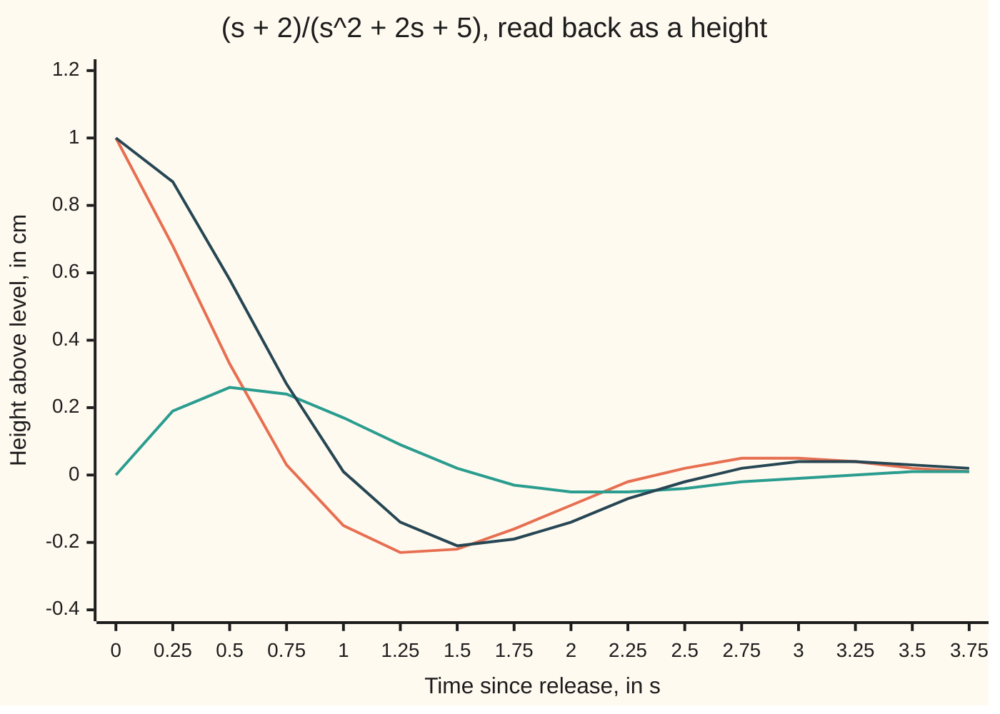

# Inverting: split the transformed answer into table entries and read the solution off

[Syllabus](../../../SYLLABUS.md) → [Differential equations and dynamics](../README.md) → [Laplace Transforms for Initial-Value Problems](../README.md#s08) → Inverting

---

## General Overview

A car's body is released 1 cm above its resting height, momentarily still. Spring and damper give the rate law y'' + 2y' + 5y = 0, with y the height in cm and t the time in seconds. Transforming that law turned it into algebra ([Transforming a derivative](02-transforms-of-derivatives.md)), which gave the motion in coded form: Y(s) = (s + 2)/(s^2 + 2s + 5), with s the transform variable, per second, and Y the height's transform.

No row of the transform table looks like that fraction. Inverting turns it back into a height against time: rewrite it as a sum of pieces the table knows, then read each off.

Completing the square turns the bottom into (s + 1)^2 + 4. Splitting the top as (s + 1) + 1 leaves a fading cosine and a fading sine. Their sum, e^(−t)(cos 2t + 0.5 sin 2t), is the motion the characteristic equation found ([Complex roots](../03-Oscillators%20-%20Second-Order%20Linear%20Equations/03-complex-roots-and-damped-oscillation.md)).

**To invert a rational transform, split it into partial fractions, complete the square on any quadratic with no real roots, write its top in powers of the shifted variable, and read each piece off the table as a decaying exponential, cosine or sine.**

**What kind of fact this is:** a method; the shift rule and the agreement of the two splitting routes are proved in Why it works, and uniqueness is a theorem cited there.

### The picture: two table entries and their sum



Orange: e^(−t) cos 2t, from (s + 1)/((s + 1)^2 + 4). Teal: 0.5 e^(−t) sin 2t, from 1/((s + 1)^2 + 4). Dark: their sum, the height.

---

## The formula

Notation first, in words. The inverse transform, written $\mathcal{L}^{-1}$ and read "the signal whose transform is", undoes the Laplace transform: y = $\mathcal{L}^{-1}$[Y].

The rows read backwards, from [The Laplace transform](01-the-laplace-transform.md) and Step 1 below:

$$\frac{A}{s-c}\ \text{ is the transform of }\ A\,e^{ct}$$

$$\frac{C\,(s+a) + D\,\omega}{(s+a)^2+\omega^2}\ \text{ is the transform of }\ e^{-at}\bigl(C\cos\omega t + D\sin\omega t\bigr)$$

**Read it aloud:** a fraction over s − c comes from an exponential with rate c; a fraction over a completed square comes from a cosine and a sine of angular frequency ω, fading at rate a, weighted by the top's two coefficients.

The job is to put a transform into these shapes. For the car, s + 2 = 1 · (s + 1) + 0.5 · 2.

| Symbol | Plain meaning | In our example | Push it up and the answer… |
| --- | --- | --- | --- |
| $t$ | time since release, in s | 0 to 4 s | — |
| $s$ | the transform variable, per s | 2 in the forward check | — |
| $y$, $Y$ | height in cm; its transform, in cm·s | Y(2) = 0.307692 | — |
| $a$ | the shift, a decay rate per s | 1 | faster fade |
| $\omega$ | angular frequency, rad/s | 2 | quicker swings |
| $C$, $D$ | cosine and sine weights, in cm | 1 and 0.5 | taller swing |
| $A$, $c$ | weight and place of a real pole (a real root of the bottom) | A = 1 at c = 0 | higher settled level |
| $p$, $r$ | a complex root; its cover-up value, a residue | −1 + 2i; 0.5 − 0.25i | — |

### When it holds

- **A proper rational function.** The top's degree is below the bottom's. Otherwise Y does not fade as s grows and no ordinary signal has it as a transform; [Impulses](06-impulses-and-the-delta-function.md) supplies what it needs.
- **No real roots in the square.** For s^2 + Ps + Q the discriminant P^2 − 4Q must be negative: here −16. If it is positive, the quadratic factors into two real poles, each a plain exponential.
- **Simple poles.** A repeated root leaves ω = 0 and the sine weight divides by zero; it needs the row t e^(ct).
- **Uniqueness among continuous signals.** Signals differing at one instant share a transform.

---

## Why it works

### Step 0: the transform is linear and one-to-one, so pieces invert separately

The transform of a sum is the sum of the transforms, so the signals of the pieces add up to a signal with transform Y. Lerch's theorem, cited and not proved here, says two continuous signals with one transform are equal: the reading is the answer, not a guess. The inversion formula behind it is in [Inverting a Laplace transform](../../07-Complex%20analysis/08-Transforms%20in%20Outline/07-inverse-laplace-by-residues.md).

### Step 1: a fading factor shifts s

Multiply a signal f, with transform F, by e^(−at). The two weights merge into e^(−(s + a)t), so s is replaced by s + a:

$$\int_0^\infty e^{-st}\,e^{-at}f(t)\,dt = F(s+a)$$

Applied to the cosine row s/(s^2 + ω^2) and the sine row ω/(s^2 + ω^2), it gives (s + a)/((s + a)^2 + ω^2) and ω/((s + a)^2 + ω^2). Weighted by C and D and added, that is the second formula.

### Step 2: complete the square

Any s^2 + Ps + Q equals (s + P/2)^2 + (Q − P^2/4). With a negative discriminant the second part is positive, with square root ω. For the car, (s + 1)^2 + 4: a = 1 per s and ω = 2 rad/s, the roots −1 ± 2i with real and imaginary parts on show.

### Step 3: rewrite the top in powers of s + a

Write the top in the bottom's shifted variable. Match the s coefficient, then the constant:

s + 2 = 1 · (s + 1) + 1, and 1 = 0.5 · 2.

So C = 1 and D = 0.5, and

$$\frac{s+2}{s^2+2s+5} = \frac{s+1}{(s+1)^2+4} + 0.5\cdot\frac{2}{(s+1)^2+4}$$

reads back as y(t) = e^(−t)(cos 2t + 0.5 sin 2t). At t = 0 it gives 1 cm, the release height.

### Step 4: a real pole beside the pair, found by cover-up

Now push the car from rest at level with a steady force worth 5 cm/s^2 of acceleration: y'' + 2y' + 5y = 5 with y(0) = y'(0) = 0. The constant 5 transforms to 5/s, so Y = 5/(s(s^2 + 2s + 5)). Partial fractions ([Partial fractions](../../06-Calculus%20and%20analysis/04-Integrals/05-partial-fractions.md)) give one fraction per factor of the bottom:

$$\frac{5}{s\,(s^2+2s+5)} = \frac{A}{s} + \frac{\text{linear top}}{s^2+2s+5}$$

Cover-up finds A: multiply by s and set s = 0, which erases the other fraction and leaves 5/5, so A = 1. Subtract 1/s: the leftover top is (5 − (s^2 + 2s + 5))/s = −s − 2, minus the released car's transform. So

y(t) = 1 − e^(−t)(cos 2t + 0.5 sin 2t).

The body settles 1 cm up, where the spring balances the push.

<details>
<summary>Detailed proof: the square and the complex split always agree</summary>

Let the roots be p = −a + iω and its mirror image p̄ = −a − iω, ω > 0. Over the complex numbers ([Rational functions](../../07-Complex%20analysis/05-Laurent%20Series%2C%20Singularities%20and%20Residues/03-rational-functions-and-partial-fractions.md)) the pair splits as r/(s − p) + r̄/(s − p̄), with r the cover-up value at p; real coefficients make the second value the mirror image r̄.

Write r = (C − iD)/2. Over (s + a)^2 + ω^2 the top is (r + r̄)s − (r p̄ + r̄ p). The first coefficient is C; the second is minus twice the real part of (C − iD)(−a − iω)/2, which is Ca + Dω. So the top is C(s + a) + Dω, the completed-square form with the same C and D.

In time, r/(s − p) comes from r e^(pt), so the pair is twice the real part of r e^(pt). By Euler's formula that is the real part of (C − iD)(cos ωt + i sin ωt) times e^(−at): e^(−at)(C cos ωt + D sin ωt).

For the car, r = (p + 2)/(p − p̄) = (1 + 2i)/(4i) = 0.5 − 0.25i: C = 1, D = 0.5. That the split exists for every proper rational function is proved on [Partial fractions](../../06-Calculus%20and%20analysis/04-Integrals/05-partial-fractions.md).

</details>

The residue route, adding r e^(pt) over the poles, comes from a contour integral in [Inverting a Laplace transform](../../07-Complex%20analysis/08-Transforms%20in%20Outline/07-inverse-laplace-by-residues.md). Completing the square stays in real numbers.

---

## Worked numbers, by hand

| Step | Arithmetic | Value |
| --- | --- | --- |
| test the bottom | 2^2 − 4 × 5 | −16: no real roots |
| complete the square | s^2 + 2s + 5 = (s + 1)^2 + 4 | a = 1, ω = 2 |
| shift the top | s + 2 = 1 · (s + 1) + 0.5 · 2 | C = 1, D = 0.5 |
| read the table | e^(−t)(1 · cos 2t + 0.5 sin 2t) | **y(t) = e^(−t)(cos 2t + 0.5 sin 2t)** |
| half a second in | e^(−0.5)(cos 1 + 0.5 sin 1) | 0.582899 cm |
| lowest point | slope zero where sin 2t = 0 | −0.207879 cm at 1.57 s |
| transform back, s = 2 | (2 + 2)/(4 + 4 + 5) | 4/13 = 0.307692 |
| the push, real pole | cover-up at s = 0: 5/5 | A = 1 |
| the push, answer | 1/s minus the released car | **y(t) = 1 − e^(−t)(cos 2t + 0.5 sin 2t)** |

The released car dips 0.207879 cm below level at 1.57 s, as the characteristic-equation card found; the pushed car settles at 1 cm.

### What breaks if you drop a piece

| Mistake | Comes out at | What went wrong |
| --- | --- | --- |
| e^(+t) read from (s + 1) | y(0.5) = 1.584483 cm, not 0.582899, and growing | s + a means a fade at rate a, so e^(−t) |
| s + 2 left whole over the square | y(0.5) = 0.327710 cm | the top was not shifted; the sine piece is lost |
| sine row read without dividing by ω | y(0.5) = 0.838088 cm | the sine row has ω on top; D is 1/2, not 1 |

---

## Code, from first principles, and it actually runs

Three roads, on both the released and the pushed car. Road one completes the square. Road two, sharing no step with road one, finds the complex roots by the quadratic formula, splits by cover-up and sums r e^(pt). Road three transforms road one's answer forward with Simpson's rule (a weighted sum of the integrand at evenly spaced points), cut off at 40 s, against Y(2) from the fraction. The last assert checks the car: the lowest point, found by scanning, sits at π/2 s at depth e^(−π/2).

### Python

```python
# Inverting by partial fractions -- the check behind the card.  Only math's
# exp, sin, cos, sqrt, pi and prod are imported.  Case 1: the car released from 1 cm,
# Y = (s + 2)/(s^2 + 2s + 5).  Case 2: a steady push, Y = 5/(s(s^2 + 2s + 5)).
# Road one completes the square and reads the table.  Road two splits over the
# complex roots by cover-up.  Road three transforms road one's answer forward.
from math import exp, sin, cos, sqrt, pi, prod
P, Q = 2.0, 5.0                                  # the denominator s^2 + P s + Q

def square(al, be):                              # road one: (al s + be) over the square
    a = P / 2; w = sqrt(Q - a * a)               # (s + a)^2 + w^2
    return a, w, al, (be - al * a) / w           # e^(-at)(C cos wt + D sin wt)

def cover_up(num, poles):                        # road two: residue at each simple pole
    return [(p, num(p) / prod(p - q for q in poles if q != p)) for p in poles]

def at(terms, t):                                # sum of r e^(pt): its real part
    return sum((r * complex(cos(p.imag * t), sin(p.imag * t))).real * exp(p.real * t) for p, r in terms)

def simpson(f, s, R=40.0, n=4000):               # road three: integral of e^(-st) f(t)
    h = R / n
    return h / 3 * sum((1 if k in (0, n) else 4 if k % 2 else 2) * exp(-s * k * h) * f(k * h)
                       for k in range(n + 1))

root = (-P + complex(P * P - 4 * Q) ** 0.5) / 2  # quadratic formula, complex square root
poles, grid = [root, root.conjugate()], [k * 0.01 for k in range(401)]
a, w, C, D = square(1.0, 2.0)
print(f"discriminant P^2 - 4Q = {P * P - 4 * Q:g}: no real roots; completed square (s + {a:g})^2 + {w * w:g}")
y1 = lambda t: exp(-a * t) * (C * cos(w * t) + D * sin(w * t))
r1 = cover_up(lambda s: s + 2, poles)[0][1]
print(f"case 1, completed square: shift a = {a:g}, w = {w:g}, cos coefficient {C:.6f}, sin coefficient {D:.6f}")
print(f"case 1, cover-up at {root.real:g}{root.imag:+g}i: residue {r1.real:.6f} {r1.imag:+.6f}i, "
      f"so cos {2 * r1.real:.6f}, sin {-2 * r1.imag:.6f}")
gap1 = max(abs(y1(t) - at(cover_up(lambda s: s + 2, poles), t)) for t in grid)
low = min(grid[50:301], key=y1)
print(f"case 1, forward transform at s = 2: {simpson(y1, 2.0):.6f} against Y(2) = 4/13 = {4 / 13:.6f}")
print(f"case 1 in the car: y(0) = {y1(0):.6f} cm, y(0.5) = {y1(0.5):.6f} cm, lowest {y1(low):.6f} cm at t = {low:.2f} s")
A = 5 / Q                                        # cover-up at the real pole s = 0
a2, w2, C2, D2 = square(-A, -A * P)              # leftover (5 - A D(s))/s = -A s - A P
y2 = lambda t: A + exp(-a2 * t) * (C2 * cos(w2 * t) + D2 * sin(w2 * t))
gap2 = max(abs(y2(t) - at(cover_up(lambda s: 5 + 0j, [0j] + poles), t)) for t in grid)
print(f"case 2, cover-up at s = 0: A = {A:.6f}; leftover ({-A:.6f} s {-A * P:+.6f})/(s^2 + 2s + 5)")
print(f"case 2, so y = {A:g} - e^(-t)(cos 2t + {D2 / C2:.1f} sin 2t); forward transform at s = 2: "
      f"{simpson(y2, 2.0):.6f} against 5/26 = {5 / 26:.6f}")
print(f"roads one and two, largest gap on 0 to 4 s: case 1 {'below' if gap1 < 1e-12 else 'ABOVE'} 1e-12, "
      f"case 2 {'below' if gap2 < 1e-12 else 'ABOVE'} 1e-12")
print(f"mistake 1, e^(+t) for (s + 1): y(0.5) = {exp(0.5) * (cos(1) + 0.5 * sin(1)):.6f}, not {y1(0.5):.6f}")
print(f"mistake 2, s + 2 left whole over the square: y(0.5) = {exp(-0.5) * cos(1):.6f}")
print(f"mistake 3, sin entry without dividing by w: y(0.5) = {exp(-0.5) * (cos(1) + sin(1)):.6f}")
ts = [k * 0.25 for k in range(16)]
print("figure, t     " + " ".join(f"{t:5.2f}" for t in ts))
print("figure, cos   " + " ".join(f"{exp(-t) * cos(2 * t):5.2f}" for t in ts))
print("figure, sin   " + " ".join(f"{0.5 * exp(-t) * sin(2 * t):5.2f}" for t in ts))
print("figure, y     " + " ".join(f"{y1(t):5.2f}" for t in ts))
assert gap1 < 1e-12 and gap2 < 1e-12                             # square + table = cover-up
assert abs(simpson(y1, 2.0) - 4 / 13) < 1e-7                     # the answer transforms back
assert abs(simpson(y2, 2.0) - 5 / 26) < 1e-7
assert abs(low - pi / 2) < 0.01 and abs(y1(low) + exp(-pi / 2)) < 1e-4  # the shelf-3 dip
print("ALL CHECKS PASS")
```

**Ran 2026-09-28 on macOS, Python 3.14.6, standard library only. All checks passed. Output, pasted from the run:**

```
discriminant P^2 - 4Q = -16: no real roots; completed square (s + 1)^2 + 4
case 1, completed square: shift a = 1, w = 2, cos coefficient 1.000000, sin coefficient 0.500000
case 1, cover-up at -1+2i: residue 0.500000 -0.250000i, so cos 1.000000, sin 0.500000
case 1, forward transform at s = 2: 0.307692 against Y(2) = 4/13 = 0.307692
case 1 in the car: y(0) = 1.000000 cm, y(0.5) = 0.582899 cm, lowest -0.207879 cm at t = 1.57 s
case 2, cover-up at s = 0: A = 1.000000; leftover (-1.000000 s -2.000000)/(s^2 + 2s + 5)
case 2, so y = 1 - e^(-t)(cos 2t + 0.5 sin 2t); forward transform at s = 2: 0.192308 against 5/26 = 0.192308
roads one and two, largest gap on 0 to 4 s: case 1 below 1e-12, case 2 below 1e-12
mistake 1, e^(+t) for (s + 1): y(0.5) = 1.584483, not 0.582899
mistake 2, s + 2 left whole over the square: y(0.5) = 0.327710
mistake 3, sin entry without dividing by w: y(0.5) = 0.838088
figure, t      0.00  0.25  0.50  0.75  1.00  1.25  1.50  1.75  2.00  2.25  2.50  2.75  3.00  3.25  3.50  3.75
figure, cos    1.00  0.68  0.33  0.03 -0.15 -0.23 -0.22 -0.16 -0.09 -0.02  0.02  0.05  0.05  0.04  0.02  0.01
figure, sin    0.00  0.19  0.26  0.24  0.17  0.09  0.02 -0.03 -0.05 -0.05 -0.04 -0.02 -0.01  0.00  0.01  0.01
figure, y      1.00  0.87  0.58  0.27  0.01 -0.14 -0.21 -0.19 -0.14 -0.07 -0.02  0.02  0.04  0.04  0.03  0.02
ALL CHECKS PASS
```

### Rust

Same numbers, same labels, built with `rustc --edition 2021 -O`. Rust's std has no complex numbers, so the check carries pairs of reals.

```rust
// Inverting by partial fractions -- the same check as the Python, in Rust.  No
// crates.  Case 1: the car released from 1 cm, Y = (s + 2)/(s^2 + 2s + 5).
// Case 2: a steady push, Y = 5/(s(s^2 + 2s + 5)).  Road one completes the
// square and reads the table.  Road two splits over the complex roots by
// cover-up.  Road three transforms road one's answer forward.
use std::f64::consts::PI;
const P: f64 = 2.0; const Q: f64 = 5.0;              // the denominator s^2 + P s + Q
type C = (f64, f64);                                 // a complex number, (real, imaginary)

fn mul(x: C, y: C) -> C { (x.0 * y.0 - x.1 * y.1, x.0 * y.1 + x.1 * y.0) }
fn div(x: C, y: C) -> C { let d = y.0 * y.0 + y.1 * y.1; ((x.0 * y.0 + x.1 * y.1) / d, (x.1 * y.0 - x.0 * y.1) / d) }

fn square(al: f64, be: f64) -> (f64, f64, f64, f64) { // road one: (al s + be) over the square
    let a = P / 2.0; let w = (Q - a * a).sqrt();     // (s + a)^2 + w^2
    (a, w, al, (be - al * a) / w)                    // e^(-at)(C cos wt + D sin wt)
}

fn cover_up(num: &dyn Fn(C) -> C, poles: &[C]) -> Vec<(C, C)> { // road two: residue at each pole
    poles.iter().map(|&p| {
        let d = poles.iter().filter(|&&q| q != p).fold((1.0, 0.0), |acc, &q| mul(acc, (p.0 - q.0, p.1 - q.1)));
        (p, div(num(p), d))
    }).collect()
}

fn at(terms: &[(C, C)], t: f64) -> f64 {              // sum of r e^(pt): its real part
    terms.iter().map(|&(p, r)| mul(r, ((p.1 * t).cos(), (p.1 * t).sin())).0 * (p.0 * t).exp()).sum()
}

fn simpson(f: &dyn Fn(f64) -> f64, s: f64) -> f64 { // road three: integral of e^(-st) f(t)
    let (n, h) = (4000usize, 40.0 / 4000.0);
    h / 3.0 * (0..=n).map(|k| {
        let wt = if k == 0 || k == n { 1.0 } else if k % 2 == 1 { 4.0 } else { 2.0 };
        wt * (-s * k as f64 * h).exp() * f(k as f64 * h)
    }).sum::<f64>()
}

fn main() {
    let disc = P * P - 4.0 * Q;                      // quadratic formula, complex square root
    let root: C = if disc < 0.0 { (-P / 2.0, (-disc).sqrt() / 2.0) } else { ((-P + disc.sqrt()) / 2.0, 0.0) };
    let poles = [root, (root.0, -root.1)];
    let grid: Vec<f64> = (0..=400).map(|k| k as f64 * 0.01).collect();
    let (a, w, c, d) = square(1.0, 2.0);
    println!("discriminant P^2 - 4Q = {}: no real roots; completed square (s + {})^2 + {}", disc, a, w * w);
    let y1 = move |t: f64| (-a * t).exp() * (c * (w * t).cos() + d * (w * t).sin());
    let terms1 = cover_up(&|s: C| (s.0 + 2.0, s.1), &poles);
    let r1 = terms1[0].1;
    println!("case 1, completed square: shift a = {}, w = {}, cos coefficient {:.6}, sin coefficient {:.6}", a, w, c, d);
    println!("case 1, cover-up at {}{:+}i: residue {:.6} {:+.6}i, so cos {:.6}, sin {:.6}",
             root.0, root.1, r1.0, r1.1, 2.0 * r1.0, -2.0 * r1.1);
    let gap1 = grid.iter().map(|&t| (y1(t) - at(&terms1, t)).abs()).fold(0.0, f64::max);
    let low = grid[50..301].iter().copied().fold(0.5, |b, t| if y1(t) < y1(b) { t } else { b });
    println!("case 1, forward transform at s = 2: {:.6} against Y(2) = 4/13 = {:.6}", simpson(&y1, 2.0), 4.0 / 13.0);
    println!("case 1 in the car: y(0) = {:.6} cm, y(0.5) = {:.6} cm, lowest {:.6} cm at t = {:.2} s", y1(0.0), y1(0.5), y1(low), low);
    let big_a = 5.0 / Q;                             // cover-up at the real pole s = 0
    let (a2, w2, c2, d2) = square(-big_a, -big_a * P); // leftover (5 - A D(s))/s = -A s - A P
    let y2 = move |t: f64| big_a + (-a2 * t).exp() * (c2 * (w2 * t).cos() + d2 * (w2 * t).sin());
    let terms2 = cover_up(&|_s: C| (5.0, 0.0), &[(0.0, 0.0), poles[0], poles[1]]);
    let gap2 = grid.iter().map(|&t| (y2(t) - at(&terms2, t)).abs()).fold(0.0, f64::max);
    println!("case 2, cover-up at s = 0: A = {:.6}; leftover ({:.6} s {:+.6})/(s^2 + 2s + 5)", big_a, -big_a, -big_a * P);
    println!("case 2, so y = {} - e^(-t)(cos 2t + {:.1} sin 2t); forward transform at s = 2: {:.6} against 5/26 = {:.6}",
             big_a, d2 / c2, simpson(&y2, 2.0), 5.0 / 26.0);
    let word = |g: f64| if g < 1e-12 { "below" } else { "ABOVE" };
    println!("roads one and two, largest gap on 0 to 4 s: case 1 {} 1e-12, case 2 {} 1e-12", word(gap1), word(gap2));
    println!("mistake 1, e^(+t) for (s + 1): y(0.5) = {:.6}, not {:.6}", 0.5f64.exp() * (1f64.cos() + 0.5 * 1f64.sin()), y1(0.5));
    println!("mistake 2, s + 2 left whole over the square: y(0.5) = {:.6}", (-0.5f64).exp() * 1f64.cos());
    println!("mistake 3, sin entry without dividing by w: y(0.5) = {:.6}", (-0.5f64).exp() * (1f64.cos() + 1f64.sin()));
    let ts: Vec<f64> = (0..16).map(|k| k as f64 * 0.25).collect();
    let row = |f: &dyn Fn(f64) -> f64| ts.iter().map(|&t| format!("{:5.2}", f(t))).collect::<Vec<_>>().join(" ");
    println!("figure, t     {}", row(&|t| t));
    println!("figure, cos   {}", row(&|t: f64| (-t).exp() * (2.0 * t).cos()));
    println!("figure, sin   {}", row(&|t: f64| 0.5 * (-t).exp() * (2.0 * t).sin()));
    println!("figure, y     {}", row(&y1));
    assert!(gap1 < 1e-12 && gap2 < 1e-12);                           // square + table = cover-up
    assert!((simpson(&y1, 2.0) - 4.0 / 13.0).abs() < 1e-7);          // the answer transforms back
    assert!((simpson(&y2, 2.0) - 5.0 / 26.0).abs() < 1e-7);
    assert!((low - PI / 2.0).abs() < 0.01 && (y1(low) + (-PI / 2.0).exp()).abs() < 1e-4); // the shelf-3 dip
    println!("ALL CHECKS PASS");
}
```

**Ran 2026-09-28 on macOS, rustc 1.98.1, no crates. All checks passed. Output, pasted from the run:**

```
discriminant P^2 - 4Q = -16: no real roots; completed square (s + 1)^2 + 4
case 1, completed square: shift a = 1, w = 2, cos coefficient 1.000000, sin coefficient 0.500000
case 1, cover-up at -1+2i: residue 0.500000 -0.250000i, so cos 1.000000, sin 0.500000
case 1, forward transform at s = 2: 0.307692 against Y(2) = 4/13 = 0.307692
case 1 in the car: y(0) = 1.000000 cm, y(0.5) = 0.582899 cm, lowest -0.207879 cm at t = 1.57 s
case 2, cover-up at s = 0: A = 1.000000; leftover (-1.000000 s -2.000000)/(s^2 + 2s + 5)
case 2, so y = 1 - e^(-t)(cos 2t + 0.5 sin 2t); forward transform at s = 2: 0.192308 against 5/26 = 0.192308
roads one and two, largest gap on 0 to 4 s: case 1 below 1e-12, case 2 below 1e-12
mistake 1, e^(+t) for (s + 1): y(0.5) = 1.584483, not 0.582899
mistake 2, s + 2 left whole over the square: y(0.5) = 0.327710
mistake 3, sin entry without dividing by w: y(0.5) = 0.838088
figure, t      0.00  0.25  0.50  0.75  1.00  1.25  1.50  1.75  2.00  2.25  2.50  2.75  3.00  3.25  3.50  3.75
figure, cos    1.00  0.68  0.33  0.03 -0.15 -0.23 -0.22 -0.16 -0.09 -0.02  0.02  0.05  0.05  0.04  0.02  0.01
figure, sin    0.00  0.19  0.26  0.24  0.17  0.09  0.02 -0.03 -0.05 -0.05 -0.04 -0.02 -0.01  0.00  0.01  0.01
figure, y      1.00  0.87  0.58  0.27  0.01 -0.14 -0.21 -0.19 -0.14 -0.07 -0.02  0.02  0.04  0.04  0.03  0.02
ALL CHECKS PASS
```

The two outputs match line for line.

> [!TIP]
> **Try changing**
> Guess first, then run it.
> - **A stiffer spring.** Set `Q` to `10.0` and guess ω. Roads one and two still agree; the second assert stops the program, since 4/13 belongs to the old bottom.
> - **Critical damping.** Set `Q` to `1.0`. The square leaves ω = 0 and the sine weight divides by zero: a repeated pole needs the t e^(−t) row.
> - **Forget ω.** In `square`, drop the `/ w`. The first assert stops it: cover-up still finds 0.5.

---

## The usual mistake

> [!warning]
> **Shifting the bottom but not the top.** Once the bottom reads (s + 1)^2 + 4, the top must be in powers of s + 1 too. Reading s + 2 as the cosine row's s drops the piece 1/((s + 1)^2 + 4): y(0.5) = 0.327710 cm instead of 0.582899.
>
> - **Wrong sign on the exponential.** (s + 1) means the signal was multiplied by e^(−t). Reading e^(+t) gives y(0.5) = 1.584483 cm and a car that flies off.
> - **Forgetting ω in the sine row.** The row is ω/(s^2 + ω^2), so the leftover 1 is 0.5 · 2. Weight 1 gives y(0.5) = 0.838088 cm.
> - **Hunting real factors of s^2 + 2s + 5.** The discriminant is −16: there are none. Complete the square.

---

## Where you meet it in real life

- **Circuits.** A resistor, coil and capacitor in series give a quadratic bottom; completing the square gives the current's ringing frequency and decay rate after a switch closes.
- **Control engineering.** The poles of a transfer function decide whether a controlled system settles, rings or runs away.
- **The rest of this shelf.** [Step functions](05-step-functions-and-delays.md) puts a delay factor in front of the same pieces; [Convolution](07-convolution-and-the-impulse-response.md) inverts a product without splitting it.

> **Say it back**
> A transformed answer is a ratio of polynomials no table row matches. Split it into partial fractions, one per factor of the bottom. A real root gives an exponential; a quadratic with no real roots is completed to a square, its top rewritten in the shifted variable, and read as a fading cosine and sine. For the car that is e^(−t)(cos 2t + 0.5 sin 2t). Cover-up over the complex roots agrees.

---

## What this builds on

- [Transforming a derivative](02-transforms-of-derivatives.md): where the car's Y came from.
- [Partial fractions](../../06-Calculus%20and%20analysis/04-Integrals/05-partial-fractions.md): the split and the cover-up rule.
- [Factoring](../../03-Algebra/02-Polynomials/02-factoring-quadratics.md): the discriminant and completing the square.
- [Rational functions](../../07-Complex%20analysis/05-Laurent%20Series%2C%20Singularities%20and%20Residues/03-rational-functions-and-partial-fractions.md): the split over complex roots.
- [Inverting a Laplace transform](../../07-Complex%20analysis/08-Transforms%20in%20Outline/07-inverse-laplace-by-residues.md): the residue road's source.

## Where this goes next

- [The round trip](04-solving-an-initial-value-problem-by-transform.md): the full round trip, transform, solve and invert, on forced problems.

---

## Sources

Verified 2026-09-28: every link below resolves to the publisher's page.

- Lebl, Jiří. *Notes on Diffy Qs: Differential Equations for Engineers*. [Book site](https://www.jirka.org/diffyqs/). Partial fractions and the shift rule on second-order equations.
- Trench, William F. *Elementary Differential Equations*. Trinity University, 2013. [Publisher page](https://digitalcommons.trinity.edu/mono/8/). Inverting over complex-root denominators, both ways.
- Dawkins, Paul. "Inverse Laplace Transforms." Paul's Online Notes, Lamar University. [Page](https://tutorial.math.lamar.edu/Classes/DE/InverseTransforms.aspx). Worked inversions with shifted cosine and sine rows.
