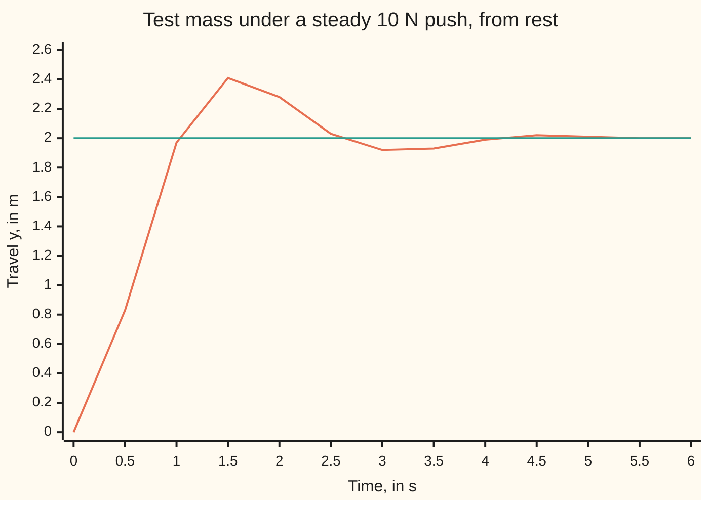
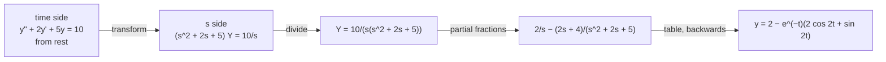

# The round trip: transform, solve the algebra, invert, and the forced oscillator falls out in one pass

[Syllabus](../../../SYLLABUS.md) → [Differential equations and dynamics](../README.md) → [Laplace Transforms for Initial-Value Problems](../README.md#s08) → The round trip

---

## General Overview

The shelf's shock absorber sits on a test bench, scaled to a 1 kg mass. Its spring pulls back 5 newtons (N) per metre of travel; its damper, a piston in oil, drags 2 N per metre per second of speed. At time zero, with the mass at rest, a ram starts pressing on it with a steady 10 N.

The round numbers make a bench model, not a car: a real car body moves centimetres, as on the shelf's free-release card. Write y for the mass's travel from rest in metres and t for the time in seconds; y' is the velocity and y'' the acceleration. Force equals mass times acceleration, so y'' + 2y' + 5y = 10, with y(0) = 0 and y'(0) = 0. It should end where the spring balances the ram, 10 N ÷ 5 N/m = 2 m. The question is how it gets there.

The Laplace transform answers in one pass. It trades the time t for a new variable s. Derivatives become multiplication by s, the steady push becomes 10/s, and what is left is algebra. Partial fractions and a table of known transforms, read backwards, give y = 2 − e^(−t)(2 cos 2t + sin 2t). The mass swings past 2 m to 2.42 m at 1.571 s, then settles.

**Transform the equation, push and starting values included; solve the algebra; split into table entries; read the table backwards: the whole motion arrives with no separate fitting step.**

**What kind of fact this is:** a method; Why it works shows why its answer is the solution, and the folded Detailed proof shows it is the only one.

### The picture: the ram pushes, the mass overshoots and settles



Orange: the travel y, every half second. Teal: the resting point under the push, 2 m. The true peak, 2.42 m at 1.571 s, falls between plotted points.

---

## The formula

Reminders: a curly L, $\mathcal{L}$, reads "the Laplace transform of", and a capital names the result, so $Y = \mathcal{L}[y]$ ([The Laplace transform](01-the-laplace-transform.md)). Acceleration transforms to s^2 Y − s y(0) − y'(0), velocity to sY − y(0) ([Transforming a derivative](02-transforms-of-derivatives.md)). From rest, both starting values are 0.

The method for y'' + b y' + k y = f(t), in three moves:

$$\bigl(s^2 + b s + k\bigr)\,Y(s) \;=\; F(s) + (s + b)\,y(0) + y'(0)$$

$$Y(s) \;=\; \frac{F(s) + (s + b)\,y(0) + y'(0)}{s^2 + b s + k}, \qquad y(t) = \mathcal{L}^{-1}[Y](t)$$

**Read it aloud:** the characteristic polynomial times the transform equals the push's transform plus the starting values; divide, then find the signal with that transform.

For the test mass, b = 2, k = 5, F(s) = 10/s, and the starting values are 0:

$$Y(s) = \frac{10}{s\,(s^2 + 2s + 5)} = \frac{2}{s} - \frac{2s + 4}{s^2 + 2s + 5}, \qquad y(t) = 2 - e^{-t}\,(2\cos 2t + \sin 2t)$$

| Symbol | Plain meaning | In our example | Push it up and the answer… |
| --- | --- | --- | --- |
| $t$ | time since the ram started, in s | 0 to 10 s | y settles toward 2 m |
| $y$, $y'$, $y''$ | travel from rest (m), velocity (m/s), acceleration (m/s^2) | start at 0 and 0 | — |
| $b$, $k$ | damping and stiffness per kg: 2 per s, and 5 per s^2 | 2 and 5 | b: less overshoot; k: less final travel, 10/k |
| $f$, $F$ | the push per kg, in m/s^2; its transform | f = 10; F = 10/s | every part of y scales with it |
| $s$, $Y$ | the transform's variable, per second; the travel's transform | Y = 10/(s(s^2 + 2s + 5)) | — |
| $\mathcal{L}^{-1}$ | "the signal whose transform is" | turns 2/s into 2 | — |
| $A$, $C$, $D$ | partial-fraction numerators: A over s, Cs + D over the quadratic | 2, −2, −4 | — |
| $h$ | the step size of the numerical check, in s | 0.1 and 0.05 | error grows like h^4 |

### When it holds

- **Linear, with constant coefficients.** Then each term becomes a multiple of Y. A term such as t·y becomes minus the derivative of Y: another differential equation, not algebra.
- **The push has a transform.** It grows no faster than an exponential; a push of e^(t^2) newtons has none, and the first move fails.
- **The starting values sit at t = 0.** Given at t = 3 s, shift the clock first.
- **No infinite spike in the push.** Jumps are fine, best written with step functions ([Step functions](05-step-functions-and-delays.md)); a hammer blow needs [Impulses](06-impulses-and-the-delta-function.md).

---

## Why it works



### Step 0: the transform is a faithful translation

Derivatives become multiplication, so the equation becomes algebra. Two continuous signals with the same transform are the same signal, so the answer read off at the end is the only one.

### Step 1: transform both sides

From rest the acceleration becomes s^2 Y, the velocity sY. The steady 10 N per kg is 10 times the constant signal 1, whose transform is 1/s. So

$$s^2 Y + 2sY + 5Y = \frac{10}{s}$$

### Step 2: solve the algebra

Collect: (s^2 + 2s + 5) Y = 10/s. The bracket is the characteristic polynomial, the same one whose roots −1 ± 2i gave the free oscillation ([Complex roots](../03-Oscillators%20-%20Second-Order%20Linear%20Equations/03-complex-roots-and-damped-oscillation.md)). Divide:

$$Y(s) = \frac{10}{s\,(s^2 + 2s + 5)}$$

Each factor below the line becomes one piece of the motion: s, from the push, gives the constant 2; the quadratic, from the machine, gives the decay e^(−t) and the turning at 2 per s.

### Step 3: split into table entries

The quadratic has no real roots, so its piece takes a first-degree numerator ([Inverting](03-inverting-by-partial-fractions.md)):

$$\frac{10}{s\,(s^2 + 2s + 5)} = \frac{A}{s} + \frac{Cs + D}{s^2 + 2s + 5}$$

Multiply through by the denominator: 10 = A(s^2 + 2s + 5) + (Cs + D)s. At s = 0 this reads 10 = 5A, so A = 2. Matching the s^2 terms, 0 = A + C, so C = −2. Matching the s terms, 0 = 2A + D, so D = −4.

### Step 4: complete the square and read the table backwards

Write s^2 + 2s + 5 as (s + 1)^2 + 4. Multiplying a signal by e^(−t) replaces s by s + 1 in its transform, because e^(−st) e^(−t) = e^(−(s+1)t). So (s + 1)/((s + 1)^2 + 4) comes from e^(−t) cos 2t, and 2/((s + 1)^2 + 4) from e^(−t) sin 2t. Split the numerator to match: −2s − 4 = −2(s + 1) − 2. Then

$$Y = \frac{2}{s} - 2\,\frac{s+1}{(s+1)^2+4} - \frac{2}{(s+1)^2+4}$$

and term by term, y = 2 − 2e^(−t) cos 2t − e^(−t) sin 2t.

### Step 5: check it in the situation

At t = 0, y = 2 − 2 = 0. Its velocity y' = 5e^(−t) sin 2t is 0 at t = 0: it starts still. The velocity next returns to zero when 2t = π, at t = 1.571 s, where y = 2 + 2e^(−π/2) = 2.415759 m. The e^(−t) factor then shrinks every swing, and at 2 m the spring's 10 N matches the ram.

<details>
<summary>Detailed proof: the round trip's answer is the only solution</summary>

The rate law is linear with a continuous push, so exactly one solution y starts from rest ([The Picard-Lindelof theorem](../02-Existence%2C%20Uniqueness%20and%20Sensitivity/02-lipschitz-and-the-picard-lindelof-theorem.md)).

It has a transform: travel and velocity stay below a multiple of e^(Lt) for some constant L ([Gronwall's inequality](../02-Existence%2C%20Uniqueness%20and%20Sensitivity/04-gronwall-and-continuous-dependence.md)). The rate law then bounds y'' the same way, so the derivative rules of [Transforming a derivative](02-transforms-of-derivatives.md) apply for every s > L.

So for s > L its transform satisfies Step 1's equation and equals 10/(s(s^2 + 2s + 5)). By Step 4, y* = 2 − e^(−t)(2 cos 2t + sin 2t) has that transform too. Two continuous signals whose transforms agree for all large s are equal for every t ≥ 0 (Lerch's theorem). Hence y = y*.

Substitution confirms it directly: y*' = 5e^(−t) sin 2t and y*'' = 5e^(−t)(2 cos 2t − sin 2t), so y*'' + 2y*' + 5y* = 10.

</details>

The other route is undetermined coefficients ([Undetermined coefficients](../03-Oscillators%20-%20Second-Order%20Linear%20Equations/05-undetermined-coefficients.md)). Guess a constant for the push's response: 5K = 10, so K = 2. Add the free oscillation e^(−t)(c1 cos 2t + c2 sin 2t), with constants c1 and c2. Starting at 0 forces c1 = −2; starting still forces −c1 + 2c2 = 0, so c2 = −1. Same motion, in three stages.

---

## Worked numbers, by hand

| Step | Arithmetic | Value |
| --- | --- | --- |
| transform, from rest | s^2 Y + 2sY + 5Y = 10/s | Y = 10/(s(s^2 + 2s + 5)) |
| partial fractions | 10 = 5A at s = 0; 0 = A + C; 0 = 2A + D | A = 2, C = −2, D = −4 |
| complete the square | (s + 1)^2 + 4; −2s − 4 = −2(s + 1) − 2 | decay 1 per s, turning 2 per s |
| table, backwards | Step 4 | y = 2 − e^(−t)(2 cos 2t + sin 2t) |
| first stop | y' = 5e^(−t) sin 2t = 0 at 2t = π | t = 1.571 s |
| the peak | 2 + 2e^(−1.571) | **2.415759 m** |

The ram drives the mass 42 cm past its resting point before the damper wins: a 20.8% overshoot.

An oscillating push goes the same way. With the swing's 10 cos t from [Undetermined coefficients](../03-Oscillators%20-%20Second-Order%20Linear%20Equations/05-undetermined-coefficients.md), F = 10s/(s^2 + 1). Partial fractions give (2s + 1)/(s^2 + 1) + (−2s − 5)/(s^2 + 2s + 5), so y = 2 cos t + sin t − e^(−t)(2 cos 2t + 1.5 sin 2t). At t = 1 s this is 1.73 dm, the swing card's value, steady swing and dying start in one division.

### What breaks if you drop a piece

| Mistake | Comes out at | What went wrong |
| --- | --- | --- |
| Push transformed as 10, not 10/s | y = 5e^(−t) sin 2t: 2.552 m at 0.5 s, then back to 0 | 10 transforms a single blow, not a steady push |
| The sine's ½ dropped | starting velocity −2.0 m/s, not 0 | 2/((s+1)^2 + 4) is one e^(−t) sin 2t, not two |
| (s − 1)^2 + 4 written for (s + 1)^2 + 4 | y(5) = 493.3 m | the wrong sign turns decay into growth |

---

## Code, from first principles, and it actually runs

Three roads, on two pushes: the steady 10 and the swing's 10 cos t. Road one is the transform, its partial fractions solved by elimination. Road two is undetermined coefficients. Road three steps the motion with Runge-Kutta 4 (four slope samples per step, averaged; [Runge-Kutta four](../05-Numerical%20Evolution/04-runge-kutta-four.md)); halving $h$ cuts its error about 16 times, the method's order 4. The peak comes from scanning road three's path.

### Python

```python
# The round trip -- the check behind the card.  Only math is imported.  Test mass y'' + 2y' + 5y = f(t)
# from rest, y in m, t in s; case 1 is the steady push f = 10, case 2 is f = 10 cos t.  Road one:
# transform, partial fractions, table.  Road two: undetermined coefficients.  Road three: RK4.
from math import exp, cos, sin, pi

def mul(p, q):                                 # polynomials, lowest power first
    r = [0.0] * (len(p) + len(q) - 1)
    for i, a in enumerate(p):
        for j, b in enumerate(q): r[i + j] += a * b
    return r

def solve(M, v):                               # Gaussian elimination, row swaps
    A, n = [row[:] + [x] for row, x in zip(M, v)], len(v)
    for c in range(n):
        p = max(range(c, n), key=lambda r: abs(A[r][c])); A[c], A[p] = A[p], A[c]
        for r in range(n):
            if r != c: A[r] = [a - A[r][c] / A[c][c] * b for a, b in zip(A[r], A[c])]
    return [A[i][n] / A[i][i] for i in range(n)]

def transform_road(num, P):                    # Y = num / (P (s^2 + 2s + 5)), P = s or s^2 + 1
    k, Q = len(P) - 1, [5.0, 2.0, 1.0]
    cols = [mul([0.0] * j + [1.0], Q) for j in range(k)] + [mul([0.0] * j + [1.0], P) for j in range(2)]
    x = solve([[(c + [0.0] * 4)[i] for c in cols] for i in range(k + 2)], (num + [0.0] * 4)[:k + 2])
    D, C = x[k], x[k + 1]                      # (Cs + D)/((s+1)^2 + 4) -> e^(-t)(C cos 2t + (D - C)/2 sin 2t)
    return x, ([x[0], 0.0, 0.0] if k == 1 else [0.0, x[1], x[0]]) + [C, (D - C) / 2]

def trial_road(F0, Fc):                        # constant K, then A cos t + B sin t
    A, B = solve([[4.0, 2.0], [-2.0, 4.0]], [Fc, 0.0]); c1 = -(F0 / 5.0 + A)   # y(0) = 0
    return [F0 / 5.0, A, B, c1, (c1 - B) / 2]  # y'(0) = B - c1 + 2 c2 = 0

def y(c, t): return c[0] + c[1] * cos(t) + c[2] * sin(t) + exp(-t) * (c[3] * cos(2 * t) + c[4] * sin(2 * t))

def rk4(F0, Fc, h, T):                         # y'' = f - 2y' - 5y, stepped from rest
    g = lambda t, y, v: (v, F0 + Fc * cos(t) - 2 * v - 5 * y)
    u, path = (0.0, 0.0), [(0.0, 0.0)]
    for n in range(round(T / h)):
        t = n * h; k1 = g(t, *u); k2 = g(t + h / 2, u[0] + h / 2 * k1[0], u[1] + h / 2 * k1[1])
        k3 = g(t + h / 2, u[0] + h / 2 * k2[0], u[1] + h / 2 * k2[1]); k4 = g(t + h, u[0] + h * k3[0], u[1] + h * k3[1])
        u = tuple(u[i] + h / 6 * (k1[i] + 2 * k2[i] + 2 * k3[i] + k4[i]) for i in (0, 1)); path.append((t + h, u[0]))
    return path

fmt = lambda v: ", ".join(f"{x + 0.0:.6f}" for x in v)
for case, F0, Fc, num, P, part in ((1, 10.0, 0.0, [10.0], [0.0, 1.0], "{0:.6f}/s"), (2, 0.0, 10.0, [0.0, 10.0], [1.0, 0.0, 1.0], "({1:.6f} s {0:+.6f})/(s^2 + 1)")):
    x, c = transform_road(num, P); u = trial_road(F0, Fc)
    print(f"case {case}: Y = {part.format(*x)} + ({x[-1]:.6f} s {x[-2]:+.6f})/(s^2 + 2s + 5)")
    print(f"  transform road  [const, cos t, sin t, e^-t cos 2t, e^-t sin 2t] = {fmt(c)}")
    print(f"  trial road      [const, cos t, sin t, e^-t cos 2t, e^-t sin 2t] = {fmt(u)}")
    assert max(abs(a - b) for a, b in zip(c, u)) < 1e-12              # two roads, one answer
    e = [max(abs(yy - y(c, t)) for t, yy in rk4(F0, Fc, h, 10.0)) for h in (0.1, 0.05)]
    print(f"  RK4 to t = 10: max error {e[0]:.1e} at h = 0.1, {e[1]:.1e} at h = 0.05, ratio {e[0] / e[1]:.1f}; y(1) = {y(c, 1.0):.2f}")
    assert e[1] < 1e-5 and 12 < e[0] / e[1] < 20                     # stepped motion = formula
x, c = transform_road([10.0], [0.0, 1.0]); tp, yp = max(rk4(10.0, 0.0, 0.001, 3.0), key=lambda q: q[1])
print(f"peak by RK4 scan: y = {yp:.6f} m at t = {tp:.3f} s; formula 2 + 2e^(-pi/2) = {2 + 2 * exp(-pi / 2):.6f}, overshoot {100 * exp(-pi / 2):.1f}%")
assert abs(yp - (2 + 2 * exp(-pi / 2))) < 1e-6 and abs(tp - pi / 2) < 1e-3
print("figure, t " + " ".join(f"{0.5 * k:4.1f}" for k in range(13)))
print("figure, y " + " ".join(f"{y(c, 0.5 * k):4.2f}" for k in range(13)))
print(f"mistake 1, push taken as 10 not 10/s: y = 5e^(-t) sin 2t, y(0.5) = {5 * exp(-0.5) * sin(1.0):.3f} m, settles at 0")
print(f"mistake 2, no 1/2 on the sine: starting velocity {-c[3] + 2 * (x[1] - x[2]):.1f} m/s, not 0")
print(f"mistake 3, (s - 1)^2 + 4 for (s + 1)^2 + 4: y(5) = {y(c[:3] + [0, 0], 5.0) + exp(5.0) * (c[3] * cos(10.0) + (x[1] + x[2]) / 2 * sin(10.0)):.1f} m")
print("ALL CHECKS PASS")
```

**Ran 2026-09-28 on macOS, Python 3.14.6, standard library only. All checks passed. Output, pasted from the run:**

```
case 1: Y = 2.000000/s + (-2.000000 s -4.000000)/(s^2 + 2s + 5)
  transform road  [const, cos t, sin t, e^-t cos 2t, e^-t sin 2t] = 2.000000, 0.000000, 0.000000, -2.000000, -1.000000
  trial road      [const, cos t, sin t, e^-t cos 2t, e^-t sin 2t] = 2.000000, 0.000000, 0.000000, -2.000000, -1.000000
  RK4 to t = 10: max error 3.8e-05 at h = 0.1, 2.3e-06 at h = 0.05, ratio 16.4; y(1) = 1.97
case 2: Y = (2.000000 s +1.000000)/(s^2 + 1) + (-2.000000 s -5.000000)/(s^2 + 2s + 5)
  transform road  [const, cos t, sin t, e^-t cos 2t, e^-t sin 2t] = 0.000000, 2.000000, 1.000000, -2.000000, -1.500000
  trial road      [const, cos t, sin t, e^-t cos 2t, e^-t sin 2t] = 0.000000, 2.000000, 1.000000, -2.000000, -1.500000
  RK4 to t = 10: max error 5.2e-05 at h = 0.1, 3.2e-06 at h = 0.05, ratio 16.4; y(1) = 1.73
peak by RK4 scan: y = 2.415759 m at t = 1.571 s; formula 2 + 2e^(-pi/2) = 2.415759, overshoot 20.8%
figure, t  0.0  0.5  1.0  1.5  2.0  2.5  3.0  3.5  4.0  4.5  5.0  5.5  6.0
figure, y 0.00 0.83 1.97 2.41 2.28 2.03 1.92 1.93 1.99 2.02 2.01 2.00 2.00
mistake 1, push taken as 10 not 10/s: y = 5e^(-t) sin 2t, y(0.5) = 2.552 m, settles at 0
mistake 2, no 1/2 on the sine: starting velocity -2.0 m/s, not 0
mistake 3, (s - 1)^2 + 4 for (s + 1)^2 + 4: y(5) = 493.3 m
ALL CHECKS PASS
```

### Rust

Same numbers, same labels, built with `rustc --edition 2021 -O`.

```rust
// The round trip -- the same check as the Python, in Rust, no crates.  Test mass
// y'' + 2y' + 5y = f(t) from rest; case 1 is f = 10, case 2 is f = 10 cos t.  Road one:
// transform, partial fractions, table.  Road two: undetermined coefficients.  Road three: RK4.
use std::f64::consts::PI;

fn mul(p: &[f64], q: &[f64]) -> Vec<f64> {                  // polynomials, lowest power first
    let mut r = vec![0.0; p.len() + q.len() - 1];
    for (i, a) in p.iter().enumerate() { for (j, b) in q.iter().enumerate() { r[i + j] += a * b } }
    r
}
fn solve(m: Vec<Vec<f64>>, v: &[f64]) -> Vec<f64> {         // Gaussian elimination, row swaps
    let n = v.len();
    let mut a: Vec<Vec<f64>> = m.iter().zip(v).map(|(row, x)| { let mut r = row.clone(); r.push(*x); r }).collect();
    for c in 0..n {
        let mut p = c;
        for r in c..n { if a[r][c].abs() > a[p][c].abs() { p = r } }
        a.swap(c, p);
        for r in 0..n { if r != c { let k = a[r][c] / a[c][c]; let rc = a[c].clone(); for j in 0..=n { a[r][j] -= k * rc[j] } } }
    }
    (0..n).map(|i| a[i][n] / a[i][i]).collect()
}
fn unit(j: usize) -> Vec<f64> { let mut v = vec![0.0; j]; v.push(1.0); v }
fn transform_road(num: &[f64], p: &[f64]) -> (Vec<f64>, Vec<f64>) { // Y = num / (P (s^2 + 2s + 5))
    let (k, q) = (p.len() - 1, [5.0, 2.0, 1.0]);
    let mut cols: Vec<Vec<f64>> = (0..k).map(|j| mul(&unit(j), &q)).collect();
    for j in 0..2 { cols.push(mul(&unit(j), p)) }
    let at = |v: &Vec<f64>, i: usize| if i < v.len() { v[i] } else { 0.0 };
    let m = (0..k + 2).map(|i| cols.iter().map(|c| at(c, i)).collect()).collect();
    let x = solve(m, &(0..k + 2).map(|i| at(&num.to_vec(), i)).collect::<Vec<f64>>());
    let (d, c) = (x[k], x[k + 1]);                           // (Cs + D)/((s+1)^2 + 4)
    let mut out = if k == 1 { vec![x[0], 0.0, 0.0] } else { vec![0.0, x[1], x[0]] };
    out.extend([c, (d - c) / 2.0]);
    (x, out)
}
fn trial_road(f0: f64, fc: f64) -> Vec<f64> {              // constant K, then A cos t + B sin t
    let ab = solve(vec![vec![4.0, 2.0], vec![-2.0, 4.0]], &[fc, 0.0]);
    let c1 = -(f0 / 5.0 + ab[0]);                            // y(0) = 0
    vec![f0 / 5.0, ab[0], ab[1], c1, (c1 - ab[1]) / 2.0]     // y'(0) = B - c1 + 2 c2 = 0
}
fn y(c: &[f64], t: f64) -> f64 { c[0] + c[1] * t.cos() + c[2] * t.sin() + (-t).exp() * (c[3] * (2.0 * t).cos() + c[4] * (2.0 * t).sin()) }
fn rk4(f0: f64, fc: f64, h: f64, tt: f64) -> Vec<(f64, f64)> { // y'' = f - 2y' - 5y, from rest
    let g = |t: f64, y: f64, v: f64| [v, f0 + fc * t.cos() - 2.0 * v - 5.0 * y];
    let (mut u, mut path) = ([0.0, 0.0], vec![(0.0, 0.0)]);
    for n in 0..(tt / h).round() as usize {
        let t = n as f64 * h; let k1 = g(t, u[0], u[1]); let k2 = g(t + h / 2.0, u[0] + h / 2.0 * k1[0], u[1] + h / 2.0 * k1[1]);
        let k3 = g(t + h / 2.0, u[0] + h / 2.0 * k2[0], u[1] + h / 2.0 * k2[1]); let k4 = g(t + h, u[0] + h * k3[0], u[1] + h * k3[1]);
        for i in 0..2 { u[i] += h / 6.0 * (k1[i] + 2.0 * k2[i] + 2.0 * k3[i] + k4[i]) }; path.push((t + h, u[0]));
    }
    path
}
fn sci(x: f64) -> String {                                   // 3.8e-05, as Python prints it
    let s = format!("{:.1e}", x); let (m, e) = s.split_once('e').unwrap(); let e: i32 = e.parse().unwrap();
    format!("{}e{}{:02}", m, if e < 0 { '-' } else { '+' }, e.abs())
}

fn main() {
    let fmt = |v: &[f64]| v.iter().map(|x| format!("{:.6}", x + 0.0)).collect::<Vec<_>>().join(", ");
    for (case, f0, fc, num, p) in [(1, 10.0, 0.0, vec![10.0], vec![0.0, 1.0]), (2, 0.0, 10.0, vec![0.0, 10.0], vec![1.0, 0.0, 1.0])] {
        let ((x, c), u) = (transform_road(&num, &p), trial_road(f0, fc));
        let part = if case == 1 { format!("{:.6}/s", x[0]) } else { format!("({:.6} s {:+.6})/(s^2 + 1)", x[1], x[0]) };
        println!("case {}: Y = {} + ({:.6} s {:+.6})/(s^2 + 2s + 5)", case, part, x[x.len() - 1], x[x.len() - 2]);
        println!("  transform road  [const, cos t, sin t, e^-t cos 2t, e^-t sin 2t] = {}", fmt(&c));
        println!("  trial road      [const, cos t, sin t, e^-t cos 2t, e^-t sin 2t] = {}", fmt(&u));
        assert!(c.iter().zip(&u).all(|(a, b)| (a - b).abs() < 1e-12));      // two roads, one answer
        let e: Vec<f64> = [0.1, 0.05].iter().map(|&h| rk4(f0, fc, h, 10.0).iter().map(|&(t, yy)| (yy - y(&c, t)).abs()).fold(0.0, f64::max)).collect();
        println!("  RK4 to t = 10: max error {} at h = 0.1, {} at h = 0.05, ratio {:.1}; y(1) = {:.2}", sci(e[0]), sci(e[1]), e[0] / e[1], y(&c, 1.0));
        assert!(e[1] < 1e-5 && 12.0 < e[0] / e[1] && e[0] / e[1] < 20.0);     // stepped motion = formula
    }
    let (x, c) = transform_road(&[10.0], &[0.0, 1.0]);
    let (mut tp, mut yp) = (0.0, f64::MIN);
    for (t, yy) in rk4(10.0, 0.0, 0.001, 3.0) { if yy > yp { tp = t; yp = yy } }
    println!("peak by RK4 scan: y = {:.6} m at t = {:.3} s; formula 2 + 2e^(-pi/2) = {:.6}, overshoot {:.1}%", yp, tp, 2.0 + 2.0 * (-PI / 2.0).exp(), 100.0 * (-PI / 2.0).exp());
    assert!((yp - (2.0 + 2.0 * (-PI / 2.0).exp())).abs() < 1e-6 && (tp - PI / 2.0).abs() < 1e-3);
    println!("figure, t {}", (0..13).map(|k| format!("{:4.1}", 0.5 * k as f64)).collect::<Vec<_>>().join(" "));
    println!("figure, y {}", (0..13).map(|k| format!("{:4.2}", y(&c, 0.5 * k as f64))).collect::<Vec<_>>().join(" "));
    println!("mistake 1, push taken as 10 not 10/s: y = 5e^(-t) sin 2t, y(0.5) = {:.3} m, settles at 0", 5.0 * (-0.5f64).exp() * 1.0f64.sin());
    println!("mistake 2, no 1/2 on the sine: starting velocity {:.1} m/s, not 0", -c[3] + 2.0 * (x[1] - x[2]));
    println!("mistake 3, (s - 1)^2 + 4 for (s + 1)^2 + 4: y(5) = {:.1} m", y(&[c[0], c[1], c[2], 0.0, 0.0], 5.0) + 5.0f64.exp() * (c[3] * 10.0f64.cos() + (x[1] + x[2]) / 2.0 * 10.0f64.sin()));
    println!("ALL CHECKS PASS");
}
```

**Ran 2026-09-28 on macOS, rustc 1.98.1, no crates. All checks passed. Output, pasted from the run:**

```
case 1: Y = 2.000000/s + (-2.000000 s -4.000000)/(s^2 + 2s + 5)
  transform road  [const, cos t, sin t, e^-t cos 2t, e^-t sin 2t] = 2.000000, 0.000000, 0.000000, -2.000000, -1.000000
  trial road      [const, cos t, sin t, e^-t cos 2t, e^-t sin 2t] = 2.000000, 0.000000, 0.000000, -2.000000, -1.000000
  RK4 to t = 10: max error 3.8e-05 at h = 0.1, 2.3e-06 at h = 0.05, ratio 16.4; y(1) = 1.97
case 2: Y = (2.000000 s +1.000000)/(s^2 + 1) + (-2.000000 s -5.000000)/(s^2 + 2s + 5)
  transform road  [const, cos t, sin t, e^-t cos 2t, e^-t sin 2t] = 0.000000, 2.000000, 1.000000, -2.000000, -1.500000
  trial road      [const, cos t, sin t, e^-t cos 2t, e^-t sin 2t] = 0.000000, 2.000000, 1.000000, -2.000000, -1.500000
  RK4 to t = 10: max error 5.2e-05 at h = 0.1, 3.2e-06 at h = 0.05, ratio 16.4; y(1) = 1.73
peak by RK4 scan: y = 2.415759 m at t = 1.571 s; formula 2 + 2e^(-pi/2) = 2.415759, overshoot 20.8%
figure, t  0.0  0.5  1.0  1.5  2.0  2.5  3.0  3.5  4.0  4.5  5.0  5.5  6.0
figure, y 0.00 0.83 1.97 2.41 2.28 2.03 1.92 1.93 1.99 2.02 2.01 2.00 2.00
mistake 1, push taken as 10 not 10/s: y = 5e^(-t) sin 2t, y(0.5) = 2.552 m, settles at 0
mistake 2, no 1/2 on the sine: starting velocity -2.0 m/s, not 0
mistake 3, (s - 1)^2 + 4 for (s + 1)^2 + 4: y(5) = 493.3 m
ALL CHECKS PASS
```

The outputs match line for line.

> [!TIP]
> **Try changing**
> Guess first, then run it.
> - **Double the push.** In the case list, change `10.0, 0.0, [10.0]` to `20.0, 0.0, [20.0]`. Every coefficient doubles; the roads still agree.
> - **Stiffen the transform's spring only.** In `transform_road`, change `[5.0, 2.0, 1.0]` to `[4.0, 2.0, 1.0]`. The first assert stops it: the trial road still solves the original machine.
> - **Drop the sine's ½.** In `transform_road`, change `(D - C) / 2` to `(D - C)`. The first assert stops it, as the what-breaks table predicts.

---

## The usual mistake

> [!warning]
> **Transforming a steady push as a plain number.** The ram's 10 N lasts from t = 0 on; its transform is 10/s, not 10. Writing 10 solves a single blow at t = 0 instead: 5e^(−t) sin 2t, 2.552 m at 0.5 s, then dying away to 0, never settling at 2 m.
>
> - **Losing the ½ on the sine.** 2/((s + 1)^2 + 4) inverts to one e^(−t) sin 2t; the table entry already carries the 2. Doubling it starts the mass at −2.0 m/s.
> - **Completing the square with the wrong sign.** Writing (s − 1)^2 + 4 turns e^(−t) into e^(+t): 493.3 m at 5 s.
> - **Forgetting non-zero starting values.** Released from 1 m, the right side gains (s + 2)·1, as [Transforming a derivative](02-transforms-of-derivatives.md) shows.

---

## Where you meet it in real life

- **Suspension and machine testing.** A step load on a rig is this problem; its overshoot is a specification.
- **Switched circuits.** Closing a switch on a battery drives a resistor, coil and capacitor in series by the same equation ([The RLC circuit](../03-Oscillators%20-%20Second-Order%20Linear%20Equations/08-the-rlc-circuit-and-the-spring.md)).
- **Control engineering.** One over the characteristic polynomial, the transfer function, describes the machine apart from any push ([Transfer functions](../../13-Engineering%20mathematics/02-Linear%20Systems%20and%20Transforms/02-impulse-response-and-transfer-functions.md)). Any push's response is then a convolution ([Convolution](07-convolution-and-the-impulse-response.md)).

> **Say it back**
> Transforming turns derivatives into powers of s and a steady push into 10/s, starting values included. Dividing by the characteristic polynomial gives the answer's transform. Partial fractions and a completed square split it into table entries. Read backwards, they give y = 2 − e^(−t)(2 cos 2t + sin 2t): up to 2.42 m at 1.571 s, settling at 2 m. Two other roads agree.

---

## What this builds on

- [Inverting](03-inverting-by-partial-fractions.md): splitting a ratio of polynomials into table entries, including the completed square.
- [Undetermined coefficients](../03-Oscillators%20-%20Second-Order%20Linear%20Equations/05-undetermined-coefficients.md): the road the transform is checked against.

## Where this goes next

- [Step functions](05-step-functions-and-delays.md): a push that switches on late, or off, by the same round trip.

---

## Sources

Verified 2026-09-28: every link below resolves to the publisher's page.

- Lebl, Jiří. *Notes on Diffy Qs: Differential Equations for Engineers*. [Book site](https://www.jirka.org/diffyqs/). Forced second-order problems by transform, partial fractions and the shift rule.
- Trench, William F. *Elementary Differential Equations*. Trinity University, 2013. [Publisher page](https://digitalcommons.trinity.edu/mono/8/). The method with its growth hypotheses and the inverse's uniqueness.
- Dawkins, Paul. "Solving IVP's with Laplace Transforms." Paul's Online Notes, Lamar University. [Page](https://tutorial.math.lamar.edu/Classes/DE/IVPWithLaplace.aspx). Worked round trips with constant and oscillating pushes.
