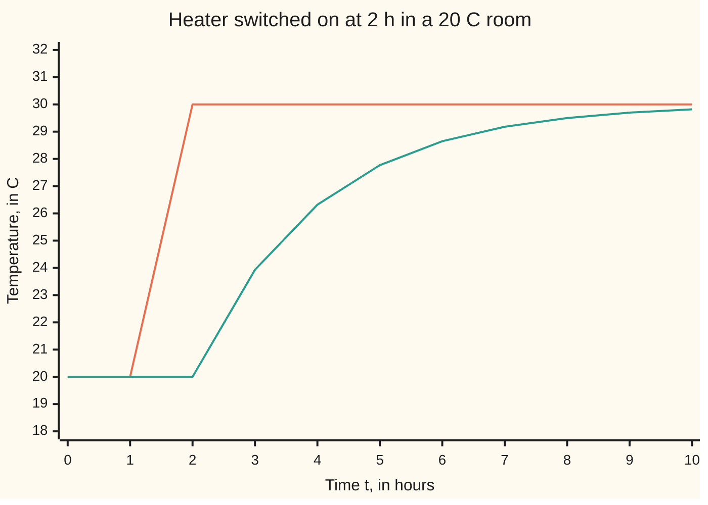

# Step functions: a switch thrown at time a is e^(-as) in transform space

[Syllabus](../../../SYLLABUS.md) → [Differential equations and dynamics](../../../SYLLABUS.md#w08) → [Laplace Transforms for Initial-Value Problems](../../../SYLLABUS.md#w08-s08) → Step functions

---

## General Overview

A room sits at 20 C, the same 20 C room the cooling cards used ([Growth, decay and cooling](../01-Rate%20Equations/04-exponential-growth-decay-and-cooling.md)). Its walls pull it toward a target temperature, at a rate of 0.5 degrees per hour for every degree of gap: the rate constant is 0.5 per hour. Two hours in, a heater switches on and raises that target by 10 C, to 30 C.

After the switch the room climbs toward 30 C: 26.32 C at hour 4, 28.65 C at hour 6. The rate law changes its rule part way through, which is awkward to integrate by hand.

The Laplace transform handles it in one factor: a switch thrown at time a becomes multiplication by e^(−as). The equation is solved as if the heater had always been on; the factor slides the answer two hours later.

**Delaying a signal by a hours multiplies its Laplace transform by e^(−as), and multiplying a signal by e^(ct) slides its transform sideways by c; together they solve any linear constant-coefficient equation whose forcing switches on or off at fixed times.**

**What kind of fact this is:** a theorem, the two shifting rules, proved on this card in Why it works; the unit step itself is a definition.

### The picture: the switch and the room's reply



Orange: the temperature the room is pulled toward, 20 C until 2 h, then 30 C. Teal: the room itself, flat until 2 h, then closing on 30 C. Points sit at whole hours, so the target's jump at 2 h is drawn as a ramp from 1 h. The target jumps; the room bends but does not jump.

---

## The formula

Notation first, in words. The **unit step** $u$ is a switch: it reads 0 before time zero and 1 from time zero on. Shifted, $u(t - a)$ reads 0 before time a and 1 after. A reminder from [The Laplace transform](01-the-laplace-transform.md): the curly $\mathcal{L}$ reads "the transform of", and the capital letter names the result, $F = \mathcal{L}[f]$.

The room, with $T$ its temperature in C and $t$ the time in hours:

$$T' = -0.5\,\bigl(T - 20 - 10\,u(t-2)\bigr), \qquad T(0) = 20$$

The target inside the bracket is 20 C before 2 h and 30 C after. The two rules that solve it:

$$\mathcal{L}\bigl[f(t-a)\,u(t-a)\bigr](s) = e^{-as}\,F(s)$$

$$\mathcal{L}\bigl[e^{ct} f(t)\bigr](s) = F(s-c)$$

**Read it aloud:** restart a signal a hours late and its transform picks up the factor e to the minus a s; multiply a signal by e to the c t and its transform slides by c, rightward when c is positive.

The first is the **delay rule**, the second the **s-shift rule**. With f = 1 the delay rule gives the switch itself:

$$\mathcal{L}\bigl[u(t-a)\bigr](s) = \frac{e^{-as}}{s}$$

| Symbol | Plain meaning | In our example | Push it up and the answer… |
| --- | --- | --- | --- |
| $t$ | time since the start, in hours | 0 to 10 h | — |
| $T$, $x$ | room temperature in C; its excess over 20 C, x = T − 20 | T(4) = 26.3212 C | — |
| $u$ | the unit step: 0 before time zero, 1 from then on | u(t − 2) is the heater | — |
| $a$ | the switch time, the delay, in hours | 2 h | the whole reply slides later |
| $s$ | the transform's fade rate, per hour | s = 1 in the checks | e^(−as) shrinks |
| $f$, $F$, $X$ | a signal and its transform; the transform of the excess x | X(1) = 0.451118 | — |
| $c$ | the rate in the exponential factor e^(ct), per hour | c = −0.5, the room's own fade | F is read further right |
| $M$, $\alpha$ | a growth bound: the size of f stays below M e^(αt) | α = 0 for the room | the rules need a larger s |

### When it holds

- **The delay is forward in time, a ≥ 0.** A negative a asks for the signal before time zero, which the transform never sees.
- **The signal after the switch is written in elapsed time t − a.** Gating a signal already running, u(t − 2) times g(t), is different: its transform is e^(−2s) times that of g(t + 2).
- **s beats the signal's growth.** The integrals must converge: s above α for the delay rule, s − c above α for the s-shift rule.
- **Finitely many switches in any finite stretch.** Each switch adds one delayed term; infinitely many in a finite time falls outside the proof.

---

## Why it works

### Step 0: a late start is a change of clock

A signal that is zero until time a contributes nothing to the transform before a. From a on, measure time from the switch, τ = t − a. The weight e^(−st) becomes e^(−sa) times e^(−sτ): a fixed factor times the weight the signal would have had starting at zero.

### Step 1: the transform of the switch itself

The step u(t − a) is 0 before a and 1 after, so only the part from a onward counts:

$$\int_a^\infty e^{-st}\,dt = \frac{e^{-as}}{s}, \qquad s > 0$$

The heater's forcing, 5u(t − 2) (the 10 C jump in target times the rate 0.5), has transform 5e^(−2s)/s: 0.676676 at s = 1, which a midpoint sum in the checks confirms.

### Step 2: the delay rule

The delayed signal f(t − a)u(t − a) is zero before a. Substitute τ = t − a in what is left:

$$\int_a^\infty e^{-st} f(t-a)\,dt = \int_0^\infty e^{-s(\tau + a)} f(\tau)\,d\tau = e^{-as}\,F(s)$$

The factor e^(−as) comes out of the integral because it does not depend on τ. The minus sign is the weight evaluated a hours later, not a convention.

### Step 3: the s-shift rule

Multiply a signal by e^(ct). Inside the transform the two exponentials combine:

$$\int_0^\infty e^{-st}\,e^{ct} f(t)\,dt = \int_0^\infty e^{-(s-c)t} f(t)\,dt = F(s - c)$$

The room needs it once: the entry 1/s for the constant 1, read at s + 0.5 (so c = −0.5), gives 1/(s + 0.5) for e^(−0.5t). The checks test a case with more shape: e^(−0.5t) times t should have transform 1/(s + 0.5)^2, 0.444444 at s = 1, and a midpoint sum agrees.

<details>
<summary>Detailed proof</summary>

Let f be piecewise continuous on t ≥ 0, with the size of f(t) at most $M$ e^(αt) for all t.

Delay rule. Take a ≥ 0 and s > α. Up to a finite cutoff R > a, the substitution τ = t − a turns the integral of e^(−st) f(t − a) from a to R into e^(−as) times the integral of e^(−sτ) f(τ) from 0 to R − a. That integrand's size is at most M e^(−(s − α)τ), whose integral to infinity is M/(s − α), so the right side converges as R grows ([Improper integrals](../../06-Calculus%20and%20analysis/04-Integrals/07-improper-integrals.md)). The left side equals it at every R, so it has the same limit, e^(−as)F(s).

s-shift rule. Take s with s − c > α. The integrands e^(−st) e^(ct) f(t) and e^(−(s − c)t) f(t) are equal at every t, with size at most M e^(−(s − c − α)t), so both integrals converge to F(s − c).

The step's value at the switch changes one point only and no integral.

</details>

### Step 4: solve the room

Work with the excess over 20 C, x = T − 20, starting at 0: x' = −0.5x + 5u(t − 2). Transform both sides; the rate becomes sX − x(0) = sX ([Transforming a derivative](02-transforms-of-derivatives.md)):

$$sX = -0.5X + \frac{5e^{-2s}}{s} \quad\Longrightarrow\quad X = e^{-2s}\,\frac{5}{s(s + 0.5)}$$

Leave the factor e^(−2s) aside. Split the rest by partial fractions ([Inverting](03-inverting-by-partial-fractions.md)): 5/(s(s + 0.5)) = 10/s − 10/(s + 0.5). The s-shift rule reads 1/(s + 0.5) as e^(−0.5t), so the undelayed answer is 10(1 − e^(−0.5t)), a heater on from the start. The delay rule turns the factor into a two-hour late start:

$$x(t) = 10\,\bigl(1 - e^{-0.5(t-2)}\bigr)\,u(t-2)$$

Back in the room: 20 C exactly until 2 h, then T = 20 + 10(1 − e^(−0.5(t − 2))). It reaches 25 C when e^(−0.5(t − 2)) = 1/2, at t = 2 + 2 ln 2 = 3.386 h.

A second switch is one more term. Turn the heater off at 6 h: the forcing is 5(u(t − 2) − u(t − 6)), and the answer subtracts the same reply delayed 6 h. At 8 h the room is down to 23.1809 C.

Without transforms, the room is solved piece by piece, matching the temperature at each switch; the delay rule does every switch at once.

---

## Worked numbers, by hand

| Step | Arithmetic | Value |
| --- | --- | --- |
| forcing, transformed | 5u(t − 2) becomes 5e^(−2s)/s | 0.676676 at s = 1 |
| solve for X | (s + 0.5)X = 5e^(−2s)/s | X(1) = 5e^(−2)/1.5 = 0.451118 |
| split | 5/(s(s + 0.5)) = 10/s − 10/(s + 0.5) | 10 − 10e^(−0.5t) before the delay |
| apply the delay | replace t by t − 2, times u(t − 2) | x = 10(1 − e^(−0.5(t − 2))) from 2 h |
| one hour after the switch | 20 + 10(1 − e^(−0.5)) | 23.9347 C |
| two hours after | 20 + 10(1 − e^(−1)) | **26.3212 C** |
| four hours after | 20 + 10(1 − e^(−2)) | 28.6466 C |

Two hours after the switch the room reads 26.32 C: the share 1 − e^(−1) of the 10-degree gap, which such a reply closes in one time constant, 1/0.5 hours.

### What breaks if you drop a piece

| Mistake | Comes out at | What went wrong |
| --- | --- | --- |
| Gate the reply without restarting its clock, u(t − 2) times 10(1 − e^(−0.5t)) | T(2) = 26.3212 C, a jump in no time; T(4) = 28.6466 C | the reply started at 0 h |
| e^(+2s) for the delay | T(4) = 29.5021 C | the reply starts 2 h early, at t = −2 |
| 1/(s + 0.5) read as e^(+0.5t) | T(4) = 2.8172 C | the s-shift runs the wrong way |

---

## Code, from first principles, and it actually runs

Two roads that share no step. Road one is the transform answer from Step 4. Road two steps the rate law with Runge-Kutta 4 (four slope samples per step, averaged; [Runge-Kutta four](../05-Numerical%20Evolution/04-runge-kutta-four.md)), with the steps landing on t = 2 h and the heater's state fixed within each step. Halving the step cuts the error by about 16, the method's order 4. Midpoint sums check both rules' integrals directly.

### Python

```python
# Step functions and delays -- the check behind the card.  Only math.exp and
# math.log are imported.  A 20 C room, T' = -0.5(T - 20 - 10u(t - 2)), with the
# heater switched on at t = 2 h.  Road one is the transform answer, built from
# the two shifting rules.  Road two steps the equation with Runge-Kutta 4 and
# never uses a transform.  A midpoint sum checks each rule's integral directly.
from math import exp, log
K, GAIN, ON = 0.5, 10.0, 2.0

def step(t):                                   # the unit step, 1 from t = 0 on
    return 1.0 if t >= 0 else 0.0

def closed(t, off=None):                       # road one: 10(1 - e^(-0.5(t - 2))) u(t - 2)
    x = GAIN * (1 - exp(-K * (t - ON))) * step(t - ON)
    if off is not None: x -= GAIN * (1 - exp(-K * (t - off))) * step(t - off)
    return 20 + x

def rk4(t_end, h, off=None):                   # road two: heater fixed within each step
    T, n = 20.0, round(t_end / h)
    for i in range(n):
        t0 = i * h
        heat = step(t0 - ON + 1e-9) - (step(t0 - off + 1e-9) if off else 0)
        f = lambda T: -K * (T - 20 - GAIN * heat)
        k1 = f(T); k2 = f(T + h / 2 * k1); k3 = f(T + h / 2 * k2); k4 = f(T + h * k3)
        T += h / 6 * (k1 + 2 * k2 + 2 * k3 + k4)
    return T

def transform(g, s, end=40.0, n=40000):        # midpoint sum of e^(-st) g(t)
    dt = end / n
    return sum(exp(-s * (k + 0.5) * dt) * g((k + 0.5) * dt) for k in range(n)) * dt

print("target 20 + 10u(t - 2) at hours 0..10: " + " ".join(f"{20 + GAIN * step(t - ON):.0f}" for t in range(11)))
print("T at hours 0..10: " + " ".join(f"{closed(t):.2f}" for t in range(11)))
print(f"T(3) = {closed(3):.4f}, T(4) = {closed(4):.4f}, T(6) = {closed(6):.4f} C")
print(f"reaches 25 C at t = 2 + 2 ln 2 = {ON + log(2) / K:.3f} h")
errs = [abs(rk4(4, h) - closed(4)) for h in (0.1, 0.05)]
print(f"RK4 T(4) at h = 0.05: {rk4(4, 0.05):.6f}; errors {errs[0]:.1e}, {errs[1]:.1e}; ratio {errs[0] / errs[1]:.1f}")
print(f"on 2 h, off 6 h: T(8) = {closed(8, 6):.4f} closed, {rk4(8, 0.05, 6):.4f} RK4")
X = 5 * exp(-2.0) / (1.0 * 1.5)                # delay rule at s = 1: 5e^(-2s)/(s(s+0.5))
Xn = transform(lambda t: closed(t) - 20, 1.0)
print(f"s = 1: delay rule X = {X:.6f}, midpoint sum of e^(-t)(T - 20) = {Xn:.6f}")
Sn = transform(lambda t: 5 * step(t - ON), 1.0)
print(f"s = 1: forcing 5u(t-2) -> 5e^(-2)/1 = {5 * exp(-2.0):.6f}, midpoint sum {Sn:.6f}")
Fn = transform(lambda t: exp(-K * t) * t, 1.0)
print(f"s = 1: e^(-0.5t) t -> 1/(s+0.5)^2 = {1 / 1.5 ** 2:.6f}, midpoint sum {Fn:.6f}")
print(f"mistake 1, gate without restarting: T(2) = {20 + GAIN * (1 - exp(-K * 2)):.4f}, T(4) = {20 + GAIN * (1 - exp(-K * 4)):.4f}")
print(f"mistake 2, e^(+2s) for the delay: T(4) = {20 + GAIN * (1 - exp(-K * 6)):.4f}")
print(f"mistake 3, 1/(s+0.5) read as e^(+0.5t): T(4) = {20 + GAIN * (1 - exp(K * 2)):.4f}")
assert abs(rk4(4, 0.05) - closed(4)) < 1e-6                     # stepped room = transform answer
assert abs(rk4(8, 0.05, 6) - closed(8, 6)) < 1e-6               # second case: on, then off
assert abs(Xn - X) < 1e-6                                       # delay rule vs direct integral
assert abs(Fn - 1 / 1.5 ** 2) < 1e-6                            # s-shift rule vs direct integral
print("ALL CHECKS PASS")
```

**Ran 2026-09-28 on macOS, Python 3.14.6, standard library only. All checks passed. Output, pasted from the run:**

```
target 20 + 10u(t - 2) at hours 0..10: 20 20 30 30 30 30 30 30 30 30 30
T at hours 0..10: 20.00 20.00 20.00 23.93 26.32 27.77 28.65 29.18 29.50 29.70 29.82
T(3) = 23.9347, T(4) = 26.3212, T(6) = 28.6466 C
reaches 25 C at t = 2 + 2 ln 2 = 3.386 h
RK4 T(4) at h = 0.05: 26.321206; errors 2.0e-07, 1.2e-08; ratio 16.3
on 2 h, off 6 h: T(8) = 23.1809 closed, 23.1809 RK4
s = 1: delay rule X = 0.451118, midpoint sum of e^(-t)(T - 20) = 0.451118
s = 1: forcing 5u(t-2) -> 5e^(-2)/1 = 0.676676, midpoint sum 0.676676
s = 1: e^(-0.5t) t -> 1/(s+0.5)^2 = 0.444444, midpoint sum 0.444444
mistake 1, gate without restarting: T(2) = 26.3212, T(4) = 28.6466
mistake 2, e^(+2s) for the delay: T(4) = 29.5021
mistake 3, 1/(s+0.5) read as e^(+0.5t): T(4) = 2.8172
ALL CHECKS PASS
```

### Rust

Same numbers, same labels, built with `rustc --edition 2021 -O`.

```rust
// Step functions and delays -- the same check as the Python, in Rust.  No
// crates.  A 20 C room, T' = -0.5(T - 20 - 10u(t - 2)), with the heater
// switched on at t = 2 h.  Road one is the transform answer, built from the two
// shifting rules.  Road two steps the equation with Runge-Kutta 4 and never
// uses a transform.  A midpoint sum checks each rule's integral directly.
const K: f64 = 0.5; const GAIN: f64 = 10.0; const ON: f64 = 2.0;

fn step(t: f64) -> f64 { if t >= 0.0 { 1.0 } else { 0.0 } }  // the unit step, 1 from t = 0 on

fn closed(t: f64, off: Option<f64>) -> f64 {               // road one: 10(1 - e^(-0.5(t - 2))) u(t - 2)
    let mut x = GAIN * (1.0 - (-K * (t - ON)).exp()) * step(t - ON);
    if let Some(o) = off { x -= GAIN * (1.0 - (-K * (t - o)).exp()) * step(t - o) }
    20.0 + x
}

fn rk4(t_end: f64, h: f64, off: Option<f64>) -> f64 {    // road two: heater fixed within each step
    let (mut temp, n) = (20.0, (t_end / h).round() as usize);
    for i in 0..n {
        let t0 = i as f64 * h;
        let heat = step(t0 - ON + 1e-9) - off.map_or(0.0, |o| step(t0 - o + 1e-9));
        let f = |x: f64| -K * (x - 20.0 - GAIN * heat);
        let k1 = f(temp); let k2 = f(temp + h / 2.0 * k1);
        let k3 = f(temp + h / 2.0 * k2); let k4 = f(temp + h * k3);
        temp += h / 6.0 * (k1 + 2.0 * k2 + 2.0 * k3 + k4);
    }
    temp
}

fn transform(g: &dyn Fn(f64) -> f64, s: f64) -> f64 {    // midpoint sum of e^(-st) g(t), 0 to 40
    let (end, n) = (40.0, 40000);
    let dt = end / n as f64;
    (0..n).map(|k| { let t = (k as f64 + 0.5) * dt; (-s * t).exp() * g(t) }).sum::<f64>() * dt
}

fn sci(x: f64) -> String {                                // 2.0e-07, as Python prints it
    let t = format!("{:.1e}", x);
    let (m, e) = t.split_once('e').unwrap();
    let e: i32 = e.parse().unwrap();
    format!("{}e{}{:02}", m, if e < 0 { '-' } else { '+' }, e.abs())
}

fn main() {
    let tgt: Vec<String> = (0..11).map(|t| format!("{:.0}", 20.0 + GAIN * step(t as f64 - ON))).collect();
    println!("target 20 + 10u(t - 2) at hours 0..10: {}", tgt.join(" "));
    let row: Vec<String> = (0..11).map(|t| format!("{:.2}", closed(t as f64, None))).collect();
    println!("T at hours 0..10: {}", row.join(" "));
    println!("T(3) = {:.4}, T(4) = {:.4}, T(6) = {:.4} C", closed(3.0, None), closed(4.0, None), closed(6.0, None));
    println!("reaches 25 C at t = 2 + 2 ln 2 = {:.3} h", ON + 2f64.ln() / K);
    let errs: Vec<f64> = [0.1, 0.05].iter().map(|&h| (rk4(4.0, h, None) - closed(4.0, None)).abs()).collect();
    println!("RK4 T(4) at h = 0.05: {:.6}; errors {}, {}; ratio {:.1}",
             rk4(4.0, 0.05, None), sci(errs[0]), sci(errs[1]), errs[0] / errs[1]);
    println!("on 2 h, off 6 h: T(8) = {:.4} closed, {:.4} RK4", closed(8.0, Some(6.0)), rk4(8.0, 0.05, Some(6.0)));
    let big_x = 5.0 * (-2.0f64).exp() / (1.0 * 1.5);           // delay rule at s = 1: 5e^(-2s)/(s(s+0.5))
    let xn = transform(&|t| closed(t, None) - 20.0, 1.0);
    println!("s = 1: delay rule X = {:.6}, midpoint sum of e^(-t)(T - 20) = {:.6}", big_x, xn);
    let sn = transform(&|t| 5.0 * step(t - ON), 1.0);
    println!("s = 1: forcing 5u(t-2) -> 5e^(-2)/1 = {:.6}, midpoint sum {:.6}", 5.0 * (-2.0f64).exp(), sn);
    let fnum = transform(&|t| (-K * t).exp() * t, 1.0);
    println!("s = 1: e^(-0.5t) t -> 1/(s+0.5)^2 = {:.6}, midpoint sum {:.6}", 1.0 / (1.5f64 * 1.5), fnum);
    println!("mistake 1, gate without restarting: T(2) = {:.4}, T(4) = {:.4}",
             20.0 + GAIN * (1.0 - (-K * 2.0).exp()), 20.0 + GAIN * (1.0 - (-K * 4.0).exp()));
    println!("mistake 2, e^(+2s) for the delay: T(4) = {:.4}", 20.0 + GAIN * (1.0 - (-K * 6.0).exp()));
    println!("mistake 3, 1/(s+0.5) read as e^(+0.5t): T(4) = {:.4}", 20.0 + GAIN * (1.0 - (K * 2.0).exp()));
    assert!((rk4(4.0, 0.05, None) - closed(4.0, None)).abs() < 1e-6);        // stepped room = transform answer
    assert!((rk4(8.0, 0.05, Some(6.0)) - closed(8.0, Some(6.0))).abs() < 1e-6); // second case: on, then off
    assert!((xn - big_x).abs() < 1e-6);                                        // delay rule vs direct integral
    assert!((fnum - 1.0 / (1.5f64 * 1.5)).abs() < 1e-6);                       // s-shift rule vs direct integral
    println!("ALL CHECKS PASS");
}
```

**Ran 2026-09-28 on macOS, rustc 1.98.1, no crates. All checks passed. Output, pasted from the run:**

```
target 20 + 10u(t - 2) at hours 0..10: 20 20 30 30 30 30 30 30 30 30 30
T at hours 0..10: 20.00 20.00 20.00 23.93 26.32 27.77 28.65 29.18 29.50 29.70 29.82
T(3) = 23.9347, T(4) = 26.3212, T(6) = 28.6466 C
reaches 25 C at t = 2 + 2 ln 2 = 3.386 h
RK4 T(4) at h = 0.05: 26.321206; errors 2.0e-07, 1.2e-08; ratio 16.3
on 2 h, off 6 h: T(8) = 23.1809 closed, 23.1809 RK4
s = 1: delay rule X = 0.451118, midpoint sum of e^(-t)(T - 20) = 0.451118
s = 1: forcing 5u(t-2) -> 5e^(-2)/1 = 0.676676, midpoint sum 0.676676
s = 1: e^(-0.5t) t -> 1/(s+0.5)^2 = 0.444444, midpoint sum 0.444444
mistake 1, gate without restarting: T(2) = 26.3212, T(4) = 28.6466
mistake 2, e^(+2s) for the delay: T(4) = 29.5021
mistake 3, 1/(s+0.5) read as e^(+0.5t): T(4) = 2.8172
ALL CHECKS PASS
```

The two outputs match line for line.

> [!TIP]
> **Try changing**
> Guess first, then run it.
> - **A stronger heater.** Set `GAIN = 20.0`. The rise doubles and the roads agree, but the third assert stops it: `X` was written for a gain of 10.
> - **A later switch.** Set `ON = 3.0`. The roads agree one hour later, but the third assert stops it: the integral now carries e^(−3s), not the e^(−2s) in `X`.
> - **Steps that miss the switch.** Change both `0.05` in `rk4(4, 0.05)` to `0.16`. The grid misses 2 h, road two switches the heater on late, and the first assert stops it.

---

## The usual mistake

> [!warning]
> **Switching the forcing on without restarting its clock.** The reply 10(1 − e^(−0.5(t − 2))) is measured from the switch. Writing u(t − 2) times 10(1 − e^(−0.5t)) keeps the old clock: the room would jump from 20 C to 26.3212 C at the instant of the switch, which no room can do. Rewrite whatever follows the switch in elapsed time t − a first.
>
> - **The wrong sign on the delay.** e^(+2s) is an advance, not a delay; it gives T(4) = 29.5021 C instead of 26.3212 C.
> - **The s-shift the wrong way round.** 1/(s + 0.5) belongs to e^(−0.5t), a fade. Reading it as e^(+0.5t) sends T(4) to 2.8172 C and falling.

---

## Where you meet it in real life

- **Heating and cooling schedules.** A thermostat timer is a sum of steps, one per switch; each adds a delayed copy of the same reply.
- **Drug infusion.** A drip started at time a and stopped at time b is a rate times u(t − a) − u(t − b); the blood level replies like the room.
- **Control with dead time.** A process that answers only after a lag carries e^(−as), which [Time delays](../../13-Engineering%20mathematics/03-Feedback%20Control/10-smith-predictor-and-time-delays.md) works around.

> **Say it back**
> The unit step is a switch: 0 before time zero, 1 after. Restarting a signal a hours late multiplies its transform by e^(−as), because the weight e^(−st) is e^(−as) times the weight on the restarted clock. Multiplying a signal by e^(ct) turns F(s) into F(s − c). So the room is solved as if the heater had always been on, and e^(−2s) moves the reply two hours later: 26.32 C at hour 4.

---

## What this builds on

- [The round trip](04-solving-an-initial-value-problem-by-transform.md): the round trip (transform, solve, invert) run here with a switched forcing.

## Where this goes next

- [Impulses](06-impulses-and-the-delta-function.md): a switch on and off in a vanishing moment, the dose held fixed.
- [Time delays](../../13-Engineering%20mathematics/03-Feedback%20Control/10-smith-predictor-and-time-delays.md): e^(−as) inside a feedback loop, where delay threatens stability.

---

## Sources

Verified 2026-09-28: every link below resolves to the publisher's page.

- Lebl, Jiří. *Notes on Diffy Qs: Differential Equations for Engineers*, section 6.2. [Section page](https://www.jirka.org/diffyqs/html/transformsofders_section.html). The step, both shifting rules, a switched equation.
- Trench, William F. *Elementary Differential Equations*. Trinity University, 2013. [Publisher page](https://digitalcommons.trinity.edu/mono/8/). The delay rule with its growth hypotheses.
- Dawkins, Paul. "Step Functions." Paul's Online Notes, Lamar University. [Page](https://tutorial.math.lamar.edu/Classes/DE/StepFunctions.aspx). Piecewise signals written with steps.
- Dawkins, Paul. "IVP's With Step Functions." Paul's Online Notes, Lamar University. [Page](https://tutorial.math.lamar.edu/Classes/DE/IVPWithStepFunction.aspx). Worked problems with switched forcing.
