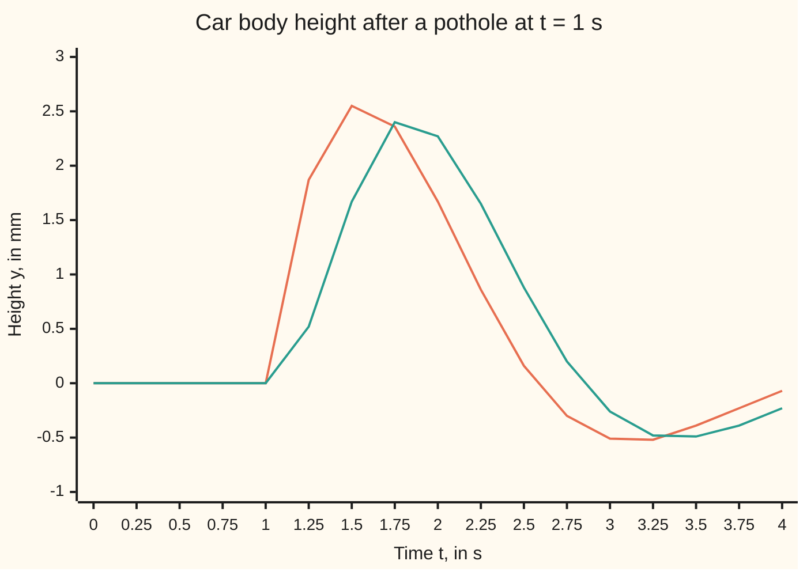

# Impulses: a hammer blow is a narrow tall pulse, its limit is the delta, and its transform is e^(-as)

Differential equations and dynamics → Laplace Transforms for Initial-Value Problems → A blow as a limit → Impulses

---

## General Overview

A car's body rides level and still. At t = 1 s the wheel slams into a pothole's far edge for a few hundredths of a second; the body is kicked up and rings down.

The force during the blow does not matter. Force times duration is the **impulse**; divided by the car's mass it is the change of velocity the blow leaves behind, here 1 cm/s. A blow twice as strong and half as long leaves the same kick. So the model keeps only the area under the force curve and lets the duration shrink to zero. The limit is written δ(t − 1) and read "delta at t = 1": the **delta**, the name used from here on.

The shock absorber's rate law ([transforms-of-derivatives](02-transforms-of-derivatives.md)) becomes y'' + 2y' + 5y = δ(t − 1), with y the height above level in cm, at rest before the blow. Solved by transform: y = 0 up to t = 1 s, then 0.5 e^(−(t−1)) sin 2(t − 1).

**The delta is the limit of pulses keeping area 1 as their width shrinks to zero; it reads off a signal's value at the blow, so its transform is e^(−as), and in a rate law it makes the velocity jump by 1.**

**What kind of fact this is:** a definition, of the delta as a limit of pulses; its transform, the velocity jump and the struck car's motion are then proved on this card in Why it works.

### The picture: the car after the ideal blow and after a half-second push



Orange: the ideal blow, from the formula. Teal: the same push spread over 0.5 s, stepped numerically; it lags and rounds the kick. Heights in mm.

---

## The formula

Notation first, in words. A pulse of width $\varepsilon$ ("epsilon", a small time) starting at time $a$ is written $\delta_\varepsilon(t-a)$: its strength is $1/\varepsilon$ from $a$ to $a+\varepsilon$ and zero elsewhere, so its area is 1. The delta is what these pulses do to a continuous signal $g$ in the limit:

$$\int_0^\infty \delta(t-a)\,g(t)\,dt \;=\; \lim_{\varepsilon\to 0}\int_0^\infty \delta_\varepsilon(t-a)\,g(t)\,dt \;=\; g(a)$$

**Read it aloud:** weighting a signal by the delta at time a and adding up returns the signal's value at a.

Take $g(t) = e^{-st}$ and the transform follows:

$$\mathcal{L}[\delta(t-a)](s) = e^{-as}$$

In a rate law it forces a velocity jump and no position jump, with $a^-$ and $a^+$ meaning just before and just after $a$:

$$y'(a^+) - y'(a^-) = 1, \qquad y(a^+) = y(a^-)$$

For the struck car, at rest before the blow, with $Y$ the transform of the height and the switch $u$ of [step-functions-and-delays](05-step-functions-and-delays.md):

$$Y(s) = \frac{e^{-s}}{s^2+2s+5}, \qquad y(t) = u(t-1)\,\tfrac12\,e^{-(t-1)}\sin 2(t-1)$$

**Read it aloud:** the car sits still until t = 1 s, then leaves level at 1 cm/s and rings down.

| Symbol | Plain meaning | In our example | Push it up and the answer… |
| --- | --- | --- | --- |
| $t$, $y$, $y'$ | time (s); height above level (cm); velocity (cm/s) | peak 0.257099 cm at t = 1.553574 s | — |
| $a$ | the moment of the blow, in s | 1 | the whole response slides later |
| $\varepsilon$, $\delta_\varepsilon$ | a pulse's width (s); the pulse of strength $1/\varepsilon$ | widths 0.5, 0.2, 0.1, 0.05 s | the kick is rounded and late |
| $\delta$ | the delta: the pulses' limit | δ(t − 1), impulse 1 cm/s | — |
| $g$ | any continuous signal the delta acts on | $e^{-st}$ | — |
| $s$, $\mathcal{L}$, $Y$ | fade rate of the weight e^(−st), per s; "the transform of"; the height's transform | s = 2: Y = 0.01041041 | the weight forgets sooner |
| $u$ | the unit step: 0 before its switch time, 1 after | $u(t-1)$ | — |
| $a^-$, $a^+$ | just before and just after the blow | velocity 0, then 1 cm/s | — |

### When it holds

- **The real blow is short next to the car's own times** (a fade like e^(−t), a swing of 2 radians per second). A 0.05 s push misses the ideal by at most 0.023384 cm; a 0.2 s push, by 0.076943 cm.
- **The delta sits inside an integral or a linear rate law.** It has no value at t = 1 s, so squaring it, or multiplying it by a switch jumping at the same moment, means nothing.
- **The blow comes after the start, a > 0.** At a = 0 a convention must place the kick in the starting velocity or the forcing.

---

## Why it works

### Step 0: a short blow is known by its area alone

Per unit of mass, force is the rate of change of velocity, so its area over the blow is the change in velocity. In a very short blow the height cannot move, so spring and damper do nothing: the kick depends on the area alone.

### Step 1: the pulses and their limit

Weighting a continuous signal $g$ by $\delta_\varepsilon(t-a)$ and adding up gives $g$'s average from $a$ to $a+\varepsilon$. As the interval closes, the average tends to $g(a)$.

The delta is not an ordinary function. Away from $a$ the pulses vanish, yet their area stays 1, and no function zero everywhere but one point has area 1. The delta is defined only by what it does inside an integral.

### Step 2: the transform is the weight read at the blow

Put $g(t) = e^{-st}$ in Step 1. The pulse's own transform is exact:

$$\mathcal{L}[\delta_\varepsilon(t-a)](s) = e^{-as}\,\frac{1-e^{-s\varepsilon}}{s\varepsilon}$$

The fraction tends to 1, since $e^{-x}$ is close to $1 - x$ for small $x$. At a = 1 and s = 2 the checks find 0.085548 for width 0.5 s, 0.122661 for 0.1 s, 0.133991 for 0.01 s, closing on $e^{-2}$ = 0.135335.

### Step 3: the blow makes the velocity jump by 1

Add up both sides of $y'' + 2y' + 5y = \delta_\varepsilon(t-1)$ from 1 to $1+\varepsilon$. The left gives the change in velocity, plus 2 times the change in height, plus 5 times the height summed over the pulse. The right gives 1. The velocity stays bounded, so both height terms shrink with $\varepsilon$: in the limit the velocity jumps by exactly 1 and the height does not move. The stepped pulses show it: velocity 0.797072, 0.898817 and 0.949645 cm/s at the end of pulses 0.2, 0.1 and 0.05 s wide.

### Step 4: after the blow, a free ring-down

From t = 1 s on, the forcing is zero and the car starts from height 0 with velocity 1 cm/s. The characteristic roots of $s^2 + 2s + 5$ are $-1 \pm 2i$ ([complex-roots-and-damped-oscillation](../03-Oscillators%20-%20Second-Order%20Linear%20Equations/03-complex-roots-and-damped-oscillation.md)), so the motion is $e^{-(t-1)}$ times a mix of $\cos 2(t-1)$ and $\sin 2(t-1)$. Height 0 kills the cosine; velocity 1 fixes the sine's coefficient at 1/2.

The transform gets there in one pass, with every starting value zero: $(s^2+2s+5)\,Y = e^{-s}$, inverted in Worked numbers by completing the square ([inverting-by-partial-fractions](03-inverting-by-partial-fractions.md)) and delaying by 1 s.

The routes agree for a reason: a velocity jump of 1 at t = 1 s adds an end term $e^{-s}$ to the integration by parts behind the derivative rule, exactly the delta's transform.

<details>
<summary>Detailed proof</summary>

**The pulse limit.** Let $g$ be continuous near $a$. The weighted sum is $g$'s average from $a$ to $a+\varepsilon$, so it lies within the largest $\lvert g(t) - g(a)\rvert$ on that interval of $g(a)$. By continuity, for every tolerance there is a width below which that is under the tolerance. For $g(t) = e^{-st}$ with real $s > 0$, $(1 - e^{-x})/x$ lies between $1 - x/2$ and 1 for $x > 0$.

**The jump.** Let $y_\varepsilon$ solve the equation with the pulse, from rest. Its speed stays at most $V = 1$: the energy $\tfrac12 y'^2 + \tfrac52 y^2$ changes at rate $y'$ times the forcing minus $2y'^2$, so the square root of twice the energy, which bounds the speed, grows no faster than the forcing, whose total is 1. The height then moves by at most $V\varepsilon$ over the pulse. Adding up the equation over the pulse gives $y_\varepsilon'(1+\varepsilon) = 1 - 2y_\varepsilon(1+\varepsilon) - 5\int_1^{1+\varepsilon} y_\varepsilon\,dt$, so the velocity at the pulse's end is within $2V\varepsilon + 5V\varepsilon^2$ of 1 and the height within $V\varepsilon$ of 0.

**The motion converges.** After the pulse the car moves freely. Free motion depends linearly on its starting height and velocity and fades, so it differs from the ideal by at most a constant times $\varepsilon$, plus a start lagging by $\varepsilon$. Halving the width roughly halves the error: the checks print ratios 1.76 and 1.87.

</details>

Another route treats any forcing as a sum of small blows and the response as a sum of ring-downs: [convolution-and-the-impulse-response](07-convolution-and-the-impulse-response.md).

---

## Worked numbers, by hand

| Step | Arithmetic | Value |
| --- | --- | --- |
| transform the rate law, from rest | $(s^2+2s+5)\,Y = e^{-s}$ | $Y = e^{-s}/(s^2+2s+5)$ |
| complete the square | $s^2+2s+5 = (s+1)^2+4$ | roots $-1 \pm 2i$ |
| undelayed piece | $1/((s+1)^2+4)$, by the table of pairs | $\tfrac12 e^{-t}\sin 2t$ |
| delay by the blow's time | replace t by t − 1, switch on with $u(t-1)$ | $y = u(t-1)\,\tfrac12 e^{-(t-1)}\sin 2(t-1)$ |
| velocity just after | $\tfrac12(2\cos 0 - \sin 0)$ | **1 cm/s** |
| top of the kick | $\tan 2(t-1) = 2$, the velocity's zero | **0.257099 cm at t = 1.553574 s** |
| check at s = 2 | $e^{-2}/13$ against the weighted sum of y | 0.01041041 both ways |

The pothole lifts the body a quarter of a centimetre, just over half a second after the blow.

### What breaks if you drop a piece

| Mistake | Comes out at | What went wrong |
| --- | --- | --- |
| Pulse strength held at 1 while the width shrinks to 0.01 s | peak 0.002571 cm instead of 0.257099 | the area shrank to 0.01; a delta keeps area 1 |
| Delay dropped: transform of δ(t − 1) taken as 1 | y(1.5) = 0.015744 cm instead of 0.255189 | the kick lands at t = 0, not at t = 1 s |
| Switch $u(t-1)$ dropped from the answer | y(0.5) = −0.693676 cm instead of 0 | the formula runs backwards: the car moves before the pothole |

The code prints all three.

---

## Code, from first principles, and it actually runs

Road one is the transform's answer. Road two never uses a delta: it pushes with pulses of area 1, widths 0.2, 0.1 and 0.05 s, stepped by Runge-Kutta 4 (four slope samples per step, averaged; [runge-kutta-four](../05-Numerical%20Evolution/04-runge-kutta-four.md)) with pulse edges on step boundaries. Midpoint sums check both transforms.

### Python

```python
# Impulses and the delta function -- the check behind the card.  Only math is
# imported, for exp, sin, cos and atan.  The car body hits a pothole at t = 1 s:
# y'' + 2y' + 5y = delta(t - 1), at rest before it.  Road one is the transform
# answer y = u(t - 1) 0.5 e^(-(t-1)) sin 2(t - 1).  Road two never uses a delta:
# it pushes with a pulse of area 1, strength 1/eps for eps seconds, stepped by RK4.
from math import exp, sin, cos, atan
A, S, H = 1.0, 2.0, 0.0005

def ideal(t):                                   # road one: the transform's answer
    return 0.0 if t < A else 0.5 * exp(-(t - A)) * sin(2 * (t - A))

def pulse_run(eps, area=1.0, t_end=6.0):        # road two: RK4, force held per step
    y, v, ys, vs = 0.0, 0.0, [], []
    for n in range(round(t_end / H) + 1):
        ys.append(y); vs.append(v)
        f = area / eps if A <= (n + 0.5) * H < A + eps else 0.0
        rate = lambda y, v: (v, f - 2 * v - 5 * y)
        k1 = rate(y, v)
        k2 = rate(y + H / 2 * k1[0], v + H / 2 * k1[1])
        k3 = rate(y + H / 2 * k2[0], v + H / 2 * k2[1])
        k4 = rate(y + H * k3[0], v + H * k3[1])
        y += H / 6 * (k1[0] + 2 * k2[0] + 2 * k3[0] + k4[0])
        v += H / 6 * (k1[1] + 2 * k2[1] + 2 * k3[1] + k4[1])
    return ys, vs

for eps in (0.5, 0.1, 0.01):                    # the pulse's transform, two ways
    n = 1000; d = eps / n
    mid = sum(exp(-S * (A + (k + 0.5) * d)) / eps * d for k in range(n))
    exact = exp(-S * A) * (1 - exp(-S * eps)) / (S * eps)
    print(f"pulse eps = {eps}: transform at s = 2 midpoint {mid:.6f}, formula {exact:.6f}")
    assert abs(mid - exact) < 1e-8
print(f"limit e^(-as) at a = 1, s = 2: {exp(-S * A):.6f}")
lap = sum(exp(-S * (A + (k + 0.5) * 0.001)) * ideal(A + (k + 0.5) * 0.001) * 0.001 for k in range(20000))
print(f"transform of y at s = 2: midpoint sum {lap:.8f}, e^(-2)/13 = {exp(-2) / 13:.8f}")
assert abs(lap - exp(-2) / 13) < 1e-7
errs = []
for eps in (0.2, 0.1, 0.05):
    ys, vs = pulse_run(eps)
    errs.append(max(abs(ys[n] - ideal(n * H)) for n in range(len(ys))))
    v_after = vs[round((A + eps) / H)]
    print(f"RK4 pulse eps = {eps}: worst height error {errs[-1]:.6f} cm, velocity at pulse end {v_after:.6f} cm/s")
    assert errs[-1] < eps and abs(v_after - 1) < 1.5 * eps
print(f"error ratios as eps halves: {errs[0] / errs[1]:.2f}, {errs[1] / errs[2]:.2f} (order 1 in eps)")
assert all(1.7 < errs[i] / errs[i + 1] < 2.3 for i in range(2))
tp = A + atan(2) / 2
grid_peak = max(ideal(A + k * 1e-5) for k in range(200000))
print(f"ideal: velocity 0 before, {0.5 * (2 * cos(0) - sin(0)):.6f} after; peak {ideal(tp):.6f} cm at t = {tp:.6f} (grid max {grid_peak:.6f})")
wide = pulse_run(0.5)[0]
print("figure, t    " + " ".join(f"{0.25 * k:5.2f}" for k in range(17)))
print("figure, ideal" + " ".join(f"{10 * ideal(0.25 * k):5.2f}" for k in range(17)) + " mm")
print("figure, 0.5 s" + " ".join(f"{10 * wide[round(0.25 * k / H)]:5.2f}" for k in range(17)) + " mm")
flat = max(pulse_run(0.01, area=0.01)[0])
print(f"mistake 1, strength 1 for 0.01 s: area 0.01, peak {flat:.6f} cm instead of {ideal(tp):.6f}")
print(f"mistake 2, delay dropped: y(1.5) = {0.5 * exp(-1.5) * sin(3):.6f} cm instead of {ideal(1.5):.6f}")
print(f"mistake 3, switch u(t - 1) dropped: y(0.5) = {0.5 * exp(0.5) * sin(-1):.6f} cm instead of {ideal(0.5):.6f}")
print("ALL CHECKS PASS")
```

**Ran 2026-09-28 on macOS, Python 3.14.6, standard library only. All checks passed. Output, pasted from the run:**

```
pulse eps = 0.5: transform at s = 2 midpoint 0.085548, formula 0.085548
pulse eps = 0.1: transform at s = 2 midpoint 0.122661, formula 0.122661
pulse eps = 0.01: transform at s = 2 midpoint 0.133991, formula 0.133991
limit e^(-as) at a = 1, s = 2: 0.135335
transform of y at s = 2: midpoint sum 0.01041041, e^(-2)/13 = 0.01041041
RK4 pulse eps = 0.2: worst height error 0.076943 cm, velocity at pulse end 0.797072 cm/s
RK4 pulse eps = 0.1: worst height error 0.043762 cm, velocity at pulse end 0.898817 cm/s
RK4 pulse eps = 0.05: worst height error 0.023384 cm, velocity at pulse end 0.949645 cm/s
error ratios as eps halves: 1.76, 1.87 (order 1 in eps)
ideal: velocity 0 before, 1.000000 after; peak 0.257099 cm at t = 1.553574 (grid max 0.257099)
figure, t     0.00  0.25  0.50  0.75  1.00  1.25  1.50  1.75  2.00  2.25  2.50  2.75  3.00  3.25  3.50  3.75  4.00
figure, ideal 0.00  0.00  0.00  0.00  0.00  1.87  2.55  2.36  1.67  0.86  0.16 -0.30 -0.51 -0.52 -0.39 -0.23 -0.07 mm
figure, 0.5 s 0.00  0.00  0.00  0.00  0.00  0.52  1.67  2.40  2.27  1.65  0.88  0.20 -0.26 -0.48 -0.49 -0.39 -0.23 mm
mistake 1, strength 1 for 0.01 s: area 0.01, peak 0.002571 cm instead of 0.257099
mistake 2, delay dropped: y(1.5) = 0.015744 cm instead of 0.255189
mistake 3, switch u(t - 1) dropped: y(0.5) = -0.693676 cm instead of 0.000000
ALL CHECKS PASS
```

### Rust

Same numbers, same labels, built with `rustc --edition 2021 -O`.

```rust
// Impulses and the delta function -- the same check as the Python, in Rust.
// No crates.  The car body hits a pothole at t = 1 s: y'' + 2y' + 5y =
// delta(t - 1), at rest before it.  Road one is the transform answer
// y = u(t - 1) 0.5 e^(-(t-1)) sin 2(t - 1).  Road two never uses a delta: it
// pushes with a pulse of area 1, strength 1/eps for eps seconds, stepped by RK4.
const A: f64 = 1.0; const S: f64 = 2.0; const H: f64 = 0.0005;

fn ideal(t: f64) -> f64 {                          // road one: the transform's answer
    if t < A { 0.0 } else { 0.5 * (-(t - A)).exp() * (2.0 * (t - A)).sin() }
}

fn pulse_run(eps: f64, area: f64) -> (Vec<f64>, Vec<f64>) { // road two: RK4, force held per step
    let (mut y, mut v, mut ys, mut vs) = (0.0_f64, 0.0_f64, Vec::new(), Vec::new());
    for n in 0..=(6.0 / H).round() as usize {
        ys.push(y); vs.push(v);
        let tm = (n as f64 + 0.5) * H;
        let f = if A <= tm && tm < A + eps { area / eps } else { 0.0 };
        let rate = |y: f64, v: f64| (v, f - 2.0 * v - 5.0 * y);
        let k1 = rate(y, v);
        let k2 = rate(y + H / 2.0 * k1.0, v + H / 2.0 * k1.1);
        let k3 = rate(y + H / 2.0 * k2.0, v + H / 2.0 * k2.1);
        let k4 = rate(y + H * k3.0, v + H * k3.1);
        y += H / 6.0 * (k1.0 + 2.0 * k2.0 + 2.0 * k3.0 + k4.0);
        v += H / 6.0 * (k1.1 + 2.0 * k2.1 + 2.0 * k3.1 + k4.1);
    }
    (ys, vs)
}

fn main() {
    for eps in [0.5_f64, 0.1, 0.01] {                // the pulse's transform, two ways
        let d = eps / 1000.0;
        let mid: f64 = (0..1000).map(|k| (-S * (A + (k as f64 + 0.5) * d)).exp() / eps * d).sum();
        let exact = (-S * A).exp() * (1.0 - (-S * eps).exp()) / (S * eps);
        println!("pulse eps = {}: transform at s = 2 midpoint {:.6}, formula {:.6}", eps, mid, exact);
        assert!((mid - exact).abs() < 1e-8);
    }
    println!("limit e^(-as) at a = 1, s = 2: {:.6}", (-S * A).exp());
    let lap: f64 = (0..20000).map(|k| { let t = A + (k as f64 + 0.5) * 0.001; (-S * t).exp() * ideal(t) * 0.001 }).sum();
    println!("transform of y at s = 2: midpoint sum {:.8}, e^(-2)/13 = {:.8}", lap, (-2.0_f64).exp() / 13.0);
    assert!((lap - (-2.0_f64).exp() / 13.0).abs() < 1e-7);
    let mut errs: Vec<f64> = Vec::new();
    for eps in [0.2_f64, 0.1, 0.05] {
        let (ys, vs) = pulse_run(eps, 1.0);
        errs.push((0..ys.len()).map(|n| (ys[n] - ideal(n as f64 * H)).abs()).fold(0.0, f64::max));
        let v_after = vs[((A + eps) / H).round() as usize];
        println!("RK4 pulse eps = {}: worst height error {:.6} cm, velocity at pulse end {:.6} cm/s", eps, errs[errs.len() - 1], v_after);
        assert!(errs[errs.len() - 1] < eps && (v_after - 1.0).abs() < 1.5 * eps);
    }
    println!("error ratios as eps halves: {:.2}, {:.2} (order 1 in eps)", errs[0] / errs[1], errs[1] / errs[2]);
    assert!((0..2).all(|i| 1.7 < errs[i] / errs[i + 1] && errs[i] / errs[i + 1] < 2.3));
    let tp = A + 2.0_f64.atan() / 2.0;
    let grid_peak = (0..200000).map(|k| ideal(A + k as f64 * 1e-5)).fold(f64::MIN, f64::max);
    println!("ideal: velocity 0 before, {:.6} after; peak {:.6} cm at t = {:.6} (grid max {:.6})",
             0.5 * (2.0 * 0.0_f64.cos() - 0.0_f64.sin()), ideal(tp), tp, grid_peak);
    let wide = pulse_run(0.5, 1.0).0;
    let row = |g: &dyn Fn(usize) -> f64| (0..17).map(|k| format!("{:5.2}", g(k))).collect::<Vec<_>>().join(" ");
    println!("figure, t    {}", row(&|k| 0.25 * k as f64));
    println!("figure, ideal{} mm", row(&|k| 10.0 * ideal(0.25 * k as f64)));
    println!("figure, 0.5 s{} mm", row(&|k| 10.0 * wide[(0.25 * k as f64 / H).round() as usize]));
    let flat = pulse_run(0.01, 0.01).0.into_iter().fold(f64::MIN, f64::max);
    println!("mistake 1, strength 1 for 0.01 s: area 0.01, peak {:.6} cm instead of {:.6}", flat, ideal(tp));
    println!("mistake 2, delay dropped: y(1.5) = {:.6} cm instead of {:.6}", 0.5 * (-1.5_f64).exp() * 3.0_f64.sin(), ideal(1.5));
    println!("mistake 3, switch u(t - 1) dropped: y(0.5) = {:.6} cm instead of {:.6}", 0.5 * 0.5_f64.exp() * (-1.0_f64).sin(), ideal(0.5));
    println!("ALL CHECKS PASS");
}
```

**Ran 2026-09-28 on macOS, rustc 1.98.1, no crates. All checks passed. Output, pasted from the run:**

```
pulse eps = 0.5: transform at s = 2 midpoint 0.085548, formula 0.085548
pulse eps = 0.1: transform at s = 2 midpoint 0.122661, formula 0.122661
pulse eps = 0.01: transform at s = 2 midpoint 0.133991, formula 0.133991
limit e^(-as) at a = 1, s = 2: 0.135335
transform of y at s = 2: midpoint sum 0.01041041, e^(-2)/13 = 0.01041041
RK4 pulse eps = 0.2: worst height error 0.076943 cm, velocity at pulse end 0.797072 cm/s
RK4 pulse eps = 0.1: worst height error 0.043762 cm, velocity at pulse end 0.898817 cm/s
RK4 pulse eps = 0.05: worst height error 0.023384 cm, velocity at pulse end 0.949645 cm/s
error ratios as eps halves: 1.76, 1.87 (order 1 in eps)
ideal: velocity 0 before, 1.000000 after; peak 0.257099 cm at t = 1.553574 (grid max 0.257099)
figure, t     0.00  0.25  0.50  0.75  1.00  1.25  1.50  1.75  2.00  2.25  2.50  2.75  3.00  3.25  3.50  3.75  4.00
figure, ideal 0.00  0.00  0.00  0.00  0.00  1.87  2.55  2.36  1.67  0.86  0.16 -0.30 -0.51 -0.52 -0.39 -0.23 -0.07 mm
figure, 0.5 s 0.00  0.00  0.00  0.00  0.00  0.52  1.67  2.40  2.27  1.65  0.88  0.20 -0.26 -0.48 -0.49 -0.39 -0.23 mm
mistake 1, strength 1 for 0.01 s: area 0.01, peak 0.002571 cm instead of 0.257099
mistake 2, delay dropped: y(1.5) = 0.015744 cm instead of 0.255189
mistake 3, switch u(t - 1) dropped: y(0.5) = -0.693676 cm instead of 0.000000
ALL CHECKS PASS
```

The two outputs match line for line.

> [!TIP]
> **Try changing**
> Guess first, then run it.
> - **Hit the pothole later.** Set `A` to 2.0. The ring-down slides 1 s later and keeps its shape; the transform assert stops the program, because the right value is now $e^{-4}/13$, not $e^{-2}/13$.
> - **Widen the pulses.** Change the widths to `(0.4, 0.2, 0.1)`. The first error ratio falls below 1.7 and the order assert stops it: first-order behaviour needs pulses short next to the car's own times.
> - **Double the blow.** Call `pulse_run(eps, area=2.0)` in the error loop. The velocity at the pulse's end nears 2 cm/s instead of 1, and an assert stops it: the jump equals the area.

---

## The usual mistake

> [!warning]
> **Thinking of the delta as a huge number at t = 1 s.** A value at one instant changes no integral, so it kicks nothing. What survives the limit is the area, a velocity jump of 1 cm/s. Keep the pulse's strength at 1 as it narrows and a pulse 0.01 s wide lifts the car only 0.002571 cm.
>
> - **Dropping the delay.** The transform of δ(t − 1) is $e^{-s}$, not 1; taking 1 moves the blow to t = 0.
> - **Dropping the switch.** Without $u(t-1)$ the car moves before it reaches the pothole.
> - **Putting the jump in the height.** A blow changes velocity; a jump in height would need infinite velocity.

---

## Where you meet it in real life

- **Suspension design.** Potholes and kerbs are modelled as impulses; the ring-down judges the damper.
- **Hammer testing.** Engineers strike a bridge or machine frame with an instrumented hammer; the ring-down characterises the structure ([linear-time-invariant-systems-and-convolution](../../13-Engineering%20mathematics/02-Linear%20Systems%20and%20Transforms/01-linear-time-invariant-systems-and-convolution.md)).
- **Drug doses.** A quick injection enters a compartment model as a delta in the dose rate: the amount in the blood jumps, then decays.

> **Say it back**
> A short blow is known by its area, the velocity change it leaves. The delta is the limit of pulses keeping area 1 as they narrow. It reads off a signal's value at the blow, so its transform is e^(−as). In a rate law it makes the velocity jump by 1; the struck car leaves level at 1 cm/s and rings down.

---

## What this builds on

- [step-functions-and-delays](05-step-functions-and-delays.md): the switch $u(t-a)$ and the delay rule that turns a factor $e^{-as}$ into a shift in time.

## Where this goes next

- [convolution-and-the-impulse-response](07-convolution-and-the-impulse-response.md): any forcing as a sum of blows, and the response as a sum of ring-downs.
- [linear-time-invariant-systems-and-convolution](../../13-Engineering%20mathematics/02-Linear%20Systems%20and%20Transforms/01-linear-time-invariant-systems-and-convolution.md): the impulse response as the full description of a linear system.
- the-dirac-delta-and-derivatives-of-jumps: the delta as a rule on smooth test signals, and the derivative of a step.
- schwartz-space-and-tempered-distributions: the delta under the Fourier transform.

---

## Sources

Verified 28 Sep 2026: each link opens a page naming the cited work.

- Boyce, William E., Richard C. DiPrima and Douglas B. Meade. *Elementary Differential Equations*, 11th ed., Enhanced eText. Wiley. [Publisher page](https://www.wiley.com/en-us/Elementary+Differential+Equations+and+Boundary+Value+Problems%2C+11th+Edition-p-9781119320630). Impulse functions: the delta as a limit of unit-area pulses, struck oscillators solved by transform.
- Strang, Gilbert. *Differential Equations and Linear Algebra*. Wellesley-Cambridge Press. [Book website](https://math.mit.edu/dela/). The delta function and the impulse response.
- MIT OpenCourseWare, 18.03SC *Differential Equations*, Fall 2011. [Laplace Transform: Basics](https://ocw.mit.edu/courses/18-03sc-differential-equations-fall-2011/pages/unit-iii-fourier-series-and-laplace-transform/laplace-transform-basics/). Free notes on the delta function and its transform.
