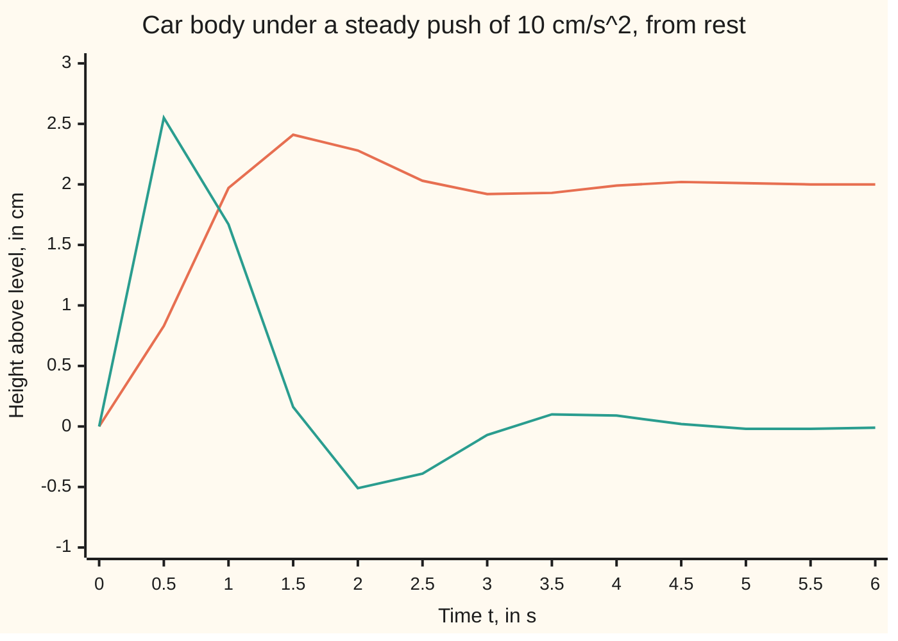

# Convolution: the response to any input is the impulse response blended with that input

Differential equations and dynamics → Laplace Transforms for Initial-Value Problems → Blending an input through a response → Convolution

---

## General Overview

A car's body rests at its level height. Tap it once from below, a sharp kick that sets it moving upward at 1 cm/s, and it bobs and settles. Per unit of mass the rate law is y'' + 2y' + 5y = f(t): y is the height above level in cm, t the time in seconds, and f the push from the road in cm/s^2. The motion after that single kick is 0.5 e^(−t) sin 2t cm. It is called the **impulse response**, the word used from here on.

Now push steadily, 10 cm/s^2 from t = 0 on. A steady push is a run of tiny kicks. The car answers each with a copy of the impulse response, started at that kick and scaled by its size. Adding the copies gives the motion: at t = 1 s the body is 1.971672 cm up, as the round trip through the transform says ([solving-an-initial-value-problem-by-transform](04-solving-an-initial-value-problem-by-transform.md)).

That adding-up of shifted, scaled copies is **convolution**. Measure the impulse response once, and any other push is an integral away.

**For a linear equation with constant coefficients, started at rest, the response to any input is the impulse response convolved with that input; under the Laplace transform the convolution becomes a plain product.**

**What kind of fact this is:** a theorem, proved on this card in Why it works; the transform half is the convolution theorem, proved on its own card, with the one-sided version in a folded Detailed proof.

### The picture: a steady push, blended and unblended



Orange: the convolution, overshooting to 2.41 cm and settling at 2 cm. Teal: the pointwise product 10 g(t), which dies away and is wrong. Both checks print every point.

---

## The formula

Notation first, in words. A star between two signals, $g * f$, means "g convolved with f": a sliding integral, not multiplication. The letter $\tau$ (tau) marks the moment of one earlier kick.

$$(g * f)(t) = \int_0^t g(t-\tau)\, f(\tau)\, d\tau$$

**Read it aloud:** the response at time t adds up the push at every earlier moment τ, each weighted by the impulse response at its age, t − τ.

The solution of the forced equation, started at rest:

$$y = g * f, \qquad Y(s) = G(s)\,F(s), \qquad G(s) = \frac{1}{P(s)} = \frac{1}{s^2 + 2s + 5}$$

**Read it aloud:** the motion is the impulse response convolved with the push; its transform is the transform of the impulse response times the transform of the push.

| Symbol | Plain meaning | In our example | Push it up and the answer… |
| --- | --- | --- | --- |
| $t$, $\tau$ | the time of reading; the time of one earlier kick, in s | t = 1 s; τ runs from 0 to 1 s | — |
| $f$ | the push from the road, per unit mass, in cm/s^2 | 10 from t = 0 on | the motion scales with it |
| $g$ | the impulse response: height in cm after a kick to 1 cm/s | 0.5 e^(−t) sin 2t; 0.167256 at t = 1 s | — |
| $y$ | the height above level, in cm | 1.971672 at t = 1 s | — |
| $s$ | the transform's fading rate, per second | s = 1 in the check | — |
| $F$, $G$, $Y$ | the transforms of f, g and y | G(s) = 1/(s^2 + 2s + 5) | — |
| $P$ | the characteristic polynomial s^2 + 2s + 5 | P(0) = 5 | a stiffer spring, smaller G |
| $\delta$ | the impulse: a kick of total size 1, delivered at an instant | its transform is 1 | — |

### When it holds

- **Linear.** Twice the push gives twice the motion; two pushes give the sum of their motions. A spring that stiffens as it stretches breaks this, and the copies no longer add up.
- **Constant coefficients.** A later kick gets the same answer, only later. For y' + t y = f the damping grows with the clock, so the response depends on when the kick came and no single g exists.
- **Started at rest.** The convolution is the forced part alone. Released from 1 cm and pushed, the car is at 1.985836 cm at t = 1 s, not 1.971672; the free motion must be added.
- **An input that can be integrated.** The transform road also needs f to grow no faster than an exponential.

---

## Why it works

### Step 0: a push is a crowd of small kicks

Slice time into short intervals of length dτ. Over the slice at τ the push adds f(τ)dτ cm/s to the velocity: a small kick. Linearity and constant coefficients say the car answers it with g scaled by f(τ)dτ and started at τ, so at time t its effect is g(t − τ) f(τ) dτ. Adding the slices gives the integral; Steps 1 to 3 prove it.

### Step 1: the impulse response is the transform of 1 over P

An impulse $\delta$ at time 0 transforms to 1 ([impulses-and-the-delta-function](06-impulses-and-the-delta-function.md)). With the car at rest, the transformed equation reads (s^2 + 2s + 5)G = 1, so G = 1/((s + 1)^2 + 4). The pair 2/((s + 1)^2 + 4) ↔ e^(−t) sin 2t, halved, inverts it to 0.5 e^(−t) sin 2t. In time, g solves the free equation with g(0) = 0 and g'(0) = 1: the kick leaves the height at 0 and the velocity at 1 cm/s.

### Step 2: for any push, Y is G times F

At rest, the transformed equation for a push f is P(s)Y = F(s), so Y = G F. G belongs to the car alone; engineers call it the transfer function.

### Step 3: a product of transforms is the transform of a convolution

The convolution theorem says the transform of g * f is G times F ([convolution-theorem](../../07-Complex%20analysis/08-Transforms%20in%20Outline/04-convolution-theorem.md)). Since a transform pins down its signal, y = g * f. The one-sided version follows by swapping the order of integration over a triangle ([double-integrals](../../06-Calculus%20and%20analysis/08-Multiple%20Integrals/01-double-integrals.md)).

<details>
<summary>Detailed proof</summary>

**The transform of a convolution.** Let g and f be piecewise continuous with size at most M e^(at). For s above a,

$$\int_0^\infty e^{-st}\int_0^t g(t-\tau) f(\tau)\,d\tau\,dt = \int_0^\infty f(\tau)\int_\tau^\infty e^{-st} g(t-\tau)\,dt\,d\tau .$$

Both sides cover the region 0 ≤ τ ≤ t. The absolute integrand is at most M^2 e^(−(s − a)t); integrated over τ from 0 to t it is at most M^2 t e^(−(s − a)t), which has a finite integral, so the swap is allowed. Putting u = t − τ turns the inner integral into e^(−sτ) G(s), leaving G(s) times the transform of f.

**The formula solves the equation, with no transform.** Let f be continuous and y = g * f. Differentiating an integral whose limit and integrand both depend on t gives the integrand at τ = t plus the integral of the t-derivative ([differentiating-under-the-integral](../../06-Calculus%20and%20analysis/08-Multiple%20Integrals/05-differentiating-under-the-integral.md)):

y'(t) = g(0) f(t) + ∫ g'(t − τ) f(τ) dτ = ∫ g'(t − τ) f(τ) dτ, since g(0) = 0.

y''(t) = g'(0) f(t) + ∫ g''(t − τ) f(τ) dτ = f(t) + ∫ g''(t − τ) f(τ) dτ, since g'(0) = 1.

Then y'' + 2y' + 5y = f(t) + ∫ (g'' + 2g' + 5g)(t − τ) f(τ) dτ = f(t), because g solves the free equation. At t = 0 both integrals run over nothing, so y(0) = y'(0) = 0. The solution from rest is unique, so it is g * f.

</details>

### Step 4: the warm-up, both ways

By hand, e^(−t) * e^(−2t) = ∫ from 0 to t of e^(−τ) e^(−2(t − τ)) dτ = e^(−2t)(e^t − 1) = e^(−t) − e^(−2t). By transform, 1/(s + 1) times 1/(s + 2) splits into 1/(s + 1) − 1/(s + 2), which inverts to the same. At s = 1 both are 1/6.

### Step 5: the steady push reproduces the round trip

With f = 10, substitute u = t − τ: y(t) = 10 ∫ from 0 to t of g(u) du = 5 ∫ e^(−u) sin 2u du. The integral of e^(−u) sin 2u from 0 to t is (2 − e^(−t)(sin 2t + 2 cos 2t))/5. So

$$y(t) = 2 - e^{-t}\,(2\cos 2t + \sin 2t),$$

the round-trip answer, reached without splitting G F = 10/(s(s^2 + 2s + 5)) into partial fractions.

Another road: variation of constants ([forced-systems-and-variation-of-constants](../04-Systems%20and%20the%20Matrix%20Exponential/06-forced-systems-and-variation-of-constants.md)) writes the forced solution of x' = Ax + b f as ∫ e^(A(t − τ)) b f(τ) dτ; for the car as a height-and-velocity system, the height entry of e^(At) b is g.

---

## Worked numbers, by hand

| Step | Arithmetic | Value |
| --- | --- | --- |
| warm-up at t = 1 s | e^(−1) − e^(−2) | **0.232544** |
| warm-up transforms at s = 1 | (1/2)(1/3), and 1/2 − 1/3 | 0.166667 both ways |
| impulse response at t = 1 s | 0.5 e^(−1) sin 2 | 0.167256 cm |
| steady push at t = 1 s | 2 − e^(−1)(2 cos 2 + sin 2) | **1.971672 cm** |
| long after | 10/P(0) = 10/5 | **2 cm** |

The body ends 2 cm up, as a spring of stiffness 5 under a load of 10 must; the convolution also shows the overshoot on the way.

### What breaks if you drop a piece

| Mistake | Comes out at | What went wrong |
| --- | --- | --- |
| Multiply the signals: e^(−t) × e^(−2t) at t = 1 s | e^(−3) = 0.049787, not 0.232544 | a convolution adds over every earlier moment |
| No flip: e^(−2τ) in place of e^(−2(t − τ)) | 0.316738, not 0.232544 | each kick must be weighted by its age, t − τ |
| Released from 1 cm, pushed, convolution alone | 1.971672, not 1.985836 cm | the free motion from the start was left out |

The code prints all three.

---

## Code, from first principles, and it actually runs

Two roads sharing no step. Road one blends: a midpoint sum (slices, each sampled at its centre) of g(t − τ) f(τ). Road two never mentions g: it steps the equation with Runge-Kutta 4 ([runge-kutta-four](../05-Numerical%20Evolution/04-runge-kutta-four.md)). The kick is stepped from height 0 and velocity 1; its error falls by about 16 when the step halves, the method's order 4.

### Python

```python
# Convolution and the impulse response -- the check behind the card.  Only
# math.exp, sin and cos are imported.  The shock absorber: y'' + 2y' + 5y = f(t),
# starting at rest.  Road one blends the impulse response with the input by a
# midpoint sum; road two steps the equation itself with Runge-Kutta 4.
from math import exp, sin, cos

def conv(a, b, t, n=4000):                # (a * b)(t): add a(tau) b(t - tau) over 0..t
    w = t / n
    return w * sum(a((k + 0.5) * w) * b(t - (k + 0.5) * w) for k in range(n))

def rk4(push, y, v, h, t_end):            # y'' = push - 2y' - 5y, states at every 0.5 s
    acc, out, every = lambda y, v: push - 2 * v - 5 * y, [], round(0.5 / h)
    for n in range(round(t_end / h) + 1):
        if n % every == 0: out.append(y)
        k1 = (v, acc(y, v)); k2 = (v + h / 2 * k1[1], acc(y + h / 2 * k1[0], v + h / 2 * k1[1]))
        k3 = (v + h / 2 * k2[1], acc(y + h / 2 * k2[0], v + h / 2 * k2[1]))
        k4 = (v + h * k3[1], acc(y + h * k3[0], v + h * k3[1]))
        y, v = y + h / 6 * (k1[0] + 2 * k2[0] + 2 * k3[0] + k4[0]), v + h / 6 * (k1[1] + 2 * k2[1] + 2 * k3[1] + k4[1])
    return out

g = lambda t: 0.5 * exp(-t) * sin(2 * t)                  # impulse response, from 1/(s^2+2s+5)
push = lambda t: 10.0
trip = lambda t: 2 - exp(-t) * (2 * cos(2 * t) + sin(2 * t))   # the round-trip answer
c1, exact = conv(lambda t: exp(-t), lambda t: exp(-2 * t), 1.0), exp(-1) - exp(-2)
print(f"e^(-t) * e^(-2t) at t = 1: midpoint sum {c1:.6f}, e^(-1) - e^(-2) = {exact:.6f}")
lap = sum(0.001 * exp(-u) * (exp(-u) - exp(-2 * u)) for u in [(k + 0.5) * 0.001 for k in range(40000)])
print(f"transforms at s = 1: (1/2)(1/3) = {1 / 6:.6f}, weighted integral of e^(-t) - e^(-2t) = {lap:.6f}")
kick = [rk4(0.0, 0.0, 1.0, h, 1.0)[2] for h in (0.05, 0.025)]
e1, e2 = abs(kick[0] - g(1)), abs(kick[1] - g(1))
print(f"impulse response at t = 1: RK4 from a unit kick {kick[1]:.6f}, 0.5 e^(-1) sin 2 = {g(1):.6f}")
print(f"RK4 error at t = 1: h = 0.05 {e1:.1e}, h = 0.025 {e2:.1e}, ratio {e1 / e2:.1f}, near 16 for order 4")
ts = [0.5 * k for k in range(13)]
ys = [conv(g, push, t) for t in ts]
steps = rk4(10.0, 0.0, 0.0, 0.01, 6.0)
gap = max(abs(a - b) for a, b in zip(ys, steps))
print(f"push of 10 at t = 1: convolution {ys[2]:.6f}, RK4 {steps[2]:.6f}, round trip {trip(1):.6f}")
print(f"largest gap over 0 to 6 s: convolution vs RK4 {gap:.1e}, convolution vs round trip "
      f"{max(abs(a - trip(t)) for a, t in zip(ys, ts)):.1e}")
print(f"at t = 20: convolution {conv(g, push, 20.0, 40000):.6f}, steady value 10/5 = {10 / 5:.6f}")
print("figure, t     " + " ".join(f"{t:5.2f}" for t in ts))
print("figure, y     " + " ".join(f"{y:5.2f}" for y in ys))
print("figure, 10g   " + " ".join(f"{10 * g(t):5.2f}" for t in ts))
print(f"mistake 1, pointwise product at t = 1: e^(-3) = {exp(-3):.6f}, not {exact:.6f}")
noflip = conv(lambda t: exp(-t), lambda t: exp(-2 * (1.0 - t)), 1.0)
print(f"mistake 2, no flip, e^(-2 tau) for e^(-2(t - tau)): {noflip:.6f}, not {exact:.6f}")
print(f"mistake 3, released from 1 cm and pushed: convolution alone {ys[2]:.6f}, "
      f"RK4 {rk4(10.0, 1.0, 0.0, 0.01, 1.0)[2]:.6f}")
assert abs(c1 - exact) < 1e-6                     # blended sum = closed form
assert abs(lap - 1 / 6) < 1e-6                    # transform of the blend = product of transforms
assert abs(kick[1] - g(1)) < 1e-6 and 12 < e1 / e2 < 20   # a unit kick gives g, at order 4
assert gap < 1e-5                                 # convolution = stepped equation
print("ALL CHECKS PASS")
```

**Ran 2026-09-28 on macOS, Python 3.14.6, standard library only. All checks passed. Output, pasted from the run:**

```
e^(-t) * e^(-2t) at t = 1: midpoint sum 0.232544, e^(-1) - e^(-2) = 0.232544
transforms at s = 1: (1/2)(1/3) = 0.166667, weighted integral of e^(-t) - e^(-2t) = 0.166667
impulse response at t = 1: RK4 from a unit kick 0.167256, 0.5 e^(-1) sin 2 = 0.167256
RK4 error at t = 1: h = 0.05 2.6e-07, h = 0.025 1.4e-08, ratio 17.8, near 16 for order 4
push of 10 at t = 1: convolution 1.971672, RK4 1.971672, round trip 1.971672
largest gap over 0 to 6 s: convolution vs RK4 9.4e-07, convolution vs round trip 9.3e-07
at t = 20: convolution 2.000000, steady value 10/5 = 2.000000
figure, t      0.00  0.50  1.00  1.50  2.00  2.50  3.00  3.50  4.00  4.50  5.00  5.50  6.00
figure, y      0.00  0.83  1.97  2.41  2.28  2.03  1.92  1.93  1.99  2.02  2.01  2.00  2.00
figure, 10g    0.00  2.55  1.67  0.16 -0.51 -0.39 -0.07  0.10  0.09  0.02 -0.02 -0.02 -0.01
mistake 1, pointwise product at t = 1: e^(-3) = 0.049787, not 0.232544
mistake 2, no flip, e^(-2 tau) for e^(-2(t - tau)): 0.316738, not 0.232544
mistake 3, released from 1 cm and pushed: convolution alone 1.971672, RK4 1.985836
ALL CHECKS PASS
```

### Rust

Same numbers, same labels, built with `rustc --edition 2021 -O`.

```rust
// Convolution and the impulse response -- the same check as the Python, in
// Rust.  No crates.  The shock absorber: y'' + 2y' + 5y = f(t), starting at
// rest.  Road one blends the impulse response with the input by a midpoint
// sum; road two steps the equation itself with Runge-Kutta 4.

fn conv(a: impl Fn(f64) -> f64, b: impl Fn(f64) -> f64, t: f64, n: usize) -> f64 {
    let w = t / n as f64;                          // (a * b)(t): add a(tau) b(t - tau) over 0..t
    w * (0..n).map(|k| { let u = (k as f64 + 0.5) * w; a(u) * b(t - u) }).sum::<f64>()
}

fn rk4(push: f64, mut y: f64, mut v: f64, h: f64, t_end: f64) -> Vec<f64> {
    let acc = |y: f64, v: f64| push - 2.0 * v - 5.0 * y;   // y'' = push - 2y' - 5y
    let (mut out, every) = (Vec::new(), (0.5 / h).round() as usize);
    for n in 0..=(t_end / h).round() as usize {
        if n % every == 0 { out.push(y) }
        let k1 = (v, acc(y, v));
        let k2 = (v + h / 2.0 * k1.1, acc(y + h / 2.0 * k1.0, v + h / 2.0 * k1.1));
        let k3 = (v + h / 2.0 * k2.1, acc(y + h / 2.0 * k2.0, v + h / 2.0 * k2.1));
        let k4 = (v + h * k3.1, acc(y + h * k3.0, v + h * k3.1));
        y += h / 6.0 * (k1.0 + 2.0 * k2.0 + 2.0 * k3.0 + k4.0);
        v += h / 6.0 * (k1.1 + 2.0 * k2.1 + 2.0 * k3.1 + k4.1);
    }
    out
}

fn sci(x: f64) -> String {                         // 2.6e-07, as Python prints it
    let s = format!("{:.1e}", x);
    let (m, e) = s.split_once('e').unwrap();
    let e: i32 = e.parse().unwrap();
    format!("{}e{}{:02}", m, if e < 0 { '-' } else { '+' }, e.abs())
}

fn row(v: &[f64]) -> String { v.iter().map(|x| format!("{:5.2}", x)).collect::<Vec<_>>().join(" ") }

fn main() {
    let g = |t: f64| 0.5 * (-t).exp() * (2.0 * t).sin();          // impulse response, from 1/(s^2+2s+5)
    let push = |_t: f64| 10.0;
    let trip = |t: f64| 2.0 - (-t).exp() * (2.0 * (2.0 * t).cos() + (2.0 * t).sin());  // round trip
    let c1 = conv(|t: f64| (-t).exp(), |t: f64| (-2.0 * t).exp(), 1.0, 4000);
    let exact = (-1.0_f64).exp() - (-2.0_f64).exp();
    println!("e^(-t) * e^(-2t) at t = 1: midpoint sum {:.6}, e^(-1) - e^(-2) = {:.6}", c1, exact);
    let lap: f64 = (0..40000).map(|k| { let u = (k as f64 + 0.5) * 0.001; 0.001 * (-u).exp() * ((-u).exp() - (-2.0 * u).exp()) }).sum();
    println!("transforms at s = 1: (1/2)(1/3) = {:.6}, weighted integral of e^(-t) - e^(-2t) = {:.6}", 1.0 / 6.0, lap);
    let kick: Vec<f64> = [0.05, 0.025].iter().map(|&h| rk4(0.0, 0.0, 1.0, h, 1.0)[2]).collect();
    let (e1, e2) = ((kick[0] - g(1.0)).abs(), (kick[1] - g(1.0)).abs());
    println!("impulse response at t = 1: RK4 from a unit kick {:.6}, 0.5 e^(-1) sin 2 = {:.6}", kick[1], g(1.0));
    println!("RK4 error at t = 1: h = 0.05 {}, h = 0.025 {}, ratio {:.1}, near 16 for order 4", sci(e1), sci(e2), e1 / e2);
    let ts: Vec<f64> = (0..13).map(|k| 0.5 * k as f64).collect();
    let ys: Vec<f64> = ts.iter().map(|&t| conv(g, push, t, 4000)).collect();
    let steps = rk4(10.0, 0.0, 0.0, 0.01, 6.0);
    let gap = ys.iter().zip(&steps).map(|(a, b)| (a - b).abs()).fold(0.0, f64::max);
    let gap2 = ys.iter().zip(&ts).map(|(a, &t)| (a - trip(t)).abs()).fold(0.0, f64::max);
    println!("push of 10 at t = 1: convolution {:.6}, RK4 {:.6}, round trip {:.6}", ys[2], steps[2], trip(1.0));
    println!("largest gap over 0 to 6 s: convolution vs RK4 {}, convolution vs round trip {}", sci(gap), sci(gap2));
    println!("at t = 20: convolution {:.6}, steady value 10/5 = {:.6}", conv(g, push, 20.0, 40000), 10.0 / 5.0);
    println!("figure, t     {}", row(&ts));
    println!("figure, y     {}", row(&ys));
    println!("figure, 10g   {}", row(&ts.iter().map(|&t| 10.0 * g(t)).collect::<Vec<_>>()));
    println!("mistake 1, pointwise product at t = 1: e^(-3) = {:.6}, not {:.6}", (-3.0_f64).exp(), exact);
    let noflip = conv(|t: f64| (-t).exp(), |t: f64| (-2.0 * (1.0 - t)).exp(), 1.0, 4000);
    println!("mistake 2, no flip, e^(-2 tau) for e^(-2(t - tau)): {:.6}, not {:.6}", noflip, exact);
    println!("mistake 3, released from 1 cm and pushed: convolution alone {:.6}, RK4 {:.6}",
             ys[2], rk4(10.0, 1.0, 0.0, 0.01, 1.0)[2]);
    assert!((c1 - exact).abs() < 1e-6);                     // blended sum = closed form
    assert!((lap - 1.0 / 6.0).abs() < 1e-6);                // transform of the blend = product of transforms
    assert!((kick[1] - g(1.0)).abs() < 1e-6 && 12.0 < e1 / e2 && e1 / e2 < 20.0);  // a unit kick gives g
    assert!(gap < 1e-5);                                    // convolution = stepped equation
    println!("ALL CHECKS PASS");
}
```

**Ran 2026-09-28 on macOS, rustc 1.98.1, no crates. All checks passed. Output, pasted from the run:**

```
e^(-t) * e^(-2t) at t = 1: midpoint sum 0.232544, e^(-1) - e^(-2) = 0.232544
transforms at s = 1: (1/2)(1/3) = 0.166667, weighted integral of e^(-t) - e^(-2t) = 0.166667
impulse response at t = 1: RK4 from a unit kick 0.167256, 0.5 e^(-1) sin 2 = 0.167256
RK4 error at t = 1: h = 0.05 2.6e-07, h = 0.025 1.4e-08, ratio 17.8, near 16 for order 4
push of 10 at t = 1: convolution 1.971672, RK4 1.971672, round trip 1.971672
largest gap over 0 to 6 s: convolution vs RK4 9.4e-07, convolution vs round trip 9.3e-07
at t = 20: convolution 2.000000, steady value 10/5 = 2.000000
figure, t      0.00  0.50  1.00  1.50  2.00  2.50  3.00  3.50  4.00  4.50  5.00  5.50  6.00
figure, y      0.00  0.83  1.97  2.41  2.28  2.03  1.92  1.93  1.99  2.02  2.01  2.00  2.00
figure, 10g    0.00  2.55  1.67  0.16 -0.51 -0.39 -0.07  0.10  0.09  0.02 -0.02 -0.02 -0.01
mistake 1, pointwise product at t = 1: e^(-3) = 0.049787, not 0.232544
mistake 2, no flip, e^(-2 tau) for e^(-2(t - tau)): 0.316738, not 0.232544
mistake 3, released from 1 cm and pushed: convolution alone 1.971672, RK4 1.985836
ALL CHECKS PASS
```

The two outputs match line for line.

> [!TIP]
> **Try changing**
> Guess first, then run it.
> - **Halve the push.** Change `push = lambda t: 10.0` to `5.0`, and the `10.0` in the `steps` line to match. Every convolved height halves and every check still passes.
> - **Drop the 1/2 from g.** Change `0.5 * exp(-t)` to `1.0 * exp(-t)`. The stepped kick disagrees with g, and the third assert stops the program.
> - **Start the stepped car at 1 cm.** In the line computing `steps`, change the first `0.0` to `1.0`. The stepped motion carries the free response and the blend does not; the last assert stops it.

---

## The usual mistake

> [!warning]
> **Multiplying the input by the impulse response at the same moment.** The response at t owes something to every earlier push. The product 10 g(t), the teal line, dies to 0; the car settles at 2 cm.
>
> - **Forgetting the flip.** The impulse response is read at the age t − τ, not at τ. For the warm-up this gives 0.316738 instead of 0.232544.
> - **Convolving from a non-rest start.** The convolution is only the forced part; add the free motion.

---

## Where you meet it in real life

- **Concert-hall acoustics.** A recording of one sharp clap is a hall's impulse response; convolving a dry recording with it places the music in that hall, which audio software calls convolution reverb.
- **Suspension and building design.** A structure's ringing after one hammer tap, convolved with a recorded road or ground motion, predicts its full response.
- **Circuits and control.** G(s) is the transfer function of an electrical or mechanical system; [linear-time-invariant-systems-and-convolution](../../13-Engineering%20mathematics/02-Linear%20Systems%20and%20Transforms/01-linear-time-invariant-systems-and-convolution.md) builds the engineering view on it.

> **Say it back**
> A linear equation with constant coefficients answers a unit kick with its impulse response g. Any push is a run of small kicks, so from rest the motion is the convolution g * f. Under the transform that becomes the product G F, with G = 1/P(s). For the car, g blended with a steady push of 10 gives the round-trip answer.

---

## What this builds on

- [impulses-and-the-delta-function](06-impulses-and-the-delta-function.md): the kick δ, its transform 1, and the jump in velocity it leaves.
- [forced-systems-and-variation-of-constants](../04-Systems%20and%20the%20Matrix%20Exponential/06-forced-systems-and-variation-of-constants.md): the same integral, reached through the matrix exponential.
- [double-integrals](../../06-Calculus%20and%20analysis/08-Multiple%20Integrals/01-double-integrals.md): swapping the order of integration over the triangle 0 ≤ τ ≤ t.
- [convolution-theorem](../../07-Complex%20analysis/08-Transforms%20in%20Outline/04-convolution-theorem.md): the product rule for transforms, proved for the Fourier transform.

## Where this goes next

- [the-heat-kernel](../10-The%20Classical%20PDEs/10-the-heat-kernel.md): heat flow's impulse response.
- [linear-time-invariant-systems-and-convolution](../../13-Engineering%20mathematics/02-Linear%20Systems%20and%20Transforms/01-linear-time-invariant-systems-and-convolution.md): systems described by g alone.
- fundamental-solutions-and-the-response-to-a-spike: the impulse response for any linear operator.
- duhamels-principle-for-a-forced-evolution: the blend in infinite dimensions.
- duhamels-principle: a heat source as a stream of starts.
- convolution-theorem-and-impulse-response: convolution on the whole line.

One function of time now carries everything the car will do; for a temperature along a rod, that role passes to [the-heat-kernel](../10-The%20Classical%20PDEs/10-the-heat-kernel.md).

---

## Sources

Verified 2026-09-28: every link below resolves to the publisher's page.

- Lebl, Jiří. *Notes on Diffy Qs: Differential Equations for Engineers*, section "Convolution". [Book section](https://www.jirka.org/diffyqs/html/convolution_section.html). Convolution, the transform product, and forced equations via the impulse response.
- Trench, William F. *Elementary Differential Equations*. Trinity University, 2013. [Publisher page](https://digitalcommons.trinity.edu/mono/8/). The Laplace convolution theorem and constant-coefficient solutions as convolutions.
- Dawkins, Paul. "Convolution Integrals." Paul's Online Notes, Lamar University. [Page](https://tutorial.math.lamar.edu/Classes/DE/ConvolutionIntegrals.aspx). Worked convolutions and inverted products.
