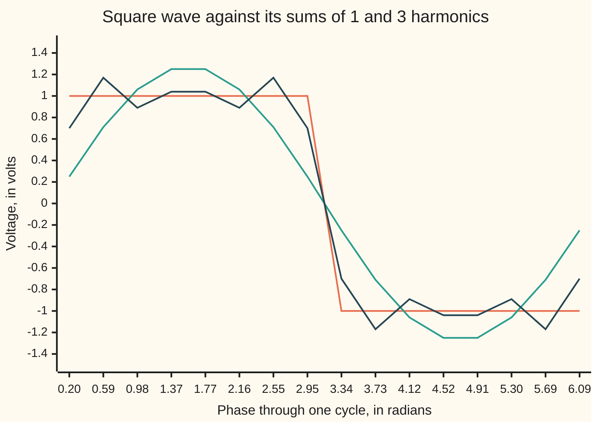

# Fourier series: any repeating signal is a sum of sines and cosines, and orthogonality hands you each coefficient

[Syllabus](../../../SYLLABUS.md) → [Differential equations and dynamics](../../../SYLLABUS.md#w08) → [Fourier Series](../../../SYLLABUS.md#w08-s09) → Fourier series

---

## General Overview

A synthesiser's square-wave oscillator plays A below middle C: 220 cycles a second, so one cycle lasts 4.55 ms. Its output sits at +1 volt for the first half of each cycle and −1 volt for the second. It sounds buzzy and hollow, not like a tuning fork.

A spectrum analyser finds pure tones at 220, 660 and 1100 Hz and every further odd multiple of 220, each quieter than the last. The wave is their sum. The job is to find each tone's loudness from the wave alone.

The trick is geometry's. Along perpendicular axes, a point's position on one axis is its dot product with that axis, whatever the others say. Sines and cosines of whole-number frequencies act as perpendicular axes, with an integral over one cycle as the dot product; perpendicular in this sense is called **orthogonal**. The amounts come out 1.273 volts at 220 Hz, 0.424 at 660 Hz, 0.255 at 1100 Hz.

**A signal that repeats is a sum of sines and cosines at whole multiples of its frequency, and because those waves are orthogonal over one cycle, each amount is a single integral of the signal against that one wave.**

**What kind of fact this is:** a theorem. Orthogonality and the coefficient formulas are proved in Why it works; that the full sum returns the signal is proved in [Convergence](02-convergence-jumps-and-gibbs.md).

### The picture: one harmonic, then three



The flat-topped line is the square wave. The smooth sine is the 220 Hz tone alone, amplitude 1.273. The third line adds the 660 and 1100 Hz tones: already a square, wobbling about 1 volt. Phase 0 to 2π is one cycle of 4.55 ms.

---

## The formula

Notation first. The phase $x$ is the position inside one cycle, in radians: x = 2π × 220 × $t$ for time $t$ in seconds. A subscript counts harmonics: $b_n$ is the amount of the sine repeating $n$ times per cycle. The sigma sign adds the terms for n = 1, 2, 3 and on.

$$f(x) = \frac{a_0}{2} + \sum_{n=1}^{\infty} (a_n \cos nx + b_n \sin nx)$$

$$a_n = \frac{1}{\pi} \int_{-\pi}^{\pi} f(x) \cos nx \, dx, \qquad b_n = \frac{1}{\pi} \int_{-\pi}^{\pi} f(x) \sin nx \, dx$$

**Read it aloud:** the signal is its average level plus, for each whole number n, a cosine and a sine repeating n times per cycle; each amount is the signal times that wave, integrated over a cycle, over π.

What makes it work is orthogonality, for whole numbers $m$ and $n$ of at least 1:

$$\int_{-\pi}^{\pi} \sin mx \sin nx \, dx = \pi \text{ if } m = n, \; 0 \text{ if not}$$

The same holds with cosines for both, and sin mx cos nx always integrates to 0.

**Read it aloud:** two different harmonics multiplied together cancel over a cycle; a harmonic times itself leaves π.

| Symbol | Plain meaning | In our example | Push it up and the answer… |
| --- | --- | --- | --- |
| $x$, $t$ | phase in radians; time in seconds | a cycle: x from 0 to 2π, 4.55 ms | the pattern repeats |
| $f(x)$ | the signal at phase x | +1 V, then −1 V | every amount scales with it |
| $n$, $m$, $k$ | whole numbers of repeats per cycle | n = 1, 3, 5: 220, 660, 1100 Hz | higher pitch, smaller amount |
| $a_0$ | twice the average over a cycle | 0 | the wave lifts |
| $a_n$ | amount of cos nx | 0 for every n | peaks slide earlier |
| $b_n$ | amount of sin nx | 1.273, 0.424, 0.255; 0 for even n | that tone gets louder |
| $S_N$, $N$ | the sum stopped after harmonic N | $S_5(\pi/2)$ = 1.103 V | mean-square miss (integral of the squared gap over a cycle) at N = 1, 3, 5: 1.190, 0.624, 0.421 |

The half in $a_0/2$ lets one formula serve every $a_n$, including n = 0.

### When it holds

- **The signal repeats every 2π in phase.** Any period rescales to 2π, as 4.55 ms does here.
- **Whole-number frequencies over a full cycle.** Step 1 needs sin(kπ) = 0, true only for whole k. Sines at 1 and 1.5 repeats per cycle give 1.600, not 0, so the amounts leak into each other.
- **Finite area under the signal's absolute value over a cycle.** Otherwise the integrals need not exist. Any wave with finitely many jumps passes.
- **The equals sign.** For a signal smooth between finitely many jumps, the sum returns the signal where it is smooth and the midpoint of each jump, 0 here; proved in [Convergence](02-convergence-jumps-and-gibbs.md).

---

## Why it works

### Step 0: an integral over one cycle is a dot product

Sample two signals at many phases, multiply entry by entry, add, and scale by the spacing: a dot product, and in the limit the integral of their product. In [Projection](../../03-Algebra/06-Dot%20Products%20and%20Best%20Fits/02-orthogonal-projection.md), a vector's component along one of several perpendicular axes is its dot product with that axis over the axis's length squared. The steps below prove the harmonics orthogonal, each with length squared π.

### Step 1: a whole-number cosine cancels over a cycle

For whole $k$ not 0, the integral of cos kx from −π to π is sin(kπ)/k − sin(−kπ)/k = 0: the lobes cancel. For $k$ = 0 the cosine is 1 and the integral is 2π. The integral of sin kx is 0 for every whole $k$, since sine is odd (its value at −x is minus its value at x).

### Step 2: a product of two harmonics is two harmonics

The product-to-sum identities of [Trig identities](../../05-Geometry%20and%20trig/03-Trigonometry/03-trig-identities.md) turn each product into a sum:

$$\sin mx \sin nx = \tfrac12[\cos (m-n)x - \cos (m+n)x]$$

Cos mx cos nx is the same with a plus; sin mx cos nx is half of sin (m+n)x plus sin (m−n)x. Integrate each piece by Step 1. Every piece dies except a cosine of frequency 0, which appears only for m = n in the first two, leaving ½ × 2π = π. The code's 20,000-slice sums give 3.141593 and 0.000000.

### Step 3: integrating against one harmonic isolates its amount

Multiply the whole series by sin mx and integrate over a cycle. By Step 2, every cosine term and every sine term with n ≠ m gives 0. Only one term survives, $b_m \pi$:

$$\int_{-\pi}^{\pi} f(x) \sin mx \, dx = b_m \pi$$

Divide by π for $b_n$; cos mx gives $a_n$ the same way. For $m$ = 0 the surviving integral is 2π, not π: hence the half in front of $a_0$.

### Step 4: the square wave

Wave odd, cosine even (its value at −x equals its value at x): the product is odd, so every $a_n$ is 0. The product f(x) sin nx is even, so its integral is twice the half from 0 to π, where f is 1:

$$b_n = \frac{2}{\pi} \int_0^{\pi} \sin nx \, dx = \frac{2}{\pi} \cdot \frac{1 - \cos n\pi}{n} = \begin{cases} 4/(n\pi) & n \text{ odd} \\ 0 & n \text{ even} \end{cases}$$

since cos nπ is −1 for odd n and +1 for even n. The square wave is (4/π)(sin x + sin 3x/3 + sin 5x/5 + …).

<details>
<summary>Detailed proof: why the coefficients are right even where the sum is shaky</summary>

Step 3 swapped an infinite sum with an integral, safe when the largest gap between signal and sum shrinks to 0 (uniform convergence). At a jump it does not. Instead, fix N and ask which amounts $c_1, \ldots, c_N$ make the sum of $c_n \sin nx$ closest to f in mean square: the integral over a cycle of (f minus the sum) squared. By Step 2 the cross terms vanish, so the miss is the integral of f squared plus, for each n, π c_n^2 − 2 c_n times the integral of f sin nx. Each piece is a parabola in c_n, lowest at that integral over π, which is $b_n$. So the Fourier amounts are the best fit at every N. The code's search for N = 1 lands on 1.273240, which is 4/π. That the miss falls to 0 as N grows is completeness, proved in Completeness of sines and cosines.

</details>

Written through e^(inx), both formulas fold into one: [Fourier series](../../07-Complex%20analysis/08-Transforms%20in%20Outline/01-fourier-series-in-complex-form.md), used on this shelf by [The complex form](05-complex-fourier-series-and-the-transform-in-outline.md). The orthogonality is one case of [Sturm-Liouville](../07-Series%20Solutions%20and%20Boundary%20Problems/09-sturm-liouville-and-orthogonality.md).

---

## Worked numbers, by hand

| Step | Arithmetic | Value |
| --- | --- | --- |
| one cycle | 1/220 s | 4.55 ms |
| cosine amounts | odd wave times even cosine cancels | 0 |
| fundamental, 220 Hz | (2/π)(1 − cos π)/1 = 4/π | 1.273240 |
| second harmonic, 440 Hz | (2/π)(1 − cos 2π)/2 | 0 |
| third, 660 Hz | 4/(3π) | 0.424413 |
| fifth, 1100 Hz | 4/(5π) | 0.254648 |
| three harmonics at the top, x = π/2 | (4/π)(1 − 1/3 + 1/5) | **1.103474** |

A quarter-cycle in, three tones give 1.103 volts where the oscillator gives 1. The 660 Hz tone has one third the 220 Hz amplitude; 440 Hz is absent.

### What breaks if you drop a piece

| Mistake | Comes out at | What went wrong |
| --- | --- | --- |
| Sines at 1 and 1.5 repeats per cycle | product integrates to 1.600000, not 0 | not whole multiples: amounts leak into each other |
| Divide by 2π instead of π | fundamental 0.636620, not 1.273240 | a harmonic's length squared is π |
| Fundamental set to the wave's height, 1 V | mean-square miss 1.424778, not 1.190227 | the best amount is the projection |

---

## Code, from first principles, and it actually runs

Three roads reach the amounts: the closed form 4/(nπ); the defining integrals, as a midpoint sum over 20,000 slices of a cycle; and, for the fundamental, a golden-section search for the smallest mean-square miss. The 1.5-frequency cross term is found by the slices and by the identity. Every number and plotted point on the card is printed.

### Python

```python
# Fourier series of a square wave -- the check behind the card.  Standard library
# only.  Road one: the closed form b_n = 4/(n pi).  Road two: integrals over one
# period by a midpoint rule written here.  Road three: best single sine by search.
import math
PI, M = math.pi, 20000                        # M midpoint cells across one period

def f(x):                                     # the wave: +1 for half a cycle, -1 after
    return 1.0 if x % (2 * PI) < PI else -1.0

def integral(g):                              # midpoint rule from -pi to pi
    h = 2 * PI / M
    return h * sum(g(-PI + (i + 0.5) * h) for i in range(M))

def closed_b(n):                              # road one: 4/(n pi) for odd n, 0 for even
    return 4 / (n * PI) if n % 2 else 0.0

def partial(x, top):                          # S_N: the sine terms up to harmonic top
    return sum(closed_b(n) * math.sin(n * x) for n in range(1, top + 1))

def err(g):                                   # mean-square miss: integral of (f - g)^2
    return integral(lambda x: (f(x) - g(x)) ** 2)

def fmt(xs, d=2):
    return ", ".join(f"{v:.{d}f}" for v in xs)

ss = [[integral(lambda x: math.sin(m * x) * math.sin(n * x)) for n in (1, 2, 3)] for m in (1, 2, 3)]
sc = max(abs(integral(lambda x: math.sin(m * x) * math.cos(n * x))) for m in (1, 2, 3) for n in range(4))
cross = integral(lambda x: math.sin(x) * math.sin(1.5 * x))
cross_closed = math.sin(0.5 * PI) / 0.5 - math.sin(2.5 * PI) / 2.5   # product-to-sum
a = [integral(lambda x: f(x) * math.cos(n * x)) / PI for n in range(6)]
b = [integral(lambda x: f(x) * math.sin(n * x)) / PI for n in range(1, 6)]
lo, hi, r = 0.0, 3.0, (math.sqrt(5) - 1) / 2   # road three: golden-section search
for _ in range(40):
    p, q = hi - r * (hi - lo), lo + r * (hi - lo)
    lo, hi = (lo, q) if err(lambda x: p * math.sin(x)) < err(lambda x: q * math.sin(x)) else (p, hi)
best = (lo + hi) / 2
xs = [(k + 0.5) * PI / 8 for k in range(16)]
off = max(abs(ss[m][n]) for m in range(3) for n in range(3) if m != n)
print(f"a 220 Hz tone: harmonics at {fmt([220 * n for n in (1, 3, 5)], 0)} Hz; one cycle lasts {1000 / 220:.2f} ms")
print(f"integral of sin(nx)^2, n = 1..3: {fmt([ss[n][n] for n in range(3)], 6)}; pi = {PI:.6f}")
print(f"largest |integral of sin(mx) sin(nx)|, m not n: {off:.6f}; of sin(mx) cos(nx): {sc:.6f}")
print(f"frequency 1.5, integral of sin(x) sin(1.5x): {cross:.6f} by midpoint, {cross_closed:.6f} by identity")
print(f"largest |a_n|, n = 0..5, by integral: {max(abs(v) for v in a):.6f}")
print(f"b_1, b_3, b_5 by integral: {fmt(b[0::2], 6)}; largest |b_2|, |b_4|: {max(abs(b[1]), abs(b[3])):.6f}")
print("b_1, b_3, b_5 by 4/(n pi):", fmt([closed_b(n) for n in (1, 3, 5)], 6))
print(f"best single sine by search: b = {best:.6f}; 4/pi = {4 / PI:.6f}")
print("mean-square miss with harmonics up to 1, 3, 5:", fmt([err(lambda x: partial(x, t)) for t in (1, 3, 5)], 6))
print(f"mistake, one sine at the wave's height, b = 1: mean-square miss {err(math.sin):.6f}")
print(f"S_5 at x = pi/2: {partial(PI / 2, 5):.6f}")
print(f"mistake, dividing by 2 pi instead of pi: b_1 = {b[0] / 2:.6f}")
print("chart, x in radians:", fmt(xs))
print("chart, S_1:", fmt(partial(x, 1) for x in xs))
print("chart, S_5:", fmt(partial(x, 5) for x in xs))
assert max(abs(ss[n][n] - PI) for n in range(3)) < 1e-6 and off < 1e-9 and sc < 1e-9
assert max(abs(b[n - 1] - closed_b(n)) for n in range(1, 6)) < 1e-6 and max(abs(v) for v in a) < 1e-9
assert abs(best - 4 / PI) < 1e-5                            # search lands on the projection
assert abs(cross - cross_closed) < 1e-6                      # the cross-talk number, two ways
print("ALL CHECKS PASS")
```

**Ran 2026-09-28 on macOS, Python 3.14.6, standard library only. All checks passed. Output, pasted from the run:**

```
a 220 Hz tone: harmonics at 220, 660, 1100 Hz; one cycle lasts 4.55 ms
integral of sin(nx)^2, n = 1..3: 3.141593, 3.141593, 3.141593; pi = 3.141593
largest |integral of sin(mx) sin(nx)|, m not n: 0.000000; of sin(mx) cos(nx): 0.000000
frequency 1.5, integral of sin(x) sin(1.5x): 1.600000 by midpoint, 1.600000 by identity
largest |a_n|, n = 0..5, by integral: 0.000000
b_1, b_3, b_5 by integral: 1.273240, 0.424413, 0.254648; largest |b_2|, |b_4|: 0.000000
b_1, b_3, b_5 by 4/(n pi): 1.273240, 0.424413, 0.254648
best single sine by search: b = 1.273240; 4/pi = 1.273240
mean-square miss with harmonics up to 1, 3, 5: 1.190227, 0.624343, 0.420624
mistake, one sine at the wave's height, b = 1: mean-square miss 1.424778
S_5 at x = pi/2: 1.103474
mistake, dividing by 2 pi instead of pi: b_1 = 0.636620
chart, x in radians: 0.20, 0.59, 0.98, 1.37, 1.77, 2.16, 2.55, 2.95, 3.34, 3.73, 4.12, 4.52, 4.91, 5.30, 5.69, 6.09
chart, S_1: 0.25, 0.71, 1.06, 1.25, 1.25, 1.06, 0.71, 0.25, -0.25, -0.71, -1.06, -1.25, -1.25, -1.06, -0.71, -0.25
chart, S_5: 0.70, 1.17, 0.89, 1.04, 1.04, 0.89, 1.17, 0.70, -0.70, -1.17, -0.89, -1.04, -1.04, -0.89, -1.17, -0.70
ALL CHECKS PASS
```

### Rust

Same numbers, same labels, built with `rustc --edition 2021 -O`.

```rust
// Fourier series of a square wave -- the same check as the Python, in Rust, std
// only.  Road one: the closed form b_n = 4/(n pi).  Road two: integrals over one
// period by a midpoint rule written here.  Road three: best single sine by search.
use std::f64::consts::PI;
const M: usize = 20000;                             // midpoint cells across one period

fn f(x: f64) -> f64 { if x.rem_euclid(2.0 * PI) < PI { 1.0 } else { -1.0 } }

fn integral(g: &dyn Fn(f64) -> f64) -> f64 {       // midpoint rule from -pi to pi
    let h = 2.0 * PI / M as f64;
    h * (0..M).map(|i| g(-PI + (i as f64 + 0.5) * h)).sum::<f64>()
}

fn closed_b(n: usize) -> f64 {                      // road one: 4/(n pi) for odd n, 0 for even
    if n % 2 == 1 { 4.0 / (n as f64 * PI) } else { 0.0 }
}

fn partial(x: f64, top: usize) -> f64 {             // S_N: the sine terms up to harmonic top
    (1..=top).map(|n| closed_b(n) * (n as f64 * x).sin()).sum()
}

fn err(g: &dyn Fn(f64) -> f64) -> f64 {             // mean-square miss: integral of (f - g)^2
    integral(&|x| (f(x) - g(x)).powi(2))
}

fn fmt(xs: &[f64], d: usize) -> String {
    xs.iter().map(|v| format!("{:.*}", d, v)).collect::<Vec<_>>().join(", ")
}

fn main() {
    let mut ss = [[0.0f64; 3]; 3];
    for m in 0..3 { for n in 0..3 {
        ss[m][n] = integral(&|x| ((m + 1) as f64 * x).sin() * ((n + 1) as f64 * x).sin());
    } }
    let mut sc = 0.0f64;
    for m in 1..=3 { for n in 0..4 {
        sc = sc.max(integral(&|x| (m as f64 * x).sin() * (n as f64 * x).cos()).abs());
    } }
    let cross = integral(&|x| x.sin() * (1.5 * x).sin());
    let cross_closed = (0.5 * PI).sin() / 0.5 - (2.5 * PI).sin() / 2.5;   // product-to-sum
    let a: Vec<f64> = (0..6).map(|n| integral(&|x| f(x) * (n as f64 * x).cos()) / PI).collect();
    let b: Vec<f64> = (1..6).map(|n| integral(&|x| f(x) * (n as f64 * x).sin()) / PI).collect();
    let (mut lo, mut hi, r) = (0.0f64, 3.0f64, (5.0f64.sqrt() - 1.0) / 2.0);   // road three
    for _ in 0..40 {
        let (p, q) = (hi - r * (hi - lo), lo + r * (hi - lo));
        if err(&|x| p * x.sin()) < err(&|x| q * x.sin()) { hi = q } else { lo = p }
    }
    let best = (lo + hi) / 2.0;
    let xs: Vec<f64> = (0..16).map(|k| (k as f64 + 0.5) * PI / 8.0).collect();
    let mut off = 0.0f64;
    for m in 0..3 { for n in 0..3 { if m != n { off = off.max(ss[m][n].abs()) } } }
    let amax = a.iter().fold(0.0f64, |acc, v| acc.max(v.abs()));
    let misses: Vec<f64> = [1, 3, 5].iter().map(|&t| err(&|x| partial(x, t))).collect();
    println!("a 220 Hz tone: harmonics at {} Hz; one cycle lasts {:.2} ms", fmt(&[220.0, 660.0, 1100.0], 0), 1000.0 / 220.0);
    println!("integral of sin(nx)^2, n = 1..3: {}; pi = {:.6}", fmt(&[ss[0][0], ss[1][1], ss[2][2]], 6), PI);
    println!("largest |integral of sin(mx) sin(nx)|, m not n: {:.6}; of sin(mx) cos(nx): {:.6}", off, sc);
    println!("frequency 1.5, integral of sin(x) sin(1.5x): {:.6} by midpoint, {:.6} by identity", cross, cross_closed);
    println!("largest |a_n|, n = 0..5, by integral: {:.6}", amax);
    println!("b_1, b_3, b_5 by integral: {}; largest |b_2|, |b_4|: {:.6}", fmt(&[b[0], b[2], b[4]], 6), b[1].abs().max(b[3].abs()));
    println!("b_1, b_3, b_5 by 4/(n pi): {}", fmt(&[closed_b(1), closed_b(3), closed_b(5)], 6));
    println!("best single sine by search: b = {:.6}; 4/pi = {:.6}", best, 4.0 / PI);
    println!("mean-square miss with harmonics up to 1, 3, 5: {}", fmt(&misses, 6));
    println!("mistake, one sine at the wave's height, b = 1: mean-square miss {:.6}", err(&|x: f64| x.sin()));
    println!("S_5 at x = pi/2: {:.6}", partial(PI / 2.0, 5));
    println!("mistake, dividing by 2 pi instead of pi: b_1 = {:.6}", b[0] / 2.0);
    println!("chart, x in radians: {}", fmt(&xs, 2));
    println!("chart, S_1: {}", fmt(&xs.iter().map(|&x| partial(x, 1)).collect::<Vec<_>>(), 2));
    println!("chart, S_5: {}", fmt(&xs.iter().map(|&x| partial(x, 5)).collect::<Vec<_>>(), 2));
    assert!((0..3).all(|n| (ss[n][n] - PI).abs() < 1e-6) && off < 1e-9 && sc < 1e-9);
    assert!((1..6).all(|n| (b[n - 1] - closed_b(n)).abs() < 1e-6) && amax < 1e-9);
    assert!((best - 4.0 / PI).abs() < 1e-5);                  // search lands on the projection
    assert!((cross - cross_closed).abs() < 1e-6);             // the cross-talk number, two ways
    println!("ALL CHECKS PASS");
}
```

**Ran 2026-09-28 on macOS, rustc 1.98.1, no crates. All checks passed. Output, pasted from the run:**

```
a 220 Hz tone: harmonics at 220, 660, 1100 Hz; one cycle lasts 4.55 ms
integral of sin(nx)^2, n = 1..3: 3.141593, 3.141593, 3.141593; pi = 3.141593
largest |integral of sin(mx) sin(nx)|, m not n: 0.000000; of sin(mx) cos(nx): 0.000000
frequency 1.5, integral of sin(x) sin(1.5x): 1.600000 by midpoint, 1.600000 by identity
largest |a_n|, n = 0..5, by integral: 0.000000
b_1, b_3, b_5 by integral: 1.273240, 0.424413, 0.254648; largest |b_2|, |b_4|: 0.000000
b_1, b_3, b_5 by 4/(n pi): 1.273240, 0.424413, 0.254648
best single sine by search: b = 1.273240; 4/pi = 1.273240
mean-square miss with harmonics up to 1, 3, 5: 1.190227, 0.624343, 0.420624
mistake, one sine at the wave's height, b = 1: mean-square miss 1.424778
S_5 at x = pi/2: 1.103474
mistake, dividing by 2 pi instead of pi: b_1 = 0.636620
chart, x in radians: 0.20, 0.59, 0.98, 1.37, 1.77, 2.16, 2.55, 2.95, 3.34, 3.73, 4.12, 4.52, 4.91, 5.30, 5.69, 6.09
chart, S_1: 0.25, 0.71, 1.06, 1.25, 1.25, 1.06, 0.71, 0.25, -0.25, -0.71, -1.06, -1.25, -1.25, -1.06, -0.71, -0.25
chart, S_5: 0.70, 1.17, 0.89, 1.04, 1.04, 0.89, 1.17, 0.70, -0.70, -1.17, -0.89, -1.04, -1.04, -0.89, -1.17, -0.70
ALL CHECKS PASS
```

The two outputs are identical line for line.

> [!TIP]
> **Try changing**
> - **Guess first: do 8 slices still give orthogonality?** Set `M = 8`. Yes, π and 0. But the fifth amount reads 0.541196, not 0.254648: eight samples cannot tell the fifth harmonic from the third. That is aliasing: Sampling. The second assert fails.
> - **Guess first: what does a 0-to-1 volt gate change?** Return `0.0` instead of `-1.0` in `f`. The amounts halve to 0.636620, 0.212207 and 0.127324, and $a_0$ becomes 1.000000. The second assert fails.
> - **Guess first: where does a search over sin 3x land?** Change both `math.sin(x)` in the search loop to `math.sin(3 * x)`. It lands on 0.424413, the third amount. The third assert fails.

---

## The usual mistake

> [!warning]
> **Taking the fundamental's amplitude to be the wave's height.** The wave peaks at 1 volt, but its 220 Hz sine has amplitude 1.273. A sine of height 1 misses more: mean-square 1.424778 against 1.190227. The sine must overshoot to cover the flat top's corners; the projection says how far.
>
> - **Dropping the half on $a_0$.** A 0-to-1 gate's average then reads double.
> - **Expecting every harmonic.** The square wave's even amounts are 0: no 440 Hz.

---

## Where you meet it in real life

- **Synthesisers.** Subtractive synthesis filters upper harmonics off a square wave; cutting above 1100 Hz leaves the chart's third line.
- **Driven oscillators.** A spring pushed by a square-wave force answers each harmonic separately, because its equation is linear and responses add. A spring tuned near 660 Hz rings at the third harmonic, though that harmonic is only 0.424 of the push's height.
- **Heat in a bar.** Fourier built the series in 1822 for heat flow: each sine term cools at its own rate. The sine-only version for a bar: [Half-range series](04-half-range-sine-and-cosine-series.md).
- **Power electronics.** A cheap inverter's square-ish 50 Hz wave carries 150 Hz at one third strength. [Parseval's identity](03-parsevals-identity.md) totals such energy.

> **Say it back**
> A repeating signal is a sum of sines and cosines repeating a whole number of times per cycle. Two different such waves multiplied together cancel over a cycle; one times itself leaves π. So integrating the signal against one wave leaves its amount times π. For the square wave the cosines vanish and the sines have amounts 4/(nπ) at odd n: 1.273, 0.424, 0.255. Those amounts are also the best fit at every length of sum.

---

## What this builds on

- [Sturm-Liouville](../07-Series%20Solutions%20and%20Boundary%20Problems/09-sturm-liouville-and-orthogonality.md): orthogonal eigenfunctions in general.
- [Trig identities](../../05-Geometry%20and%20trig/03-Trigonometry/03-trig-identities.md): product-to-sum, for Step 2.
- [Projection](../../03-Algebra/06-Dot%20Products%20and%20Best%20Fits/02-orthogonal-projection.md): the amount as a projection.
- [Fourier series](../../07-Complex%20analysis/08-Transforms%20in%20Outline/01-fourier-series-in-complex-form.md): the same series with e^(inx).

## Where this goes next

- [Convergence](02-convergence-jumps-and-gibbs.md): when the sum returns the signal, and the overshoot at a jump.
- [Half-range series](04-half-range-sine-and-cosine-series.md): a wave on half a cycle, as sines only or cosines only.
- Sampling: why sampling faster than twice the top harmonic's frequency captures a signal.
- Wavelets: waves confined in time, where sines run for ever.
- Von Neumann analysis: a numerical scheme tested one Fourier mode at a time.
- Orthonormal bases: orthogonality in any space with a dot product.
- Completeness of sines and cosines: why no repeating signal lies outside all harmonics.
- Fourier coefficients: the same amounts, proofs at full strength.

---

## Sources

Verified 2026-09-28: every link below resolves to the publisher's page.

- Tolstov, Georgi P. *Fourier Series*. Dover, 1976. [Publisher page](https://store.doverpublications.com/products/9780486633176). Orthogonality, the coefficient formulas and the square wave, worked slowly.
- Stein, Elias M., and Rami Shakarchi. *Fourier Analysis: An Introduction*. Princeton University Press, 2003. [Publisher page](https://press.princeton.edu/books/hardcover/9780691113845/fourier-analysis). Chapters 1 to 3: the heat-flow origin, and the best-fit property of partial sums.
- MIT OpenCourseWare. *18.03SC Differential Equations*, Unit III: Fourier Series and Laplace Transform. [Course unit](https://ocw.mit.edu/courses/18-03sc-differential-equations-fall-2011/pages/unit-iii-fourier-series-and-laplace-transform/). Fourier series used to solve driven oscillators.
